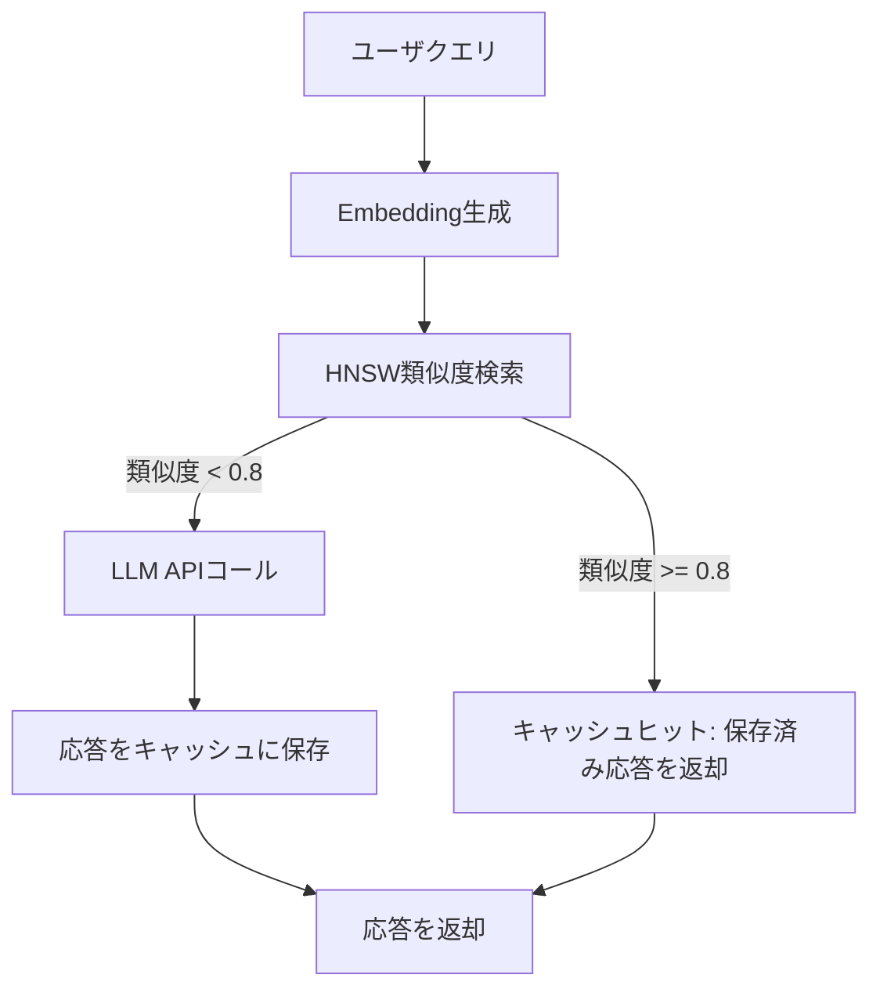

本記事は [https://arxiv.org/abs/2411.05276](https://arxiv.org/abs/2411.05276) の解説記事です。

## 論文概要（Abstract）

LLMアプリケーションにおけるAPIコールのコストとレイテンシを削減するために、セマンティックEmbeddingキャッシュ「GPT Semantic Cache」が提案されている。従来の完全一致キャッシュとは異なり、ユーザクエリをEmbeddingベクトルに変換し、HNSWグラフによる近似最近傍探索とコサイン類似度によるマッチングを行うことで、意味的に類似した過去の応答を再利用する。著者らは4カテゴリ8,000件のQ&Aデータセットで評価を行い、APIコール最大68.8%削減、キャッシュヒット精度92.5%-97.3%を達成したと報告している。

この記事は [Zenn記事: LLMアプリのトークンコスト削減実践：5層最適化で月額80%カットを実現する](https://zenn.dev/0h_n0/articles/2cb1f48834fdda) の深掘りです。

## 情報源

- **arXiv ID**: 2411.05276
- **URL**: [https://arxiv.org/abs/2411.05276](https://arxiv.org/abs/2411.05276)
- **著者**: Sajal Regmi, Chetan Phakami Pun
- **発表年**: 2024
- **分野**: cs.CL（Computation and Language）

## 背景と動機（Background & Motivation）

LLMのAPI利用はトークン課金モデルであり、同一または類似の質問が繰り返されるカスタマーサポートやFAQ分野では冗長なAPIコールがコストを押し上げる。従来のキャッシュ機構は文字列の完全一致に依存しており、「Pythonでリストをソートするには？」と「Pythonのリスト並べ替え方法」のように表現が異なるが意味的に同一のクエリに対応できなかった。

著者らはこの課題に対し、Embeddingベクトル空間での類似度検索を用いたセマンティックキャッシュを提案している。テキストを密ベクトルに変換し、HNSWグラフで高速に近似最近傍探索を行い、Redisによるインメモリ管理とTTLベースの自動失効を組み合わせることで、プロダクション環境での運用を視野に入れた設計となっている。



## 主要な貢献（Key Contributions）

- **貢献1: セマンティックキャッシュアーキテクチャ** — Embeddingベクトル+HNSW+Redisによる意味的類似クエリのキャッシュ機構を設計し、完全一致では捕捉できないキャッシュヒットを実現した
- **貢献2: 閾値ベースのヒット判定** — コサイン類似度閾値0.8を0.6-0.9の範囲で実験的に決定し、精度と再現率のバランスを検証した
- **貢献3: 4カテゴリの包括的評価** — 8,000件Q&Aペアで61.6%-68.8%のキャッシュヒット率と92.5%-97.3%の精度を実証した
- **貢献4: GPT-4o Miniによる検証** — キャッシュヒットの意味的正確性を自動検証するパイプラインを構築した

## 技術的詳細（Technical Details）

### コサイン類似度によるマッチング

2つのクエリベクトル $\mathbf{u}$ と $\mathbf{v}$ の意味的類似度を以下のコサイン類似度で計算する:

$$
\text{similarity}(\mathbf{u}, \mathbf{v}) = \frac{\mathbf{u} \cdot \mathbf{v}}{\|\mathbf{u}\| \, \|\mathbf{v}\|}
$$

ここで、
- $\mathbf{u} \in \mathbb{R}^d$: クエリのEmbeddingベクトル（$d = 384$ for all-MiniLM-L6-v2）
- $\mathbf{v} \in \mathbb{R}^d$: キャッシュ内の既存クエリのEmbeddingベクトル
- $\|\mathbf{u}\|$: ベクトルのL2ノルム

類似度が閾値 $\tau = 0.8$ 以上であればキャッシュヒットと判定する:

$$
\text{hit}(\mathbf{u}, \mathbf{v}) = \begin{cases} \text{True} & \text{if } \text{similarity}(\mathbf{u}, \mathbf{v}) \geq \tau \\ \text{False} & \text{otherwise} \end{cases}
$$

### HNSWアルゴリズム

HNSW（Hierarchical Navigable Small World）はMalkov and Yashunin（2020）による多層グラフ構造の近似最近傍探索アルゴリズムである。最上位レイヤーのエントリーポイントから各レイヤーでgreedy searchを行い、最下位レイヤーで最近傍を返す。全数探索の $O(n)$ に対し $O(\log n)$ の探索複雑度を実現する。

パラメータ $M$（各ノードの最大接続数）と $\text{ef\_construction}$（構築時の候補数）がインデックス品質と構築速度のトレードオフを制御する。著者らは $M=16$、hnswlib-nodeライブラリを使用している。

### アルゴリズム: セマンティックキャッシュ検索

```python
from dataclasses import dataclass, field
import json
import time
from typing import Optional

import numpy as np
import hnswlib
import redis


@dataclass
class CacheEntry:
    """キャッシュエントリ

    Attributes:
        query: 元のクエリ文字列
        response: LLMの応答
        created_at: 作成タイムスタンプ
    """
    query: str
    response: str
    created_at: float = field(default_factory=time.time)


class SemanticCache:
    """Embeddingベクトルのコサイン類似度に基づくLLM応答キャッシュ

    Attributes:
        threshold: コサイン類似度の閾値
        dim: Embeddingベクトルの次元数
        ttl: キャッシュエントリのTTL（秒）
    """

    def __init__(
        self,
        dim: int = 384,
        threshold: float = 0.8,
        max_elements: int = 10_000,
        ttl: int = 3600,
        redis_url: str = "redis://localhost:6379",
    ) -> None:
        """セマンティックキャッシュを初期化する

        Args:
            dim: Embeddingベクトルの次元数
            threshold: コサイン類似度閾値
            max_elements: HNSWインデックスの最大要素数
            ttl: キャッシュTTL（秒）
            redis_url: Redis接続URL
        """
        self.threshold = threshold
        self.dim = dim
        self.ttl = ttl
        self.index = hnswlib.Index(space="cosine", dim=dim)
        self.index.init_index(
            max_elements=max_elements, ef_construction=200, M=16,
        )
        self.index.set_ef(50)
        self.redis_client = redis.from_url(redis_url)
        self._id_counter: int = 0

    def search(self, query_embedding: np.ndarray) -> Optional[CacheEntry]:
        """類似クエリをキャッシュから検索する

        Args:
            query_embedding: クエリのEmbeddingベクトル (shape: [dim])

        Returns:
            類似度が閾値以上の場合はCacheEntry、それ以外はNone
        """
        if self._id_counter == 0:
            return None
        labels, distances = self.index.knn_query(
            query_embedding.reshape(1, -1), k=1,
        )
        similarity = 1.0 - distances[0][0]  # cosine space: 1 - sim
        if similarity >= self.threshold:
            cached = self.redis_client.get(f"sc:{labels[0][0]}")
            if cached is not None:
                data = json.loads(cached)
                return CacheEntry(
                    query=data["query"], response=data["response"],
                    created_at=data["created_at"],
                )
        return None

    def store(self, query: str, embedding: np.ndarray, response: str) -> int:
        """クエリと応答をキャッシュに保存する

        Args:
            query: クエリ文字列
            embedding: Embeddingベクトル
            response: LLM応答

        Returns:
            割り当てられたインデックスID
        """
        idx = self._id_counter
        self._id_counter += 1
        self.index.add_items(embedding.reshape(1, -1), np.array([idx]))
        self.redis_client.setex(
            f"sc:{idx}", self.ttl,
            json.dumps({"query": query, "response": response,
                        "created_at": time.time()}),
        )
        return idx
```

### Embeddingモデルの選択

| モデル | 次元数 | 特徴 |
|--------|--------|------|
| text-embedding-ada-002 | 1536 | OpenAI API経由、高精度 |
| all-MiniLM-L6-v2 | 384 | ローカルONNX実行、メモリ約1/4 |

論文の実験では主にall-MiniLM-L6-v2が使用されている。

## 実装のポイント（Implementation）

### 閾値チューニング

コサイン類似度閾値 $\tau$ はセマンティックキャッシュの性能を左右する最も重要なパラメータである。著者らは0.6-0.9の範囲で実験し以下を報告している:

- **$\tau = 0.6$**: ヒット率は高いがfalse positiveが増加し精度低下
- **$\tau = 0.8$**: 精度92.5%-97.3%を維持しつつヒット率61.6%-68.8%を達成
- **$\tau = 0.9$**: 精度最高だがヒット率が大幅に低下

プロダクションではドメインに応じたチューニングが必須である。コード生成のように厳密な一致が求められるドメインでは0.85-0.9、FAQでは0.75-0.8が適切と考えられる。

### キャッシュ無効化戦略

著者らはTTLベースの自動失効を採用しているが、プロダクションでは以下の追加戦略が必要である:

1. **モデル更新時の一括無効化**: LLMのモデルバージョン変更時にキャッシュをフラッシュ
2. **Embeddingモデル更新時の再構築**: ベクトル空間が変わるためHNSWインデックスの再構築が必要
3. **ドメイン別TTL**: 変化の速い情報（ニュース）は短いTTL、安定した情報（FAQ）は長いTTLを設定

## Production Deployment Guide

本論文のセマンティックキャッシュはRedis + HNSWの軽量構成であり、AWSでの展開に適している。以下のコスト試算は2026年9月時点のAWS東京リージョン料金に基づく概算値である。

### AWS実装パターン（コスト最適化重視）

| 構成 | トラフィック | 主要サービス | 月額概算 |
|------|-------------|-------------|---------|
| Small | ~100 req/日 | Lambda + ElastiCache Serverless + Bedrock | $30-80 |
| Medium | ~1,000 req/日 | ECS Fargate + ElastiCache Redis + Bedrock | $200-500 |
| Large | 10,000+ req/日 | EKS + ElastiCache Cluster + Bedrock PT | $800-1,500 |

**Small構成**: Embedding生成とキャッシュ検索をLambda（ARM64）で実行。ElastiCache Serverless RedisでEmbedding+応答を保存。GPU不要で最もコスト効率が高い。

**Medium構成**: all-MiniLM-L6-v2のONNX推論をECS Fargate常時起動。ElastiCache Redis（cache.r7g.large）でHNSWインデックスとキャッシュデータを管理。

**Large構成**: EKS上にEmbedding生成Pod（CPU）とキャッシュ検索Pod（メモリ最適化）をデプロイ。ElastiCache Redis Cluster（マルチシャード）で水平スケーリング。

**コスト削減テクニック**: キャッシュヒット率60-70%によりBedrock APIコストが同率で削減。ElastiCache Reserved Nodes 1年で40%削減。Lambda ARM64で20%削減。

### Terraformインフラコード

**Small構成（Serverless）**:

```hcl
# Semantic Cache - Small構成: Lambda + ElastiCache Serverless
resource "aws_elasticache_serverless_cache" "semantic_cache" {
  engine = "redis"
  name   = "semantic-cache"
  cache_usage_limits {
    data_storage { maximum = 1; unit = "GB" }
    ecpu_per_second { maximum = 1000 }
  }
  security_group_ids = [aws_security_group.cache.id]
  subnet_ids         = module.vpc.private_subnets
}

resource "aws_lambda_function" "cache_lookup" {
  function_name = "semantic-cache-lookup"
  runtime       = "python3.12"
  handler       = "cache.handler"
  role          = aws_iam_role.cache_lambda.arn
  timeout       = 30
  memory_size   = 512  # ONNX推論用
  architectures = ["arm64"]
  filename      = "lambda/cache.zip"
  environment {
    variables = {
      REDIS_URL            = aws_elasticache_serverless_cache.semantic_cache.endpoint[0].address
      SIMILARITY_THRESHOLD = "0.8"
      CACHE_TTL            = "3600"
    }
  }
  vpc_config {
    subnet_ids         = module.vpc.private_subnets
    security_group_ids = [aws_security_group.lambda.id]
  }
  tracing_config { mode = "Active" }
}

resource "aws_cloudwatch_metric_alarm" "cache_hit_rate" {
  alarm_name          = "semantic-cache-hit-rate-low"
  comparison_operator = "LessThanThreshold"
  evaluation_periods  = 3
  metric_name         = "CacheHitRate"
  namespace           = "SemanticCache"
  period              = 300
  statistic           = "Average"
  threshold           = 50
  alarm_actions       = [aws_sns_topic.alerts.arn]
}
```

**Large構成（EKS + ElastiCache Cluster）**:

```hcl
# Semantic Cache - Large構成: EKS + ElastiCache Cluster
module "eks" {
  source          = "terraform-aws-modules/eks/aws"
  version         = "~> 20.24"
  cluster_name    = "semantic-cache-cluster"
  cluster_version = "1.31"
  vpc_id          = module.vpc.vpc_id
  subnet_ids      = module.vpc.private_subnets
  cluster_endpoint_public_access = false
}

resource "aws_elasticache_replication_group" "semantic_cache" {
  replication_group_id       = "semantic-cache-prod"
  description                = "Semantic cache Redis cluster"
  node_type                  = "cache.r7g.xlarge"
  num_cache_clusters         = 3
  engine_version             = "7.1"
  at_rest_encryption_enabled = true
  transit_encryption_enabled = true
  automatic_failover_enabled = true
  multi_az_enabled           = true
  subnet_group_name          = aws_elasticache_subnet_group.main.name
  security_group_ids         = [aws_security_group.cache.id]
}

resource "aws_budgets_budget" "monthly" {
  name         = "semantic-cache-monthly"
  budget_type  = "COST"
  limit_amount = "2000"; limit_unit = "USD"; time_unit = "MONTHLY"
  notification {
    comparison_operator = "GREATER_THAN"
    threshold           = 80; threshold_type = "PERCENTAGE"
    notification_type   = "ACTUAL"
    subscriber_email_addresses = ["infra-alerts@example.com"]
  }
}
```

### 運用・監視設定

**CloudWatch Logs Insights クエリ**:

```
# キャッシュヒット率の時系列分析
fields @timestamp, cache_hit, similarity_score
| filter event = "cache_lookup"
| stats count(*) as total, sum(cache_hit) as hits,
        avg(similarity_score) as avg_sim by bin(1h)
| sort @timestamp desc
```

**カスタムメトリクス送信（Python）**:

```python
import boto3


def publish_cache_metrics(
    cw: boto3.client,
    hit: bool,
    similarity: float,
    latency_ms: float,
) -> None:
    """キャッシュメトリクスをCloudWatchに送信する

    Args:
        cw: CloudWatch クライアント
        hit: キャッシュヒットしたかどうか
        similarity: コサイン類似度スコア
        latency_ms: キャッシュ検索レイテンシ（ミリ秒）
    """
    cw.put_metric_data(
        Namespace="SemanticCache",
        MetricData=[
            {"MetricName": "CacheHitRate", "Value": 1.0 if hit else 0.0, "Unit": "None"},
            {"MetricName": "SimilarityScore", "Value": similarity, "Unit": "None"},
            {"MetricName": "LookupLatency", "Value": latency_ms, "Unit": "Milliseconds"},
        ],
    )
```

### コスト最適化チェックリスト

**アーキテクチャ選択**:
- [ ] ~100 req/日 → Serverless（Lambda + ElastiCache Serverless）
- [ ] ~1,000 req/日 → Hybrid（ECS Fargate + ElastiCache Redis）
- [ ] 10,000+ req/日 → Container（EKS + ElastiCache Cluster）

**リソース最適化**:
- [ ] Lambda ARM64（Graviton2）で20%コスト削減
- [ ] ElastiCache Reserved Nodes 1年コミット（40%削減）
- [ ] Embeddingモデルをローカル（all-MiniLM-L6-v2）で実行しAPI料金ゼロ化

**LLMコスト削減**:
- [ ] セマンティックキャッシュで60-70%のAPIコール削減
- [ ] Bedrock Batch API（非リアルタイムジョブに50%削減）
- [ ] Prompt Caching有効化（30-90%削減）

**監視・アラート**:
- [ ] AWS Budgets: サービスタグ別月額予算アラート
- [ ] CloudWatch: キャッシュヒット率・類似度スコア・検索レイテンシ
- [ ] Cost Anomaly Detection有効化
- [ ] Redis TTLで古いキャッシュエントリ自動削除

## 実験結果（Results）

著者らは4カテゴリ8,000件のQ&Aペアを用いた評価を報告している。各カテゴリから500件のテストクエリを使用した。

### APIコール削減率

| カテゴリ | テスト数 | キャッシュヒット率 | APIコール削減 |
|---------|---------|-------------------|--------------|
| Python Basics | 500 | 67.0% | 67.0% |
| Technical Support / Network | 500 | 67.0% | 67.0% |
| Order / Shipping | 500 | 68.8% | 68.8% |
| Customer Shopping QA | 500 | 61.6% | 61.6% |

### キャッシュヒット精度

GPT-4o Miniで、キャッシュヒットした応答が元のクエリに対して意味的に正確かどうかを検証した結果:

| カテゴリ | ヒット数 | 正確なヒット | 精度 |
|---------|---------|-------------|------|
| Python Programming | 335 | 310 | 92.5% |
| Network Support | 335 | 326 | 97.3% |
| Order / Shipping | 344 | 331 | 96.2% |
| Shopping QA | 308 | 298 | 96.8% |

Python Programmingの精度が相対的に低い（92.5%）理由として、コード関連クエリは表現上類似していても求められる回答が異なるケース（例:「リストのソート」と「リストの逆順ソート」）が多いことが考えられると著者らは分析している。Network SupportやOrder/Shippingはドメインが限定的であり、類似クエリは同一の回答が適用可能なため精度が高い。全カテゴリの加重平均で精度95.7%を達成している。

## 実運用への応用（Practical Applications）

本論文のセマンティックキャッシュは、Zenn記事で解説されている「5層最適化」の第4層（キャッシュ戦略）に直接対応する。Zenn記事ではセマンティックキャッシュの概念を紹介しているが、本論文はその具体的なアーキテクチャと定量評価を提供している。

プロダクションでの適用シナリオ:

- **カスタマーサポートBot**: 同一製品への質問は類似パターンが多く、ヒット率が最も高い。Order/Shippingカテゴリ（68.8%ヒット率、96.2%精度）がこのシナリオに該当する
- **社内FAQ検索**: 繰り返しの質問が多く、TTLを長く設定（24h-7d）することで高いヒット率が期待できる
- **コード補完**: 精度92.5%が示すようにfalse positiveのリスクが高い。閾値を0.85-0.9に引き上げるか二段階検証が推奨される

著者らが報告している制約: 固定閾値0.8は全ユースケースに最適ではない、大規模データセット（100万件超）でのスケーラビリティが未検証、マルチターン会話のコンテキスト考慮に未対応。

## 関連研究（Related Work）

- **GPTCache（Zilliz, 2023）**: オープンソースのセマンティックキャッシュ。複数バックエンド対応だが、本論文はRedis+HNSW特化でアーキテクチャの簡素さを重視
- **PagedAttention / vLLM（Kwon et al., SOSP 2023）**: GPUメモリ内KVキャッシュの効率化。アプリケーション層の本論文とは異なるレイヤーで補完的に機能
- **HNSW（Malkov and Yashunin, IEEE TPAMI 2020）**: 本論文のコアとなる近似最近傍探索の原論文

## まとめと今後の展望

本論文はEmbeddingベクトルのコサイン類似度とHNSWグラフによるセマンティックキャッシュを提案し、4カテゴリ8,000件のQ&Aデータセットで最大68.8%のAPIコール削減と92.5%-97.3%の精度を実証した。Redis+HNSWによる軽量アーキテクチャはプロダクション環境への導入障壁が低く、特にクエリの重複率が高いドメインで有効である。

今後の研究方向として、ドメイン適応型の動的閾値調整、マルチターン会話対応、キャッシュエントリの鮮度管理、および100万件規模でのスケーラビリティ検証が求められる。実務的にはZenn記事の5層最適化の他の層（プロンプト圧縮、モデル選択ルーティング）との統合が課題となる。

## 参考文献

- **arXiv**: [https://arxiv.org/abs/2411.05276](https://arxiv.org/abs/2411.05276)
- **Related Zenn article**: [https://zenn.dev/0h_n0/articles/2cb1f48834fdda](https://zenn.dev/0h_n0/articles/2cb1f48834fdda)
- **GPTCache**: [https://github.com/zilliztech/GPTCache](https://github.com/zilliztech/GPTCache)
- **HNSW**: Malkov, Y. A. and Yashunin, D. A. "Efficient and Robust Approximate Nearest Neighbor Search Using Hierarchical Navigable Small World Graphs." IEEE TPAMI 2020.
- **vLLM**: Kwon, W., et al. "Efficient Memory Management for Large Language Model Serving with PagedAttention." SOSP 2023.
