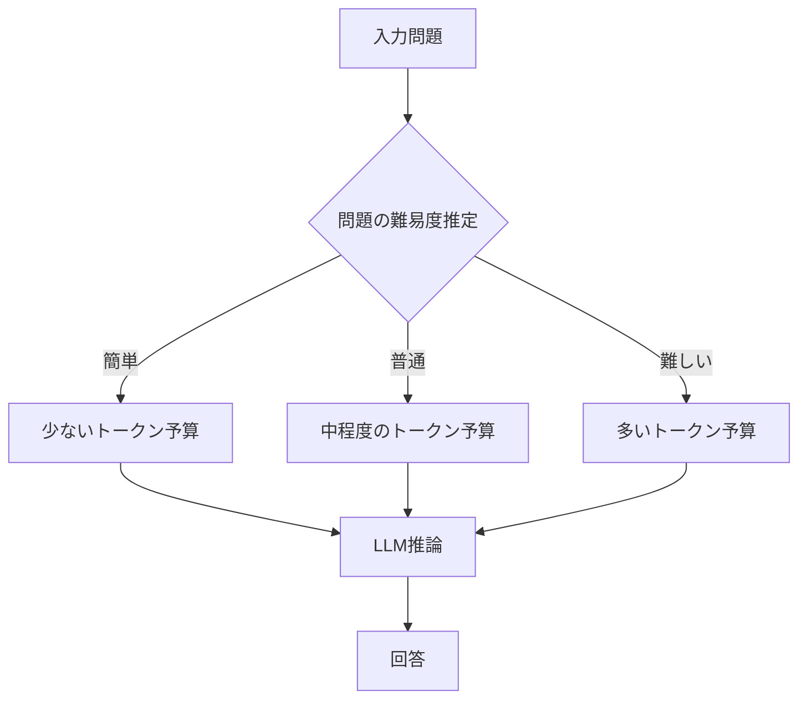
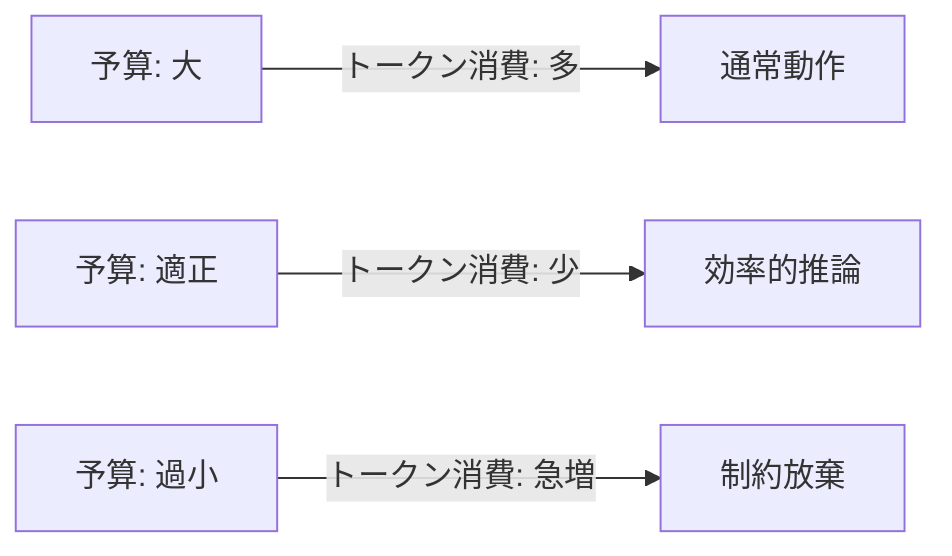
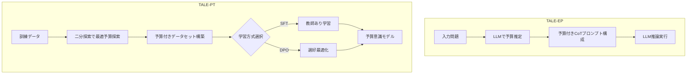

本記事は [https://arxiv.org/abs/2412.18547](https://arxiv.org/abs/2412.18547) の解説記事です。

## 論文概要（Abstract）

Chain-of-Thought（CoT）推論はLLMの推論精度を向上させる一方で、出力トークン数が大幅に増加しAPIコストを押し上げる問題がある。著者らは、各問題の難易度に応じてトークン予算を動的に割り当てるフレームワーク「TALE（Token-Budget-Aware LLM rEasoning）」を提案している。TALEには推論時にプロンプトで予算を制御するTALE-EPと、ファインチューニングで予算意識を学習させるTALE-PTの2つの実装があり、GPT-4o-miniでの実験では平均67%のトークン削減を達成しつつ、精度低下を2.72ポイントに抑えたと報告されている。

この記事は [Zenn記事: LLMアプリのトークンコスト削減実践：5層最適化で月額80%カットを実現する](https://zenn.dev/0h_n0/articles/2cb1f48834fdda) の深掘りです。

## 情報源

- **arXiv ID**: 2412.18547
- **URL**: [https://arxiv.org/abs/2412.18547](https://arxiv.org/abs/2412.18547)
- **著者**: Tingxu Han, Zhenting Wang, Chunrong Fang et al.
- **発表年**: 2024
- **分野**: cs.CL（Computational Linguistics）
- **コード**: [https://github.com/GeniusHTX/TALE](https://github.com/GeniusHTX/TALE)

## 背景と動機（Background & Motivation）

Chain-of-Thought（CoT）プロンプティングは、LLMに「段階的に考えよう」と指示することで数学的推論や論理推論の精度を大幅に向上させる手法である。しかし、CoTの出力は問題の難易度に関係なく長大になりがちで、簡単な問題にも複雑な問題と同程度のトークンを消費する。これはAPIコストの増大とレイテンシの悪化を引き起こす。

例えば、「3 + 5 = ?」のような自明な問題に対してもCoTは数百トークンの推論ステップを生成しうる。著者らはGSM8Kデータセット上でVanilla CoTの平均出力トークン数が318.10トークンであるのに対し、多くの問題ではその1/4以下のトークンで正解に到達可能であることを実験的に示している。

この「トークンの浪費」問題は、Zenn記事で解説した5層最適化モデルの第1層（出力トークン制約）および第5層（計測・最適化）に直結する課題であり、TALEはこの層に対する体系的な解決策を提供するフレームワークである。



## 主要な貢献（Key Contributions）

- **貢献1: トークン予算の動的割当** — 問題の難易度に応じてCoTのトークン予算を動的に調整する枠組みを初めて体系化した。従来のCoTが一律に長い推論を生成するのに対し、TALEは問題ごとに最小限のトークンで正解に到達する予算を割り当てる
- **貢献2: TALE-EP（Estimation & Prompting）** — LLM自身をゼロショットの予算推定器として活用し、追加の学習なしでトークン予算を推定・制御する手法を提案した。API経由のブラックボックスモデルにも適用可能である
- **貢献3: TALE-PT（Post-Training）** — 二分探索アルゴリズムで最適予算を探索し、SFTまたはDPOでモデルにトークン効率を学習させる手法を提案した。オープンソースモデル向けの手法である
- **貢献4: トークン弾性の発見** — 予算を小さくしすぎるとモデルが制約を放棄し、逆にトークン消費が増加する「トークン弾性」現象を発見・報告した
- **貢献5: クロスモデル汎化の検証** — GPT-4o-miniで推定した予算がGPT-4o、o3-miniなど他のモデルでも有効であることを検証した

## 技術的詳細（Technical Details）

### TALE-EP: Estimation & Prompting

TALE-EPは学習不要のアプローチで、2段階のパイプラインから構成される。

**Step 1: Budget Estimation（予算推定）**

LLM自身をエスティメータとして使用し、与えられた問題に対して必要な最小トークン数をゼロショットで推定する。推定プロンプトは以下の形式をとる:

```
Given the following math problem, estimate the minimum number
of tokens needed to solve it step by step.
Problem: {question}
Estimated tokens:
```

この推定は問題の難易度を間接的に測定している。簡単な問題（例: 単純な四則演算）には少ないトークン、複雑な問題（例: 多段階の文章題）には多いトークンが推定される。

**Step 2: Prompt Construction（プロンプト構成）**

推定されたトークン予算$B$を用いて、以下の形式でCoTプロンプトを構成する:

```
Let's think step by step and use less than [B] tokens.
```

この制約をプロンプトに埋め込むことで、LLMは指定されたトークン数以内で推論を完了するよう調整される。

**計算オーバーヘッド**: 予算推定のための追加推論が必要だが、著者らによれば1サンプルあたり約2.3秒のオーバーヘッドであり、Vanilla CoTの10.2秒と比較してトータルの推論時間は短縮される（論文Table 6より）。

### TALE-PT: Post-Training

TALE-PTはオープンソースモデル向けのアプローチで、ファインチューニングによりモデル自体にトークン効率を学習させる。

**Step 1: 最適予算の探索（二分探索）**

各訓練サンプルに対して、正解を維持できる最小のトークン予算を二分探索で特定する。

```python
def find_optimal_budget(
    model: str,
    question: str,
    answer: str,
    max_tokens: int = 512,
    num_trials: int = 5,
) -> int:
    """二分探索で最適トークン予算を探索する

    Args:
        model: 使用するLLMモデル名
        question: 入力質問
        answer: 正解
        max_tokens: 探索上限トークン数
        num_trials: 各予算での試行回数

    Returns:
        正解を維持できる最小トークン予算
    """
    low, high = 1, max_tokens
    optimal = max_tokens

    while low <= high:
        mid = (low + high) // 2
        # midトークン以内で正解できるか試行
        correct_count = sum(
            evaluate(model, question, budget=mid) == answer
            for _ in range(num_trials)
        )
        if correct_count >= num_trials * 0.6:  # 60%以上正解
            optimal = mid
            high = mid - 1
        else:
            low = mid + 1

    return optimal
```

この探索により、各問題に対する「最小必要予算」が決定される。探索の収束条件として、著者らは60%以上の試行で正解できることを基準としている。

**Step 2: Post-Training**

探索で得られた最適予算付きのデータセットを用いて、2つの学習方式が提案されている。

**SFT（Supervised Fine-Tuning）損失関数:**

$$
\mathcal{L}_{CE}(\theta) = -\frac{1}{N} \sum_{i=1}^{N} \sum_{t=1}^{T_i} \log P_\theta(y_{i,t} \mid y_{i,<t}, x_i)
$$

ここで、
- $N$: 訓練サンプル数
- $x_i$: $i$番目の入力（問題 + トークン予算制約）
- $y_{i,t}$: $i$番目のサンプルの$t$番目の出力トークン
- $y_{i,<t}$: $t$番目より前の出力トークン列
- $T_i$: $i$番目のサンプルの出力長
- $\theta$: モデルパラメータ

入力$x_i$には予算制約「use less than $B_i$ tokens」が含まれるため、モデルは予算制約に従って推論を生成する能力を学習する。

**DPO（Direct Preference Optimization）損失関数:**

$$
\mathcal{L}_{DPO}(\theta) = -\frac{1}{N} \sum_{i=1}^{N} \log \sigma \left( \beta \log \frac{P_\theta(y_i^w \mid x_i)}{P_{\text{ref}}(y_i^w \mid x_i)} - \beta \log \frac{P_\theta(y_i^l \mid x_i)}{P_{\text{ref}}(y_i^l \mid x_i)} \right)
$$

ここで、
- $y_i^w$: 予算制約内で正解した出力（preferred response）
- $y_i^l$: 予算超過または不正解の出力（dispreferred response）
- $P_{\text{ref}}$: 参照モデル（学習前のモデル）の確率
- $\sigma$: シグモイド関数
- $\beta$: 温度パラメータ

DPOでは、短い正解出力を「好ましい」、長い出力や不正解出力を「好ましくない」として対比学習を行う。

### トークン弾性（Token Elasticity）

著者らは興味深い現象として「トークン弾性」を報告している。予算を小さくしていくと、ある閾値を超えた時点でモデルが予算制約を無視し始め、逆にトークン消費が増加する現象が観測された。



この現象は全テストで90.91%の割合で「暗黙の単調性」として成立すると報告されている。すなわち、予算を適切な範囲で設定すれば、予算が小さいほど出力トークンも少なくなるが、過度に小さい予算は逆効果となる。この知見は実運用でトークン予算を設定する際の重要な設計指針となる。

### アルゴリズム全体像

TALEフレームワーク全体の処理フローを以下に示す。



## 実装のポイント（Implementation）

### 予算推定の精度と安定性

TALE-EPの予算推定は確定的な値を返すわけではなく、LLMの出力に依存するため推定値にはばらつきがある。実装時は以下の点に注意が必要である。

1. **推定値のクリッピング**: 極端に小さい値（例: 5トークン以下）や極端に大きい値はクリッピングする
2. **安全マージン**: 推定値に対して10-20%の安全マージンを加えることで、予算不足による精度低下を防ぐ
3. **トークン弾性の回避**: 最小予算閾値を設定し、それ以下の予算を割り当てないことで弾性現象を回避する

```python
def apply_budget_with_safety(
    estimated_budget: int,
    min_budget: int = 20,
    max_budget: int = 1024,
    safety_margin: float = 0.15,
) -> int:
    """推定予算に安全マージンを適用する

    Args:
        estimated_budget: LLMが推定した予算
        min_budget: 最小予算（トークン弾性回避）
        max_budget: 最大予算
        safety_margin: 安全マージン比率

    Returns:
        安全マージン適用後の予算
    """
    budget_with_margin = int(estimated_budget * (1.0 + safety_margin))
    return max(min_budget, min(budget_with_margin, max_budget))
```

### クロスモデル転用

著者らの実験では、GPT-4o-miniで推定した予算がGPT-4oやo3-miniでも有効であることが示されている（論文Table 4より）。これは実運用上大きな利点で、安価なモデルで予算推定を行い、高性能なモデルで推論を実行するパイプラインが構築できる。

```python
from openai import OpenAI

def tale_ep_cross_model(
    question: str,
    estimator_model: str = "gpt-4o-mini",
    reasoning_model: str = "gpt-4o",
    safety_margin: float = 0.15,
) -> str:
    """クロスモデルTALE-EP実装

    安価なモデルで予算推定し、高性能モデルで推論する

    Args:
        question: 入力問題
        estimator_model: 予算推定に使用するモデル
        reasoning_model: 推論に使用するモデル
        safety_margin: 安全マージン比率

    Returns:
        推論結果の文字列
    """
    client = OpenAI()

    # Step 1: 予算推定（安価なモデル）
    estimate_resp = client.chat.completions.create(
        model=estimator_model,
        messages=[{
            "role": "user",
            "content": (
                f"Estimate the minimum number of tokens needed "
                f"to solve this step by step.\n"
                f"Problem: {question}\n"
                f"Output only a number."
            ),
        }],
        max_tokens=10,
    )
    estimated_budget = int(estimate_resp.choices[0].message.content.strip())
    budget = apply_budget_with_safety(
        estimated_budget, safety_margin=safety_margin
    )

    # Step 2: 予算制約付き推論（高性能モデル）
    reasoning_resp = client.chat.completions.create(
        model=reasoning_model,
        messages=[{
            "role": "user",
            "content": (
                f"{question}\n\n"
                f"Let's think step by step and use less than "
                f"{budget} tokens."
            ),
        }],
        max_tokens=budget,
    )
    return reasoning_resp.choices[0].message.content
```

## Production Deployment Guide

TALEはLLM推論のトークンコストを削減するフレームワークであり、APIコールが多い本番環境で直接的なコスト削減効果を発揮する。以下では、TALE-EPをAWS上でプロダクション運用する構成を解説する。

### AWS実装パターン（コスト最適化重視）

TALEの特性上、2段階のLLMコール（予算推定 + 推論実行）が発生するため、それぞれを効率的に処理するアーキテクチャが求められる。

**トラフィック量別の推奨構成**:

| 構成 | トラフィック | サービス | 月額コスト |
|------|------------|----------|-----------|
| Small | ~100 req/日 | Lambda + Bedrock | $50-150 |
| Medium | ~1,000 req/日 | ECS Fargate + Bedrock | $300-800 |
| Large | 10,000+ req/日 | EKS + Spot + SageMaker | $2,000-5,000 |

**Small構成（~100 req/日）**:
- Lambda関数で予算推定と推論実行を逐次処理
- Bedrock（Claude/Titan）でLLM推論
- DynamoDB On-Demandで予算推定キャッシュ（同一問題パターンの再推定を回避）
- 月額内訳: Lambda $5 + Bedrock $30-120 + DynamoDB $5 + CloudWatch $10

**Medium構成（~1,000 req/日）**:
- ECS Fargate（0.5 vCPU, 1GB RAM x 2タスク）でバッチ処理
- 予算推定とLLM推論を非同期パイプライン化（SQS分離）
- ElastiCache Redisで予算推定結果をキャッシュ
- 月額内訳: Fargate $30 + Bedrock $200-600 + Redis $25 + SQS $5

**Large構成（10,000+ req/日）**:
- EKS + Karpenter（Spot優先）で水平スケーリング
- SageMakerエンドポイントでTALE-PT学習済みモデルをホスト
- 予算推定を軽量モデル、推論を高性能モデルに分離（クロスモデル構成）
- 月額内訳: EKS $70 + Spot Instances $500-1,500 + SageMaker $800-2,500 + 周辺 $200

**コスト削減テクニック**:
- Spot Instances活用でEKSワーカーノードを最大90%削減
- Reserved Instances（1年コミット）でSageMakerを最大72%削減
- Bedrock Batch API使用で推論コスト50%削減（バッチ処理可能な場合）
- Prompt Caching有効化で予算推定の30-90%削減（同一パターンの問題）
- TALE自体のトークン削減効果（67%削減）がBedrockのトークン課金に直接反映

> **注意**: 上記コスト試算は2026年9月時点のAWS ap-northeast-1（東京）リージョン料金に基づく概算値です。実際のコストはトラフィックパターン、リージョン、バースト使用量により変動します。最新料金は[AWS料金計算ツール](https://calculator.aws/)で確認してください。

### Terraformインフラコード

**Small構成（Serverless）: Lambda + Bedrock + DynamoDB**

```hcl
# --- Small構成: TALE-EP Serverless ---
# Lambda + Bedrock + DynamoDB

terraform {
  required_version = ">= 1.9"
  required_providers {
    aws = {
      source  = "hashicorp/aws"
      version = "~> 5.60"
    }
  }
}

provider "aws" {
  region = "ap-northeast-1"
}

# DynamoDB: 予算推定キャッシュ（On-Demand でコスト最適化）
resource "aws_dynamodb_table" "budget_cache" {
  name         = "tale-budget-cache"
  billing_mode = "PAY_PER_REQUEST"
  hash_key     = "question_hash"

  attribute {
    name = "question_hash"
    type = "S"
  }

  ttl {
    attribute_name = "expires_at"
    enabled        = true
  }

  server_side_encryption {
    enabled = true  # KMS暗号化
  }

  tags = {
    Project = "tale-ep"
    Env     = "prod"
  }
}

# IAMロール: Lambda用（最小権限）
resource "aws_iam_role" "lambda_role" {
  name = "tale-ep-lambda-role"

  assume_role_policy = jsonencode({
    Version = "2012-10-17"
    Statement = [{
      Action = "sts:AssumeRole"
      Effect = "Allow"
      Principal = { Service = "lambda.amazonaws.com" }
    }]
  })
}

resource "aws_iam_role_policy" "lambda_policy" {
  name = "tale-ep-lambda-policy"
  role = aws_iam_role.lambda_role.id

  policy = jsonencode({
    Version = "2012-10-17"
    Statement = [
      {
        Effect   = "Allow"
        Action   = ["bedrock:InvokeModel"]
        Resource = "arn:aws:bedrock:ap-northeast-1::foundation-model/*"
      },
      {
        Effect = "Allow"
        Action = [
          "dynamodb:GetItem",
          "dynamodb:PutItem",
          "dynamodb:Query"
        ]
        Resource = aws_dynamodb_table.budget_cache.arn
      },
      {
        Effect = "Allow"
        Action = [
          "logs:CreateLogGroup",
          "logs:CreateLogStream",
          "logs:PutLogEvents"
        ]
        Resource = "arn:aws:logs:*:*:*"
      }
    ]
  })
}

# Lambda関数
resource "aws_lambda_function" "tale_ep" {
  function_name = "tale-ep-inference"
  runtime       = "python3.12"
  handler       = "handler.lambda_handler"
  role          = aws_iam_role.lambda_role.arn
  timeout       = 120  # 2段階LLMコール対応
  memory_size   = 256

  filename         = "lambda.zip"
  source_code_hash = filebase64sha256("lambda.zip")

  environment {
    variables = {
      BUDGET_CACHE_TABLE = aws_dynamodb_table.budget_cache.name
      ESTIMATOR_MODEL    = "anthropic.claude-3-haiku-20240307-v1:0"
      REASONING_MODEL    = "anthropic.claude-3-5-sonnet-20241022-v2:0"
      SAFETY_MARGIN      = "0.15"
    }
  }

  tracing_config {
    mode = "Active"  # X-Ray トレーシング
  }

  tags = {
    Project = "tale-ep"
  }
}

# CloudWatchアラーム: コスト監視
resource "aws_cloudwatch_metric_alarm" "lambda_duration" {
  alarm_name          = "tale-ep-high-duration"
  comparison_operator = "GreaterThanThreshold"
  evaluation_periods  = 3
  metric_name         = "Duration"
  namespace           = "AWS/Lambda"
  period              = 300
  statistic           = "Average"
  threshold           = 60000  # 60秒超過でアラート
  alarm_actions       = []     # SNSトピックARNを設定

  dimensions = {
    FunctionName = aws_lambda_function.tale_ep.function_name
  }
}
```

**Large構成（Container）: EKS + Karpenter + Spot Instances**

```hcl
# --- Large構成: TALE-EP Container ---
# EKS + Karpenter + Spot Instances

module "eks" {
  source  = "terraform-aws-modules/eks/aws"
  version = "~> 20.24"

  cluster_name    = "tale-ep-cluster"
  cluster_version = "1.31"

  vpc_id     = module.vpc.vpc_id
  subnet_ids = module.vpc.private_subnets

  # Karpenter用IRSA
  enable_irpod_identity = true

  eks_managed_node_groups = {
    system = {
      instance_types = ["t3.medium"]
      min_size       = 1
      max_size       = 2
      desired_size   = 1
    }
  }

  tags = {
    Project = "tale-ep"
    Env     = "prod"
  }
}

# Karpenter Provisioner: Spot優先で90%コスト削減
resource "kubectl_manifest" "karpenter_nodepool" {
  yaml_body = yamlencode({
    apiVersion = "karpenter.sh/v1"
    kind       = "NodePool"
    metadata   = { name = "tale-ep-pool" }
    spec = {
      template = {
        spec = {
          requirements = [
            {
              key      = "karpenter.sh/capacity-type"
              operator = "In"
              values   = ["spot", "on-demand"]  # Spot優先
            },
            {
              key      = "node.kubernetes.io/instance-type"
              operator = "In"
              values   = ["c6i.xlarge", "c6i.2xlarge", "c7i.xlarge"]
            }
          ]
        }
      }
      limits = {
        cpu    = "64"
        memory = "128Gi"
      }
    }
  })
}

# Secrets Manager: Bedrock設定
resource "aws_secretsmanager_secret" "bedrock_config" {
  name                    = "tale-ep/bedrock-config"
  recovery_window_in_days = 7
}

# AWS Budgets: 予算アラート
resource "aws_budgets_budget" "tale_monthly" {
  name         = "tale-ep-monthly"
  budget_type  = "COST"
  limit_amount = "5000"
  limit_unit   = "USD"
  time_unit    = "MONTHLY"

  notification {
    comparison_operator       = "GREATER_THAN"
    threshold                 = 80
    threshold_type            = "PERCENTAGE"
    notification_type         = "ACTUAL"
    subscriber_email_addresses = ["alerts@example.com"]
  }
}
```

### 運用・監視設定

**CloudWatch Logs Insights: トークン使用量分析クエリ**

```
# 1時間あたりのトークン使用量とコスト異常検知
fields @timestamp, estimated_budget, actual_tokens, cost_usd
| stats avg(estimated_budget) as avg_budget,
        avg(actual_tokens) as avg_actual,
        sum(cost_usd) as total_cost,
        count(*) as request_count
  by bin(1h)
| filter total_cost > 10
| sort @timestamp desc
```

**CloudWatchアラーム設定（Python）**:

```python
import boto3

def setup_tale_alarms(
    function_name: str,
    sns_topic_arn: str,
    token_threshold: int = 10000,
) -> None:
    """TALE-EP用CloudWatchアラームを設定する

    Args:
        function_name: Lambda関数名
        sns_topic_arn: 通知先SNSトピックARN
        token_threshold: 1時間あたりトークン使用量閾値
    """
    cw = boto3.client("cloudwatch")

    # Bedrockトークン使用量スパイク検知
    cw.put_metric_alarm(
        AlarmName=f"{function_name}-token-spike",
        MetricName="OutputTokenCount",
        Namespace="Custom/TALE",
        Statistic="Sum",
        Period=3600,
        EvaluationPeriods=1,
        Threshold=token_threshold,
        ComparisonOperator="GreaterThanThreshold",
        AlarmActions=[sns_topic_arn],
    )
```

**X-Rayトレーシング設定（Python）**:

```python
from aws_xray_sdk.core import xray_recorder, patch_all

# boto3自動計装
patch_all()

@xray_recorder.capture("tale_ep_inference")
def tale_inference(question: str) -> dict:
    """TALE-EP推論をX-Rayトレースする

    Args:
        question: 入力問題

    Returns:
        推論結果と計測メタデータ
    """
    segment = xray_recorder.current_subsegment()
    segment.put_annotation("model", "gpt-4o-mini")
    segment.put_metadata("question_length", len(question))

    budget = estimate_budget(question)
    segment.put_annotation("estimated_budget", budget)

    result = run_reasoning(question, budget)
    segment.put_annotation("actual_tokens", result["usage"]["total_tokens"])

    return result
```

**Cost Explorer日次レポート（Python）**:

```python
import boto3
from datetime import date, timedelta

def daily_cost_report(sns_topic_arn: str, threshold: float = 100.0) -> None:
    """日次コストレポートを取得し閾値超過時にSNS通知

    Args:
        sns_topic_arn: 通知先SNSトピックARN
        threshold: 日次コスト閾値（USD）
    """
    ce = boto3.client("ce")
    today = date.today()
    yesterday = today - timedelta(days=1)

    resp = ce.get_cost_and_usage(
        TimePeriod={
            "Start": yesterday.isoformat(),
            "End": today.isoformat(),
        },
        Granularity="DAILY",
        Metrics=["BlendedCost"],
        Filter={
            "Tags": {
                "Key": "Project",
                "Values": ["tale-ep"],
            }
        },
        GroupBy=[{"Type": "DIMENSION", "Key": "SERVICE"}],
    )

    total = sum(
        float(g["Metrics"]["BlendedCost"]["Amount"])
        for group in resp["ResultsByTime"]
        for g in group["Groups"]
    )

    if total > threshold:
        sns = boto3.client("sns")
        sns.publish(
            TopicArn=sns_topic_arn,
            Subject=f"TALE-EP Cost Alert: ${total:.2f}/day",
            Message=f"日次コスト${total:.2f}が閾値${threshold}を超過",
        )
```

### コスト最適化チェックリスト

**アーキテクチャ選択**:
- [ ] トラフィック量に応じた構成選択（Small: Serverless / Medium: Hybrid / Large: Container）
- [ ] バッチ処理可能な場合はBedrock Batch APIを検討

**リソース最適化**:
- [ ] EC2/EKS: Spot Instances優先（最大90%削減）
- [ ] Reserved Instances: 1年コミットで最大72%削減
- [ ] Savings Plans: コンピュート使用量の予測に基づき検討
- [ ] Lambda: メモリサイズ最適化（Power Tuningで測定）
- [ ] ECS/EKS: アイドル時間帯のスケールダウン設定

**LLMコスト削減（TALE固有）**:
- [ ] TALE-EP適用でトークン67%削減
- [ ] 予算推定を安価なモデル（Haiku/Mini）で実行
- [ ] 予算推定結果のDynamoDBキャッシュ（同一パターンの再推定回避）
- [ ] Prompt Caching有効化（Bedrock/Anthropic API）
- [ ] トークン弾性の最小予算閾値設定

**監視・アラート**:
- [ ] AWS Budgets: 月次予算アラート設定
- [ ] CloudWatch: トークン使用量のカスタムメトリクス
- [ ] Cost Anomaly Detection: 自動異常検知
- [ ] 日次コストレポートのSNS通知

**リソース管理**:
- [ ] 未使用のSageMakerエンドポイント削除
- [ ] コストタグ戦略（Project, Env, Owner）
- [ ] DynamoDB TTLによる古いキャッシュの自動削除
- [ ] 開発環境の夜間・週末停止（EventBridge Scheduler）
- [ ] CloudWatch Logsのログ保持期間設定（30日推奨）

## 実験結果（Results）

### TALE-EP: GPT-4o-miniでの評価

著者らはGSM8Kを含む複数の数学推論データセットでTALE-EPを評価している（論文Table 3より）。

| Dataset | Method | Accuracy | Output Tokens | Cost ($\times 10^{-5}$/sample) |
|---------|--------|----------|--------------|-------------------------------|
| GSM8K | Vanilla CoT | 81.35% | 318.10 | 541.09 |
| GSM8K | TALE-EP | 84.46% | 77.26 | 279.84 |
| GSM8K-Zero | Vanilla CoT | 99.50% | 252.96 | 886.79 |
| GSM8K-Zero | TALE-EP | 98.72% | 22.67 | 276.12 |
| **Average** | **Vanilla CoT** | **83.75%** | **461.25** | **289.78** |
| **Average** | **TALE-EP** | **81.03%** | **148.72** | **118.46** |

全データセット平均で、TALE-EPはVanilla CoTに対して出力トークンを67%削減（461.25 → 148.72トークン）しつつ、精度低下を2.72ポイント（83.75% → 81.03%）に抑えている。GSM8Kでは逆にTALE-EPが精度で上回っている点は注目に値する。著者らはこれについて、予算制約が冗長な推論ステップを抑制し、核心的な推論に集中させる効果があると分析している。

### クロスモデル汎化

GPT-4o-miniで推定した予算を他のモデルに適用した結果が報告されている（論文Table 4より）。

| Model | Method | Accuracy (MathBench-College) | Output Tokens |
|-------|--------|-----|--------------|
| GPT-4o | Vanilla CoT | 84.00% | 602 |
| GPT-4o | TALE-EP | 80.00% | 182 |
| o3-mini | Vanilla CoT | 97.33% | 1,164 |
| o3-mini | TALE-EP | 96.66% | 678 |

クロスモデル適用で平均64.63%のトークン削減、45.30%のコスト削減が達成されている。特にo3-miniでは精度低下がわずか0.67ポイントであり、高性能モデルほどトークン予算制約への適応力が高いことが示唆される。

### TALE-PT: Llama-3.1-8Bでの評価

オープンソースモデルLlama-3.1-8B-Instructを用いたTALE-PTの結果は以下のとおりである（論文Table 5より）。

| Dataset | Method | Accuracy | Output Tokens |
|---------|--------|----------|--------------|
| GSM8K | Vanilla CoT | 77.56% | 241 |
| GSM8K | TALE-PT (SFT) | 78.57% | 140 |
| GSM8K | TALE-PT (DPO) | 74.11% | 150 |
| GSM8K-Zero | Vanilla CoT | 65.04% | 251 |
| GSM8K-Zero | TALE-PT (SFT) | 78.43% | 78 |

SFTはGSM8Kで精度を1.01ポイント改善しつつトークンを42%削減しており、DPOよりも安定した結果を示している。GSM8K-ZeroではSFTの精度が13.39ポイント改善と大幅な向上が見られ、予算制約付き学習が推論の質そのものを向上させる可能性が示唆されている。

## 実運用への応用（Practical Applications）

### LLMアプリケーションのコスト最適化

TALEはZenn記事で解説した5層最適化モデルの複数層に直接適用できる。

**第1層（出力トークン制約）への適用**: TALE-EPのプロンプト制約は、`max_tokens`パラメータの静的設定を動的な予算割当に置き換える。従来は全リクエストに一律の`max_tokens`を設定していたが、TALEにより問題の難易度に応じた適応的な制約が可能になる。

**第5層（計測・最適化）への適用**: TALE-EPの予算推定ステップは、トークン消費の予測に活用できる。推定予算と実際の消費トークンの差分を計測することで、コスト予測の精度向上とアノマリ検知が実現する。

### バッチ処理パイプラインでの活用

大量のドキュメント処理やデータ抽出タスクでは、入力データの複雑さにばらつきがある。TALEを適用することで、簡単なデータには少ないトークンを、複雑なデータには多いトークンを動的に割り当て、全体の処理コストを最適化できる。

### 推論チェーンの段階的最適化

複数のLLMコールを連鎖させるパイプライン（例: RAGの要約 → 回答生成）では、各ステップにTALE-EPを適用することで累積的なトークン削減が見込める。3段階のパイプラインで各ステップ50%削減を達成すれば、全体では87.5%の削減となる。

## 関連研究（Related Work）

- **Self-Consistency（Wang et al., 2023）**: 複数のCoTパスをサンプリングし多数決で回答する手法。精度は向上するがトークン消費は倍増する。TALEはトークン効率の改善という逆方向のアプローチであり、Self-Consistencyと組み合わせることで精度とコストのバランスを調整できる
- **Skeleton-of-Thought（Ning et al., 2024）**: LLMの出力を骨格と詳細に分離し、並列生成でレイテンシを削減する手法。レイテンシ削減が主目的でありトークン総量の削減は二次的。TALEはトークン総量の直接的な削減に焦点を当てている点で相補的
- **Step-Back Prompting（Zheng et al., 2024）**: 問題を抽象化してから具体的に推論するメタ推論手法。推論の質を向上させるがトークン消費は増加する。TALEと組み合わせて「質の高い推論を予算制約内で実行する」ハイブリッドアプローチが考えられる

## まとめと今後の展望

TALEは、CoT推論のトークン消費を問題の難易度に応じて動的に制御するフレームワークであり、TALE-EP（プロンプトベース）とTALE-PT（ファインチューニングベース）の2つの実装が提案されている。GPT-4o-miniでの実験では、67%のトークン削減を精度2.72ポイントの低下のみで達成している。

実務上の示唆として、TALE-EPはAPI経由のブラックボックスモデルに即座に適用可能であり、追加のインフラ投資なしにコスト削減を実現できる。クロスモデル汎化が確認されている点も、安価なモデルで予算推定を行い高性能モデルで推論する運用パターンを可能にする。

今後の研究方向として、著者らはトークン弾性現象のメカニズム解明、マルチモーダルタスクへの拡張、および推論品質を保証する予算下限の理論的分析を挙げている。

## 参考文献

- **arXiv**: [https://arxiv.org/abs/2412.18547](https://arxiv.org/abs/2412.18547)
- **Code**: [https://github.com/GeniusHTX/TALE](https://github.com/GeniusHTX/TALE)
- **Related Zenn article**: [https://zenn.dev/0h_n0/articles/2cb1f48834fdda](https://zenn.dev/0h_n0/articles/2cb1f48834fdda)
