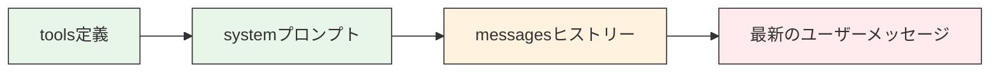
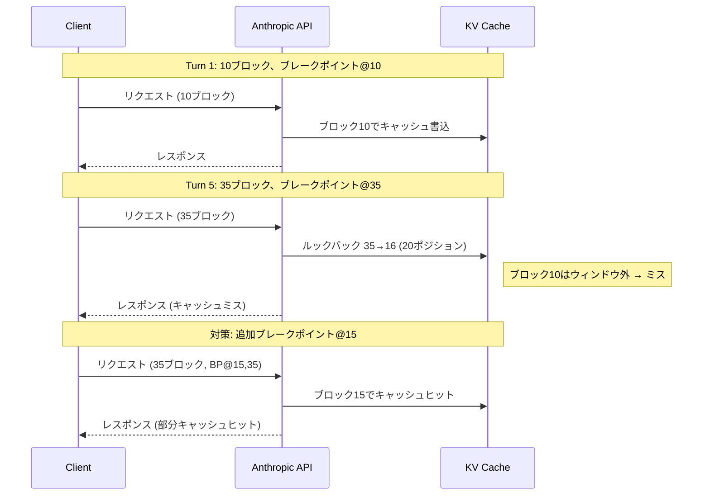

## ブログ概要（Summary）

本記事は [https://www.anthropic.com/news/prompt-caching](https://www.anthropic.com/news/prompt-caching) の解説記事です。

Anthropicは2024年8月14日にプロンプトキャッシュ機能をベータとして公開し、同年12月17日にGA（一般提供）を開始した。プロンプトキャッシュは、APIコール間で頻繁に参照されるコンテキストをキャッシュすることで、入力トークンのコストを最大90%、レイテンシを最大85%削減する機能である。長大なシステムプロンプトやドキュメントを繰り返しAPIに送信するユースケースにおいて、同一プレフィックスの再計算を省略することでコスト効率と応答速度の両方を改善する。

この記事は [Zenn記事: LLMアプリのトークンコスト削減実践：5層最適化で月額80%カットを実現する](https://zenn.dev/0h_n0/articles/2cb1f48834fdda) の深掘りです。

## 情報源

- **種別**: 企業テックブログ
- **URL**: [https://www.anthropic.com/news/prompt-caching](https://www.anthropic.com/news/prompt-caching)
- **組織**: Anthropic
- **公開日**: 2024年8月14日（Beta）/ 2024年12月17日（GA）

## 技術的背景（Technical Background）

### なぜプロンプトキャッシュが必要か

LLMのAPI利用において、トークンコストは運用費用の大部分を占める。特にRAGパイプライン、マルチターン会話、コーディングアシスタントなど、長大なコンテキストを繰り返し送信するユースケースでは、同一のシステムプロンプトやドキュメントが毎回フルに処理される。これは計算資源の無駄であり、コストとレイテンシの双方に悪影響を与える。

Transformerアーキテクチャにおいて、入力トークンの処理はSelf-Attention計算のためのKey-Value（KV）ペアの生成を含む。各レイヤーで入力トークン列から以下の計算が行われる。

$$
K = XW_K, \quad V = XW_V
$$

ここで、
- $X$: 入力トークンの埋め込み行列（形状: $(n, d_{\text{model}})$）
- $W_K, W_V$: Key、Valueの射影行列
- $K, V$: 各レイヤーで生成されるKey-Valueペア

この計算は入力トークン数$n$に対して$O(n \cdot d_{\text{model}}^2)$の計算量を持つ。同一のプレフィックス（例: 10万トークンのシステムプロンプト）が毎リクエストで再計算されることは、純粋に冗長な処理である。

### KVキャッシュの基本原理

プロンプトキャッシュの核心は、このKVペアの再利用にある。リクエスト間で同一のプレフィックスが検出された場合、既に計算済みのKVペアをキャッシュから読み出すことで、プレフィックス部分のForward Passを省略する。

$$
\text{Attention}(Q, K, V) = \text{softmax}\left(\frac{QK^T}{\sqrt{d_k}}\right)V
$$

キャッシュされたKVペアは推論パイプライン上で直接参照されるため、キャッシュヒット時にはプレフィックス部分の計算コストがほぼゼロになる。これがレイテンシ最大85%削減の技術的根拠である。

### 学術研究との位置づけ

KVキャッシュの最適化は推論高速化の重要な研究テーマである。PagedAttention（Kwon et al., 2023, vLLM）はKVキャッシュのメモリ管理を仮想メモリのページング方式で効率化し、大規模サービングでのスループットを大幅に改善した。また、Multi-Query Attention（Shazeer, 2019）やGrouped-Query Attention（Ainslie et al., 2023）はKVヘッド数を削減することでキャッシュメモリ使用量を圧縮する手法である。Anthropicのプロンプトキャッシュはこれらの研究成果をAPIレベルで抽象化し、ユーザーが明示的なキャッシュ管理を行うことなくKVキャッシュの恩恵を受けられる点が特徴的である。

## 実装アーキテクチャ（Architecture）

### プレフィックスマッチングの仕組み

Anthropicのプロンプトキャッシュは**プレフィックスマッチ**方式を採用している。Anthropicの公式ドキュメントによると、キャッシュの評価順序は `tools` -> `system` -> `messages` であり、プレフィックス中の任意のバイトが変更されると、その位置以降のキャッシュはすべて無効化される。



上図で緑がキャッシュ対象（安定コンテンツ）、橙がキャッシュ可能だが変動しうる部分、赤がキャッシュ対象外（毎回変化）の部分を示す。

### キャッシュの3原則

Anthropicの公式ドキュメントでは、キャッシュの動作について以下の3つの原則が述べられている。

1. **キャッシュ書き込みはブレークポイントでのみ発生する**: `cache_control`が付与されたブロックの位置で、そのブロックまでのプレフィックス全体のハッシュが計算されキャッシュエントリとして書き込まれる
2. **キャッシュ読み取りはルックバック方式**: ブレークポイントでのプレフィックスハッシュを計算し、一致するキャッシュエントリを探索する。一致がない場合は1ブロックずつ前方に遡って探索する
3. **ルックバックウィンドウは20ブロック**: 1つのブレークポイントにつき最大20ポジションまで確認する。連続する`tool_use`ブロックや`tool_result`ブロックは1ポジションとしてカウントされる

### cache_control API

プロンプトキャッシュの利用方法は2つある。

**1. 自動キャッシュ（推奨）**

リクエストのトップレベルに`cache_control`を指定する方法。最後のキャッシュ可能ブロックに自動的にブレークポイントが配置される。

```python
import anthropic


def query_with_auto_cache(
    client: anthropic.Anthropic,
    system_prompt: str,
    user_message: str,
) -> anthropic.types.Message:
    """自動キャッシュを使用したAPI呼び出し

    Args:
        client: Anthropicクライアント
        system_prompt: システムプロンプト（キャッシュ対象）
        user_message: ユーザーメッセージ

    Returns:
        APIレスポンス
    """
    return client.messages.create(
        model="claude-sonnet-4-6",
        max_tokens=4096,
        cache_control={"type": "ephemeral"},  # 自動キャッシュ
        system=system_prompt,
        messages=[{"role": "user", "content": user_message}],
    )
```

**2. 明示的ブレークポイント**

個別のコンテンツブロックに`cache_control`を付与する方法。異なる頻度で変化するコンテンツを細かく制御する場合に有効である。1リクエストあたり最大4つのブレークポイントを配置できる。

```python
import anthropic


def query_with_explicit_cache(
    client: anthropic.Anthropic,
    instructions: str,
    reference_doc: str,
    user_message: str,
) -> anthropic.types.Message:
    """明示的ブレークポイントを使用したAPI呼び出し

    Args:
        client: Anthropicクライアント
        instructions: 固定の指示文（長期キャッシュ対象）
        reference_doc: 参照ドキュメント（短期キャッシュ対象）
        user_message: ユーザーメッセージ

    Returns:
        APIレスポンス
    """
    return client.messages.create(
        model="claude-sonnet-4-6",
        max_tokens=4096,
        system=[
            {
                "type": "text",
                "text": instructions,
                "cache_control": {"type": "ephemeral", "ttl": "1h"},
            },
            {
                "type": "text",
                "text": reference_doc,
                "cache_control": {"type": "ephemeral"},  # デフォルト5分
            },
        ],
        messages=[{"role": "user", "content": user_message}],
    )
```

### 最小キャッシュ可能トークン数

公式ドキュメントによると、モデルごとに最小キャッシュ可能トークン数が異なる。プレフィックスがこの閾値に満たない場合、キャッシュは静かに無視される（エラーは返されない）。

| モデル | 最小トークン数 |
|--------|--------------|
| Claude Opus 5, Fable 5/5.1 | 512 |
| Claude Opus 4.8, Sonnet 5, Sonnet 4.6 | 1,024 |
| Claude Opus 4.7 | 2,048 |
| Claude Opus 4.6 | 4,096 |
| Claude Haiku 4.5 | 4,096 |

### TTL（Time-To-Live）

キャッシュの有効期間は2種類ある。

- **デフォルト（5分）**: `{"type": "ephemeral"}` -- 基本入力トークン価格の1.25倍
- **1時間**: `{"type": "ephemeral", "ttl": "1h"}` -- 基本入力トークン価格の2倍

Anthropicの公式ドキュメントでは、TTLはリクエスト開始時点から計測されると述べられている。キャッシュ有効期間内のリフレッシュ（再読み出し）には追加コストは発生しない。

### キャッシュヒットの確認

レスポンスの`usage`フィールドでキャッシュの状態を確認できる。

```python
def log_cache_metrics(response: anthropic.types.Message) -> None:
    """キャッシュメトリクスをログ出力する

    Args:
        response: APIレスポンス
    """
    usage = response.usage
    total_input = (
        usage.cache_read_input_tokens
        + usage.cache_creation_input_tokens
        + usage.input_tokens
    )
    cache_hit_rate = (
        usage.cache_read_input_tokens / total_input * 100
        if total_input > 0
        else 0
    )
    print(f"Cache read tokens:     {usage.cache_read_input_tokens}")
    print(f"Cache creation tokens: {usage.cache_creation_input_tokens}")
    print(f"Uncached input tokens: {usage.input_tokens}")
    print(f"Cache hit rate:        {cache_hit_rate:.1f}%")
```

`cache_read_input_tokens`が繰り返しリクエストでゼロのまま推移する場合、キャッシュが無効化されている。公式ドキュメントでは、よくある原因として`datetime.now()`のシステムプロンプトへの埋め込み、ソートされていない`json.dumps()`の出力、ツールセットの順序変動が挙げられている。

## パフォーマンス最適化（Performance）

### ベンチマーク結果

Anthropicの公式ブログでは、3つの代表的なユースケースでのベンチマーク結果が報告されている（公式ブログより）。

#### 1. 書籍チャット（100Kトークンキャッシュ）

大規模なドキュメント（約100,000トークン）をシステムプロンプトとしてキャッシュし、そのドキュメントに対する質問応答を行うシナリオである。

| 指標 | キャッシュなし | キャッシュあり | 改善率 |
|------|-------------|-------------|--------|
| レイテンシ | 11.5秒 | 2.4秒 | -79% |
| コスト | 基準 | 基準の10% | -90% |

100Kトークンのプレフィックスが完全にキャッシュから読み出されるため、TTFT（Time To First Token）が大幅に短縮される。コスト面では、キャッシュリード価格が基本入力価格の10%であるため、ほぼ理論限界に近い90%削減が達成されている。

#### 2. Many-shotプロンプティング（10Kトークン）

Few-shot例として約10,000トークンの例示集をキャッシュするシナリオである。

| 指標 | キャッシュなし | キャッシュあり | 改善率 |
|------|-------------|-------------|--------|
| レイテンシ | 1.6秒 | 1.1秒 | -31% |
| コスト | 基準 | 基準の14% | -86% |

プレフィックスが10Kトークンと相対的に小さいため、レイテンシ削減は31%に留まるが、コスト面では86%の削減を達成している。Many-shotプロンプティングは分類タスクや構造化出力の品質向上に有効であり、例示数を増やすほどコスト削減の恩恵が大きくなる。

#### 3. マルチターン会話（10ターン、拡張システムプロンプト）

長いシステムプロンプト付きの10ターン会話シナリオである。

| 指標 | キャッシュなし | キャッシュあり | 改善率 |
|------|-------------|-------------|--------|
| レイテンシ | 約10秒 | 約2.5秒 | -75% |
| コスト | 基準 | 基準の47% | -53% |

マルチターン会話では、会話が進むにつれてキャッシュ対象外の`messages`部分が増加する。コスト削減率が53%と他のシナリオより低いのは、キャッシュ対象のシステムプロンプトに対して、キャッシュ対象外の会話履歴の割合が相対的に大きいためである。

### コスト削減の数理モデル

キャッシュによるコスト削減率は、キャッシュ対象トークン数の割合によって決まる。1リクエストあたりの入力コストを以下のように定式化できる。

$$
C = p_{\text{read}} \cdot n_{\text{cached}} + p_{\text{base}} \cdot n_{\text{uncached}}
$$

ここで、
- $C$: 1リクエストあたりの入力コスト
- $p_{\text{read}}$: キャッシュリード単価（基本価格の0.1倍）
- $p_{\text{base}}$: 基本入力トークン単価
- $n_{\text{cached}}$: キャッシュから読み出されるトークン数
- $n_{\text{uncached}}$: キャッシュ対象外のトークン数

初回リクエスト（キャッシュ書き込み）のコストは$p_{\text{write}} \cdot n_{\text{cached}}$（基本価格の1.25倍）であるため、損益分岐点は以下の条件で成立する。

$$
p_{\text{write}} \cdot n + (k-1) \cdot p_{\text{read}} \cdot n < k \cdot p_{\text{base}} \cdot n
$$

$k$をリクエスト回数とすると、$k \geq 2$で書き込みコストの回収が成立する（5分TTL内に2回以上同一プレフィックスでリクエストする場合）。

## 料金体系（Pricing）

### 公式ブログ発表時の料金（2024年8月、公式ブログより）

| モデル | 基本入力 | キャッシュ書込 | キャッシュリード | 出力 |
|--------|---------|-------------|---------------|------|
| Claude 3.5 Sonnet | $3/MTok | $3.75/MTok | $0.30/MTok | $15/MTok |
| Claude 3 Opus | $15/MTok | $18.75/MTok | $1.50/MTok | $75/MTok |
| Claude 3 Haiku | $0.25/MTok | $0.30/MTok | $0.03/MTok | $1.25/MTok |

### 現行モデルの料金（公式ドキュメントより）

GA以降、対応モデルは大幅に拡張されている。現行モデルの料金体系は以下の通りである（公式ドキュメントより）。

| モデル | 基本入力 | 5分キャッシュ書込 | 1hキャッシュ書込 | キャッシュリード | 出力 |
|--------|---------|-----------------|----------------|---------------|------|
| Claude Opus 5 | $5/MTok | $6.25/MTok | $10/MTok | $0.50/MTok | $25/MTok |
| Claude Sonnet 5 | $2/MTok | $2.50/MTok | $4/MTok | $0.20/MTok | $10/MTok |
| Claude Sonnet 4.6 | $3/MTok | $3.75/MTok | $6/MTok | $0.30/MTok | $15/MTok |
| Claude Haiku 4.5 | $1/MTok | $1.25/MTok | $2/MTok | $0.10/MTok | $5/MTok |

料金の乗率は全モデル共通で以下の通りである（公式ドキュメントより）。

- **5分キャッシュ書込**: 基本入力価格の**1.25倍**
- **1時間キャッシュ書込**: 基本入力価格の**2倍**
- **キャッシュリード**: 基本入力価格の**0.1倍**（Fable 5.1は0.025倍）

### ユースケース別コスト試算

Claude Sonnet 4.6を使用する場合の具体的なコスト比較を示す（基本入力$3/MTok、キャッシュリード$0.30/MTok）。

**ケース: RAGパイプライン（50Kトークンのコンテキスト + 2Kトークンのクエリ、100回/日）**

| 項目 | キャッシュなし | キャッシュあり |
|------|-------------|-------------|
| 日次入力コスト | $15.60 | $2.10 |
| 月次入力コスト (30日) | $468.00 | $63.00 |
| **月次削減額** | - | **$405.00** |

## 運用での学び（Production Lessons）

### キャッシュ無効化の防止

プロダクション環境でキャッシュヒット率を維持するには、キャッシュ無効化を引き起こす要因を排除する必要がある。Anthropicの公式ドキュメントでは、以下の無効化階層が示されている。

| 変更箇所 | Toolsキャッシュ | Systemキャッシュ | Messagesキャッシュ |
|---------|:---:|:---:|:---:|
| Tool定義の変更 | 無効 | 無効 | 無効 |
| Web search/Citationsの切替 | 有効 | 無効 | 無効 |
| Tool choiceの変更 | 有効 | 有効 | 無効 |
| 画像の変更 | 有効 | 有効 | 無効 |

キャッシュは `tools` -> `system` -> `messages` の順で評価されるため、上流の変更は下流のすべてのキャッシュを無効化する。

### プロンプト設計のベストプラクティス

```python
import json
from datetime import datetime


def build_cached_request(
    tools: list[dict],
    system_prompt: str,
    conversation_history: list[dict],
    user_message: str,
    metadata: dict,
) -> dict:
    """キャッシュ効率を最大化するリクエスト構築

    設計原則:
    - 安定コンテンツをプレフィックスに配置
    - 変動コンテンツ（タイムスタンプ等）はブレークポイント後に配置
    - ツール定義はソート順を固定

    Args:
        tools: ツール定義のリスト
        system_prompt: システムプロンプト（安定）
        conversation_history: 会話履歴
        user_message: 現在のユーザーメッセージ
        metadata: メタデータ（タイムスタンプ等、変動要素）

    Returns:
        キャッシュ最適化されたリクエスト辞書
    """
    # ツール定義のソート順を固定（順序変動によるキャッシュ無効化を防止）
    sorted_tools = sorted(tools, key=lambda t: t["name"])

    return {
        "model": "claude-sonnet-4-6",
        "max_tokens": 4096,
        "tools": sorted_tools,
        "system": [
            {
                "type": "text",
                "text": system_prompt,
                "cache_control": {"type": "ephemeral"},
            },
            # 変動メタデータはブレークポイント後に配置
            {
                "type": "text",
                "text": f"Current context: {json.dumps(metadata)}",
            },
        ],
        "messages": conversation_history + [
            {"role": "user", "content": user_message}
        ],
    }
```

### キャッシュウォーミング

TTL内にキャッシュを事前ロードする手法として、Anthropicの公式ドキュメントでは`max_tokens: 0`によるプレウォーミングが紹介されている。出力を生成せずにキャッシュのみを書き込むため、出力トークンのコストが発生しない。

```python
import anthropic


def prewarm_cache(
    client: anthropic.Anthropic,
    system_prompt: str,
) -> anthropic.types.Usage:
    """キャッシュのプレウォーミング

    max_tokens=0で出力を生成せずにキャッシュのみ書き込む。
    ストリーミング、extended thinking、structured outputsとは
    併用できない点に注意。

    Args:
        client: Anthropicクライアント
        system_prompt: キャッシュ対象のシステムプロンプト

    Returns:
        使用量情報（キャッシュ書込トークン数を確認用）
    """
    response = client.messages.create(
        model="claude-sonnet-4-6",
        max_tokens=0,
        system=[
            {
                "type": "text",
                "text": system_prompt,
                "cache_control": {"type": "ephemeral"},
            },
        ],
        messages=[{"role": "user", "content": "warmup"}],
    )
    assert response.stop_reason == "max_tokens"
    return response.usage
```

### マルチターン会話でのキャッシュ戦略

マルチターン会話では、会話が20ブロックを超えるとルックバックウィンドウの制約によりキャッシュミスが発生しうる。Anthropicの公式ドキュメントでは、この問題に対して複数のブレークポイントを配置する戦略が推奨されている。



## Production Deployment Guide

本セクションでは、プロンプトキャッシュを活用したLLMアプリケーションをAWS上にデプロイする構成パターンを解説する。Anthropic APIはクラウドプロバイダー非依存で利用可能であるため、AWS上のコンピューティング基盤からAPI呼び出しを行う構成が成立する。Amazon Bedrockを経由する場合は、Bedrockの料金体系が適用される点に留意する。

### AWS実装パターン（コスト最適化重視）

| 構成 | トラフィック | コンピューティング | キャッシュ/状態管理 | 月額概算 |
|------|-------------|-------------------|-------------------|---------|
| Small | ~100 req/日 | Lambda + API Gateway | DynamoDB + ElastiCache | $60-180 |
| Medium | ~1,000 req/日 | ECS Fargate | RDS PostgreSQL + ElastiCache | $350-900 |
| Large | 10,000+ req/日 | EKS + Spot Instances | Aurora + ElastiCache Cluster | $2,200-5,500 |

**Small構成の内訳（~100 req/日）**:
- Lambda (512MB, avg 5s/invoke): ~$10/月
- API Gateway (REST): ~$5/月
- DynamoDB (On-Demand、会話履歴): ~$8/月
- ElastiCache (t4g.micro、プロンプトテンプレート): ~$12/月
- Anthropic API (Sonnet 4.6、キャッシュ活用): ~$20-120/月（リクエスト内容による）
- CloudWatch: ~$5/月

**コスト削減テクニック**:
- プロンプトキャッシュ有効化で入力トークンコスト30-90%削減
- Spot Instances活用（Large構成）で最大90%削減
- Reserved Instances（1年コミット）で最大72%削減
- Batch API使用（非同期処理可能な場合）で50%削減

**コスト試算の注意事項**: 上記は2026年9月時点のAWS ap-northeast-1（東京）リージョン料金に基づく概算値。実際のコストはトラフィックパターン、リージョン、Anthropic APIの使用量により変動する。最新料金はAWS料金計算ツールで確認を推奨。

### Terraformインフラコード

**Small構成（Serverless）**: Lambda + DynamoDB + ElastiCache

```hcl
# --- VPC基盤（NAT Gateway不使用でコスト削減） ---
resource "aws_vpc" "main" {
  cidr_block           = "10.0.0.0/16"
  enable_dns_hostnames = true
  tags = { Name = "prompt-cache-app-vpc" }
}

resource "aws_subnet" "private" {
  count             = 2
  vpc_id            = aws_vpc.main.id
  cidr_block        = "10.0.${count.index + 1}.0/24"
  availability_zone = data.aws_availability_zones.available.names[count.index]
  tags = { Name = "prompt-cache-private-${count.index}" }
}

data "aws_availability_zones" "available" {
  state = "available"
}

# --- IAMロール（最小権限） ---
resource "aws_iam_role" "lambda_role" {
  name = "prompt-cache-lambda-role"
  assume_role_policy = jsonencode({
    Version = "2012-10-17"
    Statement = [{
      Action    = "sts:AssumeRole"
      Effect    = "Allow"
      Principal = { Service = "lambda.amazonaws.com" }
    }]
  })
}

resource "aws_iam_role_policy" "lambda_policy" {
  name = "prompt-cache-lambda-policy"
  role = aws_iam_role.lambda_role.id
  policy = jsonencode({
    Version = "2012-10-17"
    Statement = [
      {
        Effect   = "Allow"
        Action   = ["dynamodb:GetItem", "dynamodb:PutItem", "dynamodb:Query"]
        Resource = aws_dynamodb_table.conversations.arn
      },
      {
        Effect   = "Allow"
        Action   = ["secretsmanager:GetSecretValue"]
        Resource = aws_secretsmanager_secret.anthropic_key.arn
      },
      {
        Effect   = "Allow"
        Action   = ["logs:CreateLogGroup", "logs:CreateLogStream", "logs:PutLogEvents"]
        Resource = "arn:aws:logs:*:*:*"
      }
    ]
  })
}

# --- DynamoDB（会話履歴、On-Demandでコスト最適化） ---
resource "aws_dynamodb_table" "conversations" {
  name         = "prompt-cache-conversations"
  billing_mode = "PAY_PER_REQUEST"
  hash_key     = "conversation_id"
  range_key    = "turn_number"

  attribute {
    name = "conversation_id"
    type = "S"
  }
  attribute {
    name = "turn_number"
    type = "N"
  }

  ttl {
    attribute_name = "expires_at"
    enabled        = true
  }

  server_side_encryption { enabled = true }
  tags = { Project = "prompt-cache-app" }
}

# --- Secrets Manager（Anthropic APIキー） ---
resource "aws_secretsmanager_secret" "anthropic_key" {
  name                    = "prompt-cache/anthropic-api-key"
  recovery_window_in_days = 7
  tags = { Project = "prompt-cache-app" }
}

# --- Lambda関数 ---
resource "aws_lambda_function" "api_handler" {
  function_name = "prompt-cache-handler"
  runtime       = "python3.12"
  handler       = "handler.lambda_handler"
  role          = aws_iam_role.lambda_role.arn
  timeout       = 30
  memory_size   = 512

  environment {
    variables = {
      DYNAMODB_TABLE = aws_dynamodb_table.conversations.name
      SECRET_ARN     = aws_secretsmanager_secret.anthropic_key.arn
    }
  }
  tags = { Project = "prompt-cache-app" }
}

# --- CloudWatchアラーム（コスト監視） ---
resource "aws_cloudwatch_metric_alarm" "lambda_errors" {
  alarm_name          = "prompt-cache-lambda-errors"
  comparison_operator = "GreaterThanThreshold"
  evaluation_periods  = 2
  metric_name         = "Errors"
  namespace           = "AWS/Lambda"
  period              = 300
  statistic           = "Sum"
  threshold           = 5
  alarm_description   = "Lambda error rate exceeded threshold"
  dimensions = {
    FunctionName = aws_lambda_function.api_handler.function_name
  }
}
```

**Large構成（Container）**: EKS + Karpenter + Spot Instances

```hcl
# --- EKSクラスタ ---
module "eks" {
  source          = "terraform-aws-modules/eks/aws"
  version         = "~> 20.0"
  cluster_name    = "prompt-cache-cluster"
  cluster_version = "1.31"
  vpc_id          = aws_vpc.main.id
  subnet_ids      = aws_subnet.private[*].id

  cluster_endpoint_public_access = false # セキュリティ: プライベートアクセスのみ
  enable_irsa                    = true
  tags = { Project = "prompt-cache-app" }
}

# --- Karpenter Provisioner（Spot優先、自動スケーリング） ---
resource "kubectl_manifest" "karpenter_provisioner" {
  yaml_body = yamlencode({
    apiVersion = "karpenter.sh/v1"
    kind       = "NodePool"
    metadata   = { name = "prompt-cache-pool" }
    spec = {
      template = {
        spec = {
          requirements = [
            { key = "karpenter.sh/capacity-type", operator = "In", values = ["spot", "on-demand"] },
            { key = "node.kubernetes.io/instance-type", operator = "In",
              values = ["m6i.xlarge", "m6i.2xlarge", "m7i.xlarge", "m7i.2xlarge"] }
          ]
        }
      }
      limits   = { cpu = "100", memory = "400Gi" }
      disruption = {
        consolidationPolicy = "WhenEmptyOrUnderutilized"
        consolidateAfter    = "30s"
      }
    }
  })
}

# --- AWS Budgets（予算アラート） ---
resource "aws_budgets_budget" "monthly" {
  name         = "prompt-cache-monthly-budget"
  budget_type  = "COST"
  limit_amount = "5000"
  limit_unit   = "USD"
  time_unit    = "MONTHLY"

  notification {
    comparison_operator       = "GREATER_THAN"
    threshold                 = 80
    threshold_type            = "PERCENTAGE"
    notification_type         = "ACTUAL"
    subscriber_email_addresses = ["ops-team@example.com"]
  }
}
```

### 運用・監視設定

**CloudWatch Logs Insights クエリ**（コスト異常検知）:

```
fields @timestamp, cache_read_tokens, cache_creation_tokens, input_tokens
| stats sum(cache_read_tokens) as total_cached,
        sum(input_tokens) as total_uncached,
        sum(cache_read_tokens) / (sum(cache_read_tokens) + sum(input_tokens)) * 100 as cache_hit_rate
  by bin(1h) as hour
| filter cache_hit_rate < 50
| sort hour desc
```

**CloudWatch アラーム設定**（Python）:

```python
import boto3


def create_cache_hit_alarm(
    cloudwatch: boto3.client,
    function_name: str,
    sns_topic_arn: str,
) -> None:
    """キャッシュヒット率低下アラームの作成

    Args:
        cloudwatch: CloudWatchクライアント
        function_name: 監視対象のLambda関数名
        sns_topic_arn: 通知先のSNSトピックARN
    """
    cloudwatch.put_metric_alarm(
        AlarmName=f"{function_name}-low-cache-hit-rate",
        MetricName="CacheHitRate",
        Namespace="PromptCache/Application",
        Statistic="Average",
        Period=3600,
        EvaluationPeriods=3,
        Threshold=50.0,
        ComparisonOperator="LessThanThreshold",
        AlarmActions=[sns_topic_arn],
        AlarmDescription="Cache hit rate below 50% for 3 consecutive hours",
    )
```

**X-Ray トレーシング設定**（Python）:

```python
from aws_xray_sdk.core import xray_recorder, patch_all


def configure_tracing() -> None:
    """X-Rayトレーシングの初期化

    boto3とrequestsを自動計装し、Anthropic API呼び出しの
    レイテンシをトレースする。
    """
    xray_recorder.configure(service="prompt-cache-app")
    patch_all()


@xray_recorder.capture("anthropic_api_call")
def traced_api_call(
    client,
    system_prompt: str,
    user_message: str,
) -> dict:
    """X-Rayトレース付きAPI呼び出し

    Args:
        client: Anthropicクライアント
        system_prompt: システムプロンプト
        user_message: ユーザーメッセージ

    Returns:
        レスポンスとキャッシュメトリクスの辞書
    """
    subsegment = xray_recorder.current_subsegment()
    response = client.messages.create(
        model="claude-sonnet-4-6",
        max_tokens=4096,
        cache_control={"type": "ephemeral"},
        system=system_prompt,
        messages=[{"role": "user", "content": user_message}],
    )
    if subsegment:
        subsegment.put_annotation("cache_hit",
            response.usage.cache_read_input_tokens > 0)
        subsegment.put_metadata("usage", {
            "cache_read": response.usage.cache_read_input_tokens,
            "cache_creation": response.usage.cache_creation_input_tokens,
            "input": response.usage.input_tokens,
        })
    return {"response": response, "cached": response.usage.cache_read_input_tokens > 0}
```

**Cost Explorer自動レポート**（Python）:

```python
import boto3
from datetime import datetime, timedelta


def get_daily_cost_report(ce_client: boto3.client) -> dict:
    """日次コストレポートの取得

    Args:
        ce_client: Cost Explorerクライアント

    Returns:
        サービス別コストの辞書
    """
    end = datetime.utcnow().strftime("%Y-%m-%d")
    start = (datetime.utcnow() - timedelta(days=1)).strftime("%Y-%m-%d")

    response = ce_client.get_cost_and_usage(
        TimePeriod={"Start": start, "End": end},
        Granularity="DAILY",
        Metrics=["UnblendedCost"],
        GroupBy=[{"Type": "DIMENSION", "Key": "SERVICE"}],
        Filter={
            "Tags": {
                "Key": "Project",
                "Values": ["prompt-cache-app"],
            }
        },
    )
    costs = {}
    for group in response["ResultsByTime"][0]["Groups"]:
        service = group["Keys"][0]
        amount = float(group["Metrics"]["UnblendedCost"]["Amount"])
        if amount > 0:
            costs[service] = amount
    return costs
```

### コスト最適化チェックリスト

**アーキテクチャ選択**:
- [ ] トラフィック量に応じた構成選択（Serverless / Hybrid / Container）
- [ ] Anthropic API直接利用 vs Amazon Bedrock のコスト比較実施

**リソース最適化**:
- [ ] EC2/EKS: Spot Instances優先（最大90%削減）
- [ ] Reserved Instances: 1年コミットで最大72%削減
- [ ] Savings Plans検討
- [ ] Lambda: メモリサイズとタイムアウトの最適化
- [ ] ECS/EKS: アイドル時のスケールダウン設定

**LLMコスト削減**:
- [ ] プロンプトキャッシュ有効化（`cache_control`設定）
- [ ] キャッシュヒット率の監視（目標: 70%以上）
- [ ] キャッシュ無効化要因の排除（タイムスタンプ、ランダムID等）
- [ ] Batch API使用（非同期処理可能な場合、50%削減）
- [ ] モデル選択の最適化（タスク難易度に応じたモデル使い分け）
- [ ] 入力トークン数の管理（不要なコンテキストの除去）

**監視・アラート**:
- [ ] AWS Budgets設定（月次予算アラート）
- [ ] CloudWatch アラーム（キャッシュヒット率、エラー率）
- [ ] Cost Anomaly Detection有効化
- [ ] 日次コストレポート自動送信
- [ ] X-Rayトレーシング（レイテンシ分析）

**リソース管理**:
- [ ] 未使用リソースの定期削除
- [ ] タグ戦略の統一（`Project`タグ必須）
- [ ] DynamoDBのTTL設定（会話履歴の自動削除）
- [ ] ログのライフサイクルポリシー（30日保持後S3 Glacier）
- [ ] 開発環境の夜間・休日停止

## 企業事例

### NotionのAI統合

Anthropicの公式ブログでは、Notionがプロンプトキャッシュを自社のNotion AI機能に統合した事例が紹介されている。共同創業者のSimon Last氏は、プロンプトキャッシュによってAI機能の速度向上とコスト最適化を同時に実現できたと述べている。

Notion AIのようなプロダクトアシスタントでは、ユーザーのワークスペース内のドキュメントをコンテキストとしてAPIに送信する。同一ドキュメントに対する複数の操作（要約、翻訳、質問応答など）において、ドキュメント部分をキャッシュすることで重複計算を排除できる。これは上述のベンチマーク「書籍チャット（100Kトークン）」のシナリオに直接対応する。

### ユースケース一覧

Anthropicの公式ブログでは、以下のユースケースが列挙されている（公式ブログより）。

1. **会話エージェント**: 長い指示やドキュメントを使った対話型アシスタント
2. **コーディングアシスタント**: コードベース全体を参照付きで処理
3. **大規模ドキュメント処理**: 画像付きの長文ドキュメント分析
4. **Many-shotプロンプティング**: 大量のfew-shot例を含む指示セット
5. **エージェントワークフロー**: マルチターンのツール使用・反復処理
6. **ナレッジベースインタラクション**: 書籍やドキュメント全体との対話

## 学術研究との関連（Academic Connection）

プロンプトキャッシュの技術的基盤であるKVキャッシュ最適化は、LLMの推論効率化における活発な研究領域である。

- **PagedAttention**（Kwon et al., 2023）: vLLMで実装されたKVキャッシュのメモリ管理手法。OSの仮想メモリにおけるページングを参考に、KVキャッシュをブロック単位で管理することでメモリ断片化を解消し、バッチサイズを2-4倍に拡大した
- **Multi-Query Attention / Grouped-Query Attention**（Shazeer, 2019; Ainslie et al., 2023）: KVヘッド数を削減してキャッシュメモリ使用量を圧縮する手法。GQAはLlama 2以降のモデルで広く採用されている
- **Prefix Caching**（SGLang, Zheng et al., 2024）: RadixAttentionによるプレフィックスの自動検出とキャッシュ再利用。Anthropicのプロンプトキャッシュと同様のプレフィックスマッチ方式をオープンソースの推論エンジンで実現している

Anthropicのプロンプトキャッシュは、これらの研究成果をマネージドAPIとして提供し、ユーザーが推論エンジンの内部実装を意識することなくKVキャッシュの最適化恩恵を享受できるようにしたものと位置づけられる。

## まとめと実践への示唆

Anthropicのプロンプトキャッシュは、LLMアプリケーションのコスト最適化において最も即効性のある手法の1つである。公式ブログで報告されている通り、書籍チャットシナリオではコスト90%削減、レイテンシ79%削減を達成しており、キャッシュリード単価が基本入力価格の10%という料金設計がこれを可能にしている。

実践においては、以下の3点が重要である。

1. **プレフィックスの安定性を確保する**: タイムスタンプやランダムIDなどの変動要素をキャッシュブレークポイントの前に配置しない
2. **キャッシュヒット率を監視する**: `usage.cache_read_input_tokens`をメトリクスとして追跡し、50%を下回る場合はプロンプト構造を見直す
3. **コスト損益分岐を理解する**: TTL 5分のキャッシュ書き込みは基本価格の1.25倍であるため、同一プレフィックスで2回以上リクエストする場合にコスト削減効果が発生する

関連するZenn記事で紹介している5層コスト最適化フレームワークにおいて、プロンプトキャッシュは「第4層：キャッシュ戦略」に位置づけられる。入力圧縮（第2層）やモデル選択最適化（第1層）と組み合わせることで、月額80%以上のトークンコスト削減が現実的な目標となる。

## 参考文献

- **Blog URL**: [https://www.anthropic.com/news/prompt-caching](https://www.anthropic.com/news/prompt-caching)
- **公式ドキュメント**: [https://docs.anthropic.com/en/docs/build-with-claude/prompt-caching](https://docs.anthropic.com/en/docs/build-with-claude/prompt-caching)
- **Kwon et al. (2023)**: "Efficient Memory Management for Large Language Model Serving with PagedAttention" ([arXiv:2309.06180](https://arxiv.org/abs/2309.06180))
- **Shazeer (2019)**: "Fast Transformer Decoding: One Write-Head is All You Need" ([arXiv:1911.02150](https://arxiv.org/abs/1911.02150))
- **Ainslie et al. (2023)**: "GQA: Training Generalized Multi-Query Transformer Models from Multi-Head Checkpoints" ([arXiv:2305.13245](https://arxiv.org/abs/2305.13245))
- **Zheng et al. (2024)**: "SGLang: Efficient Execution of Structured Language Model Programs" ([arXiv:2312.07104](https://arxiv.org/abs/2312.07104))
- **Related Zenn article**: [https://zenn.dev/0h_n0/articles/2cb1f48834fdda](https://zenn.dev/0h_n0/articles/2cb1f48834fdda)
