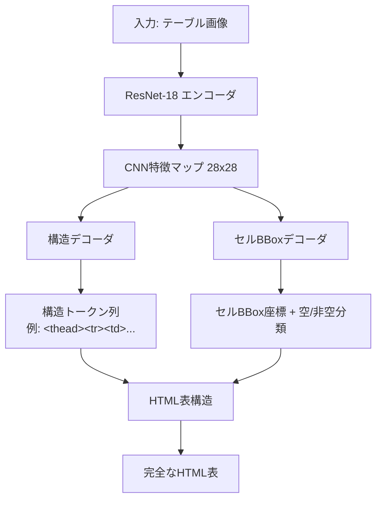
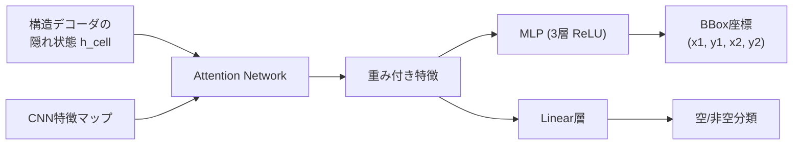

## 論文概要（Abstract）

本記事は [CVPR 2022論文 "TableFormer: Table Structure Understanding with Transformers"](https://arxiv.org/abs/2203.01017) の解説記事です。TableFormerは、画像から表の論理構造（行・列・スパン）を認識するTransformerベースのモデルであり、IBM Researchの Ahmed Nassar らが提案しました。従来のLSTMベースのデコーダをTransformerに置き換え、さらに新しいオブジェクト検出デコーダを追加することで、カスタムOCRなしにPDFから直接セル内容を抽出できる点が特徴です。PubTabNetベンチマークにおいて、TEDS（Tree-Edit-Distance-based Similarity）スコアで単純表98.5%、複雑表95.0%を達成したと著者らは報告しています。

この記事は [Zenn記事: Haystack 2.xでPDF・表・画像含む社内文書QAを構築する](https://zenn.dev/0h_n0/articles/1a2b88e04c8728) の深掘りです。

## 情報源

- **会議名**: CVPR 2022（IEEE/CVF Conference on Computer Vision and Pattern Recognition）
- **年**: 2022
- **URL**: [https://arxiv.org/abs/2203.01017](https://arxiv.org/abs/2203.01017)
- **著者**: Ahmed Nassar, Nikolaos Livathinos, Maksym Lysak, Peter Staar（IBM Research）
- **arXiv ID**: 2203.01017
- **カテゴリ**: cs.CV, cs.LG
- **ライセンス**: CC BY 4.0

## カンファレンス情報

CVPR（Conference on Computer Vision and Pattern Recognition）は、コンピュータビジョン分野における最高峰の国際会議の1つです。2022年の採択率は約25%であり、厳しい査読プロセスを経て採択される高品質な研究が集まります。TableFormerは文書画像理解のセッションで発表されました。

## 技術的詳細（Technical Details）

### エンコーダ-デュアルデコーダアーキテクチャ

TableFormerの核となるアーキテクチャは、1つのCNNエンコーダと2つの独立したデコーダから構成されます。



**CNNエンコーダ**: ResNet-18をバックボーンとし、入力画像を32倍ダウンサンプリングして28x28の特徴マップを生成します。Adaptive Poolingにより固定サイズの特徴表現を得ます。

**構造デコーダ**: Transformerエンコーダ（2層、4ヘッド）とTransformerデコーダ（4層、4ヘッド）から構成され、HTMLタグの系列を自己回帰的に生成します。従来のEDD（Encoder-Dual-Decoder）モデルが採用していたLSTMデコーダを完全にTransformerに置き換えた点が改良点の1つです。

**セルBBoxデコーダ**: DETR（Detection Transformer）に着想を得たオブジェクト検出デコーダです。構造デコーダの隠れ状態をクエリとして利用し、CNN特徴マップとのアテンションを計算してセルの境界ボックス（BBox）を予測します。

### アテンション計算

両デコーダで用いられるScaled Dot-Product Attentionは以下の式で計算されます。

$$
\text{Attention}(Q, K, V) = \text{softmax}\left(\frac{QK^T}{\sqrt{d_k}}\right)V
$$

ここで、
- $Q \in \mathbb{R}^{n \times d_k}$: クエリ行列
- $K \in \mathbb{R}^{m \times d_k}$: キー行列
- $V \in \mathbb{R}^{m \times d_v}$: バリュー行列
- $d_k = 512 / 4 = 128$: ヘッドあたりの次元数（全体の特徴次元512、ヘッド数4）

スケーリング係数 $\sqrt{d_k}$ は、内積の値が大きくなりすぎてsoftmaxの勾配が消失するのを防ぐために導入されています。

### 構造トークン言語（Structure Token Language）

著者らは表の論理構造をHTML風のトークン系列として表現する独自言語を定義しています。使用されるトークンは以下の通りです。

| トークン | 意味 |
|---------|------|
| `<thead>`, `</thead>` | テーブルヘッダ領域 |
| `<tbody>`, `</tbody>` | テーブルボディ領域 |
| `<tr>`, `</tr>` | 行（table row） |
| `<td>`, `</td>` | セル（table data） |
| `<` | セルタグ開始（スパンあり） |
| `rowspan=`, `colspan=` | スパン指定 |
| 数値トークン | スパン数（2, 3, ...） |
| `>` | セルタグ閉じ |

スパンを持つセルは `<`, `colspan=`, `2`, `>` のように分解して表現されます。構造トークンの最大系列長は512に制限されています。この分解により、各 `<td>` または `<` トークンの隠れ状態がセルBBoxデコーダへ渡され、対応するセルの境界ボックス予測に使用されます。

### オブジェクト検出デコーダの詳細

セルBBoxデコーダは、構造デコーダが生成した各セルトークンの隠れ状態を入力として受け取ります。



具体的な処理は以下の通りです。

1. アテンションネットワークがCNN特徴マップに対する重みを計算
2. 重み付けされた特徴マップとエンコードされた画像特徴を乗算し、セル特徴を生成
3. 3層のReLU付きMLPが正規化されたBBox座標を出力
4. 線形層がセルの空/非空を分類

トークン系列の順序が表のセルと1対1に対応するため、DETRで必要なハンガリアンアルゴリズムによるマッチングが不要となります。これは推論の簡潔さとスピードの両面で利点となっています。

### 損失関数

マルチタスク学習の損失関数は以下のように定義されます。

$$
\mathcal{L} = \lambda \cdot \mathcal{L}_s + (1 - \lambda) \cdot \mathcal{L}_{box}
$$

ここで、
- $\mathcal{L}_s$: 構造トークン系列に対するクロスエントロピー損失
- $\mathcal{L}_{box}$: BBox予測に対する損失（L1損失 + IoU損失の組み合わせ）
- $\lambda = 0.5$: タスク間のバランスパラメータ

BBox損失はさらに以下のように分解されます。

$$
\mathcal{L}_{box} = \lambda_{iou} \cdot \mathcal{L}_{iou} + \lambda_{l1} \cdot \mathcal{L}_{l1}
$$

IoU損失によりスケール不変な位置合わせを、L1損失により絶対的な座標精度をそれぞれ最適化します。

### 学習設定

著者らは以下のハイパーパラメータで学習を行ったと報告しています。

- **特徴次元**: 512、FFN幅: 1024
- **第1フェーズ**: 学習率0.001、バッチサイズ24、12エポック
- **第2フェーズ**: 学習率0.0001、バッチサイズ18、12エポック
- **オプティマイザ**: 3つの独立したAdam（エンコーダ、構造デコーダ、BBoxデコーダそれぞれ）
- **ドロップアウト**: 0.5

## 実装のポイント

TableFormerは現在、IBM開発のオープンソース文書変換ライブラリ [Docling](https://github.com/docling-project/docling) に統合されています。Doclingでは `TableFormerMode.ACCURATE`（高精度モード）と `TableFormerMode.FAST`（高速モード）の2つのモードが提供されています。

```python
from docling.datamodel.base_models import InputFormat
from docling.datamodel.pipeline_options import (
    PdfPipelineOptions,
    TableFormerMode,
)
from docling.document_converter import DocumentConverter, PdfFormatOption


def create_table_aware_converter(
    mode: TableFormerMode = TableFormerMode.ACCURATE,
    do_cell_matching: bool = True,
) -> DocumentConverter:
    """TableFormer対応のDocumentConverterを生成する

    Args:
        mode: TableFormerMode.ACCURATE（高精度）or FAST（高速）
        do_cell_matching: PDFセルとのマッチングを行うか

    Returns:
        設定済みのDocumentConverter
    """
    pipeline_options = PdfPipelineOptions(do_table_structure=True)
    pipeline_options.table_structure_options.mode = mode
    pipeline_options.table_structure_options.do_cell_matching = do_cell_matching

    converter = DocumentConverter(
        format_options={
            InputFormat.PDF: PdfFormatOption(
                pipeline_options=pipeline_options
            )
        }
    )
    return converter


# 使用例: 高精度モードでPDFを変換
converter = create_table_aware_converter(mode=TableFormerMode.ACCURATE)
result = converter.convert("financial_report.pdf")

# 変換結果から表を取得
for table in result.document.tables:
    df = table.export_to_dataframe()
    print(f"Table shape: {df.shape}")
    print(df.head())
```

**実装上の注意点**:

- `do_cell_matching=True`（デフォルト）では、モデルの予測をPDF内のテキストセルにマッチングする。複数列が誤って結合される場合は `False` に設定してモデルの予測セルをそのまま使用する
- `TableFormerMode.ACCURATE` はスパンを含む複雑な表に適しているが、処理時間が長い。定型帳票など構造が単純な場合は `FAST` で十分な精度が得られる
- 大きな表（ページの半分以上を占める）では前処理時のダウンサンプリングにより精度が低下すると著者らは報告しており、事前にページ分割等の対策が必要

## Production Deployment Guide

TableFormerをDocling経由で本番環境にデプロイし、PDF内の表構造認識APIを構築する際の設計パターンを示します。

### AWS実装パターン（コスト最適化重視）

TableFormerの推論はGPU上での実行が望ましいものの、Doclingライブラリ自体はCPU環境でも動作します。トラフィック量に応じた3パターンの構成を示します。

| 構成 | トラフィック | 推奨サービス | 月額概算 |
|------|-------------|-------------|---------|
| Small | ~100 req/日 | Lambda (CPU) + S3 + DynamoDB | $50-150 |
| Medium | ~1,000 req/日 | ECS Fargate (GPU) + ALB + S3 | $400-900 |
| Large | 10,000+ req/日 | EKS + Karpenter (GPU Spot) + S3 | $2,500-6,000 |

**Small構成**: CPU LambdaでDoclingを実行します。`TableFormerMode.FAST` を使用し、コールドスタート対策としてProvisioned Concurrencyを1-2に設定します。レイテンシは表1枚あたり5-15秒程度です。

**Medium構成**: ECS Fargate上にDoclingコンテナをデプロイし、ALBでリクエストを分散します。GPU対応が必要な場合は `g5.xlarge`（NVIDIA A10G）を使用します。Auto Scalingで最小1、最大4タスクに設定し、夜間はスケールダウンします。

**Large構成**: EKS + Karpenterで GPU Spot Instances（`g5.xlarge`）を活用し、コストを最大70%削減します。Karpenterの `consolidationPolicy: WhenEmpty` でアイドルノードを自動回収します。

**コスト削減テクニック**:
- GPU Spot Instances活用で最大70-90%削減（`g5.xlarge` On-Demand: $1.006/h → Spot: $0.30-0.40/h、東京リージョン2026年9月時点の概算）
- S3 Intelligent-Tiering で処理済みPDFの保存コスト最適化
- DynamoDB On-Demandモードで低トラフィック時のコスト削減
- Lambda Provisioned Concurrencyは最小限に（1-2）し、残りはオンデマンドで対応

**注意**: 上記コストはAWS ap-northeast-1（東京）リージョンの2026年9月時点の概算値です。実際のコストはトラフィックパターン、リージョン、Spotの可用性により変動します。最新料金は [AWS Pricing Calculator](https://calculator.aws/) で確認してください。

### Terraformインフラコード

#### Small構成（Serverless: Lambda + S3 + DynamoDB）

```hcl
# --- Small構成: Lambda + S3 + DynamoDB ---

terraform {
  required_version = ">= 1.9"
  required_providers {
    aws = {
      source  = "hashicorp/aws"
      version = "~> 5.60"
    }
  }
}

provider "aws" {
  region = "ap-northeast-1"
}

# S3バケット: PDF入力 + 結果保存
resource "aws_s3_bucket" "documents" {
  bucket = "tableformer-documents-${data.aws_caller_identity.current.account_id}"
}

resource "aws_s3_bucket_server_side_encryption_configuration" "documents" {
  bucket = aws_s3_bucket.documents.id
  rule {
    apply_server_side_encryption_by_default {
      sse_algorithm = "aws:kms"
    }
  }
}

resource "aws_s3_bucket_public_access_block" "documents" {
  bucket                  = aws_s3_bucket.documents.id
  block_public_acls       = true
  block_public_policy     = true
  ignore_public_acls      = true
  restrict_public_buckets = true
}

# DynamoDB: 処理状況管理
resource "aws_dynamodb_table" "jobs" {
  name         = "tableformer-jobs"
  billing_mode = "PAY_PER_REQUEST" # On-Demand でコスト最適化
  hash_key     = "job_id"

  attribute {
    name = "job_id"
    type = "S"
  }

  ttl {
    attribute_name = "expires_at"
    enabled        = true
  }

  server_side_encryption {
    enabled = true
  }
}

# IAMロール: Lambda用（最小権限）
resource "aws_iam_role" "lambda_role" {
  name = "tableformer-lambda-role"
  assume_role_policy = jsonencode({
    Version = "2012-10-17"
    Statement = [{
      Action = "sts:AssumeRole"
      Effect = "Allow"
      Principal = { Service = "lambda.amazonaws.com" }
    }]
  })
}

resource "aws_iam_role_policy" "lambda_policy" {
  name = "tableformer-lambda-policy"
  role = aws_iam_role.lambda_role.id
  policy = jsonencode({
    Version = "2012-10-17"
    Statement = [
      {
        Effect   = "Allow"
        Action   = ["s3:GetObject", "s3:PutObject"]
        Resource = "${aws_s3_bucket.documents.arn}/*"
      },
      {
        Effect   = "Allow"
        Action   = ["dynamodb:PutItem", "dynamodb:GetItem", "dynamodb:UpdateItem"]
        Resource = aws_dynamodb_table.jobs.arn
      },
      {
        Effect   = "Allow"
        Action   = ["logs:CreateLogGroup", "logs:CreateLogStream", "logs:PutLogEvents"]
        Resource = "arn:aws:logs:*:*:*"
      }
    ]
  })
}

# Lambda関数: Docling + TableFormer (FAST)
resource "aws_lambda_function" "table_extractor" {
  function_name = "tableformer-extractor"
  role          = aws_iam_role.lambda_role.arn
  package_type  = "Image"
  image_uri     = "${data.aws_caller_identity.current.account_id}.dkr.ecr.ap-northeast-1.amazonaws.com/tableformer:latest"
  timeout       = 300 # 表の複雑さに応じて調整
  memory_size   = 4096 # Docling推論に必要

  environment {
    variables = {
      TABLEFORMER_MODE = "FAST"
      S3_BUCKET        = aws_s3_bucket.documents.id
      DYNAMO_TABLE     = aws_dynamodb_table.jobs.name
    }
  }

  tracing_config {
    mode = "Active" # X-Ray有効化
  }
}

# CloudWatch アラーム: Lambda実行時間監視
resource "aws_cloudwatch_metric_alarm" "lambda_duration" {
  alarm_name          = "tableformer-lambda-duration-high"
  comparison_operator = "GreaterThanThreshold"
  evaluation_periods  = 3
  metric_name         = "Duration"
  namespace           = "AWS/Lambda"
  period              = 300
  statistic           = "Average"
  threshold           = 60000 # 60秒超過でアラーム
  alarm_actions       = [] # SNSトピックARNを設定

  dimensions = {
    FunctionName = aws_lambda_function.table_extractor.function_name
  }
}

data "aws_caller_identity" "current" {}
```

#### Large構成（Container: EKS + Karpenter + GPU Spot）

```hcl
# --- Large構成: EKS + Karpenter + GPU Spot ---

module "eks" {
  source  = "terraform-aws-modules/eks/aws"
  version = "~> 20.24"

  cluster_name    = "tableformer-cluster"
  cluster_version = "1.31"

  vpc_id     = module.vpc.vpc_id
  subnet_ids = module.vpc.private_subnets

  # Karpenter用のIAMロール
  enable_cluster_creator_admin_permissions = true
}

# Karpenter: GPU Spot優先の自動スケーリング
resource "kubectl_manifest" "karpenter_nodepool" {
  yaml_body = yamlencode({
    apiVersion = "karpenter.sh/v1"
    kind       = "NodePool"
    metadata   = { name = "tableformer-gpu" }
    spec = {
      template = {
        spec = {
          requirements = [
            { key = "karpenter.sh/capacity-type", operator = "In", values = ["spot", "on-demand"] },
            { key = "node.kubernetes.io/instance-type", operator = "In", values = ["g5.xlarge", "g5.2xlarge"] },
          ]
          nodeClassRef = { name = "default" }
        }
      }
      limits   = { cpu = "64", memory = "256Gi" }
      disruption = {
        consolidationPolicy = "WhenEmpty"
        consolidateAfter    = "60s"
      }
    }
  })
}

# Secrets Manager: API設定
resource "aws_secretsmanager_secret" "tableformer_config" {
  name = "tableformer/config"
}

# AWS Budgets: コストアラート
resource "aws_budgets_budget" "tableformer" {
  name         = "tableformer-monthly"
  budget_type  = "COST"
  limit_amount = "5000"
  limit_unit   = "USD"
  time_unit    = "MONTHLY"

  notification {
    comparison_operator       = "GREATER_THAN"
    threshold                 = 80
    threshold_type            = "PERCENTAGE"
    notification_type         = "ACTUAL"
    subscriber_email_addresses = ["alerts@example.com"]
  }
}
```

### 運用・監視設定

#### CloudWatch Logs Insights クエリ

```
# レイテンシ分析（P95/P99）
fields @timestamp, @duration
| filter @type = "REPORT"
| stats avg(@duration) as avg_ms,
        pct(@duration, 95) as p95_ms,
        pct(@duration, 99) as p99_ms,
        count(*) as invocations
  by bin(1h)

# テーブル認識エラー率
fields @timestamp, @message
| filter @message like /TableFormer/
| filter @message like /ERROR/
| stats count(*) as errors by bin(1h)
```

#### CloudWatch アラーム設定

```python
import boto3


def create_tableformer_alarms(function_name: str, sns_topic_arn: str) -> None:
    """TableFormer Lambda用のCloudWatchアラームを作成

    Args:
        function_name: Lambda関数名
        sns_topic_arn: 通知先SNSトピックARN
    """
    cw = boto3.client("cloudwatch")

    # Lambda実行時間異常検知
    cw.put_metric_alarm(
        AlarmName=f"{function_name}-duration-p99",
        MetricName="Duration",
        Namespace="AWS/Lambda",
        Statistic="p99",
        Period=300,
        EvaluationPeriods=3,
        Threshold=120000,  # 120秒
        ComparisonOperator="GreaterThanThreshold",
        Dimensions=[{"Name": "FunctionName", "Value": function_name}],
        AlarmActions=[sns_topic_arn],
    )

    # Lambdaエラー率検知
    cw.put_metric_alarm(
        AlarmName=f"{function_name}-error-rate",
        MetricName="Errors",
        Namespace="AWS/Lambda",
        Statistic="Sum",
        Period=300,
        EvaluationPeriods=2,
        Threshold=5,
        ComparisonOperator="GreaterThanThreshold",
        Dimensions=[{"Name": "FunctionName", "Value": function_name}],
        AlarmActions=[sns_topic_arn],
    )
```

#### X-Ray トレーシング設定

```python
from aws_xray_sdk.core import xray_recorder, patch_all


# boto3の自動計装
patch_all()


@xray_recorder.capture("extract_tables")
def extract_tables(pdf_path: str) -> list[dict]:
    """PDF内の表を抽出（X-Rayトレーシング付き）

    Args:
        pdf_path: S3上のPDFパス

    Returns:
        抽出された表のリスト
    """
    subsegment = xray_recorder.current_subsegment()
    subsegment.put_annotation("tableformer_mode", "ACCURATE")
    subsegment.put_metadata("pdf_path", pdf_path)

    converter = create_table_aware_converter()
    result = converter.convert(pdf_path)

    tables = []
    for table in result.document.tables:
        df = table.export_to_dataframe()
        tables.append({"shape": df.shape, "data": df.to_dict()})

    subsegment.put_metadata("tables_found", len(tables))
    return tables
```

#### Cost Explorer 日次レポート

```python
import boto3
from datetime import date, timedelta


def get_daily_cost_report() -> dict:
    """TableFormer関連の日次コストレポートを取得

    Returns:
        サービス別コスト情報
    """
    ce = boto3.client("ce")
    today = date.today()
    yesterday = today - timedelta(days=1)

    response = ce.get_cost_and_usage(
        TimePeriod={
            "Start": yesterday.isoformat(),
            "End": today.isoformat(),
        },
        Granularity="DAILY",
        Metrics=["UnblendedCost"],
        Filter={
            "Tags": {
                "Key": "Project",
                "Values": ["tableformer"],
            }
        },
        GroupBy=[{"Type": "DIMENSION", "Key": "SERVICE"}],
    )

    costs: dict[str, float] = {}
    for group in response["ResultsByTime"][0]["Groups"]:
        service = group["Keys"][0]
        amount = float(group["Metrics"]["UnblendedCost"]["Amount"])
        costs[service] = amount

    total = sum(costs.values())

    # $100/日超過で警告
    if total > 100.0:
        sns = boto3.client("sns")
        sns.publish(
            TopicArn="arn:aws:sns:ap-northeast-1:ACCOUNT:tableformer-alerts",
            Subject="TableFormer Cost Alert",
            Message=f"Daily cost exceeded $100: ${total:.2f}",
        )

    return {"date": yesterday.isoformat(), "total": total, "by_service": costs}
```

### コスト最適化チェックリスト

**アーキテクチャ選択**:
- [ ] トラフィック量に応じた構成を選択（Small: Serverless / Medium: Hybrid / Large: Container）
- [ ] GPU必要性の検証（`FAST`モードならCPUで十分な場合あり）

**リソース最適化**:
- [ ] EC2/EKS: GPU Spot Instances優先（g5.xlarge Spot で70-90%削減）
- [ ] Reserved Instances: 安定負荷分は1年コミットで最大40%削減
- [ ] Savings Plans: Compute Savings Plansで柔軟に割引適用
- [ ] Lambda: メモリサイズ最適化（Power Tuningで最適値特定）
- [ ] ECS/EKS: 夜間・休日のスケールダウン設定

**推論コスト削減**:
- [ ] `TableFormerMode.FAST` を単純表に適用（処理時間50%削減）
- [ ] バッチ処理: 複数PDFをまとめて処理しGPU使用率向上
- [ ] キャッシュ: 同一PDFの再処理をDynamoDB/S3でキャッシュ
- [ ] 前処理: 表領域のみ切り出してからTableFormerに入力

**監視・アラート**:
- [ ] AWS Budgets: 月額上限アラート設定（80%到達で通知）
- [ ] CloudWatch: Lambda Duration / Error Rate アラーム
- [ ] Cost Anomaly Detection: 異常コスト自動検知
- [ ] 日次コストレポート: Cost Explorer + SNS通知

**リソース管理**:
- [ ] 未使用ECRイメージの自動削除（ライフサイクルポリシー）
- [ ] S3ライフサイクル: 処理済みPDFを30日後にGlacierへ移行
- [ ] CloudWatch Logs: 保持期間を30日に設定
- [ ] タグ戦略: `Project=tableformer` で全リソースにタグ付け
- [ ] 開発環境: 夜間自動停止スケジュール

## 実験結果（Results）

### PubTabNetベンチマーク

著者らはPubTabNet（509,129サンプル）を用いて評価を行い、TEDS（Tree-Edit-Distance-based Similarity）スコアで以下の結果を報告しています。

| モデル | Simple TEDS | Complex TEDS | Overall TEDS |
|-------|-------------|--------------|-------------|
| EDD (Zhong et al., 2020) | 91.1% | 88.7% | 89.9% |
| GTE (Zheng et al., 2021) | — | — | 93.01% |
| LGPMA (Qiao et al., 2021) | — | — | 94.6% |
| **TableFormer** | **98.5%** | **95.0%** | **96.75%** |

（論文 Table 1 より）

### 他データセットでの結果

| データセット | Simple TEDS | Complex TEDS | Overall TEDS |
|-------------|-------------|--------------|-------------|
| FinTabNet (112K) | 97.5% | 96.0% | 96.8% |
| TableBank (145K) | — | — | 89.6% |
| SynthTabNet (600K) | 96.9% | 95.7% | — |

（論文 Table 2, 3 より）

### セル検出精度

セルBBoxデコーダの検出精度は、PubTabNetにおいてmAP 82.1%（前処理なし）、86.8%（後処理あり）を達成しています。コンテンツ抽出の精度は、単純表95.4%、複雑表90.1%（全体93.6%）であり、従来手法から5.3ポイント改善したと著者らは報告しています（論文 Table 4 より）。

### 分析

- 単純表（スパンなし）では98.5%と高い精度だが、複雑表（スパンあり）では95.0%にとどまる。スパンの予測が構造理解の主要な困難であることが示唆される
- FinTabNetは金融文書の表であり、PubTabNetとは異なるドメインだが96.8%と高精度。ドメイン汎化性能の高さが示されている
- TableBankでの89.6%はやや低い。著者らはHTMLグラウンドトゥルースとPDF抽出コンテンツの不一致（スペース、Unicode変種の差異）が原因と指摘している

## 実運用への応用（Practical Applications）

### Docling + Haystackによる表構造認識パイプライン

Zenn記事で紹介されているHaystack 2.xの `DoclingConverter` は、内部でTableFormerを使用してPDF内の表構造を認識します。RAGパイプラインに組み込む場合、以下のような設計が有効です。

```python
from docling.datamodel.pipeline_options import PdfPipelineOptions, TableFormerMode
from haystack_integrations.components.converters.docling import DoclingConverter


def build_table_aware_rag_converter(
    accurate: bool = True,
) -> DoclingConverter:
    """表構造認識対応のDoclingConverterを構築

    Args:
        accurate: Trueで高精度モード、Falseで高速モード

    Returns:
        設定済みDoclingConverter
    """
    pipeline_options = PdfPipelineOptions(do_table_structure=True)
    pipeline_options.table_structure_options.mode = (
        TableFormerMode.ACCURATE if accurate else TableFormerMode.FAST
    )

    return DoclingConverter(pipeline_options=pipeline_options)
```

**運用上の考慮事項**:

- **モード選択**: 金融・医療文書など表構造が複雑な場合は `ACCURATE`、社内帳票など定型的な場合は `FAST` を推奨
- **大きな表への対策**: ページの半分以上を占める表は精度が低下するため、事前のページ分割や表領域の切り出しが有効
- **非英語対応**: TableFormerのセルBBoxデコーダはOCR非依存のため、日本語表でもセル位置の検出が可能。ただし、セル内テキストの抽出はPDFのテキストレイヤーに依存する
- **スループット**: バッチ処理時はGPU上で `ACCURATE` モードを使い、リアルタイムAPIでは `FAST` モードを使うハイブリッド運用が実用的

## まとめ

TableFormerは、CNNエンコーダとTransformerベースのデュアルデコーダにより、表構造の論理認識とセル位置検出を同時に行うモデルです。PubTabNetでTEDS 96.75%を達成し、従来手法（EDD 89.9%）から大幅に改善しています。

Doclingへの統合により、Haystack等のRAGフレームワークからTableFormerを手軽に利用できる環境が整っています。PDF内の表を正確に構造化データとして抽出することは、社内文書QAや金融レポート分析などの実務で直接的な価値を持ちます。

一方で、大きな表での精度低下やHTMLグラウンドトゥルースとの不一致など、著者ら自身が認めている制約もあります。本番運用では、`ACCURATE` / `FAST` モードの使い分けと、前処理による表領域の切り出しが精度とコストの両面で重要となります。

## 参考文献

- **CVPR 2022**: [https://arxiv.org/abs/2203.01017](https://arxiv.org/abs/2203.01017)
- **Docling (GitHub)**: [https://github.com/docling-project/docling](https://github.com/docling-project/docling)
- **PubTabNet**: Zhong, X., ShafieiBavani, E., & Yepes, A. J. (2020). Image-based table recognition: Data, model, and evaluation. ECCV 2020.
- **EDD**: Zhong, X., et al. (2020). Image-based table recognition: data, model, and evaluation.
- **DETR**: Carion, N., et al. (2020). End-to-End Object Detection with Transformers. ECCV 2020.
- **Related Zenn article**: [https://zenn.dev/0h_n0/articles/1a2b88e04c8728](https://zenn.dev/0h_n0/articles/1a2b88e04c8728)
