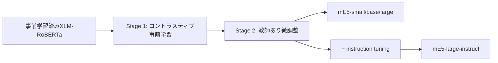

本記事は [https://arxiv.org/abs/2402.05672](https://arxiv.org/abs/2402.05672) の解説記事です。

## 論文概要

Multilingual E5（mE5）は、Microsoft Researchが開発した多言語テキスト埋め込みモデルファミリーであり、small・base・largeの3サイズで提供されている。著者らは、英語E5モデルの学習レシピを多言語設定に拡張し、約10億件の多言語テキストペアを用いたコントラスティブ事前学習と、高品質ラベルデータによる教師あり微調整の2段階パイプラインで学習したと報告している。加えて、instruction-tunedバリアント（mE5-large-instruct）を導入し、同等サイズの英語専用モデルと遜色ない性能を達成したと述べている。100言語以上をカバーし、推論効率と埋め込み品質のバランスを提供するモデル群である。

この記事は [Zenn記事: Haystack 2.xでPDF・表・画像含む社内文書QAを構築する](https://zenn.dev/0h_n0/articles/1a2b88e04c8728) の深掘りです。

## 情報源

| 項目 | 内容 |
|------|------|
| arXiv ID | [2402.05672](https://arxiv.org/abs/2402.05672) |
| URL | [https://arxiv.org/abs/2402.05672](https://arxiv.org/abs/2402.05672) |
| 著者 | Liang Wang, Nan Yang, Xiaolong Huang, Linjun Yang, Rangan Majumder, Furu Wei |
| 所属 | Microsoft |
| 発表 | 2024年2月（Technical Report） |
| 分野 | cs.CL（自然言語処理）、cs.IR（情報検索） |
| ライセンス | CC BY 4.0 |

## 背景と動機

テキスト埋め込みモデルは、検索・分類・クラスタリングなど幅広い自然言語処理タスクの基盤技術であるが、その研究は長らく英語中心に進展してきた。英語向けモデルであるE5（Wang et al., 2022）やBGE（Xiao et al., 2023）はMTEBベンチマークで高い性能を示す一方、非英語言語への適用には大きな性能低下が伴っていた。

多言語埋め込みモデルには固有の課題がある。第一に、高品質な教師ありデータは英語に偏在しており、他言語では量・質ともに不足する。第二に、言語間のアラインメント（意味的に同等な異言語テキストを近い埋め込み空間にマッピングすること）の実現が技術的に難しい。第三に、100言語以上を単一のモデルでカバーする場合、各言語に割り当てられるモデル容量のトレードオフ（いわゆる「curse of multilinguality」）が生じる。

従来の多言語埋め込みモデルとしてはLaBSE（Feng et al., 2022）やmContriever（Izacard et al., 2022）が存在するが、LaBSEはbitext mining（並行翻訳文の検出）に特化しており汎用検索性能は限定的であり、mContrieverは教師なし学習のみで性能に限界があった。著者らはこれらの問題に対し、英語E5の2段階学習レシピを多言語に拡張するアプローチでmE5を設計している。

## 主要な貢献

著者らが主張する本論文の貢献は以下の通りである。

1. **3サイズの多言語埋め込みモデル**: mE5-small（MiniLMベース）、mE5-base（XLM-RoBERTa-base）、mE5-large（XLM-RoBERTa-large）の3モデルを公開し、推論効率と品質のトレードオフを選択可能とした
2. **2段階学習パイプラインの多言語拡張**: 英語E5で有効性が示された「弱教師ありコントラスティブ事前学習 → 教師あり微調整」のレシピを100言語以上に適用し、その有効性を実証した
3. **instruction-tunedバリアントの導入**: GPT-3.5/4による合成データ（93言語、150,000固有命令）を活用したmE5-large-instructを提供し、英語専用モデルと同等の性能を達成した
4. **多言語ベンチマークでの包括的評価**: MTEB、MIRACL、Mr.TyDi、BUCC、Tatoebaなど複数のベンチマークで評価を実施し、既存の多言語モデルを上回る性能を報告した

## 技術的詳細

### モデルアーキテクチャ

mE5の各モデルは、事前学習済み多言語Transformerエンコーダを基盤としている。

| モデル | ベースモデル | 用途 |
|--------|-------------|------|
| mE5-small | Multilingual MiniLM | 低レイテンシ・軽量用途 |
| mE5-base | XLM-RoBERTa-base | バランス型 |
| mE5-large | XLM-RoBERTa-large | 高品質用途 |
| mE5-large-instruct | mE5-large + instruction tuning | タスク指示付き |

XLM-RoBERTa（Conneau et al., 2020）は、100言語のCommon Crawlデータで事前学習されたRoBERTaの多言語版であり、言語間の転移学習に強みを持つ。入力テキストは[CLS]トークンの隠れ状態を平均プーリングすることで固定長の埋め込みベクトルに変換される。

### 2段階学習パイプライン

mE5の学習は以下の2段階で構成される。



**Stage 1: 弱教師ありコントラスティブ事前学習**

約10億件の多言語テキストペアを用いて、標準的なInfoNCEコントラスティブ損失で学習する。損失関数は以下で定義される。

$$
\mathcal{L} = -\log \frac{\exp(\text{sim}(q, d^+) / \tau)}{\sum_{j=1}^{N} \exp(\text{sim}(q, d_j) / \tau)}
$$

ここで、$q$ はクエリの埋め込みベクトル、$d^+$ はクエリに対応する正例ドキュメントの埋め込みベクトル、$d_j$ はバッチ内の全ドキュメント（正例＋負例）の埋め込み、$\text{sim}(\cdot, \cdot)$ はコサイン類似度、$\tau$ は温度パラメータ、$N$ はバッチ内のドキュメント総数である。InfoNCE損失は、正例ペアの類似度を最大化しつつ、負例ペアの類似度を最小化する目的関数であり、バッチ内の全ペアをin-batch negativesとして活用する。

事前学習データは以下のソースから構成されている。

| データソース | テキストペア数 | 特徴 |
|-------------|-------------|------|
| Wikipedia | 150M | 多言語百科事典 |
| mC4 | 160M | 多言語Common Crawl |
| CC News | 160M | 多言語ニュース |
| NLLB | 160M | 翻訳ペア |
| Reddit | 160M | 英語中心の対話 |
| S2ORC | 50M | 学術論文 |
| StackExchange | 50M | Q&A |
| xP3 | 80M | 多言語命令データ |
| その他 (SBERT等) | 10M | 文類似度データ |

学習ハイパーパラメータとして、バッチサイズ32,000、総ステップ数30,000が設定されている。学習率はモデルサイズに応じて調整され、mE5-smallで3e-4、mE5-baseで2e-4、mE5-largeで1e-4が使用されている。

**Stage 2: 教師あり微調整**

高品質なラベル付きデータセットを用いて微調整を行う。約160万サンプルの混合データを使用し、in-batch negatives、マイニングされたハードネガティブ、およびcross-encoderモデルからの知識蒸留を組み合わせている。

主要な微調整データは以下の通りである。

| データセット | サンプル数 | 言語 |
|-------------|----------|------|
| MS-MARCO | 570K | 英語 |
| NQ / TriviaQA / SQuAD | 220K | 英語 |
| NLI（自然言語推論） | 275K | 多言語 |
| MIRACL | 40K | 16言語 |
| その他 | ~500K | 多言語 |

微調整のハイパーパラメータは、バッチサイズ512、エポック数2、学習率はmE5-smallで3e-5、mE5-baseで2e-5、mE5-largeで1e-5と報告されている。

### instruction-tunedバリアント

mE5-large-instructは、mE5-largeをベースにGPT-3.5/4で生成した合成データを追加して学習したモデルである。93言語にわたる150,000固有命令を含む約500Kサンプルを使用している。入力時にタスクの指示文（例: "Retrieve relevant passages for the query"）を付与することで、検索・分類・クラスタリングなど異なるタスクに同一モデルで対応する設計である。

### 384次元 vs 1024次元のトレードオフ

mE5-smallは384次元、mE5-largeは1024次元の埋め込みを出力する。次元数の選択は以下のトレードオフを伴う。

| 観点 | mE5-small (384次元) | mE5-large (1024次元) |
|------|--------------------|--------------------|
| ストレージ | 1Mドキュメントで約1.5 GB | 1Mドキュメントで約4 GB |
| 検索速度 | ベクトル演算が高速 | 約2.7倍のコスト |
| 品質 (MTEB) | 57.9 | 61.5 |
| 推論レイテンシ | 低 | 高 |

100万件規模の文書検索では384次元でも実用的な品質が得られるが、高精度が要求される場合は1024次元が適している。ストレージと検索速度の制約がある環境ではmE5-smallが合理的な選択となる。

## 実装のポイント

mE5はHugging Face Hub上で `intfloat/multilingual-e5-small`、`intfloat/multilingual-e5-base`、`intfloat/multilingual-e5-large` として公開されており、Sentence Transformersライブラリで直接利用できる。

**入力フォーマットの注意点**: mE5（non-instructバリアント）では、クエリに `"query: "` プレフィックス、ドキュメントに `"passage: "` プレフィックスを付与する必要がある。このプレフィックスを省略すると性能が大幅に低下するため、実装時に注意が必要である。

```python
from typing import Any
from sentence_transformers import SentenceTransformer


def encode_texts(
    queries: list[str],
    passages: list[str],
    model_name: str = "intfloat/multilingual-e5-small",
) -> dict[str, Any]:
    """mE5モデルでクエリとパッセージを埋め込みベクトルに変換する。

    Args:
        queries: 検索クエリのリスト。
        passages: 検索対象パッセージのリスト。
        model_name: 使用するmE5モデル名。

    Returns:
        query_embeddings, passage_embeddings, similarity_matrix を含む辞書。
    """
    model = SentenceTransformer(model_name)

    # mE5はquery:/passage:プレフィックスが必須
    prefixed_queries: list[str] = [f"query: {q}" for q in queries]
    prefixed_passages: list[str] = [f"passage: {p}" for p in passages]

    query_embeddings = model.encode(
        prefixed_queries, normalize_embeddings=True
    )
    passage_embeddings = model.encode(
        prefixed_passages, normalize_embeddings=True
    )

    # コサイン類似度行列を計算
    similarity_matrix = query_embeddings @ passage_embeddings.T

    return {
        "query_embeddings": query_embeddings,
        "passage_embeddings": passage_embeddings,
        "similarity_matrix": similarity_matrix,
    }
```

**Haystackでの利用**: 関連Zenn記事で解説されているHaystack 2.xフレームワークでは、`SentenceTransformersDocumentEmbedder` および `SentenceTransformersTextEmbedder` コンポーネントにmE5モデルを指定することで、RAGパイプラインに直接組み込める。`prefix` パラメータで `"query: "` / `"passage: "` の付与を自動化できるため、アプリケーションコード側でのプレフィックス管理が不要となる。

## Production Deployment Guide

mE5をAWS上で実運用に展開する場合の実装パターンを示す。以下はEmbedding API（テキストを受け取り埋め込みベクトルを返すサービス）としてのデプロイガイドである。コスト試算は2026年9月時点のAWS ap-northeast-1（東京）リージョン料金に基づく概算値であり、実際のコストはトラフィックパターン、リージョン、バースト使用量により変動する。最新料金はAWS料金計算ツールで確認を推奨する。

### AWS実装パターン

| 構成 | ユースケース | 月額概算 (ap-northeast-1) | 主要サービス |
|------|-------------|--------------------------|-------------|
| Small | PoC・社内ツール、~500 req/日 | $30-100 | Lambda, API Gateway, S3 |
| Medium | プロダクション初期、~5000 req/日 | $200-600 | SageMaker Serverless, API Gateway |
| Large | 大規模RAGパイプライン、50000+ req/日 | $1,000-3,000 | SageMaker Real-time, EKS + GPU |

**Small構成**: Lambda関数でmE5-small（約118MBのモデルファイル）をロードし、CPU推論でEmbedding APIを提供する。mE5-smallは384次元出力かつ軽量であるため、Lambda（メモリ2GB）での推論が実用的である。コールドスタート対策としてProvisioned Concurrencyを1に設定する。月額内訳: Lambda ($5-20), API Gateway ($5-15), S3 ($1-5), CloudWatch ($5-10)。

**Medium構成**: SageMaker Serverless InferenceでmE5-base/largeをホストし、リクエスト駆動でスケールする。GPU不要のCPU推論でもmE5-baseは実用的なレイテンシ（~50ms/リクエスト）を達成する。オートスケーリングにより負荷に応じてインスタンス数が自動調整される。月額内訳: SageMaker Serverless ($100-300), API Gateway ($20-50), CloudWatch ($20-50), S3 ($5-10)。

**Large構成**: SageMaker Real-time Endpointまたは EKSクラスタ上でmE5-largeをGPU対応コンテナとしてデプロイする。バッチ推論により高スループットを実現し、RAGパイプラインのEmbedding層として組み込む。EKSの場合、Karpenterによるノード自動スケーリングでg5.xlargeのSpot Instancesを活用する。月額内訳: SageMaker/EKS ($600-2,000), GPU Instances ($200-600), ALB ($30-60), モニタリング ($50-150)。

### Terraformインフラコード

#### Small構成: Lambda + API Gateway

```hcl
terraform {
  required_version = ">= 1.6"
  required_providers {
    aws = {
      source  = "hashicorp/aws"
      version = "~> 5.70"
    }
  }
}

provider "aws" {
  region = "ap-northeast-1"
}

variable "project_name" {
  type    = string
  default = "me5-embedding-api"
}

# --- Lambda関数 ---

resource "aws_lambda_function" "embedding" {
  function_name = "${var.project_name}-encode"
  runtime       = "python3.12"
  handler       = "handler.lambda_handler"
  memory_size   = 2048
  timeout       = 60

  filename         = "${path.module}/lambda/embedding.zip"
  source_code_hash = filebase64sha256("${path.module}/lambda/embedding.zip")
  role             = aws_iam_role.lambda_exec.arn

  environment {
    variables = {
      MODEL_NAME                  = "intfloat/multilingual-e5-small"
      POWERTOOLS_SERVICE_NAME     = var.project_name
      POWERTOOLS_METRICS_NAMESPACE = var.project_name
    }
  }

  layers = [
    "arn:aws:lambda:ap-northeast-1:017000801446:layer:AWSLambdaPowertoolsPythonV3-python312-x86_64:7"
  ]

  tags = {
    Project = var.project_name
  }
}

resource "aws_lambda_provisioned_concurrency_config" "embedding" {
  function_name                  = aws_lambda_function.embedding.function_name
  provisioned_concurrent_executions = 1
  qualifier                      = aws_lambda_alias.live.name
}

resource "aws_lambda_alias" "live" {
  name             = "live"
  function_name    = aws_lambda_function.embedding.function_name
  function_version = aws_lambda_function.embedding.version
}

# --- API Gateway ---

resource "aws_apigatewayv2_api" "embedding" {
  name          = "${var.project_name}-api"
  protocol_type = "HTTP"
}

resource "aws_apigatewayv2_stage" "default" {
  api_id      = aws_apigatewayv2_api.embedding.id
  name        = "$default"
  auto_deploy = true

  access_log_settings {
    destination_arn = aws_cloudwatch_log_group.api_logs.arn
    format = jsonencode({
      requestId = "$context.requestId"
      ip        = "$context.identity.sourceIp"
      method    = "$context.httpMethod"
      path      = "$context.path"
      status    = "$context.status"
      latency   = "$context.responseLatency"
    })
  }
}

resource "aws_apigatewayv2_integration" "embedding" {
  api_id                 = aws_apigatewayv2_api.embedding.id
  integration_type       = "AWS_PROXY"
  integration_uri        = aws_lambda_alias.live.invoke_arn
  payload_format_version = "2.0"
}

resource "aws_apigatewayv2_route" "encode" {
  api_id    = aws_apigatewayv2_api.embedding.id
  route_key = "POST /encode"
  target    = "integrations/${aws_apigatewayv2_integration.embedding.id}"
}

# --- IAM ---

resource "aws_iam_role" "lambda_exec" {
  name = "${var.project_name}-lambda-exec"

  assume_role_policy = jsonencode({
    Version = "2012-10-17"
    Statement = [{
      Action = "sts:AssumeRole"
      Effect = "Allow"
      Principal = {
        Service = "lambda.amazonaws.com"
      }
    }]
  })
}

resource "aws_iam_role_policy_attachment" "lambda_basic" {
  role       = aws_iam_role.lambda_exec.name
  policy_arn = "arn:aws:iam::aws:policy/service-role/AWSLambdaBasicExecutionRole"
}

resource "aws_iam_role_policy" "s3_model_access" {
  name = "s3-model-access"
  role = aws_iam_role.lambda_exec.id

  policy = jsonencode({
    Version = "2012-10-17"
    Statement = [{
      Effect = "Allow"
      Action = [
        "s3:GetObject",
        "s3:ListBucket"
      ]
      Resource = [
        aws_s3_bucket.model_artifacts.arn,
        "${aws_s3_bucket.model_artifacts.arn}/*"
      ]
    }]
  })
}

# --- S3 モデルアーティファクト ---

resource "aws_s3_bucket" "model_artifacts" {
  bucket = "${var.project_name}-model-artifacts"

  tags = {
    Project = var.project_name
  }
}

resource "aws_s3_bucket_server_side_encryption_configuration" "model_artifacts" {
  bucket = aws_s3_bucket.model_artifacts.id

  rule {
    apply_server_side_encryption_by_default {
      sse_algorithm = "AES256"
    }
  }
}

resource "aws_s3_bucket_public_access_block" "model_artifacts" {
  bucket = aws_s3_bucket.model_artifacts.id

  block_public_acls       = true
  block_public_policy     = true
  ignore_public_acls      = true
  restrict_public_buckets = true
}

# --- CloudWatch ---

resource "aws_cloudwatch_log_group" "api_logs" {
  name              = "/aws/apigateway/${var.project_name}"
  retention_in_days = 30
}

resource "aws_cloudwatch_log_group" "lambda_logs" {
  name              = "/aws/lambda/${aws_lambda_function.embedding.function_name}"
  retention_in_days = 30
}
```

#### Medium構成: SageMaker Serverless Inference

```hcl
# --- SageMaker モデル + エンドポイント ---

resource "aws_sagemaker_model" "me5" {
  name               = "${var.project_name}-model"
  execution_role_arn = aws_iam_role.sagemaker_exec.arn

  primary_container {
    image          = "763104351884.dkr.ecr.ap-northeast-1.amazonaws.com/huggingface-pytorch-inference:2.3.0-transformers4.44.2-cpu-py311-ubuntu22.04"
    model_data_url = "s3://${aws_s3_bucket.model_artifacts.bucket}/me5-base/model.tar.gz"

    environment = {
      HF_MODEL_ID   = "intfloat/multilingual-e5-base"
      HF_TASK        = "feature-extraction"
      SAGEMAKER_CONTAINER_LOG_LEVEL = "20"
    }
  }

  tags = {
    Project = var.project_name
  }
}

resource "aws_sagemaker_endpoint_configuration" "me5_serverless" {
  name = "${var.project_name}-serverless-config"

  production_variants {
    variant_name           = "AllTraffic"
    model_name             = aws_sagemaker_model.me5.name
    serverless_config {
      memory_size_in_mb = 4096
      max_concurrency   = 10
    }
  }

  tags = {
    Project = var.project_name
  }
}

resource "aws_sagemaker_endpoint" "me5" {
  name                 = "${var.project_name}-endpoint"
  endpoint_config_name = aws_sagemaker_endpoint_configuration.me5_serverless.name

  tags = {
    Project = var.project_name
  }
}

resource "aws_iam_role" "sagemaker_exec" {
  name = "${var.project_name}-sagemaker-exec"

  assume_role_policy = jsonencode({
    Version = "2012-10-17"
    Statement = [{
      Action = "sts:AssumeRole"
      Effect = "Allow"
      Principal = {
        Service = "sagemaker.amazonaws.com"
      }
    }]
  })
}

resource "aws_iam_role_policy_attachment" "sagemaker_full" {
  role       = aws_iam_role.sagemaker_exec.name
  policy_arn = "arn:aws:iam::aws:policy/AmazonSageMakerFullAccess"
}
```

#### Large構成: EKS + Karpenter + GPU

```hcl
# --- EKS クラスタ ---

module "eks" {
  source  = "terraform-aws-modules/eks/aws"
  version = "~> 20.0"

  cluster_name    = "${var.project_name}-cluster"
  cluster_version = "1.31"

  vpc_id     = module.vpc.vpc_id
  subnet_ids = module.vpc.private_subnets

  cluster_endpoint_public_access = true

  eks_managed_node_groups = {
    system = {
      instance_types = ["m7i.large"]
      min_size       = 2
      max_size       = 4
      desired_size   = 2

      labels = {
        role = "system"
      }
    }
  }

  cluster_addons = {
    coredns    = { most_recent = true }
    kube-proxy = { most_recent = true }
    vpc-cni    = { most_recent = true }
  }

  tags = {
    Project   = var.project_name
    ManagedBy = "terraform"
  }
}

# --- Karpenter (GPU Spot Instances) ---

module "karpenter" {
  source  = "terraform-aws-modules/eks/aws//modules/karpenter"
  version = "~> 20.0"

  cluster_name = module.eks.cluster_name

  node_iam_role_additional_policies = {
    AmazonSSMManagedInstanceCore = "arn:aws:iam::aws:policy/AmazonSSMManagedInstanceCore"
  }
}

resource "kubectl_manifest" "karpenter_node_class" {
  yaml_body = yamlencode({
    apiVersion = "karpenter.k8s.aws/v1"
    kind       = "EC2NodeClass"
    metadata = {
      name = "gpu-embedding"
    }
    spec = {
      amiSelectorTerms = [{
        alias = "al2023@latest"
      }]
      role = module.karpenter.node_iam_role_name
      subnetSelectorTerms = [{
        tags = { "karpenter.sh/discovery" = module.eks.cluster_name }
      }]
      securityGroupSelectorTerms = [{
        tags = { "karpenter.sh/discovery" = module.eks.cluster_name }
      }]
      blockDeviceMappings = [{
        deviceName = "/dev/xvda"
        ebs = {
          volumeSize = "80Gi"
          volumeType = "gp3"
          encrypted  = true
        }
      }]
    }
  })
}

resource "kubectl_manifest" "karpenter_node_pool" {
  yaml_body = yamlencode({
    apiVersion = "karpenter.sh/v1"
    kind       = "NodePool"
    metadata = {
      name = "gpu-embedding"
    }
    spec = {
      template = {
        spec = {
          nodeClassRef = {
            group = "karpenter.k8s.aws"
            kind  = "EC2NodeClass"
            name  = "gpu-embedding"
          }
          requirements = [
            { key = "karpenter.sh/capacity-type", operator = "In", values = ["spot", "on-demand"] },
            { key = "node.kubernetes.io/instance-type", operator = "In", values = ["g5.xlarge", "g5.2xlarge"] },
            { key = "kubernetes.io/arch", operator = "In", values = ["amd64"] }
          ]
          taints = [{
            key    = "nvidia.com/gpu"
            value  = "true"
            effect = "NoSchedule"
          }]
        }
      }
      limits = {
        cpu    = "64"
        memory = "256Gi"
      }
      disruption = {
        consolidationPolicy = "WhenEmptyOrUnderutilized"
        consolidateAfter    = "60s"
      }
    }
  })
}
```

### セキュリティベストプラクティス

- **転送中の暗号化**: API Gateway/ALBでTLS 1.2以上を強制。内部通信もVPCエンドポイント経由でTLS化
- **保存時の暗号化**: S3はSSE-S3またはSSE-KMSを使用。SageMakerエンドポイントはAWS管理キーで暗号化
- **アクセス制御**: Lambda/SageMaker実行ロールには最小権限ポリシーを適用。API Gatewayにはリクエスト制限（throttling）を設定
- **ネットワーク分離**: SageMaker/EKSはプライベートサブネットに配置。パブリックアクセスはALB/API Gatewayのみ
- **監査ログ**: CloudTrailで全APIコールを記録。VPC Flow Logsでネットワークトラフィックを監視
- **入力バリデーション**: テキストの最大長チェック、悪意ある入力のサニタイズをLambda/コンテナ側で実装

### 運用・監視設定

```python
from typing import Any
import boto3


def setup_embedding_api_alarms(
    project_name: str,
    lambda_function_name: str,
    sns_topic_arn: str,
) -> list[dict[str, Any]]:
    """Embedding APIのCloudWatchアラームを設定する。

    Args:
        project_name: プロジェクト名。リソースの命名に使用。
        lambda_function_name: 監視対象のLambda関数名。
        sns_topic_arn: アラーム通知先のSNSトピックARN。

    Returns:
        作成されたアラームの情報リスト。
    """
    client = boto3.client("cloudwatch", region_name="ap-northeast-1")
    alarms: list[dict[str, Any]] = []

    alarm_configs = [
        {
            "name": f"{project_name}-lambda-errors",
            "metric": "Errors",
            "namespace": "AWS/Lambda",
            "threshold": 5.0,
            "period": 300,
            "evaluation_periods": 2,
            "comparison": "GreaterThanThreshold",
            "statistic": "Sum",
            "dimensions": [
                {"Name": "FunctionName", "Value": lambda_function_name}
            ],
            "description": "Lambda関数のエラー数が閾値を超過",
        },
        {
            "name": f"{project_name}-lambda-duration",
            "metric": "Duration",
            "namespace": "AWS/Lambda",
            "threshold": 45000.0,
            "period": 300,
            "evaluation_periods": 3,
            "comparison": "GreaterThanThreshold",
            "statistic": "p99",
            "dimensions": [
                {"Name": "FunctionName", "Value": lambda_function_name}
            ],
            "description": "Lambda P99レイテンシが45秒を超過",
        },
        {
            "name": f"{project_name}-lambda-throttles",
            "metric": "Throttles",
            "namespace": "AWS/Lambda",
            "threshold": 3.0,
            "period": 60,
            "evaluation_periods": 3,
            "comparison": "GreaterThanThreshold",
            "statistic": "Sum",
            "dimensions": [
                {"Name": "FunctionName", "Value": lambda_function_name}
            ],
            "description": "Lambda関数のスロットリングが発生",
        },
    ]

    for config in alarm_configs:
        client.put_metric_alarm(
            AlarmName=config["name"],
            MetricName=config["metric"],
            Namespace=config["namespace"],
            Threshold=config["threshold"],
            Period=config["period"],
            EvaluationPeriods=config["evaluation_periods"],
            ComparisonOperator=config["comparison"],
            Statistic=config["statistic"],
            Dimensions=config["dimensions"],
            AlarmDescription=config["description"],
            AlarmActions=[sns_topic_arn],
            OKActions=[sns_topic_arn],
            TreatMissingData="notBreaching",
        )
        alarms.append({"name": config["name"], "status": "created"})

    return alarms
```

**カスタムメトリクス**: 埋め込み生成のレイテンシ、入力テキスト長、バッチサイズをCloudWatchカスタムメトリクスとして記録し、ダッシュボードで可視化する。特にレイテンシのP50/P99とエラー率をKPIとして継続監視する。

### コスト最適化チェックリスト

**インフラ最適化**:
- [ ] Lambda メモリサイズを負荷テストで最適化（mE5-smallは2048MBが初期推奨）
- [ ] Provisioned Concurrencyをトラフィックパターンに合わせて調整
- [ ] CloudWatch Logsの保持期間を30日に設定（デフォルト無期限を回避）
- [ ] SageMakerの場合、Serverless Inferenceで低トラフィック時のコストを最小化
- [ ] EKSの場合、Spot Instancesを活用（最大90%削減）
- [ ] Reserved Instancesの1年コミットを検討（安定ワークロード向け）

**モデル最適化**:
- [ ] mE5-small（384次元）とmE5-large（1024次元）の品質/コスト比較を実施
- [ ] ONNX Runtimeへのモデル変換を検討（CPU推論で20-40%高速化の報告あり）
- [ ] バッチ処理可能なリクエストはまとめて推論（GPU利用効率向上）
- [ ] 埋め込みキャッシュの導入を検討（同一テキストの再エンコード回避）

**ベクトルDB連携**:
- [ ] ベクトルDBのインデックスタイプをHNSWに設定（検索精度と速度のバランス）
- [ ] 384次元の場合、Product Quantization（PQ）による圧縮は不要な場合が多い
- [ ] 1024次元の場合、PQまたはScalar Quantizationでストレージコストを50-75%削減可能

**セキュリティ・コンプライアンス**:
- [ ] IAMロールの最小権限を定期レビュー（IAM Access Analyzer活用）
- [ ] API Gatewayのレート制限を設定（DoS対策）
- [ ] VPCエンドポイントでプライベート通信を確保
- [ ] CloudTrailの有効化を確認

**運用**:
- [ ] アラーム閾値を初期トラフィックで校正（1週間のベースライン取得後）
- [ ] ダッシュボードにKPIを集約（レイテンシP99、エラー率、リクエスト数/分）
- [ ] 障害時のフォールバック（キャッシュ返却またはリトライ）を実装
- [ ] デプロイパイプライン（CI/CD）にモデル品質テスト（回帰テスト用ベンチマーク）を組み込む

## 実験結果

### MTEB（Massive Text Embedding Benchmark）

著者らはMTEBの56データセットで包括的な評価を実施している（論文Table 3より）。

| モデル | MTEB平均スコア | 備考 |
|--------|-------------|------|
| mE5-small | 57.9 | 軽量モデル |
| mE5-base | 59.5 | バランス型 |
| mE5-large | 61.5 | 高品質モデル |
| mE5-large-instruct | 64.4 | instruction-tuned |
| BGE-large-en-v1.5 | 64.2 | 英語専用 |
| Cohere multilingual-v3 | 64.0 | 多言語（商用） |

mE5-large-instructは、英語専用モデルであるBGE-large-en-v1.5（64.2）を上回る64.4を達成しており、多言語モデルでありながら英語タスクでも競争力があることを示している。商用モデルであるCohere multilingual-v3（64.0）に対しても同等以上の性能である。

### MIRACL（多言語検索ベンチマーク）

16言語のpassage retrievalタスクでのnDCG@10を以下に示す（論文Table 4より）。

| モデル | 平均 nDCG@10 |
|--------|-------------|
| mE5-small | 60.8 |
| mE5-base | 62.3 |
| mE5-large | 66.5 |
| mE5-large-instruct | 65.7 |
| mDPR | 35.3 |
| mContriever-msmarco | 44.0 |

mE5-largeはMIRACLで66.5のnDCG@10を達成し、mDPR（35.3）を31.2ポイント、mContriever-msmarco（44.0）を22.5ポイント上回っている。注目すべき点として、mE5-large-instruct（65.7）がmE5-large（66.5）をわずかに下回っており、instruction tuningが全てのタスクで一律に性能を向上させるわけではないことを示唆している。

### Bitext Mining

言語間の並行翻訳文検出タスクでの結果を示す。

| モデル | BUCC 2018 (F1) | Tatoeba (112言語, Accuracy) |
|--------|---------------|----------------------------|
| mE5-large-instruct | 99.0 | 83.8 |
| LaBSE | 98.8 | 81.1 |

bitext mining特化モデルであるLaBSEを上回る性能を達成しており、mE5の言語間アラインメント能力の高さを示している。

## 実運用への応用

mE5は、関連するZenn記事「[Haystack 2.xでPDF・表・画像含む社内文書QAを構築する](https://zenn.dev/0h_n0/articles/1a2b88e04c8728)」で `intfloat/multilingual-e5-small` がDense Embeddingモデルとして使用されている。日英混在の社内文書を対象とした検索パイプラインにおいて、mE5の多言語対応能力が直接的に活用されている。

**日英混在文書検索**: 日本語のクエリで英語ドキュメントを検索する（またはその逆の）クロスリンガル検索において、mE5は言語間アラインメントを内在的に処理する。英語専用モデル + 機械翻訳のパイプラインと比較して、翻訳誤りの伝搬がなく、レイテンシも低い。

**RAGパイプラインの埋め込み層**: Haystack 2.xのようなRAGフレームワークでは、文書のインデックス作成時とクエリ処理時の両方でEmbeddingモデルが使用される。mE5-smallの384次元は、100万件規模の文書インデックスでも約1.5GBのストレージで収まり、Qdrant、Weaviate、pgvector等のベクトルDBとの連携が容易である。

**モデルサイズ選択の実践的指針**: PoC段階ではmE5-smallで十分な場合が多い。Zenn記事の社内文書QAのように、対象文書が数万件規模であればmE5-smallの品質で実用的な検索精度が得られる。検索品質が不十分な場合にmE5-base/largeへの切り替えを検討する段階的アプローチが合理的である。

**制約と注意点**: mE5は最大入力長が512トークンに制限されている。長文ドキュメントの検索ではチャンク分割が必要であり、チャンクサイズとオーバーラップの設計が検索品質に影響する。また、低リソース言語での性能は高リソース言語（英語、中国語等）と比較して低下する傾向があり、対象言語での事前評価が推奨される。

## 関連研究

1. **E5** (Wang et al., 2022): mE5の直接の前身であり、英語向けテキスト埋め込みモデル。同じ2段階学習パイプラインの原型となった。英語MTEBで高い性能を示すが、多言語対応は限定的である
2. **BGE** (Xiao et al., 2023): BAAI（北京人工知能研究院）が開発した埋め込みモデル。英語MTEBでE5と競合する性能を示す。BGE-M3は多言語対応版だが、mE5とは学習データ・手法が異なる
3. **GTE** (Li et al., 2023): Alibabaが開発した汎用テキスト埋め込みモデル。MTEB Leaderboardで上位に位置するが、多言語対応はmE5ほど広範ではない
4. **LaBSE** (Feng et al., 2022): Googleが開発した多言語文埋め込みモデル。bitext miningに強みを持つが、汎用検索タスクでの性能はmE5に劣る
5. **mContriever** (Izacard et al., 2022): Meta AIが開発した多言語情報検索モデル。教師なし学習のみで学習されており、教師あり微調整を含むmE5と比較して検索性能が低い

## まとめ

Multilingual E5は、英語E5の2段階学習レシピを100言語以上に拡張することで、多言語テキスト埋め込みの品質を大幅に向上させたモデルファミリーである。著者らは、約10億件の多言語テキストペアによるコントラスティブ事前学習と高品質ラベルデータによる微調整を組み合わせ、MIRACLでmDPRを31ポイント以上上回り、MTEBで英語専用モデルと同等の性能を達成したと報告している。3サイズ展開（small/base/large）とinstruction-tunedバリアントにより、軽量な社内ツールから大規模RAGパイプラインまで幅広い用途に対応する。日英混在文書検索など、多言語環境でのRetrieval-Augmented Generationの基盤技術として有用性が高い。

## 参考文献

1. Wang, L., Yang, N., Huang, X., Yang, L., Majumder, R., & Wei, F. (2024). Multilingual E5 Text Embeddings: A Technical Report. *arXiv preprint arXiv:2402.05672*. [https://arxiv.org/abs/2402.05672](https://arxiv.org/abs/2402.05672)
2. Wang, L., Yang, N., Huang, X., Jiao, B., Yang, L., Jiang, D., Majumder, R., & Wei, F. (2022). Text Embeddings by Weakly-Supervised Contrastive Pre-training. *arXiv preprint arXiv:2212.03533*. [https://arxiv.org/abs/2212.03533](https://arxiv.org/abs/2212.03533)
3. Conneau, A., Khandelwal, K., Goyal, N., Chaudhary, V., Wenzek, G., Guzman, F., Grave, E., Ott, M., Zettlemoyer, L., & Stoyanov, V. (2020). Unsupervised Cross-lingual Representation Learning at Scale. *ACL 2020*. [https://arxiv.org/abs/1911.02116](https://arxiv.org/abs/1911.02116)
4. Xiao, S., Liu, Z., Zhang, P., & Muennighoff, N. (2023). C-Pack: Packaged Resources To Advance General Chinese Embedding. *arXiv preprint arXiv:2309.07597*. [https://arxiv.org/abs/2309.07597](https://arxiv.org/abs/2309.07597)
5. Feng, F., Yang, Y., Cer, D., Arivazhagan, N., & Wang, W. (2022). Language-agnostic BERT Sentence Embedding. *ACL 2022*. [https://arxiv.org/abs/2007.01852](https://arxiv.org/abs/2007.01852)
6. Izacard, G., Caron, M., Hosseini, L., Riedel, S., Bojanowski, P., Joulin, A., & Grave, E. (2022). Unsupervised Dense Information Retrieval with Contrastive Learning. *TMLR 2022*. [https://arxiv.org/abs/2112.09118](https://arxiv.org/abs/2112.09118)
