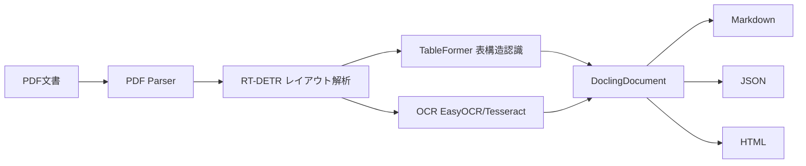
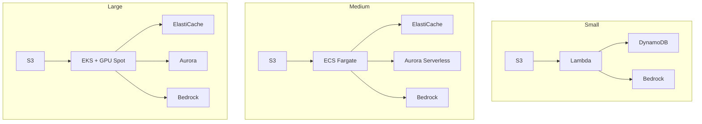

本記事は [https://arxiv.org/abs/2501.17887](https://arxiv.org/abs/2501.17887) の解説記事です。

## 論文概要（Abstract）

Doclingは、PDF・HTML・Microsoft Office・Markdown・AsciiDoc等の文書フォーマットを、統一的な構造化表現（DoclingDocument）に変換するMITライセンスのオープンソースツールキットである。IBM Researchが開発し、レイアウト解析にはDocLayNetデータセットで訓練されたRT-DETRモデル、表構造認識にはTableFormerモデルを内蔵している。コモディティハードウェア（GPU不要）で動作可能であり、Python APIおよびCLIを提供する。LangChain・LlamaIndex・spaCyとの統合プラグインが用意されており、GitHubで公開後1ヶ月で10,000スターを獲得したと報告されている。

この記事は [Zenn記事: Haystack 2.xでPDF・表・画像含む社内文書QAを構築する](https://zenn.dev/0h_n0/articles/1a2b88e04c8728) の深掘りです。

## 情報源

- **arXiv ID**: 2501.17887
- **URL**: [https://arxiv.org/abs/2501.17887](https://arxiv.org/abs/2501.17887)
- **著者**: Nikolaos Livathinos, Christoph Auer, Maksym Lysak, et al. (IBM Research)
- **発表**: 2025年1月, AAAI 25 Workshop on Open-Source AI for Mainstream Use
- **分野**: cs.CL, cs.CV, cs.SE
- **コード**: [https://github.com/DS4SD/docling](https://github.com/DS4SD/docling)

## 背景と動機（Background & Motivation）

PDF文書は人間の閲覧を前提とした「印刷指向」のフォーマットであり、論理的な文書構造（セクション階層、表の行列関係、図とキャプションの対応など）を明示的に保持していない。このため、LLMやRAGアプリケーションへの入力として利用するには、文書をパースして構造情報を復元する変換処理が不可欠である。

従来のアプローチには大きく2つの課題がある。第一に、GPT-4oやClaude等のマルチモーダルLLMを用いた変換は高品質だが、APIコストが高く、ハルシネーションのリスクがある。第二に、GrobidやMarkerなどの既存オープンソースツールは特定フォーマットに限定されるか、表構造の復元精度が不十分である。

著者らは、これらの課題に対して「忠実な変換（faithful conversion）」を設計原則として掲げている。テキストをLLMで生成するのではなく、PDFから直接抽出することでハルシネーションを原理的に回避し、AI モデルはレイアウト解析と表構造認識にのみ使用するという方針を採っている。



## 主要な貢献（Key Contributions）

- **貢献1: 統一文書表現DoclingDocument** — PDF・HTML・Office・Markdown等の多様なフォーマットを、テキスト・表・図・キャプション・リスト・セクション階層を含むPydanticベースの統一データモデルに変換する。バウンディングボックスや出典ページ番号（provenance）も保持される
- **貢献2: 2段階AIパイプライン** — RT-DETRによるレイアウト検出（段落・タイトル・表・図の領域検出と分類）とTableFormerによる表構造認識（罫線なし表・空セル・セル結合・階層ヘッダ対応）を組み合わせ、CPU上でも実用的な速度で動作するパイプラインを実現
- **貢献3: エコシステム統合** — LangChain・LlamaIndex・spaCyへのネイティブ統合プラグインに加え、IBM data-prep-kit・InstructLab・Bee Agent Frameworkとの連携を提供し、RAGからファインチューニングまでの下流タスクに対応
- **貢献4: オープンソースとして公開** — MITライセンスで全コードを公開し、GitHub公開1ヶ月で10,000スター、2024年11月にはGitHub Trending世界1位を達成したと報告されている

## 技術的詳細（Technical Details）

### PDFパイプラインの処理フロー

Doclingの中核はPDFパイプライン（`StandardPdfPipeline`）であり、以下の5段階で処理が行われる。

**Stage 1: PDF解析** — カスタムPDFパーサ（docling-parseパッケージ、qpdfライブラリベース）がテキストトークンの座標情報とページビットマップを抽出する。PyMuPDFなどのライセンス制約のあるライブラリを避け、独自実装を採用している。

**Stage 2: レイアウト解析** — RT-DETR（Real-Time Detection Transformer）ベースのモデルがページ画像から文書要素（段落、タイトル、表、図、リスト、ヘッダ/フッタ等）のバウンディングボックスを検出・分類する。DocLayNetデータセットと独自データで訓練されており、Hugging Face Transformersライブラリ経由で推論を実行する。

**Stage 3: 条件分岐処理** — 検出された領域の種別に応じて後段処理が分岐する。表領域にはTableFormerが適用され、スキャン画像にはOCR（EasyOCRまたはTesseract）が適用される。

**Stage 4: テキスト-要素マッチング** — Stage 2で予測されたバウンディングボックスとStage 1で抽出されたテキストトークンの座標を交差判定し、各要素にテキストを割り当てる。この方式により、テキストをLLMで「生成」するのではなくPDFから「抽出」するため、ハルシネーションを回避できる。

**Stage 5: 後処理と組み立て** — 各ページの結果を統合してDoclingDocumentを構築する。読み順の補正、図とキャプションのマッチングなどが行われる。

### TableFormerアーキテクチャ

TableFormerはVision Transformerベースのモデルであり、表画像から論理的な行列構造を予測する。著者らのNassar et al. (2022) で提案されたモデルを改良したものである。

主な特徴は以下の通り:

- 罫線なし表（borderless tables）への対応
- 空セルの検出
- セル結合（row span / column span）の認識
- 階層的ヘッダ構造の復元

推論はPyTorch上で実行され、GPU使用時にはx86 CPUと比較して約4.3倍の高速化が得られると報告されている（論文Figure 4より）。

### DoclingDocumentデータモデル

変換結果はPydanticベースの`DoclingDocument`として表現される。主要なフィールドは以下の通り:

- **テキスト要素**: 段落、タイトル、リスト項目
- **表**: 行列構造を保持した表データ
- **図**: バウンディングボックスとキャプション
- **階層構造**: セクション・サブセクションのネスト関係
- **メタデータ**: 出典ページ番号、バウンディングボックス座標

JSON形式でのロスレスシリアライズに加え、MarkdownやHTMLへのロッシーエクスポートにも対応している。

## 実装のポイント（Implementation Guide）

### 基本的なPDF変換

```python
from pathlib import Path
from docling.document_converter import DocumentConverter
from docling.datamodel.base_models import InputFormat
from docling.datamodel.pipeline_options import PdfPipelineOptions


def convert_pdf_to_markdown(
    pdf_path: str,
    *,
    do_table_structure: bool = True,
    do_ocr: bool = False,
) -> str:
    """PDFファイルをMarkdown形式に変換する。

    Args:
        pdf_path: 変換対象のPDFファイルパス
        do_table_structure: 表構造認識を有効にするか（デフォルト: True）
        do_ocr: OCRを有効にするか（デフォルト: False）

    Returns:
        Markdown形式の文字列
    """
    pipeline_options = PdfPipelineOptions(
        do_table_structure=do_table_structure,
        do_ocr=do_ocr,
    )
    converter = DocumentConverter(
        allowed_formats=[InputFormat.PDF],
        format_options={InputFormat.PDF: {"pipeline_options": pipeline_options}},
    )
    result = converter.convert(pdf_path)
    return result.document.export_to_markdown()
```

### Haystack 2.xとの統合

Zenn記事で取り上げたHaystack 2.xパイプラインでは、DoclingConverterを用いてPDF内の表構造を保持したまま抽出できる。以下は基本的な統合パターンである。

```python
from pathlib import Path
from docling.document_converter import DocumentConverter
from docling.datamodel.base_models import InputFormat


def extract_tables_from_pdf(pdf_path: str) -> list[dict[str, str]]:
    """PDFから表データを抽出してリストで返す。

    各表はMarkdown形式の文字列として返される。
    Haystackパイプラインのプリプロセッサに渡す前段として使用可能。

    Args:
        pdf_path: 変換対象のPDFファイルパス

    Returns:
        表データのリスト。各要素は {"index": int, "markdown": str, "page": int}
    """
    converter = DocumentConverter(allowed_formats=[InputFormat.PDF])
    result = converter.convert(pdf_path)

    tables: list[dict[str, str]] = []
    for i, table in enumerate(result.document.tables):
        tables.append({
            "index": i,
            "markdown": table.export_to_markdown(),
            "page": table.prov[0].page_no if table.prov else -1,
        })
    return tables
```

## Production Deployment Guide

DoclingベースのPDF文書変換+RAGパイプラインをAWS上に構築するための実装パターンを、規模別に整理する。

### アーキテクチャパターン概要



| 構成 | 想定負荷 | 主要サービス | 月額目安 |
|------|----------|-------------|---------|
| Small | ~100 req/日 | Lambda + S3 + DynamoDB | $50-150 |
| Medium | ~1,000 req/日 | ECS Fargate + ElastiCache + Aurora Serverless | $300-800 |
| Large | 10,000+ req/日 | EKS + GPU Spot Instances + Aurora | $2,000-5,000 |

### Small構成: Lambda + S3 + DynamoDB

1日あたり100リクエスト程度の小規模ユースケース向け。Doclingの`FAST`モード（OCR無効・表構造認識無効）であればLambdaの制約内で処理可能である。論文のベンチマークでは、OCRと表構造認識を無効にすると処理時間が約75%削減されると報告されており（論文Figure 4より）、x86 CPUで約0.8秒/ページとなる。

```hcl
# --- Small構成: VPC ---
module "vpc" {
  source  = "terraform-aws-modules/vpc/aws"
  version = "~> 5.0"

  name = "docling-small-vpc"
  cidr = "10.0.0.0/16"

  azs             = ["ap-northeast-1a", "ap-northeast-1c"]
  private_subnets = ["10.0.1.0/24", "10.0.2.0/24"]
  public_subnets  = ["10.0.101.0/24", "10.0.102.0/24"]

  enable_nat_gateway = true
  single_nat_gateway = true
}

# --- IAMロール（最小権限） ---
resource "aws_iam_role" "docling_lambda" {
  name = "docling-lambda-role"

  assume_role_policy = jsonencode({
    Version = "2012-10-17"
    Statement = [{
      Action = "sts:AssumeRole"
      Effect = "Allow"
      Principal = { Service = "lambda.amazonaws.com" }
    }]
  })
}

resource "aws_iam_role_policy" "docling_lambda_policy" {
  name = "docling-lambda-policy"
  role = aws_iam_role.docling_lambda.id

  policy = jsonencode({
    Version = "2012-10-17"
    Statement = [
      {
        Effect   = "Allow"
        Action   = ["s3:GetObject", "s3:PutObject"]
        Resource = "${aws_s3_bucket.documents.arn}/*"
      },
      {
        Effect = "Allow"
        Action = [
          "dynamodb:PutItem",
          "dynamodb:GetItem",
          "dynamodb:Query"
        ]
        Resource = aws_dynamodb_table.results.arn
      },
      {
        Effect   = "Allow"
        Action   = ["bedrock:InvokeModel"]
        Resource = "arn:aws:bedrock:ap-northeast-1::foundation-model/anthropic.claude-*"
      },
      {
        Effect = "Allow"
        Action = [
          "logs:CreateLogGroup",
          "logs:CreateLogStream",
          "logs:PutLogEvents"
        ]
        Resource = "arn:aws:logs:*:*:*"
      }
    ]
  })
}

# --- S3バケット ---
resource "aws_s3_bucket" "documents" {
  bucket = "docling-documents-${data.aws_caller_identity.current.account_id}"
}

resource "aws_s3_bucket_versioning" "documents" {
  bucket = aws_s3_bucket.documents.id
  versioning_configuration { status = "Enabled" }
}

resource "aws_s3_bucket_server_side_encryption_configuration" "documents" {
  bucket = aws_s3_bucket.documents.id
  rule {
    apply_server_side_encryption_by_default {
      sse_algorithm = "aws:kms"
    }
  }
}

resource "aws_s3_bucket_public_access_block" "documents" {
  bucket                  = aws_s3_bucket.documents.id
  block_public_acls       = true
  block_public_policy     = true
  ignore_public_acls      = true
  restrict_public_buckets = true
}

# --- DynamoDB ---
resource "aws_dynamodb_table" "results" {
  name         = "docling-results"
  billing_mode = "PAY_PER_REQUEST"
  hash_key     = "document_id"
  range_key    = "created_at"

  attribute {
    name = "document_id"
    type = "S"
  }

  attribute {
    name = "created_at"
    type = "S"
  }

  point_in_time_recovery { enabled = true }

  server_side_encryption { enabled = true }

  ttl {
    attribute_name = "expires_at"
    enabled        = true
  }
}

# --- Lambda関数 ---
resource "aws_lambda_function" "docling_converter" {
  function_name = "docling-pdf-converter"
  role          = aws_iam_role.docling_lambda.arn
  package_type  = "Image"
  image_uri     = "${aws_ecr_repository.docling.repository_url}:latest"
  memory_size   = 3008
  timeout       = 300

  environment {
    variables = {
      RESULTS_TABLE = aws_dynamodb_table.results.name
      DOCUMENTS_BUCKET = aws_s3_bucket.documents.id
      DOCLING_MODE = "FAST"
    }
  }

  vpc_config {
    subnet_ids         = module.vpc.private_subnets
    security_group_ids = [aws_security_group.lambda.id]
  }

  tracing_config { mode = "Active" }
}

# --- CloudWatch アラーム ---
resource "aws_cloudwatch_metric_alarm" "lambda_errors" {
  alarm_name          = "docling-lambda-errors"
  comparison_operator = "GreaterThanThreshold"
  evaluation_periods  = 2
  metric_name         = "Errors"
  namespace           = "AWS/Lambda"
  period              = 300
  statistic           = "Sum"
  threshold           = 5
  alarm_actions       = [aws_sns_topic.alerts.arn]

  dimensions = {
    FunctionName = aws_lambda_function.docling_converter.function_name
  }
}

resource "aws_cloudwatch_metric_alarm" "lambda_duration" {
  alarm_name          = "docling-lambda-duration"
  comparison_operator = "GreaterThanThreshold"
  evaluation_periods  = 3
  metric_name         = "Duration"
  namespace           = "AWS/Lambda"
  period              = 300
  statistic           = "Average"
  threshold           = 240000
  alarm_actions       = [aws_sns_topic.alerts.arn]

  dimensions = {
    FunctionName = aws_lambda_function.docling_converter.function_name
  }
}

data "aws_caller_identity" "current" {}
```

### Large構成: EKS + Karpenter + GPU Spot

1日10,000リクエスト以上の大規模ユースケース向け。DoclingのACCURATEモード（OCR有効・表構造認識有効）ではGPUアクセラレーションが有効であり、論文によればL4 GPUでOCRが8倍、レイアウトモデルが14倍、TableFormerが4.3倍高速化すると報告されている（論文Figure 4より）。

```hcl
# --- Large構成: EKS ---
module "eks" {
  source  = "terraform-aws-modules/eks/aws"
  version = "~> 20.0"

  cluster_name    = "docling-production"
  cluster_version = "1.31"

  vpc_id     = module.vpc.vpc_id
  subnet_ids = module.vpc.private_subnets

  cluster_endpoint_public_access = false

  cluster_addons = {
    karpenter = { most_recent = true }
  }

  eks_managed_node_groups = {
    system = {
      instance_types = ["m6i.large"]
      min_size       = 2
      max_size       = 4
      desired_size   = 2

      labels = { workload = "system" }
    }
  }

  enable_cluster_creator_admin_permissions = true
}

# --- Karpenter NodePool（Spot優先） ---
resource "kubectl_manifest" "karpenter_nodepool_gpu" {
  yaml_body = <<-YAML
    apiVersion: karpenter.sh/v1
    kind: NodePool
    metadata:
      name: docling-gpu-spot
    spec:
      template:
        spec:
          requirements:
            - key: node.kubernetes.io/instance-type
              operator: In
              values: ["g5.xlarge", "g5.2xlarge", "g6.xlarge"]
            - key: karpenter.sh/capacity-type
              operator: In
              values: ["spot", "on-demand"]
            - key: topology.kubernetes.io/zone
              operator: In
              values: ["ap-northeast-1a", "ap-northeast-1c"]
          nodeClassRef:
            group: karpenter.k8s.aws
            kind: EC2NodeClass
            name: default
      limits:
        cpu: "64"
        memory: 256Gi
        nvidia.com/gpu: "8"
      disruption:
        consolidationPolicy: WhenEmptyOrUnderutilized
        consolidateAfter: 60s
      weight: 100
  YAML
}

# --- Secrets Manager ---
resource "aws_secretsmanager_secret" "docling_config" {
  name        = "docling/production/config"
  description = "Docling production configuration"

  tags = {
    Environment = "production"
    Application = "docling"
  }
}

# --- AWS Budgets ---
resource "aws_budgets_budget" "docling_monthly" {
  name         = "docling-monthly-budget"
  budget_type  = "COST"
  limit_amount = "5000"
  limit_unit   = "USD"
  time_unit    = "MONTHLY"

  notification {
    comparison_operator       = "GREATER_THAN"
    threshold                 = 80
    threshold_type            = "PERCENTAGE"
    notification_type         = "ACTUAL"
    subscriber_email_addresses = ["alerts@example.com"]
  }

  notification {
    comparison_operator       = "GREATER_THAN"
    threshold                 = 100
    threshold_type            = "PERCENTAGE"
    notification_type         = "FORECASTED"
    subscriber_email_addresses = ["alerts@example.com"]
  }
}
```

### 運用・監視設定

#### CloudWatch ダッシュボードとX-Rayトレーシング

```hcl
resource "aws_cloudwatch_dashboard" "docling" {
  dashboard_name = "docling-operations"

  dashboard_body = jsonencode({
    widgets = [
      {
        type   = "metric"
        x      = 0
        y      = 0
        width  = 12
        height = 6
        properties = {
          metrics = [
            ["Docling", "ConversionDuration", "Stage", "LayoutAnalysis"],
            ["Docling", "ConversionDuration", "Stage", "TableFormer"],
            ["Docling", "ConversionDuration", "Stage", "OCR"],
            ["Docling", "ConversionDuration", "Stage", "Total"]
          ]
          period = 300
          stat   = "p99"
          title  = "Conversion Duration by Stage (p99)"
        }
      },
      {
        type   = "metric"
        x      = 12
        y      = 0
        width  = 12
        height = 6
        properties = {
          metrics = [
            ["Docling", "PagesProcessed", "Status", "Success"],
            ["Docling", "PagesProcessed", "Status", "Failed"]
          ]
          period = 3600
          stat   = "Sum"
          title  = "Pages Processed per Hour"
        }
      },
      {
        type   = "metric"
        x      = 0
        y      = 6
        width  = 12
        height = 6
        properties = {
          metrics = [
            ["Docling", "TablesExtracted"],
            ["Docling", "OCRPagesProcessed"]
          ]
          period = 3600
          stat   = "Sum"
          title  = "Tables & OCR Pages per Hour"
        }
      }
    ]
  })
}

resource "aws_xray_sampling_rule" "docling" {
  rule_name      = "docling-tracing"
  priority       = 1000
  version        = 1
  reservoir_size = 10
  fixed_rate     = 0.1
  url_path       = "/convert/*"
  host           = "*"
  http_method    = "*"
  service_type   = "*"
  service_name   = "docling-*"
  resource_arn   = "*"
}
```

### コスト最適化チェックリスト

#### コンピューティング

- [ ] DoclingモードをFAST/ACCURATE/CUSTOMから負荷に応じて選択
- [ ] OCR無効化で60%のCPU時間削減（論文Figure 4）
- [ ] 表構造認識無効化でさらに16%削減
- [ ] GPU Spot Instancesの活用（On-Demandの60-70%割引）
- [ ] Karpenterのconsolidation設定で未使用ノード60秒後に回収
- [ ] Lambda: メモリサイズを3008MBに設定（CPUスケール最適化）
- [ ] ECS: ARM64（Graviton）インスタンスの検討（20%コスト削減）

#### ストレージ

- [ ] S3 Intelligent-Tiering有効化
- [ ] 変換済みPDFのライフサイクルポリシー設定（90日でGlacier）
- [ ] DynamoDB TTL設定で古い変換結果を自動削除
- [ ] ECRイメージのライフサイクルポリシー（最新5バージョン保持）

#### ネットワーク

- [ ] VPCエンドポイント（S3, DynamoDB, Bedrock）でNAT Gateway課金を削減
- [ ] CloudFront配信（変換結果のキャッシュ）

#### 監視・運用

- [ ] Cost Explorerでタグ別コスト追跡
- [ ] AWS Budgetsで月額アラート（80%/100%閾値）
- [ ] Reserved Instances / Savings Plansの検討（安定負荷部分）
- [ ] CloudWatch Logs保持期間を30日に制限
- [ ] X-Rayサンプリングレート調整（高負荷時は10%以下）

#### セキュリティ

- [ ] S3バケットの暗号化（KMS管理キー）
- [ ] パブリックアクセス完全ブロック
- [ ] IAMロールは最小権限（s3:GetObject/PutObjectのみ等）
- [ ] VPC内のプライベートサブネットで処理
- [ ] Secrets Managerで設定値管理
- [ ] Lambda/ECSのVPC配置でインターネット非公開

### セキュリティベストプラクティス

1. **データ暗号化**: S3はKMS暗号化、DynamoDBはサーバーサイド暗号化を有効化。転送中のデータはTLS 1.2以上を強制する
2. **ネットワーク分離**: Docling処理はプライベートサブネットに配置し、インターネットアクセスはNAT Gateway経由のみ。VPCエンドポイントでAWSサービスへの通信を閉域化する
3. **アクセス制御**: IAMロールにはAction/Resourceを明示的に指定し、ワイルドカード（`*`）の使用を禁止。S3バケットポリシーでクロスアカウントアクセスを拒否する
4. **監査ログ**: CloudTrailで全API呼び出しを記録。S3アクセスログを有効化し、別バケットに保存する
5. **脆弱性管理**: ECRイメージスキャンを有効化し、HIGH/CRITICAL脆弱性検出時にSNS通知を送信する

## 実験結果（Experimental Results）

### 処理速度ベンチマーク

著者らは89件のPDF（合計4,008ページ、56,246テキスト要素、1,842表、4,676画像）を用いたベンチマークを実施している。DocLayNetおよびCCpdfデータセットから構成されたテストセットである。

**1ページあたりの処理時間（中央値）**（論文Figure 3, 4より）:

| システム構成 | 中央値 | 5th %ile | 95th %ile |
|-------------|--------|----------|-----------|
| x86 CPU | 0.79秒 | 0.6秒 | 16.3秒 |
| M3 Max SoC | 0.32秒 | 0.26秒 | 6.48秒 |
| NVIDIA L4 GPU | 0.114秒 | 0.057秒 | 2.081秒 |

**コンポーネント別処理時間（1ページ平均）**（論文Figure 4より）:

| コンポーネント | x86 CPU | M3 Max | L4 GPU | GPU高速化倍率 |
|---------------|---------|--------|--------|-------------|
| OCR | 13秒 | 5秒 | 1.6秒 | 8倍 |
| レイアウトモデル | 633ms | 271ms | 44ms | 14倍 |
| TableFormer | 1.74秒 | 704ms | 400ms | 4.3倍 |
| PDF解析 | 81ms | 44ms | — | — |

OCRが処理時間の大部分を占めており、無効化すると全体の約60%（CPU）〜50%（GPU）の時間削減が得られると報告されている。

### 他ツールとの比較

**1ページあたりの平均処理時間**（論文Figure 5より）:

| ツール | x86 CPU | M3 Max | L4 GPU |
|--------|---------|--------|--------|
| Docling | 3.1秒 | 1.27秒 | 0.49秒 |
| MinerU | 3.3秒 | N/A | 0.21秒 |
| Unstructured | 4.2秒 | 2.7秒 | 0.86秒 |
| Marker | 16秒以上 | 4.2秒 | 0.86秒 |

GPU環境ではMinerUが0.21秒/ページで最速であるが、CPU環境ではDoclingが最も高速であると報告されている。著者らはDoclingの強みとしてCPUでの実用的な速度を挙げている。

### 制約と限界

- OCR処理がCPU環境で主要なボトルネックであり、1ページあたり13秒を要する
- 数式認識・コード認識・図の分類は現時点では未対応であり、今後の開発ロードマップに含まれている
- GPU高速化の効果がモデルごとに不均一（レイアウト14倍 vs TableFormer 4.3倍）であり、最適化の余地がある

## 実運用への応用（Practical Applications）

### Zenn記事との関連

[Zenn記事: Haystack 2.xでPDF・表・画像含む社内文書QAを構築する](https://zenn.dev/0h_n0/articles/1a2b88e04c8728) では、DoclingConverterを用いてPDF内の表構造を保持したまま抽出し、Haystackパイプラインに渡すアーキテクチャが紹介されている。Doclingが内部でTableFormerを適用することで、罫線なし表やセル結合を含む複雑な表でも正確な行列構造が復元される。

### 社内文書QAでの活用パターン

1. **契約書レビュー**: PDF形式の契約書からDoclingで表・条項構造を抽出し、RAGパイプラインで質問応答。表内の金額・日付・条件を構造化データとして保持できる
2. **技術仕様書検索**: 多数のPDF仕様書をDoclingでバッチ変換し、ベクトルDBにインデックス。表やリストの構造を保持することで、「仕様Aの最大値は？」のような構造依存のクエリにも対応可能
3. **規制文書コンプライアンス**: 規制当局の公開PDFを定期的にDoclingで変換し、変更差分を検出

Doclingが提供するLangChain・LlamaIndexプラグインにより、既存のRAGパイプラインへの統合は最小限のコード変更で実現できる。

## 関連研究（Related Work）

**DocLayNet** (Pfitzmann et al., 2022): 著者らが構築した大規模な文書レイアウトアノテーションデータセット。11カテゴリのラベルを持ち、Doclingのレイアウト解析モデルの訓練に使用されている。

**RT-DETR** (Zhao et al., 2023): リアルタイム物体検出Transformer。Doclingではこのアーキテクチャをベースにレイアウト検出モデルを構築している。DETRの高精度とリアルタイム推論速度を両立する設計が特徴である。

**TableFormer** (Nassar et al., 2022): 著者ら自身が提案した表構造認識モデル。Vision Transformerベースで、PubTabNet等のベンチマークで評価されている。Doclingに統合され、罫線なし表やセル結合への対応が強化されている。

**競合ツール**: Grobid（学術論文特化）、Marker（LLMベース変換）、MinerU（GPU高速処理）、Unstructured（エンタープライズ向け）などが存在する。Doclingは「忠実な変換」と「CPU実用速度」を差別化要因としている。

## まとめと今後の展望

Doclingは、PDF等の多様な文書フォーマットをAIモデル（RT-DETR + TableFormer）を用いて構造化表現に変換するオープンソースツールキットである。CPU環境でも1ページあたり約0.8秒（中央値）の処理速度を達成し、LangChain・LlamaIndex等との統合プラグインによりRAGパイプラインへの組み込みが容易である。

今後の開発として、著者らは数式認識・コード認識・図の分類モデルの追加、およびベンチマーク評価フレームワークの整備をロードマップに挙げている。また、GPU最適化の不均一性（レイアウト14倍 vs TableFormer 4.3倍）の改善も課題として残されている。MITライセンスでの公開により、商用利用を含む幅広い適用が可能である。

## 参考文献

- Livathinos, N., Auer, C., Lysak, M., et al. (2025). Docling: An Efficient Open-Source Toolkit for AI-driven Document Conversion. arXiv:2501.17887. [https://arxiv.org/abs/2501.17887](https://arxiv.org/abs/2501.17887)
- GitHub: [https://github.com/DS4SD/docling](https://github.com/DS4SD/docling)
- Pfitzmann, B., et al. (2022). DocLayNet: A Large Human-Annotated Dataset for Document-Layout Segmentation. KDD 2022.
- Nassar, A., et al. (2022). TableFormer: Table Structure Understanding with Transformers. CVPR 2022.
- Zhao, Y., et al. (2024). DETRs Beat YOLOs on Real-time Object Detection. CVPR 2024. (RT-DETR)
- Zenn記事: [Haystack 2.xでPDF・表・画像含む社内文書QAを構築する](https://zenn.dev/0h_n0/articles/1a2b88e04c8728)
