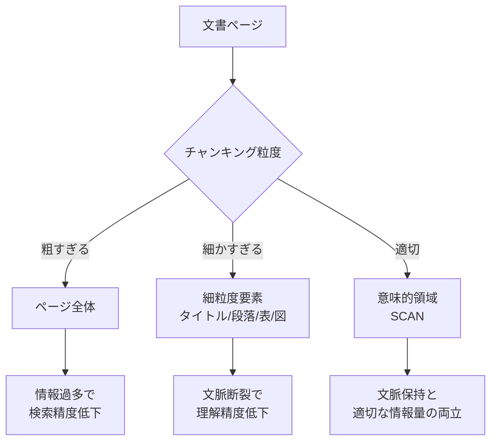
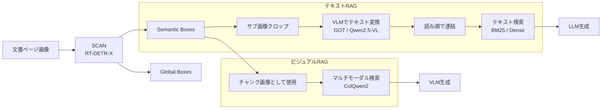

本記事は [https://arxiv.org/abs/2505.14381](https://arxiv.org/abs/2505.14381) の解説記事です。

## 論文概要（Abstract）

視覚的にリッチな文書（PDF、レポート、技術資料等）をRAGシステムで活用する際、ページ全体を処理すると情報過多でVLMの性能が低下し、細粒度のレイアウト解析では意味的文脈が断裂する問題がある。著者らは、文書を「意味的にコヒーレントな領域」に分割する粗粒度セマンティックセグメンテーション手法SCANを提案している。オブジェクト検出モデルのファインチューニングにより、テキストRAGで最大9.4ポイント、ビジュアルRAGで最大10.4ポイントの改善を英語・日本語データセットで達成したと報告されている。

この記事は [Zenn記事: Haystack 2.xでPDF・表・画像含む社内文書QAを構築する](https://zenn.dev/0h_n0/articles/1a2b88e04c8728) の深掘りです。

## 情報源

- **arXiv ID**: 2505.14381
- **URL**: [https://arxiv.org/abs/2505.14381](https://arxiv.org/abs/2505.14381)
- **著者**: Nobuhiro Ueda, Yuyang Dong, Krisztian Boros et al.
- **発表年**: 2025（v1）、2026（v3最新）
- **分野**: cs.AI（Artificial Intelligence）

## 背景と動機（Background & Motivation）

企業の技術文書や財務報告書など、視覚的にリッチな文書（Visually Rich Documents: VRDs）をRAGシステムで扱う需要が急増している。しかし、従来のアプローチには根本的なトレードオフが存在する。

**ページ全体処理の問題**: VLMにページ画像をそのまま入力すると、1ページに複数のトピックが混在するため情報過多となり、検索精度が低下する。著者らの実験では、ページ全体をチャンクとするビジュアルRAGの精度は70.2%にとどまっている（論文Table 4より）。

**細粒度レイアウト解析の問題**: DocLayout-YOLOのような従来ツールは文書を「タイトル」「段落」「表」「図」といった細粒度要素に分割する。これにより1ページあたり平均9.9個のチャンクが生成され（論文Table 5より）、関連する要素間の意味的文脈が断裂する。例えば、ある表とその説明文が別チャンクに分割されると、表の内容を正確に理解できなくなる。

SCANはこの「粒度のジレンマ」を、ページ全体と細粒度要素の中間にあたる「意味的領域」という粒度で解決する。これはZenn記事で解説したHaystackのFileTypeRouterとDoclingConverterによるPDF解析パイプラインにおいて、文書理解の精度を根本的に改善しうるアプローチである。



## 主要な貢献（Key Contributions）

- **貢献1: 意味的文書レイアウト解析の定義** — ページを「トピック的にコヒーレントな領域」に分割する新しいタスクを定義した。従来の細粒度レイアウト解析（タイトル、段落、表等の分類）とは異なり、関連する複数要素を1つの意味的領域としてまとめる粗粒度アプローチである
- **貢献2: 大規模アノテーションデータセットの構築** — 日本語CCpdfコーパスから24,577ページにアノテーションを付与し、8つの文書ドメイン（表・チャート、フライヤー、地図、手書き文書等）をカバーするデータセットを構築した
- **貢献3: テキストRAGとビジュアルRAGの両方を改善** — 単一の手法で、テキストベースRAGでは最大9.4ポイント、ビジュアルRAGでは最大10.4ポイントの改善を達成した。英語（OHR-Bench）と日本語（BizMMRAG、Allganize）の両方で有効性が検証されている
- **貢献4: 計算効率の向上** — チャンクあたりの入力トークン数を削減することで、VLMの処理時間を短縮した。10ページ処理で56.3秒（SCAN）対68.0秒（チャンキングなし）と報告されている（論文Table 3より）

## 技術的詳細（Technical Details）

### 意味的チャンクの定義

SCANでは文書ページ上の領域を2種類のボックスとして定義する。

- **Semantic Box**: 単一のサブトピックに関連する内容をカバーする矩形領域。1ページに複数存在し、テキスト・表・図を横断して意味的に統一されたコンテンツをまとめる
- **Global Box**: ページレベルのメタデータ（ヘッダー、フッター、日付、著者名等）を囲む矩形領域

訓練データでは1ページあたり平均5.01個のボックスが定義されており、全体で76,862個のSemantic Boxと46,289個のGlobal Boxがアノテーションされている（論文Section 3.2より）。

### オブジェクト検出によるアプローチ

著者らはSemantic/Global Boxの予測を多クラスオブジェクト検出タスクとして定式化している。以下の2つのアーキテクチャをファインチューニングしている。

- **YOLO11-X**（57Mパラメータ）: リアルタイム推論向け。4台のNVIDIA L40 GPU（48GB）で約4時間、30エポックの訓練
- **RT-DETR-X**（67Mパラメータ）: Transformerベースの検出器。8台のNVIDIA A100 GPU（80GB）で約16時間、120エポックの訓練。こちらが主要モデルとして採用

RT-DETR-Xは信頼度閾値0.4で59.6%のIoUと79.0%のカバレッジを達成している（論文Section 4.1より）。

### 評価指標: マッチングベースIoU

従来のオブジェクト検出評価（mAP等）は細粒度のカテゴリ分類を前提とするが、SCANの目的はカテゴリ分類ではなく領域分割である。そこで著者らはマッチングベースIoUメトリクスを導入している。

予測ボックス集合 $\hat{B} = \{\hat{b}_1, \ldots, \hat{b}_m\}$ と正解ボックス集合 $B = \{b_1, \ldots, b_n\}$ に対して、各正解ボックス $b_j$ に対する最良マッチを求める:

$$
\text{IoU}_j = \max_{\hat{b}_i \in \hat{B}} \frac{|b_j \cap \hat{b}_i|}{|b_j \cup \hat{b}_i|}
$$

全体のスコアは全正解ボックスの平均IoUとして算出される:

$$
\text{Matching-IoU} = \frac{1}{n} \sum_{j=1}^{n} \text{IoU}_j
$$

ここで、$\|\cdot\|$ は領域の面積を表す。この指標により、ボックスの数や分割方法が異なっていても、正解領域をどの程度カバーできているかを評価できる。

### RAGパイプラインへの統合

SCANの予測結果はテキストRAGとビジュアルRAGの両方に適用される。



**テキストRAGパイプライン**:
1. SCANがSemantic BoxとGlobal Boxを予測
2. 各ボックスに基づいて元ページからサブ画像をクロップ
3. 各サブ画像をVLM（GOT-580MまたはQwen2.5-VL-72B）でテキストに変換
4. y座標・x座標の順でソートし、読み順に従ってテキストを連結
5. 連結されたテキストを検索インデックスに登録

**ビジュアルRAGパイプライン**:
1. SCANが予測したボックスでページをクロップ
2. クロップされた画像をそのままチャンクとして使用
3. ColQwen2によるマルチモーダル検索で関連チャンクを取得

テキストRAGでは、読み順の決定にボックスのy座標とx座標を使用する単純なルールベース手法が採用されている。この手法はGlobal Box（ヘッダー・フッター等）の除外にも活用でき、ノイズの少ないテキスト抽出を実現する。

## 実装のポイント（Implementation）

SCANの推論パイプラインをPythonで実装する際の要点を示す。RT-DETR-Xモデルによる領域検出後、各Semantic Boxに基づいてページ画像をクロップし、RAGシステムに投入する流れとなる。

```python
from dataclasses import dataclass
from PIL import Image


@dataclass
class SemanticBox:
    """SCANが予測する意味的領域のバウンディングボックス

    Attributes:
        x1: 左上x座標（ピクセル）
        y1: 左上y座標（ピクセル）
        x2: 右下x座標（ピクセル）
        y2: 右下y座標（ピクセル）
        confidence: 検出信頼度スコア（0.0-1.0）
        label: ボックスラベル（"semantic" or "global"）
    """
    x1: float
    y1: float
    x2: float
    y2: float
    confidence: float
    label: str


def sort_boxes_reading_order(boxes: list[SemanticBox]) -> list[SemanticBox]:
    """ボックスを読み順（上→下、左→右）でソート

    Args:
        boxes: SCANが予測したSemanticBoxのリスト

    Returns:
        読み順にソートされたSemanticBoxのリスト
    """
    return sorted(boxes, key=lambda b: (b.y1, b.x1))


def crop_semantic_regions(
    page_image: Image.Image,
    boxes: list[SemanticBox],
    confidence_threshold: float = 0.4,
    exclude_global: bool = True,
) -> list[Image.Image]:
    """SCANの予測ボックスに基づいてページ画像をクロップ

    Args:
        page_image: 元のページ画像
        boxes: SCANが予測したバウンディングボックスのリスト
        confidence_threshold: 検出信頼度の閾値（論文推奨: 0.4）
        exclude_global: Trueの場合、Global Box（ヘッダー等）を除外

    Returns:
        クロップされたサブ画像のリスト（読み順）
    """
    filtered = [
        b for b in boxes
        if b.confidence >= confidence_threshold
        and (not exclude_global or b.label == "semantic")
    ]
    sorted_boxes = sort_boxes_reading_order(filtered)

    cropped_images: list[Image.Image] = []
    for box in sorted_boxes:
        region = page_image.crop((box.x1, box.y1, box.x2, box.y2))
        cropped_images.append(region)

    return cropped_images
```

実装上の注意点として、著者らは信頼度閾値を0.4に設定することを推奨している（論文Section 4.1より）。閾値を高くすると検出漏れが増え、低くすると誤検出が増加する。また、SCANの制約として、物理的に離れた位置にあるが論理的に同一トピックに属する領域は、矩形ボックスの制約により1つのSemantic Boxにまとめられない場合がある。

## Production Deployment Guide

### AWS実装パターン（文書レイアウト解析API向け）

SCANベースの文書レイアウト解析をAWS上にデプロイする際の構成を、トラフィック量別に示す。RT-DETR-X（67Mパラメータ）の推論にはGPUが必要であり、後段のVLMによるテキスト変換も考慮した構成とする。

| 構成 | トラフィック | 主要サービス | 月額概算 |
|------|------------|-------------|---------|
| Small | ~100 req/日 | Lambda + SageMaker Serverless + Bedrock | $80-200 |
| Medium | ~1,000 req/日 | ECS Fargate (GPU) + Bedrock Batch | $500-1,200 |
| Large | 10,000+ req/日 | EKS + Karpenter (Spot GPU) + Bedrock | $3,000-6,000 |

**Small構成の詳細**: API GatewayでリクエストをLambdaに受け、PDFをS3に格納後、SageMaker Serverless Inference Endpoint（ml.g5.xlarge）でSCAN推論を実行する。テキスト変換はBedrock Claude 3.5 Sonnetを使用し、結果をDynamoDBに保存する。GPU常時稼働を避けることで月額$80-200に抑制できる。

**Medium構成の詳細**: ECS Fargate上でGPUタスク（NVIDIA T4）を起動し、SCANモデルを常時ロードする。Bedrock Batch APIを活用して非同期でテキスト変換を行い、Batch利用により50%のコスト削減が可能である。月額$500-1,200。

**Large構成の詳細**: EKS上にKarpenterでSpot GPU Instances（g5.xlarge）を動的にプロビジョニングする。Spot利用により最大90%のコスト削減が見込める。HPA（Horizontal Pod Autoscaler）でSCANポッド数をリクエスト量に連動させる。月額$3,000-6,000。

**コスト試算の注意事項**: 上記は2026年9月時点のAWS ap-northeast-1（東京）リージョン料金に基づく概算値である。実際のコストはトラフィックパターン、リージョン、Spot価格の変動により異なる。最新料金はAWS料金計算ツールで確認を推奨する。

### Terraformインフラコード

**Small構成（Serverless）**:

```hcl
# --- VPC基盤（NAT Gateway不使用でコスト削減） ---
resource "aws_vpc" "scan_vpc" {
  cidr_block           = "10.0.0.0/16"
  enable_dns_hostnames = true
  tags = { Name = "scan-api-vpc", Project = "scan-layout" }
}

resource "aws_subnet" "private" {
  count             = 2
  vpc_id            = aws_vpc.scan_vpc.id
  cidr_block        = "10.0.${count.index + 1}.0/24"
  availability_zone = data.aws_availability_zones.available.names[count.index]
  tags = { Name = "scan-private-${count.index}" }
}

# --- IAMロール（最小権限） ---
resource "aws_iam_role" "lambda_role" {
  name = "scan-api-lambda-role"
  assume_role_policy = jsonencode({
    Version = "2012-10-17"
    Statement = [{
      Action = "sts:AssumeRole"
      Effect = "Allow"
      Principal = { Service = "lambda.amazonaws.com" }
    }]
  })
}

resource "aws_iam_role_policy" "lambda_policy" {
  name = "scan-api-lambda-policy"
  role = aws_iam_role.lambda_role.id
  policy = jsonencode({
    Version = "2012-10-17"
    Statement = [
      {
        Effect   = "Allow"
        Action   = ["s3:GetObject", "s3:PutObject"]
        Resource = "${aws_s3_bucket.documents.arn}/*"
      },
      {
        Effect   = "Allow"
        Action   = ["sagemaker:InvokeEndpoint"]
        Resource = aws_sagemaker_endpoint.scan_endpoint.arn
      },
      {
        Effect   = "Allow"
        Action   = ["bedrock:InvokeModel"]
        Resource = "arn:aws:bedrock:ap-northeast-1::foundation-model/anthropic.claude-3-5-sonnet-*"
      },
      {
        Effect   = "Allow"
        Action   = ["dynamodb:PutItem", "dynamodb:GetItem", "dynamodb:Query"]
        Resource = aws_dynamodb_table.results.arn
      }
    ]
  })
}

# --- Lambda関数 ---
resource "aws_lambda_function" "scan_api" {
  function_name = "scan-layout-api"
  runtime       = "python3.12"
  handler       = "handler.lambda_handler"
  role          = aws_iam_role.lambda_role.arn
  timeout       = 300
  memory_size   = 512

  environment {
    variables = {
      SAGEMAKER_ENDPOINT = aws_sagemaker_endpoint.scan_endpoint.endpoint_name
      RESULTS_TABLE      = aws_dynamodb_table.results.name
      DOCUMENT_BUCKET    = aws_s3_bucket.documents.id
    }
  }
  tags = { Project = "scan-layout" }
}

# --- DynamoDB（On-Demand） ---
resource "aws_dynamodb_table" "results" {
  name         = "scan-layout-results"
  billing_mode = "PAY_PER_REQUEST"
  hash_key     = "document_id"
  range_key    = "page_number"

  attribute {
    name = "document_id"
    type = "S"
  }
  attribute {
    name = "page_number"
    type = "N"
  }

  server_side_encryption { enabled = true }
  tags = { Project = "scan-layout" }
}

# --- CloudWatchアラーム（コスト監視） ---
resource "aws_cloudwatch_metric_alarm" "lambda_errors" {
  alarm_name          = "scan-api-lambda-errors"
  comparison_operator = "GreaterThanThreshold"
  evaluation_periods  = 2
  metric_name         = "Errors"
  namespace           = "AWS/Lambda"
  period              = 300
  statistic           = "Sum"
  threshold           = 5
  alarm_description   = "SCAN API Lambda error rate exceeded"
  dimensions = { FunctionName = aws_lambda_function.scan_api.function_name }
}
```

**Large構成（Container）**:

```hcl
# --- EKSクラスタ ---
module "eks" {
  source          = "terraform-aws-modules/eks/aws"
  version         = "~> 20.0"
  cluster_name    = "scan-layout-cluster"
  cluster_version = "1.31"
  vpc_id          = aws_vpc.scan_vpc.id
  subnet_ids      = aws_subnet.private[*].id

  cluster_endpoint_public_access = false
  tags = { Project = "scan-layout" }
}

# --- Karpenter Provisioner（Spot GPU優先） ---
resource "kubectl_manifest" "karpenter_nodepool" {
  yaml_body = yamlencode({
    apiVersion = "karpenter.sh/v1"
    kind       = "NodePool"
    metadata   = { name = "scan-gpu-pool" }
    spec = {
      template = {
        spec = {
          requirements = [
            { key = "karpenter.sh/capacity-type", operator = "In", values = ["spot", "on-demand"] },
            { key = "node.kubernetes.io/instance-type", operator = "In", values = ["g5.xlarge", "g5.2xlarge"] },
          ]
          nodeClassRef = { name = "default" }
        }
      }
      limits   = { cpu = "64", memory = "256Gi", "nvidia.com/gpu" = "8" }
      disruption = {
        consolidationPolicy = "WhenEmptyOrUnderutilized"
        consolidateAfter    = "30s"
      }
    }
  })
}

# --- Secrets Manager ---
resource "aws_secretsmanager_secret" "bedrock_config" {
  name = "scan-layout/bedrock-config"
  tags = { Project = "scan-layout" }
}

# --- AWS Budgets ---
resource "aws_budgets_budget" "scan_monthly" {
  name         = "scan-layout-monthly"
  budget_type  = "COST"
  limit_amount = "5000"
  limit_unit   = "USD"
  time_unit    = "MONTHLY"

  notification {
    comparison_operator       = "GREATER_THAN"
    threshold                 = 80
    threshold_type            = "PERCENTAGE"
    notification_type         = "ACTUAL"
    subscriber_email_addresses = ["admin@example.com"]
  }
}
```

### 運用・監視設定

**CloudWatch Logs Insights クエリ**（コスト異常検知）:

```
fields @timestamp, @message
| filter @message like /token_count/
| stats sum(token_count) as total_tokens by bin(1h)
| sort @timestamp desc
| limit 24
```

**CloudWatch Logs Insights クエリ**（レイテンシ分析）:

```
fields @timestamp, duration_ms
| filter event = "scan_inference"
| stats avg(duration_ms) as avg_latency,
        percentile(duration_ms, 95) as p95,
        percentile(duration_ms, 99) as p99
  by bin(1h)
```

**CloudWatch アラーム設定**:

```python
import boto3

cloudwatch = boto3.client("cloudwatch", region_name="ap-northeast-1")

def create_token_usage_alarm(function_name: str, sns_topic_arn: str) -> None:
    """Bedrockトークン使用量スパイク検知アラームを作成

    Args:
        function_name: Lambda関数名
        sns_topic_arn: 通知先SNSトピックARN
    """
    cloudwatch.put_metric_alarm(
        AlarmName=f"{function_name}-token-spike",
        MetricName="InputTokenCount",
        Namespace="AWS/Bedrock",
        Statistic="Sum",
        Period=3600,
        EvaluationPeriods=2,
        Threshold=100000,
        ComparisonOperator="GreaterThanThreshold",
        AlarmActions=[sns_topic_arn],
        AlarmDescription="Bedrock token usage spike detected",
    )
```

**X-Ray トレーシング設定**:

```python
from aws_xray_sdk.core import xray_recorder, patch_all

patch_all()  # boto3自動計装

@xray_recorder.capture("scan_inference")
def run_scan_inference(page_image_s3_key: str) -> dict:
    """SCANモデル推論をX-Rayトレース付きで実行

    Args:
        page_image_s3_key: S3上のページ画像キー

    Returns:
        検出されたSemantic Boxのリスト
    """
    subsegment = xray_recorder.current_subsegment()
    subsegment.put_annotation("document_type", "pdf")
    subsegment.put_metadata("s3_key", page_image_s3_key)

    # SageMakerエンドポイント呼び出し
    result = sagemaker_runtime.invoke_endpoint(
        EndpointName="scan-layout-endpoint",
        Body=page_image_s3_key,
        ContentType="application/json",
    )
    return result
```

**Cost Explorer自動レポート**:

```python
import boto3
from datetime import datetime, timedelta

ce = boto3.client("ce", region_name="ap-northeast-1")
sns = boto3.client("sns", region_name="ap-northeast-1")


def daily_cost_report(sns_topic_arn: str) -> dict:
    """日次コストレポートを取得しSNS通知

    Args:
        sns_topic_arn: 通知先SNSトピックARN

    Returns:
        サービス別コスト内訳の辞書
    """
    end = datetime.utcnow().strftime("%Y-%m-%d")
    start = (datetime.utcnow() - timedelta(days=1)).strftime("%Y-%m-%d")

    response = ce.get_cost_and_usage(
        TimePeriod={"Start": start, "End": end},
        Granularity="DAILY",
        Metrics=["UnblendedCost"],
        Filter={
            "Tags": {
                "Key": "Project",
                "Values": ["scan-layout"],
            }
        },
        GroupBy=[{"Type": "DIMENSION", "Key": "SERVICE"}],
    )

    costs = {}
    total = 0.0
    for group in response["ResultsByTime"][0]["Groups"]:
        service = group["Keys"][0]
        amount = float(group["Metrics"]["UnblendedCost"]["Amount"])
        costs[service] = amount
        total += amount

    if total > 100:
        sns.publish(
            TopicArn=sns_topic_arn,
            Subject="SCAN Layout API: Daily cost exceeded $100",
            Message=f"Total: ${total:.2f}\n{costs}",
        )

    return costs
```

### コスト最適化チェックリスト

**アーキテクチャ選択**:
- [ ] トラフィック量でServerless/Hybrid/Containerを判断
- [ ] GPU推論頻度に応じてSageMaker Serverless vs 常時起動を選択
- [ ] バッチ処理可能な場合はBedrock Batch APIを検討

**リソース最適化**:
- [ ] GPU: Spot Instances優先（g5.xlarge Spot: 最大90%削減）
- [ ] Reserved Instances: 1年コミットで最大72%削減
- [ ] Savings Plans: Compute Savings Plansで柔軟に割引
- [ ] SageMaker: Serverless Inferenceでアイドル時ゼロコスト
- [ ] Lambda: メモリサイズ512MB-1024MBで最適化（Power Tuning活用）
- [ ] ECS/EKS: Karpenterでアイドル時スケールダウン

**LLMコスト削減**:
- [ ] Bedrock Batch API使用で50%削減
- [ ] Prompt Caching有効化で30-90%削減（同一文書の複数ページ処理時）
- [ ] モデル選択ロジック: 簡易OCRはGOT-580M、複雑な表はClaude 3.5 Sonnet
- [ ] 出力トークン数制限: 不要な冗長生成を抑制

**監視・アラート**:
- [ ] AWS Budgets: 月額予算アラート（80%/100%閾値）
- [ ] CloudWatch アラーム: Lambda/SageMakerエラー率
- [ ] Cost Anomaly Detection: 日次異常検知有効化
- [ ] 日次コストレポート: SNS通知で運用チームに共有

**リソース管理**:
- [ ] 未使用SageMakerエンドポイント削除（自動停止設定）
- [ ] タグ戦略: Project/Environment/Ownerタグ必須
- [ ] S3ライフサイクルポリシー: 処理済みPDFを90日後にGlacierへ
- [ ] 開発環境: 夜間・週末にGPUインスタンス停止
- [ ] ECRイメージ: 古いイメージの自動削除ポリシー

## 実験結果（Results）

### テキストRAG

著者らは3つのデータセット（OHR-Bench: 英語、BizMMRAG・Allganize: 日本語）で評価を行っている。

| データセット | VLM | ベースライン | SCAN | 改善 |
|-------------|-----|------------|------|------|
| OHR-Bench | GOT-580M | 24.6% | 30.8% | **+6.2pp** |
| OHR-Bench | Qwen2.5-VL-72B | 31.1% | 33.8% | **+2.7pp** |
| BizMMRAG | Qwen2.5-VL-72B | - | - | **+7.3pp** |
| Allganize | Qwen2.5-VL-72B | - | - | **+9.4pp** |

OHR-Benchでのコンテンツタイプ別精度（SCAN + GOT）は、テキスト: 68.5%、表: 54.3%、数式: 50.7%、チャート: 36.6%と報告されている（論文Table 2より）。特にOCR特化の小型VLM（GOT-580M）との組み合わせで大きな改善が得られており、コスト効率の高い構成が可能であることを示している。

### ビジュアルRAG

| データセット | チャンキングなし | SCAN | 改善 |
|-------------|---------------|------|------|
| OHR-Bench | 70.2% | 75.8% | **+5.6pp** |
| BizMMRAG | 58.9% | - | **+10.4pp** |
| Allganize | 69.9% | 75.5% | **+5.6pp** |

特にBizMMRAGでの+10.4ポイントの改善は、日本語の財務・IT・製造業文書において意味的チャンキングが有効であることを示している。OHR-Benchでは、読み順が重要なタスクにおいて+18.4ポイントの改善が確認されている（論文Table 4より）。

### チャンキング粒度の比較

著者らは粒度の異なるチャンキング手法を比較している（論文Table 5より）。

| 手法 | チャンク数/ページ | 相対サイズ |
|------|-----------------|-----------|
| チャンキングなし | 1.0 | 100% |
| DocLayout-YOLO | 9.9 | 11.3% |
| Beehive | 17.4 | 4.8% |
| SCAN | 5.2 | 19.1% |

SCANは他の手法と比較して少ないチャンク数で大きいチャンクサイズを維持しており、これが意味的文脈の保持と検索精度の向上に寄与していると著者らは分析している。

## 実運用への応用（Practical Applications）

### Haystackパイプラインへの統合

Zenn記事で解説したHaystack 2.xのPDF処理パイプラインでは、FileTypeRouterで文書を振り分け、DoclingConverterでPDFをテキストに変換している。SCANはこのパイプラインの前段に挿入することで、PDFの各ページを意味的領域に分割してからテキスト変換に渡すことができる。

具体的な統合パターンとして、以下が考えられる:

1. **前処理としてのSCAN**: PDFレンダラーでページ画像を生成 -> SCANで意味的領域を検出 -> 各領域をDoclingConverterに個別に渡す。これにより、表と説明文が同一チャンクに含まれる高品質なテキスト抽出が可能になる
2. **ハイブリッドRAG**: テキストRAGとビジュアルRAGを併用し、テキスト検索で取得した候補をビジュアル検索で再ランキングする。SCANの統一的なチャンキングにより、両方のモダリティで一貫したチャンク単位を使用できる

ただし、SCANのモデルは日本語文書で訓練されているため、英語を含む多言語文書では追加の訓練データが必要になる可能性がある。また、RT-DETR-X（67Mパラメータ）の推論にはGPUが必要であり、サーバレス環境ではコールドスタートのレイテンシに注意が必要である。

## 関連研究（Related Work）

- **DocLayout-YOLO**: 文書レイアウト要素（タイトル、段落、表等）を細粒度に検出するYOLOベースのモデル。SCANとは粒度が異なり、DocLayout-YOLOは1ページあたり平均9.9個の要素を検出するのに対し、SCANは5.2個の意味的領域を検出する
- **LayoutLMv3**: テキスト・画像・レイアウト情報を統合した事前学習モデル。文書理解タスクに広く使われるが、RAG向けのチャンキングには直接適用しにくい
- **Docling**: IBM Researchが開発したエンドツーエンドの文書変換ツール。PDFからMarkdownへの変換に優れるが、意味的な領域分割機能は持たない。Zenn記事で使用しているDoclingConverterの上流にSCANを配置する構成が考えられる
- **ColQwen2**: マルチモーダル検索のためのVLMベースの埋め込みモデル。SCANのビジュアルRAGパイプラインで検索エンジンとして使用されている

## まとめと今後の展望

SCANは、文書レイアウト解析の粒度を「意味的コヒーレンス」という基準で再定義し、テキストRAGとビジュアルRAGの両方で一貫した改善を達成した手法である。特に、日本語文書での大幅な改善（BizMMRAGで+10.4pp）は、非英語文書のRAG処理における課題解決の糸口を示している。

今後の研究方向として、著者らは以下を挙げている: (1) 物理的に離れた関連領域を結合するための非矩形領域の導入、(2) 多言語対応のための追加訓練データの構築、(3) ページの複雑度に応じてSCAN適用の要否を動的に判断するアダプティブアプローチ。Haystackのような文書処理フレームワークとの統合が進めば、企業の社内文書QAシステムの検索精度向上に直接的に貢献できる可能性がある。

## 参考文献

- **arXiv**: [https://arxiv.org/abs/2505.14381](https://arxiv.org/abs/2505.14381)
- **Related Zenn article**: [https://zenn.dev/0h_n0/articles/1a2b88e04c8728](https://zenn.dev/0h_n0/articles/1a2b88e04c8728)
- **DocLayout-YOLO**: [https://arxiv.org/abs/2410.12628](https://arxiv.org/abs/2410.12628)
- **Docling**: [https://github.com/DS4SD/docling](https://github.com/DS4SD/docling)
- **ColQwen2**: [https://huggingface.co/vidore/colqwen2-v1.0](https://huggingface.co/vidore/colqwen2-v1.0)
