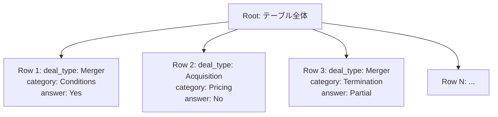

本記事は [https://arxiv.org/abs/2605.00318](https://arxiv.org/abs/2605.00318) の解説記事です。

## 論文概要

Structure-Aware Tabular Chunking (STC) は、RAGパイプラインにおける表データのチャンキング問題に対処するフレームワークである。著者らは、既存のチャンキング戦略が非構造化テキスト向けに設計されており、表データの行・列間の関係性を破壊する問題を指摘している。STCは各行をkey-valueブロックとして階層的に表現するRow Tree構造を導入し、トークン制約下での構造的分割と重複なし貪欲マージを組み合わせることで、MAUDベンチマークにおいてチャンク数を40-56%削減し、ハイブリッド検索設定でMRRを0.3576から0.5945に改善したと報告している。

この記事は [Zenn記事: Haystack 2.xでPDF・表・画像含む社内文書QAを構築する](https://zenn.dev/0h_n0/articles/1a2b88e04c8728) の深掘りです。

## 情報源

| 項目 | 内容 |
|------|------|
| arXiv ID | [2605.00318](https://arxiv.org/abs/2605.00318) |
| URL | [https://arxiv.org/abs/2605.00318](https://arxiv.org/abs/2605.00318) |
| 著者 | Pooja Guttal, Varun Magotra, Vasudeva Mahavishnu, Natasha Chanto, Sidharth Sivaprasad, Manas Gaur |
| 発表 | 2026年5月 |
| 分野 | cs.CL（自然言語処理）、cs.IR（情報検索） |

## 背景と動機

RAGパイプラインにおけるチャンキングは検索精度を左右する重要な前処理であるが、既存手法はテキストデータを前提に設計されている。固定サイズ分割やスライディングウィンドウ分割は「線形かつ意味的に連続なテキスト」を仮定しており、CSV・Excel・データベースエクスポートなどの表データに適用すると深刻な問題が生じる。

著者らは、表データの素朴な線形化（linearization）が「切り詰められたコンテキスト、関係情報の喪失、意味的に一貫性のないチャンク」を引き起こすと指摘している。例えば、固定サイズ分割では行の途中でチャンク境界が発生し、列名と値が別チャンクに分離される。スライディングウィンドウを用いたオーバーラップ付き分割は冗長なトークンを生み、チャンク数の増加と検索コストの増大を招く。

構造的な分割の先行研究としてCAST（Abstract Syntax Treeベースのコード向けチャンキング）が存在するが、プログラミング言語の構文木表現に依存するため表データには適用できない。著者らはこのギャップに着目し、表データ固有の階層構造を活用するチャンキングフレームワークを設計している。

## 主要な貢献

著者らが主張する本論文の貢献は以下の通りである。

1. **Row Tree表現**: 表データを行単位のkey-valueブロックとして階層的に構造化する表現形式を提案。単一テーブル（CSV）ではroot-row構造、複数シート（Excel）ではroot-sheet-row構造をとる
2. **Token-Constrained Splitting**: Row Treeの構造的境界に沿った分割アルゴリズム。トークン予算を超過する行に対してはkey-value対単位の緊急分割（Emergency Splitting）を適用する
3. **Overlap-Free Greedy Merging**: 同一親ノード内の隣接リーフを重複なしで貪欲にマージし、トークン利用効率を最大化する
4. **実験的検証**: MAUDデータセットにおいてチャンク数40-56%削減、MRR 66%改善を達成

## 技術的詳細

### Row Tree表現

Row Treeは表データを階層的なツリー構造に変換する表現形式である。ツリーの構成は以下の通りである。

- **ルートノード**: テーブル全体を表す
- **中間ノード**（存在する場合）: Excelのシートに対応
- **リーフノード**: 個々の行に対応し、key-value形式で格納

各行 $r_i$ は列ヘッダ集合 $H = \{h_1, h_2, \ldots, h_m\}$ を用いて、非空セルのみをkey-valueペアとして符号化する。

$$
n_i = \text{KVEncode}(r_i, H) = \{h_j: v_{ij} \mid v_{ij} \neq \emptyset, \; j = 1, \ldots, m\}
$$

ここで $v_{ij}$ は行 $r_i$ の列 $h_j$ に対応する値、$n_i$ は行 $r_i$ に対応するリーフノードである。この表現により、空セルが除外されてトークン効率が向上し、各チャンクが「列名: 値」の自己説明的な形式を保持する。



### Token-Constrained Splitting

分割アルゴリズムはRow Treeに対してトップダウンの階層的走査を行い、トークン予算 $B$ の制約下でリーフノードをチャンクにグループ化する。アルゴリズムの手順は以下の通りである。

1. 列ヘッダ $H$ を構築し、空のリーフリスト $L$ を初期化する
2. 各行 $r_i$ について:
   - コンテキスト $H$ を付与してkey-valueブロック $n_i$ に変換する
   - $\text{TokenCount}(n_i) \leq B$ の場合: $n_i$ を $L$ に追加
   - $\text{TokenCount}(n_i) > B$ の場合: Emergency Splittingを適用（後述）
3. $L$ 内のリーフを先頭から順に走査し、トークン予算 $B$ 以内で貪欲にバッチ化してチャンクを形成する

**Emergency Splitting**: 単一行がトークン予算 $B$ を超過する場合に適用される。行のkey-valueペア列 $\{(h_1, v_1), (h_2, v_2), \ldots\}$ を順に走査し、次のペアを追加するとトークン制限を超過する時点で新しいフラグメントを開始する。各フラグメントは完全なkey-valueペアのみを含み、ペアの途中での分割は発生しない。

### Overlap-Free Greedy Merging

マージステージは隣接するリーフノードを結合してチャンク数を削減し、トークン利用効率を向上させる。マージの制約は以下の通りである。

- マージは**同一親ノード**内のリーフノード間でのみ行う（構造的一貫性の維持）
- リーフノードを順に走査し、現在のチャンクに次のノードを追加してもトークン予算 $B$ 以内であればマージする
- 予算を超過する場合は新しいチャンクを開始する
- **オーバーラップは一切導入しない**

この設計により、従来手法のスライディングウィンドウで発生する冗長トークンを完全に排除し、各チャンクが高密度かつ非重複な情報単位となる。

### Python実装例

以下はSTCフレームワークの中核ロジックを示す簡易実装である。

```python
import csv
from dataclasses import dataclass, field
from typing import Optional

import tiktoken


@dataclass
class RowNode:
    """Row Treeのリーフノード。1行をkey-value形式で保持する。"""

    row_index: int
    kv_pairs: list[tuple[str, str]]
    parent_id: Optional[str] = None

    def to_text(self) -> str:
        """key-valueペアをテキスト表現に変換する。"""
        return "\n".join(f"{k}: {v}" for k, v in self.kv_pairs)


@dataclass
class Chunk:
    """トークン予算内のノード群をまとめたチャンク。"""

    nodes: list[RowNode] = field(default_factory=list)
    token_count: int = 0

    def to_text(self) -> str:
        """チャンク全体のテキスト表現を返す。"""
        return "\n---\n".join(node.to_text() for node in self.nodes)


def build_row_tree(
    rows: list[dict[str, str]],
    parent_id: Optional[str] = None,
) -> list[RowNode]:
    """CSVの行リストからRow Treeのリーフノードを構築する。

    Args:
        rows: 辞書形式の行データ。各キーは列名。
        parent_id: 親ノードID（Excelシート名など）。

    Returns:
        RowNodeのリスト。空セルは除外される。
    """
    nodes: list[RowNode] = []
    for i, row in enumerate(rows):
        kv_pairs = [(k, v) for k, v in row.items() if v.strip()]
        if kv_pairs:
            nodes.append(RowNode(row_index=i, kv_pairs=kv_pairs, parent_id=parent_id))
    return nodes


def count_tokens(text: str, model: str = "cl100k_base") -> int:
    """テキストのトークン数を計算する。

    Args:
        text: トークン数を計算するテキスト。
        model: tiktokenのエンコーディング名。

    Returns:
        トークン数。
    """
    enc = tiktoken.get_encoding(model)
    return len(enc.encode(text))


def emergency_split(node: RowNode, token_budget: int) -> list[RowNode]:
    """トークン予算を超過するノードをkey-value境界で分割する。

    Args:
        node: 分割対象のRowNode。
        token_budget: 1チャンクあたりの最大トークン数。

    Returns:
        分割されたRowNodeのリスト。
    """
    fragments: list[RowNode] = []
    current_pairs: list[tuple[str, str]] = []
    current_tokens = 0

    for k, v in node.kv_pairs:
        pair_text = f"{k}: {v}"
        pair_tokens = count_tokens(pair_text)

        if current_tokens + pair_tokens > token_budget and current_pairs:
            fragments.append(
                RowNode(
                    row_index=node.row_index,
                    kv_pairs=current_pairs,
                    parent_id=node.parent_id,
                )
            )
            current_pairs = []
            current_tokens = 0

        current_pairs.append((k, v))
        current_tokens += pair_tokens

    if current_pairs:
        fragments.append(
            RowNode(
                row_index=node.row_index,
                kv_pairs=current_pairs,
                parent_id=node.parent_id,
            )
        )
    return fragments


def structure_aware_chunk(
    rows: list[dict[str, str]],
    token_budget: int = 512,
    parent_id: Optional[str] = None,
) -> list[Chunk]:
    """STCフレームワークによる構造認識チャンキングを実行する。

    Args:
        rows: 辞書形式の行データリスト。
        token_budget: 1チャンクあたりの最大トークン数。
        parent_id: 親ノードID。

    Returns:
        Chunkのリスト。各チャンクはtoken_budget以内。
    """
    nodes = build_row_tree(rows, parent_id=parent_id)

    # Token-Constrained Splitting
    leaves: list[RowNode] = []
    for node in nodes:
        node_tokens = count_tokens(node.to_text())
        if node_tokens <= token_budget:
            leaves.append(node)
        else:
            leaves.extend(emergency_split(node, token_budget))

    # Overlap-Free Greedy Merging
    chunks: list[Chunk] = []
    current = Chunk()

    for leaf in leaves:
        leaf_tokens = count_tokens(leaf.to_text())
        if current.token_count + leaf_tokens > token_budget and current.nodes:
            chunks.append(current)
            current = Chunk()
        current.nodes.append(leaf)
        current.token_count += leaf_tokens

    if current.nodes:
        chunks.append(current)

    return chunks
```

## 実装のポイント

**key-value符号化の意義**: 表データを素朴に線形化すると「Merger, Conditions, Yes, Acquisition, Pricing, No」のようなカンマ区切り列が生成され、各値がどの列に属するかの情報が失われる。key-value形式（`deal_type: Merger`）にすることで、各値に列名のコンテキストが付与され、埋め込みモデルによる意味的類似度計算の精度が向上する。

**トークン予算の設定**: 著者らは512トークンを予算として使用している。実運用では使用する埋め込みモデルの最大入力長（例: `all-MiniLM-L6-v2`は256トークン、`text-embedding-3-small`は8191トークン）に合わせて調整が必要である。

**Empty Cell除外の効果**: 表データでは空セルが多い場合がある（著者らが使用したMAUDデータセットも法律文書のため項目によっては空欄が多い）。空セルを除外することでトークン効率が向上し、同じ予算内により多くの行を1チャンクに格納できる。

**処理速度**: STCは再帰的分割と比較して4-5倍高速であると報告されている（Train分割で2,498ms vs 10,887ms）。オーバーラップ計算が不要なことと、生成チャンク数の削減が主な要因である。

## Production Deployment Guide

STCフレームワークをAWS上で表データRAGパイプラインとして実運用に展開する場合の実装パターンを示す。以下は論文の知見を踏まえた構成ガイドである。コスト試算は2026年9月時点のAWS ap-northeast-1（東京）リージョン料金に基づく概算値であり、実際のコストはトラフィックパターン、リージョン、バースト使用量により変動する。最新料金はAWS料金計算ツールで確認を推奨する。

### AWS実装パターン

| 構成 | ユースケース | 月額概算 (ap-northeast-1) | 主要サービス |
|------|-------------|--------------------------|-------------|
| Small | PoC・社内ツール、~100テーブル/日 | $80-200 | Lambda, API Gateway, S3, OpenSearch Serverless |
| Medium | プロダクション初期、~1000テーブル/日 | $400-1,200 | ECS Fargate, ALB, OpenSearch, ElastiCache |
| Large | 大規模データ基盤、10000+テーブル/日 | $2,000-6,000 | EKS, Step Functions, OpenSearch, S3 + Glue |

**Small構成**: Lambda関数でSTCチャンキングを実行し、チャンクをOpenSearch Serverlessにインデックスする。表データ（CSV/Excel）はS3に格納し、S3イベント通知でLambdaをトリガーする。チャンキング処理はCPUのみで完結するため、GPUインスタンスは不要である。月額内訳: Lambda ($10-30), API Gateway ($5-15), S3 ($1-5), OpenSearch Serverless ($50-120), CloudWatch ($5-10)。

**Medium構成**: ECS FargateでSTCチャンキングサービスをホストし、ALBでトラフィックを分散する。OpenSearch（マネージド）でハイブリッド検索（BM25 + ベクトル検索）を構成し、論文で報告されたMRR改善を再現する。ElastiCache（Redis）でチャンク結果をキャッシュし、同一テーブルの再チャンキングを回避する。月額内訳: ECS Fargate ($80-200), ALB ($20-50), OpenSearch ($150-400), ElastiCache ($50-100), Bedrock/LLM API ($100-400), CloudWatch ($20-50)。

**Large構成**: EKSクラスタ上でチャンキングをバッチ処理として実行し、Step Functionsで表データの取り込みからチャンキング、インデックス更新までのワークフローを管理する。S3 + Glueで大量の表データソース（データウェアハウスのテーブル、業務システムのCSVエクスポート等）を統合処理する。月額内訳: EKS ($75), EC2 ($500-1,500), OpenSearch ($500-1,500), Step Functions ($30-100), S3 + Glue ($200-500), モニタリング ($100-200)。

### Terraformインフラコード

#### Small構成: Lambda + S3 + OpenSearch Serverless

```hcl
terraform {
  required_version = ">= 1.6"
  required_providers {
    aws = {
      source  = "hashicorp/aws"
      version = "~> 5.70"
    }
  }
}

provider "aws" {
  region = "ap-northeast-1"
}

variable "project_name" {
  type    = string
  default = "stc-tabular-rag"
}

# --- S3: 表データ格納 ---

resource "aws_s3_bucket" "tables" {
  bucket = "${var.project_name}-tables"

  tags = {
    Project = var.project_name
  }
}

resource "aws_s3_bucket_server_side_encryption_configuration" "tables" {
  bucket = aws_s3_bucket.tables.id

  rule {
    apply_server_side_encryption_by_default {
      sse_algorithm = "aws:kms"
    }
  }
}

resource "aws_s3_bucket_versioning" "tables" {
  bucket = aws_s3_bucket.tables.id
  versioning_configuration {
    status = "Enabled"
  }
}

resource "aws_s3_bucket_notification" "trigger" {
  bucket = aws_s3_bucket.tables.id

  lambda_function {
    lambda_function_arn = aws_lambda_function.chunker.arn
    events              = ["s3:ObjectCreated:*"]
    filter_suffix       = ".csv"
  }

  lambda_function {
    lambda_function_arn = aws_lambda_function.chunker.arn
    events              = ["s3:ObjectCreated:*"]
    filter_suffix       = ".xlsx"
  }

  depends_on = [aws_lambda_permission.s3_invoke]
}

# --- Lambda: STCチャンキング ---

resource "aws_lambda_function" "chunker" {
  function_name = "${var.project_name}-chunker"
  runtime       = "python3.12"
  handler       = "handler.lambda_handler"
  memory_size   = 1024
  timeout       = 300

  filename         = "${path.module}/lambda/chunker.zip"
  source_code_hash = filebase64sha256("${path.module}/lambda/chunker.zip")
  role             = aws_iam_role.lambda_exec.arn

  environment {
    variables = {
      TOKEN_BUDGET               = "512"
      OPENSEARCH_ENDPOINT        = aws_opensearchserverless_collection.chunks.collection_endpoint
      EMBEDDING_MODEL_ID         = "amazon.titan-embed-text-v2:0"
      POWERTOOLS_SERVICE_NAME    = var.project_name
    }
  }

  layers = [
    "arn:aws:lambda:ap-northeast-1:017000801446:layer:AWSLambdaPowertoolsPythonV3-python312-x86_64:7"
  ]

  tags = {
    Project = var.project_name
  }
}

resource "aws_lambda_permission" "s3_invoke" {
  statement_id  = "AllowS3Invoke"
  action        = "lambda:InvokeFunction"
  function_name = aws_lambda_function.chunker.function_name
  principal     = "s3.amazonaws.com"
  source_arn    = aws_s3_bucket.tables.arn
}

# --- OpenSearch Serverless ---

resource "aws_opensearchserverless_collection" "chunks" {
  name = "${var.project_name}-chunks"
  type = "VECTORSEARCH"

  tags = {
    Project = var.project_name
  }

  depends_on = [
    aws_opensearchserverless_security_policy.encryption,
    aws_opensearchserverless_security_policy.network,
  ]
}

resource "aws_opensearchserverless_security_policy" "encryption" {
  name = "${var.project_name}-enc"
  type = "encryption"
  policy = jsonencode({
    Rules = [{
      ResourceType = "collection"
      Resource     = ["collection/${var.project_name}-chunks"]
    }]
    AWSOwnedKey = true
  })
}

resource "aws_opensearchserverless_security_policy" "network" {
  name = "${var.project_name}-net"
  type = "network"
  policy = jsonencode([{
    Rules = [{
      ResourceType = "collection"
      Resource     = ["collection/${var.project_name}-chunks"]
    }]
    AllowFromPublic = false
    SourceVPCEs     = []
  }])
}

# --- IAM ---

resource "aws_iam_role" "lambda_exec" {
  name = "${var.project_name}-lambda-exec"

  assume_role_policy = jsonencode({
    Version = "2012-10-17"
    Statement = [{
      Action = "sts:AssumeRole"
      Effect = "Allow"
      Principal = {
        Service = "lambda.amazonaws.com"
      }
    }]
  })
}

resource "aws_iam_role_policy_attachment" "lambda_basic" {
  role       = aws_iam_role.lambda_exec.name
  policy_arn = "arn:aws:iam::aws:policy/service-role/AWSLambdaBasicExecutionRole"
}

resource "aws_iam_role_policy" "s3_access" {
  name = "s3-table-access"
  role = aws_iam_role.lambda_exec.id

  policy = jsonencode({
    Version = "2012-10-17"
    Statement = [{
      Effect = "Allow"
      Action = [
        "s3:GetObject",
        "s3:ListBucket"
      ]
      Resource = [
        aws_s3_bucket.tables.arn,
        "${aws_s3_bucket.tables.arn}/*"
      ]
    }]
  })
}

resource "aws_iam_role_policy" "opensearch_access" {
  name = "opensearch-access"
  role = aws_iam_role.lambda_exec.id

  policy = jsonencode({
    Version = "2012-10-17"
    Statement = [{
      Effect = "Allow"
      Action = [
        "aoss:APIAccessAll"
      ]
      Resource = aws_opensearchserverless_collection.chunks.arn
    }]
  })
}

resource "aws_iam_role_policy" "bedrock_access" {
  name = "bedrock-embedding"
  role = aws_iam_role.lambda_exec.id

  policy = jsonencode({
    Version = "2012-10-17"
    Statement = [{
      Effect = "Allow"
      Action = [
        "bedrock:InvokeModel"
      ]
      Resource = "arn:aws:bedrock:ap-northeast-1::foundation-model/amazon.titan-embed-text-v2:0"
    }]
  })
}

# --- CloudWatch ---

resource "aws_cloudwatch_log_group" "lambda_logs" {
  name              = "/aws/lambda/${aws_lambda_function.chunker.function_name}"
  retention_in_days = 30
}
```

#### Large構成: EKS + Step Functions

```hcl
# --- Step Functions: 表データ取り込みワークフロー ---

resource "aws_sfn_state_machine" "table_ingestion" {
  name     = "${var.project_name}-ingestion"
  role_arn = aws_iam_role.sfn_exec.arn

  definition = jsonencode({
    Comment = "表データの取り込み・チャンキング・インデックス更新ワークフロー"
    StartAt = "DetectFormat"
    States = {
      DetectFormat = {
        Type     = "Task"
        Resource = "arn:aws:lambda:ap-northeast-1:${data.aws_caller_identity.current.account_id}:function:${var.project_name}-detect-format"
        Next     = "ChunkTable"
      }
      ChunkTable = {
        Type     = "Task"
        Resource = "arn:aws:states:::ecs:runTask.sync"
        Parameters = {
          Cluster        = module.eks.cluster_name
          TaskDefinition = aws_ecs_task_definition.chunker.arn
          LaunchType     = "FARGATE"
          Overrides = {
            ContainerOverrides = [{
              Name = "stc-chunker"
              Environment = [
                { "Name" = "S3_KEY", "Value.$" = "$.s3_key" },
                { "Name" = "TOKEN_BUDGET", "Value" = "512" }
              ]
            }]
          }
        }
        Next = "IndexChunks"
      }
      IndexChunks = {
        Type     = "Task"
        Resource = "arn:aws:lambda:ap-northeast-1:${data.aws_caller_identity.current.account_id}:function:${var.project_name}-indexer"
        End      = true
      }
    }
  })

  tags = {
    Project = var.project_name
  }
}

data "aws_caller_identity" "current" {}
```

### セキュリティベストプラクティス

- **転送中の暗号化**: API Gateway/ALBでTLS 1.2以上を強制。OpenSearch Serverlessはデフォルトでin-transit暗号化が有効
- **保存時の暗号化**: S3はSSE-KMSを使用。OpenSearch ServerlessはAWS管理キーで暗号化
- **アクセス制御**: Lambda実行ロールには最小権限ポリシーを適用。OpenSearch Serverlessのデータアクセスポリシーで操作を制限
- **ネットワーク分離**: OpenSearch Serverless/ECSはVPCエンドポイント経由でアクセス。パブリックアクセスはAPI Gatewayのみ
- **監査ログ**: CloudTrailで全APIコールを記録。S3アクセスログを有効化
- **入力バリデーション**: アップロードファイルのサイズ上限（100MB推奨）、ファイル形式チェック、悪意ある数式（CSVインジェクション）のサニタイズを実装

### 運用・監視設定

```python
from typing import Any

import boto3


def setup_stc_monitoring(
    project_name: str,
    lambda_function_name: str,
    sns_topic_arn: str,
) -> list[dict[str, Any]]:
    """STCパイプライン用のCloudWatchアラームを設定する。

    Args:
        project_name: プロジェクト名。リソースの命名に使用。
        lambda_function_name: 監視対象のLambda関数名。
        sns_topic_arn: アラーム通知先のSNSトピックARN。

    Returns:
        作成されたアラームの情報リスト。
    """
    client = boto3.client("cloudwatch", region_name="ap-northeast-1")
    alarms: list[dict[str, Any]] = []

    alarm_configs = [
        {
            "name": f"{project_name}-chunker-errors",
            "metric": "Errors",
            "namespace": "AWS/Lambda",
            "threshold": 3.0,
            "period": 300,
            "evaluation_periods": 2,
            "comparison": "GreaterThanThreshold",
            "statistic": "Sum",
            "dimensions": [
                {"Name": "FunctionName", "Value": lambda_function_name}
            ],
            "description": "STCチャンキングLambdaのエラー率が閾値を超過",
        },
        {
            "name": f"{project_name}-chunker-duration",
            "metric": "Duration",
            "namespace": "AWS/Lambda",
            "threshold": 240000.0,
            "period": 300,
            "evaluation_periods": 3,
            "comparison": "GreaterThanThreshold",
            "statistic": "p99",
            "dimensions": [
                {"Name": "FunctionName", "Value": lambda_function_name}
            ],
            "description": "チャンキング処理P99レイテンシが240秒を超過",
        },
        {
            "name": f"{project_name}-opensearch-indexing-errors",
            "metric": "IndexingRate",
            "namespace": "AWS/AOSS",
            "threshold": 0.0,
            "period": 600,
            "evaluation_periods": 2,
            "comparison": "LessThanOrEqualToThreshold",
            "statistic": "Sum",
            "dimensions": [
                {"Name": "CollectionId", "Value": f"{project_name}-chunks"}
            ],
            "description": "OpenSearchへのインデックス登録が停止",
        },
    ]

    for config in alarm_configs:
        client.put_metric_alarm(
            AlarmName=config["name"],
            MetricName=config["metric"],
            Namespace=config["namespace"],
            Threshold=config["threshold"],
            Period=config["period"],
            EvaluationPeriods=config["evaluation_periods"],
            ComparisonOperator=config["comparison"],
            Statistic=config.get("statistic", "Sum"),
            Dimensions=config["dimensions"],
            AlarmDescription=config["description"],
            AlarmActions=[sns_topic_arn],
            OKActions=[sns_topic_arn],
            TreatMissingData="notBreaching",
        )
        alarms.append({"name": config["name"], "status": "created"})

    return alarms
```

**カスタムメトリクス**: STCチャンキングの効果を定量化するため、以下のメトリクスをCloudWatchカスタムメトリクスとして記録する。

- `ChunksPerTable`: テーブルあたりの生成チャンク数（削減率の監視）
- `AvgTokenUtilization`: チャンクあたりの平均トークン利用率（512トークン中の充填率）
- `EmergencySplitCount`: Emergency Splittingの発生回数（大規模行の検知）
- `ChunkingLatencyMs`: チャンキング処理時間（テーブルサイズとの相関監視）

### コスト最適化チェックリスト

**インフラ最適化**:
- [ ] Lambda メモリサイズを負荷テストで最適化（1024MBが初期推奨、CPU処理のため）
- [ ] S3 Intelligent-Tieringで表データのストレージコストを自動最適化
- [ ] OpenSearch Serverlessのインデックス保持ポリシーを設定（不要データの自動削除）
- [ ] CloudWatch Logsの保持期間を30日に設定（デフォルト無期限を回避）
- [ ] 大量バッチ処理はStep Functions + Fargate Spotで実行（最大70%削減）

**チャンキング最適化**:
- [ ] トークン予算を埋め込みモデルの最大入力長に合わせて調整（デフォルト512）
- [ ] 同一テーブルの再チャンキングをキャッシュで回避（S3 ETag + DynamoDB）
- [ ] 列数が少ないテーブル（5列以下）は簡易チャンキング（行ごと1チャンク）にフォールバック
- [ ] Empty Cell比率が高いテーブルのkey-value符号化効率をモニタリング

**検索最適化**:
- [ ] ハイブリッド検索（BM25 + ベクトル）の重み比率をデータセットに合わせて調整
- [ ] Cross-encoderリランキングの導入を検討（論文のハイブリッド設定で使用）
- [ ] チャンクメタデータ（テーブル名、シート名、行範囲）をフィルタリングに活用
- [ ] Bedrock Knowledge Basesとの統合を検討（マネージドRAG）

**セキュリティ・コンプライアンス**:
- [ ] IAMロールの最小権限を定期レビュー（IAM Access Analyzer活用）
- [ ] CSVインジェクション対策（数式プレフィクス `=`, `+`, `-`, `@` のサニタイズ）
- [ ] VPCエンドポイントでS3・OpenSearch・Bedrockへのプライベート通信を確保
- [ ] CloudTrailの有効化を確認

**運用**:
- [ ] アラーム閾値を初期トラフィックで校正（1週間のベースライン取得後）
- [ ] ダッシュボードにKPIを集約（チャンク削減率、トークン利用率、レイテンシP99、検索MRR）
- [ ] 障害時のフォールバック（STCチャンキング失敗時に再帰的分割にフォールバック）を実装
- [ ] テーブルスキーマ変更の検知と再チャンキングトリガーを設定

## 実験結果

### チャンキング統計

著者らはMAUDデータセット（法律文書ベースの39,231行）を用いて評価を行っている（論文Table IIより）。

| 分割 | 手法 | チャンク数 | 平均トークン | 最小 | 最大 | 処理時間(ms) |
|------|------|----------|------------|------|------|------------|
| Train | Recursive | 61,923 | 326 | 4 | 750 | 10,887 |
| Train | KV+Recursive | 87,854 | 238 | 3 | 819 | 12,218 |
| Train | **STC** | **42,593** | **400** | **10** | **512** | **2,498** |
| Test | Recursive | 15,596 | 329 | 4 | 723 | 2,725 |
| Test | **STC** | **10,811** | **399** | **10** | **512** | **519** |

STCはRecursiveと比較してチャンク数を約31%削減（Train分割: 61,923 -> 42,593）、KV+Recursiveと比較して約52%削減（87,854 -> 42,593）している。平均トークン数は400と512トークン予算の約78%を利用しており、Recursive（326、利用率64%）やKV+Recursive（238、利用率46%）を大きく上回る。処理速度もTrain分割で4.4倍高速である。

### ハイブリッド検索性能

bi-encoder（multi-qa-MiniLM-L6-cos-v1）とBM25によるハイブリッド検索にcross-encoder（ms-marco-MiniLM-L6-v2）リランキングを組み合わせた設定での結果を報告している（論文Table IIIより）。

| 手法 | Recall@1 | Recall@3 | Recall@5 | MRR |
|------|----------|----------|----------|-----|
| Recursive | 0.347 | 0.366 | 0.372 | 0.358 |
| KV+Recursive | 0.320 | 0.339 | 0.339 | 0.330 |
| **STC** | **0.539** | **0.620** | **0.655** | **0.595** |

STCはMRRでRecursiveを0.237ポイント上回り（0.358 -> 0.595、66%改善）、Recall@1では0.192ポイントの改善（0.347 -> 0.539、55%改善）を達成している。

### BM25単体検索性能

lexical検索のみの設定では改善幅がさらに大きい（論文Table IVより）。

| 手法 | Recall@1 | Recall@3 | Recall@5 | MRR |
|------|----------|----------|----------|-----|
| Recursive | 0.366 | 0.376 | 0.379 | 0.372 |
| **STC** | **0.754** | **0.789** | **0.803** | **0.776** |

Recall@1が0.366から0.754へ106%改善、MRRが0.372から0.776へ109%改善と、BM25単体ではハイブリッド設定以上の改善率を示している。著者らはこの結果について、STCが「より語彙的に一貫性のあるチャンク」を生成し、行レベルの構造保持により「関連フィールドが同一チャンク内に留まり、境界でのフラグメント化が削減される」ためと分析している。

### KV+Recursiveの劣化

注目すべきは、key-value形式への変換と再帰的分割を組み合わせたKV+Recursive手法が、素朴なRecursiveよりも低い性能を示している点である。著者らは「標準的なテキストベースの再帰的分割がオーバーラップ付きで構造的境界を無視するため、key-valueペアと行レベルのコンテキストがチャンク間で頻繁にフラグメント化され、局所的な一貫性が弱まる」と説明している。この結果は、表現形式の改善だけでは不十分であり、分割アルゴリズム自体が構造を認識する必要があることを示唆している。

## 実運用への応用

### Zenn記事のTableAwareSplitterとの比較

関連するZenn記事「[Haystack 2.xでPDF・表・画像含む社内文書QAを構築する](https://zenn.dev/0h_n0/articles/1a2b88e04c8728)」では、PDF内の表がチャンク境界で分割される問題を`TableAwareSplitter`カスタムComponentで対処している。このアプローチは正規表現で表ブロック（Markdown形式の`|...|`パターン）を検出し、表全体を1チャンクとして保護する方式である。

STCとTableAwareSplitterのアプローチを比較すると、以下の相違点がある。

| 観点 | TableAwareSplitter (Zenn記事) | STC (本論文) |
|------|------------------------------|-------------|
| 対象データ | PDF内のMarkdown形式の表 | CSV・Excelなどの構造化データ |
| 表の扱い | 表全体を1チャンクとして保護 | 行単位のkey-value分割+マージ |
| 大きな表への対応 | トークン予算を超過する大規模表は1チャンクのまま | Emergency Splittingで予算内に分割 |
| オーバーラップ | テキスト部分では文単位オーバーラップあり | 完全に排除 |
| 適用範囲 | テキスト+表の混在文書 | 表データ専用 |

両者は相補的な関係にある。Zenn記事のTableAwareSplitterはPDFなどの混在文書から表ブロックを検出・保護する前段処理として有用であり、STCは検出された表データを行レベルで最適にチャンキングする後段処理として機能する。実運用ではこの2段構成を組み合わせることで、混在文書中の表データに対しても構造を保持した高品質なチャンキングが実現できる。

### 適用可能なユースケース

著者らは法律文書（MAUDデータセット）で評価しているが、手法自体はドメイン非依存であると述べている。以下のような表データRAGシナリオで適用が期待される。

- **業務システムのCSV/Excelエクスポート**: CRM、ERP、HRシステムからエクスポートされたレコード群の検索基盤構築
- **ログデータの構造化検索**: サーバーログやアクセスログをkey-value形式でチャンキングし、障害調査を効率化
- **データカタログ**: データウェアハウスのテーブル定義・メタデータを検索可能にするための前処理

### 制約と限界

著者らが明記している制約は以下の通りである。

- 評価が512トークンの固定予算と制御された検索設定に限定されている
- 単一の法律ドメインデータセット（MAUD）のみでの評価であり、他ドメインでの汎化性能は未検証
- エンドツーエンドのRAGパイプライン（生成品質・推論タスクへの影響）での評価が行われていない
- ネストした表（表内の表）や結合セルへの対応は言及されていない

## 関連研究

1. **CAST** (Shi et al.): Abstract Syntax Tree（AST）に基づくコード向け構造認識チャンキング。STCのRow Tree表現はCASTの階層的分割の考え方を表データに適応したものと位置づけられる

2. **TaBERT** (Yin et al., 2020): テキストと表の結合表現を学習するTransformerモデル。表の構造理解に焦点を当てるが、RAGパイプラインにおけるチャンキング戦略には言及していない

3. **TAPAS** (Herzig et al., 2020): 表に対する質問応答のための事前学習モデル。セルレベルの位置埋め込みを用いるが、チャンキングによる構造破壊の問題は扱っていない

4. **RecursiveCharacterTextSplitter** (LangChain): テキストの再帰的分割の標準実装。本論文のベースラインとして使用され、表データに対する限界が示された

## まとめ

STCフレームワークは「表データのチャンキングには構造的境界の保持がトークンベースのテキスト分割よりも重要である」という知見を実験的に示した研究である。Row Tree表現による行単位の構造化、Token-Constrained Splittingによる構造認識分割、Overlap-Free Greedy Mergingによるトークン効率最大化の3要素を組み合わせることで、チャンク数の大幅削減と検索精度の改善を同時に達成している。

今後の発展として、著者らはトークン予算の変動、多様な表データセットでの評価、エンドツーエンドRAGパイプラインでの生成品質への影響評価を課題として挙げている。また、ネストした表構造や複数テーブル間のリレーション（外部キー関係）を考慮した拡張も実用上の重要な課題である。

## 参考文献

1. Guttal, P., Magotra, V., Mahavishnu, V., Chanto, N., Sivaprasad, S., & Gaur, M. (2026). Structure-Aware Chunking for Tabular Data in Retrieval-Augmented Generation. *arXiv preprint arXiv:2605.00318*. [https://arxiv.org/abs/2605.00318](https://arxiv.org/abs/2605.00318)
2. Shi, C., et al. (2023). CAST: Enhancing Code Summarization with Hierarchical Splitting and Reconstruction of Abstract Syntax Trees. *EMNLP 2023*.
3. Yin, P., Neubig, G., Yih, W., & Riedel, S. (2020). TaBERT: Pretraining for Joint Understanding of Textual and Tabular Data. *ACL 2020*. [https://arxiv.org/abs/2005.08314](https://arxiv.org/abs/2005.08314)
4. Herzig, J., Nowak, P. K., Muller, T., Piccinno, F., & Eisenschlos, J. M. (2020). TaPas: Weakly Supervised Table Parsing via Pre-training. *ACL 2020*. [https://arxiv.org/abs/2004.02349](https://arxiv.org/abs/2004.02349)
5. Wang, Z., et al. (2023). MAUD: An Expert-Annotated Legal NLP Dataset for Merger Agreement Understanding. *NeurIPS 2023 Datasets and Benchmarks Track*.
