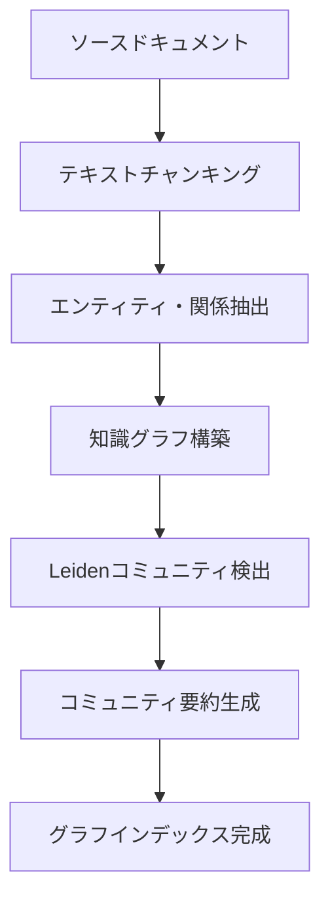

## 論文概要（Abstract）

GraphRAGは「コーパス全体に対するグローバルな問い」を解決するため、LLMによるエンティティ知識グラフの自動構築、Leidenアルゴリズムによる階層的コミュニティ検出、Map-Reduce方式のクエリ処理を組み合わせたアプローチである。著者らは約100万トークン規模のデータセットで、ナイーブRAGに対して包括性72-83%、多様性62-82%の勝率を達成したと報告している。

この記事は [Zenn記事: LangGraph×Neo4jで適応的Graph-RAGを構築し製造業FAQを高速化する](https://zenn.dev/0h_n0/articles/b4901738ae781e) の深掘りです。

本記事は [From Local to Global: A Graph RAG Approach to Query-Focused Summarization](https://arxiv.org/abs/2404.16130) の解説記事です。

## 情報源

- **arXiv ID**: 2404.16130
- **URL**: [https://arxiv.org/abs/2404.16130](https://arxiv.org/abs/2404.16130)
- **著者**: Darren Edge, Ha Trinh, Newman Cheng, et al. (Microsoft Research)
- **発表年**: 2024（2025年2月更新、NAACL 2025採択）
- **分野**: cs.CL, cs.AI, cs.IR

## 背景と動機（Background & Motivation）

従来のナイーブRAGはベクトル類似度によるtop-k検索に依存しており、局所的な質問には有効だが「データセット全体の主要テーマは何か」といった**センスメイキング質問**には対応できない。GraphRAGはコーパス全体からエンティティ間の関係構造を抽出し、階層的コミュニティ構造でグローバルな問いへの回答を可能にする。Zenn記事のLangGraph×Neo4jによるGraph-RAG構築の理論的基盤を提供する研究である。

## 主要な貢献（Key Contributions）

- **エンティティ知識グラフの自動構築**: LLMでテキストコーパスからエンティティ・関係・クレームを抽出し重み付き知識グラフを自動構築
- **階層的コミュニティ検出とMap-Reduce要約**: Leidenアルゴリズムによる再帰的コミュニティ検出とMap-Reduce方式クエリ処理でグローバル検索を実現
- **包括性・多様性の大幅改善**: ナイーブRAGに対して包括性72-83%、多様性62-82%の勝率を実証
- **コスト-品質トレードオフの定量分析**: C0がTSの2.6%のトークンで62-72%の勝率を維持
- **オープンソース公開**: [github.com/microsoft/graphrag](https://github.com/microsoft/graphrag)

## 技術的詳細（Technical Details）

### グラフインデックス構築

GraphRAGのインデックス構築は以下の6段階パイプラインで行われる。



**Stage 1: テキストチャンキング** --- ソースドキュメントを600トークン（100トークンオーバーラップ）のチャンクに分割する。

**Stage 2: エンティティ・関係抽出** --- 各チャンクに対してLLMを適用し、エンティティ（人名、組織、場所等）・関係・クレーム（事実的主張）を抽出する。「lost in the middle」問題への対処としてSelf-Reflection技法を導入し、初回抽出後にLLMが完全性を自己評価して見落としを追加抽出する。著者らは600トークンチャンクが2400トークンチャンクの約2倍のエンティティ参照を検出したと報告している。

**Stage 3: 知識グラフ構築** --- エンティティをノード、関係をエッジとして集約し、複数検出は重みとして反映する。名寄せは完全一致だがファジーマッチングへの拡張も設計されている。Podcastデータセットで8,564ノード・20,691エッジ、Newsで15,754ノード・19,520エッジのグラフが構築されている（論文Section 3より）。

### コミュニティ検出（Leidenアルゴリズム）

構築されたグラフにLeidenアルゴリズムを再帰的に適用し、モジュラリティ $Q$ を最大化する階層的コミュニティ分割を求める。

$$
Q = \frac{1}{2m} \sum_{i,j} \left[ A_{ij} - \frac{k_i k_j}{2m} \right] \delta(c_i, c_j)
$$

ここで、
- $A_{ij}$: ノード $i$ と $j$ の隣接行列要素
- $k_i$: ノード $i$ の次数
- $m$: グラフの総エッジ数
- $c_i$: ノード $i$ が属するコミュニティ
- $\delta(c_i, c_j)$: $c_i = c_j$ のとき1、それ以外0（クロネッカーのデルタ）

graspologicライブラリで実装され、以下の4レベルの階層構造が生成される。

| レベル | 説明 | Podcastコミュニティ数 | Newsコミュニティ数 |
|--------|------|---------------------|-------------------|
| C0 | ルートレベル（最も粗い） | 34 | 55 |
| C1 | 高レベルサブコミュニティ | -- | -- |
| C2 | 中間レベル | -- | -- |
| C3 | リーフレベル（最も細かい） | 1,310 | 2,142 |

### コミュニティ要約の生成

各コミュニティに対してLLMによる要約を事前生成する。リーフコミュニティではノード次数でプライオリティ付けした要素をトークン上限まで追加し、上位コミュニティではサブコミュニティ要約を入力として要約を生成する。

### クエリ処理パイプライン（Map-Reduce方式）

**Map Phase**: コミュニティ要約をシャッフル・チャンク分割し、各チャンクからLLMが中間回答と0-100のヘルプフルネススコアを生成する。**Reduce Phase**: スコア0をフィルタ後、スコア降順でコンテキストウィンドウに収まるまで追加し最終回答を生成する。

## アルゴリズム

Global Searchパイプラインの擬似コードを示す。

```python
from dataclasses import dataclass


@dataclass
class CommunityReport:
    """コミュニティ要約レポート"""
    community_id: str
    summary: str
    level: int  # 0=root, 3=leaf


@dataclass
class IntermediateAnswer:
    """Map Phaseの中間回答"""
    content: str
    helpfulness_score: int  # 0-100


def graphrag_global_search(
    query: str,
    reports: list[CommunityReport],
    llm_client,
    context_window: int = 8000,
) -> str:
    """GraphRAG Global Search: Map-Reduceによるグローバル回答生成"""
    import random
    random.shuffle(reports)  # バイアス回避

    # Map Phase: チャンク毎に中間回答+スコアを生成
    intermediate: list[IntermediateAnswer] = []
    for chunk in _split_by_tokens(reports, chunk_size=4000):
        ctx = "\n\n".join(r.summary for r in chunk)
        ans = llm_client.generate(prompt=MAP_PROMPT.format(query=query, context=ctx))
        intermediate.append(IntermediateAnswer(ans.text, ans.score))

    # スコア>0をフィルタし降順ソート
    ranked = sorted(
        [a for a in intermediate if a.helpfulness_score > 0],
        key=lambda a: a.helpfulness_score, reverse=True,
    )

    # Reduce Phase: コンテキストウィンドウに収まるまで追加し最終回答生成
    parts, used = [], 0
    for a in ranked:
        t = len(a.content) // 4
        if used + t > context_window:
            break
        parts.append(a.content)
        used += t

    return llm_client.generate(
        prompt=REDUCE_PROMPT.format(query=query, context="\n\n---\n\n".join(parts)),
    ).text
```

## 実装のポイント（Implementation）

主要な実装上の注意点を整理する。

**チャンクサイズの選択**: 著者らは600トークンを採用している。大きなチャンクは「lost in the middle」問題で検出率が低下するが、Self-Reflectionの反復で改善可能である（追加LLMコールとのトレードオフ）。

**エンティティの名寄せ**: 論文では完全文字列一致だが、実運用では表記ゆれ（「Microsoft」vs「MS」等）への対処が必要。Zenn記事のNeo4jノード解決機能がこの課題に対応する。

**コンテキストウィンドウ**: 8k/16k/32k/64kの比較で8kが包括性最高（平均58.1%勝率）と報告されており、コンテキスト増加が必ずしも品質向上に繋がらないことを示す。

**インデックス構築コスト**: 約100万トークンで281分（16GB RAM）+GPT-4-turbo APIコスト。製造業FAQ用途では初回構築コストと増分更新戦略の設計が重要である。

## Production Deployment Guide

### AWS実装パターン（コスト最適化重視）

インデックス構築（バッチ）とクエリ処理（オンライン）で異なるアーキテクチャを選択する。

| 項目 | Small (~100 req/日) | Medium (~1000 req/日) | Large (10000+ req/日) |
|------|-------------------|---------------------|---------------------|
| **クエリ処理** | Lambda + Bedrock | ECS Fargate + Bedrock | EKS + Karpenter + Spot |
| **グラフDB** | DynamoDB (On-Demand) | Neptune Serverless | Neptune + Read Replica |
| **インデックス構築** | Step Functions + Lambda | ECS Task (Spot) | EKS Job (Spot) |
| **ベクトルDB** | OpenSearch Serverless | OpenSearch Serverless | OpenSearch Managed |
| **キャッシュ** | ElastiCache Serverless | ElastiCache (r7g.medium) | ElastiCache Cluster |
| **月額概算** | $80-200 | $500-1,200 | $3,000-8,000 |

**注意**: 2026年9月時点のAWS東京リージョン概算値。Bedrockモデル呼び出しコストが支配的。主なコスト削減はSpot（最大90%減）、Batch API（50%減）、Prompt Caching（30-90%減）、C0使用（トークン97%減）。

### Terraformインフラコード

**Small構成（Serverless）: Lambda + Bedrock + DynamoDB**

```hcl
terraform {
  required_version = ">= 1.9"
  required_providers {
    aws = { source = "hashicorp/aws", version = "~> 5.60" }
  }
}

provider "aws" { region = "ap-northeast-1" }

# IAM: Bedrock + DynamoDB + Logs + X-Rayのみに限定
resource "aws_iam_role" "graphrag_lambda" {
  name               = "graphrag-lambda-role"
  assume_role_policy = jsonencode({
    Version = "2012-10-17"
    Statement = [{ Action = "sts:AssumeRole", Effect = "Allow",
      Principal = { Service = "lambda.amazonaws.com" } }]
  })
}

resource "aws_iam_role_policy" "graphrag_lambda" {
  name = "graphrag-lambda-policy"
  role = aws_iam_role.graphrag_lambda.id
  policy = jsonencode({
    Version = "2012-10-17"
    Statement = [
      { Effect = "Allow", Action = ["bedrock:InvokeModel"],
        Resource = "arn:aws:bedrock:ap-northeast-1::foundation-model/anthropic.claude-*" },
      { Effect = "Allow", Action = ["dynamodb:GetItem","dynamodb:Query","dynamodb:PutItem"],
        Resource = aws_dynamodb_table.graphrag.arn },
      { Effect = "Allow", Action = ["logs:CreateLogGroup","logs:CreateLogStream","logs:PutLogEvents"],
        Resource = "arn:aws:logs:ap-northeast-1:*:*" },
    ]
  })
}

# DynamoDB: コミュニティ要約・グラフデータ格納（On-Demand + KMS暗号化）
resource "aws_dynamodb_table" "graphrag" {
  name = "graphrag-communities"; billing_mode = "PAY_PER_REQUEST"
  hash_key = "PK"; range_key = "SK"
  attribute { name = "PK"; type = "S" }
  attribute { name = "SK"; type = "S" }
  server_side_encryption { enabled = true }
  point_in_time_recovery { enabled = true }
}

# Lambda: Map-Reduce処理のためtimeout長め・メモリ多め
resource "aws_lambda_function" "graphrag_query" {
  function_name = "graphrag-global-search"
  runtime = "python3.12"; handler = "handler.lambda_handler"
  role = aws_iam_role.graphrag_lambda.arn
  timeout = 120; memory_size = 1024
  tracing_config { mode = "Active" }
  environment {
    variables = {
      DYNAMODB_TABLE = aws_dynamodb_table.graphrag.name
      BEDROCK_MODEL_ID = "anthropic.claude-sonnet-4-20250514"
      COMMUNITY_LEVEL = "1"; CONTEXT_WINDOW = "8000"
    }
  }
}
```

**Large構成（Container）: EKS + Karpenter + Spot**

```hcl
module "eks" {
  source  = "terraform-aws-modules/eks/aws"
  version = "~> 20.24"
  cluster_name = "graphrag-cluster"; cluster_version = "1.31"
  vpc_id = module.vpc.vpc_id; subnet_ids = module.vpc.private_subnets
  cluster_endpoint_public_access = false
  eks_managed_node_groups = {
    system = { instance_types = ["m7i.large"]; min_size = 2; max_size = 3; desired_size = 2 }
  }
}

# Karpenter: Spot優先の自動スケーリング
resource "kubectl_manifest" "karpenter_nodepool" {
  yaml_body = yamlencode({
    apiVersion = "karpenter.sh/v1"; kind = "NodePool"
    metadata = { name = "graphrag-workers" }
    spec = {
      template = { spec = {
        requirements = [
          { key = "karpenter.sh/capacity-type", operator = "In", values = ["spot","on-demand"] },
          { key = "node.kubernetes.io/instance-type", operator = "In",
            values = ["m7i.xlarge","m7a.xlarge","m6i.xlarge","c7i.xlarge"] },
        ]
        nodeClassRef = { group = "karpenter.k8s.aws", kind = "EC2NodeClass", name = "default" }
      }}
      limits = { cpu = "64", memory = "256Gi" }
      disruption = { consolidationPolicy = "WhenEmptyOrUnderutilized", consolidateAfter = "30s" }
    }
  })
}

# AWS Budgets: 月額$5,000超過で80%時点でアラート
resource "aws_budgets_budget" "graphrag" {
  name = "graphrag-monthly"; budget_type = "COST"
  limit_amount = "5000"; limit_unit = "USD"; time_unit = "MONTHLY"
  notification {
    comparison_operator = "GREATER_THAN"; threshold = 80
    threshold_type = "PERCENTAGE"; notification_type = "FORECASTED"
    subscriber_email_addresses = ["alerts@example.com"]
  }
}
```

### セキュリティベストプラクティス

IAMは最小権限（Bedrock呼び出しは使用モデルARNのみ）、ネットワークはVPCエンドポイント経由でパブリック露出を最小化、DynamoDB/S3はKMS暗号化+TLS 1.2強制、シークレットはSecrets Manager管理、CloudTrail+AWS Configで監査を有効化する。

### 運用・監視設定

**CloudWatch Logs Insights クエリ（トークン使用量の時系列分析）**:

```
fields @timestamp, @message
| filter @message like /token_usage/
| stats sum(input_tokens) as total_input, sum(output_tokens) as total_output by bin(1h) as hour
| sort hour desc
| limit 24
```

**CloudWatch アラーム + X-Ray + Cost Explorer（Python）**:

```python
import boto3
from aws_xray_sdk.core import xray_recorder, patch_all
from datetime import datetime, timedelta


def setup_monitoring(sns_topic_arn: str) -> None:
    """GraphRAG運用監視の一括セットアップ"""
    cw = boto3.client("cloudwatch", region_name="ap-northeast-1")

    # Bedrockトークン使用量スパイク検知（1時間50万トークン超過）
    cw.put_metric_alarm(
        AlarmName="graphrag-bedrock-token-spike",
        MetricName="InputTokenCount", Namespace="AWS/Bedrock",
        Statistic="Sum", Period=3600, EvaluationPeriods=1,
        Threshold=500000, ComparisonOperator="GreaterThanThreshold",
        AlarmActions=[sns_topic_arn],
        Dimensions=[{"Name": "ModelId", "Value": "anthropic.claude-sonnet-4-20250514"}],
    )

    # X-Ray自動計装
    xray_recorder.configure(service="graphrag-query")
    patch_all()


def get_daily_cost_report() -> dict:
    """日次コストレポート取得。$100/日超過でSNS通知"""
    ce = boto3.client("ce", region_name="us-east-1")
    today = datetime.utcnow().date()
    resp = ce.get_cost_and_usage(
        TimePeriod={"Start": str(today - timedelta(days=1)), "End": str(today)},
        Granularity="DAILY", Metrics=["UnblendedCost"],
        GroupBy=[{"Type": "DIMENSION", "Key": "SERVICE"}],
        Filter={"Tags": {"Key": "Project", "Values": ["graphrag"]}},
    )
    costs = {g["Keys"][0]: float(g["Metrics"]["UnblendedCost"]["Amount"])
             for g in resp["ResultsByTime"][0]["Groups"]}
    if sum(costs.values()) > 100:
        boto3.client("sns", region_name="ap-northeast-1").publish(
            TopicArn="arn:aws:sns:ap-northeast-1:ACCOUNT:graphrag-alerts",
            Subject=f"GraphRAG Cost Alert: ${sum(costs.values()):.2f}/day",
            Message=f"内訳: {costs}",
        )
    return costs
```

### コスト最適化チェックリスト

| カテゴリ | チェック項目 | 効果 |
|---------|------------|------|
| **アーキテクチャ** | トラフィック量でServerless/Hybrid/Container選択 | -- |
| | インデックス構築とクエリで別リソース戦略 | -- |
| **リソース** | インデックス構築にSpot Instances使用 | 最大90%削減 |
| | 定常ワークロードにReserved Instances | 最大72%削減 |
| | Savings Plans適用検討 | 最大66%削減 |
| | Lambda Power Tuningでメモリ最適化 | 10-30%削減 |
| | ECS/EKSアイドル時スケールダウン | 40-60%削減 |
| | Karpenter consolidation有効化 | ノード統合 |
| **LLMコスト** | Bedrock Batch API（インデックス構築） | 50%削減 |
| | Map Phase Prompt Caching有効化 | 30-90%削減 |
| | クエリ種別でモデル切替（Haiku/Flash） | 60-80%削減 |
| | Map Phase最大トークン数制限 | 変動抑制 |
| | コミュニティレベル動的選択（C0-C3） | 最大97%削減 |
| **監視** | AWS Budgets月額アラート | 超過防止 |
| | CloudWatch Bedrockトークンアラーム | スパイク検知 |
| | Cost Anomaly Detection有効化 | 異常検知 |
| | 日次コストレポートSNS/Slack配信 | 可視化 |
| | X-Rayレイテンシ計測 | 性能監視 |
| **管理** | 未使用EBS/スナップショット定期削除 | 固定費削減 |
| | タグ戦略（Project/Environment/Owner） | コスト配賦 |
| | S3ライフサイクルで旧インデックス自動アーカイブ | ストレージ削減 |
| | 開発環境EKSノード夜間停止 | 60%削減 |
| | CloudWatch Logs保持期間30日設定 | ログコスト削減 |

## 実験結果（Results）

著者らはPodcastデータセット（約100万トークン）とNewsデータセット（約170万トークン）で評価を実施している。

**LLM-as-Judge評価**（論文Figure 2より）: ナイーブRAG（SS）との対戦でGraphRAG全条件（C0-C3）が包括性72-83%（$p < .001$）、多様性62-82%（$p < .01$）の勝率を達成。一方、直接性ではナイーブRAGが優位であり、包括性と具体性のトレードオフが確認されている。

**トークン効率**（論文Table 2より）: C0はTSの2.3-2.6%のトークンで動作しながらSS比62-72%の包括性勝率を維持。**クレームベース検証**（論文Table 3より）: グローバル条件（31-34件/回答）がSS（25-27件/回答）を有意に上回り（$p < .05$）、LLM評価との交差検証で包括性78%の判定一致率を示した。

## 実運用への応用（Practical Applications）

**製造業FAQへの適用**: 技術文書・障害報告書のエンティティ（部品名、工程名、不良モード）間関係が密であり、コミュニティ検出が有効に機能する。「主要な品質課題は何か」等のグローバルな問いに包括的回答を生成できる。

**ハイブリッド構成**: Zenn記事のLangGraph実装のように、Local/Globalをクエリ種別で動的に切り替える適応的ルーティングが実用的である。

**増分更新**: 論文は静的バッチ処理だが、日常的に文書追加がある環境ではエンティティ抽出・グラフマージ・コミュニティ要約再生成のパイプライン設計が不可欠である。

## 関連研究（Related Work）

- **RAPTOR (Sarthi et al., 2024)**: 再帰的クラスタリングで階層的要約ツリーを構築。階層構造の活用はGraphRAGと共通だがエンティティ関係を明示的にグラフ化しない
- **HippoRAG (Yu et al., 2024)**: 海馬インデックス理論に着想を得たRAG。パーソナライズドPageRankでグラフ上の関連情報を検索し、GraphRAGのLocal Searchと類似
- **microsoft/graphrag**: 本論文の公式実装。LangChain、LlamaIndex、Neo4J統合が進み、Zenn記事のNeo4j実装も本ライブラリが基盤

## まとめと今後の展望

GraphRAGは知識グラフ構築・Leidenコミュニティ検出・Map-Reduceクエリ処理により、グローバルなセンスメイキング質問への回答を実現し、包括性72-83%・多様性62-82%の勝率を達成した。制約として、インデックス構築コスト、名寄せ精度、汎化性、幻覚率の未分析が著者ら自身により指摘されている。今後は埋め込みベースの動的コミュニティレポート生成、階層横断ロールアップ検索、ドリルダウン型探索が研究方向として示されている。

## 参考文献

- **arXiv**: [https://arxiv.org/abs/2404.16130](https://arxiv.org/abs/2404.16130)
- **Code**: [https://github.com/microsoft/graphrag](https://github.com/microsoft/graphrag)
- **Related Zenn article**: [https://zenn.dev/0h_n0/articles/b4901738ae781e](https://zenn.dev/0h_n0/articles/b4901738ae781e)
