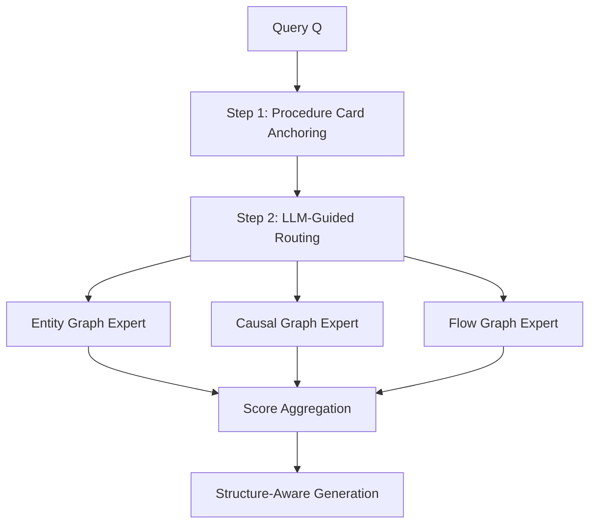

## 論文概要（Abstract）

産業現場のStandard Operating Procedures（SOP）は安全な運用の根幹であるが、従来のRAGによるSOP検索は独自のドキュメント構造・条件依存の関連性・実行可能な応答生成という3つの課題に対処できていなかった。SOPRAGは、Mixture-of-Experts（MoE）に着想を得て、Entity・Causal・Flowの3種のグラフエキスパートとProcedure Cardによる検索空間削減、LLMガイドのゲーティング機構を組み合わせた検索フレームワークである。著者らは4つの産業ドメインで既存のレキシカル・デンス・グラフベースRAGベースラインを上回る性能を報告している。

この記事は [Zenn記事: LangGraph×Neo4jで適応的Graph-RAGを構築し製造業FAQを高速化する](https://zenn.dev/0h_n0/articles/b4901738ae781e) の深掘りです。

本記事は [SOPRAG](https://arxiv.org/abs/2602.01858) の解説記事です。

## 情報源

- **arXiv ID**: 2602.01858
- **URL**: [arXiv:2602.01858](https://arxiv.org/abs/2602.01858)
- **著者**: Liangtao Lin, Zhaomeng Zhu, Tianwei Zhang, Yonggang Wen
- **発表年**: 2026年2月
- **分野**: Computer Science - Artificial Intelligence (cs.AI)

## 背景と動機（Background & Motivation）

産業環境におけるSOP（Standard Operating Procedures）は、設備の運転・保全・異常対応において安全性と一貫性を保証する重要文書である。しかし、SOPの検索と実行支援には、一般的な文書検索とは本質的に異なる3つの課題が存在する。

**課題1: 独自の構造** --- SOPは厳格な階層構造を持ち、手順ステップ間に文脈依存の関係がある。従来のフラットチャンキング戦略では、手順ステップとその前提条件・上位文脈との意味的結合が失われる。

**課題2: 条件依存の関連性** --- 同じ症状（例: 「システム過熱」）であっても、原因やシステム状態によって対応手順が全く異なる。単純なセマンティック類似度では、この因果的な条件分岐を捕捉できない。

**課題3: 実行可能な応答生成** --- 産業オペレータは正確なステップバイステップのワークフローを必要とする。幻覚を含む応答は、安全上の深刻な帰結をもたらしうる。

## 主要な貢献（Key Contributions）

- **3種のグラフエキスパート**: Entity・Causal・Flowの3つの専門グラフで、SOPの異なる側面を個別にモデル化
- **Procedure Cardレイヤー**: 各SOPをタイトルとLLM合成の1行要約に抽象化し、検索空間を事前削減するスパース活性化層
- **LLMガイドのゲーティング機構**: クエリの意図を解析し、3種のエキスパートに動的な重みを割り当てるIntention-Aware Router
- **自動ベンチマーク構築**: Collector・Archivist・Auditor・Examinerの4エージェントで、4産業ドメイン・800文書・1000クエリのベンチマークを自動構築

## 技術的詳細（Technical Details）

### 全体アーキテクチャ

SOPRAGの検索パイプラインは、Coarse-to-Fine（粗→精）の3段階で構成される。



### Entity Graph Expert（$\mathcal{G}_e$）

SOP内の離散的なドメインエンティティ（設備名・パラメータ・アラームコード等）をノードとし、Procedure Cardに紐づけるグラフ。エンティティスコア$\mathcal{R}_e$は、クエリ中の専門用語とグラフ内エンティティの完全一致重み付きオーバーラップで計算される。

### Causal Graph Expert（$\mathcal{G}_c$）

観測可能な状態から解決手順への因果遷移をモデル化する非線形グラフ。「XがYを引き起こす」「XがYを防止する」等の因果関係をエッジで表現する。因果スコア$\mathcal{R}_c$は$k$ホップ近傍探索による到達可能性で評価される。

### Flow Graph Expert（$\mathcal{G}_f$）

各SOPの手順ステップのトポロジカル構造をDAGとして保存するグラフ。チャンキングによるセマンティック断片化を防止する。フロースコア$\mathcal{R}_f$はローカルフローグラフ内のステップとクエリのセマンティックアラインメントで計算される。

### Procedure Cardレイヤー

各SOPをタイトルとLLM合成1行要約に抽象化し、検索の第1段階でクエリとのセマンティック類似度によりTop-$K$候補を選択する。後続のグラフ推論の計算コストを大幅に削減する。

### LLMガイドゲーティングメカニズム

Intention-Aware Routerがクエリの焦点を解析し、各エキスパートへの動的重み$\mathbf{w} = [w_e, w_c, w_f]$を割り当てる。最終的な関連度スコアは以下の式で計算される。

$$
R(Q, S_i) = \lambda \cdot \text{Sim}(Q, PC_i) + (1 - \lambda) \sum_{m \in \{E, C, F\}} w_m \cdot \mathcal{R}_m(Q, PC_i)
$$

ここで、$Q$は入力クエリ、$PC_i$は$i$番目のSOPに対応するProcedure Card、$\lambda$はアンカースコアとエキスパートスコアのバランスパラメータ、$w_m$はエキスパート$m$に対するゲーティング重み（$\sum_m w_m = 1$）、$\mathcal{R}_m$はエキスパート$m$のスコアリング関数である。

### マルチエージェントベンチマーク構築

4つの専門エージェントで構成される。Collector（DeepSearch機能でSOP文書収集）、Archivist（MinerU-2.5でレイアウト認識パースし統一Markdownに変換）、Auditor（非SOP文書フィルタリングとアトミック手順単位への分割）、Examiner（オペレータペルソナでキーワード検索からシナリオベース質問まで多様なクエリを生成）。

## アルゴリズム

```python
from dataclasses import dataclass
from typing import Protocol

import numpy as np


@dataclass(frozen=True)
class ProcedureCard:
    """SOP を抽象化した Procedure Card"""

    sop_id: str
    title: str
    abstract: str
    embedding: np.ndarray


class GraphExpert(Protocol):
    """グラフエキスパートのインターフェース"""

    def score(self, query: str, pc: ProcedureCard) -> float: ...


def soprag_retrieve(
    query: str,
    cards: list[ProcedureCard],
    experts: dict[str, GraphExpert],
    router: "IntentionAwareRouter",
    top_k_anchor: int = 10,
    top_k_final: int = 5,
    lam: float = 0.3,
) -> list[tuple[ProcedureCard, float]]:
    """SOPRAG の Coarse-to-Fine 検索パイプライン

    Args:
        query: ユーザクエリ
        cards: 全 Procedure Card のリスト
        experts: {"entity": ..., "causal": ..., "flow": ...}
        router: Intention-Aware Router
        top_k_anchor: Step 1 候補数
        top_k_final: 最終候補数
        lam: アンカースコアの重み (0 < lam < 1)
    """
    # Step 1: Procedure Card Anchoring
    q_emb = encode_query(query)
    anchors = sorted(
        [(pc, cosine_sim(q_emb, pc.embedding)) for pc in cards],
        key=lambda x: x[1],
        reverse=True,
    )[:top_k_anchor]

    # Step 2: LLM-Guided Routing
    w = router.compute_weights(query)

    # Step 3: Subgraph Reasoning + Score Aggregation
    scored = []
    for pc, sim in anchors:
        expert_sum = sum(w[n] * e.score(query, pc) for n, e in experts.items())
        scored.append((pc, lam * sim + (1 - lam) * expert_sum))

    return sorted(scored, key=lambda x: x[1], reverse=True)[:top_k_final]
```

## 実装のポイント（Implementation）

**グラフ構築のLLM依存性**: 3種のグラフ構築はLLMの推論能力に依存する。特にCausal Graphの因果関係抽出はドメイン知識が必要であり、著者らも小規模モデルでのトレードオフについて今後の検証が必要と述べている。

**Procedure Card要約品質**: 検索の第1段階がProcedure Cardのセマンティック類似度に依存するため、要約の品質がリコールの上限を規定する。要約が不適切な場合、関連SOPが候補から脱落するリスクがある。

**ゲーティング重みの傾向**: 論文Appendix Dによると、Flow重み$w_f$は多くのドメインで0.6-0.8にピークを持つ。一方、Liquid Coolingドメインでは$w_c$が0.7付近にピークを示し、ドメインごとの特性への適応が確認されている。

**増分グラフ更新**: Flow Graphはアトミック単位でProcedure Cardにリンクされる。Entity/Causal Graphは類似度ベースのノード統合で増分更新が可能であり、全グラフ再構築は不要とされている（論文Appendix F）。

## Production Deployment Guide

以下のコスト試算は2026年9月時点のAWS ap-northeast-1（東京）の概算値であり、トラフィックパターンやバースト使用量により変動する。最新料金はAWS料金計算ツールで確認を推奨する。

### AWS実装パターン（コスト最適化重視）

| 構成 | トラフィック | 主要サービス | 月額概算 |
|------|------------|-------------|----------|
| Small | ~100 req/日 | Lambda + Neptune Serverless + Bedrock Haiku | $86-153 |
| Medium | ~1,000 req/日 | ECS Fargate + Neptune r6g.large + ElastiCache | $540-840 |
| Large | 10,000+ req/日 | EKS + Karpenter Spot + Neptune Multi-AZ | $1,980-3,050 |

**Small**: Lambda(512MB)+Neptune Serverless+DynamoDB On-Demand。**Medium**: ECS Fargate(2vCPU x2)+ElastiCacheでProcedure Cardキャッシュ。**Large**: Karpenter Spot優先で最大90%削減、Neptune Multi-AZ、Bedrock Batch APIで50%削減。

### Terraformインフラコード

#### Small構成（Serverless）

```hcl
# === SOPRAG Small: Lambda + Neptune Serverless + Bedrock ===
terraform {
  required_version = ">= 1.9"
  required_providers {
    aws = { source = "hashicorp/aws", version = "~> 5.60" }
  }
}

provider "aws" { region = "ap-northeast-1" }

resource "aws_vpc" "soprag" {
  cidr_block           = "10.0.0.0/16"
  enable_dns_hostnames = true
  tags = { Name = "soprag-vpc", Project = "soprag" }
}

resource "aws_subnet" "private" {
  count             = 2
  vpc_id            = aws_vpc.soprag.id
  cidr_block        = cidrsubnet(aws_vpc.soprag.cidr_block, 8, count.index)
  availability_zone = data.aws_availability_zones.az.names[count.index]
}

data "aws_availability_zones" "az" { state = "available" }

# --- IAMロール（最小権限） ---
# --- IAMロール（最小権限: neptune-db, bedrock, dynamodb, logs のみ） ---
resource "aws_iam_role" "lambda" {
  name = "soprag-lambda-role"
  assume_role_policy = jsonencode({
    Version = "2012-10-17"
    Statement = [{ Action = "sts:AssumeRole", Effect = "Allow",
      Principal = { Service = "lambda.amazonaws.com" } }]
  })
}

# --- Neptune Serverless ---
resource "aws_neptune_cluster" "soprag" {
  cluster_identifier = "soprag-graph"
  engine             = "neptune"
  serverless_v2_scaling_configuration {
    min_capacity = 1.0
    max_capacity = 4.0
  }
  storage_encrypted       = true
  skip_final_snapshot     = false
  final_snapshot_identifier = "soprag-final"
  vpc_security_group_ids  = [aws_security_group.neptune.id]
}

# --- DynamoDB（Procedure Card） ---
resource "aws_dynamodb_table" "cards" {
  name         = "soprag-procedure-cards"
  billing_mode = "PAY_PER_REQUEST"
  hash_key     = "sop_id"
  attribute { name = "sop_id"; type = "S" }
  server_side_encryption { enabled = true }
  point_in_time_recovery { enabled = true }
}

# --- Lambda ---
resource "aws_lambda_function" "retrieve" {
  function_name = "soprag-retrieve"
  role          = aws_iam_role.lambda.arn
  handler       = "handler.lambda_handler"
  runtime       = "python3.12"
  timeout       = 30
  memory_size   = 512
  filename      = "lambda_package.zip"
  environment {
    variables = {
      NEPTUNE_ENDPOINT = aws_neptune_cluster.soprag.endpoint
      DYNAMODB_TABLE   = aws_dynamodb_table.cards.name
      BEDROCK_MODEL_ID = "anthropic.claude-3-5-haiku-20251022-v1:0"
    }
  }
  vpc_config {
    subnet_ids         = aws_subnet.private[*].id
    security_group_ids = [aws_security_group.lambda.id]
  }
  tracing_config { mode = "Active" }
}
```

#### Large構成（Container）

```hcl
# === SOPRAG Large: EKS + Karpenter Spot + Neptune Multi-AZ ===
module "eks" {
  source          = "terraform-aws-modules/eks/aws"
  version         = "~> 20.24"
  cluster_name    = "soprag-prod"
  cluster_version = "1.31"
  vpc_id          = aws_vpc.soprag.id
  subnet_ids      = aws_subnet.private[*].id
  cluster_endpoint_public_access = false
}

# Karpenter: Spot優先でコスト最大90%削減
resource "kubectl_manifest" "karpenter_nodepool" {
  yaml_body = yamlencode({
    apiVersion = "karpenter.sh/v1"
    kind       = "NodePool"
    metadata   = { name = "soprag-spot" }
    spec = {
      template.spec.requirements = [
        { key = "karpenter.sh/capacity-type", operator = "In", values = ["spot", "on-demand"] },
        { key = "node.kubernetes.io/instance-type", operator = "In",
          values = ["m6i.xlarge", "m6a.xlarge", "m7i.xlarge"] },
      ]
      limits     = { cpu = "64", memory = "128Gi" }
    }
  })
}
```

### 運用・監視設定

```python
import boto3
from aws_xray_sdk.core import xray_recorder, patch_all

patch_all()  # boto3 自動計装

cloudwatch = boto3.client("cloudwatch", region_name="ap-northeast-1")

# Bedrockトークン使用量スパイク検知
cloudwatch.put_metric_alarm(
    AlarmName="soprag-bedrock-token-spike",
    Namespace="Custom/SOPRAG",
    MetricName="BedrockInputTokens",
    Statistic="Sum",
    Period=3600,
    EvaluationPeriods=2,
    Threshold=500000,
    ComparisonOperator="GreaterThanThreshold",
    AlarmActions=["arn:aws:sns:ap-northeast-1:ACCOUNT:soprag-alerts"],
)

@xray_recorder.capture("soprag_retrieve")
def retrieve_sop(query: str, domain: str) -> dict:
    """SOP 検索のトレーシング付き実行"""
    sub = xray_recorder.current_subsegment()
    sub.put_annotation("domain", domain)
    sub.put_metadata("query", query, "soprag")
    with xray_recorder.in_subsegment("procedure_card_anchor"):
        candidates = anchor_procedure_cards(query)
    with xray_recorder.in_subsegment("llm_routing"):
        weights = compute_expert_weights(query)
    with xray_recorder.in_subsegment("subgraph_reasoning"):
        return aggregate_expert_scores(query, candidates, weights)
```

**CloudWatch Logs Insights クエリ例**:

```
# レイテンシ分析
fields @timestamp, duration_ms
| filter event = "soprag_retrieve"
| stats percentile(duration_ms, 95) as p95, percentile(duration_ms, 99) as p99 by bin(1h)
```

### コスト最適化チェックリスト

**アーキテクチャ選択**:
- [ ] トラフィック量に基づき構成選択（Small/Medium/Large）
- [ ] Neptune Serverless vs プロビジョンドの判断
- [ ] マルチリージョン要否の判断

**リソース最適化**:
- [ ] Karpenter Spot優先設定（最大90%削減）
- [ ] Reserved Instances 1年コミット（Neptune, ElastiCache）
- [ ] Savings Plans検討（ECS/EKS Compute）
- [ ] Lambda メモリサイズ最適化（Power Tuning）
- [ ] ECS/EKSアイドル時スケールダウン
- [ ] Neptuneインスタンスサイズ定期見直し

**LLMコスト削減**:
- [ ] Bedrock Batch API使用（非同期時50%削減）
- [ ] Prompt Caching有効化（30-90%削減）
- [ ] モデル選択ロジック（ゲーティング: Haiku、生成: Sonnet）
- [ ] トークン数制限（max_tokens設定）
- [ ] レスポンスキャッシュ（ElastiCache TTL 1時間）

**監視・アラート**:
- [ ] AWS Budgets（月額上限80%/100%通知）
- [ ] CloudWatchアラーム（Duration P99、トークン使用量）
- [ ] Cost Anomaly Detection有効化
- [ ] 日次コストレポート自動生成

**リソース管理**:
- [ ] Neptuneスナップショット削除ポリシー
- [ ] タグ戦略（Project, Environment, Owner必須）
- [ ] S3ライフサイクル（ログ: 30日Glacier、90日削除）
- [ ] 開発環境夜間停止スケジュール
- [ ] CloudWatch Logs保持期間設定（本番90日、開発14日）

## 実験結果（Results）

著者らは4つの産業ドメインで評価を実施している。ベンチマークは800文書・1000クエリで構成される（論文Table 1）。

### 検索性能（論文Table 2）

| ドメイン | 手法 | MRR | Acc@1 | Acc@5 |
|----------|------|-----|-------|-------|
| Data Center | BM25 | 0.33 | 0.24 | 0.52 |
| Data Center | HippoRAG2 | 0.31 | 0.24 | 0.54 |
| Data Center | **SOPRAG** | **0.49** | **0.40** | **0.64** |
| Airline Services | BM25 | 0.60 | 0.50 | 0.80 |
| Airline Services | HippoRAG2 | 0.63 | 0.53 | 0.86 |
| Airline Services | **SOPRAG** | **0.76** | **0.67** | **0.93** |

Data CenterでSOPRAGのMRRは0.49であり、HippoRAG2の0.31を0.18ポイント上回る。Airline Servicesでも同様にMRR 0.76対0.63で0.13ポイントの改善が報告されている。

### 生成品質（論文Table 3）

RAGASフレームワーク指標に加え、ドメイン固有のSOP Quality Scoreで評価が行われている。Data CenterではSOPRAGがSOP Quality Score 1.00（満点）を達成し、Airline ServicesではFaithfulness 0.88、SOP Quality 0.98が報告されている。

### アブレーション（論文Table 4）

- **Flow Graph除去**: Data CenterでMRR 0.45→0.39（-0.06）。手順フロー構造保持が最重要
- **Causal Graph除去**: Airline ServicesでMRR 0.75→0.68（-0.07）。因果推論が安全手順に不可欠
- **LLM Routing除去**: 静的平均化によりMRRが0.04低下。動的重み付けの優位性を確認
- **Procedure Card除去**: 全ドメインで一貫して低下。検索空間削減の有効性を裏付け

論文Appendix Eによると、Liquid CoolingドメインでのSOPRAGの検索レイテンシは約2.89秒であり、GraphRAGの14秒超と比較して大幅に高速であると報告されている。

## 実運用への応用（Practical Applications）

Zenn記事で紹介したLangGraph + Neo4j構成のGraph-RAGシステムにSOPRAGの設計思想を取り入れることで、製造業FAQの検索精度向上が期待できる。

**Neo4jでの3種グラフ実装**: Neo4jのプロパティグラフモデルで、Entity・Causal・Flowの3種をラベルとリレーションシップタイプで区別して格納する。LangGraphのステート管理でゲーティング重みを保持し、条件分岐でエキスパートを動的に選択する構成が自然である。

**Procedure Cardの応用**: FAQカテゴリや設備マニュアルの目次レベル情報をProcedure Cardとして抽象化し、ベクトルDBとグラフDBの2段階検索を構成できる。

**制約**: SOPRAGはSOP特化であり、汎用FAQへの直接適用には調整が必要。特にCausal GraphはSOP固有の因果構造を前提としており、自由形式FAQでは因果関係抽出精度が低下する可能性がある。また、マルチモーダル情報（図面・安全アイコン等）への対応も今後の課題である。

## 関連研究（Related Work）

- **GraphRAG（Microsoft, 2024）**: コミュニティ要約ベースのグラフ検索。SOPRAGとの違いは、GraphRAGが汎用的なコミュニティ検出を行うのに対し、SOPRAGはEntity・Causal・Flowの3つの産業特化ビューを明示的に分離している点にある
- **HippoRAG2（2025）**: 海馬の記憶プロセスに着想を得たグラフベースRAG。SOPRAGの実験では最も強力なベースラインとして比較され、Data CenterでMRR 0.18ポイントの改善が報告されている（論文Table 2）
- **LightRAG（2024）**: 軽量グラフベース検索。SOPRAGと同等のレイテンシだが、SOP固有の構造モデリングは持たない

## まとめと今後の展望

SOPRAGは、産業SOP検索に特化した3種のグラフエキスパートとLLMガイドゲーティングを組み合わせたフレームワークである。4つの産業ドメインでの実験により、既存ベースラインを上回る検索精度と実行安全性が報告されている。

今後の課題として、著者らはマルチモーダルSOP（図面・安全アイコン）への対応、小規模LLMでのグラフ構築品質の検証、合成クエリの実運用者による検証を挙げている。

## 参考文献

- **arXiv**: [https://arxiv.org/abs/2602.01858](https://arxiv.org/abs/2602.01858)
- **Related Zenn article**: [LangGraph×Neo4jで適応的Graph-RAGを構築し製造業FAQを高速化する](https://zenn.dev/0h_n0/articles/b4901738ae781e)
- **GraphRAG (Microsoft)**: [https://arxiv.org/abs/2404.16130](https://arxiv.org/abs/2404.16130)
- **HippoRAG2**: [https://arxiv.org/abs/2502.14802](https://arxiv.org/abs/2502.14802)
- **LightRAG**: [https://arxiv.org/abs/2410.05779](https://arxiv.org/abs/2410.05779)
