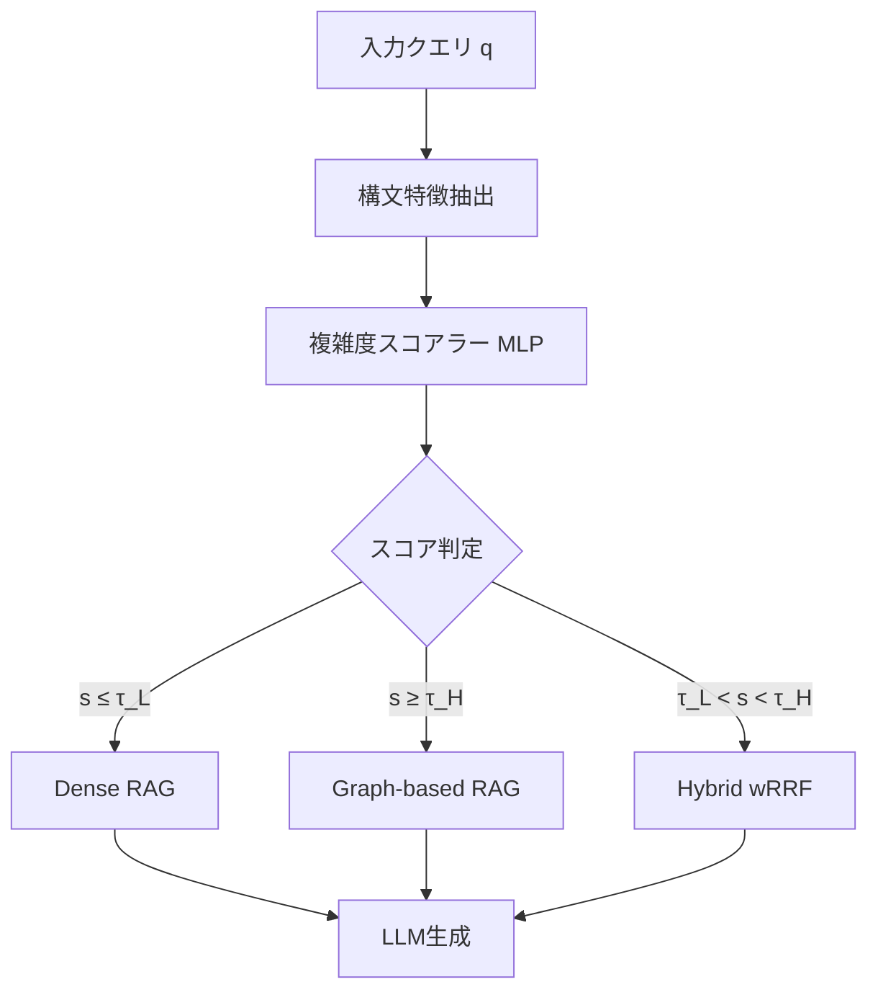

本記事は [arXiv:2602.03578](https://arxiv.org/abs/2602.03578) の解説記事です。

## 論文概要（Abstract）

大規模言語モデル（LLM）の知識集約型タスクにおいて、検索拡張生成（RAG）はハルシネーション抑制に有効であり、さらにグラフ構造を活用するGraphRAGはマルチホップ推論で高い性能を発揮する。しかし著者らは、GraphRAGを全クエリに一律適用すると、単純なクエリで逆に性能が低下する問題を指摘している。EA-GraphRAGは、構文認識型の複雑度分析・軽量スコアラー・スコア駆動ルーティングポリシーにより、クエリの複雑度に応じてdense RAG・GraphRAG・ハイブリッド融合を動的に切り替えるフレームワークである。

この記事は [Zenn記事: LangGraph×Neo4jで適応的Graph-RAGを構築し製造業FAQを高速化する](https://zenn.dev/0h_n0/articles/b4901738ae781e) の深掘りです。Zenn記事ではLangGraphとNeo4jを用いた適応的Graph-RAGの実装を解説しているが、本論文はその背景にある「いつグラフを使うべきか」という根本的な問いに対し、体系的な解を提示している。

## 情報源

- **arXiv ID**: 2602.03578
- **URL**: [https://arxiv.org/abs/2602.03578](https://arxiv.org/abs/2602.03578)
- **著者**: Su Dong, Qinggang Zhang, Yilin Xiao, Shengyuan Chen, Chuang Zhou, Xiao Huang
- **発表年**: 2026
- **分野**: cs.CL（計算言語学）、cs.AI（人工知能）

## 背景と動機（Background & Motivation）

RAGは外部知識ベースからの検索結果をLLMのコンテキストに注入することでハルシネーションを抑制する。さらにGraphRAGは、知識グラフ上のエンティティ間リレーションを活用し、複数の文書にまたがるマルチホップ推論を可能にする。しかし、著者らはGraphRAGの一律適用が根本的な問題を引き起こすと指摘している。

具体的には、論文の実験において「GraphRAGはシングルホップ質問応答においてバニラRAGよりも劣り、Natural Questionsで13.4%低い精度を達成する」と報告されている。これは、単純なファクトルックアップクエリにグラフトラバーサルを適用すると、無関連なエンティティが検索結果に混入し、かえってノイズとなるためである。加えて、グラフベース検索はdense検索と比較して桁違いのレイテンシを要する（論文の実験では0.08秒 vs 3.23秒/クエリ）。

この「全クエリにGraphRAGを適用する」という剛直なアプローチの問題を解決するため、著者らはクエリの複雑度に応じた適応的ルーティングを提案している。

## 主要な貢献（Key Contributions）

- **貢献1: 構文認識型特徴構築器（Syntactic Feature Constructor）**: 構文解析木から80以上の特徴量を抽出し、相互情報量ベースのフィルタリングで約85特徴に選定する手法を提案
- **貢献2: 軽量複雑度スコアラー（Lightweight Complexity Scorer）**: 特徴量アテンションと残差接続を備えたMLPアダプタにより、クエリを連続的な複雑度スコア$s(q) \in (0, 1)$にマッピング
- **貢献3: スコア駆動ルーティングポリシー（Score-Driven Routing Policy）**: 閾値ベースの3パスルーティングと、境界ケース向けの複雑度認識型加重Reciprocal Rank Fusion（wRRF）を導入

## 技術的詳細（Technical Details）

### 構文認識型複雑度分析

EA-GraphRAGの第1段階では、クエリの構文的複雑度を定量化するための特徴量を抽出する。特徴量は以下の4カテゴリに分類される。

1. **構文木ベース特徴**: 節（clause）の数、T-unit数、複合名詞句の出現頻度
2. **依存関係ベース特徴**: 依存関係の最大距離、関係タイプの分布
3. **意味・語彙的指標**: エンティティ密度、内容語と機能語の比率
4. **木構造特性**: 構文木の深さ、幅、分岐因子

これらの候補特徴（80以上）から、相互情報量（Mutual Information）ベースのフィルタリングにより、クエリ複雑度と高い相関を持つ約85特徴が選定される。従来のセマンティクスベースの複雑度分類器（LLMベース）と比較して、構文解析は計算コストが低く、クエリの構造的特性をより直接的に捉えることができる。

### 軽量複雑度スコアラーの設計

抽出された特徴量は、特徴アテンションと残差接続を備えたMLPアダプタに入力される。このスコアラーは連続値の複雑度スコアを出力する。

$$
s(q) = \sigma\bigl(\text{MLP}(\mathbf{f}(q))\bigr) \in (0, 1)
$$

ここで、
- $q$: 入力クエリ
- $\mathbf{f}(q)$: クエリから抽出された構文特徴ベクトル
- $\sigma$: シグモイド関数
- $s(q)$: クエリの複雑度スコア（0に近いほど単純、1に近いほど複雑）

訓練データの構築方法が特徴的である。著者らは1,000件の初期クエリからRAGとGraphRAGの両方で予測を行い、両者の予測が**不一致**となるケース（disagreement dataset）のみ200件を抽出して訓練に使用している。これにより、ルーティング判断が実際に性能差を生むケースに焦点を当てた学習が可能となる。

### ルーティングポリシー（Tri-Path Routing）

複雑度スコア$s(q)$に基づき、以下の3パスにルーティングする。

$$
\text{path}(q) = \begin{cases}
\text{Dense RAG} & \text{if } s(q) \leq \tau_L \\
\text{Graph-based RAG} & \text{if } s(q) \geq \tau_H \\
\text{Hybrid (wRRF)} & \text{if } \tau_L < s(q) < \tau_H
\end{cases}
$$

ここで、$\tau_L$と$\tau_H$はルーティング閾値である。



### 境界ケースの判定 - 複雑度認識型wRRF

境界ケース（$\tau_L < s(q) < \tau_H$）では、Dense RAGとGraph-based RAGの両方の検索結果を、複雑度スコアで重み付けしたReciprocal Rank Fusionにより統合する。

$$
\text{wRRF}(d) = w_{\text{Graph}} \cdot \frac{1}{k + r_{\text{Graph}}(d)} + w_{\text{RAG}} \cdot \frac{1}{k + r_{\text{RAG}}(d)}
$$

ここで、
- $r_{\text{Graph}}(d)$, $r_{\text{RAG}}(d)$: 各検索パスにおける文書$d$のランク
- $k$: スムージング定数（通常60）
- $w_{\text{Graph}} = s(q)$: グラフ検索の重み
- $w_{\text{RAG}} = 1 - s(q)$: Dense検索の重み

この設計により、複雑度が高いほどグラフ検索結果が優先され、低いほどDense検索結果が優先される連続的な制御が実現される。

### グラフベース検索の詳細

グラフベース検索パスでは、エンティティノード$\mathcal{N}$とパッセージノード$\mathcal{C}$からなるヘテロジニアスグラフ上で以下の手順を実行する。

1. **ファクト-クエリ類似度の計算**: エンティティ間のファクトとクエリの意味的類似度を算出
2. **LLMによるリランキング**: 上位$k$件のファクトをLLMで関連度順に再ランク付け
3. **Personalized PageRankの初期化**: リランク結果から重み付きエンティティシードを設定
4. **グラフ拡散**: リレーション辺・同義辺を通じてスコアを伝播し、出現辺経由でパッセージに到達
5. **上位$K$パッセージの抽出**: 拡散スコアに基づき最終的な検索結果を取得

Dense検索パスはエンコーダ$M$を用いた標準的な意味類似度検索であり、$\text{TopK}(\langle M(q), M(c) \rangle)$で上位文書を取得する。

## アルゴリズム - Pythonコード例（3パス切り替え）

以下は、EA-GraphRAGのルーティングロジックを示す擬似的な実装例である。

```python
from dataclasses import dataclass
from typing import Protocol

import numpy as np


@dataclass(frozen=True)
class RoutingConfig:
    """ルーティング閾値の設定

    Attributes:
        tau_low: Dense RAG選択の上限閾値
        tau_high: Graph-based RAG選択の下限閾値
        rrf_k: Reciprocal Rank Fusionのスムージング定数
        top_k: 検索結果の上位件数
    """
    tau_low: float = 0.3
    tau_high: float = 0.7
    rrf_k: int = 60
    top_k: int = 5


class Retriever(Protocol):
    """検索パスのインターフェース"""
    def retrieve(self, query: str, top_k: int) -> list[tuple[str, float]]:
        """クエリに対する検索結果を(文書ID, スコア)のリストで返す"""
        ...


@dataclass
class SyntacticFeatureExtractor:
    """構文特徴抽出器（論文の Syntactic Feature Constructor に対応）"""

    def extract(self, query: str) -> np.ndarray:
        """クエリから構文特徴ベクトルを抽出する

        Args:
            query: 入力クエリ文字列

        Returns:
            特徴ベクトル（約85次元）
        """
        # 実際にはspaCyやStanford Parser等で構文解析を行い、
        # 節数・T-unit数・依存距離・エンティティ密度等を算出
        raise NotImplementedError("構文解析器の実装が必要")


@dataclass
class ComplexityScorer:
    """軽量複雑度スコアラー（論文の MLP Adapter に対応）

    Attributes:
        weights: 学習済みMLPの重みパラメータ
    """
    weights: dict  # 学習済みパラメータ

    def score(self, features: np.ndarray) -> float:
        """特徴ベクトルから複雑度スコアを算出する

        Args:
            features: 構文特徴ベクトル

        Returns:
            複雑度スコア s(q) ∈ (0, 1)
        """
        # MLP + sigmoid で連続スコアを出力
        # 実際にはPyTorch等で実装
        raise NotImplementedError("学習済みMLPの実装が必要")


def weighted_rrf(
    dense_results: list[tuple[str, float]],
    graph_results: list[tuple[str, float]],
    complexity_score: float,
    k: int = 60,
    top_k: int = 5,
) -> list[tuple[str, float]]:
    """複雑度認識型加重Reciprocal Rank Fusion

    Args:
        dense_results: Dense検索の結果 (doc_id, score)
        graph_results: Graph検索の結果 (doc_id, score)
        complexity_score: クエリの複雑度スコア s(q)
        k: RRFスムージング定数
        top_k: 返却する上位件数

    Returns:
        融合後の検索結果 (doc_id, fused_score)
    """
    w_graph = complexity_score
    w_rag = 1.0 - complexity_score

    fused: dict[str, float] = {}

    for rank, (doc_id, _) in enumerate(dense_results, start=1):
        fused[doc_id] = fused.get(doc_id, 0.0) + w_rag / (k + rank)

    for rank, (doc_id, _) in enumerate(graph_results, start=1):
        fused[doc_id] = fused.get(doc_id, 0.0) + w_graph / (k + rank)

    sorted_results = sorted(fused.items(), key=lambda x: x[1], reverse=True)
    return sorted_results[:top_k]


def ea_graphrag_route(
    query: str,
    feature_extractor: SyntacticFeatureExtractor,
    scorer: ComplexityScorer,
    dense_retriever: Retriever,
    graph_retriever: Retriever,
    config: RoutingConfig,
) -> list[tuple[str, float]]:
    """EA-GraphRAGのルーティングメインロジック

    Args:
        query: 入力クエリ
        feature_extractor: 構文特徴抽出器
        scorer: 複雑度スコアラー
        dense_retriever: Dense検索パス
        graph_retriever: Graph-based検索パス
        config: ルーティング設定

    Returns:
        検索結果 (doc_id, score) のリスト
    """
    # Step 1: 構文特徴抽出
    features = feature_extractor.extract(query)

    # Step 2: 複雑度スコア算出
    s_q = scorer.score(features)

    # Step 3: スコア駆動ルーティング
    if s_q <= config.tau_low:
        # 単純クエリ → Dense RAGのみ（高速）
        return dense_retriever.retrieve(query, config.top_k)

    if s_q >= config.tau_high:
        # 複雑クエリ → Graph-based RAGのみ（高精度）
        return graph_retriever.retrieve(query, config.top_k)

    # 境界ケース → Hybrid wRRF（両方の結果を融合）
    dense_results = dense_retriever.retrieve(query, config.top_k)
    graph_results = graph_retriever.retrieve(query, config.top_k)
    return weighted_rrf(
        dense_results,
        graph_results,
        complexity_score=s_q,
        k=config.rrf_k,
        top_k=config.top_k,
    )
```

## 実装のポイント（Implementation）

EA-GraphRAGを実装する際の要点を以下にまとめる。

**構文特徴抽出の計算コスト**: spaCyやStanford NLP等の構文解析ライブラリは、1クエリあたり数ミリ秒で処理可能であり、LLMベースの複雑度判定と比較して桁違いに高速である。ただし、構文解析器の言語対応（英語以外）には注意が必要である。

**disagreementデータセットの構築**: 訓練データは200件と極めて少量で済む。1,000件のクエリからRAGとGraphRAGの両方で予測を行い、不一致ケースのみを使用する。この手法はラベリングコストを大幅に削減する。

**閾値$\tau_L$, $\tau_H$の調整**: 論文では具体的な閾値値は実験設定として報告されているが、実運用ではバリデーションセットでF1スコアを最大化するグリッドサーチが推奨される。閾値の間隔を狭めるとハイブリッド融合の比率が増え、精度向上とレイテンシ増加のトレードオフが生じる。

**グラフ構築のオーバーヘッド**: Personalized PageRankを用いるグラフ検索パスは、事前にヘテロジニアスグラフの構築が必要である。Neo4jなどのグラフデータベースを用いる場合、エンティティ抽出とリレーション構築のパイプラインが別途必要となる。

## Production Deployment Guide

### AWS実装パターン（コスト最適化重視）

EA-GraphRAGは3つの検索パスを持つため、各パスのリソース要件が異なる。トラフィック量別の推奨構成を以下に示す。なお、コスト試算は2026年9月時点のAWS ap-northeast-1（東京）リージョンの概算値であり、実際のコストはトラフィックパターンやバースト使用量により変動する。最新料金はAWS料金計算ツールでの確認を推奨する。

**Small構成（~100 req/日）: Serverless - 月額$80-200**

| サービス | 用途 | 月額概算 |
|---------|------|---------|
| Lambda (256MB, 30秒) | ルーティング + Dense検索 | $5 |
| Lambda (512MB, 60秒) | Graph検索（PPR計算） | $10 |
| Bedrock (Claude Haiku) | LLMリランキング + 回答生成 | $30-100 |
| OpenSearch Serverless (2 OCU) | Dense検索インデックス | $20-50 |
| Neptune Serverless | グラフDB（PPR実行） | $15-35 |

**Medium構成（~1,000 req/日）: Hybrid - 月額$400-900**

| サービス | 用途 | 月額概算 |
|---------|------|---------|
| ECS Fargate (0.5 vCPU, 1GB) x2 | ルーティングAPI | $50 |
| OpenSearch (r6g.large.search) | Dense検索 | $100-150 |
| Neptune (db.r6g.large) | グラフDB | $120-200 |
| Bedrock (Claude Sonnet) | 回答生成 | $100-300 |
| ElastiCache (cache.t4g.small) | 複雑度スコアキャッシュ | $30 |

**Large構成（10,000+ req/日）: Container - 月額$2,500-5,500**

| サービス | 用途 | 月額概算 |
|---------|------|---------|
| EKS + Spot (m6i.xlarge x3) | ルーティング + 検索API | $300-500 |
| OpenSearch (r6g.2xlarge x3) | Dense検索クラスタ | $600-900 |
| Neptune (db.r6g.2xlarge x2) | グラフDBクラスタ | $500-800 |
| Bedrock (Claude Sonnet) | 回答生成 | $800-2,000 |
| ElastiCache (r6g.large x2) | スコア+結果キャッシュ | $200-300 |
| ALB + WAF | ロードバランシング | $100 |

**コスト削減テクニック**:
- Spot Instancesを検索ワーカーに使用し最大90%削減
- Bedrock Batch APIで非リアルタイム処理を50%削減
- Prompt Cachingで繰り返しシステムプロンプトのコスト30-90%削減
- 複雑度スコアのキャッシュにより同一クエリのGraph検索回避

### Terraformインフラコード

**Small構成（Serverless）**:

```hcl
# EA-GraphRAG Serverless構成
# Lambda + OpenSearch Serverless + Neptune Serverless

terraform {
  required_version = ">= 1.9"
  required_providers {
    aws = { source = "hashicorp/aws", version = "~> 5.70" }
  }
}

provider "aws" {
  region = "ap-northeast-1"
}

# --- IAM ---
resource "aws_iam_role" "ea_graphrag_lambda" {
  name = "ea-graphrag-lambda-role"
  assume_role_policy = jsonencode({
    Version = "2012-10-17"
    Statement = [{
      Action    = "sts:AssumeRole"
      Effect    = "Allow"
      Principal = { Service = "lambda.amazonaws.com" }
    }]
  })
}

resource "aws_iam_role_policy" "lambda_policy" {
  name = "ea-graphrag-lambda-policy"
  role = aws_iam_role.ea_graphrag_lambda.id
  policy = jsonencode({
    Version = "2012-10-17"
    Statement = [
      {
        Effect   = "Allow"
        Action   = ["logs:CreateLogGroup", "logs:CreateLogStream", "logs:PutLogEvents"]
        Resource = "arn:aws:logs:*:*:*"
      },
      {
        Effect   = "Allow"
        Action   = ["bedrock:InvokeModel"]
        Resource = "arn:aws:bedrock:ap-northeast-1::foundation-model/anthropic.claude-3-5-haiku-*"
      },
      {
        Effect   = "Allow"
        Action   = ["aoss:APIAccessAll"]
        Resource = aws_opensearchserverless_collection.dense_index.arn
      },
      {
        Effect   = "Allow"
        Action   = ["neptune-db:*"]
        Resource = "*"
      }
    ]
  })
}

# --- OpenSearch Serverless（Dense検索用） ---
resource "aws_opensearchserverless_security_policy" "encryption" {
  name = "ea-graphrag-enc"
  type = "encryption"
  policy = jsonencode({
    Rules   = [{ ResourceType = "collection", Resource = ["collection/ea-graphrag-dense"] }]
    AWSOwnedKey = true
  })
}

resource "aws_opensearchserverless_collection" "dense_index" {
  name = "ea-graphrag-dense"
  type = "VECTORSEARCH"
  depends_on = [aws_opensearchserverless_security_policy.encryption]
}

# --- Lambda（ルーティング + Dense検索） ---
resource "aws_lambda_function" "router" {
  function_name = "ea-graphrag-router"
  runtime       = "python3.12"
  handler       = "handler.route"
  role          = aws_iam_role.ea_graphrag_lambda.arn
  memory_size   = 256
  timeout       = 30
  filename      = "lambda_router.zip"

  environment {
    variables = {
      TAU_LOW          = "0.3"
      TAU_HIGH         = "0.7"
      OPENSEARCH_HOST  = aws_opensearchserverless_collection.dense_index.collection_endpoint
      BEDROCK_MODEL_ID = "anthropic.claude-3-5-haiku-20260514-v1:0"
    }
  }
}

# --- CloudWatch アラーム（コスト監視） ---
resource "aws_cloudwatch_metric_alarm" "lambda_duration" {
  alarm_name          = "ea-graphrag-lambda-high-duration"
  comparison_operator = "GreaterThanThreshold"
  evaluation_periods  = 3
  metric_name         = "Duration"
  namespace           = "AWS/Lambda"
  period              = 300
  statistic           = "p95"
  threshold           = 25000
  alarm_description   = "Lambda P95 latency exceeds 25s"
  dimensions = {
    FunctionName = aws_lambda_function.router.function_name
  }
}
```

**Large構成（Container）**:

```hcl
# EA-GraphRAG Container構成
# EKS + Karpenter + Spot Instances

module "eks" {
  source  = "terraform-aws-modules/eks/aws"
  version = "~> 20.24"

  cluster_name    = "ea-graphrag-prod"
  cluster_version = "1.31"

  vpc_id     = module.vpc.vpc_id
  subnet_ids = module.vpc.private_subnets

  # Spot優先のマネージドノードグループ
  eks_managed_node_groups = {
    spot_workers = {
      capacity_type  = "SPOT"
      instance_types = ["m6i.xlarge", "m6a.xlarge", "m5.xlarge"]
      min_size       = 2
      max_size       = 10
      desired_size   = 3
      labels = { "workload" = "ea-graphrag" }
    }
  }
}

# --- Secrets Manager（API設定） ---
resource "aws_secretsmanager_secret" "bedrock_config" {
  name                    = "ea-graphrag/bedrock-config"
  recovery_window_in_days = 7
}

# --- AWS Budgets（予算アラート） ---
resource "aws_budgets_budget" "monthly" {
  name         = "ea-graphrag-monthly"
  budget_type  = "COST"
  limit_amount = "5000"
  limit_unit   = "USD"
  time_unit    = "MONTHLY"

  notification {
    comparison_operator       = "GREATER_THAN"
    threshold                 = 80
    threshold_type            = "PERCENTAGE"
    notification_type         = "ACTUAL"
    subscriber_email_addresses = ["alerts@example.com"]
  }
}
```

### セキュリティベストプラクティス

- **IAM**: 最小権限の原則。Lambda/ECSロールはBedrock InvokeModel、OpenSearch APIAccessAll、Neptune DB操作のみ許可
- **ネットワーク**: OpenSearch/NeptuneはVPCエンドポイント経由でアクセス。パブリックアクセス禁止
- **シークレット**: API キー・DB接続文字列はSecrets Managerで管理。環境変数にハードコードしない
- **暗号化**: S3/DynamoDB/OpenSearch/NeptuneはすべてKMS暗号化を有効化
- **監査**: CloudTrail + AWS Configで全API呼び出しを記録

### 運用・監視設定

**CloudWatch Logs Insights クエリ**:

```
# ルーティング分布の分析（1時間単位）
fields @timestamp, routing_path, latency_ms
| stats count(*) as request_count,
        avg(latency_ms) as avg_latency,
        pct(latency_ms, 95) as p95_latency
  by bin(1h) as time_window, routing_path
| sort time_window desc
```

**CloudWatch アラーム設定（Python）**:

```python
import boto3

cloudwatch = boto3.client("cloudwatch", region_name="ap-northeast-1")

cloudwatch.put_metric_alarm(
    AlarmName="ea-graphrag-bedrock-token-spike",
    Namespace="Custom/EAGraphRAG",
    MetricName="BedrockInputTokens",
    Statistic="Sum",
    Period=3600,
    EvaluationPeriods=2,
    Threshold=500000,
    ComparisonOperator="GreaterThanThreshold",
    AlarmActions=["arn:aws:sns:ap-northeast-1:123456789012:cost-alerts"],
    AlarmDescription="Bedrock input token usage exceeded 500k/hour",
)
```

**X-Ray トレーシング設定（Python）**:

```python
from aws_xray_sdk.core import xray_recorder, patch_all

patch_all()  # boto3自動計装

@xray_recorder.capture("ea_graphrag_route")
def route_query(query: str) -> dict:
    """EA-GraphRAGルーティングをX-Rayでトレースする"""
    subsegment = xray_recorder.current_subsegment()
    subsegment.put_annotation("query_length", len(query))

    complexity_score = compute_complexity(query)
    subsegment.put_annotation("complexity_score", complexity_score)
    subsegment.put_annotation("routing_path", get_path_name(complexity_score))

    results = execute_retrieval(query, complexity_score)
    subsegment.put_metadata("result_count", len(results))
    return results
```

**Cost Explorer 自動レポート（Python）**:

```python
import datetime

import boto3

ce = boto3.client("ce", region_name="us-east-1")
sns = boto3.client("sns", region_name="ap-northeast-1")

def daily_cost_report() -> None:
    """日次コストレポートを取得しSNS通知する"""
    today = datetime.date.today()
    yesterday = today - datetime.timedelta(days=1)

    response = ce.get_cost_and_usage(
        TimePeriod={"Start": str(yesterday), "End": str(today)},
        Granularity="DAILY",
        Metrics=["UnblendedCost"],
        GroupBy=[{"Type": "DIMENSION", "Key": "SERVICE"}],
    )

    total = sum(
        float(g["Metrics"]["UnblendedCost"]["Amount"])
        for g in response["ResultsByTime"][0]["Groups"]
    )

    if total > 100.0:
        sns.publish(
            TopicArn="arn:aws:sns:ap-northeast-1:123456789012:cost-alerts",
            Subject="EA-GraphRAG Daily Cost Alert",
            Message=f"Yesterday cost: ${total:.2f} (exceeds $100 threshold)",
        )
```

### コスト最適化チェックリスト

**アーキテクチャ選択**:
- [ ] トラフィック量に基づき適切な構成を選択（Serverless / Hybrid / Container）
- [ ] Dense検索パスの比率が高い場合、Serverless構成でグラフDB常時起動を回避
- [ ] グラフ検索がまれなワークロードではNeptune Serverlessで最小コスト化

**リソース最適化**:
- [ ] EC2/EKSワーカーはSpot Instances優先（最大90%削減）
- [ ] 安定ベースロードにはReserved Instances 1年コミット（最大72%削減）
- [ ] Savings Plans（Compute）の適用を検討
- [ ] Lambdaメモリサイズをパフォーマンステストで最適化（Power Tuning）
- [ ] ECS/EKSアイドル時のスケールダウン設定（Karpenter consolidationPolicy）

**LLMコスト削減**:
- [ ] Bedrock Batch APIを非同期処理に適用（50%削減）
- [ ] Prompt Cachingを有効化（繰り返しシステムプロンプト30-90%削減）
- [ ] Dense RAGパスではHaikuモデル、Graph RAGパスではSonnetモデルと使い分け
- [ ] max_tokensを必要最小限に制限
- [ ] 複雑度スコアキャッシュで重複Graph検索を回避

**監視・アラート**:
- [ ] AWS Budgetsで月次予算アラート設定（80%, 100%閾値）
- [ ] CloudWatchアラームでBedrock トークン使用量スパイク検知
- [ ] Cost Anomaly Detectionを有効化
- [ ] 日次コストレポートをSNS/Slack通知
- [ ] X-Rayでルーティングパス別レイテンシ分布を可視化

**リソース管理**:
- [ ] 未使用のOpenSearch/Neptuneスナップショットを定期削除
- [ ] タグ戦略（Environment, Service, CostCenter）を統一
- [ ] S3ライフサイクルポリシーでログを90日後にGlacierへ移行
- [ ] 開発・ステージング環境は夜間・週末に自動停止
- [ ] CloudWatch Logsの保持期間を適切に設定（本番90日、開発30日）

## 実験結果（Results）

著者らは4つのベンチマークデータセット（シングルホップ: Natural Questions, PopQA、マルチホップ: HotpotQA, 2WikiMultihopQA）で評価を行い、さらに4,000クエリの混合ベンチマークでも検証している。

### 混合ベンチマーク結果

| 指標 | EA-GraphRAG | HippoRAG2（最良ベースライン） | 改善 |
|------|------------|--------------------------|------|
| Accuracy | 71.6% | 68.5% | +3.1pt |
| GPT-Accuracy | 76.9% | 73.6% | +3.3pt |
| R@3 | 66.0% | 65.6% | +0.4pt |
| R@5 | 74.9% | 74.1% | +0.8pt |

（論文の混合ベンチマーク結果表より引用）

### レイテンシ比較

著者らは検索パス別のレイテンシを以下のように報告している。

| 検索パス | 平均レイテンシ |
|---------|-------------|
| Dense検索のみ | 0.08 秒/クエリ |
| Graph検索のみ | 3.23 秒/クエリ |
| EA-GraphRAG（融合含む） | 2.19 秒/クエリ |

全クエリにグラフ検索を適用する場合と比較して、EA-GraphRAGは「96.4%のレイテンシ削減」を達成したと報告されている。これは単純クエリがDense検索パスにルーティングされることにより、グラフトラバーサルのオーバーヘッドが回避されるためである。

### アブレーション実験

論文のアブレーション実験（混合ベンチマーク）では、各コンポーネントの寄与が以下のように報告されている。

| 構成 | Accuracy |
|------|----------|
| Generator（LLM）のみ | 39.5% |
| + Dense検索 | 65.1%（+25.6pt） |
| + Graph検索 | 70.5%（+5.4pt） |
| + Fusion（wRRF） | 71.6%（+1.1pt） |

Dense検索の追加で最大の精度向上が得られ、Graph検索の追加とFusionモジュールが段階的に精度を改善している。

## 実運用への応用（Practical Applications）

EA-GraphRAGのルーティング戦略は、Zenn記事で解説されているLangGraph + Neo4j構成と直接的に組み合わせ可能である。具体的には、LangGraphのConditional Edgeに複雑度スコアラーを組み込み、Neo4j検索ノードとDense検索ノードへの分岐を実現できる。

**製造業FAQの例**: 製造業FAQシステムでは、「製品Xの耐熱温度は？」のような単純クエリと、「製品Xの部品Yの故障が製品Zの生産ラインに与える影響は？」のようなサプライチェーンを横断するマルチホップクエリが混在する。EA-GraphRAGのルーティングにより、前者はDense検索で0.1秒以内に回答し、後者のみNeo4jのグラフトラバーサルを適用することで、全体のレスポンスタイムと精度の両立が期待できる。

**制約と留意点**: 論文の訓練データは200件と少量であるが、ドメイン固有のクエリ分布では再学習が必要となる可能性がある。また、構文解析ベースの特徴抽出は英語を主な対象としており、日本語クエリへの適用には形態素解析器との統合や特徴量の再設計が必要となる点に注意が必要である。

## 関連研究（Related Work）

- **HippoRAG / HippoRAG2**: 海馬の記憶機構に着想を得たRAGフレームワーク。知識グラフとPersonalized PageRankを組み合わせてマルチホップ推論を実現するが、全クエリにグラフ検索を適用する点でEA-GraphRAGと設計思想が異なる。EA-GraphRAGの実験ではHippoRAG2が最良ベースラインとして比較されている
- **Adaptive-RAG（Jeong et al.）**: クエリの複雑度に応じてRAGパイプラインを適応的に選択する手法。ただし、LLMベースの複雑度分類に依存しており、EA-GraphRAGの構文ベースアプローチと比較して推論コストが高い
- **GraphRAG（Microsoft）**: テキストコーパスから知識グラフを自動構築し、コミュニティ検出によるグローバルな要約クエリに対応するフレームワーク。EA-GraphRAGはグラフ構築手法自体には踏み込まず、既存のグラフ検索とDense検索の**選択**に焦点を当てている

## まとめと今後の展望

EA-GraphRAGは、GraphRAGの一律適用が引き起こす性能低下とレイテンシ増大の問題に対し、構文認識型の複雑度スコアリングによる3パスルーティングという実用的な解を提示している。混合ベンチマークでAccuracy 71.6%を達成しつつ、96.4%のレイテンシ削減を報告している点は、実運用での検索システム設計に重要な示唆を与える。

ただし、構文特徴抽出が英語の構文解析に依存していること、訓練データが200件と限られていること、グラフ構築自体のオーバーヘッドについては論文の範囲外であることが制約として挙げられる。今後は多言語対応、動的閾値調整、グラフ構築コストを含めたEnd-to-Endの最適化が研究課題として期待される。

## 参考文献

- **arXiv**: [https://arxiv.org/abs/2602.03578](https://arxiv.org/abs/2602.03578)
- **Related Zenn article**: [https://zenn.dev/0h_n0/articles/b4901738ae781e](https://zenn.dev/0h_n0/articles/b4901738ae781e)
- **HippoRAG2**: [https://arxiv.org/abs/2405.14831](https://arxiv.org/abs/2405.14831)
- **Adaptive-RAG**: [https://arxiv.org/abs/2403.14403](https://arxiv.org/abs/2403.14403)
- **GraphRAG (Microsoft)**: [https://arxiv.org/abs/2404.16130](https://arxiv.org/abs/2404.16130)
