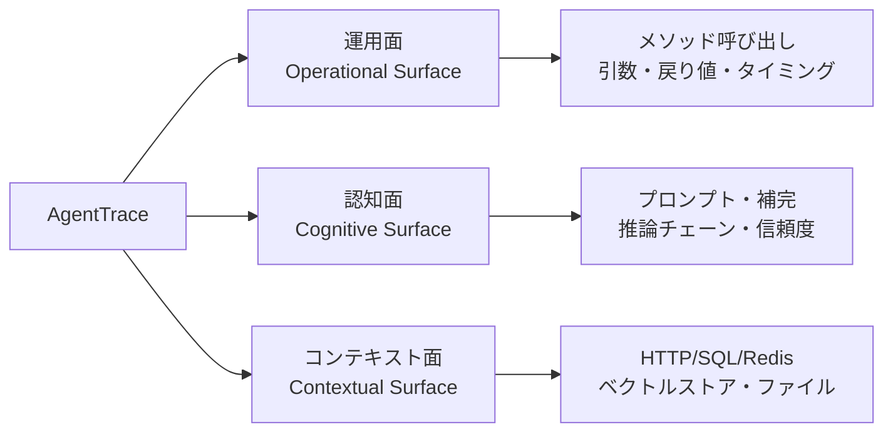

本記事は [arXiv:2602.10133](https://arxiv.org/abs/2602.10133) の解説記事です。

## 論文概要（Abstract）

高リスク環境でのLLMエージェントのデプロイにおいて、「LLMエージェントの非決定的な振る舞いは、歴史的にソフトウェア保証を支えてきた静的監査アプローチを無効にする」と著者らは主張している。AgentTraceは、運用面（Operational Surface）・認知面（Cognitive Surface）・コンテキスト面（Contextual Surface）の3つの観測面にわたる構造化テレメトリを捕捉するランタイム計装システムであり、「エージェントシステム可観測性のための構造化ロギングの最初のオープン標準」として提示されている。

この記事は [Zenn記事: LangSmith Python SDKだけでエージェントをトレース・デバッグする実践手法](https://zenn.dev/0h_n0/articles/9e5ddddee34336) の深掘りです。LangSmithの`@traceable`デコレータが提供するトレーシングの学術的基盤として、AgentTraceの3面テレメトリモデルは有用な参照枠組みを提供する。

## 情報源

- **arXiv ID**: 2602.10133
- **URL**: [https://arxiv.org/abs/2602.10133](https://arxiv.org/abs/2602.10133)
- **著者**: Adam AlSayyad, Kelvin Yuxiang Huang, Richik Pal
- **発表年**: 2026（AAAI 2026 Workshop LaMAS採択）
- **分野**: cs.SE（ソフトウェア工学）、cs.AI（人工知能）

## 背景と動機（Background & Motivation）

既存のLLMエージェントのセキュリティメカニズム — プロキシレベルの入力フィルタリングやモデルイントロスペクション技術 — は、エージェントの推論、内部状態遷移、外部システムとの相互作用に対する十分な透明性を欠いている。この透明性の欠如は、セキュリティ保証と説明責任の措置を困難にしている。

著者らは以下の課題を指摘している：

1. **非決定的振る舞い**: LLMの出力は同一入力に対しても変動し、静的テストだけでは品質保証ができない
2. **推論の不透明性**: エージェントがなぜ特定のツールを選択し、特定の引数を生成したかが外部から観測困難
3. **外部連携の追跡困難**: API呼び出し、データベースアクセス、ファイルシステム操作などの外部相互作用を体系的に記録する標準がない

## 主要な貢献（Key Contributions）

- **貢献1**: 運用・認知・コンテキストの3面テレメトリモデルの提案
- **貢献2**: フレームワーク非依存の構造化ログスキーマとプロトコルの定義
- **貢献3**: OpenTelemetryとの統合によるリアルタイム分散トレーシングの実現

## 技術的詳細（Technical Details）

### 3面テレメトリモデル

AgentTraceは3つの相互補完的な観測面でテレメトリを収集する：



**運用面（Operational Surface）** は、Pythonのイントロスペクションを通じて「すべての明示的なエージェントメソッド呼び出し、引数構造、戻り値、実行タイミング」を捕捉する。各メソッド呼び出しに対してstartイベントとcompleteイベントが生成され、引数数、結果型、実行時間を含むスパンレベルのメタデータが記録される。

**認知面（Cognitive Surface）** は、「生のプロンプト、補完、抽出された推論チェーン（Chain-of-Thoughtなど）、信頼度推定」を含むLLMの内部推論を抽出する。`<thinking>`ブロック、XMLタグ、JSONフィールドなどの区切られた推論セグメントを解析する。認知スパンは運用トレース内にネストされ、コンテキストを保持する。

**コンテキスト面（Contextual Surface）** は、「HTTP API、SQL/NoSQLデータベース、キャッシュ層、ベクトルストア、ファイルシステム」などの外部システム相互作用をOpenTelemetryの自動計装機能で追跡する。標準ライブラリ（requests、sqlalchemy、redis）をランタイムでモンキーパッチすることで、手動ロギングなしに実現する。

### ログ変換の形式化

著者らはロギング変換を以下のように形式化している：

$$
L(S, E, C) \rightarrow R
$$

ここで、
- $S$: サーフェスタイプ（運用/認知/コンテキスト）
- $E$: イベントコンテンツ
- $C$: メタデータコンテキスト
- $R$: 4つの性質を満たす構造化レコード

4つの性質とは：
- **一貫性（Consistency）**: スキーマへの準拠
- **因果性（Causality）**: 時間的忠実性
- **忠実度（Fidelity）**: 振る舞いの正確性
- **相互運用性（Interoperability）**: フレームワーク非依存の分析可能性

### 統一ログエンベロープ

すべてのサーフェスに共通するエンベロープスキーマには以下が含まれる：

```json
{
  "id": "UUID",
  "surface": "operational|cognitive|contextual",
  "trace_id": "共有トレースID",
  "span_id": "個別スパンID",
  "timestamp": "UTC ISO8601",
  "body": {
    // サーフェス固有のペイロード
  }
}
```

各サーフェスのペイロード構造：
- **運用面**: メソッド名、ステータス（start/complete/error）、実行時間、結果サマリ、オプションのトークン/レイテンシメタデータ
- **認知面**: 思考の抜粋、計画、リフレクション（モデル名とトークン数付き）
- **コンテキスト面**: 操作タイプ、ソース、クエリ/レスポンスサマリ、来歴データ

レコードは発行時にスキーマに対して検証される。ストレージにはJSONLファイル（オフライン検査用）とOpenTelemetryスパン（Jaeger・Tempoなどのバックエンド経由のリアルタイム分散トレーシング用）の2つの形式が使用される。

### ランタイムデコレータ注入（Algorithm 1）

AgentTraceはラッパーパターンによるランタイムデコレータ注入を採用している：

```python
def instrument_agent(agent, surfaces: list[str]) -> None:
    """エージェントの選択されたメソッドを計装する"""
    for method_name in get_public_methods(agent):
        original = getattr(agent, method_name)

        @wraps(original)
        def wrapped(*args, **kwargs):
            span_id = generate_span_id()
            # 1. startイベント発行
            emit_event(surface="operational",
                       status="start",
                       method=method_name,
                       args_summary=summarize(args))
            try:
                result = original(*args, **kwargs)
                # 2. 認知セグメント抽出（存在する場合）
                maybe_extract_cognitive(result)
                # 3. completeイベント発行
                emit_event(surface="operational",
                           status="complete",
                           duration=elapsed(),
                           result_summary=summarize(result))
                return result
            except Exception as e:
                emit_event(surface="operational",
                           status="error",
                           error=str(e))
                raise

        setattr(agent, method_name, wrapped)
```

このパターンは、LangSmithの`@traceable`デコレータと概念的に類似している。違いは、AgentTraceが認知面の抽出（Chain-of-Thought解析）を明示的に行う点と、コンテキスト面のモンキーパッチによる自動計装を提供する点にある。

### LangSmithとの比較

AgentTraceとLangSmithのアプローチを比較すると、以下の共通点と相違点がある：

| 観点 | AgentTrace | LangSmith |
|------|-----------|-----------|
| 計装方式 | ランタイムデコレータ注入 | `@traceable`デコレータ + `wrap_openai` |
| 運用面 | メソッド呼び出しの自動記録 | 関数の入出力記録 |
| 認知面 | CoT/思考ブロックの自動抽出 | LLMレスポンスの記録（解析は手動） |
| コンテキスト面 | 外部ライブラリの自動計装 | 明示的な`@traceable`ラッピングが必要 |
| ストレージ | JSONL + OpenTelemetry | LangSmith SaaS / セルフホスト |
| セキュリティ視点 | 監査・フォレンジクス重視 | デバッグ・評価重視 |

### 最小限のAPI

AgentTraceは3つの関数を公開する：
- `init()`: 設定とシンク準備
- `instrument_agent()`: 選択的メソッドラッピング
- `ALogger`: サーフェス固有のイベント記録

非侵入的設計により、成功した呼び出しあたり通常2つのイベント（start + complete）のみを生成し、非同期バッチエクスポートとディフェンシブなシリアライゼーションにより実行ブロッキングを防止する。

## Production Deployment Guide

AgentTraceの3面テレメトリをAWS上のLLMエージェントに適用する場合、OpenTelemetryエクスポータとログストレージの構成が必要になる。

### コスト概算

| コンポーネント | Small構成 | 役割 |
|---|---|---|
| Lambda (OTel Layer付き) | +$5-10/月 | メモリ50MB増分 |
| CloudWatch Logs | $10-30/月 | 3面テレメトリのJSONL保存 |
| S3 | $2-5/月 | 長期アーカイブ |
| X-Ray / Jaeger | $10-30/月 | スパン可視化 |
| **合計** | **$27-75/月** | — |

認知面テレメトリはLLMレスポンスの全文を含むため、CloudWatch Logsのデータ量が運用面の3-5倍になる点に注意が必要である。コスト試算は2026年9月時点のAWS ap-northeast-1リージョン料金に基づく概算であり、実際のコストはテレメトリ量により変動する。

## 実験結果（Results）

本論文は定量的実験やベンチマークを含んでいない。AgentTraceを「構造化エージェントロギングの最初のオープン標準」として提示し、実証的な検証は今後の課題としている。

ただし、著者らは以下の応用シナリオを提示している：
- **動的可観測性**: 静的監査に適さないLLMの非決定的振る舞いの捕捉
- **因果リンク**: 認知スパンが運用/コンテキストスパン内にネストされることで、推論と外部効果の追跡を実現
- **事後フォレンジクス**: 追記専用ログによる敵対的行動分析と障害帰属の支援
- **リアルタイム監視**: エージェント実行中の脅威検出とリスク評価

## 実運用への応用（Practical Applications）

**LangSmithへのCoT解析の統合**: AgentTraceの認知面が提供するCoT自動抽出は、LangSmithのトレースデータを強化する方向性を示唆する。現在のLangSmithはLLMレスポンス全体を記録するが、推論セグメントの自動抽出と構造化は行っていない。この機能を追加することで、「エージェントがなぜその判断をしたか」の分析がより容易になる。

**セキュリティ監査基盤**: AgentTraceのフォレンジクス指向設計は、金融・医療・法律など規制の厳しい業界でのLLMエージェントデプロイにおいて重要である。追記専用ログと3面テレメトリの組み合わせは、EU AI Actなどの規制要件への対応基盤となりうる。

**外部連携の自動計装**: AgentTraceのコンテキスト面が採用するモンキーパッチ方式は、LangSmithの`@traceable`が要求する手動計装の労力を削減する。既存のHTTPライブラリやデータベースドライバに対する自動計装は、エージェントが多数の外部サービスと連携する大規模システムで有効である。

## 関連研究（Related Work）

- **LangSmith/Langfuse**: 商用/OSSのLLMトレーシングプラットフォーム。デバッグと評価に焦点を当てており、AgentTraceのセキュリティ・監査視点とは異なるアプローチ
- **OpenTelemetry**: 分散トレーシングのベンダー非依存標準。AgentTraceはOTelをエクスポート先として利用しつつ、LLMエージェント固有の認知面テレメトリを追加
- **llmmas-otel (arXiv:2608.24271)**: マルチエージェントのOpenTelemetry統合と障害注入を提供。AgentTraceが単一エージェントの3面テレメトリに注力するのに対し、llmmas-otelはエージェント間通信の追跡に特化

## まとめと今後の展望

AgentTraceは、LLMエージェントの可観測性を「デバッグのためのロギング」から「セキュリティ検証・説明責任・ランタイム監視のための基盤インフラ」へと位置付け直す試みである。3面テレメトリモデル（運用・認知・コンテキスト）は、LangSmithのトレーシングが提供する情報を体系的に整理し拡張するための有用な概念枠組みを提供している。

今後は、定量的なパフォーマンス評価、認知面テレメトリの解析精度の検証、およびマルチエージェントシステムへの拡張が期待される。

## 参考文献

- **arXiv**: [https://arxiv.org/abs/2602.10133](https://arxiv.org/abs/2602.10133)
- **Venue**: AAAI 2026 Workshop LaMAS
- **Related Zenn article**: [https://zenn.dev/0h_n0/articles/9e5ddddee34336](https://zenn.dev/0h_n0/articles/9e5ddddee34336)

---

:::message
この記事はAI（Claude Code）により自動生成されました。内容の正確性については原論文と照合して検証していますが、詳細は原論文をご確認ください。
:::
