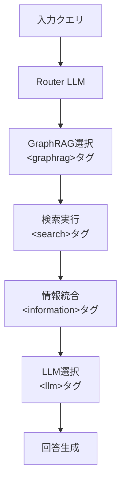

本記事は [GraphRAG-Router (arXiv:2604.16401)](https://arxiv.org/abs/2604.16401) の解説記事です。

## 論文概要（Abstract）

GraphRAGシステムは知識集約型の質問応答タスクで高い性能を示す一方、すべてのクエリに対して同一の検索フレームワークと大規模LLMを適用するため、コスト効率に課題がある。著者らはGraphRAG-Routerを提案し、階層的ルーティング戦略によって異種のGraphRAGフレームワークとジェネレータLLMを協調させるフレームワークを構築している。教師あり微調整（SFT）と2段階の強化学習を組み合わせ、カリキュラムベースのコスト考慮報酬により、6つのベンチマークで大規模LLMの使用を約30%削減しつつ競争力のある性能を維持したと報告されている。

この記事は [Zenn記事: LangGraph×Neo4jで適応的Graph-RAGを構築し製造業FAQを高速化する](https://zenn.dev/0h_n0/articles/b4901738ae781e) の深掘りです。Zenn記事ではLangGraphとNeo4jを用いた単一のGraphRAGパイプライン構築を扱っているが、本論文は複数のGraphRAGフレームワークとLLMを動的に選択する「メタレイヤー」に焦点を当てており、GraphRAGシステムのスケーリングにおける次のステップとして位置付けられる。

## 情報源

- **arXiv ID**: 2604.16401
- **URL**: [https://arxiv.org/abs/2604.16401](https://arxiv.org/abs/2604.16401)
- **著者**: Dongzhe Fan, Chuanhao Ji, Zimu Wang, Tong Chen, Qiaoyu Tan
- **発表年**: 2026
- **分野**: cs.IR（情報検索）、cs.AI（人工知能）

## 背景と動機（Background & Motivation）

GraphRAG（Graph-based Retrieval-Augmented Generation）は、知識グラフの構造を活用して従来のRAGよりも高精度な検索を実現する手法として注目されている。しかし、著者らは既存のGraphRAGシステムに2つの根本的な問題を指摘している。

第一に、**検索フレームワークの均一性**の問題がある。GraphRAG、RAPTOR、HippoRAG2、HyperGraphRAG、LinearRAGといった異なるフレームワークは、それぞれ異なるクエリタイプに対して強みを持つ。著者らの分析によれば、異なるQAベンチマークは「GraphRAGフレームワークに対して著しく異なる嗜好を示す」とされている。にもかかわらず、既存システムは単一のフレームワークを全クエリに適用している。

第二に、**ジェネレータLLMの過剰利用**の問題がある。多くのクエリは小規模モデルで十分に回答可能であるにもかかわらず、高コストな大規模LLMが一律に使用されている。この非効率性は、本番環境でのGraphRAGシステム運用コストを不必要に増大させている。

## 主要な貢献（Key Contributions）

- **貢献1（階層的ルーティング）**: GraphRAGフレームワークとジェネレータLLMの選択を段階的に行う階層的ルーティング戦略の提案。同時選択のアクション空間 $O(\|G\| \cdot \|L\|)$ を $O(\|G\| + \|L\|)$ に削減
- **貢献2（2段階RL最適化）**: SFTによるコールドスタート後、ルーティングポリシーの整合化（Stage 1）とコスト考慮の生成器割当（Stage 2）の2段階RLパイプライン
- **貢献3（適応的リソース割当）**: クエリ難易度に応じたカリキュラムベースのコスト考慮報酬関数により、簡単なクエリには小規模モデル、困難なクエリには大規模モデルを適応的に割り当てる仕組み

## 技術的詳細（Technical Details）

### 階層的ルーティング戦略の設計

GraphRAG-Routerは、クエリに対するGraphRAGフレームワークとLLMの選択を構造化されたタグベースのフォーマットで制御する。



ルーティングの意思決定は以下の順序で行われる：

1. **GraphRAG選択**: クエリの特性（単一ホップ vs マルチホップ、エンティティ中心 vs 関係中心）に基づき、5つの候補フレームワーク（GraphRAG、RAPTOR、HippoRAG2、HyperGraphRAG、LinearRAG）から最適なものを選択
2. **検索実行**: 選択されたGraphRAGフレームワークで関連情報を検索
3. **LLM選択**: 検索結果とクエリの複雑度に基づき、3つのスケール（Small/Medium/Large）のLLMから適切なものを選択
4. **回答生成**: 選択されたLLMが検索結果を基に回答を生成

この「GraphRAG-First」の順序は、検索結果の質がLLM選択の判断材料となるため、逆順（LLM-First）や同時選択（One-time）よりも高い性能を示すと報告されている（論文 Table 4）。

### SFT + RL学習パイプライン

#### Cold Start SFT

RouterモデルはSFTフェーズで基本的なルーティング能力を獲得する。著者らはGPT-5.2を用いて2種類のトレーニングデータを生成している：

- **一般ルーティングトレース（450件）**: 単一ターンのルーティング軌跡。クエリに対する最適なGraphRAG-LLM組み合わせの根拠付き選択
- **自己反省トレース（50件）**: マルチターンの軌跡。初回のルーティングが失敗した場合に、失敗を診断しGraphRAGまたはLLMを切り替えるプロセスを含む

SFTの損失関数は標準的な次トークン予測損失である：

$$
\mathcal{L}_{\text{SFT}} = -\mathbb{E}_{(x,y) \sim \mathcal{D}_{\text{SFT}}} \left[ \sum_t \log P_\theta(y_t \mid x, y_{<t}) \right]
$$

ここで、$x$ は入力クエリ、$y$ はルーティング軌跡、$\theta$ はRouterモデルのパラメータである。

#### Stage 1: ルーティングポリシーの整合化

Stage 1では、ルーティングの構造的正しさと回答品質を同時に最適化する。報酬関数は2つの要素で構成される：

**フォーマット報酬** $r_{\text{format}}(y)$: ルーティング出力の構造的正しさを段階的ペナルティで評価する。致命的な違反（タグ欠損: -1.0）、推論欠損（-0.4）、不正な順序（-0.8）、無効な名前（-0.2〜-0.1）、不正な検索構文（-0.3）など、違反の重大度に応じたペナルティが課される。最大ペナルティは-1.0に制限される。

**結果報酬** $r_{\text{outcome}}$: 生成された回答のExact Match（EM）スコア。

Stage 1の総合報酬は以下の通り：

$$
r_\varphi(x, y) = r_{\text{format}}(y) + r_{\text{outcome}}
$$

#### Stage 2: 難易度考慮のジェネレータ割当

Stage 2では、クエリ難易度に応じたコストペナルティを導入する。

まず、クエリの難易度を以下のように定義する。各クエリ $q$ について、80%以上の成功率（閾値 $\tau = 0.8$）を達成する最小モデルスケールを特定し、3段階に分類する：

- **Easy**: 小規模モデル（7-8B）で $\tau$ を超える成功率を達成
- **Medium**: 中規模モデル（Mixtral-8x22B）で $\tau$ を達成
- **Hard**: 大規模モデル（70B）でのみ $\tau$ を達成

### カリキュラムベースのコスト考慮報酬関数

コスト考慮報酬は以下の式で定義される：

$$
r_{\text{cost}}(y) = \beta \cdot w_D(q) \cdot \max\left(0,\ C(l_m) - C_{\min}(q)\right)
$$

ここで、
- $\beta$: スケーリングパラメータ（$\beta = 0.05$）
- $w_D(q)$: クエリ難易度に応じたペナルティ重み（Easy: 1.0、Medium: 0.6、Hard: 0.2）
- $C(l_m)$: 選択されたLLMのコスト（Small=1、Medium=2、Large=4）
- $C_{\min}(q)$: クエリ $q$ に必要な最小モデルのコスト

このペナルティは**正解時のみ**適用される。不正解の場合、コストペナルティは加算されない。これにより、困難なクエリに大規模モデルを使用することへのペナルティは小さく（$w_D = 0.2$）、簡単なクエリに大規模モデルを使用することへのペナルティは大きく（$w_D = 1.0$）なる。

Stage 2の総合報酬は：

$$
r_\varphi(x, y) = r_{\text{format}}(y) + r_{\text{outcome}} - \mathbb{1}\{\text{Correct}\} \cdot r_{\text{cost}}(y)
$$

RLアルゴリズムにはGRPO（Group Relative Policy Optimization）が使用されている。

## アルゴリズム

以下はGraphRAG-Routerの推論パイプラインの概念的な実装例である。

```python
from dataclasses import dataclass
from enum import Enum
from typing import Protocol


class ModelScale(Enum):
    """LLMのスケール分類"""
    SMALL = 1   # 7-8B (Qwen2.5-7B, LLaMA3.1-8B, Ministral-8B)
    MEDIUM = 2  # MoE (Mixtral-8x22B)
    LARGE = 4   # 70B (LLaMA3.3-70B)


class GraphRAGFramework(Enum):
    """利用可能なGraphRAGフレームワーク"""
    GRAPHRAG = "graphrag"
    RAPTOR = "raptor"
    HIPPORAG2 = "hipporag2"
    HYPERGRAPHRAG = "hypergraphrag"
    LINEARRAG = "linearrag"


@dataclass(frozen=True)
class RoutingDecision:
    """ルーティングの意思決定結果"""
    graphrag: GraphRAGFramework
    llm_scale: ModelScale
    reasoning: str


class GraphRAGRetriever(Protocol):
    """GraphRAGフレームワークのインターフェース"""
    def retrieve(self, query: str) -> list[dict]:
        """クエリに対する関連情報を検索する"""
        ...


class RouterModel(Protocol):
    """ルーターモデルのインターフェース"""
    def generate(self, prompt: str) -> str:
        """構造化されたルーティング出力を生成する"""
        ...


@dataclass
class CostAwareReward:
    """カリキュラムベースのコスト考慮報酬の計算

    Stage 2の報酬関数を実装する。
    """
    beta: float = 0.05
    difficulty_weights: dict[str, float] = None

    def __post_init__(self) -> None:
        if self.difficulty_weights is None:
            self.difficulty_weights = {
                "easy": 1.0,
                "medium": 0.6,
                "hard": 0.2,
            }

    def compute_cost_penalty(
        self,
        selected_scale: ModelScale,
        min_required_scale: ModelScale,
        difficulty: str,
    ) -> float:
        """コストペナルティを計算する

        Args:
            selected_scale: 選択されたLLMのスケール
            min_required_scale: クエリに必要な最小スケール
            difficulty: クエリ難易度 ("easy", "medium", "hard")

        Returns:
            コストペナルティ値（0以上）
        """
        w_d = self.difficulty_weights[difficulty]
        cost_diff = max(0, selected_scale.value - min_required_scale.value)
        return self.beta * w_d * cost_diff

    def compute_total_reward(
        self,
        format_reward: float,
        outcome_reward: float,
        is_correct: bool,
        selected_scale: ModelScale,
        min_required_scale: ModelScale,
        difficulty: str,
    ) -> float:
        """Stage 2の総合報酬を計算する

        Args:
            format_reward: フォーマット報酬（-1.0〜0.0）
            outcome_reward: 結果報酬（EM: 0.0 or 1.0）
            is_correct: 回答が正解かどうか
            selected_scale: 選択されたLLMのスケール
            min_required_scale: クエリに必要な最小スケール
            difficulty: クエリ難易度

        Returns:
            総合報酬値
        """
        cost_penalty = 0.0
        if is_correct:
            cost_penalty = self.compute_cost_penalty(
                selected_scale, min_required_scale, difficulty
            )
        return format_reward + outcome_reward - cost_penalty


def parse_routing_output(raw_output: str) -> RoutingDecision:
    """ルーターモデルの出力をパースする

    Args:
        raw_output: タグベースの構造化出力

    Returns:
        パースされたルーティング決定

    Raises:
        ValueError: 出力フォーマットが不正な場合
    """
    import re

    graphrag_match = re.search(
        r"<graphrag>(.*?)</graphrag>", raw_output, re.DOTALL
    )
    llm_match = re.search(r"<llm>(.*?)</llm>", raw_output, re.DOTALL)

    if not graphrag_match or not llm_match:
        raise ValueError(
            f"Required tags missing in output: {raw_output[:200]}"
        )

    graphrag_name = graphrag_match.group(1).strip().lower()
    llm_name = llm_match.group(1).strip().lower()

    graphrag = GraphRAGFramework(graphrag_name)

    scale_mapping = {
        "qwen2.5-7b": ModelScale.SMALL,
        "llama3.1-8b": ModelScale.SMALL,
        "ministral-8b": ModelScale.SMALL,
        "mixtral-8x22b": ModelScale.MEDIUM,
        "llama3.3-70b": ModelScale.LARGE,
    }
    llm_scale = scale_mapping.get(llm_name)
    if llm_scale is None:
        raise ValueError(f"Unknown LLM: {llm_name}")

    return RoutingDecision(
        graphrag=graphrag,
        llm_scale=llm_scale,
        reasoning=raw_output,
    )


def graphrag_router_inference(
    query: str,
    router: RouterModel,
    retrievers: dict[GraphRAGFramework, GraphRAGRetriever],
    generators: dict[ModelScale, object],
) -> str:
    """GraphRAG-Routerの推論パイプライン

    Args:
        query: ユーザークエリ
        router: 訓練済みルーターモデル
        retrievers: GraphRAGフレームワーク群
        generators: スケール別LLM群

    Returns:
        生成された回答
    """
    # Step 1: ルーターがGraphRAGとLLMを選択
    routing_output = router.generate(
        f"Route the following query to the best GraphRAG and LLM:\n{query}"
    )
    decision = parse_routing_output(routing_output)

    # Step 2: 選択されたGraphRAGで検索
    retriever = retrievers[decision.graphrag]
    context = retriever.retrieve(query)

    # Step 3: 選択されたLLMで回答生成
    generator = generators[decision.llm_scale]
    answer = generator.generate(  # type: ignore[attr-defined]
        f"Context: {context}\nQuery: {query}\nAnswer:"
    )
    return answer
```

## 実装のポイント（Implementation）

GraphRAG-Routerを実装する際の重要なポイントを以下に整理する。

**訓練データの効率性**: SFTフェーズでは500件（一般450件+自己反省50件）という比較的少量のデータで基本的なルーティング能力を獲得している。自己反省トレースの比率は全体の10%に設定されており、著者らはこの比率がルーティング失敗時のリカバリ能力に寄与すると述べている。

**フォーマット報酬の段階設計**: 構造化出力の正しさを、致命的違反（-1.0）から軽微な違反（-0.1）まで段階的にペナルティ化している。これにより、RLの学習が安定し、ルーターは構造的に正しい出力を生成しやすくなる。

**コスト割当の設計**: Small=1、Medium=2、Large=4という非線形のコスト割当は、大規模モデルの計算コストがパラメータ数に対して超線形に増加する実態を反映している。

**難易度推定の前処理**: Stage 2のコスト考慮報酬には、クエリごとの難易度ラベルが必要である。これは訓練データ上で各スケールのモデルの成功率を事前に計測し、80%閾値で分類する前処理として実装されている。

## Production Deployment Guide

### AWS実装パターン（コスト最適化重視）

GraphRAG-Routerをプロダクション環境にデプロイする場合、ルーターモデル、複数のGraphRAGフレームワーク、複数スケールのLLMを統合的に管理する必要がある。以下にトラフィック量別の推奨構成を示す。

**コスト試算の注意事項**: 以下は2026年9月時点のAWS ap-northeast-1（東京）リージョン料金に基づく概算値である。実際のコストはトラフィックパターン、バースト使用量、リージョンにより変動する。最新料金はAWS料金計算ツールで確認を推奨する。

| 構成 | トラフィック | 主要サービス | 月額概算 |
|------|-------------|-------------|---------|
| **Small** | ~100 req/日 | Lambda + Bedrock + DynamoDB | $80-200 |
| **Medium** | ~1,000 req/日 | ECS Fargate + Bedrock + ElastiCache | $400-900 |
| **Large** | 10,000+ req/日 | EKS + Karpenter + Spot + SageMaker | $2,500-6,000 |

**Small構成の内訳**: Lambda（ルーター推論: $5-15/月）、Bedrock（Small/Medium/Large LLM呼び出し: $50-120/月）、DynamoDB On-Demand（ルーティングログ: $5-10/月）、Neptune Serverless（グラフDB: $20-50/月）。ルーターモデル自体はLambda上で軽量モデルとして動作させる。

**Medium構成の内訳**: ECS Fargate（ルーターサービス: 0.5 vCPU x 1GB x 2タスク: $30-50/月）、Bedrock（LLM呼び出し: $200-500/月）、ElastiCache（検索結果キャッシュ: $50-100/月）、Neptune（グラフDB: $100-200/月）。

**Large構成の内訳**: EKS（コントロールプレーン: $73/月）、Karpenter + Spot Instances（推論ワーカー: $500-1,500/月）、SageMaker（ルーターモデルエンドポイント: $200-400/月）、Bedrock（Large LLMのみ: $800-2,000/月）、Neptune（マルチAZ: $400-800/月）。Small/Mediumスケールの推論はSpot上のvLLMで自前ホスティングし、LargeスケールのみBedrockを使用してコストを最適化する。

**コスト削減テクニック**:
- Spot Instances活用（推論ワーカー）: 最大90%削減
- Bedrock Batch API使用（非リアルタイムバッチ処理）: 50%削減
- Prompt Caching有効化（類似クエリの再利用）: 30-90%削減
- Reserved Instances（Neptune等の常時稼働サービス）: 最大72%削減

### Terraformインフラコード

**Small構成（Serverless）: Lambda + Bedrock + DynamoDB**

```hcl
# GraphRAG-Router Small構成 (Serverless)
# 2026-09 時点の設定

terraform {
  required_version = ">= 1.9"
  required_providers {
    aws = { source = "hashicorp/aws", version = "~> 5.70" }
  }
}

provider "aws" {
  region = "ap-northeast-1"
}

# --- IAM (最小権限) ---
resource "aws_iam_role" "router_lambda" {
  name = "graphrag-router-lambda-role"
  assume_role_policy = jsonencode({
    Version = "2012-10-17"
    Statement = [{
      Action = "sts:AssumeRole"
      Effect = "Allow"
      Principal = { Service = "lambda.amazonaws.com" }
    }]
  })
}

resource "aws_iam_role_policy" "router_lambda_policy" {
  name = "graphrag-router-policy"
  role = aws_iam_role.router_lambda.id
  policy = jsonencode({
    Version = "2012-10-17"
    Statement = [
      {
        Effect   = "Allow"
        Action   = ["bedrock:InvokeModel"]
        Resource = "arn:aws:bedrock:ap-northeast-1::foundation-model/*"
      },
      {
        Effect   = "Allow"
        Action   = ["dynamodb:PutItem", "dynamodb:GetItem", "dynamodb:Query"]
        Resource = aws_dynamodb_table.routing_log.arn
      },
      {
        Effect   = "Allow"
        Action   = ["logs:CreateLogGroup", "logs:CreateLogStream", "logs:PutLogEvents"]
        Resource = "arn:aws:logs:ap-northeast-1:*:*"
      },
      {
        Effect   = "Allow"
        Action   = ["xray:PutTraceSegments", "xray:PutTelemetryRecords"]
        Resource = "*"
      }
    ]
  })
}

# --- Lambda (ルーター推論) ---
resource "aws_lambda_function" "router" {
  function_name = "graphrag-router"
  runtime       = "python3.12"
  handler       = "handler.lambda_handler"
  role          = aws_iam_role.router_lambda.arn
  timeout       = 60
  memory_size   = 512  # コスト最適化: 推論モデルサイズに応じて調整

  tracing_config { mode = "Active" }  # X-Ray有効化

  environment {
    variables = {
      ROUTING_TABLE   = aws_dynamodb_table.routing_log.name
      DEFAULT_GRAPHRAG = "hipporag2"
      COST_BETA        = "0.05"
    }
  }

  filename = "lambda_package.zip"  # デプロイパッケージ
}

# --- DynamoDB (ルーティングログ, On-Demand) ---
resource "aws_dynamodb_table" "routing_log" {
  name         = "graphrag-routing-log"
  billing_mode = "PAY_PER_REQUEST"  # コスト最適化: 低トラフィック向け
  hash_key     = "query_id"
  range_key    = "timestamp"

  attribute {
    name = "query_id"
    type = "S"
  }
  attribute {
    name = "timestamp"
    type = "S"
  }

  server_side_encryption { enabled = true }  # KMS暗号化

  ttl {
    attribute_name = "expire_at"
    enabled        = true  # 90日後に自動削除でコスト削減
  }
}

# --- CloudWatch アラーム (コスト監視) ---
resource "aws_cloudwatch_metric_alarm" "lambda_duration" {
  alarm_name          = "graphrag-router-high-duration"
  comparison_operator = "GreaterThanThreshold"
  evaluation_periods  = 3
  metric_name         = "Duration"
  namespace           = "AWS/Lambda"
  period              = 300
  statistic           = "Average"
  threshold           = 30000  # 30秒超過で警告
  alarm_actions       = []     # SNSトピックARNを設定
  dimensions = {
    FunctionName = aws_lambda_function.router.function_name
  }
}
```

**Large構成（Container）: EKS + Karpenter + Spot Instances**

```hcl
# GraphRAG-Router Large構成 (Container)
# EKS + Karpenter + Spot による推論クラスタ

module "eks" {
  source  = "terraform-aws-modules/eks/aws"
  version = "~> 20.24"

  cluster_name    = "graphrag-router-cluster"
  cluster_version = "1.31"  # 2026-09時点の最新安定版

  vpc_id     = module.vpc.vpc_id
  subnet_ids = module.vpc.private_subnets

  # コスト最適化: Fargate不使用、Karpenterで管理
  cluster_endpoint_public_access = false  # セキュリティ: プライベートのみ

  eks_managed_node_groups = {
    system = {
      instance_types = ["m7i.large"]
      min_size       = 2
      max_size       = 3
      desired_size   = 2
    }
  }
}

# --- Karpenter (Spot優先, 自動スケーリング) ---
resource "kubectl_manifest" "karpenter_nodepool" {
  yaml_body = yamlencode({
    apiVersion = "karpenter.sh/v1"
    kind       = "NodePool"
    metadata   = { name = "graphrag-inference" }
    spec = {
      template = {
        spec = {
          requirements = [
            { key = "karpenter.sh/capacity-type", operator = "In", values = ["spot", "on-demand"] },
            { key = "node.kubernetes.io/instance-type", operator = "In",
              values = ["g5.xlarge", "g5.2xlarge", "g6.xlarge"] },  # GPU推論用
          ]
          nodeClassRef = { name = "default" }
        }
      }
      limits   = { cpu = "128", memory = "512Gi" }
      disruption = {
        consolidationPolicy = "WhenEmptyOrUnderutilized"
        consolidateAfter    = "60s"  # コスト最適化: 未使用ノードを速やかに回収
      }
    }
  })
}

# --- Secrets Manager (Bedrock設定) ---
resource "aws_secretsmanager_secret" "bedrock_config" {
  name                    = "graphrag-router/bedrock-config"
  recovery_window_in_days = 7
}

# --- AWS Budgets (予算アラート) ---
resource "aws_budgets_budget" "monthly" {
  name         = "graphrag-router-monthly"
  budget_type  = "COST"
  limit_amount = "5000"
  limit_unit   = "USD"
  time_unit    = "MONTHLY"

  notification {
    comparison_operator       = "GREATER_THAN"
    threshold                 = 80
    threshold_type            = "PERCENTAGE"
    notification_type         = "ACTUAL"
    subscriber_email_addresses = ["ops-team@example.com"]
  }
}
```

### セキュリティベストプラクティス

- **IAMロール**: 最小権限の原則。Lambda/ECSタスクロールにはBedrock InvokeModel、DynamoDB読み書き、CloudWatch Logsのみ許可
- **ネットワーク**: VPCエンドポイント経由でBedrock/DynamoDB/S3にアクセス。パブリックサブネットへの配置禁止
- **シークレット管理**: APIキー・モデル設定はSecrets Managerに格納。環境変数への直接埋め込み禁止
- **暗号化**: DynamoDB（SSE-KMS）、S3（SSE-S3）、EBS（AES-256）すべてKMS暗号化
- **監査**: CloudTrail有効化。Bedrock API呼び出しログを90日保持

### 運用・監視設定

**CloudWatch Logs Insights クエリ**:

```
# コスト異常検知: 1時間あたりのLLMスケール別呼び出し回数
fields @timestamp, llm_scale, graphrag_framework
| stats count(*) as call_count by bin(1h) as hour, llm_scale
| filter llm_scale = "large"
| sort hour desc
```

```
# レイテンシ分析: P95/P99
fields @timestamp, duration_ms, graphrag_framework, llm_scale
| stats percentile(duration_ms, 95) as p95,
        percentile(duration_ms, 99) as p99
  by graphrag_framework
| sort p99 desc
```

**CloudWatch アラーム設定（Python）**:

```python
import boto3

cloudwatch = boto3.client("cloudwatch", region_name="ap-northeast-1")

def create_token_usage_alarm(threshold: int = 100000) -> None:
    """Bedrockトークン使用量スパイク検知アラームを作成する

    Args:
        threshold: 5分間のトークン使用量閾値
    """
    cloudwatch.put_metric_alarm(
        AlarmName="graphrag-router-token-spike",
        MetricName="InputTokenCount",
        Namespace="AWS/Bedrock",
        Statistic="Sum",
        Period=300,
        EvaluationPeriods=2,
        Threshold=threshold,
        ComparisonOperator="GreaterThanThreshold",
        AlarmActions=["arn:aws:sns:ap-northeast-1:ACCOUNT:ops-alerts"],
        Dimensions=[
            {"Name": "ModelId", "Value": "meta.llama3-3-70b-instruct-v1:0"},
        ],
    )
```

**X-Ray トレーシング設定（Python）**:

```python
from aws_xray_sdk.core import xray_recorder, patch_all

patch_all()  # boto3自動計装


@xray_recorder.capture("route_query")
def route_query(query: str) -> dict:
    """ルーティング処理をX-Rayでトレースする

    Args:
        query: ユーザークエリ

    Returns:
        ルーティング結果とメタデータ
    """
    subsegment = xray_recorder.current_subsegment()
    if subsegment:
        subsegment.put_annotation("query_length", len(query))
        subsegment.put_metadata("query", query, "routing")

    decision = router_model.generate(query)

    if subsegment:
        subsegment.put_annotation("selected_graphrag", decision.graphrag)
        subsegment.put_annotation("selected_llm_scale", decision.llm_scale)
        subsegment.put_metadata("cost", decision.llm_scale.value, "routing")

    return {"decision": decision, "query": query}
```

**Cost Explorer自動レポート（Python）**:

```python
import boto3
from datetime import date, timedelta


def get_daily_cost_report() -> dict:
    """日次コストレポートを取得する

    Returns:
        サービス別コスト情報
    """
    ce = boto3.client("ce", region_name="us-east-1")
    today = date.today()
    yesterday = today - timedelta(days=1)

    response = ce.get_cost_and_usage(
        TimePeriod={
            "Start": yesterday.isoformat(),
            "End": today.isoformat(),
        },
        Granularity="DAILY",
        Metrics=["UnblendedCost"],
        Filter={
            "Tags": {
                "Key": "Project",
                "Values": ["graphrag-router"],
            }
        },
        GroupBy=[{"Type": "DIMENSION", "Key": "SERVICE"}],
    )

    costs = {}
    for group in response["ResultsByTime"][0]["Groups"]:
        service = group["Keys"][0]
        amount = float(group["Metrics"]["UnblendedCost"]["Amount"])
        costs[service] = amount

    total = sum(costs.values())
    if total > 100:  # $100/日超過でSNS通知
        sns = boto3.client("sns", region_name="ap-northeast-1")
        sns.publish(
            TopicArn="arn:aws:sns:ap-northeast-1:ACCOUNT:cost-alerts",
            Subject="GraphRAG-Router Cost Alert",
            Message=f"Daily cost ${total:.2f} exceeds $100 threshold.\n{costs}",
        )
    return costs
```

### コスト最適化チェックリスト

**アーキテクチャ選択**:
- [ ] トラフィック量に応じた構成選択（~100 req/日: Serverless、~1000: Hybrid、10000+: Container）
- [ ] GraphRAGフレームワークごとのインデックスサイズに応じたストレージ選択

**リソース最適化**:
- [ ] EC2/EKS推論ワーカーはSpot Instances優先（最大90%削減）
- [ ] Neptune/ElastiCache等の常時稼働サービスはReserved Instances（1年コミットで最大72%削減）
- [ ] Savings Plans検討（Compute Savings Plans）
- [ ] Lambda メモリサイズ最適化（Power Tuningで最適値を特定）
- [ ] EKS Karpenter で未使用ノードを60秒以内に回収
- [ ] 開発環境のNeptuneクラスタは夜間停止

**LLMコスト削減**:
- [ ] Bedrock Batch API使用（非リアルタイム処理は50%削減）
- [ ] Prompt Caching有効化（類似クエリパターンで30-90%削減）
- [ ] ルーターによるモデル選択ロジック（Easy→Small、Hard→Large）
- [ ] 入力トークン数制限（検索結果のトランケーション）
- [ ] Small/Medium推論はSpot上のvLLMで自前ホスティング（Bedrock比で60-70%削減）

**監視・アラート**:
- [ ] AWS Budgets設定（月額予算の80%/100%で通知）
- [ ] CloudWatch アラーム（Largeモデル呼び出し頻度、トークンスパイク）
- [ ] Cost Anomaly Detection有効化
- [ ] 日次コストレポート（Cost Explorer API + SNS）
- [ ] LLMスケール別の呼び出し比率モニタリング

**リソース管理**:
- [ ] 未使用のSageMakerエンドポイント削除
- [ ] タグ戦略（Project/Environment/CostCenter）
- [ ] DynamoDB TTLによる古いルーティングログの自動削除
- [ ] S3ライフサイクルポリシー（Glacier移行: 90日、削除: 365日）
- [ ] 開発環境の夜間自動停止（EventBridge + Lambda）

## 実験結果（Results）

### 全体性能（RQ1）

著者らは6つのベンチマークで評価を行い、GraphRAG-RouterがExact Match（EM）で平均0.482を達成し、最良ベースライン（Router-R1: 0.394）に対して22.3%の改善を報告している。

| データセット | GraphRAG-Router | Router-R1 | 改善 |
|-------------|----------------|-----------|------|
| NQ | 0.426 | - | - |
| PopQA | 0.368 | - | - |
| TriviaQA | 0.672 | - | - |
| HotpotQA | 0.461 | - | - |
| 2WikiMultiHopQA | 0.523 | - | - |
| Musique | 0.443 | - | - |
| **平均** | **0.482** | **0.394** | **+22.3%** |

タスクタイプ別では、一般QA（NQ/PopQA/TriviaQA）で+4.71%、マルチホップQA（HotpotQA/2Wiki/Musique）で+38.28%の改善が報告されている（論文 Table 2より）。マルチホップQAでの改善が顕著であり、これはGraphRAGフレームワークの選択がマルチホップ推論の質に大きく影響することを示唆している。

### コスト効率分析（RQ3）

Stage 2のコスト考慮報酬の導入により、Largeモデル（LLaMA3.3-70B）の使用率が約30%削減され、その分がSmall/Mediumモデルに再配分されたと報告されている。カリキュラムベースの難易度考慮ペナルティは、均一ペナルティと比較して性能を維持しつつコスト削減を実現している。均一なコストペナルティでは性能が犠牲になるのに対し、難易度に応じたペナルティ重みの調整が性能とコストのトレードオフを最適化している。

### アブレーション（RQ4）

ルーティング戦略の比較（論文 Table 4より）では、GraphRAG-Firstの階層的ルーティング（NQ: 0.426、HotpotQA: 0.461、2Wiki: 0.523）が、One-time同時選択（NQ: 0.398、HotpotQA: 0.433、2Wiki: 0.479）やLLM-First（NQ: 0.415、HotpotQA: 0.446、2Wiki: 0.518）を上回ることが示されている。

## 実運用への応用（Practical Applications）

GraphRAG-Routerの設計思想は、Zenn記事で紹介したLangGraph×Neo4jによるGraphRAGパイプラインの拡張に直接応用できる。

**マルチフレームワーク統合**: 単一のNeo4jベースのGraphRAGに加え、RAPTOR（階層的要約）やHippoRAG2（海馬型記憶構造）を並列に配置し、クエリ特性に応じて切り替える構成が考えられる。LangGraphのConditional Edgeを用いれば、ルーティングロジックをグラフの分岐条件として自然に表現できる。

**段階的LLM選択**: 製造業FAQのような定型的な質問はSmall LLM（7-8B）で処理し、トラブルシューティングのような複雑なマルチホップ推論はLarge LLM（70B）にルーティングすることで、応答品質を維持しつつ推論コストを最適化できる。

**汎化性能**: 著者らは、訓練時に使用していないLLM（Qwen3-8B、gpt-oss-120b）やGraphRAG（LightRAG）に対しても、再訓練なしで性能を維持または向上することを示している（論文 RQ2）。これは、本番環境でのモデル更新やフレームワーク追加が容易であることを意味する。

ただし、現時点ではWikipediaベースのQAベンチマークでの評価に限定されており、製造業ドメインの専門文書や長大な技術マニュアルへの適用については追加の検証が必要である。

## 関連研究（Related Work）

- **Router-R1** (2026): LLMルーティングに強化学習を適用した先行研究。ジェネレータLLM間のルーティングのみを扱い、検索フレームワークの選択は対象外である。GraphRAG-Routerはこれを検索層まで拡張している
- **HippoRAG2** (2025): 海馬の記憶構造に着想を得たGraphRAGフレームワーク。パーソナライズされた知識統合を特徴とする。GraphRAG-Routerでは5つの候補フレームワークの1つとして組み込まれている
- **RAPTOR** (2024): テキストを再帰的にクラスタリングし階層的要約を構築するRAGフレームワーク。異なる粒度の情報検索を可能にする。GraphRAG-Routerでは、エンティティ中心のクエリよりもトピック概要型のクエリに対して選択される傾向がある
- **GRPO** (2025): グループ相対方策最適化。バリュー関数を使用せずにグループ内のサンプル間で相対的な報酬を計算するRLアルゴリズム。GraphRAG-RouterのRL学習に採用されている

## まとめと今後の展望

GraphRAG-Routerは、異種GraphRAGフレームワークとマルチスケールLLMを階層的ルーティングとカリキュラムベース強化学習で協調させる手法を提案している。6つのベンチマークで平均22.3%の性能改善と約30%の大規模LLM使用削減を両立したと報告されている。

**制約と限界**: 著者ら自身が認めているように、評価はWikipediaベースのQAタスクに限定されており、企業文書や科学論文に対するマルチホップ推論への汎化性は未検証である。また、固定コーパスでのオフライン検索を前提としており、動的に更新される知識ソースへの対応は今後の課題として残されている。

**今後の方向性**: リアルタイム知識更新への対応、ドメイン特化型のルーティングポリシー学習、およびルーターモデル自体の軽量化（蒸留・量子化）が研究の発展方向として考えられる。

## 参考文献

- **arXiv**: [https://arxiv.org/abs/2604.16401](https://arxiv.org/abs/2604.16401)
- **Related Zenn article**: [https://zenn.dev/0h_n0/articles/b4901738ae781e](https://zenn.dev/0h_n0/articles/b4901738ae781e)
