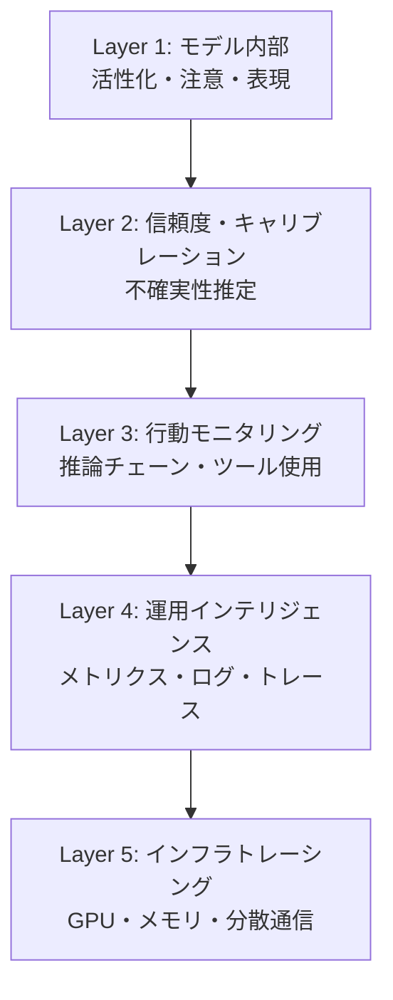

本記事は [arXiv:2604.26152](https://arxiv.org/abs/2604.26152) の解説記事です。

## 論文概要（Abstract）

「既存のモニタリングアプローチはLLMスタックの孤立した層を扱っているが、これらの技術を接続する包括的な分析は存在しなかった」と著者は指摘している。本論文は、2025-2026年に発表された5つの研究貢献を分析し、モデル内部からインフラストラクチャモニタリングまでを網羅する**5層の可観測性分類体系**を提示するサーベイ論文である。

この記事は [Zenn記事: LangSmith Python SDKだけでエージェントをトレース・デバッグする実践手法](https://zenn.dev/0h_n0/articles/9e5ddddee34336) の深掘りです。LangSmithのトレーシングが可観測性スタックのどの層に対応し、他の層のアプローチとどう連携すべきかを理解するための有用な参照枠組みを提供する。

## 情報源

- **arXiv ID**: 2604.26152
- **URL**: [https://arxiv.org/abs/2604.26152](https://arxiv.org/abs/2604.26152)
- **著者**: Twinkll Sisodia
- **発表年**: 2026
- **分野**: cs.SE（ソフトウェア工学）
- **論文仕様**: 10ページ、2図、3表

## 背景と動機（Background & Motivation）

LLMの本番デプロイメントにおいて、可観測性は信頼性の基盤である。しかし、モデルの信頼度キャリブレーション、推論チェーンのモニタリング、インフラストラクチャのトレーシングなど、各層のモニタリング手法は個別に発展してきた。

著者は以下の課題を指摘している：

1. **層間の断絶**: モデルレベルの信頼度シグナルとインフラレベルの異常を接続する手段がない
2. **評価基準の不統一**: キャリブレーション改善、忠実性、モニタラビリティなど、層ごとに異なる評価指標を統一的に比較する枠組みがない
3. **静的なモニタリング**: 現在のアプローチはワークロードや環境条件に応じた動的調整ができない

## 主要な貢献（Key Contributions）

- **貢献1**: モデル内部から基盤インフラまでを網羅する5層の可観測性分類体系の提案
- **貢献2**: 5つの最新研究（2025-2026年）の層別マッピングと比較分析
- **貢献3**: 4つの未解決統合課題の特定

## 技術的詳細（Technical Details）

### 5層の可観測性分類体系

著者は可観測性を以下の5つの抽象化レベルに整理している：

**Layer 1（モデル内部）**: 活性化値、潜在表現、注意パターンにホワイトボックス手法でアクセスする。最も高忠実度のシグナルを提供するが、解釈可能性の専門知識を要求する。

**Layer 2（信頼度・キャリブレーション）**: モデル出力に付随する自己報告の不確実性推定。キャリブレーションが実際の正確性と整合している場合、ルーティング判断を可能にする。

**Layer 3（行動モニタリング）**: 推論チェーン、ツール使用、出力特性の外部観測。モデル内部へのアクセスを必要とせず、別のモニタリングモデルを使用可能。**LangSmithの`@traceable`デコレータと`wrap_openai`はこの層に対応する**。

**Layer 4（運用インテリジェンス）**: インフラメトリクス・ログ・トレースを信頼性チーム向けのアクション可能なインサイトに統合する。

**Layer 5（インフラトレーシング）**: 低レベルのGPUカーネルプロファイリング、メモリ割り当てパターン、分散推論の通信を扱う。

### 5つの研究貢献の分析

著者は以下の5つの最新研究を層別にマッピングしている：

#### 1. MIT RLCR（強化学習キャリブレーション） — Layer 2

訓練報酬にBrierスコアペナルティを追加してキャリブレーションエラーを削減する手法。著者の報告によると、HotpotQAにおいてExpected Calibration Error（ECE）を0.37から0.03に削減しつつ、精度を維持している。

$$
\text{ECE} = \sum_{b=1}^{B} \frac{|B_b|}{n} \left| \text{acc}(B_b) - \text{conf}(B_b) \right|
$$

ここで、
- $B_b$: 信頼度ビン$b$のサンプル集合
- $\text{acc}(B_b)$: ビン$b$の精度
- $\text{conf}(B_b)$: ビン$b$の平均信頼度

ECEが0.03に低下するということは、モデルが「90%の確信度」で回答する場合、実際の正答率が87-93%の範囲に収まることを意味する。これにより、信頼度ベースのルーティング（高信頼度の回答は自動返答、低信頼度は人間にエスカレート）が実用的になる。

#### 2. UC Berkeley 命題プローブ — Layer 1

内部活性化から論理命題を抽出し、ドメイン分類と組成的組み立てによって構成する手法。敵対的入力に対して「Jaccard Indexがスカイラインの10%以内」を達成すると報告されている。内部表現と外部出力を比較することでハルシネーションを検出する。

この手法は「モデルが内部では正しい情報を保持しているが、出力では誤った情報を生成する」ケースを検出でき、LangSmithのトレースで観測される「一見正しそうだが実際には誤った回答」の根本原因分析に利用できる可能性がある。

#### 3. OpenAI CoTモニタラビリティ — Layer 3

13のベンチマークにわたる評価フレームワークで、介入・プロセス・結果の3つのアーキタイプを定義している。著者の報告では、「CoTモニタリングはアクションのみのモニタリングを大幅に上回る」とされ、推論チェーンの長さに応じたスケーリング法則が観察されている。

この知見はLangSmithでのトレース分析に直接的な示唆を与える。LLMの出力テキストだけでなく、Chain-of-Thought推論のステップを詳細に記録・分析することで、より効果的なモニタリングが可能になることを示している。

#### 4. Microsoft Research AIOpsLab — Layer 4

Kubernetesマイクロサービス上での自律的クラウドオペレーションエージェントの評価フレームワーク。「グラウンドトゥルースの根本原因を持つ再現可能なベンチマーク」を提供し、制御されたエージェント比較を可能にする。

#### 5. TRUFFLD 推論トレーシング — Layer 5

NVTXマーカーとCUPTIコールバックを使用した非侵入的なエンドツーエンドスタック観測。ガウス混合モデルとLLMベースの推論を組み合わせ、分散GPUクラスタ上で「ほぼ完全なステップレベルの異常検出」を達成すると報告されている。

### 定量的結果の比較

論文のTable 2より、各アプローチの主要な定量的成果を比較する：

| アプローチ | 層 | 主要指標 | 結果 |
|---|---|---|---|
| RLCR | L2 | ECE | 0.37 → 0.03 |
| 命題プローブ | L1 | Jaccard Index | スカイラインの10%以内 |
| CoTモニタリング | L3 | モニタラビリティ | アクション比で大幅改善 |
| AIOpsLab | L4 | ベンチマーク | 再現可能な比較基盤 |
| TRUFFLD | L5 | 異常検出 | ほぼ完全なステップレベル検出 |

### Table 1: アプローチの比較マトリクス

論文のTable 1では、6つのアプローチを層割り当て・アクセス要件・主要指標・一次シグナル・デプロイメントコンテキストの5つの観点で比較している：

| アプローチ | アクセス要件 | デプロイメント | LangSmithとの関係 |
|---|---|---|---|
| 命題プローブ | ホワイトボックス（活性化） | 研究環境 | 直接統合困難 |
| RLCR | 訓練修正 | 訓練パイプライン | 信頼度ルーティングで連携可 |
| CoTモニタリング | ブラックボックス（チェーンテキスト） | 本番環境 | **直接統合可能** |
| AIOpsLab | テレメトリAPI | 運用環境 | インフラ層で補完 |
| TRUFFLD | 非侵入的トレーシング | GPUクラスタ | インフラ層で補完 |
| NL-to-PromQL | Prometheus API | 運用環境 | メトリクス層で補完 |

この比較から、LangSmithと直接統合可能なのはCoTモニタリング（Layer 3）であり、他のアプローチはそれぞれの層で補完的に機能することがわかる。

### 層間情報フローの課題

論文のFigure 2では、層間の情報フローが可視化されている。実線矢印は確立された接続を示し、点線矢印は未探索のクロスレイヤー統合を表す。著者によれば、Layer 1（モデル内部）からLayer 4（運用インテリジェンス）への直接的な情報フローは現在確立されておらず、中間のLayer 2-3を経由する必要がある。

この知見は実務上重要である。例えば、モデルのハルシネーション（Layer 1で検出可能）がLangSmithのトレース（Layer 3）に反映されるまでにタイムラグが生じ、リアルタイムの介入が困難になる場合がある。

### 4つの未解決統合課題

著者は以下の4つの課題を特定している：

**課題1 — 層間シグナル相関**: モデルの信頼度とインフラの異常を接続するシステムが存在しない。例えば、回答品質の低下がモデルの限界なのか、KVキャッシュの圧迫なのかを区別できない。

**課題2 — 統一評価ベンチマーク**: キャリブレーション改善と忠実性、モニタラビリティ指標を比較するための共有タスク定義が欠如している。

**課題3 — リアルタイム適応モニタリング**: 現在のアプローチは静的に動作する。ワークロードや環境条件に基づく感度調整が必要。

**課題4 — コスト考慮型割り当て**: 計算リソース制約下でモニタリングリソースを層間で最適に配分するフレームワークが存在しない。

## 実運用への応用（Practical Applications）

**LangSmithの層別位置付け**: 本論文の分類体系によれば、LangSmithはLayer 3（行動モニタリング）に位置する。`@traceable`デコレータによる推論チェーンとツール使用の記録は、Layer 3の中核的な機能に対応する。しかし、Layer 1（モデル内部の活性化）やLayer 5（GPUインフラ）のモニタリングはLangSmithの範囲外であり、これらの層には別のツール（命題プローブ、NVTXトレーシング等）が必要となる。

**信頼度ベースのルーティングとの統合**: Layer 2のRLCRアプローチ（ECE 0.37 → 0.03）は、LangSmithの評価パイプラインと組み合わせることで効果的なモニタリングを実現できる。モデルの信頼度が低い回答をLangSmithのアノテーションキューに自動ルーティングし、人間レビューを優先的に割り当てるワークフローが考えられる。

**CoTモニタリングの実装**: OpenAIのCoTモニタラビリティ研究は、LangSmithのトレースデータを単に記録するだけでなく、推論チェーンの構造を解析することの重要性を示している。`@traceable`で記録されたLLMの推論ステップに対して、カスタム評価器で推論の一貫性を自動チェックすることで、Layer 3のモニタリング品質を向上できる。

**統合的可観測性スタックの設計**: 本論文が指摘する「統合課題」は、LLMアプリケーションの本番運用において重要な設計指針を提供する。以下の実用的なスタック構成が考えられる：

| 層 | 担当ツール | 役割 |
|---|---|---|
| Layer 3 | LangSmith | エージェントの推論・ツール使用トレース |
| Layer 3 | LangSmithカスタム評価器 | CoTモニタラビリティの自動評価 |
| Layer 4 | Prometheus + Grafana | インフラメトリクスの可視化 |
| Layer 4 | CloudWatch Logs Insights | ログ分析とコスト異常検知 |
| Layer 4-5 | AWS X-Ray | 分散トレーシング |
| Layer 5 | NVIDIA DCGM / NVTX | GPU使用率・メモリプロファイリング |

Layer 1-2については、モデルプロバイダ（OpenAI、Anthropic等）がAPIレベルで信頼度スコアを公開することで、LangSmithのトレースデータと統合可能になる展望がある。現時点では、LangSmithの`wrap_openai`が記録するレスポンスメタデータに信頼度情報が含まれることは少ないが、今後のAPI拡張で改善される可能性がある。

**既存のLangSmithワークフローへの知見の適用**: 本論文の知見をZenn記事で紹介されているLangSmithワークフローに適用すると、以下の改善が考えられる。Datasets × Experiments機能でエージェント品質をテストする際、Layer 2の信頼度キャリブレーション指標（ECE）をカスタム評価器として実装することで、「回答品質」だけでなく「回答の確信度の信頼性」も同時に評価可能となる。

## 関連研究（Related Work）

- **LangSmith/Langfuse**: 商用/OSSのLayer 3トレーシングプラットフォーム。本論文の5層分類体系の中で行動モニタリング層に位置する
- **OpenTelemetry**: Layer 4-5のベンダー非依存標準。本論文で分析されたTRUFFLDはこの層のアプローチの一つ
- **From Agent Traces to Trust (arXiv:2606.04990)**: エビデンス追跡と実行来歴のサーベイ。本論文がモニタリング層の分類に焦点を当てるのに対し、信頼性と説明責任の次元で整理している
- **AgentDebugX (arXiv:2607.18754)**: Detect-Attribute-Recover-Rerunの閉ループデバッグツールキット。本論文のLayer 3-4における障害診断の実装に位置付けられる
- **AgentTrace (arXiv:2602.10133)**: 運用・認知・コンテキストの3面テレメトリフレームワーク。本論文のLayer 3に対応し、特に認知面のCoTモニタリングはOpenAIの研究と関連する

## まとめと今後の展望

本論文は、LLMシステムの可観測性を5つの層に分類し、各層のアプローチの強みと限界を分析している。著者は今後の研究方向として、垂直統合フレームワーク、可観測性考慮型の訓練目的関数、エージェント型診断ワークフロー、マルチモデルシステム向けのフェデレーテッドアーキテクチャの4つを挙げている。著者が特定した「統合課題 — モデルレベルの信頼度シグナルとインフラレベルの異常をコヒーレントな運用インテリジェンスに接続すること — が未解決の中心的課題」という指摘は、LangSmithを含む可観測性ツール全般の今後の発展方向を示唆している。

LangSmithはLayer 3において成熟したソリューションを提供しているが、Layer 1-2（モデル内部・信頼度キャリブレーション）やLayer 5（インフラトレーシング）との統合は、今後の研究と製品開発の重要な方向性である。

## 参考文献

- **arXiv**: [https://arxiv.org/abs/2604.26152](https://arxiv.org/abs/2604.26152)
- **Related Zenn article**: [https://zenn.dev/0h_n0/articles/9e5ddddee34336](https://zenn.dev/0h_n0/articles/9e5ddddee34336)

---

:::message
この記事はAI（Claude Code）により自動生成されました。内容の正確性については原論文と照合して検証していますが、詳細は原論文をご確認ください。
:::
