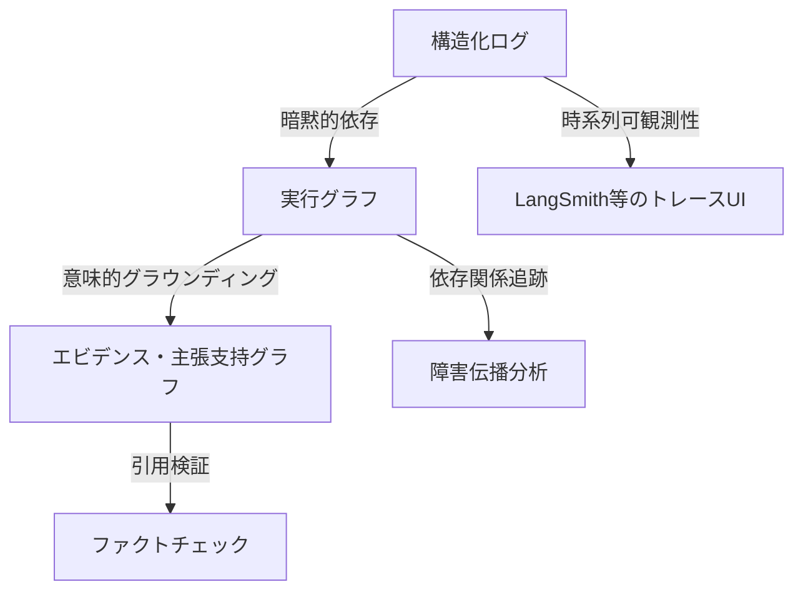

本記事は [arXiv:2606.04990](https://arxiv.org/abs/2606.04990) の解説記事です。

## 論文概要（Abstract）

LLMエージェントが自律的に計画・ツール呼び出し・メモリ操作を行う時代において、「最終回答の正確さだけでは、出力がどのように生成されたか、どのエビデンスが各判断を支えたか、ツール呼び出しが正当だったかを説明できない」と著者らは主張している。本論文は、エビデンス追跡（Evidence Tracing）と実行来歴（Execution Provenance）を統一的に扱う初のサーベイであり、検索グラウンディング・主張検証・ツール使用安全性・メモリ系譜・可観測性・デバッグ・監査・リカバリの8次元にわたるフレームワークを提示している。

この記事は [Zenn記事: LangSmith Python SDKだけでエージェントをトレース・デバッグする実践手法](https://zenn.dev/0h_n0/articles/9e5ddddee34336) の深掘りです。LangSmithが提供するトレーシング機能の学術的背景と、エージェント可観測性の全体像を理解するために有用な論文である。

## 情報源

- **arXiv ID**: 2606.04990
- **URL**: [https://arxiv.org/abs/2606.04990](https://arxiv.org/abs/2606.04990)
- **著者**: Yiqi Wang, Jiaqi Zhang, Zhangkai Wu, Taotao Cai, Zirui Liu et al.
- **発表年**: 2026
- **分野**: cs.CR（暗号とセキュリティ）、cs.AI（人工知能）
- **バージョン**: v5（2026年9月10日更新）

## 背景と動機（Background & Motivation）

LLMエージェントは単なるテキスト生成から、自律的な計画立案・ツール呼び出し・外部システムとの対話へと進化している。この進化に伴い、従来の「出力の正確さ」だけでは信頼性の担保が困難になっている。

著者らは以下の3つの課題を指摘している：

1. **説明責任の欠如**: エージェントが複数ステップの推論とツール呼び出しを経て回答を生成する際、各ステップの根拠が不透明である
2. **障害の波及**: 検索・ツール・メモリの各コンポーネントで発生した障害が、下流の判断に連鎖的に影響する
3. **セキュリティリスク**: 間接的プロンプトインジェクションやメモリ汚染など、エージェント固有の攻撃ベクトルが存在する

これらの課題に対し、既存研究は個別のコンポーネント（検索精度、ツール安全性など）に焦点を当てており、統一的なフレームワークが存在しなかった。

## 主要な貢献（Key Contributions）

- **貢献1**: エビデンス追跡と実行来歴の形式的定義（型付きグラフとしての表現）
- **貢献2**: 6次元の分類体系による既存研究の体系的整理
- **貢献3**: 8つの信頼機能（検証・帰属・デバッグ・安全性強制・監査・障害帰属・リカバリ）の定義と評価
- **貢献4**: メモリ来歴・クロスセッション追跡・プライバシー考慮に関する7つの未解決課題の特定

## 技術的詳細（Technical Details）

### 実行来歴とエビデンス追跡の形式化

著者らは2つの中核概念を形式的に定義している。

**実行来歴（Execution Provenance）** は、エージェント実行の完全な型付き表現であり、以下の要素から構成される：

$$
\mathcal{P} = (U_e, U_x, R)
$$

ここで、
- $U_e$: エビデンス単位の集合（検索文書、ツール出力、メモリ項目、主張）
- $U_x$: 実行単位の集合（推論ステップ、検索呼び出し、ツール呼び出し、メモリ操作）
- $R$: 来歴関係の集合（因果・手続き・依存・更新・矛盾・無効化）

**エビデンス追跡（Evidence Tracing）** は、実行来歴からエビデンス支持関係への射影として定義される。すなわち、エビデンス単位とエージェントの主張・判断・行動との間の支持・影響関係を抽出する部分問題である。

### 6次元の分類体系

著者らは以下の6次元でエージェント来歴を整理している：

**次元1 — トレースソース**: 推論、検索、ツール使用、MCPバウンダリ、メモリ、環境対話、マルチエージェント通信

**次元2 — エビデンスと実行の単位**: 意味的オブジェクト（文書、パッセージ、ツール出力、メモリ項目、主張）と手続き的オブジェクト（推論ステップ、検索呼び出し、ツール呼び出し、メモリ操作）

**次元3 — 来歴関係**: 著者らは9種類の関係型を定義している：
- **Support**: エビデンスが主張を支持
- **Derive**: 実行単位が新しいエビデンスを導出
- **Depend-on**: 実行単位が別の単位に依存
- **Contradict**: エビデンス間の矛盾
- **Invalidate**: エビデンスの無効化
- **Trigger**: 実行単位が別の実行を誘発
- **Update**: メモリの更新
- **Use**: ツールの使用
- **Generate**: 新しいエビデンスの生成

**次元4 — トレーシング粒度**: 実行レベルからトークン/スパンレベルまで、タイミングは事前実行から継続的監視まで

**次元5 — 表現形式**: 構造化ログ、実行グラフ、エビデンスグラフ、主張-支持グラフ、来歴グラフ、ランタイム状態

**次元6 — 信頼機能**: 検証、帰属、デバッグ、安全性強制、監査、障害帰属、リカバリ

### 来歴の3層表現

著者らは相互補完的な3つの表現アプローチを整理している：

**構造化ログ**は、型付き実行イベント（リクエスト、検索呼び出し、ツール呼び出し、メモリ操作）を時系列順に記録する。LangSmithの`@traceable`デコレータが生成するトレースデータはこの層に対応する。

**実行グラフ**は、実行成果物を依存関係で接続し、「何が何に依存していたか」に回答する。ノードは命令・エビデンス・ツール呼び出し・主張・行動を表し、型付きエッジが影響関係を示す。

**エビデンス・主張-支持グラフ**は、エビデンスの利用可能性と実際の使用を区別し、Cited・Support・Omitted・Contradict・Invalidateのエッジ型を持つ。

### ツール使用来歴フレームワーク

著者らはツール使用の来歴追跡において5つの重要コンポーネントを特定している：

1. **ツール呼び出し系譜（Tool-Call Lineage）**: ツール選択から引数生成、下流の消費者までの追跡
2. **引数来歴（Argument Provenance）**: パラメータのソースを追跡し、機密ツール呼び出しにおける信頼できない値を検出
3. **間接プロンプトインジェクション**: 情報フロー追跡による信頼された意図と信頼されないコンテンツの区別
4. **アクセス制御**: ケイパビリティポリシーと来歴考慮型の実施の組み合わせ
5. **ランタイム検証**: 事前実行チェックと事後実行監査

論文では以下の代表的システムが分析されている：
- **Agent-Sentry**: 来歴グラフを実行し、機密ツール引数が信頼できないソースから派生しているかを検証
- **CaMeL**: 制御フローとデータフローを訓練により分離
- **FIDES**: 機密性/完全性ラベルによる情報フロー制御を適用
- **NeuroTaint**: ニューラルコンポーネントとシンボリックコンポーネント間でテイント伝播

### メモリ来歴のライフサイクル

著者らはメモリを来歴を持つエビデンスとして扱い、4つのライフサイクルフェーズで分析している：

**書き込み来歴（Write Provenance）**: 各メモリ項目をソース（ユーザー入力、検索文書、ツール出力、リフレクション）と変換操作にリンクする。ソースの種類、タイムスタンプ、作成エージェント、支持エビデンスを追跡する。

**検索影響（Retrieval Influence）**: どのメモリ項目が検索され、それらの元のソース、関連性シグナル、有効性ステータス、主張・ツール呼び出し・行動への下流リンクを記録する。

**矛盾と汚染（Conflict and Contamination）**: ソースの信頼追跡と完全性ラベルを通じて、互換性のない、無効化された、または悪意を持って毒されたメモリを特定する。

**長期検証（Long-Term Verification）**: セッションをまたいだ主張-エビデンス追跡を可能にし、メモリにソース系譜、時間的有効性メタデータ、矛盾ステータスの保持を要求する。

論文のTable 5によると、既存システムのうち書き込みと検索をサポートするものは多いが、矛盾処理・陳腐化検出・汚染追跡を強力にサポートするのはFIDES、NeuroTaint、Agent-Sentryのみであると報告されている。

### 来歴表現のトレードオフ

著者らは来歴表現の設計において、4つの重要なトレードオフを特定している：

**時系列ログ vs 意味的来歴**: 構造化ログは「何が起きたか」を記録するが、「エビデンスが主張を支持したか」は表現できない場合がある。LangSmithの`@traceable`は時系列ログに対応するが、意味的来歴の追跡には追加の分析層が必要となる。

**コンポーネントレベル vs エンドツーエンド**: 検索精度やツール安全性を個別に評価することは容易だが、障害は検索・ツール・メモリの各コンポーネントをまたいで伝播する。エンドツーエンドの説明責任には、コンポーネント横断的な来歴追跡が不可欠である。

**静的スキーマ vs ランタイム安全性**: スキーマは表現を標準化するが、ランタイムの安全性強制にはオンラインのソース追跡が必要となる。これは設計時と実行時の要件が異なることを意味する。

**完全性 vs デプロイ可能性**: 細粒度の来歴は説明責任を向上させるが、ストレージ要件、プライバシー露出、アノテーション負荷が増大する。本番環境では、適切な粒度の選択が重要となる。

### 信頼機能と評価指標

著者らは来歴を下流の目的に接続する信頼機能を定義している：

| 信頼機能 | 評価指標の成熟度 | 主な評価指標 |
|---|---|---|
| 検証（Verification） | 確立済み | エビデンス再現率、引用精度、ソース支持性 |
| 帰属（Attribution） | 確立済み | 主張-支持精度 |
| デバッグ（Debugging） | 提案段階 | トレース完全性、来歴精度 |
| 安全性強制（Safety） | 確立済み | 安全でない影響の検出率 |
| 監査（Audit） | 提案段階 | 依存カバレッジ、時間的一貫性 |
| リカバリ（Recovery） | 未定義 | — |

「確立済み」の指標はエビデンス帰属と安全性に存在するが、「提案段階」の指標（トレース完全性、来歴精度、依存カバレッジ、時間的一貫性）は操作的定義を欠いていると著者らは指摘している。

## 実験結果（Results）

本論文はサーベイ論文であり、独自の実験は含まれていない。代わりに、既存ベンチマークのカバレッジ分析を行っている。

### ベンチマークカバレッジ分析

| ベンチマーク種別 | 代表例 | カバー範囲 | 欠落 |
|---|---|---|---|
| RAG/帰属 | ALCE, FActScore, RAGChecker | 主張レベルの支持分析 | ツール・メモリ・マルチエージェント |
| ツール使用安全性 | ToolEmu, InjecAgent, AgentDojo | インジェクション攻撃の部分的カバー | 完全な来歴・メモリ・マルチエージェント通信 |
| トレースデバッグ | TRAIL, MAST, AgenTracer | 障害局所化 | リカバリ・メモリ来歴・エビデンス帰属 |
| メモリ | — | 想起とパーソナライゼーション | ソース帰属・矛盾解決・汚染追跡 |

著者らはこの分析から、「既存ベンチマークは個別コンポーネントを評価するが、エンドツーエンドの評価は未完成」と結論付けている。

## 実運用への応用（Practical Applications）

本サーベイの知見は、LangSmithのようなエージェント可観測性プラットフォームの設計と利用に直接関連する。

**構造化ログとLangSmithの対応**: LangSmithの`@traceable`デコレータは論文の「構造化ログ」層に対応し、ネストされたスパンの記録を提供する。ただし、論文が指摘するように、構造化ログだけでは「エビデンスが主張を支持したかどうか」は表現できない。エビデンス帰属の分析には、実行グラフやエビデンスグラフへの拡張が必要となる。

**ツール使用の安全性検証**: LangSmithのトレースデータから、ツール呼び出しの引数がどのソースから派生したかを追跡することで、間接プロンプトインジェクションの検出が可能になる。Agent-SentryやCaMeLのアプローチは、本番環境での実装指針として参考になる。

**メモリ来歴の実装**: 永続メモリを持つエージェント（MemGPTなど）では、メモリ項目のソース追跡と汚染検出が重要である。LangSmithの評価パイプラインに、メモリ来歴の検証を組み込むことで、エージェントの長期的な信頼性を担保できる。

**EU AI Act対応**: 論文が言及する通り、2026年8月施行のEU AI Actは高リスクAIシステムに対し、完全な判断コンテキストの再構築に十分なログの保持を要求している。具体的には、システムプロンプトのバージョン、検索コンテキストの出所、モデルチェックポイントのバージョン、ヒューマン・イン・ザ・ループのゲートイベントの記録が求められる。LangSmithのトレースデータは、この要件への対応基盤として活用できる。

**エージェント品質の継続的テストへの応用**: 本サーベイの信頼機能フレームワークは、LangSmithのDatasets × Experiments機能と組み合わせることで、より体系的な品質テストを構築できる。例えば、「検証」機能のエビデンス再現率をカスタム評価器として実装し、「帰属」機能の主張-支持精度をLLM-as-Judge評価器で測定するアプローチが考えられる。

## 関連研究（Related Work）

- **AgentTrace (arXiv:2602.10133)**: 運用・認知・コンテキストの3面で構造化テレメトリを収集するフレームワーク。本サーベイの「構造化ログ」層に対応するが、エビデンスグラフへの拡張は含まれていない
- **AgentDebugX (arXiv:2607.18754)**: Detect-Attribute-Recover-Rerunの閉ループデバッグを実現するツールキット。本サーベイの「デバッグ」と「リカバリ」の信頼機能に対応する
- **llmmas-otel (arXiv:2608.24271)**: OpenTelemetryベースの分散トレーシングと障害注入を組み合わせたツール。本サーベイの「可観測性」次元に対応する

## まとめと今後の展望

本サーベイは、LLMエージェントの信頼性確保には最終回答の正確さだけでなく、エビデンスの追跡と実行来歴の記録が不可欠であることを体系的に論じている。著者らが特定した7つの未解決課題は以下の通りである：

1. 検索・ツール・メモリ・マルチエージェントにまたがる**統一トレーススキーマ**の不在
2. コンテンツレベルの支持と手続き的依存を区別する**意味的来歴**の未発達
3. ソース帰属・矛盾処理・汚染追跡を含む**メモリ来歴**の形式化の必要性
4. 来歴とオンラインポリシーチェックを統合する**ランタイム安全性強制**
5. コンポーネント横断的な**現実的ベンチマーク**の欠如
6. 来歴が有意味な修復を支援するかを評価する**リカバリ指向評価**の未発達
7. 長期実行トレースのストレージ・開示・ガバナンスを管理する**プライバシー考慮型監査基盤**

これらの課題は、LangSmithのようなトレーシングプラットフォームが今後拡張すべき方向を示唆している。

## 参考文献

- **arXiv**: [https://arxiv.org/abs/2606.04990](https://arxiv.org/abs/2606.04990)
- **Related Zenn article**: [https://zenn.dev/0h_n0/articles/9e5ddddee34336](https://zenn.dev/0h_n0/articles/9e5ddddee34336)

---

:::message
この記事はAI（Claude Code）により自動生成されました。内容の正確性については原論文と照合して検証していますが、詳細は原論文をご確認ください。
:::
