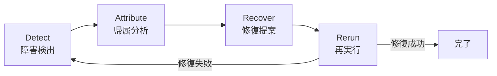

本記事は [arXiv:2607.18754](https://arxiv.org/abs/2607.18754) の解説記事です。

## 論文概要（Abstract）

「LLMエージェントの障害はデバッグが困難である。なぜなら、エラーが表面化するステップと、それを引き起こしたステップは往々にして異なるからである」と著者らは述べている。AgentDebugXは、**Detect → Attribute → Recover → Rerun**の4段階閉ループとしてデバッグを構造化し、DeepDebugマルチターン根本原因診断エージェントを中核とするオープンソースツールキットである。

この記事は [Zenn記事: LangSmith Python SDKだけでエージェントをトレース・デバッグする実践手法](https://zenn.dev/0h_n0/articles/9e5ddddee34336) の深掘りです。LangSmithがトレースデータの「記録と可視化」に焦点を当てるのに対し、AgentDebugXはトレースデータからの「障害帰属と自動修復」に焦点を当てており、トレーシングの次のステップとして位置付けられる。

## 情報源

- **arXiv ID**: 2607.18754
- **URL**: [https://arxiv.org/abs/2607.18754](https://arxiv.org/abs/2607.18754)
- **著者**: Kunlun Zhu, Xuyan Ye, Zhiguang Han, Yuchen Zhao, Bingxuan Li, Weijia Zhang, Muxin Tian, Xiangru Tang, Pan Lu, James Zou, Jiaxuan You, Heng Ji
- **発表年**: 2026
- **分野**: cs.AI（人工知能）、cs.CL（計算言語学）

## 背景と動機（Background & Motivation）

LLMエージェントの障害は、従来のソフトウェアバグとは質的に異なる。著者らは以下の課題を指摘している：

1. **因果の分離**: ツール呼び出しエラーが表面化するのは結果を使用するステップであるが、真の原因は引数を生成した数ステップ前のLLM推論にある場合が多い
2. **非決定性**: 同じ入力でも異なるツール選択や引数生成が行われるため、再現性が低い
3. **マルチエージェントの連鎖障害**: あるエージェントの判断ミスが、ハンドオフを通じて下流のエージェントに波及する

これらの課題に対し、既存のアプローチ（Reflexion、CRITIC、AutoManual）は障害の検出と修復を分離して扱っており、帰属（どのステップが原因か）の精度が限定的である。

## 主要な貢献（Key Contributions）

- **貢献1**: 障害検出・帰属・修復・再実行を閉ループで統合する診断フレームワーク
- **貢献2**: マルチターン構造誘導型の根本原因診断エージェント（DeepDebug）
- **貢献3**: 19のシードモードからなる拡張可能な障害分類体系
- **貢献4**: 184トレースからなるWho&Whenベンチマーク

## 技術的詳細（Technical Details）

### Detect → Attribute → Recover → Rerunの閉ループ



**Detect（検出）**: 2段階で障害を特定する。第1段階では、決定論的ルールパック（不正なツール呼び出し形式、無限ループ、無効な出力）で機械的に検証可能なエラーを検出する。第2段階では、LLMジャッジがタスクコンテキストとトレースウィンドウを読み取り、19モードの共有障害分類体系にマッピングされた型付き検出結果を返す。

**Attribute（帰属）**: コスト段階型の戦略で症状を責任あるエージェントとステップまで逆追跡する。安価なヒューリスティクスと単一パス全トレース読み取りから始まり、二分探索、ステップごとの検査、予算制約付きアンサンブルへとエスカレートする。各帰属器は信頼度と来歴付きのランク付き仮説を返し、曖昧なケースはDeepDebugにエスカレートされる。

**Recover（修復）**: 根本原因の発見を、特定されたステップ・障害モード・エビデンス・周辺コンテキストに基づく具体的なリトライ提案に変換する。すべての提案は明示的な人間またはポリシーの承認ゲートを通過する。

**Rerun（再実行）**: 診断・チェックポイント・リトライ指示をパッケージ化し、元のトラジェクトリと修復ブランチの両方を比較のために保持する。

### DeepDebugマルチターン根本原因診断

DeepDebugは曖昧なケースを4段階の読み取り専用診断プロセスで解決する：

**Stage 1（グローバル読み取り）**: 完全なトラジェクトリを取り込み、目的と履歴を再構築し、決定的ステップの初期候補を提案する。

**Stage 2（構造誘導型調査）**: トレースの形状に応じた戦略を採用する。マルチエージェント実行の場合、ハンドオフカスケードを障害から最初の致命的ステップまで上流に辿る。シングルエージェント実行の場合、ステップ範囲を二分し、残存領域を再読み取りして独立した第2候補を生成する。

**Stage 3（交差検証）**: 2つのパスが一致すれば採用。不一致の場合、DeepDebugは両候補をコンテキスト・入力・出力・下流効果とともにサイドバイサイドで検査し、より強い因果説明を選択する。これにより、根本原因の選択がトレース全体の探索から**2つの仮説間の集中的な裁定**へと削減される。

**Stage 4（診断と提案）**: 責任あるエージェントとステップ、平文の説明、引用エビデンス、修復が直接使用できる具体的な修正案を含む構造化レポートを出力する。

### 19モードの障害分類体系

障害分類体系は5次元にわたる19のシードモードで構成される：

| 次元 | 障害モードの例 |
|---|---|
| **計画（Planning）** | 無効な判断、制約の省略、早期成功判定 |
| **メモリ（Memory）** | 陳腐な検索、矛盾する状態、失われたコンテキスト |
| **ツール使用（Tool Use）** | 不正な呼び出し形式、引数エラー、結果の誤解釈 |
| **検証（Verification）** | 検証失敗、出力拒否、矛盾検出 |
| **連携（Coordination）** | ハンドオフ喪失、デッドロック、タイミング障害 |

分類体系は拡張可能であり、誘導器（Inducer）が再発する新規モード候補を収集し、ラベルと埋め込みの類似性でクラスタリング（サポート閾値ゲート付き）し、クラスタごとに1候補を提案する。提案は既存セットに対して重複排除され、メンテナが審査して採否を決定する。

### トレース表現

AgentDebugXはフレームワーク非依存のポータブルスキーマを使用する：

```python
@dataclass
class AgentEvent:
    event_type: str        # "llm_call", "tool_call", "handoff", ...
    agent_name: str
    module: str
    step_index: int
    parent_event: str | None
    timestamp: datetime
    inputs: dict
    outputs: dict
    error: str | None
    duration_ms: float
    metadata: dict
    artifacts: list[str]
```

すべてのフレームワーク固有のイベントがこのスキーマに変換されるため、LangSmithのトレースデータもこのスキーマにマッピング可能である。

### デプロイメントインターフェース

AgentDebugXは4つのインターフェースを提供している：

1. **Pythonライブラリ**: コンテキストマネージャインターフェースでプログラマティックに統合
2. **CLIツール**: `ingest → diagnose → inspect → act`のワークフロー型操作
3. **Webコンソール**: トレースナビゲータ → 帰属結果 → 診断パネル → ポリシーゲート付きリランブランチの対話的UI
4. **エージェントスキル**: ツール使用エージェントが自己診断のためにインストール可能なスキル

Webコンソールでは、トレースの各ステップをクリックして入出力を確認し、DeepDebugの診断結果を参照しながら修復の承認/拒否を行える。ポリシーゲートにより、自動修復と人間承認の境界を組織のポリシーに応じて設定可能である。

## 実験結果（Results）

### Who&Whenベンチマーク

**構成**: 184トレース（アルゴリズム生成126件 + 手作成58件）。各トレースにゴールドの責任エージェント（"who"）と正確な誤りステップ（"when"）がラベル付けされている。

**プロトコル**: すべての手法がタスクの参照回答を受け取るが、ゴールドのエージェントもステップも与えられない。temperature 0、補完は4,096トークン上限。

論文のTable 2より、qwen3.5-9bモデルでの結果：

| 手法 | エージェント精度 | ステップ(完全一致) | ステップ(±1) | A+S(完全一致) | A+S(±1) |
|---|---|---|---|---|---|
| ルールヒューリスティック | 14.1% | 1.6% | 6.5% | 1.6% | 2.7% |
| All-at-Once | 47.8% | 22.3% | 35.3% | 21.7% | 23.9% |
| Step-by-Step | 41.8% | 18.5% | 38.0% | 17.9% | 19.6% |
| Binary-Search | 41.8% | 17.4% | 38.6% | 17.4% | 20.1% |
| **DeepDebug** | **56.0%** | **28.8%** | **44.0%** | **28.8%** | **32.1%** |

DeepDebugは完全一致のエージェント+ステップ精度（A+S）で28.8%を達成し、最強ベースライン（All-at-Once: 21.7%）を7.1ポイント上回っている。

### GAIAベンチマーク修復実験

論文のTable 3より、qwen3.5-9bのOpen-Deep-Researchエージェントを165件のバリデーションタスクで実行し、73件の失敗に対する単一リラン結果：

| 手法 | 修復数/73 | L1精度 | L2精度 | L3精度 | 全体精度 |
|---|---|---|---|---|---|
| Vanilla qwen3.5-9b | — | 77.4% | 48.8% | 34.6% | 55.8% |
| + CRITIC | 4/73 | 81.1% | 51.2% | 34.6% | 58.2% |
| + AutoManual | 5/73 | 79.2% | 53.5% | 34.6% | 58.8% |
| + Reflexion | 6/73 | 77.4% | 55.8% | 34.6% | 59.4% |
| + **DeepDebug** | **13/73** | **81.1%** | **61.6%** | **34.6%** | **63.6%** |

DeepDebugは分離されたベースラインの2倍以上の失敗タスクを修復している（13件 vs 4-6件）。Level-2のマルチホップタスクでの改善が顕著である（48.8% → 61.6%、論文Table 3より）。

### コスト効率

著者らによれば、DeepDebugは層別サンプルで約12.8Kトークンを使用し、単一パス帰属の8.1Kの約1.6倍である。後続ターンでは完全トレースではなく集中ウィンドウを読み取るため、曖昧なケースのみエスカレートする場合の期待コストは単一パス分析に近いと報告されている。

## 実運用への応用（Practical Applications）

**LangSmithトレースとの統合**: AgentDebugXのAgentEventスキーマはLangSmithのトレースデータと構造的に互換性がある。LangSmithの`@traceable`で記録されたトレースをAgentEventに変換し、DeepDebugで障害帰属を実行するパイプラインが構築可能である。

**エージェント品質の3大障害パターンとの対応**: Zenn記事で紹介されている3大障害パターン（パラメータのハルシネーション、推論ループ、コンテキスト消費過多）は、AgentDebugXの障害分類体系では以下に対応する：
- パラメータのハルシネーション → 「ツール使用: 引数エラー」
- 推論ループ → 「計画: 無効な判断」「連携: デッドロック」
- コンテキスト消費過多 → 「メモリ: 失われたコンテキスト」

**CI/CDへの統合**: AgentDebugXのCLIインターフェース（ingest/diagnose/inspect/act）は、CI/CDパイプラインへの組み込みに適している。LangSmithのDatasets × Experimentsで失敗を検出し、AgentDebugXで自動帰属・修復提案を行い、人間の承認後にリランを実行する半自動化ワークフローが考えられる。

**Error Hubによる知識共有**: AgentDebugXが提供するError Hubは、トラジェクトリ・診断・修復バンドルのオプトイン共有コーパスである。デフォルトのスクラバーがイベント入力とPII/認証情報をパターンベースで除去する。このバンドルはCIフィクスチャ、インシデント記録、チーム間の再利用可能なデバッグメモリとして機能する。

**コスト管理の実践**: DeepDebugの約12.8Kトークン使用量は、LangSmithの無料枠（月5,000トレース）内で運用する場合にも現実的な範囲である。曖昧なケースのみDeepDebugにエスカレートする戦略により、単一パス帰属のコストに近い水準でより高精度な障害帰属を実現できる。

## 関連研究（Related Work）

- **Reflexion (Shinn et al., 2023)**: エージェントの自己リフレクションに基づく修復。障害帰属なしに直接修復を試みるため、根本原因の特定精度が限定的
- **CRITIC (Gou et al., 2024)**: 外部ツールフィードバックによる自己修正。AgentDebugXと異なり、マルチターン構造誘導型の診断は含まない
- **AutoManual**: 失敗経験からマニュアルを自動生成。AgentDebugXの障害分類体系の拡張メカニズムと類似するアプローチ

## まとめと今後の展望

AgentDebugXは、LLMエージェントの障害デバッグを「障害の観察」から「修復の検証」まで一貫した閉ループとして構造化する。DeepDebugの多ターン構造誘導型診断は、Who&Whenベンチマークでの28.8%の完全一致精度（論文Table 2より）とGAIAでの13/73タスク修復（論文Table 3より）を達成しており、分離されたベースラインを上回っている。

LangSmithのトレーシングは「何が起きたか」の記録に優れているが、AgentDebugXは「なぜそれが起きたか」と「どう修復するか」に焦点を当てており、両者の組み合わせによりエージェントの可観測性がデバッグサイクル全体をカバーできる可能性を示している。

## 参考文献

- **arXiv**: [https://arxiv.org/abs/2607.18754](https://arxiv.org/abs/2607.18754)
- **GitHub**: オープンソース公開（Python library, CLI, Web console）
- **License**: CC-BY-NC-SA 4.0
- **Related Zenn article**: [https://zenn.dev/0h_n0/articles/9e5ddddee34336](https://zenn.dev/0h_n0/articles/9e5ddddee34336)

---

:::message
この記事はAI（Claude Code）により自動生成されました。内容の正確性については原論文と照合して検証していますが、詳細は原論文をご確認ください。
:::
