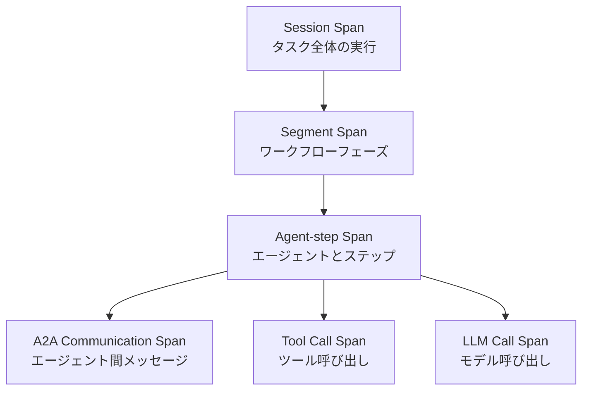

本記事は [arXiv:2608.24271](https://arxiv.org/abs/2608.24271) の解説記事です。

## 論文概要（Abstract）

LLMベースのマルチエージェントシステムは、検査・デバッグ・障害条件下での評価が困難であるという課題を抱えている。著者らは**llmmas-otel**を提示している。これは「OpenTelemetryベースの分散トレーシングと障害注入を組み合わせた、軽量かつフレームワーク非依存のツール」であり、ワークフローフェーズ・エージェントステップ・エージェント間通信・ツール呼び出し・LLM呼び出しにわたるトレース整合テレメトリを提供する。

この記事は [Zenn記事: LangSmith Python SDKだけでエージェントをトレース・デバッグする実践手法](https://zenn.dev/0h_n0/articles/9e5ddddee34336) の深掘りです。LangSmithが提供する単一エージェントのトレーシングに対し、本論文はマルチエージェントシステム全体の可観測性と障害テストのアプローチを提示しており、より大規模なシステムへのスケールアップを検討する際に有用である。

## 情報源

- **arXiv ID**: 2608.24271
- **URL**: [https://arxiv.org/abs/2608.24271](https://arxiv.org/abs/2608.24271)
- **著者**: Zahra Seyedghorban, Egor Klimov, Arie van Deursen, Annibale Panichella, Burcu Kulahcioglu Ozkan
- **発表年**: 2026
- **分野**: cs.SE（ソフトウェア工学）

## 背景と動機（Background & Motivation）

LLMベースのマルチエージェントシステム（例：ChatDev、MetaGPT、AutoGen）は、複数のLLMエージェントが協調してソフトウェア開発タスクを遂行する。しかし、これらのシステムには以下の課題がある：

1. **デバッグの困難さ**: 複数エージェント間のメッセージパッシングとLLM呼び出しが複雑に絡み合い、障害の根本原因特定が困難
2. **レジリエンス評価の不在**: 本番環境で発生しうるネットワーク遅延やAPIエラーに対する耐性を事前に評価する手段がない
3. **既存ツールの限界**: AEGIS/AgenTracerはデータセット構築と障害帰属に焦点を当て、TRAIL/Who&Whenは事後分析に特化しているが、いずれもライブ実行への制御された摂動は提供していない

著者らは、可観測性（何が起きているかの可視化）と障害注入（制御された障害の挿入）の統合が、マルチエージェントシステムの品質保証に不可欠であると主張している。

## 主要な貢献（Key Contributions）

- **貢献1**: ワークフローフェーズ・エージェントステップ・エージェント間通信・ツール呼び出し・LLM呼び出しにわたるトレース整合テレメトリの提供
- **貢献2**: 選択された相互作用ポイントでの障害注入のサポート
- **貢献3**: ベースラインと障害実行の整合トレースを通じた再現可能な比較の実現

## 技術的詳細（Technical Details）

### OpenTelemetry統合アーキテクチャ

llmmas-otelはOpenTelemetryを可観測性のバックボーンとして採用している。OpenTelemetryは「テレメトリデータの生成と収集の規約を定義するベンダー非依存のオープン標準」であり、既存のLLMマルチエージェントシステムを置き換えることなく、計装ポイントと注入ポイントを提供する。

システムの運用は以下の3ステップで行われる：
1. ワークフロー境界のマーキング
2. ベースライン実行によるトレースの取得
3. 障害ルールの有効化による再実行（オプション）

### スパン階層とセマンティックモデル

トレーシングモデルは、実行を複数レベルで捕捉する階層構造を確立している：



1. **Session Span**: 1つのタスク実行全体を表し、すべての子スパンをグルーピング
2. **Segment Span**: ワークフローフェーズを記録（位置情報付き）
3. **Agent-step Span**: 行動エージェントとステップインデックスを特定
4. **A2A Communication Span**: エージェント間メッセージ転送を記録
5. **Tool Call Span**: ツール呼び出しをキャプチャ
6. **LLM Call Span**: モデル呼び出しを記録

論文のTable Iでは各スパンの重要な属性が定義されている。例えば、A2A通信スパンでは`source_agent.id`、`target_agent.id`、`edge.id`、`message.id`、`channel`、`message.preview`、`message.sha256`が記録される。著者らによれば、「メッセージキャリアにおけるコンテキスト伝播」により「通信エッジが明示的に保持される」。

### 障害注入のタイプとメカニズム

論文のTable IIでは、境界ごとにサポートされる障害タイプが定義されている：

| 相互作用ポイント | サポートされる障害 |
|---|---|
| A2A送信/受信 | delay, drop, truncate |
| ツール呼び出し | delay, not_installed, timeout, malformed_response |
| LLM呼び出し | delay, rate_limit, timeout, network_error, malformed_response |

注入メカニズムは設定駆動型である。著者らは「コアワークフローロジックを変更する代わりに、ツールがLLM呼び出し、ツール呼び出し、A2A送信、A2A受信などの選択されたフックポイントで設定されたルールを評価する」と説明している。

これはLangSmithの`@traceable`デコレータが関数のラッピングで実装されているのと類似したパターンであるが、llmmas-otelはトレーシングに加えて障害注入ポイントも提供する点が異なる。

### トレース整合手法

設計上の重要な原則として、ベースラインと障害実行の間の構造的等価性を維持する。障害が注入された場合でも、「影響を受けた実行は同じ操作スパンタイプで表現される」。例えば、A2A遅延はA2A通信スパン上に追加の障害固有属性（`llmmas.fault.injected=true`、`llmmas.fault.type=a2a.delay`、`llmmas.fault.spec_id`）として記録される。

このアプローチにより、「ベースラインと障害実行が構造的に比較可能」な「サイドバイサイド分析」が可能になる。

### 増幅率（Amplification）の定義

著者らは障害の影響を定量化するために「増幅率」という指標を導入している：

$$
\text{Amplification} = \frac{\Delta t_{\text{end-to-end}} - \Delta t_{\text{injected}}}{\Delta t_{\text{injected}}}
$$

ここで、
- $\Delta t_{\text{end-to-end}}$: 障害による実行時間の増加
- $\Delta t_{\text{injected}}$: 注入された遅延量

増幅率が1.0であれば障害の影響は注入された遅延と等しく、1.0を超える場合は障害がカスケード的に影響を拡大していることを意味する。

## 実装のポイント（Implementation）

llmmas-otelの公開APIは「薄いデコレータとコンテキストマネージャ」で構成され、スパンファクトリが「スパンの作成、属性の付与、通信境界をまたぐ関連イベントのリンク」を担当する。

LangSmithの`wrap_openai`/`wrap_anthropic`ラッパーが個々のLLM呼び出しをトレースするのに対し、llmmas-otelはマルチエージェント間の通信フローも含めた包括的なトレースを提供する。LangSmithのトレースが「1つのエージェント内のネストされた呼び出し」を可視化するのに対し、llmmas-otelは「エージェント間のメッセージ伝播と障害の波及」を可視化する点が相補的である。

ツールはGitHubで公開されており、サンプルデモ、ChatDev計装、詳細な手順が含まれている。

## Production Deployment Guide

本論文のOpenTelemetryベース可観測性をAWS上でLLMエージェントシステムに適用する場合の構成を示す。

### AWS実装パターン（コスト最適化重視）

| 規模 | 月間トレース数 | 推奨構成 | 月額コスト概算 |
|------|-------------|---------|-------------|
| **Small** | ~10万スパン | Lambda + X-Ray | $30-80 |
| **Medium** | ~100万スパン | ECS + OpenTelemetry Collector + Jaeger | $200-500 |
| **Large** | 1000万+ スパン | EKS + OpenTelemetry Collector + Grafana Tempo | $800-2,000 |

**Small構成（~10万スパン/月）**:
- **AWS X-Ray**: OpenTelemetry SDKからX-Rayへのエクスポート（$5/100万トレース）
- **Lambda**: OpenTelemetry Layer追加（追加コスト: メモリ50MB増、実行時間10-20ms増）
- **CloudWatch Logs**: トレースデータの長期保存（$0.50/GB）
- **合計**: 月額$30-80程度

**Medium構成（~100万スパン/月）**:
- **ECS Fargate**: OpenTelemetry Collector（0.25 vCPU、0.5GB）× 2タスク（$30/月）
- **Jaeger**: ECS上で稼働、Elasticsearch/OpenSearchバックエンド（$150/月）
- **S3**: トレースアーカイブ（$5/月）
- **合計**: 月額$200-500程度

**コスト試算の注意事項**: 上記は2026年9月時点のAWS ap-northeast-1リージョン料金に基づく概算値です。スパン数やデータ量により変動するため、最新料金は[AWS料金計算ツール](https://calculator.aws/)で確認してください。

### Terraformインフラコード（Small構成）

```hcl
resource "aws_iam_role" "otel_lambda" {
  name = "otel-lambda-role"
  assume_role_policy = jsonencode({
    Version = "2012-10-17"
    Statement = [{
      Action = "sts:AssumeRole"
      Effect = "Allow"
      Principal = { Service = "lambda.amazonaws.com" }
    }]
  })
}

resource "aws_iam_role_policy" "xray_write" {
  role = aws_iam_role.otel_lambda.id
  policy = jsonencode({
    Version = "2012-10-17"
    Statement = [{
      Effect   = "Allow"
      Action   = ["xray:PutTraceSegments", "xray:PutTelemetryRecords"]
      Resource = "*"
    }]
  })
}

resource "aws_lambda_function" "agent_handler" {
  filename      = "agent.zip"
  function_name = "llm-agent-handler"
  role          = aws_iam_role.otel_lambda.arn
  handler       = "index.handler"
  runtime       = "python3.12"
  timeout       = 120
  memory_size   = 1024

  tracing_config { mode = "Active" }

  layers = [
    "arn:aws:lambda:ap-northeast-1:901920570463:layer:aws-otel-python-amd64-ver-1-25-0:1"
  ]

  environment {
    variables = {
      AWS_LAMBDA_EXEC_WRAPPER        = "/opt/otel-instrument"
      OTEL_SERVICE_NAME              = "llm-agent"
      OTEL_TRACES_EXPORTER           = "otlp"
      OTEL_EXPORTER_OTLP_ENDPOINT    = "http://localhost:4318"
    }
  }
}
```

## 実験結果（Results）

### 検証実験のセットアップ

著者らはProgramDevベンチマーク（30タスク）を使用し、各タスクを3つの条件で5回ずつ実行している：
- 障害なしベースライン
- 計画フェーズでの1000ms LLM遅延（1回）
- Planner→Coderハンドオフでの1000ms A2A遅延（1回）

### 実験結果

論文の実験結果から、増幅率に関する以下のデータが報告されている：

| 実験設定 | 対象システム | 平均増幅率 | 中央値増幅率 |
|---|---|---|---|
| LLM遅延 | デモワークフロー | 1.053 | 1.036 |
| A2A遅延 | デモワークフロー | 1.295 | 1.390 |
| LLM遅延 | ChatDev | 48.1 | 13.9 |
| A2A遅延 | ChatDev | 59.2 | 6.6 |

デモワークフローでは増幅率が1に近く、障害の影響が局所的であることを示している。一方、ChatDevでは増幅率が大幅に上昇しており、著者らは「局所的な摂動が多くの下流の相互作用とLLM呼び出しにカスケードする」ことを実証している。

ChatDevにおけるLLM遅延の平均増幅率48.1は、1秒の遅延注入が約48秒のエンドツーエンド遅延増加を引き起こすことを意味する。これは、多段フェーズシステムでは1つのLLM呼び出しの遅延が後続のすべてのフェーズに波及するためである。

### 既存ツールとの比較

著者らは以下の点でllmmas-otelを既存ツールと差別化している：

| ツール | 可観測性 | 障害注入 | ランタイム統合 |
|---|---|---|---|
| AEGIS/AgenTracer | データセット構築・障害帰属 | なし | なし |
| TRAIL/Who&When | 事後分析 | なし | なし |
| LumiMAS/AgentOps | ダッシュボード | なし | あり |
| LangSmith | 構造化トレース | なし | あり |
| **llmmas-otel** | **分散トレース** | **あり** | **あり** |

## 実運用への応用（Practical Applications）

**LangSmithとの相補性**: LangSmithは単一エージェント内のトレーシングに優れているが、マルチエージェント間の通信トレースや障害注入は提供していない。llmmas-otelのアプローチを参考に、マルチエージェントシステムのテスト戦略を設計できる。

**カオスエンジニアリングの適用**: 本論文の障害注入手法は、マイクロサービスのカオスエンジニアリング（Netflix Chaos Monkey等）をLLMエージェントシステムに適用したものと位置付けられる。LLM呼び出しのrate_limit障害やA2Aメッセージのdrop障害を本番に近い環境で注入することで、システムのレジリエンスを事前に評価できる。

**増幅率によるアーキテクチャ評価**: ChatDevの増幅率48.1（LLM遅延）は、アーキテクチャの脆弱性を示す重要な指標である。増幅率が高いシステムは、1つの障害が全体に波及しやすく、障害耐性の改善が必要であることを示唆する。

### 現在の制約

著者ら自身が認めているように、llmmas-otelは「ペアラン差分分析、トレース要約、根本原因ランキング、自動デバッグレポートなどの高レベル分析機能」を現時点では提供していない。ユーザーは生成されたトレースとラン成果物を直接検査する必要がある。

## 関連研究（Related Work）

- **AgentTrace (arXiv:2602.10133)**: 運用・認知・コンテキストの3面で構造化テレメトリを収集するフレームワーク。可観測性に特化しているが障害注入は含まない
- **AgentDebugX (arXiv:2607.18754)**: Detect-Attribute-Recover-Rerunの閉ループデバッグツールキット。事後的なデバッグに焦点を当てており、ランタイムの障害注入とは異なるアプローチ
- **LangSmith**: 商用のエージェント可観測性プラットフォーム。`@traceable`と`wrap_openai`による自動計装を提供するが、障害注入やマルチエージェント通信トレースは対象外

## まとめと今後の展望

llmmas-otelは、OpenTelemetryベースの分散トレーシングと障害注入を統合することで、LLMマルチエージェントシステムの可観測性とレジリエンス評価を実現している。ChatDevでの増幅率48.1という結果は、マルチエージェントシステムにおける障害のカスケード効果を実証しており、単一エージェントのトレーシング（LangSmith等）だけでは捕捉できない問題の存在を示唆している。

今後の展開としては、ペアラン差分分析や自動根本原因ランキングなどの高レベル分析機能の追加、およびLangSmithなどの既存可観測性プラットフォームとの統合が期待される。

## 参考文献

- **arXiv**: [https://arxiv.org/abs/2608.24271](https://arxiv.org/abs/2608.24271)
- **Related Zenn article**: [https://zenn.dev/0h_n0/articles/9e5ddddee34336](https://zenn.dev/0h_n0/articles/9e5ddddee34336)

---

:::message
この記事はAI（Claude Code）により自動生成されました。内容の正確性については原論文と照合して検証していますが、詳細は原論文をご確認ください。
:::
