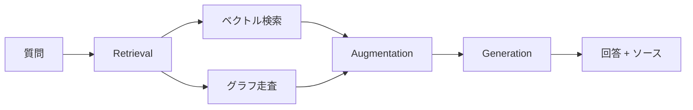
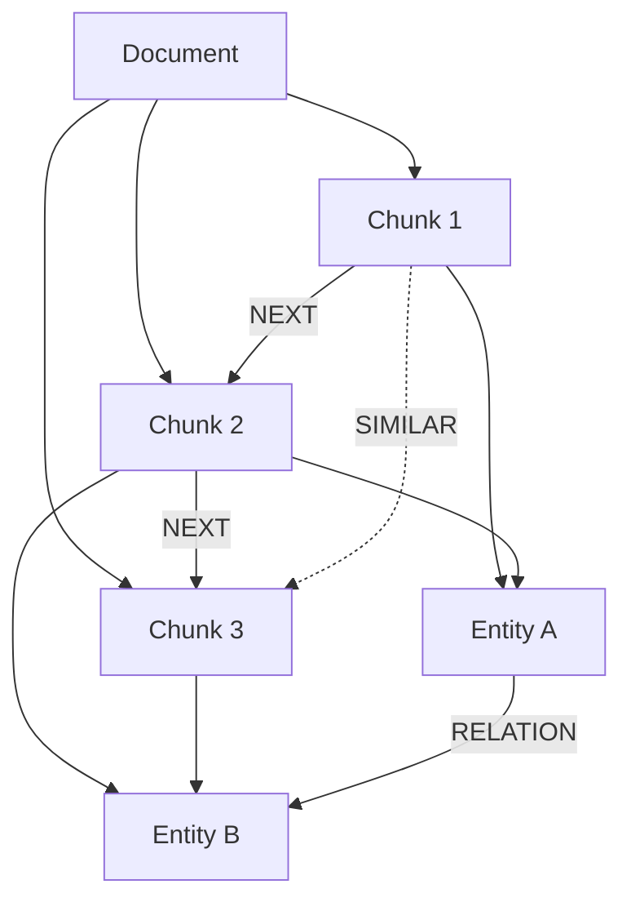

## ブログ概要（Summary）

本記事は [How to improve multi-hop reasoning with knowledge graphs and LLMs](https://neo4j.com/blog/genai/knowledge-graph-llm-multi-hop-reasoning/) の解説記事です。

Neo4jのTomaž Bratanič氏は、従来のRAGアプリケーションがベクトル類似度検索に依存するため、複数の文書やエンティティにまたがるマルチホップ質問で精度が低下する問題を指摘している。ブログでは、ナレッジグラフを用いて非構造化データを構造化し、ベクトル検索とグラフ走査を組み合わせたハイブリッド検索によってマルチホップ推論の精度を改善する手法を解説している。Neo4j LLM Knowledge Graph Builderによる8ステップの自動グラフ構築パイプライン、凝縮ストレージ戦略、チェーン・オブ・ソートワークフローが主要な技術要素として紹介されている。

この記事は [Zenn記事: LangGraph×Neo4jで適応的Graph-RAGを構築し製造業FAQを高速化する](https://zenn.dev/0h_n0/articles/b4901738ae781e) の深掘りです。

## 情報源

- **種別**: 企業テックブログ
- **URL**: [https://neo4j.com/blog/genai/knowledge-graph-llm-multi-hop-reasoning/](https://neo4j.com/blog/genai/knowledge-graph-llm-multi-hop-reasoning/)
- **組織**: Neo4j（Graph ML and GenAI Research）
- **著者**: Tomaž Bratanič
- **発表日**: 2025年6月18日

## 技術的背景（Technical Background）

### マルチホップ推論の課題

マルチホップ推論とは、単一の情報源では回答できず、複数の事実を連鎖的にたどる必要がある質問応答を指す。例えば「Prosper Roboticsの創業者に関する最新ニュースは何か」という質問に答えるには、まず創業者が誰かを特定し、次にその人物の最新ニュースを検索するという2段階の推論が必要になる。

Bratanič氏は、従来のRAGパイプラインが以下の理由でマルチホップ質問に苦戦すると述べている。

- **冗長な検索**: Top-Nで取得した文書チャンクが重複情報を含み、関連する異なるコンテキストを取りこぼす
- **参照情報の欠落**: 個別のチャンクには完全なエンティティ参照や文脈が含まれない
- **最適なK値の不確定性**: 何件の文書を取得すべきかは質問の性質に依存し、汎用的な設定が困難

ブログの表現を借りれば、「単にドキュメントをチャンクしてデータベースに埋め込むだけでは、マルチホップ質問には対応できない」のである。

### ベクトル検索の本質的限界

ベクトル類似度検索は、クエリと意味的に近い文書を取得する点では有効だが、事実間の接続関係を認識する能力を持たない。ベクトル空間での近傍探索は以下の式で表される。

$$
\text{TopK}(q) = \underset{d_i \in \mathcal{D}}{\operatorname{arg\,top\text{-}k}} \; \text{sim}(\mathbf{e}_q, \mathbf{e}_{d_i})
$$

ここで、
- $\mathbf{e}_q$: クエリの埋め込みベクトル
- $\mathbf{e}_{d_i}$: 文書チャンク$d_i$の埋め込みベクトル
- $\text{sim}(\cdot, \cdot)$: コサイン類似度等の類似度関数

この方式では、「事実がどのように接続されているかの認識が欠如している」（Bratanič氏）ため、複数のエンティティを経由する推論パスを構成できない。

## 実装アーキテクチャ（Architecture）

### GraphRAGの3段階アーキテクチャ

ブログでは、GraphRAGを以下の3段階で構成するアーキテクチャが説明されている。

1. **Retrieval（検索）**: ベクトル検索、全文検索、空間検索、またはハイブリッド検索で初期コンテンツを取得し、グラフ走査で関連コンテキストを追加取得
2. **Augmentation（拡張）**: 検索結果をクエリおよびタスク指示と組み合わせてプロンプトを構築
3. **Generation（生成）**: LLMがグラウンドされた応答を生成。ソースの追跡可能性を確保



### Neo4j LLM Knowledge Graph Builder: 8ステップパイプライン

ブログの中心的な技術要素は、非構造化データからナレッジグラフを自動構築するNeo4j LLM Knowledge Graph Builderである。Bratanič氏は以下の8ステップで処理パイプラインを説明している。

**Step 1: ドキュメント格納** — アップロードされたソース（PDF、HTML、トランスクリプト、URL、クラウドバケット等）がDocumentノードとしてグラフに格納される。マルチモーダル対応が特徴である。

**Step 2: ドキュメント処理** — LangChainローダーが各ドキュメントタイプに応じた処理を実行する。

**Step 3: チャンキング** — コンテンツがChunkノードに分割される。

**Step 4: グラフ接続** — ChunkノードがDocumentノードおよび前後のChunkノードと接続され、文書構造が保持される。

**Step 5: k-NN類似接続** — Graph Data Scienceライブラリのk-NNアルゴリズムにより、意味的に類似したChunk間にSIMILAR関係（weight属性付き）が生成される。

**Step 6: 埋め込み生成** — Chunkの埋め込みベクトルが計算され、ベクトルインデックスに格納される。

**Step 7: エンティティ・関係抽出** — LLMまたは専用のTransformerモデル（Diffbot等）がテキストからエンティティと関係を抽出する。ユーザーはプリセットスキーマの使用、既存Neo4jスキーマの再利用、LLMによる動的推論のいずれかを選択できる。

**Step 8: グラフ格納** — 抽出されたエンティティと関係がグラフに格納され、元のChunkノードと接続される。



この設計の核心は、Bratanič氏が強調するように「各ドキュメントは個別に処理されるが、ナレッジグラフ表現がデータを接続する」点にある。つまり、異なる文書に登場する同一エンティティがグラフ上で自動的にリンクされ、Ingestion時点で文書横断的な知識構造が形成される。

### ハイブリッド検索の仕組み

Neo4jのハイブリッド検索は、ベクトル検索とグラフ走査を統合する。Bratanič氏は、Neo4jの「グラフとベクトル検索のネイティブ統合」が、単一のクエリで「グラフを走査して関係を辿り、メタデータを取得し、フィルタを適用し、結果を集約する」ことを可能にすると述べている。

具体的には、ベクトル検索で初期の類似チャンクを取得した後、そのチャンクに接続されたエンティティノードからグラフ走査を開始し、関連するエンティティ・関係・チャンクを追加取得する。これにより、意味的類似性だけでなく構造的な接続関係に基づくコンテキスト拡張が実現される。

### チェーン・オブ・ソートワークフロー

マルチホップ質問に対して、LLMエージェントが質問を複数のサブ質問に分解するチェーン・オブ・ソートワークフローが紹介されている。

例として「Prosper Roboticsの創業者に関する最新ニュースは何か」という質問は以下のように分解される。

1. **サブ質問1**: 「Prosper Roboticsの創業者は誰か？」 → ナレッジグラフクエリで回答
2. **サブ質問2**: 「[創業者名]の最新ニュースは？」 → ベクトル検索/APIで回答

Bratanič氏によれば、エージェントは「どのツールを使用するかを判断できる」とされ、ナレッジグラフ、ベクトルデータベース、外部APIを状況に応じて使い分ける。また、「どのソロファウンダーの企業が最高の評価額か」のような分析的クエリは「ベクトル類似度検索だけでは回答が困難」であり、構造化されたグラフクエリ（Text2Cypher）の活用が有効であると述べている。

ただし、ブログではこのアプローチの制約として「複数のLLMコールによる応答レイテンシの高さ」が明示的に指摘されている。

## Production Deployment Guide

### AWS実装パターン（コスト最適化重視）

GraphRAGシステムをAWSにデプロイする場合、トラフィック量に応じて以下の3構成を推奨する。Neo4j AuraDB（マネージドサービス）の利用を前提とし、グラフDB運用の負担を軽減する。

**Small構成（~100 req/日）: Serverless**

| サービス | 構成 | 月額概算 |
|---------|------|---------|
| Lambda | 512MB, 30秒タイムアウト | $5-15 |
| Amazon Bedrock (Claude Sonnet) | ~3,000 calls/月 | $30-60 |
| Neo4j AuraDB Free/Pro | 200K nodes | $0-65 |
| S3 (ドキュメント保存) | 10GB | $1 |
| CloudWatch | 基本監視 | $3-5 |
| **合計** | | **$40-150/月** |

**Medium構成（~1,000 req/日）: ECS Fargate + Neo4j AuraDB Pro**

| サービス | 構成 | 月額概算 |
|---------|------|---------|
| ECS Fargate | 1vCPU/2GB x 2タスク | $60-120 |
| ALB | 1台 | $20 |
| Amazon Bedrock | ~30,000 calls/月 | $300-500 |
| Neo4j AuraDB Professional | 1M nodes | $150-300 |
| ElastiCache (Redis) | cache.t3.micro | $15 |
| CloudWatch + X-Ray | 詳細監視 | $20-30 |
| **合計** | | **$565-970/月** |

**Large構成（10,000+ req/日）: EKS + Spot + Neo4j Enterprise**

| サービス | 構成 | 月額概算 |
|---------|------|---------|
| EKS | コントロールプレーン | $73 |
| EC2 Spot (m6i.xlarge) | 3-6ノード (Karpenter管理) | $200-400 |
| Amazon Bedrock | ~300,000 calls/月 | $2,000-3,500 |
| Neo4j AuraDB Enterprise | 10M+ nodes, 高可用性 | $500-1,500 |
| ElastiCache (Redis Cluster) | 3ノード | $150 |
| CloudWatch + X-Ray + Budgets | フル監視 | $50-80 |
| **合計** | | **$2,973-5,703/月** |

**コスト削減テクニック**:
- **Spot Instances**: EKSワーカーノードをSpot優先にすることで最大90%削減
- **Reserved Instances**: Neo4j AuraDB Enterpriseの1年契約で最大30%削減
- **Bedrock Batch API**: 非リアルタイムのグラフ構築処理に使用し50%削減
- **Prompt Caching**: システムプロンプト+スキーマ定義のキャッシュで30-90%削減

> **注意**: 上記は2026年9月時点のAWS ap-northeast-1（東京）リージョン料金に基づく概算値です。実際のコストはトラフィックパターン、Neo4j AuraDBのプラン選択、Bedrockのモデル・トークン使用量により変動します。最新料金は[AWS料金計算ツール](https://calculator.aws/)で確認してください。

### Terraformインフラコード

**Small構成（Serverless: Lambda + Bedrock + Neo4j AuraDB）**

```hcl
# --- Small構成: GraphRAG Serverless ---
# Neo4j AuraDBはマネージドサービスのためTerraform外で管理

terraform {
  required_version = ">= 1.9"
  required_providers {
    aws = {
      source  = "hashicorp/aws"
      version = "~> 5.70"
    }
  }
}

provider "aws" {
  region = "ap-northeast-1"
}

# --- IAMロール（最小権限） ---
resource "aws_iam_role" "graphrag_lambda" {
  name = "graphrag-lambda-role"
  assume_role_policy = jsonencode({
    Version = "2012-10-17"
    Statement = [{
      Action = "sts:AssumeRole"
      Effect = "Allow"
      Principal = { Service = "lambda.amazonaws.com" }
    }]
  })
}

resource "aws_iam_role_policy" "graphrag_lambda_policy" {
  name = "graphrag-lambda-policy"
  role = aws_iam_role.graphrag_lambda.id
  policy = jsonencode({
    Version = "2012-10-17"
    Statement = [
      {
        Effect   = "Allow"
        Action   = ["bedrock:InvokeModel", "bedrock:InvokeModelWithResponseStream"]
        Resource = "arn:aws:bedrock:ap-northeast-1::foundation-model/anthropic.claude-*"
      },
      {
        Effect   = "Allow"
        Action   = ["logs:CreateLogGroup", "logs:CreateLogStream", "logs:PutLogEvents"]
        Resource = "arn:aws:logs:ap-northeast-1:*:*"
      },
      {
        Effect   = "Allow"
        Action   = ["secretsmanager:GetSecretValue"]
        Resource = aws_secretsmanager_secret.neo4j_credentials.arn
      },
      {
        Effect   = "Allow"
        Action   = ["s3:GetObject", "s3:PutObject"]
        Resource = "${aws_s3_bucket.documents.arn}/*"
      }
    ]
  })
}

# --- Secrets Manager（Neo4j AuraDB接続情報） ---
resource "aws_secretsmanager_secret" "neo4j_credentials" {
  name                    = "graphrag/neo4j-auradb"
  recovery_window_in_days = 7
}

# --- S3バケット（ドキュメント保存、KMS暗号化） ---
resource "aws_s3_bucket" "documents" {
  bucket = "graphrag-documents-${data.aws_caller_identity.current.account_id}"
}

resource "aws_s3_bucket_server_side_encryption_configuration" "documents" {
  bucket = aws_s3_bucket.documents.id
  rule {
    apply_server_side_encryption_by_default {
      sse_algorithm = "aws:kms"
    }
  }
}

resource "aws_s3_bucket_public_access_block" "documents" {
  bucket                  = aws_s3_bucket.documents.id
  block_public_acls       = true
  block_public_policy     = true
  ignore_public_acls      = true
  restrict_public_buckets = true
}

# --- Lambda関数 ---
resource "aws_lambda_function" "graphrag_query" {
  function_name = "graphrag-query"
  role          = aws_iam_role.graphrag_lambda.arn
  handler       = "handler.lambda_handler"
  runtime       = "python3.12"
  timeout       = 30
  memory_size   = 512
  filename      = "lambda.zip"

  environment {
    variables = {
      NEO4J_SECRET_ARN = aws_secretsmanager_secret.neo4j_credentials.arn
      BEDROCK_MODEL_ID = "anthropic.claude-sonnet-4-20250514"
      ENVIRONMENT      = "production"
    }
  }

  tracing_config {
    mode = "Active"  # X-Ray有効化
  }
}

# --- CloudWatchアラーム（コスト監視） ---
resource "aws_cloudwatch_metric_alarm" "lambda_duration" {
  alarm_name          = "graphrag-lambda-high-duration"
  comparison_operator = "GreaterThanThreshold"
  evaluation_periods  = 3
  metric_name         = "Duration"
  namespace           = "AWS/Lambda"
  period              = 300
  statistic           = "Average"
  threshold           = 25000  # 25秒
  alarm_actions       = [aws_sns_topic.alerts.arn]
  dimensions = {
    FunctionName = aws_lambda_function.graphrag_query.function_name
  }
}

resource "aws_sns_topic" "alerts" {
  name = "graphrag-alerts"
}

data "aws_caller_identity" "current" {}
```

**Large構成（Container: EKS + Karpenter + Spot Instances）**

```hcl
# --- Large構成: GraphRAG EKS + Spot ---

module "eks" {
  source  = "terraform-aws-modules/eks/aws"
  version = "~> 20.24"

  cluster_name    = "graphrag-cluster"
  cluster_version = "1.31"

  vpc_id     = module.vpc.vpc_id
  subnet_ids = module.vpc.private_subnets

  cluster_endpoint_public_access = false  # プライベートアクセスのみ

  # Karpenter用IAMロール
  enable_cluster_creator_admin_permissions = true
}

module "vpc" {
  source  = "terraform-aws-modules/vpc/aws"
  version = "~> 5.13"

  name = "graphrag-vpc"
  cidr = "10.0.0.0/16"

  azs             = ["ap-northeast-1a", "ap-northeast-1c", "ap-northeast-1d"]
  private_subnets = ["10.0.1.0/24", "10.0.2.0/24", "10.0.3.0/24"]
  public_subnets  = ["10.0.101.0/24", "10.0.102.0/24", "10.0.103.0/24"]

  enable_nat_gateway = true
  single_nat_gateway = true  # コスト削減: NAT Gateway 1台
}

# --- Karpenter Provisioner（Spot優先） ---
resource "kubectl_manifest" "karpenter_node_pool" {
  yaml_body = yamlencode({
    apiVersion = "karpenter.sh/v1"
    kind       = "NodePool"
    metadata   = { name = "graphrag-spot" }
    spec = {
      template = {
        spec = {
          requirements = [
            { key = "karpenter.sh/capacity-type", operator = "In", values = ["spot", "on-demand"] },
            { key = "node.kubernetes.io/instance-type", operator = "In",
              values = ["m6i.xlarge", "m6a.xlarge", "m5.xlarge", "m7i.xlarge"] },
          ]
          nodeClassRef = { group = "karpenter.k8s.aws", kind = "EC2NodeClass", name = "default" }
        }
      }
      limits   = { cpu = "32", memory = "128Gi" }
      disruption = {
        consolidationPolicy = "WhenEmptyOrUnderutilized"
        consolidateAfter    = "60s"
      }
    }
  })
}

# --- Secrets Manager ---
resource "aws_secretsmanager_secret" "neo4j_enterprise" {
  name                    = "graphrag/neo4j-enterprise"
  recovery_window_in_days = 7
}

# --- AWS Budgets（予算アラート） ---
resource "aws_budgets_budget" "graphrag_monthly" {
  name         = "graphrag-monthly-budget"
  budget_type  = "COST"
  limit_amount = "5000"
  limit_unit   = "USD"
  time_unit    = "MONTHLY"

  notification {
    comparison_operator       = "GREATER_THAN"
    threshold                 = 80
    threshold_type            = "PERCENTAGE"
    notification_type         = "ACTUAL"
    subscriber_email_addresses = ["ops-team@example.com"]
  }

  notification {
    comparison_operator       = "GREATER_THAN"
    threshold                 = 100
    threshold_type            = "PERCENTAGE"
    notification_type         = "FORECASTED"
    subscriber_email_addresses = ["ops-team@example.com"]
  }
}
```

### セキュリティベストプラクティス

- **IAMロール**: 最小権限の原則。Bedrock, S3, Secrets Managerのみ許可
- **ネットワーク**: EKSエンドポイントはプライベートアクセスのみ。Neo4j AuraDBはIP許可リストで制限
- **シークレット管理**: Neo4j接続情報はSecrets Managerで管理。環境変数にクレデンシャルを直接記載しない
- **暗号化**: S3はKMS暗号化、EBSもKMS暗号化をデフォルト有効化
- **監査**: CloudTrailでAPI操作を記録、AWS Configでリソースコンプライアンスを監視

### 運用・監視設定

**CloudWatch Logs Insights クエリ（コスト異常検知）**

```
fields @timestamp, @message
| filter @message like /bedrock/
| stats count() as invocation_count,
        sum(input_tokens) as total_input_tokens,
        sum(output_tokens) as total_output_tokens
  by bin(1h)
| sort @timestamp desc
```

**CloudWatch アラーム設定（Python）**

```python
import boto3

cloudwatch = boto3.client("cloudwatch", region_name="ap-northeast-1")

def create_graphrag_alarms() -> None:
    """GraphRAGシステム用のCloudWatchアラームを作成する。

    Bedrockトークン使用量とLambda実行時間の異常を検知する。
    """
    # Bedrockトークン使用量スパイク検知
    cloudwatch.put_metric_alarm(
        AlarmName="graphrag-bedrock-token-spike",
        MetricName="InputTokenCount",
        Namespace="AWS/Bedrock",
        Statistic="Sum",
        Period=3600,
        EvaluationPeriods=2,
        Threshold=500000,
        ComparisonOperator="GreaterThanThreshold",
        AlarmActions=["arn:aws:sns:ap-northeast-1:ACCOUNT:graphrag-alerts"],
        Dimensions=[
            {"Name": "ModelId", "Value": "anthropic.claude-sonnet-4-20250514"}
        ],
    )

    # Lambda実行時間異常検知
    cloudwatch.put_metric_alarm(
        AlarmName="graphrag-lambda-p99-latency",
        MetricName="Duration",
        Namespace="AWS/Lambda",
        ExtendedStatistic="p99",
        Period=300,
        EvaluationPeriods=3,
        Threshold=28000,
        ComparisonOperator="GreaterThanThreshold",
        AlarmActions=["arn:aws:sns:ap-northeast-1:ACCOUNT:graphrag-alerts"],
        Dimensions=[
            {"Name": "FunctionName", "Value": "graphrag-query"}
        ],
    )
```

**X-Ray トレーシング設定（Python）**

```python
from aws_xray_sdk.core import xray_recorder, patch_all
from aws_xray_sdk.core.models.subsegment import Subsegment

# boto3自動計装
patch_all()

def trace_graphrag_query(query: str, neo4j_driver) -> dict:
    """GraphRAGクエリをX-Rayでトレースする。

    Args:
        query: ユーザーのクエリ文字列
        neo4j_driver: Neo4jドライバーインスタンス

    Returns:
        検索結果とトレース情報を含む辞書
    """
    segment = xray_recorder.begin_subsegment("graphrag-pipeline")
    segment.put_annotation("query_type", "multi_hop")
    segment.put_metadata("query", query, "graphrag")

    # ベクトル検索フェーズ
    with xray_recorder.capture("vector_search") as subseg:
        vector_results = vector_search(query)
        subseg.put_metadata("result_count", len(vector_results))

    # グラフ走査フェーズ
    with xray_recorder.capture("graph_traversal") as subseg:
        graph_results = graph_traversal(neo4j_driver, vector_results)
        subseg.put_metadata("traversal_depth", graph_results.get("depth", 0))

    xray_recorder.end_subsegment()
    return {"vector": vector_results, "graph": graph_results}
```

**Cost Explorer自動レポート（Python）**

```python
import boto3
from datetime import datetime, timedelta

ce = boto3.client("ce", region_name="ap-northeast-1")
sns = boto3.client("sns", region_name="ap-northeast-1")

DAILY_COST_THRESHOLD = 100.0
SNS_TOPIC_ARN = "arn:aws:sns:ap-northeast-1:ACCOUNT:graphrag-cost-alerts"

def daily_cost_report() -> dict:
    """日次コストレポートを取得し、閾値超過時にSNS通知を送信する。

    Returns:
        サービス別コストの辞書
    """
    today = datetime.utcnow().strftime("%Y-%m-%d")
    yesterday = (datetime.utcnow() - timedelta(days=1)).strftime("%Y-%m-%d")

    response = ce.get_cost_and_usage(
        TimePeriod={"Start": yesterday, "End": today},
        Granularity="DAILY",
        Metrics=["UnblendedCost"],
        GroupBy=[{"Type": "DIMENSION", "Key": "SERVICE"}],
        Filter={
            "Tags": {
                "Key": "Project",
                "Values": ["graphrag"],
            }
        },
    )

    costs: dict[str, float] = {}
    total = 0.0
    for group in response["ResultsByTime"][0]["Groups"]:
        service = group["Keys"][0]
        amount = float(group["Metrics"]["UnblendedCost"]["Amount"])
        if amount > 0.01:
            costs[service] = amount
            total += amount

    if total > DAILY_COST_THRESHOLD:
        sns.publish(
            TopicArn=SNS_TOPIC_ARN,
            Subject=f"GraphRAG Cost Alert: ${total:.2f}/day",
            Message=f"Daily cost exceeded ${DAILY_COST_THRESHOLD}.\n\n"
                    + "\n".join(f"  {s}: ${c:.2f}" for s, c in costs.items()),
        )

    return costs
```

### コスト最適化チェックリスト

**アーキテクチャ選択**
- [ ] トラフィック100 req/日以下 → Serverless（Lambda + Bedrock）
- [ ] トラフィック100-5,000 req/日 → Hybrid（ECS Fargate + Neo4j AuraDB Pro）
- [ ] トラフィック5,000+ req/日 → Container（EKS + Karpenter + Neo4j Enterprise）

**リソース最適化**
- [ ] EC2/EKSワーカーはSpot Instances優先（最大90%削減）
- [ ] 安定ワークロードはReserved Instances 1年コミット（最大72%削減）
- [ ] Compute Savings Plansの適用を検討
- [ ] Lambda: メモリサイズをPower Tuningで最適化（128MB刻みで検証）
- [ ] ECS/EKS: Karpenterで未使用ノードを60秒で統合・削除
- [ ] NAT Gateway: Single NAT構成（マルチAZは本番のみ）

**LLMコスト削減**
- [ ] グラフ構築（バッチ処理）にBedrock Batch APIを使用（50%削減）
- [ ] システムプロンプト + スキーマ定義にPrompt Cachingを有効化（30-90%削減）
- [ ] 簡易クエリにはHaiku、複雑なクエリにはSonnetを使い分けるモデル選択ロジック
- [ ] エンティティ抽出プロンプトのトークン数を最適化（max_tokens制限）
- [ ] チェーン・オブ・ソートのサブ質問数に上限を設定（LLMコール数制御）

**監視・アラート**
- [ ] AWS Budgetsで月額予算アラートを設定（80%/100%閾値）
- [ ] CloudWatchアラームでBedrockトークン使用量スパイクを検知
- [ ] Cost Anomaly Detectionを有効化（自動異常検知）
- [ ] 日次コストレポートをSNSで配信
- [ ] X-Rayでベクトル検索・グラフ走査の各フェーズをトレーシング

**リソース管理**
- [ ] 未使用のNeo4jインデックス・制約を定期的に棚卸し
- [ ] Projectタグを全リソースに付与（コスト配賦の粒度確保）
- [ ] S3ドキュメントのライフサイクルポリシー設定（90日でGlacier移行）
- [ ] 開発環境のNeo4j AuraDB/EKSは夜間・週末に停止
- [ ] CloudWatch Logsの保持期間を設定（本番30日、開発7日）

## パフォーマンス最適化（Performance）

### 凝縮ストレージの利点

Bratanič氏は、ナレッジグラフによる「凝縮ストレージ」戦略の利点を強調している。従来のRAGではドキュメント全体を埋め込みとして保持するが、GraphRAGでは「構造化された事実、例えば誰が会社を創業したか、どの製品がイベントに関連するかといった情報を抽出する」ことで、「検索やプロンプトに渡す必要があるデータ量を劇的に削減しつつ、重要な意味を保持する」と述べている。

この凝縮は2つのレベルで機能する。

1. **検索時**: ベクトル検索の対象がチャンク全体ではなくエンティティ・関係に絞られ、検索空間が縮小する
2. **プロンプト構築時**: LLMに渡すコンテキストが構造化された事実のみとなり、トークン消費が抑制される

### ベクトル検索 vs グラフ走査のトレードオフ

ブログでは具体的なレイテンシ数値は提示されていないが、両手法の特性について以下の示唆がある。

- **ベクトル検索**: 近似最近傍探索（ANN）により$O(\log n)$程度の検索時間。意味的類似度に基づく検索に適する
- **グラフ走査**: 関係を辿る深さ$d$とファンアウト$f$に対して$O(f^d)$の計算量。構造的な接続関係の探索に適する

ハイブリッド検索では、ベクトル検索で初期候補を絞り込んだ後にグラフ走査で関連コンテキストを拡張するため、全ノードに対するグラフ走査と比較して探索空間が大幅に削減される。ただし、グラフの密度（エンティティ間の接続数）が高い場合、走査コストが増大する点には注意が必要である。

## 運用での学び（Production Lessons）

### ナレッジグラフ構築の精度向上

ブログでは、LLM Knowledge Graph Builderがスキーマ設定に関して3つのモードを提供することが述べられている。

1. **プリセットスキーマ**: ドメイン固有のエンティティ・関係タイプを事前定義。精度が高いが柔軟性に欠ける
2. **既存スキーマの再利用**: Neo4jデータベースに既に存在するスキーマを活用。段階的な拡張に適する
3. **LLMによる動的推論**: スキーマを指定せず、LLMがテキストから自動的にエンティティ・関係を推論。柔軟だが一貫性に課題がある

運用上、動的推論モードでは同一エンティティが異なる名称で抽出される可能性があり（例: 「Neo4j」「neo4j, Inc.」「Neo4j社」）、エンティティ解決（Entity Resolution）が必要となる。ブログでは明示的なベンチマークは示されていないが、スキーマの事前設定がグラフ品質に大きく影響することが示唆されている。

### エンティティ解決の課題

マルチドキュメント環境では、異なる文書で同一エンティティが異なる表記で出現することは避けられない。ナレッジグラフの品質は、このエンティティ解決の精度に直結する。ブログではk-NNアルゴリズムによるChunk間の類似接続が紹介されているが、エンティティレベルの解決（名寄せ）に関する詳細な手法や精度評価は記載されていない。

実運用では以下の対策が考えられる。

- エンティティ抽出時にスキーマを厳密に定義し、正規化ルールを適用する
- 抽出後にグラフ上で類似エンティティをマージする後処理パイプラインを構築する
- Diffbot等の専用エンティティ抽出サービスを併用し、LLMのみに依存しない

## 学術研究との関連（Academic Connection）

GraphRAGの概念は、Microsoftが2024年に発表した「From Local to Global: A Graph RAG Approach to Query-Focused Summarization」（Edge et al., 2024）で体系化された。Microsoft GraphRAGがコミュニティ検出とサマリー階層に重点を置くのに対し、Neo4jのアプローチはエンティティ・関係の直接的な抽出とハイブリッド検索の統合に焦点を当てている。

また、ブログで紹介されているText2Cypher（自然言語からCypherクエリへの変換）は、Text-to-SQL研究（Zhong et al., 2017; Yu et al., 2018等）のグラフデータベース版と位置づけられる。LangChainへのllm-graph-transformerモジュールの貢献は、Neo4jがオープンソースコミュニティと学術研究の橋渡しを行っている点を示している。

## まとめと実践への示唆

Bratanič氏のブログは、ベクトル検索のみに依存するRAGの限界を明確にし、ナレッジグラフとの組み合わせによるマルチホップ推論の改善手法を体系的に整理している。LLM Knowledge Graph Builderの8ステップパイプラインは、非構造化データからの自動グラフ構築を実現し、ハイブリッド検索とチェーン・オブ・ソートワークフローがマルチホップ質問への対応力を向上させる。

一方で、ブログには具体的なベンチマーク数値や定量的な精度比較が含まれていない点は留意が必要である。また、チェーン・オブ・ソートによるレイテンシ増加、エンティティ解決の精度課題、グラフ構築コストなど、実運用で直面する制約も考慮すべきである。

関連するZenn記事で紹介されているLangGraph×Neo4jの適応的Graph-RAGアーキテクチャは、本ブログで述べられている概念を具体的な実装に落とし込む上での実践的な参考となる。

## 参考文献

- **Blog URL**: [How to improve multi-hop reasoning with knowledge graphs and LLMs](https://neo4j.com/blog/genai/knowledge-graph-llm-multi-hop-reasoning/)
- **Neo4j LLM Knowledge Graph Builder**: [https://neo4j.com/labs/genai-ecosystem/llm-graph-builder/](https://neo4j.com/labs/genai-ecosystem/llm-graph-builder/)
- **Microsoft GraphRAG**: Edge et al., "From Local to Global: A Graph RAG Approach to Query-Focused Summarization", arXiv:2404.16130, 2024
- **LangChain llm-graph-transformer**: [https://github.com/langchain-ai/langchain/tree/master/libs/community](https://github.com/langchain-ai/langchain/tree/master/libs/community)
- **Related Zenn article**: [LangGraph×Neo4jで適応的Graph-RAGを構築し製造業FAQを高速化する](https://zenn.dev/0h_n0/articles/b4901738ae781e)
