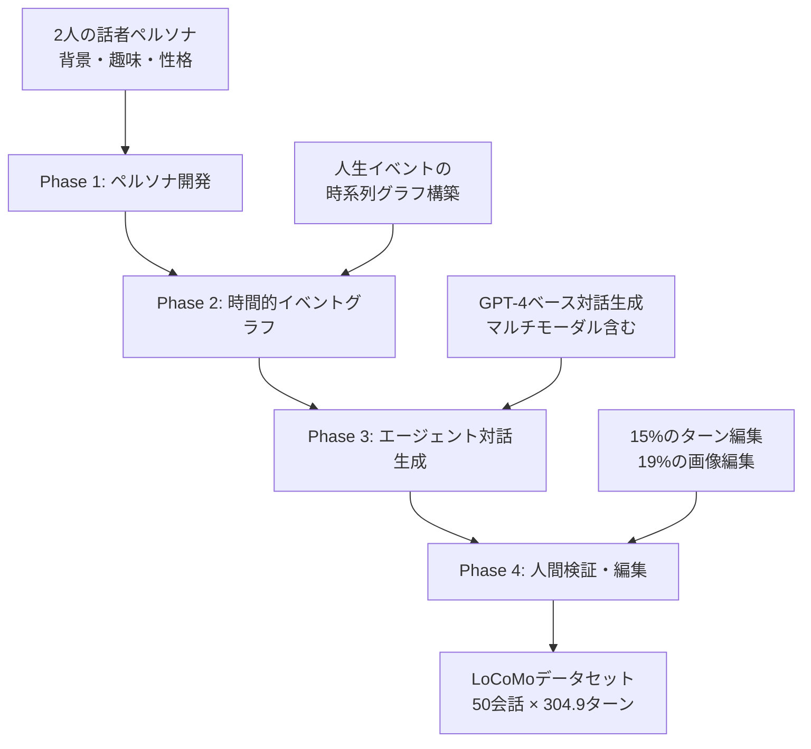

本記事は [arXiv: 2402.17753](https://arxiv.org/abs/2402.17753) の解説記事です。

## 論文概要（Abstract）

LLMエージェントが長期会話の記憶をどの程度保持できるかを評価するためのベンチマーク**LoCoMo**（Long-term Conversational Memory）を著者らは提案している。データセットは平均300ターン、9,000トークン超、最大35セッションにわたる超長期会話50件で構成される。質問応答、イベント要約、マルチモーダル対話生成の3タスクを通じて、LLMの長期記憶能力を体系的に評価する。著者らの報告によると、最良のモデルでも人間のパフォーマンスに対して46%の差があり、特に時間推論と敵対的質問で顕著な性能低下が確認されている。

この記事は [Zenn記事: Mem0×pgvectorでCSエージェントに長期記憶を実装しFCRを改善する](https://zenn.dev/0h_n0/articles/16618ab45991ae) の深掘りです。Mem0のような長期記憶システムの性能をどのように評価すべきかを考えるうえで、LoCoMoが提供する評価フレームワークは有用な参照基準となる。

## 情報源

- **arXiv ID**: 2402.17753
- **URL**: [https://arxiv.org/abs/2402.17753](https://arxiv.org/abs/2402.17753)
- **著者**: Adyasha Maharana, Dong-Ho Lee, Sergey Tulyakov, Mohit Bansal, Francesco Barbieri, Yuwei Fang
- **発表年**: 2024
- **分野**: cs.CL, cs.AI, cs.LG

## 背景と動機（Background & Motivation）

LLMを用いた対話システムは短期的なコンテキスト処理では高い性能を示すが、数日から数か月にわたる長期会話の記憶保持と活用については体系的な評価が行われてこなかった。従来のベンチマーク（例: Multi-Session Chat, MSC）は最大5セッション程度に限定されており、実際のカスタマーサポートやパーソナルアシスタントのような長期的ユースケースの評価には不十分であった。

著者らは以下の課題を指摘している：

1. **既存ベンチマークのスケール不足**: MSCは最大5セッション・数十ターンの短期会話のみを対象としており、数百ターン・数十セッションの長期会話を評価できない
2. **評価タスクの単一性**: 従来は応答生成の自然さのみを評価しており、事実的な記憶の正確性、時間推論、敵対的頑健性を個別に測定する枠組みがなかった
3. **マルチモーダル対話の欠如**: テキストのみの対話を対象としており、画像共有を含む実際の会話シナリオを反映していなかった

## 主要な貢献（Key Contributions）

- **貢献1**: 平均304.9ターン、19.3セッション、9,209.2トークンの超長期会話50件からなるLoCoMoデータセットの構築
- **貢献2**: 5カテゴリ7,512問の質問セットによる多面的な記憶評価フレームワークの設計
- **貢献3**: 質問応答（F1）、イベント要約（FactScore）、マルチモーダル対話生成の3タスクによる包括的ベンチマーク
- **貢献4**: ベースライン、ロングコンテキスト、RAGの各アプローチに対する体系的な比較評価と、人間のパフォーマンスとのギャップの定量化

## 技術的詳細（Technical Details）

### データセット構築パイプライン

著者らは、LLM生成と人間検証を組み合わせたハイブリッドなデータセット構築パイプラインを設計している。このパイプラインは4段階で構成される。



**Phase 1（ペルソナ開発）**: 各会話の2人の話者について、背景、職業、趣味、性格特性などの詳細なペルソナを設定する。これにより会話が一貫性を持ち、長期にわたる話題の展開が自然になる。

**Phase 2（時間的イベントグラフ）**: 各話者の人生イベント（転職、旅行、結婚など）を時系列で構造化したグラフを構築する。このグラフが会話の時間的文脈を提供し、時間推論に関する質問の基盤となる。

**Phase 3（エージェント対話生成）**: GPT-4ベースのエージェントアーキテクチャを用いて、ペルソナとイベントグラフに基づく長期対話を自動生成する。テキストに加えて画像の共有も含むマルチモーダルな会話が生成される。

**Phase 4（人間検証・編集）**: 生成された会話を人間のアノテーターが検証し、不自然なターンや矛盾を修正する。著者らの報告では、全ターンの15%が編集され、共有画像の19%が置き換えられている。

### データセット統計

論文のTable 1より、LoCoMoの統計を示す：

| 指標 | 値 |
|------|-----|
| 会話数 | 50 |
| 平均セッション数 | 19.3 |
| 平均ターン数 | 304.9 |
| 平均トークン数 | 9,209.2 |
| 最大セッション数 | 35 |
| 質問総数 | 7,512 |

### 5カテゴリの質問タイプ

LoCoMoの評価フレームワークは、以下の5つの質問カテゴリで構成されている。各カテゴリは長期記憶の異なる側面を測定する。

**Single-hop（36%）**: 会話中の単一の事実を直接的に問う質問。例えば「話者Aの新しい仕事は何か」のように、特定のセッションの情報を正確に検索できるかを評価する。RAGや全文検索と相性が良く、ベースラインの性能が比較的高い。

**Multi-hop（14.6%）**: 複数のセッションにまたがる情報を統合して回答する必要がある質問。例えば「話者Aが転職した後に始めた趣味は何か」のように、複数の事実を連鎖的に推論する能力を測定する。記憶の断片を結合する能力が問われるため、単純なRAGでは性能が低下する傾向にある。

**Temporal（20.6%）**: 時間的な順序関係や期間に関する推論を要求する質問。「話者Bが旅行から帰国した後、最初に報告したイベントは何か」のように、イベントの前後関係を正しく追跡する必要がある。著者らの報告では、このカテゴリで人間との差が最大73%に達する。

**Open-domain（3.9%）**: 会話の文脈を踏まえつつ、一般的な知識も組み合わせて回答する質問。会話で言及されたトピックについて、記憶されたコンテキストと外部知識を統合する能力を測定する。

**Adversarial（24.9%）**: 会話に存在しない事実について意図的に問う質問。正しい回答は「そのような情報は会話に含まれていない」と判定することであり、モデルのハルシネーション耐性を評価する。著者らの報告では、GPT-3.5-turbo-16KのロングコンテキストモデルがこのカテゴリでF1スコア2.1%まで劇的に低下する。

### 評価タスクと指標

LoCoMoは以下の3つのタスクで長期記憶を評価する：

| タスク | 評価指標 | 測定対象 |
|--------|---------|---------|
| QA（質問応答） | F1スコア | 事実的記憶の正確性 |
| イベント要約 | FactScore | 長期会話の構造的要約能力 |
| マルチモーダル対話生成 | 人間評価 | 画像を含む対話の一貫性 |

**QA**: 5カテゴリの質問に対するトークンレベルのF1スコアで評価する。部分一致を許容する指標であり、完全一致よりも柔軟な評価を可能にする。

$$
F1 = 2 \cdot \frac{\text{Precision} \cdot \text{Recall}}{\text{Precision} + \text{Recall}}
$$

ここでPrecisionは予測トークン中の正解トークン比率、Recallは正解トークン中の予測トークン比率を示す。

**イベント要約**: FActScore（Fine-grained Atomic evaluation of Claims）を用いて、モデルが生成した要約中の各主張が会話内容と整合しているかを原子的に評価する。

## 実装のポイント（Implementation Notes）

LoCoMoをMem0やpgvectorのような長期記憶システムの評価に活用するには、以下の実装上の考慮が必要である。

**評価パイプラインの構築**: LoCoMoの会話データをセッション単位で記憶システムに投入し、各質問に対する回答を生成する。F1スコアの計算にはトークン化の方法が結果に影響するため、論文と同一のトークナイザ（spaCy英語モデル）を使用することが再現性の観点から重要である。

**記憶戦略の比較**: 論文では3つのベースラインアプローチを比較している。(1) 会話全文をプロンプトに含めるベースライン、(2) ロングコンテキストモデルによる全文処理、(3) RAGによる関連部分の検索と利用。Mem0のような外部記憶システムは(3)のRAGアプローチに分類され、observation（発話から抽出した事実）単位のembedding検索がLoCoMoの設定に対応する。

**カテゴリ別の性能分析**: 5カテゴリの個別スコアを追跡することで、記憶システムの弱点を特定できる。例えばAdversarialスコアが低い場合はハルシネーション抑制の改善が、Temporalスコアが低い場合は時間情報のインデックス設計の見直しが必要となる。

## Production Deployment Guide

LoCoMoのような大規模LLM評価ベンチマークをAWS上でバッチ実行し、結果の蓄積と可視化まで行うインフラパターンを示す。コスト試算は2026年9月時点のAWS ap-northeast-1（東京）リージョン料金に基づく概算値であり、実際のコストはモデルの選択、リクエスト量、バースト使用量により変動する。最新料金はAWS料金計算ツールで確認を推奨する。

### AWS実装パターン

| 構成 | ユースケース | 月額概算 (ap-northeast-1) | 主要サービス |
|------|-------------|--------------------------|-------------|
| Small | 単一モデル評価、~100問/日 | $50-150 | Lambda, DynamoDB, S3 |
| Medium | 複数モデル比較、~2000問/日 | $300-800 | Step Functions, SQS, DynamoDB |
| Large | 継続的ベンチマーク、10000+問/日 | $1,500-4,000 | ECS Fargate, Aurora Serverless, QuickSight |

**Small構成**: Lambda関数で質問を1件ずつLLM APIに送信し、回答をDynamoDBに格納する。F1スコアの計算もLambdaで実行する。コールドスタートはベンチマーク用途では許容範囲であり、Provisioned Concurrencyは不要である。月額内訳: Lambda ($10-30), DynamoDB ($5-20), S3 ($1-5), CloudWatch ($5-10), LLM API費用は別途。

**Medium構成**: Step Functionsで評価パイプラインをオーケストレーションし、SQSキューで質問を分散処理する。複数モデルの並列評価と結果比較が可能。DynamoDBに結果を蓄積し、S3にエクスポートして分析する。月額内訳: Step Functions ($20-60), Lambda ($30-100), SQS ($5-15), DynamoDB ($50-150), S3 ($10-30)。

**Large構成**: ECS Fargateタスクでバッチ推論を実行し、Aurora Serverless v2に結果を格納する。QuickSightダッシュボードでモデル間比較とカテゴリ別性能推移を可視化する。CI/CDパイプラインと統合し、モデル更新時に自動でベンチマークを再実行する。月額内訳: ECS Fargate ($300-1,000), Aurora Serverless ($200-600), QuickSight ($200-500), ALB ($30-60), ECR ($10-30)。

### Terraformインフラコード

#### Medium構成: Step Functions + SQS + DynamoDB

```hcl
terraform {
  required_version = ">= 1.6"
  required_providers {
    aws = {
      source  = "hashicorp/aws"
      version = "~> 5.70"
    }
  }
}

provider "aws" {
  region = "ap-northeast-1"
}

variable "project_name" {
  type    = string
  default = "locomo-benchmark"
}

# --- DynamoDB: 評価結果テーブル ---

resource "aws_dynamodb_table" "eval_results" {
  name         = "${var.project_name}-results"
  billing_mode = "PAY_PER_REQUEST"
  hash_key     = "model_id"
  range_key    = "question_id"

  attribute {
    name = "model_id"
    type = "S"
  }

  attribute {
    name = "question_id"
    type = "S"
  }

  attribute {
    name = "category"
    type = "S"
  }

  global_secondary_index {
    name            = "category-index"
    hash_key        = "category"
    range_key       = "model_id"
    projection_type = "ALL"
  }

  tags = {
    Project = var.project_name
  }
}

# --- SQS: 質問配信キュー ---

resource "aws_sqs_queue" "questions" {
  name                       = "${var.project_name}-questions"
  visibility_timeout_seconds = 300
  message_retention_seconds  = 86400

  redrive_policy = jsonencode({
    deadLetterTargetArn = aws_sqs_queue.questions_dlq.arn
    maxReceiveCount     = 3
  })

  tags = {
    Project = var.project_name
  }
}

resource "aws_sqs_queue" "questions_dlq" {
  name                      = "${var.project_name}-questions-dlq"
  message_retention_seconds = 1209600

  tags = {
    Project = var.project_name
  }
}

# --- Lambda: 評価ワーカー ---

resource "aws_lambda_function" "eval_worker" {
  function_name = "${var.project_name}-eval-worker"
  runtime       = "python3.12"
  handler       = "handler.lambda_handler"
  memory_size   = 1024
  timeout       = 120

  filename         = "${path.module}/lambda/eval_worker.zip"
  source_code_hash = filebase64sha256("${path.module}/lambda/eval_worker.zip")
  role             = aws_iam_role.eval_worker.arn

  environment {
    variables = {
      RESULTS_TABLE              = aws_dynamodb_table.eval_results.name
      POWERTOOLS_SERVICE_NAME    = var.project_name
      POWERTOOLS_LOG_LEVEL       = "INFO"
    }
  }

  layers = [
    "arn:aws:lambda:ap-northeast-1:017000801446:layer:AWSLambdaPowertoolsPythonV3-python312-x86_64:7"
  ]

  tags = {
    Project = var.project_name
  }
}

resource "aws_lambda_event_source_mapping" "sqs_trigger" {
  event_source_arn                   = aws_sqs_queue.questions.arn
  function_name                      = aws_lambda_function.eval_worker.arn
  batch_size                         = 5
  maximum_batching_window_in_seconds = 10
}

# --- Lambda: F1スコア集計 ---

resource "aws_lambda_function" "score_aggregator" {
  function_name = "${var.project_name}-score-aggregator"
  runtime       = "python3.12"
  handler       = "aggregator.lambda_handler"
  memory_size   = 512
  timeout       = 300

  filename         = "${path.module}/lambda/score_aggregator.zip"
  source_code_hash = filebase64sha256("${path.module}/lambda/score_aggregator.zip")
  role             = aws_iam_role.eval_worker.arn

  environment {
    variables = {
      RESULTS_TABLE           = aws_dynamodb_table.eval_results.name
      REPORT_BUCKET           = aws_s3_bucket.reports.id
      POWERTOOLS_SERVICE_NAME = "${var.project_name}-aggregator"
    }
  }

  tags = {
    Project = var.project_name
  }
}

# --- S3: レポート保存 ---

resource "aws_s3_bucket" "reports" {
  bucket = "${var.project_name}-reports-${data.aws_caller_identity.current.account_id}"

  tags = {
    Project = var.project_name
  }
}

resource "aws_s3_bucket_lifecycle_configuration" "reports" {
  bucket = aws_s3_bucket.reports.id

  rule {
    id     = "archive-old-reports"
    status = "Enabled"

    transition {
      days          = 90
      storage_class = "GLACIER_IR"
    }
  }
}

data "aws_caller_identity" "current" {}

# --- IAM ---

resource "aws_iam_role" "eval_worker" {
  name = "${var.project_name}-eval-worker-role"

  assume_role_policy = jsonencode({
    Version = "2012-10-17"
    Statement = [
      {
        Action = "sts:AssumeRole"
        Effect = "Allow"
        Principal = {
          Service = "lambda.amazonaws.com"
        }
      }
    ]
  })

  tags = {
    Project = var.project_name
  }
}

resource "aws_iam_role_policy" "eval_worker" {
  name = "${var.project_name}-eval-worker-policy"
  role = aws_iam_role.eval_worker.id

  policy = jsonencode({
    Version = "2012-10-17"
    Statement = [
      {
        Effect = "Allow"
        Action = [
          "dynamodb:PutItem",
          "dynamodb:GetItem",
          "dynamodb:Query",
          "dynamodb:Scan"
        ]
        Resource = [
          aws_dynamodb_table.eval_results.arn,
          "${aws_dynamodb_table.eval_results.arn}/index/*"
        ]
      },
      {
        Effect = "Allow"
        Action = [
          "sqs:ReceiveMessage",
          "sqs:DeleteMessage",
          "sqs:GetQueueAttributes"
        ]
        Resource = aws_sqs_queue.questions.arn
      },
      {
        Effect = "Allow"
        Action = [
          "s3:PutObject",
          "s3:GetObject"
        ]
        Resource = "${aws_s3_bucket.reports.arn}/*"
      },
      {
        Effect = "Allow"
        Action = [
          "logs:CreateLogGroup",
          "logs:CreateLogStream",
          "logs:PutLogEvents"
        ]
        Resource = "arn:aws:logs:*:*:*"
      }
    ]
  })
}
```

#### 評価ワーカーLambdaの実装例

```python
"""LoCoMo評価ワーカー: SQSから質問を受け取りLLMで回答を生成しF1スコアを計算する."""

import json
import os
import re
from collections import Counter
from typing import Any

import boto3
from aws_lambda_powertools import Logger, Metrics, Tracer
from aws_lambda_powertools.metrics import MetricUnit
from aws_lambda_powertools.utilities.typing import LambdaContext

logger = Logger()
tracer = Tracer()
metrics = Metrics()

dynamodb = boto3.resource("dynamodb")
table = dynamodb.Table(os.environ["RESULTS_TABLE"])


def tokenize(text: str) -> list[str]:
    """空白ベースのトークン化（論文準拠の場合はspaCyを使用）."""
    return re.findall(r"\w+", text.lower())


def compute_f1(prediction: str, ground_truth: str) -> dict[str, float]:
    """トークンレベルのF1スコアを計算する."""
    pred_tokens = Counter(tokenize(prediction))
    gt_tokens = Counter(tokenize(ground_truth))

    common = pred_tokens & gt_tokens
    num_common = sum(common.values())

    if num_common == 0:
        return {"precision": 0.0, "recall": 0.0, "f1": 0.0}

    precision = num_common / sum(pred_tokens.values())
    recall = num_common / sum(gt_tokens.values())
    f1 = 2 * precision * recall / (precision + recall)

    return {"precision": precision, "recall": recall, "f1": f1}


@tracer.capture_method
def evaluate_question(
    question: str,
    context: str,
    ground_truth: str,
    model_id: str,
) -> dict[str, Any]:
    """LLM APIで回答を生成しF1スコアを計算する."""
    # NOTE: 実際のLLM API呼び出しはモデルに応じて実装
    # ここではBedrock Claude APIの例を示す
    bedrock = boto3.client("bedrock-runtime")

    response = bedrock.invoke_model(
        modelId=model_id,
        body=json.dumps({
            "anthropic_version": "bedrock-2023-05-31",
            "max_tokens": 512,
            "messages": [
                {
                    "role": "user",
                    "content": (
                        f"Based on the following conversation history, "
                        f"answer the question concisely.\n\n"
                        f"Conversation:\n{context}\n\n"
                        f"Question: {question}"
                    ),
                }
            ],
        }),
    )

    result = json.loads(response["body"].read())
    prediction = result["content"][0]["text"]

    scores = compute_f1(prediction, ground_truth)
    return {
        "prediction": prediction,
        **scores,
    }


@metrics.log_metrics(capture_cold_start_metric=True)
@tracer.capture_lambda_handler
@logger.inject_lambda_context
def lambda_handler(event: dict, context: LambdaContext) -> dict:
    """SQSイベントから質問を処理する."""
    for record in event["Records"]:
        body = json.loads(record["body"])

        question_id = body["question_id"]
        model_id = body.get("model_id", "anthropic.claude-sonnet-4-20250514-v1:0")
        category = body["category"]

        logger.info(
            "Processing question",
            extra={
                "question_id": question_id,
                "model_id": model_id,
                "category": category,
            },
        )

        result = evaluate_question(
            question=body["question"],
            context=body["context"],
            ground_truth=body["ground_truth"],
            model_id=model_id,
        )

        table.put_item(
            Item={
                "model_id": model_id,
                "question_id": question_id,
                "category": category,
                "f1": str(result["f1"]),
                "precision": str(result["precision"]),
                "recall": str(result["recall"]),
                "prediction": result["prediction"],
            }
        )

        metrics.add_metric(
            name="F1Score",
            unit=MetricUnit.Count,
            value=result["f1"],
        )
        metrics.add_dimension(name="Category", value=category)
        metrics.add_dimension(name="ModelId", value=model_id)

    return {"statusCode": 200}
```

### 評価結果ダッシュボードの構成

評価結果の可視化にはCloudWatch MetricsとS3 + Athena + QuickSightの組み合わせが効果的である。

| レイヤー | サービス | 役割 |
|---------|---------|------|
| 収集 | Lambda Powertools Metrics | カテゴリ別F1スコアのリアルタイム送信 |
| 蓄積 | DynamoDB + S3 Export | 全結果の永続化とアーカイブ |
| 分析 | Athena | S3上のParquetファイルへのSQLクエリ |
| 可視化 | QuickSight | モデル間比較・時系列推移ダッシュボード |
| アラート | CloudWatch Alarms | F1スコアの閾値低下検知 |

CloudWatch Metricsにカテゴリ別（Single-hop, Multi-hop, Temporal, Open-domain, Adversarial）のディメンションを設定することで、モデル更新時にどのカテゴリで回帰が発生したかをリアルタイムに検知できる。

## 実験結果（Experimental Results）

### QAタスクの性能比較

論文のTable 3より、主要モデルのF1スコアを示す：

| モデル / 手法 | 全体F1 | Single-hop | Multi-hop | Temporal | Open-domain | Adversarial |
|--------------|--------|-----------|-----------|----------|-------------|------------|
| Human | 87.9 | — | — | — | — | — |
| GPT-4-turbo (base) | 32.1 | — | — | — | — | 70.2 |
| GPT-3.5-turbo-16K (long-context) | 37.8 | — | — | — | — | 2.1 |
| RAG (observation, top-5) | 41.4 | — | — | — | — | — |

### 主要な知見

著者らは以下の知見を報告している：

**1. 人間との性能差**: 最良のモデル（RAG, observation-based, top-5）でもF1スコア41.4%にとどまり、人間の87.9%と比較して46.5ポイントの差がある。この差はLLMの長期記憶能力が実用水準に達していないことを示す。

**2. ロングコンテキストの限界**: GPT-3.5-turbo-16Kは会話全文をコンテキストに含めることで全体F1は37.8%まで向上するが、Adversarialカテゴリでは2.1%に劇的に低下する。会話に含まれない情報について問われた際に、ロングコンテキストモデルは「情報がない」と判定する代わりにハルシネーションを生成する傾向が顕著である。

**3. 時間推論の困難さ**: Temporalカテゴリでは人間との差が最大73%に達する。イベントの時系列順序を正しく追跡し、前後関係を推論する能力はLLMの根本的な弱点である。

**4. RAGアプローチの優位性と限界**: observation-basedのRAG（top-5検索）は全体F1で41.4%と最高のスコアを記録するが、検索精度に依存するためMulti-hopやTemporal質問では性能が不安定になる。検索対象の粒度（発話全体か、抽出された事実か）が性能に大きく影響する。

**5. GPT-4-turboのAdversarial頑健性**: GPT-4-turboはAdversarialカテゴリでF1スコア70.2%を達成しており、GPT-3.5-turbo-16Kの2.1%と比較して圧倒的に高い。モデルの規模と命令遵守能力が、会話に含まれない情報を正しく拒否する能力に直結することを示唆している。

## 実運用への応用（Practical Applications）

### Mem0×pgvectorの記憶システム評価への適用

Zenn記事で紹介されているMem0×pgvectorベースのCSエージェント長期記憶システムの性能評価にLoCoMoを活用する場合、以下のアプローチが考えられる。

**評価シナリオの設計**: LoCoMoの会話データをCSエージェントの対話履歴に見立て、Mem0に各セッションのobservationを蓄積する。その後、5カテゴリの質問を用いてMem0の記憶検索精度を測定する。特にAdversarialカテゴリ（存在しない情報への耐性）は、CSエージェントがユーザーの過去問い合わせに基づいて誤った情報を生成しないかの検証に直結する。

**カテゴリ別の改善指針**: LoCoMoの結果から、pgvectorの類似度検索（Single-hop向き）とMem0のメモリグラフ（Multi-hop向き）のどちらに改善余地があるかを特定できる。Temporalスコアが低い場合は、Mem0のメモリエントリにタイムスタンプベースのフィルタリングを追加することが有効である。

**FCR（First Contact Resolution）との相関**: LoCoMoのF1スコアとCSエージェントのFCRの間に相関があるかを測定することで、記憶品質がビジネスKPIに与える影響を定量的に評価できる。著者らの結果が示すように、Adversarialカテゴリの性能（ハルシネーション耐性）がFCR改善に最も寄与する可能性が高い。

## 関連研究（Related Work）

- **Multi-Session Chat (MSC)**: 最大5セッションの対話評価ベンチマーク。LoCoMoはMSCを大幅にスケールアップし、19.3セッション・304.9ターンの超長期会話を対象としている
- **MemoryBank (arXiv: 2305.10250)**: LLMの長期記憶メカニズムを実装する手法。LoCoMoはこのような記憶システムの性能を測定するベンチマーク側のアプローチ
- **Mem0**: 会話エージェントに長期記憶を付与するフレームワーク。LoCoMoのobservation-based RAGベースラインと類似のアーキテクチャであり、同ベンチマークでの評価が直接的に適用可能
- **StreamingQA / Temporal QA**: 時間的推論に特化したQAベンチマーク。LoCoMoのTemporalカテゴリはこれらの知見を会話記憶の文脈に拡張したもの

## まとめと今後の展望

LoCoMoは、LLMエージェントの超長期会話記憶を体系的に評価する初のベンチマークとして、5カテゴリ7,512問の質問セットと3つの評価タスクを提供している。著者らの評価により、最良のモデルでも人間との間に46%のF1スコア差が存在し、特に時間推論（73%の差）とAdversarial質問（ロングコンテキストモデルで2.1%まで低下）が未解決の課題として残されていることが明らかになった。Mem0×pgvectorのようなCSエージェント向け長期記憶システムの開発において、LoCoMoはカテゴリ別の弱点特定と改善指針の策定に活用できるベンチマークである。

## 参考文献

- **arXiv**: [https://arxiv.org/abs/2402.17753](https://arxiv.org/abs/2402.17753)
- **Related Zenn article**: [https://zenn.dev/0h_n0/articles/16618ab45991ae](https://zenn.dev/0h_n0/articles/16618ab45991ae)

---

:::message
この記事はAI（Claude Code）により自動生成されました。内容の正確性については原論文と照合して検証していますが、詳細は原論文をご確認ください。
:::
