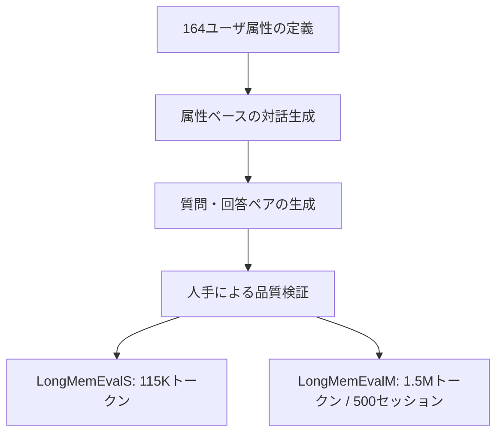
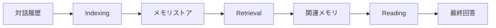
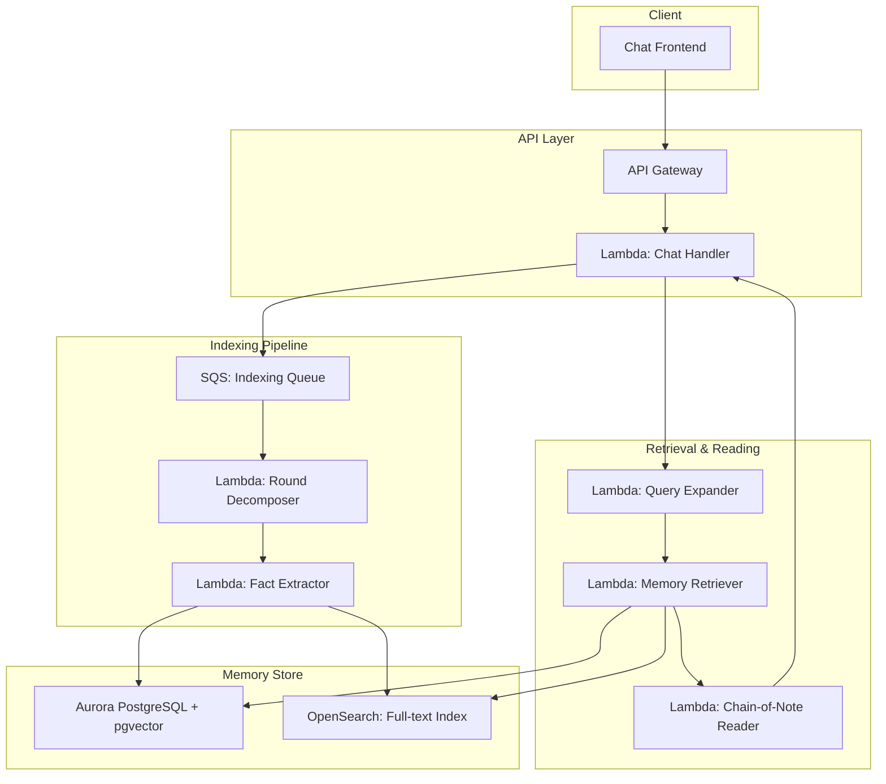

本記事は [arXiv: 2410.10813](https://arxiv.org/abs/2410.10813) の解説記事です。

## 論文概要

LongMemEvalは、チャットアシスタントの長期対話記憶能力を体系的に評価するためのベンチマークである。著者らは、500件の精選された質問を用いて、5つの記憶次元（情報抽出、マルチセッション推論、知識更新、時間推論、棄権）を評価する枠組みを提案している。さらに、メモリシステムの性能改善に向けた3段階フレームワーク（Indexing、Retrieval、Reading）を導入し、各段階における最適化手法の効果を定量的に分析している。

商用チャットシステムの評価では、ChatGPT（GPT-4o）が57.73%の精度にとどまり、オフラインベースライン（91.84%）から37%の大幅な性能低下が観測された。この結果は、現行のメモリ拡張手法には依然として改善の余地が大きいことを示している。

## 情報源

| 項目 | 内容 |
|------|------|
| タイトル | LongMemEval: Benchmarking Chat Assistants on Long-Term Interactive Memory |
| 著者 | Di Wu, Hongwei Wang, Wenhao Yu, Yuwei Zhang, Kai-Wei Chang, Dong Yu |
| arXiv ID | [2410.10813](https://arxiv.org/abs/2410.10813) |
| 発表年月 | 2024年10月（2025年3月改訂） |
| カテゴリ | cs.CL |

## カンファレンス情報

ICLR（International Conference on Learning Representations）は、深層学習と表現学習を中心とした機械学習分野の主要国際会議である。2013年に設立され、NeurIPSやICMLと並ぶトップティアの会議として位置づけられている。ICLR 2025はシンガポールで開催された。

ICLRの特徴として、OpenReviewプラットフォームを用いたオープンな査読プロセスが挙げられる。提出された論文はすべて公開され、査読者のコメントや著者の反論も透明性をもって公開される。この仕組みにより、再現性と研究の透明性に対する高い基準が維持されている。

本論文は、LLMベースのチャットアシスタントにおける長期記憶の評価という実用的な課題を扱っており、ICLRが重視する表現学習と実世界応用の橋渡しに合致するテーマである。

## 背景と動機

LLMベースのチャットアシスタント（ChatGPT、Gemini、Copilotなど）は急速に普及しているが、その長期記憶能力に関する体系的な評価はこれまで行われてこなかった。著者らは、既存研究における以下の3つの課題を指摘している。

第一に、従来のベンチマーク（MemoryBankやLoCoMoなど）はタスク範囲が限定的であり、記憶能力を多面的に評価できていなかった。例えば、知識更新や時間推論といった実用上重要な能力が評価対象に含まれていなかった。

第二に、既存のデータセットは合成的に生成されたものが多く、実際のユーザとアシスタント間の対話パターンを十分に反映していなかった。ユーザの個人情報が文脈に埋め込まれる自然な対話とは異なり、単純な事実の列挙に留まるケースが多かった。

第三に、商用チャットシステムのメモリ機能は「ブラックボックス」であり、どの段階で情報損失が発生しているかを特定する手段がなかった。著者らは、この問題に対処するため、メモリパイプラインを3段階に分解して評価する枠組みを設計した。

## 主要な貢献

著者らの貢献は以下の4点に整理される。

1. **5次元の記憶評価体系**: 情報抽出（IE）、マルチセッション推論（MR）、知識更新（KU）、時間推論（TR）、棄権（ABS）の5つの独立した記憶次元を定義し、各次元に対応する質問タイプを設計した。

2. **スケーラブルなデータセット構築手法**: 164のユーザ属性を5カテゴリに分類し、属性ベースの対話生成パイプラインにより、任意のスケールでベンチマークデータを構築できる手法を提案した。

3. **3段階メモリフレームワーク**: Indexing（索引構築）、Retrieval（検索）、Reading（読解）の3段階に分解し、各段階の最適化手法を体系的に評価した。

4. **商用システムの包括的評価**: ChatGPT、Gemini、Cozeなど5つの商用チャットシステムのメモリ性能を定量的に比較し、現行システムの限界を明らかにした。

## 技術的詳細

### 5つの記憶次元

LongMemEvalは、チャットアシスタントに求められる記憶能力を以下の5次元で定義している。

**Information Extraction（IE）**: 単一セッション内の情報を正確に抽出する能力。ユーザ発話、アシスタント発話、ユーザの選好情報の3種類の質問タイプを含む。例えば「以前おすすめしたイタリアンレストランの名前は何か」のような質問が該当する。

**Multi-Session Reasoning（MR）**: 複数セッションにまたがる情報を統合して推論する能力。異なるセッションで言及された断片的な情報を組み合わせて回答する必要がある。例えば、あるセッションで「来月パリに行く」と述べ、別のセッションで「旅行先の天気が心配」と言及した場合、これらを結びつけて回答する能力を評価する。

**Knowledge Updates（KU）**: ユーザの情報が更新された場合に、最新の情報に基づいて回答できる能力。例えば、ユーザが以前「東京在住」と述べた後に「大阪に引っ越した」と言及した場合、最新の居住地として大阪を回答できるかを評価する。

**Temporal Reasoning（TR）**: 時間に関する推論能力。「最後にジムに行ったのはいつか」「過去3か月で何回映画を観たか」のような、時間軸に沿った記憶の検索と推論を評価する。

**Abstention（ABS）**: 誤った前提を含む質問に対して適切に棄権（回答を拒否）できる能力。ユーザが実際には言及していない情報について質問された場合に、「その情報は記録にありません」と回答できるかを評価する。

### 7つの質問タイプ

上記5次元は、具体的に以下の7つの質問タイプに展開される。

| 質問タイプ | 記憶次元 | 説明 |
|-----------|---------|------|
| single-session-user | IE | ユーザ発話からの情報抽出 |
| single-session-assistant | IE | アシスタント発話からの情報抽出 |
| single-session-preference | IE | ユーザ選好の抽出 |
| multi-session | MR | 複数セッション横断の推論 |
| knowledge-update | KU | 更新された知識への追従 |
| temporal-reasoning | TR | 時間に基づく推論 |
| false-premise | ABS | 誤前提の質問への棄権 |

### データセット構築

著者らは、164のユーザ属性を以下の5カテゴリに分類してデータセットを構築している。

- **Personal Information**: 名前、職業、居住地などの基本情報
- **Preferences**: 食べ物、音楽、映画などの嗜好
- **Experiences**: 旅行、イベント参加などの経験
- **Plans**: 将来の計画や目標
- **Knowledge**: 学習中のスキルや専門知識

データセット構築のパイプラインは以下の通りである。



LongMemEvalSは約115Kトークンの対話履歴を含む小規模版、LongMemEvalMは約1.5Mトークン・500セッションの大規模版である。LongMemEvalMでは、対話履歴を拡張するために、ユーザ属性に基づく追加セッションを生成し、ターゲット情報を含むセッションとの距離を制御している。

### 3段階メモリフレームワーク

著者らは、メモリ拡張チャットシステムのパイプラインを以下の3段階に分解している。



#### Stage 1: Indexing（索引構築）

対話履歴をメモリストアに格納する段階である。著者らは以下の分解粒度を検討している。

- **Session-level**: セッション単位でそのまま格納（ベースライン）
- **Round-level**: セッションをユーザ・アシスタントの発話ラウンド単位に分解して格納

著者らは、セッションレベルからラウンドレベルへの分解により、検索精度が大幅に改善されることを報告している。これは、セッション全体を1つの検索単位とすると、関連性の低い発話がノイズとなり、検索精度を低下させるためである。

#### Stage 2: Retrieval（検索）

ユーザのクエリに関連するメモリを検索する段階である。著者らは以下の最適化手法を検討している。

**Fact-augmented key expansion**: メモリの各エントリに対して、含まれる事実情報をLLMで抽出し、検索キーとして付加する手法。ラウンドレベル分解と組み合わせることで、recall@kが+9.4%、QA精度が+5.4%向上したと報告されている。

**Time-aware query expansion**: 時間に関する質問に対して、クエリを時間情報で拡張する手法。例えば「最後にジムに行ったのはいつか」という質問に対して、日付範囲を含むクエリに展開する。時間推論タスクにおいて、recall@kが+11.3%向上したと報告されている。

#### Stage 3: Reading（読解）

検索されたメモリを基に最終回答を生成する段階である。著者らは以下の手法を検討している。

**Chain-of-Note**: 検索された各メモリに対して、質問との関連性を評価するノートを生成してから回答する手法。ノイズの多い検索結果に対するロバスト性を向上させる。

**JSON構造化出力**: 回答をJSON形式で構造化して出力させる手法。Chain-of-NoteとJSON出力の組み合わせにより、精度が+10ポイント（絶対値）向上したと報告されている。

### 評価手法

著者らは、GPT-4oを評価器として採用し、生成された回答と正解の一致度を判定している。人間の専門家との一致率は97%以上であり、高い信頼性が確認されている。評価は単純な文字列一致ではなく、意味的等価性に基づいて行われる。

## 実装のポイント

本論文の手法を実装する際の技術的な考慮点を整理する。

### Indexing段階の実装

セッションからラウンドへの分解は、ユーザ発話とアシスタント発話のペアを1単位として切り出す処理である。実装上は、各ラウンドにセッションIDとタイムスタンプを付与し、後続の検索・読解段階で時間情報を利用できるようにする必要がある。

### Retrieval段階の実装

Fact-augmented key expansionでは、各ラウンドに対してLLMを呼び出して事実情報を抽出する前処理が必要となる。この処理はオフラインで実行可能であるが、対話履歴が大規模になると計算コストが増大する。著者らの実験では、GPT-4o-miniを用いて事実抽出を行い、コストと品質のバランスを取っている。

ベクトル検索には、対話テキストとそこから抽出した事実情報を連結した上でエンベディングを生成し、コサイン類似度によるランキングを行う。検索結果の上位k件（著者らの実験ではk=5からk=20の範囲で評価）を次段階に渡す。

### Reading段階の実装

Chain-of-Noteでは、検索された各メモリに対して「このメモリは質問に関連するか、関連する場合どの情報が有用か」を記述するプロンプトを設計する。これにより、無関係なメモリが回答生成に影響することを防ぐ。JSON構造化出力と組み合わせることで、回答の一貫性と解析可能性が向上する。

## Production Deployment Guide

LongMemEvalの知見を活用して、メモリ拡張チャットシステムをAWS上に構築する場合のアーキテクチャパターンを示す。

### 全体アーキテクチャ



### Indexing Pipeline

対話完了後、SQSキューを介して非同期でIndexingを実行する。Round Decomposer（Lambda）がセッションをラウンド単位に分解し、Fact Extractor（Lambda）が各ラウンドからBedrock Claude経由で事実情報を抽出する。抽出された事実はAurora PostgreSQL（pgvector拡張）にベクトルとして格納し、OpenSearchにテキストインデックスを構築する。

ラウンド分解のバッチサイズは1セッションあたり平均20-30ラウンドを想定し、Fact Extractorの同時実行数をLambdaの予約済み同時実行で制御する。Bedrockの呼び出しにはExponential Backoff（初期1秒、最大32秒、ジッタ付き）を設定し、スロットリングに対応する。

```python
# ラウンド分解の実装例
from dataclasses import dataclass
from datetime import datetime

@dataclass(frozen=True)
class Round:
    session_id: str
    round_index: int
    user_utterance: str
    assistant_utterance: str
    timestamp: datetime
    extracted_facts: list[str] | None = None

def decompose_session(
    session_id: str,
    messages: list[dict],
    session_timestamp: datetime,
) -> list[Round]:
    """セッションをラウンド単位に分解する。"""
    rounds: list[Round] = []
    for i in range(0, len(messages) - 1, 2):
        if messages[i]["role"] != "user":
            continue
        user_msg = messages[i]["content"]
        asst_msg = messages[i + 1]["content"] if i + 1 < len(messages) else ""
        rounds.append(Round(
            session_id=session_id,
            round_index=i // 2,
            user_utterance=user_msg,
            assistant_utterance=asst_msg,
            timestamp=session_timestamp,
        ))
    return rounds
```

### Retrieval Pipeline

ユーザクエリの受信時、Query Expander（Lambda）がクエリの種類を判定し、必要に応じて時間情報やコンテキストでクエリを拡張する。Memory Retriever（Lambda）はpgvectorのベクトル検索とOpenSearchの全文検索を並列実行し、RRF（Reciprocal Rank Fusion）でスコアを統合する。上位k件（デフォルトk=10）の結果をReading段階に渡す。

pgvectorのインデックスにはIVFFlatまたはHNSWを使用する。HNSWはメモリ使用量が大きいが検索精度が高く、100万件以下のメモリストアでは推奨される。IVFFlatは大規模データに対してコスト効率が良い。

### Reading Pipeline

Chain-of-Note Reader（Lambda）は、検索された各メモリに対して関連性ノートを生成し、最終回答をJSON形式で構造化出力する。Bedrock Claude（Sonnet）を使用し、プロンプトにはfew-shotの例を含める。タイムアウトは30秒に設定し、Lambda関数のメモリは1024MBを割り当てる。

### 運用上の考慮事項

メモリストアの肥大化に対しては、TTL（Time-To-Live）ベースの古いメモリの自動アーカイブ、およびユーザ単位のメモリ上限（例: 10,000ラウンド）を設定する。CloudWatchメトリクスとして、Indexingのレイテンシ、Retrievalのrecall@k、Reading段階のLLM呼び出し成功率を監視する。コスト最適化には、Fact ExtractorにおいてBedrock Haiku等の軽量モデルを使用し、1ラウンドあたりの処理コストを抑制する。

## 実験結果

### 商用システムの評価

著者らは5つの商用チャットシステムを評価し、以下の結果を報告している。

| システム | LLMバックエンド | 精度（%） | オフラインベースラインからの低下 |
|---------|----------------|----------|------------------------------|
| ChatGPT | GPT-4o | 57.73 | -37% |
| Coze | GPT-4o | 32.99 | -64% |

ChatGPTが最も高い精度を示したが、同一のLLM（GPT-4o）をオフラインで使用した場合の91.84%と比較すると、37%の性能低下が確認された。この性能差は、メモリの索引構築と検索の段階で情報が失われていることを示唆している。

Cozeは同じGPT-4oを使用しているにもかかわらず32.99%にとどまり、メモリシステムの実装品質がLLM自体の能力以上に最終性能を左右することが明らかになった。

### 記憶次元別の分析

各記憶次元における商用システムの性能差は顕著であった。著者らは以下の傾向を報告している。

- **Information Extraction**: 比較的高い精度。単純な情報抽出は既存システムでもある程度対応可能
- **Multi-Session Reasoning**: 精度が大幅に低下。複数セッションの情報統合は現行システムの弱点
- **Knowledge Updates**: 古い情報と新しい情報の区別が困難。多くのシステムが古い情報を回答
- **Temporal Reasoning**: 時間的な前後関係の把握に課題。タイムスタンプの活用が不十分
- **Abstention**: 誤った前提の検出が困難。多くのシステムが誤情報に基づく回答を生成

### 最適化手法の効果

3段階フレームワークにおける各最適化手法の効果は以下の通りである。

**Indexing段階**: セッションレベルからラウンドレベルへの分解により、検索精度が有意に改善された。著者らは、これが最もコスト効率の高い最適化であると指摘している。

**Retrieval段階**: Fact-augmented key expansionにより、recall@kが+9.4%、QA精度が+5.4%向上した。Time-aware query expansionは時間推論タスクに限定的であるが、recall@kが+11.3%と大きな改善を示した。

**Reading段階**: Chain-of-NoteとJSON構造化出力の組み合わせにより、精度が+10ポイント（絶対値）向上した。この改善は特に、検索結果にノイズが多い場合に顕著であった。

### スケーラビリティ

LongMemEvalS（115Kトークン）からLongMemEvalM（1.5Mトークン、500セッション）への拡張では、すべてのシステムで性能低下が観測された。対話履歴が増大するにつれて、関連メモリの検索難度が上昇し、ノイズの影響が大きくなることが確認されている。

## 実運用への応用

### カスタマーサポートエージェント

LongMemEvalの知見は、長期的な顧客対応を行うカスタマーサポートエージェントに直接適用可能である。顧客の過去の問い合わせ履歴、購入履歴、設定変更履歴をラウンド単位で索引化し、Fact-augmented key expansionで事実情報を付加することで、「以前の問い合わせで言及された問題はその後解決したか」のような複合的な質問に対応できる。

Knowledge Updates次元の知見は、顧客情報の更新追跡に重要である。住所変更やプラン変更など、顧客属性の更新を正確に反映するためには、タイムスタンプ付きの知識管理と、最新情報の優先的な取得が必要である。

### パーソナルアシスタント

個人向けアシスタントでは、Temporal Reasoning次元が特に重要である。「先週おすすめされた本のタイトル」「今月の運動記録」のような時間に関する質問は日常的に発生するため、Time-aware query expansionの適用が効果的である。

Abstention次元は、ユーザの信頼維持に直結する。アシスタントが実際には言及されていない情報を「記憶している」と虚偽の回答を生成すると、システム全体の信頼性が損なわれる。著者らの結果は、この能力が現行システムで最も改善の余地が大きいことを示している。

### 設計上の教訓

本論文から得られる実装上の教訓は以下の3点に集約される。

1. **粒度の選択が最重要**: メモリの索引粒度（セッション vs ラウンド）は、後続のすべての段階に影響する。ラウンドレベルの分解は実装が単純でありながら効果が大きい。

2. **検索と読解の両方を最適化する**: 検索精度の改善だけでは不十分であり、検索結果にノイズが含まれる場合のロバスト性（Chain-of-Note）も同時に確保する必要がある。

3. **評価の多面性を確保する**: 単一のタスクで記憶能力を評価するのは不十分であり、LongMemEvalの5次元のように多面的な評価を行うことで、システムの弱点を正確に特定できる。

## 関連研究

### 長文コンテキスト処理

LongBenchやInfiniteBenchなどの長文コンテキストベンチマークは、単一ドキュメント内の情報処理能力を評価する。これに対してLongMemEvalは、複数セッションにまたがる対話記憶を評価する点で異なる。著者らは、長文コンテキスト処理と長期記憶は相補的な能力であり、両方の評価が必要であると指摘している。

### メモリ拡張LLM

MemoryBankは、ユーザプロファイルの動的更新を目的としたメモリ機構を提案しているが、評価は限定的なタスクに留まっている。LoCoMoは対話要約タスクに焦点を当てているが、時間推論や棄権といった次元を含まない。LongMemEvalは、これらの先行研究を包含する包括的な評価フレームワークを提供している。

### RAGベースのメモリシステム

Retrieval-Augmented Generation（RAG）の枠組みは、外部知識の検索と統合に広く用いられている。LongMemEvalの3段階フレームワークは、RAGのIndexing-Retrieval-Generationパイプラインと対応しており、RAGの最適化手法（クエリ拡張、リランキングなど）をメモリシステムに転用できることを示唆している。Mem0やMemGPTなどの長期記憶フレームワークは、LongMemEvalの評価基準によって客観的に性能を測定できる。

## まとめ

LongMemEvalは、チャットアシスタントの長期記憶能力を5つの次元で体系的に評価する初の包括的ベンチマークである。著者らの分析により、現行の商用システムではメモリの索引構築と検索の段階で大幅な情報損失が生じていることが明らかになった。

3段階メモリフレームワークにおける最適化では、ラウンドレベルの分解、Fact-augmented key expansion、Chain-of-NoteとJSON構造化出力の組み合わせが有効であることが示された。これらの手法は、既存のRAGパイプラインに容易に統合可能であり、実用的な改善策として活用できる。

今後の課題として、著者らはメモリの選択的忘却（不要な情報の積極的な削除）、マルチモーダルメモリ（画像や音声を含む記憶）、プライバシー保護下でのメモリ管理を挙げている。長期記憶はLLMベースのアシスタントが真にパーソナライズされたサービスを提供するための基盤技術であり、LongMemEvalはその発展を加速するための重要なツールとなる。

## 参考文献

1. Wu, D., Wang, H., Yu, W., Zhang, Y., Chang, K.-W., & Yu, D. (2024). LongMemEval: Benchmarking Chat Assistants on Long-Term Interactive Memory. arXiv:2410.10813.
2. Zhong, W., Guo, L., Gao, Q., Ye, H., & Wang, Y. (2024). MemoryBank: Enhancing Large Language Models with Long-Term Memory. AAAI 2024.
3. Maharana, A., Lee, D. H., Tuber, S., & Bansal, M. (2024). Evaluating Very Long-Term Conversational Memory of LLM Agents. ACL 2024.
4. Xu, P., Ping, W., Wu, X., McAfee, L., Zhu, C., Liu, Z., ... & Catanzaro, B. (2023). Retrieval meets Long Context Large Language Models. arXiv:2310.03025.
5. Lewis, P., Perez, E., Piktus, A., Petroni, F., Karpukhin, V., Goyal, N., ... & Kiela, D. (2020). Retrieval-Augmented Generation for Knowledge-Intensive NLP Tasks. NeurIPS 2020.
