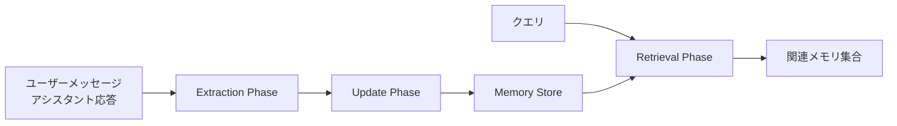

本記事は [arXiv: 2504.19413](https://arxiv.org/abs/2504.19413) の解説記事です。

この記事は [Zenn記事: Mem0×pgvectorでCSエージェントに長期記憶を実装しFCRを改善する](https://zenn.dev/0h_n0/articles/16618ab45991ae) の深掘りです。

## 論文概要

Mem0は、LLMのコンテキストウィンドウ制約を克服するために設計されたメモリ中心アーキテクチャである。会話履歴から動的にメモリを抽出・統合・検索する3段階パイプラインにより、プロダクション環境で要求されるレイテンシとトークン効率を両立する。グラフベースの変種Mem0^gは、エンティティ間の関係構造をNeo4jの有向ラベル付きグラフとして保持し、時系列推論や多段推論で補完的な強みを示す。LOCOMOベンチマーク（約26Kトークンの会話10件、200問）での評価において、著者らはMem0が単一ホップ質問で67.13、時系列質問でMem0^gが58.13のスコアを達成し、p95レイテンシを91%削減したと報告している。

## 情報源

| 項目 | 内容 |
|------|------|
| arXiv ID | [2504.19413](https://arxiv.org/abs/2504.19413) |
| タイトル | Mem0: Building Production-Ready AI Agents with Scalable Long-Term Memory |
| 著者 | Prateek Chhikara, Dev Khant, Saket Aryan, Taranjeet Singh, Deshraj Yadav |
| 発表年 | 2025年4月 |
| 採録 | ECAI 2025 |
| 分野 | cs.CL, cs.AI |

## 背景と動機

LLMベースのエージェントが長期間にわたるユーザーインタラクションを扱う場面が増えている。しかし、現行のLLMには以下の制約がある。

1. **コンテキストウィンドウの物理的上限**: 会話が長くなるとトークン数が膨張し、全履歴の投入はコストとレイテンシの両面で非現実的となる
2. **取捨選択の欠如**: 全履歴をそのまま投入すると、無関係な情報がノイズとなり応答品質が低下する
3. **関係構造の喪失**: 単純なテキスト検索（RAG）では、エンティティ間の暗黙的な関係（例: 「Aliceの上司のBobが言及した技術」）を捉えられない

著者らは、これらの課題に対してMemGPTやLangMemなど既存手法のアプローチを分析した上で、抽出・統合・検索を統一パイプラインとして設計するMem0アーキテクチャを提案している。特に、メモリの矛盾解消（contradiction resolution）と冗長排除（deduplication）を更新フェーズに組み込むことで、メモリストアの品質を維持する点が設計上の差別化要因である。

## 主要な貢献

著者らが主張する本論文の貢献は以下の通りである（論文Section 1より）。

- **統一メモリアーキテクチャ**: 抽出（Extraction）、更新（Update）、検索（Retrieval）の3フェーズからなるパイプラインを定義し、プロダクション環境向けに設計
- **Mem0^g（グラフ記憶変種）**: Neo4jベースの有向ラベル付きグラフにより、エンティティ間の関係構造を明示的に保持
- **LOCOMOベンチマークでの包括的評価**: 8つのベースライン（LoCoMo、ReadAgent、MemoryBank、MemGPT、A-Mem、LangMem、RAG変種、OpenAI Memory、Zep）との比較
- **プロダクション指標の報告**: レイテンシ（p50/p95）、トークン消費量、メモリ操作のスループットを定量的に提示

## 技術的詳細

### 全体アーキテクチャ

Mem0の処理パイプラインは、以下の3フェーズで構成される。



### Extraction Phase（抽出フェーズ）

入力としてユーザーメッセージとアシスタント応答のペア $(u_t, a_t)$ を受け取り、LLMを用いて顕著な記憶を抽出する。抽出されるメモリ集合は以下のように定義される。

$$
\Omega = \{\omega_1, \omega_2, \ldots, \omega_n\} = \text{LLM}_{\text{extract}}(u_t, a_t)
$$

ここで各 $\omega_i$ は自然言語で記述された1つの記憶単位（例: 「ユーザーはPythonを好む」「来週の出張予定がある」）である。抽出LLMには、事実・嗜好・予定・関係性など多様なカテゴリの情報を拾うようプロンプトが設計されている。

### Update Phase（更新フェーズ）

抽出された各メモリ $\omega_i$ に対して、既存のメモリストアとの整合性を検証し、4種類の操作のいずれかを決定する。

$$
\text{action}(\omega_i) \in \{\text{ADD}, \text{UPDATE}, \text{DELETE}, \text{NOOP}\}
$$

この決定には、以下の2つのコンテキストが参照される。

- **直近メッセージ**: 最新 $m$ 件のメッセージ（論文では $m=10$）
- **類似メモリ**: ベクトル検索で取得した上位 $s$ 件の既存メモリ（論文では $s=10$）

著者らは、この更新フェーズでLLMのfunction calling機能を用いて操作を決定すると報告している（論文Section 3.2）。具体的には、新規情報であればADD、既存メモリと矛盾する場合はUPDATE（古い方を上書き）、明示的に無効化された情報はDELETE、重複や無関係な情報はNOOPとなる。

### Retrieval Phase（検索フェーズ）

クエリ $q$ が与えられた時、メモリストアからコサイン類似度に基づいて関連メモリを検索する。

$$
\text{Retrieve}(q) = \text{top-}k\left(\frac{\mathbf{e}_q \cdot \mathbf{e}_{\omega_i}}{\|\mathbf{e}_q\| \|\mathbf{e}_{\omega_i}\|}\right)
$$

ここで $\mathbf{e}_q$ はクエリの埋め込みベクトル、$\mathbf{e}_{\omega_i}$ は各メモリの埋め込みベクトルである。

### Mem0^g: グラフベースメモリ

Mem0^gは、メモリを有向ラベル付きグラフとして保持する変種である。

$$
G = (V, E, L)
$$

- $V$: エンティティノードの集合（例: ユーザー名、プロジェクト名、技術名）
- $E \subseteq V \times V$: 有向エッジの集合（関係を表現）
- $L: E \to \mathcal{L}$: エッジからラベル集合 $\mathcal{L}$ への写像（例: "prefers", "works_at", "manages"）

グラフストレージにはNeo4jが使用され、Cypherクエリにより多段関係の探索が可能となる。著者らによると、Mem0^gは特に時系列推論（Temporal Reasoning）やオープンドメイン質問で強みを発揮する（論文Table 2）。

## 実装のポイント

Mem0の中核となるメモリ抽出・検索パイプラインの概念的な実装を以下に示す。実際のMem0ライブラリはより多くの機能を備えるが、ここではアーキテクチャの理解を目的として簡略化している。

```python
from dataclasses import dataclass, field
from enum import Enum
from typing import Optional
import numpy as np


class MemoryAction(Enum):
    """メモリ更新操作の種別。論文Section 3.2で定義される4操作に対応。"""
    ADD = "add"
    UPDATE = "update"
    DELETE = "delete"
    NOOP = "noop"


@dataclass
class Memory:
    """単一のメモリユニット。

    Attributes:
        content: 自然言語で記述されたメモリ内容
        embedding: コサイン類似度検索用の埋め込みベクトル
        memory_id: 一意識別子
        created_at: 作成タイムスタンプ（ISO 8601）
        updated_at: 最終更新タイムスタンプ（ISO 8601）
    """
    content: str
    embedding: np.ndarray
    memory_id: str
    created_at: str
    updated_at: str
    metadata: dict = field(default_factory=dict)


@dataclass
class UpdateDecision:
    """LLMが決定したメモリ更新操作。

    Attributes:
        action: 実行する操作種別
        memory: 対象メモリ（ADD時は新規、UPDATE/DELETE時は既存）
        reason: 操作理由（デバッグ・監査用）
    """
    action: MemoryAction
    memory: Memory
    reason: str
    target_memory_id: Optional[str] = None


def retrieve_relevant_memories(
    query_embedding: np.ndarray,
    memory_store: list[Memory],
    top_k: int = 10,
) -> list[Memory]:
    """コサイン類似度に基づいてクエリに関連するメモリを検索する。

    論文Section 3.3のRetrieval Phaseに対応。ベクトルストア
    （pgvector等）を使用する場合はSQL側で計算されるが、
    ここではアルゴリズムの理解のためNumPyで実装。

    Args:
        query_embedding: クエリの埋め込みベクトル
        memory_store: 検索対象のメモリ集合
        top_k: 返却する上位件数

    Returns:
        コサイン類似度上位top_k件のメモリリスト
    """
    similarities: list[tuple[float, Memory]] = []
    for mem in memory_store:
        cos_sim = float(
            np.dot(query_embedding, mem.embedding)
            / (np.linalg.norm(query_embedding) * np.linalg.norm(mem.embedding) + 1e-8)
        )
        similarities.append((cos_sim, mem))

    similarities.sort(key=lambda x: x[0], reverse=True)
    return [mem for _, mem in similarities[:top_k]]
```

pgvectorを用いる場合、上記のコサイン類似度計算はSQL側で`<=>` 演算子（コサイン距離）として実行される。Zenn記事で解説しているように、PostgreSQL + pgvectorの組み合わせにより、別途ベクトルDBを立てることなくRDBMSの運用ノウハウをそのまま活用できる利点がある。

## Production Deployment Guide

Mem0をプロダクション環境にデプロイする際のAWSパターンを、論文で報告されているレイテンシ要件とスケーラビリティ特性に基づいて整理する。

### AWSインフラパターン

| 規模 | リクエスト量 | 月額コスト目安 | 主要構成 |
|------|-------------|---------------|---------|
| Small | ~100 req/day | $50-150/mo | Lambda + Bedrock + RDS (pgvector) |
| Medium | ~1,000 req/day | $300-800/mo | ECS Fargate + RDS Multi-AZ + ElastiCache |
| Large | 10,000+ req/day | $2,000-5,000/mo | EKS + Karpenter + RDS Aurora pgvector + Neo4j on EC2 |

Mem0固有の考慮事項として、以下の点がある。

- **ベクトルストア**: pgvector拡張を有効化したRDS PostgreSQLまたはAurora PostgreSQLを使用。IVFFlat/HNSWインデックスの選択はデータ量に依存する
- **メモリAPI**: 抽出・更新・検索の3フェーズそれぞれでLLM呼び出しが発生するため、スループット設計時にLLM APIのレートリミットを考慮する
- **グラフDB（Mem0^g使用時）**: Neo4j Community EditionをEC2上で運用するか、Neo4j AuraDB（マネージド）を使用する

### Small構成: サーバーレス（Lambda + Bedrock + RDS pgvector）

1日100リクエスト程度の検証・小規模運用向け構成。LambdaのコールドスタートがMem0のp95レイテンシ（1.440s）に加算される点に注意が必要である。

```hcl
# --- Provider & Variables ---
terraform {
  required_version = ">= 1.5"
  required_providers {
    aws = {
      source  = "hashicorp/aws"
      version = "~> 5.0"
    }
  }
}

variable "project_name" {
  description = "プロジェクト識別名"
  type        = string
  default     = "mem0-small"
}

variable "vpc_id" {
  description = "既存VPCのID"
  type        = string
}

variable "private_subnet_ids" {
  description = "プライベートサブネットIDリスト"
  type        = list(string)
}

variable "db_password" {
  description = "RDS マスターパスワード"
  type        = string
  sensitive   = true
}

# --- RDS PostgreSQL with pgvector ---
resource "aws_db_instance" "mem0_pgvector" {
  identifier     = "${var.project_name}-pgvector"
  engine         = "postgres"
  engine_version = "16.4"
  instance_class = "db.t4g.micro"

  allocated_storage     = 20
  max_allocated_storage = 50
  storage_encrypted     = true

  db_name  = "mem0"
  username = "mem0admin"
  password = var.db_password

  vpc_security_group_ids = [aws_security_group.rds_sg.id]
  db_subnet_group_name   = aws_db_subnet_group.mem0.name

  backup_retention_period = 7
  skip_final_snapshot     = false
  final_snapshot_identifier = "${var.project_name}-final"
  deletion_protection       = true

  # pgvector拡張はパラメータグループで有効化
  parameter_group_name = aws_db_parameter_group.pgvector.name

  tags = {
    Project = var.project_name
    Role    = "vector-store"
  }
}

resource "aws_db_parameter_group" "pgvector" {
  family = "postgres16"
  name   = "${var.project_name}-pgvector"

  parameter {
    name  = "shared_preload_libraries"
    value = "pg_stat_statements"
  }

  tags = {
    Project = var.project_name
  }
}

resource "aws_db_subnet_group" "mem0" {
  name       = "${var.project_name}-db-subnet"
  subnet_ids = var.private_subnet_ids

  tags = {
    Project = var.project_name
  }
}

resource "aws_security_group" "rds_sg" {
  name_prefix = "${var.project_name}-rds-"
  vpc_id      = var.vpc_id

  ingress {
    from_port       = 5432
    to_port         = 5432
    protocol        = "tcp"
    security_groups = [aws_security_group.lambda_sg.id]
  }

  tags = {
    Project = var.project_name
  }
}

# --- Lambda Function ---
resource "aws_security_group" "lambda_sg" {
  name_prefix = "${var.project_name}-lambda-"
  vpc_id      = var.vpc_id

  egress {
    from_port   = 0
    to_port     = 0
    protocol    = "-1"
    cidr_blocks = ["0.0.0.0/0"]
  }

  tags = {
    Project = var.project_name
  }
}

resource "aws_lambda_function" "mem0_api" {
  function_name = "${var.project_name}-api"
  runtime       = "python3.12"
  handler       = "main.handler"
  timeout       = 30
  memory_size   = 512

  filename         = "lambda_package.zip"
  source_code_hash = filebase64sha256("lambda_package.zip")

  role = aws_iam_role.lambda_role.arn

  vpc_config {
    subnet_ids         = var.private_subnet_ids
    security_group_ids = [aws_security_group.lambda_sg.id]
  }

  environment {
    variables = {
      DB_HOST            = aws_db_instance.mem0_pgvector.address
      DB_NAME            = "mem0"
      DB_USER            = "mem0admin"
      BEDROCK_MODEL_ID   = "anthropic.claude-sonnet-4-20250514"
      POWERTOOLS_SERVICE_NAME = var.project_name
      LOG_LEVEL          = "INFO"
    }
  }

  tracing_config {
    mode = "Active"
  }

  tags = {
    Project = var.project_name
  }
}

resource "aws_iam_role" "lambda_role" {
  name = "${var.project_name}-lambda-role"

  assume_role_policy = jsonencode({
    Version = "2012-10-17"
    Statement = [{
      Action = "sts:AssumeRole"
      Effect = "Allow"
      Principal = {
        Service = "lambda.amazonaws.com"
      }
    }]
  })
}

resource "aws_iam_role_policy_attachment" "lambda_basic" {
  role       = aws_iam_role.lambda_role.name
  policy_arn = "arn:aws:iam::aws:policy/service-role/AWSLambdaVPCAccessExecutionRole"
}

resource "aws_iam_role_policy" "bedrock_access" {
  name = "${var.project_name}-bedrock"
  role = aws_iam_role.lambda_role.id

  policy = jsonencode({
    Version = "2012-10-17"
    Statement = [{
      Effect = "Allow"
      Action = [
        "bedrock:InvokeModel",
        "bedrock:InvokeModelWithResponseStream"
      ]
      Resource = "arn:aws:bedrock:*::foundation-model/*"
    }]
  })
}

# --- API Gateway ---
resource "aws_apigatewayv2_api" "mem0" {
  name          = "${var.project_name}-api"
  protocol_type = "HTTP"

  cors_configuration {
    allow_origins = ["*"]
    allow_methods = ["POST", "GET"]
    allow_headers = ["Content-Type", "Authorization"]
    max_age       = 3600
  }

  tags = {
    Project = var.project_name
  }
}

resource "aws_apigatewayv2_integration" "lambda" {
  api_id                 = aws_apigatewayv2_api.mem0.id
  integration_type       = "AWS_PROXY"
  integration_uri        = aws_lambda_function.mem0_api.invoke_arn
  payload_format_version = "2.0"
}

resource "aws_apigatewayv2_route" "default" {
  api_id    = aws_apigatewayv2_api.mem0.id
  route_key = "$default"
  target    = "integrations/${aws_apigatewayv2_integration.lambda.id}"
}

resource "aws_apigatewayv2_stage" "prod" {
  api_id      = aws_apigatewayv2_api.mem0.id
  name        = "prod"
  auto_deploy = true

  access_log_settings {
    destination_arn = aws_cloudwatch_log_group.api_gw.arn
    format = jsonencode({
      requestId      = "$context.requestId"
      ip             = "$context.identity.sourceIp"
      requestTime    = "$context.requestTime"
      httpMethod     = "$context.httpMethod"
      routeKey       = "$context.routeKey"
      status         = "$context.status"
      responseLength = "$context.responseLength"
      latency        = "$context.integrationLatency"
    })
  }
}

resource "aws_cloudwatch_log_group" "api_gw" {
  name              = "/aws/apigateway/${var.project_name}"
  retention_in_days = 30
}

resource "aws_lambda_permission" "api_gw" {
  statement_id  = "AllowAPIGateway"
  action        = "lambda:InvokeFunction"
  function_name = aws_lambda_function.mem0_api.function_name
  principal     = "apigateway.amazonaws.com"
  source_arn    = "${aws_apigatewayv2_api.mem0.execution_arn}/*/*"
}
```

### Large構成: コンテナ（EKS + Karpenter + Spot）

1日10,000リクエスト以上の大規模運用向け。Mem0のメモリAPI、pgvector、Neo4j（Mem0^g使用時）をそれぞれ独立したワークロードとして管理する。

```hcl
# --- EKS Cluster ---
variable "cluster_name" {
  description = "EKSクラスタ名"
  type        = string
  default     = "mem0-large"
}

variable "vpc_id" {
  description = "既存VPCのID"
  type        = string
}

variable "private_subnet_ids" {
  description = "プライベートサブネットIDリスト"
  type        = list(string)
}

module "eks" {
  source  = "terraform-aws-modules/eks/aws"
  version = "~> 20.0"

  cluster_name    = var.cluster_name
  cluster_version = "1.31"

  vpc_id     = var.vpc_id
  subnet_ids = var.private_subnet_ids

  cluster_endpoint_public_access = false

  # Karpenter用のIAM設定
  enable_irsa = true

  # マネージドノードグループ（Karpenterコントローラ用）
  eks_managed_node_groups = {
    system = {
      instance_types = ["m7g.medium"]
      min_size       = 2
      max_size       = 3
      desired_size   = 2
      labels = {
        role = "system"
      }
    }
  }

  tags = {
    Project = var.cluster_name
  }
}

# --- Karpenter ---
module "karpenter" {
  source  = "terraform-aws-modules/eks/aws//modules/karpenter"
  version = "~> 20.0"

  cluster_name = module.eks.cluster_name

  irsa_oidc_provider_arn = module.eks.oidc_provider_arn

  tags = {
    Project = var.cluster_name
  }
}

# --- Aurora PostgreSQL (pgvector) ---
module "aurora_pgvector" {
  source  = "terraform-aws-modules/rds-aurora/aws"
  version = "~> 9.0"

  name           = "${var.cluster_name}-pgvector"
  engine         = "aurora-postgresql"
  engine_version = "16.4"

  instance_class = "db.r7g.large"
  instances = {
    writer = {}
    reader = {
      instance_class = "db.r7g.large"
    }
  }

  vpc_id               = var.vpc_id
  db_subnet_group_name = "${var.cluster_name}-db-subnet"
  security_group_rules = {
    ingress_from_eks = {
      source_security_group_id = module.eks.node_security_group_id
    }
  }

  storage_encrypted = true
  deletion_protection = true

  # パフォーマンスインサイト有効化
  performance_insights_enabled = true

  tags = {
    Project = var.cluster_name
    Role    = "vector-store"
  }
}

# --- Neo4j on EC2 (Mem0^g用) ---
resource "aws_instance" "neo4j" {
  ami           = data.aws_ami.ubuntu.id
  instance_type = "r7g.xlarge"
  subnet_id     = var.private_subnet_ids[0]

  vpc_security_group_ids = [aws_security_group.neo4j_sg.id]

  root_block_device {
    volume_size = 100
    volume_type = "gp3"
    iops        = 3000
    throughput  = 125
    encrypted   = true
  }

  user_data = <<-EOT
    #!/bin/bash
    # Neo4j Community Edition インストール
    wget -O - https://debian.neo4j.com/neotechnology.gpg.key | apt-key add -
    echo 'deb https://debian.neo4j.com stable latest' > /etc/apt/sources.list.d/neo4j.list
    apt-get update && apt-get install -y neo4j
    systemctl enable neo4j
    systemctl start neo4j
  EOT

  tags = {
    Name    = "${var.cluster_name}-neo4j"
    Project = var.cluster_name
    Role    = "graph-store"
  }
}

data "aws_ami" "ubuntu" {
  most_recent = true
  owners      = ["099720109477"] # Canonical

  filter {
    name   = "name"
    values = ["ubuntu/images/hvm-ssd-arm64/ubuntu-*-24.04-*"]
  }

  filter {
    name   = "architecture"
    values = ["arm64"]
  }
}

resource "aws_security_group" "neo4j_sg" {
  name_prefix = "${var.cluster_name}-neo4j-"
  vpc_id      = var.vpc_id

  ingress {
    from_port       = 7687
    to_port         = 7687
    protocol        = "tcp"
    security_groups = [module.eks.node_security_group_id]
    description     = "Bolt protocol from EKS"
  }

  ingress {
    from_port       = 7474
    to_port         = 7474
    protocol        = "tcp"
    security_groups = [module.eks.node_security_group_id]
    description     = "HTTP API from EKS"
  }

  egress {
    from_port   = 0
    to_port     = 0
    protocol    = "-1"
    cidr_blocks = ["0.0.0.0/0"]
  }

  tags = {
    Project = var.cluster_name
  }
}
```

### セキュリティベストプラクティス

Mem0をプロダクションで運用する際のセキュリティ上の留意点を以下に整理する。

- **メモリの暗号化**: pgvectorに保存されるメモリ内容とベクトルは`storage_encrypted = true`でat-rest暗号化する。Transit暗号化はSSL接続を強制する
- **IAM最小権限**: Lambda/EKSのIAMロールはBedrock InvokeModelとRDSアクセスのみに限定する。`bedrock:*`のようなワイルドカードは使用しない
- **メモリ内容のPII管理**: Mem0はユーザー発話から記憶を抽出するため、PII（個人情報）がメモリストアに保存される可能性がある。抽出フェーズでPIIフィルタリングを挟むか、保存時にトークナイゼーションを適用する
- **ネットワーク分離**: RDS/Neo4jはプライベートサブネットに配置し、パブリックアクセスを無効化する
- **Secrets管理**: DBパスワードやAPIキーはAWS Secrets ManagerまたはSSM Parameter Store（SecureString）で管理する。Terraformの`variable`にsensitiveフラグを設定する

### モニタリング

#### CloudWatch Logs Insights クエリ

Mem0のメモリ操作（ADD/UPDATE/DELETE）のパターンを分析するクエリ例を示す。

```
# メモリ操作の分布（直近24時間）
fields @timestamp, @message
| filter @message like /memory_action/
| parse @message '"action": "*"' as action
| stats count(*) as cnt by action
| sort cnt desc

# p95レイテンシの推移（1時間ごと）
fields @timestamp, @message
| filter @message like /duration_ms/
| parse @message '"duration_ms": *' as latency
| stats pct(latency, 95) as p95, avg(latency) as avg_ms by bin(1h)
| sort @timestamp asc

# メモリ検索のヒット率
fields @timestamp, @message
| filter @message like /retrieve_memories/
| parse @message '"results_count": *,' as hits
| stats avg(hits) as avg_hits, min(hits) as min_hits, max(hits) as max_hits by bin(1h)
```

#### CloudWatch アラーム

```python
"""Mem0向けCloudWatchアラーム設定。

メモリAPI のレイテンシとエラー率を監視する。
論文で報告されているp95=1.440sを基準値として使用。
"""

import boto3


def create_mem0_alarms(
    function_name: str,
    sns_topic_arn: str,
    region: str = "ap-northeast-1",
) -> list[str]:
    """Mem0 Lambda関数のCloudWatchアラームを作成する。

    Args:
        function_name: Lambda関数名
        sns_topic_arn: 通知先SNSトピックARN
        region: AWSリージョン

    Returns:
        作成されたアラームARNのリスト
    """
    cw = boto3.client("cloudwatch", region_name=region)
    alarm_arns: list[str] = []

    # レイテンシアラーム（p95 > 3秒で警告）
    # 論文報告値 p95=1.440s の約2倍をしきい値とする
    cw.put_metric_alarm(
        AlarmName=f"{function_name}-latency-p95",
        MetricName="Duration",
        Namespace="AWS/Lambda",
        Statistic="p95",
        Period=300,
        EvaluationPeriods=3,
        Threshold=3000.0,
        ComparisonOperator="GreaterThanThreshold",
        Dimensions=[
            {"Name": "FunctionName", "Value": function_name},
        ],
        AlarmActions=[sns_topic_arn],
        AlarmDescription=(
            "Mem0 API p95レイテンシが3秒を超過。"
            "論文報告値p95=1.440sの約2倍を閾値として設定。"
        ),
        TreatMissingData="notBreaching",
    )
    alarm_arns.append(f"{function_name}-latency-p95")

    # エラー率アラーム（5%超過で警告）
    cw.put_metric_alarm(
        AlarmName=f"{function_name}-error-rate",
        MetricName="Errors",
        Namespace="AWS/Lambda",
        Statistic="Sum",
        Period=300,
        EvaluationPeriods=2,
        Threshold=5.0,
        ComparisonOperator="GreaterThanThreshold",
        Dimensions=[
            {"Name": "FunctionName", "Value": function_name},
        ],
        AlarmActions=[sns_topic_arn],
        AlarmDescription="Mem0 APIエラー数が5分間で5件超過",
        TreatMissingData="notBreaching",
    )
    alarm_arns.append(f"{function_name}-error-rate")

    # メモリストア接続エラー（pgvector接続失敗）
    cw.put_metric_alarm(
        AlarmName=f"{function_name}-db-connection-errors",
        MetricName="DatabaseConnections",
        Namespace="AWS/RDS",
        Statistic="Maximum",
        Period=60,
        EvaluationPeriods=5,
        Threshold=0.0,
        ComparisonOperator="LessThanOrEqualToThreshold",
        AlarmActions=[sns_topic_arn],
        AlarmDescription="pgvectorへの接続数が0。メモリストア障害の可能性",
        TreatMissingData="breaching",
    )
    alarm_arns.append(f"{function_name}-db-connection-errors")

    return alarm_arns
```

#### X-Ray トレーシング

```python
"""Mem0メモリ操作のX-Rayトレーシング。

抽出・更新・検索の各フェーズを個別サブセグメントとして記録し、
ボトルネック分析を可能にする。
"""

from aws_xray_sdk.core import xray_recorder, patch_all
from aws_xray_sdk.core.models.subsegment import Subsegment

# boto3, requests, psycopg2 を自動パッチ
patch_all()


def trace_memory_extraction(
    user_message: str,
    assistant_response: str,
) -> list[str]:
    """メモリ抽出フェーズをX-Rayでトレースする。

    Args:
        user_message: ユーザーメッセージ
        assistant_response: アシスタント応答

    Returns:
        抽出されたメモリ内容のリスト
    """
    subsegment: Subsegment = xray_recorder.begin_subsegment("mem0.extraction")
    subsegment.put_annotation("phase", "extraction")
    subsegment.put_metadata("input_length", len(user_message) + len(assistant_response))

    try:
        # LLMによるメモリ抽出（実際にはMem0ライブラリを呼び出す）
        memories = _call_extraction_llm(user_message, assistant_response)
        subsegment.put_annotation("extracted_count", len(memories))
        return memories
    except Exception as e:
        subsegment.add_exception(e, stack=True)
        raise
    finally:
        xray_recorder.end_subsegment()


def trace_memory_update(
    extracted_memories: list[str],
    existing_memories: list[str],
) -> list[dict]:
    """メモリ更新フェーズをX-Rayでトレースする。

    Args:
        extracted_memories: 抽出されたメモリリスト
        existing_memories: 既存メモリリスト（類似検索で取得済み）

    Returns:
        更新操作結果のリスト（action, memory_id等）
    """
    subsegment: Subsegment = xray_recorder.begin_subsegment("mem0.update")
    subsegment.put_annotation("phase", "update")
    subsegment.put_metadata("new_count", len(extracted_memories))
    subsegment.put_metadata("existing_count", len(existing_memories))

    try:
        results = _call_update_llm(extracted_memories, existing_memories)
        action_counts = {}
        for r in results:
            action_counts[r["action"]] = action_counts.get(r["action"], 0) + 1
        subsegment.put_metadata("action_distribution", action_counts)
        return results
    except Exception as e:
        subsegment.add_exception(e, stack=True)
        raise
    finally:
        xray_recorder.end_subsegment()


def trace_memory_retrieval(
    query: str,
    top_k: int = 10,
) -> list[dict]:
    """メモリ検索フェーズをX-Rayでトレースする。

    Args:
        query: 検索クエリ
        top_k: 取得件数上限

    Returns:
        関連メモリのリスト
    """
    subsegment: Subsegment = xray_recorder.begin_subsegment("mem0.retrieval")
    subsegment.put_annotation("phase", "retrieval")
    subsegment.put_annotation("top_k", top_k)

    try:
        results = _query_pgvector(query, top_k)
        subsegment.put_annotation("results_count", len(results))
        return results
    except Exception as e:
        subsegment.add_exception(e, stack=True)
        raise
    finally:
        xray_recorder.end_subsegment()


def _call_extraction_llm(user_msg: str, assistant_msg: str) -> list[str]:
    """LLM抽出呼び出しのスタブ。実装時はMem0ライブラリに置換。"""
    raise NotImplementedError

def _call_update_llm(new: list[str], existing: list[str]) -> list[dict]:
    """LLM更新呼び出しのスタブ。実装時はMem0ライブラリに置換。"""
    raise NotImplementedError

def _query_pgvector(query: str, top_k: int) -> list[dict]:
    """pgvectorクエリのスタブ。実装時はSQLAlchemy等に置換。"""
    raise NotImplementedError
```

#### Cost Explorer レポート

```python
"""Mem0インフラのコスト分析レポート生成。

Lambda（メモリAPI）、RDS（pgvector）、Bedrock（LLM呼び出し）の
コスト内訳を日次・月次で集計する。
"""

from datetime import datetime, timedelta
from typing import Any

import boto3


def get_mem0_cost_report(
    project_name: str = "mem0-small",
    days: int = 30,
) -> dict[str, Any]:
    """Mem0関連AWSサービスのコストレポートを生成する。

    Args:
        project_name: プロジェクト名（Costタグで絞り込み）
        days: 集計期間（日数）

    Returns:
        サービス別コスト内訳を含む辞書
    """
    ce = boto3.client("ce", region_name="us-east-1")

    end_date = datetime.utcnow().strftime("%Y-%m-%d")
    start_date = (datetime.utcnow() - timedelta(days=days)).strftime("%Y-%m-%d")

    # サービス別コスト内訳
    response = ce.get_cost_and_usage(
        TimePeriod={"Start": start_date, "End": end_date},
        Granularity="MONTHLY",
        Metrics=["UnblendedCost", "UsageQuantity"],
        GroupBy=[
            {"Type": "DIMENSION", "Key": "SERVICE"},
        ],
        Filter={
            "Tags": {
                "Key": "Project",
                "Values": [project_name],
            }
        },
    )

    report: dict[str, Any] = {
        "period": {"start": start_date, "end": end_date},
        "project": project_name,
        "services": {},
        "total_cost": 0.0,
    }

    for result in response["ResultsByTime"]:
        for group in result["Groups"]:
            service_name = group["Keys"][0]
            cost = float(group["Metrics"]["UnblendedCost"]["Amount"])
            report["services"][service_name] = (
                report["services"].get(service_name, 0.0) + cost
            )
            report["total_cost"] += cost

    # Bedrock推論コストの詳細（Mem0はフェーズごとにLLM呼び出し）
    bedrock_response = ce.get_cost_and_usage(
        TimePeriod={"Start": start_date, "End": end_date},
        Granularity="DAILY",
        Metrics=["UnblendedCost"],
        Filter={
            "And": [
                {"Dimensions": {"Key": "SERVICE", "Values": ["Amazon Bedrock"]}},
                {"Tags": {"Key": "Project", "Values": [project_name]}},
            ]
        },
    )

    bedrock_daily: list[dict[str, Any]] = []
    for result in bedrock_response["ResultsByTime"]:
        bedrock_daily.append({
            "date": result["TimePeriod"]["Start"],
            "cost": float(result["Metrics"]["UnblendedCost"]["Amount"]),
        })
    report["bedrock_daily_trend"] = bedrock_daily

    return report
```

### コスト最適化チェックリスト

Mem0固有のコスト要因（LLM呼び出し回数、ベクトルストアサイズ）を考慮したチェックリストを以下に示す。

**コンピュート**

- [ ] Lambda: メモリサイズを512MB-1024MBで実測比較（CPU性能はメモリに比例）
- [ ] Lambda: Provisioned Concurrencyの要否を判断（コールドスタート vs コスト）
- [ ] EKS: KarpenterのSpotインスタンス比率を70%以上に設定
- [ ] EKS: ARM64（Graviton）インスタンスの利用でx86比約20%コスト削減
- [ ] EKS: Pod水平オートスケーラ（HPA）のターゲットCPU使用率を調整

**LLM呼び出し（最大のコスト要因）**

- [ ] Bedrock: 抽出・更新の2フェーズで1メッセージあたり2回LLM呼び出しが発生する点を認識
- [ ] Bedrock: 抽出プロンプトの最適化（不要なメモリ抽出を抑制しADD操作を削減）
- [ ] Bedrock: 更新フェーズの類似メモリ数 $s$ を10から5に削減可能か検証
- [ ] Bedrock: バッチ処理が可能な場面ではBatch Inferenceを活用
- [ ] Bedrock: Prompt Cachingの活用（システムプロンプトのキャッシュ）
- [ ] モデル選択: 抽出・更新にはHaiku/Sonnetクラス、検索拡張にはより大きなモデルと使い分け

**ストレージ**

- [ ] RDS: pgvectorのインデックス方式をデータ量に応じて選択（<100万件: IVFFlat、>100万件: HNSW）
- [ ] RDS: 不要な古いメモリのアーカイブ/パージポリシーを設定
- [ ] RDS: Aurora I/O-Optimizedの採否をI/Oパターンで判断
- [ ] RDS: リードレプリカの検索クエリへの振り分け
- [ ] Neo4j: Mem0^gを使用しない場合はNeo4jインスタンスを起動しない
- [ ] EBS: gp3のIOPS/スループットをベースライン（3000/125）で運用し、必要時のみ引き上げ

**ネットワーク/データ転送**

- [ ] VPCエンドポイント: Bedrock/S3/CloudWatch用のVPCエンドポイントでNAT Gateway料金を削減
- [ ] リージョン選択: LLM APIのレイテンシとコストのバランスで選定（us-east-1が最安の場合あり）

**監視/ログ**

- [ ] CloudWatch Logs: 保持期間を30日に設定（デフォルト無期限は高コスト）
- [ ] X-Ray: サンプリングレートを本番では5-10%に抑制
- [ ] Cost Anomaly Detection: Bedrockコストの急増を検知するアラートを設定

## 実験結果

著者らはLOCOMOベンチマーク（10会話、各約26Kトークン、計200問）で評価を行っている。以下は論文Table 2からの抜粋である。

| タスク | Mem0 | Mem0^g | OpenAI Memory | Zep | LangMem | A-Mem |
|--------|------|--------|---------------|-----|---------|-------|
| Single-Hop | **67.13** | 65.71 | 63.79 | 60.08 | 62.41 | 61.56 |
| Multi-Hop | **51.15** | 47.19 | 43.84 | 46.12 | 47.92 | 42.49 |
| Open-Domain | 72.93 | 75.71 | 69.26 | **76.60** | 72.88 | 74.36 |
| Temporal | 55.51 | **58.13** | 50.00 | 49.57 | 43.33 | 49.91 |

（太字は各タスクの最高スコア）

著者らの報告によると、Mem0は単一ホップ質問と多段推論で最高スコアを達成しているが、オープンドメイン質問ではZepが最高スコアを記録している。この結果について著者らは、Mem0の抽出フェーズが顕著な事実に焦点を当てるため、会話の一般的な流れに関する質問ではRAGベースのアプローチが有利になる場合があると分析している（論文Section 5.1）。

レイテンシについては、以下の結果が報告されている（論文Table 3より）。

| 指標 | Mem0 | Full Context |
|------|------|-------------|
| p50 | 0.845s | 8.895s |
| p95 | 1.440s | 17.117s |
| トークン数 | ~7K | ~26K |

Mem0はフルコンテキスト投入と比較してp95レイテンシを91%削減し、トークン消費量を約73%削減している。ただし、これはメモリの抽出・更新フェーズのオーバーヘッドを含まない検索時のみの指標である点に留意が必要である。

## 実運用への応用

論文の結果を踏まえ、Mem0のプロダクション適用における考慮事項を整理する。

**適合するユースケース**:
- カスタマーサポートエージェント: ユーザーの過去の問い合わせ履歴・嗜好を長期記憶として保持し、パーソナライズされた応答を提供する。Zenn記事で解説しているFCR（First Contact Resolution）改善がこれに該当する
- コーディングアシスタント: プロジェクトの技術スタック、コーディング規約、過去のレビューコメントをメモリとして蓄積する
- 医療相談チャットボット: 患者の既往歴・アレルギー情報を安全に保持する（PII管理が必須）

**制約と留意事項**:
- メモリ抽出の品質はLLMの性能に依存するため、重要な情報の取りこぼしが生じる可能性がある。著者らもLOCOMOのOpen-Domain質問でZepに劣後する結果を認めている
- 更新フェーズのLLM呼び出しにより、メッセージ1件あたりのコストが増加する。大量のメッセージを処理するバッチシナリオではコスト見積もりが重要となる
- Mem0^gのNeo4j依存は、運用インフラの複雑性を増加させる。グラフ記憶が不要な場面ではベクトルストア版（pgvector）のみの構成が推奨される

## 関連研究

本論文と関連する主要な研究を以下に整理する。

- **MemGPT** (Packer et al., 2023): OSのページング機構に着想を得た階層的メモリ管理。メインコンテキストとアーカイブストレージ間でメモリを明示的に移動する。Mem0との違いは、MemGPTがメモリ管理をエージェント自身に委ねるのに対し、Mem0はシステムレベルで自動化する点である
- **A-Mem** (Xu et al., 2025): Zettelkasten方式に基づく自己進化型メモリアーキテクチャ。メモリノート間のリンクを自動生成する。LOCOMOベンチマークではTemporal質問でMem0^gに劣後している
- **LangMem** (LangChain, 2024): LangChainエコシステムのメモリ管理ライブラリ。セマンティック検索とプロファイル更新を提供する。Multi-Hop質問ではMem0に次ぐスコアを記録している
- **LOCOMO** (Maharana et al., 2024): 本論文の評価に使用されたベンチマーク。長期会話における記憶能力を4つのタスクタイプで評価する

## まとめと今後の展望

Mem0は、LLMの長期記憶問題に対して抽出・統合・検索の3フェーズパイプラインという実用的なアプローチを提示している。LOCOMOベンチマークにおいて複数のタスクで既存手法を上回る性能を示しつつ、p95レイテンシ91%削減という運用面での利点も報告されている。一方で、オープンドメイン質問での限界や、メモリ抽出品質のLLM依存といった課題も明確である。

今後の方向性として、著者らはメモリの自動的な重要度評価や、マルチモーダル情報（画像・音声）のメモリ化に言及している。また、Mem0^gのグラフ構造と通常のベクトル検索のハイブリッドアプローチも検討課題として挙げられている。

## 参考文献

1. Chhikara, P., Khant, D., Aryan, S., Singh, T., & Yadav, D. (2025). Mem0: Building Production-Ready AI Agents with Scalable Long-Term Memory. *ECAI 2025*. arXiv:2504.19413
2. Packer, C., Wooders, S., Lin, K., Fang, V., Patil, S. G., Stoica, I., & Gonzalez, J. E. (2023). MemGPT: Towards LLMs as Operating Systems. arXiv:2310.08560
3. Xu, Z., Ping, W., Wu, X., McAfee, L., Zhu, C., Liu, Z., ... & Catanzaro, B. (2025). A-Mem: Agentic Memory for LLM Agents. arXiv:2502.12110
4. Maharana, A., Lee, D. H., Tulyakov, S., Bansal, M., Barbieri, F., & Fang, Y. (2024). Evaluating Very Long-Term Conversational Memory of LLM Agents. *ACL 2024*. arXiv:2402.17753
5. LangChain. (2024). LangMem: Long-term memory for LLM applications. [https://github.com/langchain-ai/langmem](https://github.com/langchain-ai/langmem)
