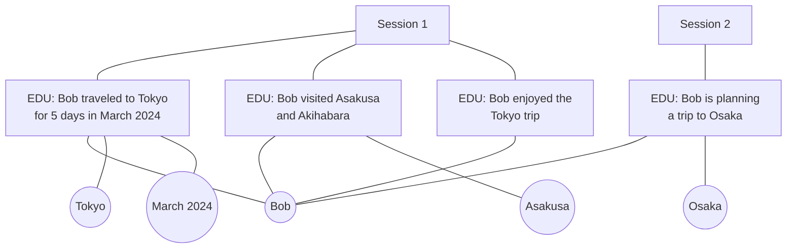
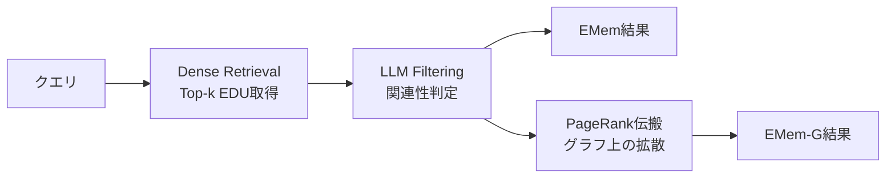

本記事は [arXiv: 2511.17208](https://arxiv.org/abs/2511.17208) の解説記事です。

## 論文概要（Abstract）

LLMエージェントが複数セッションにまたがる長期的な会話を記憶・検索する能力は、実用的なカスタマーサポートやパーソナルアシスタントにおいて不可欠な課題である。著者らは、neo-Davidsonian意味論に着想を得た**EMem（Event-centric Memory）**を提案している。EMemは対話をイベント中心の基本談話単位（EDU: Elementary Discourse Unit）に分解し、セッション・EDU・引数の3種のノードからなる異種グラフとして組織化する。このグラフ上で密ベクトル検索とLLMベースのフィルタリングを組み合わせた連想検索を行う。

この記事は [Zenn記事: Mem0×pgvectorでCSエージェントに長期記憶を実装しFCRを改善する](https://zenn.dev/0h_n0/articles/16618ab45991ae) の深掘りです。Mem0のメモリ抽出・検索アプローチと比較して、EMemがどのようにイベント構造を活用し長期記憶の精度向上を実現しているかを理解するための参考になる。

## 情報源

- **arXiv ID**: 2511.17208
- **URL**: [https://arxiv.org/abs/2511.17208](https://arxiv.org/abs/2511.17208)
- **著者**: Sizhe Zhou, Jiawei Han
- **発表年**: 2025（2025年12月改訂）
- **分野**: cs.CL（計算言語学）

## 背景と動機（Background & Motivation）

LLMエージェントを長期的な対話パートナーとして運用する場合、過去の会話で共有された情報を正確に記憶・想起できる能力が求められる。しかし、全会話履歴をコンテキストウィンドウに入力する方法はトークンコストが膨大になり、またウィンドウ長の上限によって物理的に不可能な場合も多い。

著者らは既存の長期記憶手法における以下の課題を指摘している。

1. **全文コンテキスト方式のコスト問題**: 101Kトークンの会話履歴をそのまま入力すると、レイテンシとAPI費用が実用的でないレベルに達する
2. **要約ベース手法の情報損失**: セッションやトピック単位の要約では、細粒度のイベント情報（「2024年3月に5日間東京を旅行した」等）が失われる
3. **フラットな検索の限界**: 従来のRAGベースの記憶検索は、メモリ断片間の構造的関連（同一人物、同一イベントへの参照等）を活用できない

これらの課題に対し、著者らは言語学のneo-Davidsonian意味論を導入し、対話をイベント中心に構造化するという方法論を採用している。

## 主要な貢献（Key Contributions）

- **貢献1**: neo-Davidsonian意味論に基づくEDU抽出手法の提案。対話を「誰が・何を・いつ・どこで」を含むイベント命題に分解する
- **貢献2**: セッション・EDU・引数の3種ノードからなる異種グラフ構造と、その上での連想検索アルゴリズムの設計
- **貢献3**: LoCoMoおよびLongMemEvalベンチマークにおいて、従来手法を上回る性能を達成しつつ、コンテキスト長を大幅に削減

## 技術的詳細（Technical Details）

### neo-Davidsonian意味論とEDU分解

Davidsonian意味論では、イベントを一階述語論理の存在量化で表現する。例えば「BobがTokyoに旅行した」は以下のように形式化される。

$$
\exists e \, [\text{travel}(e) \land \text{Agent}(e, \text{Bob}) \land \text{Destination}(e, \text{Tokyo})]
$$

ここで $e$ はイベント変数、$\text{Agent}$ や $\text{Destination}$ は意味役割（thematic role）を表す。neo-Davidsonian拡張では、述語と意味役割を分離し、時間・場所・様態などの修飾子を柔軟に追加できる。

EMemはこの形式論を対話メモリに応用する。具体的には、LLMを用いて各対話セッションからEDUを抽出する。EDUは対話中のイベントや事実を自己完結的な命題として表現したものである。

**EDU抽出の例**:

元の対話:
> User: 「先月3月に東京に5日間旅行に行ったんだ」
> Agent: 「どうでしたか？」
> User: 「浅草と秋葉原を回って、とても楽しかった」

抽出されるEDU:
- EDU1: "Bob traveled to Tokyo for five days in March 2024"
- EDU2: "Bob visited Asakusa and Akihabara during the Tokyo trip"
- EDU3: "Bob enjoyed the Tokyo trip very much"

各EDUはイベント的な命題として、主体（Bob）、行動（traveled/visited/enjoyed）、対象（Tokyo/Asakusa等）、時間（March 2024）などの引数を暗黙的に含む。

### 異種グラフの構築

著者らは抽出したEDUを以下の3種のノードからなる異種グラフ $G = (V, E)$ として組織化する。



**ノード種別**:

| ノード種別 | 説明 | 例 |
|---|---|---|
| Session $s_i$ | 対話セッション単位 | Session 1, Session 2 |
| EDU $u_j$ | イベント命題 | "Bob traveled to Tokyo..." |
| Argument $a_k$ | EDUの引数（エンティティ・時間・場所等） | Bob, Tokyo, March 2024 |

**エッジ関係**:

- **Session-EDU**: セッション $s_i$ に含まれるEDU $u_j$ を接続
- **EDU-Argument**: EDU $u_j$ から抽出された引数 $a_k$ を接続

引数ノードが複数のEDUを橋渡しすることで、異なるセッション間のイベントが構造的に関連付けられる。上の例では、引数「Bob」がSession 1とSession 2のEDUを横断的に接続している。

### 検索アルゴリズム: EMem と EMem-G

著者らは2つの検索変種を提案している。

#### EMem（軽量版）

EMemの検索は以下の2段階で構成される。

**Step 1 — 密ベクトル検索**: クエリ $q$ に対して、全EDUノードの埋め込みベクトルとの類似度を計算し、上位 $k$ 件の候補を取得する。

$$
\text{TopK}(q) = \underset{u_j \in U}{\text{argmax-}k} \; \text{sim}(\mathbf{e}_q, \mathbf{e}_{u_j})
$$

ここで $\mathbf{e}_q$ はクエリの埋め込み、$\mathbf{e}_{u_j}$ はEDU $u_j$ の埋め込み、$\text{sim}(\cdot, \cdot)$ はコサイン類似度である。

**Step 2 — LLMベースのフィルタリング**: 密ベクトル検索で取得した候補EDUをLLMに入力し、クエリに対する関連性を判定する。LLMが関連ありと判断したEDUのみを最終的な検索結果として返す。

$$
\text{Filtered}(q) = \{ u_j \in \text{TopK}(q) \mid \text{LLM}(q, u_j) = \text{relevant} \}
$$

このフィルタリングは、埋め込みベクトルの類似度だけでは捉えきれない意味的関連性をLLMの推論能力で補完する役割を持つ。

#### EMem-G（グラフ拡張版）

EMem-Gは、EMemのStep 2の後にグラフ構造を活用した追加ステップを持つ。

**Step 3 — PageRankベースの伝搬**: LLMフィルタリングを通過したEDUノードを起点として、異種グラフ上でPersonalized PageRankを実行する。

$$
\mathbf{r}^{(t+1)} = \alpha \cdot \mathbf{A} \cdot \mathbf{r}^{(t)} + (1 - \alpha) \cdot \mathbf{p}
$$

ここで、
- $\mathbf{r}^{(t)}$: 反復 $t$ でのノードのランクベクトル
- $\mathbf{A}$: グラフの列正規化隣接行列
- $\alpha$: ダンピングファクター（通常0.85）
- $\mathbf{p}$: 初期分布ベクトル（フィルタ済みEDUノードに集中）

Personalized PageRankにより、直接的にクエリと類似しないが、引数ノード（共通のエンティティや時間）を介して関連するEDUも高スコアを獲得する。例えば、「Bobの旅行の思い出は？」というクエリに対して、密ベクトル検索では「enjoyed the Tokyo trip」だけがヒットする場合でも、「Bob」「Tokyo」を介して「visited Asakusa and Akihabara」も高ランクとなる。

### 検索パイプラインの全体像



## 実装のポイント（Implementation）

### EDU抽出の設計

EDU抽出はLLMへのプロンプトで実現される。著者らの実装ではgpt-4o-miniを使用し、各セッションの対話テキストを入力として、自己完結的なイベント命題のリストを出力させている。

EDU抽出時の注意点として、以下が挙げられる。

- **自己完結性**: 各EDUは他のEDUを参照せずに意味が通る必要がある。代名詞（彼、それ等）は具体的なエンティティ名に置き換える
- **粒度の制御**: 1つのEDUには1つのイベントまたは事実のみを含める。複合文は分割する
- **時間情報の保持**: 対話中の時間的文脈（「先月」「2024年3月」等）を絶対的な日付に変換する

### 引数ノードの抽出

引数ノードの抽出もLLMで行う。各EDUから人名、場所名、時間表現、組織名などのエンティティを抽出し、同一エンティティの名寄せ（"Bob"と"ボブ"を同一視する等）を実施する。この名寄せの精度がグラフの接続性に直結するため、実装上の重要なポイントとなる。

### コスト効率の考慮

著者らの報告では、EMemの最終的なコンテキスト長は509-1,062トークンに収まる。これは全文コンテキスト方式の23,653トークンと比較して約95%の削減であり、APIコストとレイテンシの観点で大きな優位性を持つ。ただし、EDU抽出とLLMフィルタリングの段階でLLM呼び出しが必要となるため、前処理（インデクシング時）のコストも考慮する必要がある。

## Production Deployment Guide

### AWS実装パターン（コスト最適化重視）

EMemのようなグラフベースのメモリ検索システムをAWS上に構築する場合、異種グラフの格納・検索とベクトル検索の両方を効率的に処理するアーキテクチャが必要となる。

**トラフィック量別の推奨構成**:

| 構成 | 想定規模 | 主要サービス | 月額概算 |
|---|---|---|---|
| Small | ~100 req/日 | Lambda + Neptune Serverless + Aurora pgvector | $80-200 |
| Medium | ~1,000 req/日 | ECS Fargate + Neptune + Aurora pgvector | $400-900 |
| Large | 10,000+ req/日 | EKS + Neptune + Aurora pgvector + ElastiCache | $2,500-6,000 |

**Small構成（Serverless）**: Lambda関数でクエリを受け付け、Amazon Neptune Serverlessで異種グラフの格納とPageRankクエリを処理し、Aurora PostgreSQL（pgvector拡張）でEDUの密ベクトル検索を実行する。LLMフィルタリングにはAmazon Bedrock（Claude等）を使用する。Neptune Serverlessは使用時のみ課金されるため、低トラフィック時のコスト効率に優れる。

**Large構成（Container）**: EKS上にグラフ検索サービスとベクトル検索サービスを分離してデプロイする。ElastiCacheでEDU埋め込みのキャッシュを行い、検索レイテンシを削減する。Spot Instancesの活用で計算コストを最大90%削減できる。

**コスト削減テクニック**:
- Bedrock Batch APIによるEDU抽出の一括処理で50%削減
- Prompt Cachingの有効化で反復的なLLMフィルタリングのコストを30-90%削減
- Neptune Serverlessの最小NCU設定による待機コストの最適化

注: 上記コストは記事執筆時点のAWS ap-northeast-1（東京）リージョン料金に基づく概算値であり、実際のコストはトラフィックパターンやバースト使用量により変動する。

### Terraformインフラコード

**Small構成（Serverless）**: Lambda + Neptune Serverless + Aurora pgvector

```hcl
# VPC基盤
module "vpc" {
  source  = "terraform-aws-modules/vpc/aws"
  version = "~> 5.0"

  name = "emem-memory-vpc"
  cidr = "10.0.0.0/16"

  azs             = ["ap-northeast-1a", "ap-northeast-1c"]
  private_subnets = ["10.0.1.0/24", "10.0.2.0/24"]
  public_subnets  = ["10.0.101.0/24", "10.0.102.0/24"]

  enable_nat_gateway = true
  single_nat_gateway = true
}

# Neptune Serverless（異種グラフ格納）
resource "aws_neptune_cluster" "emem_graph" {
  cluster_identifier = "emem-graph"
  engine             = "neptune"
  serverless_v2_scaling_configuration {
    min_capacity = 1.0
    max_capacity = 8.0
  }
  vpc_security_group_ids = [aws_security_group.neptune.id]
  neptune_subnet_group_name = aws_neptune_subnet_group.emem.name

  tags = { Project = "emem-memory", Environment = "production" }
}

# Aurora PostgreSQL + pgvector（EDU埋め込み検索）
resource "aws_rds_cluster" "emem_vector" {
  cluster_identifier = "emem-vector"
  engine             = "aurora-postgresql"
  engine_version     = "16.6"
  engine_mode        = "provisioned"
  serverlessv2_scaling_configuration {
    min_capacity = 0.5
    max_capacity = 4.0
  }
  database_name      = "emem_vectors"
  master_username    = "emem_admin"
  manage_master_user_password = true
  vpc_security_group_ids = [aws_security_group.aurora.id]
  db_subnet_group_name = aws_db_subnet_group.emem.name
}

# Lambda関数（クエリ処理）
resource "aws_lambda_function" "emem_query" {
  function_name = "emem-query-handler"
  runtime       = "python3.12"
  handler       = "handler.lambda_handler"
  timeout       = 60
  memory_size   = 512

  environment {
    variables = {
      NEPTUNE_ENDPOINT = aws_neptune_cluster.emem_graph.endpoint
      AURORA_ENDPOINT  = aws_rds_cluster.emem_vector.endpoint
      BEDROCK_MODEL_ID = "anthropic.claude-sonnet-4-20250514"
    }
  }

  vpc_config {
    subnet_ids         = module.vpc.private_subnets
    security_group_ids = [aws_security_group.lambda.id]
  }
}
```

**Large構成（Container）**: EKS + Neptune + Aurora pgvector

```hcl
# EKSクラスタ
module "eks" {
  source  = "terraform-aws-modules/eks/aws"
  version = "~> 20.0"

  cluster_name    = "emem-memory-cluster"
  cluster_version = "1.31"

  vpc_id     = module.vpc.vpc_id
  subnet_ids = module.vpc.private_subnets

  eks_managed_node_groups = {
    graph_retrieval = {
      instance_types = ["m6i.xlarge"]
      capacity_type  = "SPOT"
      min_size       = 2
      max_size       = 8
      desired_size   = 3
    }
  }
}

# Karpenter Provisioner（Spot優先）
resource "kubectl_manifest" "karpenter_nodepool" {
  yaml_body = yamlencode({
    apiVersion = "karpenter.sh/v1"
    kind       = "NodePool"
    metadata   = { name = "emem-spot" }
    spec = {
      template = {
        spec = {
          requirements = [
            { key = "karpenter.sh/capacity-type", operator = "In", values = ["spot", "on-demand"] },
            { key = "node.kubernetes.io/instance-type", operator = "In",
              values = ["m6i.xlarge", "m6i.2xlarge", "m7i.xlarge"] }
          ]
        }
      }
      disruption = { consolidationPolicy = "WhenEmptyOrUnderutilized" }
    }
  })
}

# ElastiCache（EDU埋め込みキャッシュ）
resource "aws_elasticache_replication_group" "emem_cache" {
  replication_group_id = "emem-edu-cache"
  description          = "EDU embedding cache for EMem retrieval"
  engine               = "redis"
  node_type            = "cache.r7g.large"
  num_cache_clusters   = 2
  subnet_group_name    = aws_elasticache_subnet_group.emem.name
  security_group_ids   = [aws_security_group.redis.id]
}
```

### 運用・監視設定

**CloudWatch Logs Insights クエリ**: グラフ検索のレイテンシ分析

```
fields @timestamp, @message
| filter @message like /emem_retrieval/
| stats avg(duration_ms) as avg_latency,
        p99(duration_ms) as p99_latency,
        count(*) as request_count
  by bin(1h)
| sort @timestamp desc
```

**CloudWatch アラーム**: Bedrock LLMフィルタリングのトークン使用量監視

```hcl
resource "aws_cloudwatch_metric_alarm" "bedrock_token_usage" {
  alarm_name          = "emem-bedrock-token-spike"
  comparison_operator = "GreaterThanThreshold"
  evaluation_periods  = 2
  metric_name         = "InputTokenCount"
  namespace           = "AWS/Bedrock"
  period              = 300
  statistic           = "Sum"
  threshold           = 500000
  alarm_actions       = [aws_sns_topic.alerts.arn]
  dimensions = { ModelId = "anthropic.claude-sonnet-4-20250514" }
}
```

**X-Ray トレーシング**: クエリからグラフ検索・ベクトル検索・LLMフィルタリングまでの分散トレースを記録し、ボトルネックを特定する。

### コスト最適化チェックリスト

- **アーキテクチャ選択**: 1日100件以下ならServerless（Lambda + Neptune Serverless）、1,000件以上ならContainer（EKS + Spot）
- **LLMコスト削減**: EDU抽出はBatch API（50%削減）、LLMフィルタリングはPrompt Caching有効化（30-90%削減）
- **グラフDB最適化**: Neptune ServerlessのNCU下限を最小に設定、低トラフィック時の自動スケールダウン
- **監視・アラート**: AWS Budgets設定、Bedrockトークン使用量アラーム、Cost Anomaly Detection有効化

## 実験結果（Results）

### LoCoMoベンチマーク

LoCoMo（Long-term Conversational Memory）は、長期的な対話からの情報検索能力を評価するベンチマークである。著者らはgpt-4o-miniをベースモデルとして使用した場合の結果を報告している。

| 手法 | LLM Score | コンテキスト長（トークン） |
|---|---|---|
| Full Context | 0.764 | 23,653 |
| ReadAgent | 0.652 | 1,085 |
| Nemori | 0.744 | — |
| A-Mem | 0.646 | — |
| **EMem** | **0.780** | **509** |
| **EMem-G** | **0.780** | **1,062** |

EMemおよびEMem-Gは、全文コンテキスト方式を上回るLLM Score（0.780 vs 0.764）を達成しながら、コンテキスト長をそれぞれ509トークン、1,062トークンに抑えている。これは全文コンテキストの約2-5%に相当する。従来の最良手法であるNemoriと比較しても、3.6ポイントの改善を示している。

### LongMemEvalベンチマーク

LongMemEvalは、最大101Kトークンに及ぶ長大な会話を対象とした記憶評価ベンチマークである。

| 手法 | 正答率 (%) |
|---|---|
| Full Context (128K) | 82.1 |
| Nemori | 72.5 |
| **EMem-G** | **77.9** |
| **EMem** | **76.3** |

101Kトークンの会話に対してEMem-Gは77.9%の正答率を達成している。全文コンテキスト方式（82.1%）には及ばないが、コンテキスト長の大幅な削減を考慮すると、コスト対性能比において優れた結果である。

### Ablation Study

著者らはEMemの各構成要素の寄与を検証するアブレーション実験を実施している。

| 除去した要素 | LLM Score変化 |
|---|---|
| LLMベースのEDUフィルタリング除去 | -4.7 pt |
| EDU分解を除去（生テキスト検索） | -2.1 pt |
| 引数ノードを除去 | -1.3 pt |
| PageRank伝搬を除去（EMem-G → EMem） | -0.0 pt (LoCoMo) |

最も重要な構成要素はLLMベースのEDUフィルタリングであり、除去すると4.7ポイントの性能低下が報告されている。密ベクトル検索だけでは意味的に関連性の低いEDUが混入するため、LLMによる関連性判定が精度維持に不可欠であることを示している。

一方、PageRank伝搬（EMem-GのEMemに対する差分）はLoCoMoでは性能差が現れていない。著者らは、LoCoMoの質問は比較的局所的な情報検索が多いため、グラフ伝搬の効果が限定的だったと分析している。LongMemEvalのようにより広範な情報の関連付けが必要なタスクでは、EMem-GがEMemを上回る傾向がある。

### 弱点の分析

著者らは、EMemが**単一セッション内の嗜好質問**（例:「Bobの好きな食べ物は？」）で全文コンテキスト方式に劣る場合があることを報告している。これはEDU分解がイベント中心であるため、嗜好や状態のような非イベント的な情報の取り扱いが相対的に弱いことに起因する。

## 実運用への応用（Practical Applications）

### Mem0との比較と補完関係

Zenn記事で紹介されているMem0は、対話からメモリファクトを抽出しベクトルDBに格納するアプローチを採用している。EMemとMem0の主要な違いは以下の通りである。

| 観点 | Mem0 | EMem |
|---|---|---|
| メモリ単位 | ファクト（キーバリュー的） | EDU（イベント命題） |
| 構造化 | フラット（ベクトルDB） | 異種グラフ |
| 検索手法 | ベクトル類似度 | ベクトル + LLMフィルタ + グラフ伝搬 |
| エンティティ関連 | メタデータタグ | 引数ノードによる構造的接続 |
| 実装複雑度 | 低（pgvectorで完結） | 高（グラフDB + ベクトルDB） |

Mem0のシンプルなアプローチとEMemの構造化アプローチは相互に補完的である。カスタマーサポートにおいて、顧客の基本的な属性や嗜好はMem0型のフラットなメモリで管理し、複雑な対話履歴（過去のトラブルシューティング経緯、複数セッションにまたがる案件管理等）はEMem型の構造化メモリで管理するハイブリッドアーキテクチャが考えられる。

### CSエージェントへの適用

EMemの技術をCSエージェントに適用する場合、以下の設計ポイントが挙げられる。

**EDU抽出のカスタマイズ**: CSドメインでは、イベント命題に加えて「顧客が製品Xのバージョン2.3を使用中」「ネットワーク環境はWi-Fi接続」といった状態情報もEDUとして抽出する必要がある。著者らが指摘した嗜好質問での弱点を補うため、イベント型EDUと状態型EDUを明示的に区別するプロンプト設計が有効と考えられる。

**引数ノードの活用**: 「製品名」「チケット番号」「エラーコード」などを引数ノードとして管理することで、同一顧客の異なるセッションにおける同一製品に関する問い合わせを構造的に関連付けられる。これはFCR（First Contact Resolution）の向上に直接寄与する。

### スケーリングの考慮

EMemの前処理（EDU抽出・グラフ構築）はオフラインで実行可能であり、新しい対話セッションが完了するたびにインクリメンタルにグラフを更新できる。検索時のコストは主にLLMフィルタリングに依存するため、フィルタリング対象のEDU数を密ベクトル検索の $k$ パラメータで制御することで、レイテンシとコストを管理できる。

## 関連研究（Related Work）

- **Mem0**: オープンソースのメモリ管理フレームワーク。対話からメモリファクトを抽出しベクトルDBに格納する。EMemと比較してシンプルなアーキテクチャだが、構造的な関連付けの機能は限定的
- **ReadAgent (arXiv:2402.09727)**: 長文を要約ベースのページに変換し、質問に応じて必要なページを選択的に読む手法。EMemはLoCoMoにおいてReadAgentを大幅に上回る性能を示している
- **Nemori**: 長期会話記憶のための先行手法。EMemはNemoriに対してLoCoMoで3.6ポイントの改善を達成
- **A-Mem (Agentic Memory)**: エージェント的なメモリ管理手法。LoCoMoにおいてEMemに対して13.4ポイント低い性能
- **MemWalker (arXiv:2310.05029)**: 長文のツリー要約を双方向に走査する記憶検索手法。EMemとは異なるアプローチで構造化記憶を実現
- **GraphRAG (Microsoft)**: テキストからナレッジグラフを構築しRAGに活用する手法。EMemの異種グラフはGraphRAGのエンティティグラフと思想を共有するが、対話特有のセッション構造とEDU分解を取り入れている点で異なる

## まとめ

本論文は、neo-Davidsonian意味論を対話メモリに応用したEMemを提案し、長期会話記憶における新たなベースラインを確立した。イベント中心のEDU分解と異種グラフによる構造化という方法論は理論的に整合的であり、LoCoMoとLongMemEvalの両ベンチマークにおいて従来手法を上回る結果が報告されている。

特に注目すべきは、LLMベースのEDUフィルタリングが性能の根幹を支えているという知見である。この結果は、密ベクトル検索の候補に対するLLMのリランキング・フィルタリングが、メモリ検索全般において有効な戦略であることを示唆している。

一方で、単一セッション内の嗜好質問での弱点や、グラフ伝搬（PageRank）の効果が限定的であることなど、改善の余地も残されている。実用的には、Mem0のようなシンプルなメモリ管理と組み合わせたハイブリッドアーキテクチャが、イベント記憶と嗜好記憶の双方をカバーする有力な選択肢となりうる。

## 参考文献

- **arXiv**: [https://arxiv.org/abs/2511.17208](https://arxiv.org/abs/2511.17208)
- **Related Zenn article**: [https://zenn.dev/0h_n0/articles/16618ab45991ae](https://zenn.dev/0h_n0/articles/16618ab45991ae)

---

:::message
この記事はAI（Claude Code）により自動生成されました。内容の正確性については原論文と照合して検証していますが、詳細は原論文をご確認ください。
:::
