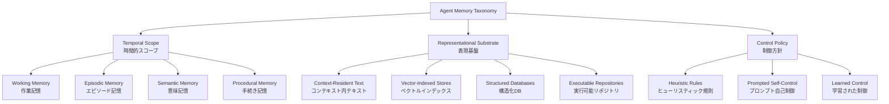
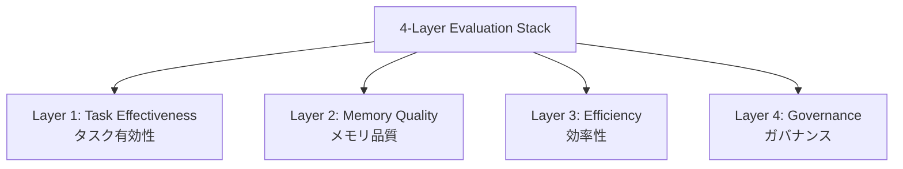

本記事は [arXiv: 2603.07670](https://arxiv.org/abs/2603.07670) の解説記事です。

## 論文概要（Abstract）

本サーベイは、2022年から2026年にかけてのLLMエージェントにおけるメモリシステムの研究を包括的に整理した論文である。著者であるPengfei Duは、エージェントメモリを「書き込み・管理・読み出し（write-manage-read）」のループとして形式化し、時間的スコープ（temporal scope）、表現基盤（representational substrate）、制御方針（control policy）の3次元からなる分類体系（taxonomy）を提案している。

この分類体系に基づき、5つのコアメカニズムを特定し、それぞれの強み・弱み・適用場面を比較分析している。さらに、LoCoMo、MemBench、MemoryAgentBench、MemoryArenaなどのベンチマークを整理した4層評価スタックを提示し、メモリ研究の10の未解決課題を示している。

著者は「メモリはLLMそのものと同等のエンジニアリング投資に値する」と主張しており、モデルのスケーリングよりもメモリ設計の改善がしばしば大きな性能向上をもたらすことを強調している。

この記事は [Zenn記事: Mem0×pgvectorでCSエージェントに長期記憶を実装しFCRを改善する](https://zenn.dev/0h_n0/articles/16618ab45991ae) の深掘りです。Zenn記事ではMem0とpgvectorを用いたCSエージェントの長期記憶実装を扱っているが、本サーベイはそうした個別のメモリ実装がメモリ研究全体のどこに位置づけられるかを俯瞰的に理解するための枠組みを提供している。

## 情報源

- **arXiv ID**: 2603.07670
- **URL**: [https://arxiv.org/abs/2603.07670](https://arxiv.org/abs/2603.07670)
- **著者**: Pengfei Du
- **発表年**: 2026年3月
- **分野**: cs.AI（人工知能）
- **種別**: サーベイ論文（2022-2026年の研究を対象）

## 背景と動機（Background & Motivation）

LLMは単体では固定長のコンテキストウィンドウ内でしか動作できず、過去の経験を蓄積・活用する能力が本質的に欠如している。著者はこの制約がLLMエージェントの実用化における根本的なボトルネックであると指摘している。

具体的には、以下の課題が存在する：

1. **コンテキストウィンドウの有限性**: LLMのコンテキスト長は増大しているものの、長期にわたるタスク履歴やユーザ嗜好の蓄積には依然として不十分である
2. **メモリ研究の断片化**: 個別のメモリ手法が独自の用語・評価基準で提案されており、統一的な比較・理解が困難になっている
3. **評価手法の未整備**: メモリシステムの性能をどの観点から、どのように測定すべきかのコンセンサスが形成されていない
4. **設計指針の不在**: 特定のユースケースに対してどのメモリ機構を選択すべきかの体系的な指針が存在しない

著者は、認知科学におけるメモリの分類（作業記憶、エピソード記憶、意味記憶、手続き記憶）に着想を得つつ、LLMエージェント固有の技術的制約を考慮した新たな分類体系の必要性を論じている。

## 主要な貢献（Key Contributions）

- **貢献1**: エージェントメモリをwrite-manage-readループとして形式化し、時間的スコープ・表現基盤・制御方針の3次元分類体系を提案
- **貢献2**: 5つのコアメカニズム（Context-Resident Compression、Retrieval-Augmented Memory Stores、Reflective/Self-Improving Memory、Hierarchical Memory、Policy-Learned Management）の特定と比較分析
- **貢献3**: タスク有効性・メモリ品質・効率性・ガバナンスからなる4層評価スタックの提示
- **貢献4**: 10の未解決課題と将来の研究方向の体系的な整理

## 技術的詳細（Technical Details）

### 3次元分類体系（Three-Dimensional Taxonomy）

著者は、エージェントメモリを以下の3つの軸で分類する体系を提案している。この分類は、既存研究の整理と新規メモリシステムの設計指針の両方に機能する。

#### 時間的スコープ（Temporal Scope）

認知科学のメモリ分類に基づき、エージェントメモリの時間的特性を4種に区分している。

**作業記憶（Working Memory）**: 現在のタスク実行中にのみ保持される短期的な情報である。LLMのコンテキストウィンドウ内に直接存在し、タスク完了後は破棄される。具体的には、現在の会話履歴やチェーン・オブ・ソート（Chain-of-Thought）の中間推論ステップがこれに該当する。

**エピソード記憶（Episodic Memory）**: 過去の具体的な経験やインタラクションの記録である。「いつ・どこで・何が起きたか」という文脈情報を保持し、類似状況での意思決定に活用される。CSエージェントにおける過去のチケット対応履歴はエピソード記憶に相当する。

**意味記憶（Semantic Memory）**: 個別の経験から抽象化された一般的な知識や事実である。エピソード記憶の集約・統合によって形成される。例えば、「ユーザAはPythonを好む」「このAPIは午前中にレイテンシが高い」といった集約された知識がこれに該当する。Mem0が扱うユーザプロファイル情報は主に意味記憶に分類される。

**手続き記憶（Procedural Memory）**: タスク遂行のためのスキルや手順の記憶である。具体的には、学習されたツール使用パターン、タスク解決のテンプレート、コード生成のパターンなどが含まれる。Voyagerにおけるスキルライブラリ（検証済みのコードスニペットの蓄積）はこの典型例である。

#### 表現基盤（Representational Substrate）

メモリがどのようなデータ形式で格納されるかを分類する軸である。

**コンテキスト内テキスト（Context-Resident Text）**: LLMのコンテキストウィンドウ内に直接テキストとして保持される。外部ストレージを必要とせず実装が単純であるが、コンテキスト長の制約を受ける。圧縮やサマリ生成によってこの制約を緩和する手法が研究されている。

**ベクトルインデックス（Vector-Indexed Stores）**: テキストをエンベディングに変換し、ベクトルデータベース（pgvector、Pinecone、Chromaなど）に格納する。コサイン類似度やANN（近似最近傍探索）による意味的検索が可能であり、大量のメモリを効率的に管理できる。Mem0やLangChainのメモリモジュールがこの方式を採用している。

**構造化データベース（Structured Databases）**: SQLデータベースやナレッジグラフ（KG）にメモリを格納する。エンティティ間の関係を明示的に表現でき、複雑なクエリによる検索が可能である。MemoryScope（Alibaba）はSQLベースのメモリ管理を実装しており、GraphRAGではナレッジグラフ上のメモリ表現が用いられている。

**実行可能リポジトリ（Executable Repositories）**: コードスニペットや実行可能な関数としてメモリを格納する。特にVoyagerのスキルライブラリがこの代表例であり、過去に検証されたコードを再利用することで、同種のタスクを効率的に解決できる。

#### 制御方針（Control Policy）

メモリの書き込み・管理・読み出しのタイミングと方法を決定する機構である。

**ヒューリスティック規則（Heuristic Rules）**: FIFO（先入れ先出し）、LRU（最近最も使われていないものを破棄）、固定サイズのスライディングウィンドウなど、事前定義された規則に基づくメモリ管理である。実装が容易で予測可能であるが、タスクの文脈に適応できない。

**プロンプト自己制御（Prompted Self-Control）**: LLM自身にメモリの管理を委ねる方式である。「この情報を記憶すべきか」「どの記憶を検索すべきか」といった判断をプロンプトを通じてLLMに行わせる。MemGPTやReflexionがこのアプローチを採用しており、柔軟性が高いがLLMの推論コストが発生する。

**学習された制御（Learned Control）**: 強化学習（RL）やメタ学習によってメモリ操作の方針を獲得する方式である。著者は、メモリ操作をMDP（マルコフ決定過程）として定式化し、報酬信号に基づいて最適なメモリ戦略を学習するアプローチを紹介している。理論的には最も高性能だが、訓練データの確保と計算コストが課題である。

### 5つのコアメカニズム（Five Core Mechanisms）

著者は上記の分類体系に基づき、既存研究を5つのコアメカニズムに整理している。

#### メカニズム1: Context-Resident Compression（コンテキスト内圧縮）

コンテキストウィンドウ内に収まるようにメモリを圧縮・要約する手法群である。

著者は以下の主要なアプローチを挙げている：

- **サマリベース圧縮**: 過去の会話履歴を要約してコンテキストに保持する。ConversationSummaryMemory（LangChain）がこの実装例である
- **トークンレベル圧縮**: 重要度の低いトークンを選択的に削除または結合する
- **KVキャッシュ圧縮**: Transformerの注意機構で使用されるKey-Valueキャッシュを圧縮し、実質的なコンテキスト長を拡張する

この手法の利点は外部ストレージが不要で遅延が小さいことであるが、圧縮時に情報が失われるリスクがある。著者は「圧縮の粒度と情報保持のトレードオフが未解決の課題」と述べている。

#### メカニズム2: Retrieval-Augmented Memory Stores（検索拡張メモリストア）

外部メモリストアに情報を格納し、必要に応じて検索・取得する手法群である。RAG（Retrieval-Augmented Generation）の枠組みを記憶管理に応用したものと位置づけられる。

主要な構成要素は以下の通りである：

- **エンベディングと格納**: テキスト情報をベクトル表現に変換し、ベクトルDBに格納する
- **検索**: クエリに対してコサイン類似度やANNで関連するメモリを取得する
- **再ランキング**: 検索結果を関連度や新しさで再順位付けする

Mem0（Zenn記事で扱われている）はこのメカニズムの代表的な実装であり、pgvectorをバックエンドとしたベクトルインデックス型メモリストアを提供している。著者は、単純なベクトル検索では「意味的に類似しているが文脈的に無関係な記憶」が検索される問題を指摘し、因果的に基盤づけられた検索（causally grounded retrieval）の必要性を論じている。

#### メカニズム3: Reflective/Self-Improving Memory（反省型・自己改善メモリ）

エージェントが自身の経験を振り返り、メモリの内容を更新・改善する手法群である。

- **Reflexion**: タスク失敗時にエージェント自身が失敗原因を分析し、次回の行動に活かす「言語的強化学習」を提案。失敗の振り返りをテキストとしてメモリに蓄積する
- **Generative Agents**: 個別のエピソード記憶を定期的に振り返り、より高次の抽象的な洞察（意味記憶）に統合する「リフレクション」プロセスを導入
- **CLIN（Continually Learning from Interactions）**: タスク間で持続するメモリを通じて、逐次的にタスクパフォーマンスを改善する

著者は反省型メモリの強みとして「エピソード記憶から意味記憶への自動的な昇華」を挙げる一方、「反省の品質がLLMの推論能力に依存する」という脆弱性と、「幻覚に基づく誤った反省が蓄積するリスク（trustworthy reflection問題）」を課題として指摘している。

#### メカニズム4: Hierarchical Memory（階層型メモリ）

MemGPTに代表される、複数のメモリ階層を持ち、OSのメモリ管理に着想を得た手法群である。

MemGPTは以下の階層構造を持つ：

- **メインコンテキスト（Main Context）**: LLMのコンテキストウィンドウに相当する。直接参照可能だが容量に制限がある
- **アーカイバルストレージ（Archival Storage）**: 大容量の外部メモリ。必要に応じてメインコンテキストにページインされる

この設計により、LLMのコンテキスト長の制約を超えた大量の情報を管理できる。著者は、OSの仮想メモリとの類比において、「ページフォールト」に相当するメモリアクセスパターンの最適化が重要な課題であると述べている。

階層型メモリの発展形として、作業記憶・短期記憶・長期記憶の3階層を持つアーキテクチャや、メモリ階層間の情報移動をLLM自身が制御するアプローチも紹介されている。

#### メカニズム5: Policy-Learned Management（方策学習型管理）

メモリ操作（何を記憶するか、いつ忘却するか、どう更新するか）をRL（強化学習）やメタ学習によって最適化する手法群である。

著者は、メモリ管理をMDPとして定式化する枠組みを紹介している：

- **状態$$s$$**: 現在のメモリ状態とタスク状態の組
- **行動$$a$$**: 書き込み、読み出し、更新、削除などのメモリ操作
- **報酬$$r$$**: 下流タスクの成功率やメモリ効率に基づく報酬信号
- **方策$$\pi(a \mid s)$$**: 状態に応じた最適なメモリ操作の選択

この方式はタスクに適応的なメモリ管理を実現できる可能性があるが、著者は「報酬信号の設計が困難」「訓練時の計算コストが高い」「汎化性能の保証が難しい」といった課題を挙げている。現時点では研究段階であり、プロンプト自己制御と比較した明確な優位性が実証されたユースケースは限定的であると述べている。

### 評価手法（Evaluation Methodologies）

著者は、メモリシステムの評価を4層のスタックとして体系化している。

**Layer 1 - タスク有効性（Task Effectiveness）**: メモリシステムが下流タスクの性能をどれだけ改善するかを測定する。タスク完了率、正解率、ユーザ満足度などの指標が含まれる。

**Layer 2 - メモリ品質（Memory Quality）**: 格納されたメモリの正確性、関連性、一貫性を評価する。メモリの検索精度（Precision/Recall）、メモリ間の矛盾検出、時間経過に伴うメモリの劣化度などが指標となる。

**Layer 3 - 効率性（Efficiency）**: メモリ操作の計算コスト、ストレージコスト、レイテンシを測定する。特にベクトル検索のスケーラビリティやメモリ圧縮率が重要な指標である。

**Layer 4 - ガバナンス（Governance）**: プライバシー保護、メモリの透明性、忘却の権利（right to be forgotten）への準拠を評価する。特に個人情報を含むメモリの管理においてGDPRなどの規制への適合性が問われる。

#### 主要ベンチマーク

著者は以下のベンチマークを整理している：

- **LoCoMo**: 長期会話における記憶保持と活用能力を評価する。複数セッションにわたる対話での事実記憶、推論、一貫性を測定する
- **MemBench**: メモリシステムの基本的な読み書き能力を体系的に評価する。記憶の格納・検索・更新・削除の各操作を個別にテストする
- **MemoryAgentBench**: エージェントのメモリ操作を現実的なタスクシナリオで評価する。カスタマーサポート、コード補完、個人アシスタントなどのドメインを含む
- **MemoryArena**: 動的な環境でのメモリ管理能力を評価する。環境の変化に応じたメモリの更新と古い情報の忘却を測定する

著者は、既存ベンチマーク間の比較可能性が低いことを課題として指摘し、標準化された評価プロトコルの必要性を強調している。

## 実装のポイント（Implementation Considerations）

本サーベイはメモリシステムの直接的な実装を提供するものではないが、著者の分析からユースケースに応じたメモリ機構の選択指針を抽出できる。

### ユースケース別メモリ機構の選択

**短期的なタスク（単一セッション内で完結）**: Context-Resident Compressionが適している。外部依存がなく実装が単純であり、コンテキストウィンドウ内で収まるタスクでは十分な性能を発揮する。

**長期的なユーザインタラクション（CSエージェント、個人アシスタント）**: Retrieval-Augmented Memory Storesが基本選択となる。Mem0+pgvectorの構成はこのカテゴリに該当し、ユーザの嗜好や過去の対応履歴をベクトル検索で効率的に取得できる。エピソード記憶と意味記憶の両方を管理する必要がある場合は、Reflective Memoryの併用を検討すべきである。

**大規模な知識管理が必要な場合**: Hierarchical Memory（MemGPT方式）が有効である。コンテキスト長を超える大量の情報を階層的に管理し、必要な情報を動的にロードする。

**適応的なスキル獲得が必要な場合**: 手続き記憶としてExecutable Repositoriesを選択し、Reflective Memoryで継続的にスキルを改善する。Voyagerのスキルライブラリがこのパターンの実証例である。

### 設計時の考慮事項

著者の分析に基づく設計上の重要ポイントは以下の通りである：

1. **メモリの粒度**: 細粒度（個別の発話単位）vs 粗粒度（セッション単位）のトレードオフ。細粒度は検索精度が高いがストレージコストが増大する
2. **更新戦略**: 追記型（append-only）vs 上書き型（update-in-place）。矛盾する情報が蓄積される問題への対処が必要
3. **忘却メカニズム**: 不要な情報を適切に削除する仕組みの設計。現状では時間ベースの減衰が多いが、因果的な重要度に基づく忘却が望ましいと著者は述べている

## 実験結果・ベンチマーク比較（Results & Benchmark Analysis）

本サーベイは実験論文ではなく既存研究の体系化であるが、著者は各メカニズムの比較分析において以下の知見を整理している。

### 代表的な成果の比較

| メカニズム | 代表システム | 報告された主要成果 |
|---|---|---|
| Context-Resident Compression | ConversationSummaryMemory | コンテキスト長削減、情報損失リスクあり |
| Retrieval-Augmented | Mem0, MemoryScope | ユーザ嗜好の長期保持、検索精度が性能を左右 |
| Reflective/Self-Improving | Reflexion, Generative Agents | 試行回数の削減、反省品質がLLM依存 |
| Hierarchical | MemGPT | コンテキスト長の実質的拡張 |
| Policy-Learned | RL-based approaches | 適応的管理、訓練コスト高 |

### Voyagerの事例

著者が特に注目する事例として、Voyager（Minecraft環境でのLLMエージェント）を挙げている。Voyagerは手続き記憶としてのスキルライブラリを実装し、ベースラインと比較して**15.3倍高速**にタスクを達成したと報告されている。この結果は、適切なメモリ設計がモデルスケーリングよりも大きな効果を持ちうることの実証例として紹介されている。

### ベンチマーク間の課題

著者は、LoCoMo、MemBench、MemoryAgentBench、MemoryArenaの各ベンチマークが異なる評価観点に焦点を当てており、横断的な比較が困難であることを指摘している。特に以下の点が課題として挙げられている：

- 評価指標の統一性の欠如（タスク完了率、検索精度、応答品質など混在）
- テストシナリオの多様性不足（特定ドメインに偏る傾向）
- 長期間にわたるメモリ劣化の評価が不十分

## 実運用への応用（Practical Applications）

著者はメモリシステムの応用分野として以下を体系的に整理している。

### カスタマーサポート（CS）エージェント

CSエージェントにおけるメモリの役割は多面的である。著者の分類に照らすと：

- **エピソード記憶**: 過去のチケット対応履歴の蓄積。「この顧客は以前同じ問題で問い合わせた」という認識を可能にする
- **意味記憶**: ユーザプロファイル（利用プラン、技術レベル、好みの連絡手段など）の集約
- **手続き記憶**: 対応手順テンプレートの蓄積と改善

Zenn記事で扱われているMem0+pgvectorの構成は、Retrieval-Augmented Memory Storesメカニズムを用いてエピソード記憶と意味記憶を管理するアプローチに相当する。著者の分析に基づけば、CSエージェントの更なる改善にはReflective Memoryの導入（成功・失敗した対応からの学習）が有効と考えられる。

### コーディングエージェント

コーディングエージェントでは、手続き記憶（コードパターン、デバッグ手順）とエピソード記憶（過去のバグ修正履歴）の組み合わせが重要である。著者は、コードの文脈ではベクトル検索よりも構造化データベース（AST解析やコールグラフに基づく検索）が効果的な場合があると述べている。

### ゲームエージェント

Voyagerに代表されるゲームエージェントでは、手続き記憶（スキルライブラリ）が中心的な役割を果たす。探索と活用のバランスにおいて、既存のスキルの再利用（活用）と新しいスキルの獲得（探索）の制御方針が性能を大きく左右する。

### 科学推論エージェント

科学推論では、意味記憶（既知の科学的事実）と手続き記憶（実験手順、分析手法）の階層的な管理が求められる。著者は、この分野ではメモリの正確性が特に重要であり、幻覚に基づく誤った記憶の混入が致命的な結果をもたらす可能性を指摘している。

### マルチエージェントシステム

複数のエージェントが協調する場合、個々のエージェントのメモリに加えて共有メモリの設計が必要となる。著者は、マルチエージェント環境でのメモリガバナンス（誰がどのメモリにアクセスできるか、矛盾するメモリの調停方法）が未解決の課題であると述べている。

## 関連研究（Related Work）

著者は本サーベイを既存のサーベイ論文と以下のように位置づけている。

RAGに関するサーベイ（Gao et al., 2024など）は検索拡張生成を包括的に扱っているが、メモリの時間的スコープや制御方針の分析は含まれていない。LLMエージェント全般のサーベイ（Wang et al., 2024; Xi et al., 2023など）はメモリを一構成要素として扱うに留まり、メモリ機構に特化した深い分析は行っていない。

本サーベイの差別化ポイントは、メモリを「LLMエージェントの中核的な設計要素」として独立に扱い、3次元の分類体系と4層の評価スタックを提示した点にある。著者は「メモリに特化したサーベイは本論文が初」と主張している。

## まとめと今後の展望（Conclusion & Future Directions）

### 論文の結論

著者は「メモリはLLMそのものと同等のエンジニアリング投資に値する（Memory deserves the same level of engineering investment as the LLM itself）」と結論づけている。モデルのスケーリング（パラメータ数の増加、コンテキスト長の拡張）だけでは解決できない問題が多く、メモリ設計の改善がしばしばより大きな性能向上をもたらすことを、Voyagerの15.3倍高速化などの事例を通じて示している。

### 10の未解決課題

著者が特定した10の未解決課題（Open Challenges）は以下の通りである：

1. **継続的統合（Continual Consolidation）**: エピソード記憶から意味記憶への自動的・継続的な統合メカニズムの開発。現状は手動またはバッチ処理に依存しており、リアルタイムでの統合は実現されていない

2. **因果的に基盤づけられた検索（Causally Grounded Retrieval）**: 意味的類似性だけでなく、因果関係に基づくメモリ検索の実現。「似ている」ではなく「関連がある」記憶を取得する能力

3. **信頼できる反省（Trustworthy Reflection）**: LLMによる反省プロセスの信頼性向上。幻覚に基づく誤った反省の防止と検出メカニズムの開発

4. **学習された忘却（Learned Forgetting）**: 不要な情報を適切に忘却するメカニズムの開発。時間ベースの単純な減衰ではなく、情報の重要度と文脈に基づく忘却

5. **マルチモーダル身体化メモリ（Multimodal Embodied Memory）**: テキストだけでなく、画像・音声・身体的経験を含むメモリの統合管理

6. **マルチエージェントガバナンス（Multi-Agent Governance）**: 複数エージェント間でのメモリ共有・アクセス制御・矛盾解消の枠組み

7. **メモリ効率性（Memory Efficiency）**: 大規模メモリストアの検索・更新のスケーラビリティ。ストレージコストと検索速度のトレードオフの最適化

8. **神経科学との統合（Neuroscience Integration）**: 人間の記憶メカニズム（海馬での記憶固定化、睡眠中の記憶統合など）からの更なるインスピレーションの獲得

9. **メモリのための基盤モデル（Foundation Models for Memory）**: メモリ操作に特化した基盤モデルの開発。汎用LLMではなく、メモリの格納・検索・管理に最適化されたモデル

10. **標準化された評価（Standardized Evaluation）**: メモリシステムの比較可能な評価プロトコルとベンチマークスイートの策定

これらの課題は、LLMエージェントのメモリ研究が依然として初期段階にあることを示している。特に課題2（因果的検索）と課題3（信頼できる反省）は、現在のMem0やMemGPTといった実用システムの性能向上に直結する課題であり、今後の研究進展が期待される。

## 参考文献

- Du, P. (2026). Memory for Autonomous LLM Agents: Mechanisms, Evaluation, and Emerging Frontiers. arXiv:2603.07670. [https://arxiv.org/abs/2603.07670](https://arxiv.org/abs/2603.07670)
- Park, J. S., et al. (2023). Generative Agents: Interactive Simulacra of Human Behavior. UIST 2023.
- Shinn, N., et al. (2023). Reflexion: Language Agents with Verbal Reinforcement Learning. NeurIPS 2023.
- Packer, C., et al. (2023). MemGPT: Towards LLMs as Operating Systems. arXiv:2310.08560.
- Wang, G., et al. (2023). Voyager: An Open-Ended Embodied Agent with Large Language Models. arXiv:2305.16291.
- Gao, Y., et al. (2024). Retrieval-Augmented Generation for Large Language Models: A Survey. arXiv:2312.10997.
