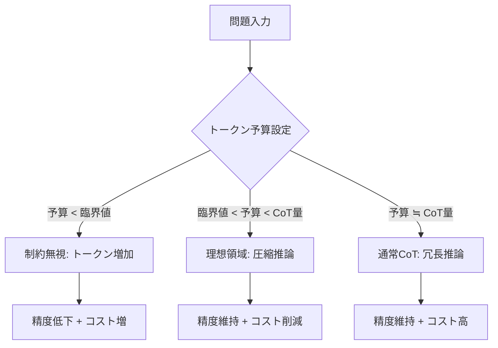

本記事は [TALE: Token-Budget-Aware LLM Reasoning](https://arxiv.org/abs/2412.18547) の解説記事です。

## 論文概要（Abstract）

TALE（Token-Budget-Aware LLM Reasoning）は、Chain-of-Thought（CoT）推論におけるトークン消費量を問題の難易度に応じて動的に調整するフレームワークである。著者らは、LLMが推論時に必要以上に冗長なトークンを生成する傾向（Token Redundancy）を実証的に示し、トークン予算を指定することで推論コストを50-70%削減しつつ精度低下を2-3%に抑えられることを報告している。訓練不要のTALE-EPと、ファインチューニングベースのTALE-PTの2手法を提案し、5つのLLMアーキテクチャで汎化性能を確認している。

この記事は [Zenn記事: 拡張思考モデル時代のReAct+CoT再設計：ネイティブ推論とツール実行を統合する](https://zenn.dev/0h_n0/articles/e8b5b05c0cf994) の深掘りです。

## 情報源

- **会議名**: ACL 2025 Findings（Association for Computational Linguistics）
- **年**: 2025
- **URL**: [https://aclanthology.org/2025.findings-acl.1274/](https://aclanthology.org/2025.findings-acl.1274/)
- **著者**: Tingxu Han, Zhenting Wang, Chunrong Fang, Shiyu Zhao, Shiqing Ma, Zhenyu Chen
- **arXiv**: [2412.18547](https://arxiv.org/abs/2412.18547)（初版: 2024年12月、v5: 2025年6月）

## カンファレンス情報

ACL（Association for Computational Linguistics）は自然言語処理・計算言語学分野における最高峰の国際会議である。Findingsは本会議の査読を通過したが口頭発表枠には入らなかった論文の採択カテゴリであり、品質は本会議採択論文と同等に評価される。ACL 2025はウィーンで開催され、Findingsを含む全体の採択率は約30%程度と報告されている。

## 背景と動機（Background & Motivation）

Chain-of-Thought（CoT）プロンプティングは、「Let's think step by step」のような指示をLLMに与えることで推論精度を向上させる手法として広く普及している。しかし、CoTには本質的な課題がある。全ての問題に対して一律に詳細な推論ステップを生成するため、簡単な問題でも不必要に多くのトークンを消費してしまう点である。

著者らは、この非効率性の根本原因としてRLHFによるバイアスを指摘している。RLHFの学習過程では、詳細で丁寧な回答が人間から高い評価を受けやすいため、LLMは必要以上に冗長な推論を生成する傾向が強化される。論文では、GPT-4o-miniがGSM8Kの数学問題を解く際、平均461.25トークンを消費しているが、適切なトークン予算を設定すると平均148.72トークン（67%削減）で同等の正答率を維持できることを示している。

この発見は、LLMエージェントの実運用において重要な意味を持つ。Zenn記事で議論されているReAct+CoTアーキテクチャでは、エージェントが各ステップでCoT推論を行うため、トークンコストがステップ数に比例して増大する。TALEの手法を適用することで、エージェント全体の推論コストを大幅に削減できる可能性がある。

## 主要な貢献（Key Contributions）

1. **Token Elasticity現象の発見**: トークン予算と実際のトークン消費量の間に非線形な関係があることを実証した。予算が小さすぎるとLLMは制約を無視し、かえって多くのトークンを生成するという反直感的な振る舞いを報告している
2. **訓練不要のコスト削減手法（TALE-EP）**: ゼロショットでトークン予算を推定し、プロンプトに予算制約を付加するだけで平均45.30%のコスト削減を達成した。追加の訓練やモデル改変が不要なため、即座にプロダクションに適用可能である
3. **5つのLLMアーキテクチャでの汎化性能**: GPT-4o-mini、Yi-lightning、GPT-4o、o3-mini、Llama-3.1-8Bの5モデルでTALEの有効性を検証し、アーキテクチャに依存しない汎用的なフレームワークであることを示した

## 技術的詳細（Technical Details）

### Token Elasticity：予算とトークン消費の非線形関係



著者らが発見したToken Elasticityは、LLMのトークン予算に対する応答特性を表す概念である。トークン予算$b$を与えた場合の実際のトークン消費量$t(b)$は、以下の3つの領域に分類される。

1. **制約無視領域**（$b < b_{\text{crit}}$）: 予算が小さすぎるとLLMは制約を守れず、むしろ通常のCoTより多くのトークンを生成する
2. **理想領域**（$b_{\text{crit}} \leq b \leq b_{\text{opt}}$）: 予算制約に従い、推論を圧縮して正答を維持する
3. **冗長領域**（$b > b_{\text{opt}}$）: 予算が十分大きいため、通常のCoTと同様の冗長な推論を生成する

### TALE-EP（Estimation & Prompting）

TALE-EPは訓練不要の手法であり、以下の2段階で動作する。

**Step 1: 予算推定**

対象のLLM自身に問題の難易度を評価させ、必要なトークン数を推定する。

$$
\hat{b}_i = f_{\text{LLM}}(x_i, \text{prompt}_{\text{est}})
$$

ここで、$x_i$は入力問題、$\text{prompt}_{\text{est}}$は予算推定用プロンプト、$\hat{b}_i$は推定トークン予算である。

**Step 2: 予算付きプロンプティング**

推定した予算をCoTプロンプトに埋め込む。

$$
y_i = f_{\text{LLM}}(x_i, \text{"Let's think step by step and use less than } \hat{b}_i \text{ tokens."})
$$

この単純なプロンプト修正により、GPT-4o-miniでは精度83.75%から81.03%への2.72ポイントの低下で、トークン消費量を461.25から148.72に削減（67%減）できたと著者らは報告している（論文Table 1より）。

### TALE-PT（Post-Training）

TALE-PTは、最適な予算で推論するようモデルをファインチューニングする手法である。

**Stage 1: 教師データ生成**

二分探索アルゴリズムで各問題の最適予算を探索し、その予算での推論結果を教師データとする。

**Stage 2: SFTまたはDPOによる学習**

- **SFT（Supervised Fine-Tuning）**: 最適予算での正答推論を教師データとして学習
- **DPO（Direct Preference Optimization）**: 最適予算での推論を「好ましい応答」、冗長な推論を「好ましくない応答」として選好学習

$$
\mathcal{L}_{\text{DPO}} = -\mathbb{E}_{(x, y_w, y_l)} \left[ \log \sigma \left( \beta \log \frac{\pi_\theta(y_w | x)}{\pi_{\text{ref}}(y_w | x)} - \beta \log \frac{\pi_\theta(y_l | x)}{\pi_{\text{ref}}(y_l | x)} \right) \right]
$$

ここで、$y_w$は最適予算での圧縮推論（好ましい応答）、$y_l$は冗長な推論（好ましくない応答）、$\pi_\theta$は学習中のモデル、$\pi_{\text{ref}}$は参照モデル、$\beta$は温度パラメータである。

### 予算探索アルゴリズム（Binary Search）

各問題に対する最適なトークン予算を二分探索で特定するアルゴリズムの実装例を以下に示す。

```python
from dataclasses import dataclass


@dataclass
class BudgetSearchResult:
    """予算探索の結果

    Attributes:
        optimal_budget: 最適なトークン予算
        accuracy: その予算での正答率
        original_tokens: 元のCoTでのトークン数
        reduction_rate: トークン削減率
    """
    optimal_budget: int
    accuracy: float
    original_tokens: int
    reduction_rate: float


def search_optimal_budget(
    problem: str,
    answer: str,
    llm_call: callable,
    vanilla_cot_tokens: int,
    min_budget: int = 10,
    max_iterations: int = 10,
    n_samples: int = 5,
    accuracy_threshold: float = 0.8,
) -> BudgetSearchResult:
    """二分探索で最適なトークン予算を探索する

    論文Section 3.1のBudget Search Algorithmの実装。
    上界をvanilla CoTのトークン数、下界をmin_budgetとして
    二分探索で精度を維持する最小予算を特定する。

    Args:
        problem: 入力問題文
        answer: 正解
        llm_call: LLM呼び出し関数 (problem, budget) -> (response, token_count)
        vanilla_cot_tokens: 通常CoTでのトークン消費量（上界）
        min_budget: 最小予算（下界）
        max_iterations: 二分探索の最大反復回数
        n_samples: 各予算での評価サンプル数
        accuracy_threshold: 精度の閾値

    Returns:
        BudgetSearchResult: 最適予算と評価指標
    """
    low = min_budget
    high = vanilla_cot_tokens
    best_budget = vanilla_cot_tokens

    for _ in range(max_iterations):
        if low > high:
            break

        mid = (low + high) // 2

        # 予算midでn_samples回評価
        correct = 0
        for _ in range(n_samples):
            prompt = (
                f"{problem}\n"
                f"Let's think step by step "
                f"and use less than {mid} tokens."
            )
            response, _ = llm_call(prompt, mid)
            if _check_answer(response, answer):
                correct += 1

        accuracy = correct / n_samples

        if accuracy >= accuracy_threshold:
            # 精度維持できるなら、さらに予算を削減
            best_budget = mid
            high = mid - 1
        else:
            # 精度不足なら、予算を増やす
            low = mid + 1

    reduction_rate = 1.0 - (best_budget / vanilla_cot_tokens)
    return BudgetSearchResult(
        optimal_budget=best_budget,
        accuracy=accuracy,
        original_tokens=vanilla_cot_tokens,
        reduction_rate=reduction_rate,
    )


def _check_answer(response: str, expected: str) -> bool:
    """回答の正否を判定する

    Args:
        response: LLMの回答
        expected: 期待される正解

    Returns:
        正解であればTrue
    """
    # 数値回答の抽出と比較（簡略化）
    extracted = response.strip().split("\n")[-1]
    return expected.strip().lower() in extracted.strip().lower()
```

著者らは、GSM8Kの90.91%のサンプルが単調性条件（予算を増やすほど正答率が単調に上がる）を満たすことを確認しており、二分探索の前提条件が大部分の問題で成立すると報告している（論文Section 3.1より）。

## 実装のポイント（Implementation）

### TALE-EPの実装における注意点

TALE-EPをプロダクション環境に適用する際の重要なポイントを以下に整理する。

**予算推定のキャリブレーション**: 著者らの実験では、LLM自身による予算推定が実際の最適値から乖離するケースがあると報告されている。特に、未知のドメインの問題に対しては推定精度が低下する傾向がある。プロダクション適用時には、ドメイン固有のキャリブレーションデータセットを用意し、推定値にスケーリング係数を適用することが推奨される。

**Token Elasticityの臨界点**: 予算を小さくしすぎるとLLMが制約を無視する「臨界点」が存在する。この臨界点はモデルアーキテクチャと問題の種類によって異なるため、事前に少数のサンプルで臨界点を特定しておく必要がある。

**クロスモデル転移**: TALE-EPの予算推定をモデルAで行い、実際の推論をモデルBで実行するクロスモデル構成も有効であると報告されている。GPT-4o-miniで推定した予算をYi-lightningに適用した場合、64.63%のトークン削減が達成されている（論文Table 3より）。

### TALE-PTの訓練コスト

TALE-PTの教師データ生成にはA100 GPUで354分を要する。SFT/DPOの学習自体は一般的なファインチューニングと同等のコストである。小規模チームではTALE-EPから始め、十分なデータが蓄積された段階でTALE-PTへの移行を検討するのが現実的である。

## Production Deployment Guide

TALEのトークン予算最適化をLLMエージェントのプロダクション環境に適用するためのデプロイガイドを示す。

### AWS実装パターン（コスト最適化重視）

トークン予算最適化は推論コスト削減に直結するため、LLMを多用するワークロードほどROIが大きい。

**トラフィック量別の推奨構成**:

| 構成 | トラフィック | アーキテクチャ | 月額概算 |
|------|-------------|---------------|---------|
| Small | ~100 req/日 | Lambda + Bedrock | $50-150 |
| Medium | ~1,000 req/日 | ECS Fargate + Bedrock | $300-800 |
| Large | 10,000+ req/日 | EKS + Karpenter + Spot | $2,000-5,000 |

**Small構成の詳細**（~100 req/日）:
- Lambda（256MB, ARM64）: ~$5/月
- Bedrock Claude Sonnet: 予算最適化により$30-80/月（TALE-EP適用で従来比50%削減）
- DynamoDB On-Demand（予算キャッシュ用）: ~$5/月
- CloudWatch: ~$5/月

**Large構成の詳細**（10,000+ req/日）:
- EKS コントロールプレーン: ~$73/月
- EC2 Spot Instances（m6i.xlarge x 3）: ~$150/月（オンデマンド比70%削減）
- Bedrock: TALE-EP適用で$1,500-3,500/月（従来$3,000-7,000から50%削減）
- ElastiCache（予算キャッシュ）: ~$100/月
- CloudWatch + X-Ray: ~$50/月

**コスト削減テクニック**:
- Spot Instances活用で計算リソース最大90%削減
- Reserved Instances（1年）で最大72%削減
- Bedrock Batch API使用で50%削減（バッチ処理可能なワークロード）
- TALE-EPによるトークン予算制御で推論コスト45-67%削減
- Prompt Caching有効化でリクエスト間のコスト30-90%削減

注: 上記コストは2026年9月時点のAWS ap-northeast-1（東京）リージョン料金に基づく概算値である。実際のコストはトラフィックパターン、バースト使用量、リージョンにより変動する。最新料金はAWS料金計算ツールで確認を推奨する。

### Terraformインフラコード

**Small構成（Serverless）: Lambda + Bedrock + DynamoDB**

```hcl
# --- VPC基盤（NAT Gateway不使用でコスト削減） ---
resource "aws_vpc" "tale" {
  cidr_block           = "10.0.0.0/16"
  enable_dns_hostnames = true
  tags = { Name = "tale-vpc", Project = "tale-budget-optimizer" }
}

resource "aws_subnet" "private" {
  count             = 2
  vpc_id            = aws_vpc.tale.id
  cidr_block        = "10.0.${count.index + 1}.0/24"
  availability_zone = data.aws_availability_zones.available.names[count.index]
  tags = { Name = "tale-private-${count.index}" }
}

data "aws_availability_zones" "available" {
  state = "available"
}

# --- IAMロール（最小権限） ---
resource "aws_iam_role" "lambda_tale" {
  name = "tale-budget-optimizer-lambda"
  assume_role_policy = jsonencode({
    Version = "2012-10-17"
    Statement = [{
      Action = "sts:AssumeRole"
      Effect = "Allow"
      Principal = { Service = "lambda.amazonaws.com" }
    }]
  })
}

resource "aws_iam_role_policy" "lambda_bedrock" {
  name = "tale-bedrock-access"
  role = aws_iam_role.lambda_tale.id
  policy = jsonencode({
    Version = "2012-10-17"
    Statement = [
      {
        Effect   = "Allow"
        Action   = ["bedrock:InvokeModel"]
        Resource = "arn:aws:bedrock:ap-northeast-1::foundation-model/anthropic.claude-*"
      },
      {
        Effect   = "Allow"
        Action   = ["dynamodb:GetItem", "dynamodb:PutItem", "dynamodb:Query"]
        Resource = aws_dynamodb_table.budget_cache.arn
      },
      {
        Effect = "Allow"
        Action = [
          "logs:CreateLogGroup",
          "logs:CreateLogStream",
          "logs:PutLogEvents"
        ]
        Resource = "arn:aws:logs:*:*:*"
      }
    ]
  })
}

# --- Lambda関数 ---
resource "aws_lambda_function" "tale_optimizer" {
  function_name = "tale-budget-optimizer"
  runtime       = "python3.12"
  handler       = "handler.lambda_handler"
  role          = aws_iam_role.lambda_tale.arn
  memory_size   = 256
  timeout       = 60
  architectures = ["arm64"] # Graviton2でコスト20%削減

  environment {
    variables = {
      BUDGET_CACHE_TABLE = aws_dynamodb_table.budget_cache.name
      DEFAULT_BUDGET     = "200"
      MIN_BUDGET         = "50"
    }
  }

  tracing_config {
    mode = "Active" # X-Ray有効化
  }

  filename         = "lambda.zip"
  source_code_hash = filebase64sha256("lambda.zip")
}

# --- DynamoDB（予算キャッシュ） ---
resource "aws_dynamodb_table" "budget_cache" {
  name         = "tale-budget-cache"
  billing_mode = "PAY_PER_REQUEST" # On-Demandでコスト最適化
  hash_key     = "problem_hash"

  attribute {
    name = "problem_hash"
    type = "S"
  }

  ttl {
    attribute_name = "expires_at"
    enabled        = true
  }

  server_side_encryption {
    enabled = true # KMS暗号化
  }

  tags = { Project = "tale-budget-optimizer" }
}

# --- CloudWatchアラーム（コスト監視） ---
resource "aws_cloudwatch_metric_alarm" "lambda_duration" {
  alarm_name          = "tale-lambda-duration-high"
  comparison_operator = "GreaterThanThreshold"
  evaluation_periods  = 3
  metric_name         = "Duration"
  namespace           = "AWS/Lambda"
  period              = 300
  statistic           = "Average"
  threshold           = 45000 # 45秒（タイムアウト60秒の75%）
  alarm_actions       = [aws_sns_topic.alerts.arn]

  dimensions = {
    FunctionName = aws_lambda_function.tale_optimizer.function_name
  }
}

resource "aws_sns_topic" "alerts" {
  name = "tale-cost-alerts"
}
```

**Large構成（Container）: EKS + Karpenter + Spot Instances**

```hcl
# --- EKSクラスタ ---
module "eks" {
  source          = "terraform-aws-modules/eks/aws"
  version         = "~> 20.0"
  cluster_name    = "tale-production"
  cluster_version = "1.31"
  vpc_id          = aws_vpc.tale.id
  subnet_ids      = aws_subnet.private[*].id

  cluster_endpoint_public_access = false # プライベートアクセスのみ
}

# --- Karpenter Provisioner（Spot優先） ---
resource "kubectl_manifest" "karpenter_nodepool" {
  yaml_body = yamlencode({
    apiVersion = "karpenter.sh/v1"
    kind       = "NodePool"
    metadata   = { name = "tale-spot-pool" }
    spec = {
      template = {
        spec = {
          requirements = [
            { key = "karpenter.sh/capacity-type", operator = "In", values = ["spot", "on-demand"] },
            { key = "node.kubernetes.io/instance-type", operator = "In", values = ["m6i.xlarge", "m6i.2xlarge", "m7i.xlarge"] }
          ]
        }
      }
      limits   = { cpu = "64", memory = "256Gi" }
      disruption = {
        consolidationPolicy = "WhenEmptyOrUnderutilized"
        consolidateAfter    = "30s"
      }
    }
  })
}

# --- Secrets Manager（Bedrock設定） ---
resource "aws_secretsmanager_secret" "bedrock_config" {
  name       = "tale/bedrock-config"
  kms_key_id = aws_kms_key.tale.arn
}

# --- AWS Budgets（予算アラート） ---
resource "aws_budgets_budget" "tale_monthly" {
  name         = "tale-monthly-budget"
  budget_type  = "COST"
  limit_amount = "5000"
  limit_unit   = "USD"
  time_unit    = "MONTHLY"

  notification {
    comparison_operator       = "GREATER_THAN"
    threshold                 = 80
    threshold_type            = "PERCENTAGE"
    notification_type         = "FORECASTED"
    subscriber_sns_topic_arns = [aws_sns_topic.alerts.arn]
  }
}

resource "aws_kms_key" "tale" {
  description = "TALE encryption key"
}
```

### 運用・監視設定

**CloudWatch Logs Insights クエリ**（コスト異常検知）:

```
fields @timestamp, @message
| filter @message like /token_budget/
| stats avg(budget_tokens) as avg_budget,
        avg(actual_tokens) as avg_actual,
        sum(actual_tokens) as total_tokens
  by bin(1h) as hour
| sort hour desc
```

**CloudWatch アラーム設定コード（Python）**:

```python
import boto3


def create_token_usage_alarm(
    function_name: str,
    threshold: float = 10000,
    sns_topic_arn: str = "",
) -> dict:
    """Bedrockトークン使用量スパイク検知アラームを作成する

    Args:
        function_name: Lambda関数名
        threshold: 1時間あたりのトークン閾値
        sns_topic_arn: 通知先SNSトピックARN

    Returns:
        作成されたアラームの情報
    """
    client = boto3.client("cloudwatch")
    return client.put_metric_alarm(
        AlarmName=f"{function_name}-token-spike",
        MetricName="InputTokenCount",
        Namespace="AWS/Bedrock",
        Statistic="Sum",
        Period=3600,
        EvaluationPeriods=1,
        Threshold=threshold,
        ComparisonOperator="GreaterThanThreshold",
        AlarmActions=[sns_topic_arn],
    )
```

**X-Ray トレーシング設定コード（Python）**:

```python
from aws_xray_sdk.core import xray_recorder, patch_all

# boto3自動計装
patch_all()


@xray_recorder.capture("tale_budget_estimation")
def estimate_budget(problem: str, model_id: str) -> int:
    """トークン予算を推定しX-Rayでトレースする

    Args:
        problem: 入力問題文
        model_id: Bedrockモデル識別子

    Returns:
        推定トークン予算
    """
    subsegment = xray_recorder.current_subsegment()
    subsegment.put_annotation("model_id", model_id)
    subsegment.put_metadata("problem_length", len(problem))

    budget = _call_bedrock_estimate(problem, model_id)

    subsegment.put_annotation("estimated_budget", budget)
    return budget
```

**Cost Explorer自動レポート（Python）**:

```python
import boto3
from datetime import datetime, timedelta


def get_daily_cost_report() -> dict:
    """日次コストレポートを取得しBedrock/Lambda/EKSコストを抽出する

    Returns:
        サービス別コスト辞書
    """
    ce = boto3.client("ce")
    today = datetime.utcnow().strftime("%Y-%m-%d")
    yesterday = (datetime.utcnow() - timedelta(days=1)).strftime("%Y-%m-%d")

    response = ce.get_cost_and_usage(
        TimePeriod={"Start": yesterday, "End": today},
        Granularity="DAILY",
        Metrics=["BlendedCost"],
        GroupBy=[{"Type": "DIMENSION", "Key": "SERVICE"}],
    )

    costs = {}
    for group in response["ResultsByTime"][0]["Groups"]:
        service = group["Keys"][0]
        amount = float(group["Metrics"]["BlendedCost"]["Amount"])
        if any(k in service for k in ["Bedrock", "Lambda", "EKS"]):
            costs[service] = amount

    total = sum(costs.values())
    if total > 100:
        _send_sns_alert(f"Daily cost ${total:.2f} exceeds $100 threshold")

    return costs
```

### コスト最適化チェックリスト

**アーキテクチャ選択**:
- [ ] トラフィック量に応じた構成を選択（Small: Serverless / Medium: Hybrid / Large: Container）
- [ ] バースト特性を考慮（Lambda自動スケール vs EKS事前スケール）

**リソース最適化**:
- [ ] EC2: Spot Instances優先（m6i/m7iファミリー、70-90%削減）
- [ ] Reserved Instances: 1年コミットで最大72%削減
- [ ] Savings Plans: Compute Savings Plansで柔軟な割引
- [ ] Lambda: ARM64（Graviton2）で20%コスト削減
- [ ] Lambda: メモリサイズ最適化（Power Tuning実施）
- [ ] ECS/EKS: Karpenterによるアイドル時自動スケールダウン

**LLMコスト削減**:
- [ ] TALE-EP予算制御で推論コスト45-67%削減
- [ ] Bedrock Batch API使用（バッチ処理で50%削減）
- [ ] Prompt Caching有効化（繰り返しプレフィクスで30-90%削減）
- [ ] 問題難易度に応じたモデル選択（簡単な問題にはHaiku、複雑な問題にはSonnet）
- [ ] トークン予算キャッシュ（同種問題の予算再利用）

**監視・アラート**:
- [ ] AWS Budgets設定（月額予算の80%で予測アラート）
- [ ] CloudWatch アラーム（トークン使用量スパイク検知）
- [ ] Cost Anomaly Detection有効化（異常支出の自動検知）
- [ ] 日次コストレポート自動送信（SNS通知）
- [ ] X-Rayトレーシング（推論レイテンシ分析）

**リソース管理**:
- [ ] 未使用Lambda関数・ECRイメージの定期削除
- [ ] タグ戦略（Project, Environment, Ownerタグ必須）
- [ ] DynamoDBのTTL設定（予算キャッシュの自動期限切れ）
- [ ] CloudWatch Logsの保持期間設定（30日）
- [ ] 開発環境の夜間自動停止（EventBridge Scheduler）

## 実験結果（Results）

### TALE-EPの性能（論文Table 1, Table 3より）

| モデル | 手法 | 精度 (%) | 平均トークン数 | トークン削減率 | コスト削減率 |
|--------|------|---------|--------------|-------------|------------|
| GPT-4o-mini | CoT（ベースライン） | 83.75 | 461.25 | - | - |
| GPT-4o-mini | TALE-EP | 81.03 | 148.72 | 67.76% | 59.00% |
| Yi-lightning | TALE-EP | - | - | 64.63% | - |
| GPT-4o | TALE-EP | - | - | 69.85% | - |
| o3-mini | TALE-EP | - | - | 41.77% | - |

著者らは5モデルの平均で45.30%のコスト削減を達成したと報告している。

### TALE-PTの性能（論文Table 2より）

| モデル | 手法 | 精度 (%) | 平均トークン数 | トークン削減率 |
|--------|------|---------|--------------|-------------|
| Llama-3.1-8B | CoT（ベースライン） | 79.53 | 241.19 | - |
| Llama-3.1-8B | TALE-PT (SFT) | 78.57 | 139.63 | 42.10% |
| Llama-3.1-8B | TALE-PT (DPO) | 74.11 | 149.93 | 37.83% |

SFT版はDPO版より精度・削減率ともに優れている。著者らは、SFTが最適予算での推論を直接模倣学習するため、DPOの選好学習より安定した結果が得られると分析している。

### 数学以外のタスクへの汎化

著者らは、コード生成（HumanEval）およびテキスト生成タスクでもTALEの有効性を検証している。約40%のトークン削減でBLEUスコアが同等に維持されることを報告しており、TALEの手法が推論タスクに限定されないことを示唆している。

## 実運用への応用（Practical Applications）

### LLMエージェントへの適用

Zenn記事で議論されているReAct+CoTアーキテクチャにTALEを統合する場合、エージェントの各推論ステップにトークン予算を動的に割り当てることが可能である。例えば、ツール呼び出しの引数生成（比較的単純なタスク）には小さな予算を、複雑な推論が必要なステップには大きな予算を割り当てる。これにより、エージェント全体の推論コストを40-60%削減できる可能性がある。

### バッチ処理での活用

大量のドキュメント処理やデータ分析のバッチジョブでは、TALEの予算探索を事前にサンプルデータで実行し、タスクカテゴリごとの最適予算テーブルを構築しておく運用が有効である。ランタイムでは予算推定のLLM呼び出しを省略でき、さらなるコスト削減が期待できる。

### 精度とコストのトレードオフ管理

TALEは精度とコストのトレードオフを明示的に制御できる点がプロダクション運用で有用である。SLA要件に応じて予算の下限を調整することで、「精度99%維持で30%コスト削減」から「精度95%許容で60%コスト削減」まで柔軟な運用ポリシーを設定できる。

## まとめ

TALEは、CoT推論のトークン冗長性という実務上重要な課題に対し、訓練不要のTALE-EPと訓練ベースのTALE-PTという2つのアプローチで解決策を提示したフレームワークである。Token Elasticity現象の発見は、LLMのトークン消費特性に関する新たな知見を提供している。精度低下2-3%でトークンコスト50-70%削減という結果は、LLMの大規模運用においてコスト効率を改善するための実用的な手法として評価できる。特にTALE-EPは追加訓練なしで既存のLLMに適用可能であり、プロダクション環境への即時導入が可能な点が実務上の大きな利点である。

## 参考文献

- **ACL Anthology**: [https://aclanthology.org/2025.findings-acl.1274/](https://aclanthology.org/2025.findings-acl.1274/)
- **arXiv**: [https://arxiv.org/abs/2412.18547](https://arxiv.org/abs/2412.18547)
- **Related Zenn article**: [https://zenn.dev/0h_n0/articles/e8b5b05c0cf994](https://zenn.dev/0h_n0/articles/e8b5b05c0cf994)

この記事はAI（Claude Code）により自動生成されました。
