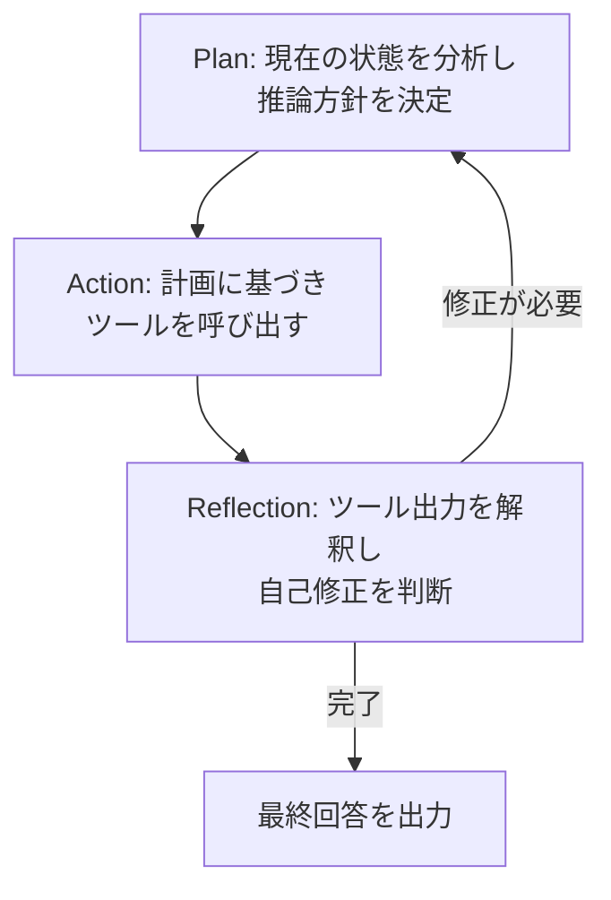

本記事は [RITE論文](https://arxiv.org/abs/2510.11184) の解説記事です。

この記事は [Zenn記事: 拡張思考モデル時代のReAct+CoT再設計：ネイティブ推論とツール実行を統合する](https://zenn.dev/0h_n0/articles/e8b5b05c0cf994) の深掘りです。

## 論文概要

RITE（Reinforcement Learning for Tool-Integrated Interleaved Thinking）は、LLMにおけるツール統合型推論をクロスドメインに汎化させるための強化学習フレームワークである。従来の手法では、ツール呼び出しと推論が分離されていたり、単一ドメインでの訓練に留まっていたが、RITEはPlan-Action-Reflectionの連続サイクルにより、推論とツール実行をインターリーブに統合する。著者らは数学タスクのみで訓練した7Bモデルが物理・ビジネス・哲学などの異分野タスクに汎化することを報告している。Dr. GRPOアルゴリズムにより最大62Kトークン・200ターン以上の長距離推論を安定的に最適化し、32Bモデルでは AIME 2024で71.3%（Table 2）、WebInstructで82.3%（Table 3）のスコアを達成している。

## 情報源

| 項目 | 内容 |
|------|------|
| arXiv ID | [2510.11184](https://arxiv.org/abs/2510.11184) |
| タイトル | Reinforcement Learning for Tool-Integrated Interleaved Thinking towards Cross-Domain Generalization |
| 著者 | Zhengyu Chen, Jinluan Yang, Teng Xiao et al. |
| 発表年 | 2025年10月（v2: 2026年1月） |
| 分野 | cs.LG, cs.CL |

## 背景と動機

LLMの推論能力を強化する手法として、Chain-of-Thought（CoT）やReActなどが広く利用されてきた。しかし、これらの手法にはいくつかの根本的な課題がある。

1. **推論とツール利用の分離**: ReActではThink-Act-Observeのステップが明確に分離されており、中間結果を踏まえた推論の動的修正が困難である。モデルが「考える」フェーズと「行動する」フェーズを切り替えるだけでは、長い推論チェーンにおける一貫性を保ちにくい
2. **ドメイン特化の壁**: 既存のツール統合型強化学習手法（SimpleTIR、ReToolなど）は特定のベンチマーク（主に数学）で訓練・評価されており、訓練ドメイン外への汎化能力が十分に検証されていない
3. **長距離推論の不安定性**: ツール呼び出しを含む推論では、トークン数が数万に達し、200ターン以上の対話が必要になることがある。標準的なRLアルゴリズム（PPO、GRPOなど）はこのスケールでの安定した最適化が困難である

著者らは、これらの課題に対して「推論・行動・省察の連続サイクル」と「長距離推論に耐えるRL最適化手法」を組み合わせたRITEフレームワークを提案している。特に、数学タスクのみの訓練で獲得した推論パターンが他ドメインに転移するという仮説を検証する点が、本研究の中心的な動機である。

## 主要な貢献

著者らが主張する本論文の貢献は以下の通りである。

- **Plan-Action-Reflectionサイクル**: 推論（Plan）・ツール呼び出し（Action）・結果の統合と自己修正（Reflection）を連続的に繰り返すアーキテクチャを提案。従来のReActの離散的なステップ構造を連続的なサイクルに再設計
- **Dr. GRPOアルゴリズム**: 最大62Kトークン・200ターン超の長距離推論を安定的に最適化するため、トークンレベルの重み付けと棄却サンプリングを組み合わせた新しいRL手法を導入
- **クロスドメイン汎化の実証**: 数学タスクのみで訓練したモデルが、物理・ビジネス・哲学・法律など未見のドメインのタスクで性能向上することを実験的に示した

## 技術的詳細

### Plan-Action-Reflectionアーキテクチャ

RITEの推論プロセスは、以下の3フェーズを繰り返すサイクルとして設計されている。



各フェーズの役割は以下の通りである。

**Plan（計画フェーズ）**: `<think>...</think>`タグ内で推論を行う。現在の状態（これまでの推論経過とツール出力）を分析し、次にどのような行動を取るべきかを決定する。このフェーズでは、過去のReflectionで得られた知見も参照される。

**Action（行動フェーズ）**: `<tool_call>...</tool_call>`タグでツール呼び出しを実行する。Planフェーズの推論結果に基づき、Pythonインタプリタなどの外部ツールを呼び出す。

**Reflection（省察フェーズ）**: `<tool_response>...</tool_response>`としてツール出力を受け取った後、再び`<think>...</think>`タグ内で出力を解釈する。ここで重要なのは、単にツール出力を受け入れるだけでなく、出力の妥当性を検証し、必要に応じて推論方針を修正する点である。

著者らは「このPlan-Action-Reflectionの交互パターンが、長い推論チェーンを要するタスクにおいて不可欠である」と述べている（論文Section 3.1）。従来のReActとの決定的な違いは、Reflectionフェーズでモデルが自己修正を行える点にある。ReActではObservation後に即座に次のThinkに移行するが、RITEでは中間結果の検証と方針転換が明示的に組み込まれている。

### Dr. GRPOアルゴリズム

ツール統合型推論では、1つの問題に対する応答が62Kトークン・200ターン以上に達することがある。標準的なGRPO（Group Relative Policy Optimization）ではこのスケールでメモリと勾配の安定性に問題が生じる。著者らはこの課題に対処するため、Dr. GRPO（Dynamic Reward Group Relative Policy Optimization）を提案している。

まず、標準GRPOにおけるアドバンテージは以下のように定義される。

$$
A_i = R_i - \frac{1}{K} \sum_{j=1}^{K} R_j
$$

ここで、
- $R_i$: $i$番目のロールアウトの報酬
- $K$: グループ内のロールアウト数
- $A_i$: $i$番目のロールアウトの相対的アドバンテージ

Dr. GRPOのトークンレベル損失関数は以下の形式である。

$$
\mathcal{L}_{\text{Dr-GRPO}} = \sum_t w_t \cdot \mathbb{E}_i \left[ -\min\left( r_{i,t} A_i,\ \text{clip}(r_{i,t}, 1 - \varepsilon, 1 + \varepsilon) A_i \right) \right]
$$

ここで、
- $r_{i,t} = \frac{\pi_\theta(a_{i,t} | s_{i,t})}{\pi_{\theta_{\text{old}}}(a_{i,t} | s_{i,t})}$: トークン $t$ での確率比
- $\varepsilon$: クリッピングパラメータ
- $w_t$: トークンレベルの重要度重み

$w_t$ はトークンレベルの重要度サンプリングと棄却サンプリングを組み合わせた重みであり、長い推論チェーンにおいて各トークンの勾配への寄与を適切に制御する。これにより、200ターン超の推論でも勾配が発散することなく安定した最適化が可能となる。

### 報酬設計

RITEでは、2つの独立した報酬成分を組み合わせる。

**Outcome Reward（結果報酬）**: 最終回答の正誤に基づく。

$$
R_{\text{outcome}} = \begin{cases} +1 & \text{if correct} \\ -1 & \text{if incorrect} \end{cases}
$$

**Format Reward（形式報酬）**: `<think>`, `<tool_call>`, `<tool_response>`タグの構造的正確性を評価する。

$$
R_{\text{format}} = \begin{cases} +1 & \text{完全に正しい構造} \\ 0 & \text{軽微な不備} \\ -1 & \text{構造的に不正} \end{cases}
$$

この二重報酬設計により、モデルは「正しい答えを出す」ことと「正しい推論構造を維持する」ことの両方を同時に学習する。著者らは、Format Rewardが訓練初期（50ステップ以内）でほぼ完全な精度に達することを報告しており（論文Figure 3）、これは構造的パターンの学習が内容の学習に先行することを示唆している。

### 動的カリキュラム

RITEは「Zone of Proximal Development（最近接発達領域）」の概念に基づく動的カリキュラムを採用している。各バッチにおいて、オンラインロールアウトの通過率（PassRate）が $[0.1, 0.9]$ の範囲に収まる問題のみをフィルタリングして訓練に使用する。

$$
\text{filter}(q) = \begin{cases} \text{keep} & \text{if } 0.1 \leq \text{PassRate}(q) \leq 0.9 \\ \text{skip} & \text{otherwise} \end{cases}
$$

PassRateが0.1未満の問題はモデルにとって難しすぎ、0.9を超える問題は簡単すぎるため、学習シグナルが弱い。この適応的フィルタリングにより、モデルの現在の能力に合わせた効率的な訓練が実現される。

### アルゴリズム

以下にRITEの推論ループの擬似コードを示す。

```python
from dataclasses import dataclass
from typing import Any


@dataclass
class ToolResponse:
    """ツール呼び出しの結果"""
    output: str
    success: bool


def rite_inference(
    model: Any,
    problem: str,
    tools: dict[str, Any],
    max_turns: int = 200,
) -> str:
    """RITEのPlan-Action-Reflectionサイクルによる推論

    Args:
        model: LLMモデル
        problem: 入力問題文
        tools: 利用可能なツール群
        max_turns: 最大ターン数

    Returns:
        最終回答文字列
    """
    context: list[str] = [f"Problem: {problem}"]

    for turn in range(max_turns):
        # Plan: 現在の状態を分析し推論方針を決定
        plan = model.generate(
            context,
            prefix="<think>",
            suffix="</think>",
        )
        context.append(f"<think>{plan}</think>")

        # 最終回答が得られた場合はサイクル終了
        if plan.contains_final_answer():
            return plan.extract_answer()

        # Action: 計画に基づきツールを呼び出す
        tool_call = model.generate(
            context,
            prefix="<tool_call>",
            suffix="</tool_call>",
        )
        context.append(f"<tool_call>{tool_call}</tool_call>")

        # ツール実行
        tool_name, args = parse_tool_call(tool_call)
        response: ToolResponse = tools[tool_name].execute(args)
        context.append(
            f"<tool_response>{response.output}</tool_response>"
        )

        # Reflection: 次のPlanフェーズで暗黙的に実行される
        # ツール出力がcontextに追加され、次のPlanで解釈・検証される

    raise TimeoutError(f"Max turns ({max_turns}) exceeded")


def parse_tool_call(raw: str) -> tuple[str, dict[str, Any]]:
    """ツール呼び出し文字列をパースする

    Args:
        raw: ツール呼び出しの生文字列

    Returns:
        (ツール名, 引数辞書) のタプル
    """
    # 実装省略: JSON形式のツール呼び出しをパース
    ...
```

## 実装のポイント

RITEを実装する際の重要な技術的考慮点を以下にまとめる。

**トークン管理**: 62Kトークンに達する推論チェーンを扱うには、KVキャッシュの効率的な管理が不可欠である。著者らはvLLMを推論エンジンとして使用し、PagedAttentionによるメモリ効率化を図っている。訓練時にはDeepSpeed ZeRO Stage 3でモデルパラメータを分割し、メモリ消費を抑えている。

**ツール実行の安全性**: Pythonインタプリタをツールとして使用する場合、任意コード実行のリスクがある。サンドボックス環境（DockerコンテナやgVisor）内でのツール実行が推奨される。また、実行時間の上限（タイムアウト）の設定も重要である。

**報酬の正規化**: Outcome RewardとFormat Rewardのスケールが異なる場合、一方が支配的になるリスクがある。著者らの設計では両方を $\{-1, 0, +1\}$ の離散値に統一することでこの問題を回避している。

**PassRateの計算**: 動的カリキュラムのPassRateは各バッチ内のロールアウト結果からオンラインで計算される。バッチサイズが小さいとPassRateの推定が不安定になるため、著者らはグループサイズ $K$ を十分に確保することを推奨している。

## Production Deployment Guide

RITEのPlan-Action-Reflectionサイクルをプロダクション環境でLLMエージェントとして運用する場合のAWSデプロイメントパターンを以下に示す。

### AWS実装パターン（コスト最適化重視）

RITEベースのエージェントは推論ターン数が多くレイテンシが高いため、トラフィック量に応じた構成選択が重要である。

| 構成 | トラフィック | 主要サービス | 月額概算 |
|------|------------|-------------|---------|
| Small | ~100 req/日 | Lambda + Bedrock | $50-150 |
| Medium | ~1,000 req/日 | ECS Fargate + Bedrock | $300-800 |
| Large | 10,000+ req/日 | EKS + Karpenter + Spot | $2,000-5,000 |

**Small構成（~100 req/日）**: Lambda関数がリクエストを受け取り、Amazon Bedrockを通じてLLMを呼び出す。DynamoDBに推論コンテキスト（Plan-Action-Reflectionの各ステップ）を保持し、ステートフルな複数ターン推論を実現する。Lambdaのタイムアウトは最大15分であるため、200ターン超の推論ではStep Functionsとの組み合わせが必要である。月額内訳: Bedrock推論$30-80、Lambda$5-15、DynamoDB$10-30、CloudWatch$5-25。

**Medium構成（~1,000 req/日）**: ECS Fargateで推論コンテナを常時起動し、長時間の推論セッションに対応する。ALBでロードバランシングし、ElastiCache（Redis）でセッション管理を行う。Fargateタスクあたり4vCPU/16GB RAMを割り当て、並行推論セッションを処理する。

**Large構成（10,000+ req/日）**: EKSクラスタにKarpenterを導入し、Spot Instancesを優先的に使用する。GPU対応ノード（g5.xlarge）で自前モデルを推論するパターンでは、Spot活用で最大90%のコスト削減が可能である。Bedrock併用パターンでは、短い推論はBedrock、長い推論は自前GPUと振り分けるルーティングロジックを実装する。

**コスト削減テクニック**:
- Spot Instances: On-Demandの最大90%削減、ただしインタラプション対策（チェックポイント保存）が必要
- Reserved Instances: 1年コミットで最大72%削減
- Bedrock Batch API: 非同期処理に適用で50%削減
- Prompt Caching: Plan-Action-Reflectionのシステムプロンプト部分をキャッシュし30-90%削減

なお、上記コストは2026年9月時点のAWS ap-northeast-1（東京）リージョン料金に基づく概算値である。実際のコストはトラフィックパターン、リージョン、バースト使用量により変動するため、最新料金はAWS料金計算ツールで確認を推奨する。

### Terraformインフラコード

**Small構成（Serverless）**: Lambda + Bedrock + DynamoDB

```hcl
# --- IAM Role (最小権限) ---
resource "aws_iam_role" "rite_lambda" {
  name = "rite-agent-lambda-role"
  assume_role_policy = jsonencode({
    Version = "2012-10-17"
    Statement = [{
      Action = "sts:AssumeRole"
      Effect = "Allow"
      Principal = { Service = "lambda.amazonaws.com" }
    }]
  })
}

resource "aws_iam_role_policy" "rite_lambda_policy" {
  name = "rite-agent-lambda-policy"
  role = aws_iam_role.rite_lambda.id
  policy = jsonencode({
    Version = "2012-10-17"
    Statement = [
      {
        Effect = "Allow"
        Action = [
          "bedrock:InvokeModel",
          "bedrock:InvokeModelWithResponseStream"
        ]
        # Bedrock呼び出し対象を特定モデルに限定
        Resource = "arn:aws:bedrock:ap-northeast-1::foundation-model/*"
      },
      {
        Effect = "Allow"
        Action = [
          "dynamodb:PutItem",
          "dynamodb:GetItem",
          "dynamodb:UpdateItem",
          "dynamodb:Query"
        ]
        Resource = aws_dynamodb_table.rite_context.arn
      },
      {
        Effect   = "Allow"
        Action   = ["logs:CreateLogGroup", "logs:CreateLogStream", "logs:PutLogEvents"]
        Resource = "arn:aws:logs:*:*:*"
      }
    ]
  })
}

# --- DynamoDB (推論コンテキスト保持, On-Demand) ---
resource "aws_dynamodb_table" "rite_context" {
  name         = "rite-agent-context"
  billing_mode = "PAY_PER_REQUEST" # On-Demandでコスト最適化
  hash_key     = "session_id"
  range_key    = "turn_number"

  attribute {
    name = "session_id"
    type = "S"
  }
  attribute {
    name = "turn_number"
    type = "N"
  }

  ttl {
    attribute_name = "expires_at"
    enabled        = true # 古いセッションを自動削除
  }

  server_side_encryption {
    enabled = true # KMS暗号化
  }
}

# --- Lambda関数 ---
resource "aws_lambda_function" "rite_agent" {
  function_name = "rite-agent"
  runtime       = "python3.12"
  handler       = "handler.lambda_handler"
  role          = aws_iam_role.rite_lambda.arn
  timeout       = 900  # 15分 (Plan-Action-Reflection複数ターン)
  memory_size   = 1024 # 推論コンテキスト保持用

  environment {
    variables = {
      CONTEXT_TABLE  = aws_dynamodb_table.rite_context.name
      BEDROCK_MODEL  = "anthropic.claude-sonnet-4-20250514"
      MAX_TURNS      = "50"
    }
  }

  tracing_config {
    mode = "Active" # X-Ray有効化
  }
}

# --- CloudWatchアラーム (コスト監視) ---
resource "aws_cloudwatch_metric_alarm" "bedrock_token_spike" {
  alarm_name          = "rite-bedrock-token-spike"
  comparison_operator = "GreaterThanThreshold"
  evaluation_periods  = 1
  metric_name         = "InputTokenCount"
  namespace           = "AWS/Bedrock"
  period              = 3600
  statistic           = "Sum"
  threshold           = 100000 # 1時間あたり10万トークン超過で通知
  alarm_actions       = [aws_sns_topic.alerts.arn]
}
```

**Large構成（Container）**: EKS + Karpenter + Spot Instances

```hcl
# --- EKSクラスタ ---
module "eks" {
  source  = "terraform-aws-modules/eks/aws"
  version = "~> 20.0"

  cluster_name    = "rite-agent-cluster"
  cluster_version = "1.31"

  vpc_id     = module.vpc.vpc_id
  subnet_ids = module.vpc.private_subnets

  cluster_endpoint_public_access = false # プライベートアクセスのみ

  # Karpenter用IAM設定
  enable_irsa = true
}

# --- Karpenter Provisioner (Spot優先) ---
resource "kubectl_manifest" "karpenter_nodepool" {
  yaml_body = yamlencode({
    apiVersion = "karpenter.sh/v1"
    kind       = "NodePool"
    metadata   = { name = "rite-agent-pool" }
    spec = {
      template = {
        spec = {
          requirements = [
            { key = "karpenter.sh/capacity-type", operator = "In", values = ["spot", "on-demand"] },
            { key = "node.kubernetes.io/instance-type", operator = "In",
              values = ["g5.xlarge", "g5.2xlarge", "g6.xlarge"] },
          ]
          nodeClassRef = { name = "default" }
        }
      }
      disruption = {
        consolidationPolicy = "WhenEmptyOrUnderutilized"
        consolidateAfter    = "30s"
      }
      limits = { cpu = "128", memory = "512Gi" }
    }
  })
}

# --- Secrets Manager (Bedrock設定) ---
resource "aws_secretsmanager_secret" "rite_config" {
  name       = "rite-agent/bedrock-config"
  kms_key_id = aws_kms_key.rite.arn
}

# --- AWS Budgets (予算アラート) ---
resource "aws_budgets_budget" "rite_monthly" {
  name         = "rite-agent-monthly"
  budget_type  = "COST"
  limit_amount = "5000"
  limit_unit   = "USD"
  time_unit    = "MONTHLY"

  notification {
    comparison_operator       = "GREATER_THAN"
    threshold                 = 80
    threshold_type            = "PERCENTAGE"
    notification_type         = "ACTUAL"
    subscriber_sns_topic_arns = [aws_sns_topic.alerts.arn]
  }
}
```

### 運用・監視設定

**CloudWatch Logs Insights クエリ**

```
# 1時間あたりのトークン使用量（コスト異常検知）
fields @timestamp, @message
| filter @message like /token_count/
| stats sum(input_tokens) as total_input, sum(output_tokens) as total_output by bin(1h)
| sort @timestamp desc

# Plan-Action-Reflectionターン数分析（P95, P99）
fields @timestamp, session_id, turn_count, latency_ms
| filter @message like /session_complete/
| stats percentile(turn_count, 95) as p95_turns,
        percentile(turn_count, 99) as p99_turns,
        percentile(latency_ms, 95) as p95_latency by bin(1h)
```

**CloudWatchアラーム設定（Python）**

```python
import boto3

cloudwatch = boto3.client("cloudwatch", region_name="ap-northeast-1")


def create_rite_alarms(sns_topic_arn: str) -> None:
    """RITEエージェント用CloudWatchアラームを作成する

    Args:
        sns_topic_arn: 通知先SNSトピックARN
    """
    # Bedrockトークン使用量スパイク検知
    cloudwatch.put_metric_alarm(
        AlarmName="rite-bedrock-token-spike",
        MetricName="InputTokenCount",
        Namespace="AWS/Bedrock",
        Statistic="Sum",
        Period=3600,
        EvaluationPeriods=1,
        Threshold=100000,
        ComparisonOperator="GreaterThanThreshold",
        AlarmActions=[sns_topic_arn],
    )

    # Lambda実行時間異常検知（15分タイムアウト接近）
    cloudwatch.put_metric_alarm(
        AlarmName="rite-lambda-duration-warning",
        MetricName="Duration",
        Namespace="AWS/Lambda",
        Dimensions=[{"Name": "FunctionName", "Value": "rite-agent"}],
        Statistic="p95",
        Period=300,
        EvaluationPeriods=2,
        Threshold=840000,  # 14分 (タイムアウト15分の93%)
        ComparisonOperator="GreaterThanThreshold",
        AlarmActions=[sns_topic_arn],
    )
```

**X-Rayトレーシング設定（Python）**

```python
from aws_xray_sdk.core import xray_recorder, patch_all

# boto3自動計装
patch_all()


def trace_rite_turn(
    session_id: str,
    turn: int,
    phase: str,
) -> None:
    """各Plan-Action-Reflectionターンをトレースする

    Args:
        session_id: セッション識別子
        turn: 現在のターン番号
        phase: 現在のフェーズ (plan/action/reflection)
    """
    segment = xray_recorder.current_segment()
    segment.put_annotation("session_id", session_id)
    segment.put_annotation("turn", turn)
    segment.put_annotation("phase", phase)
    segment.put_metadata("rite", {
        "max_turns": 200,
        "current_turn": turn,
    })
```

**Cost Explorer自動レポート（Python）**

```python
import datetime

import boto3


def get_daily_cost_report() -> dict[str, float]:
    """日次コストレポートを取得する

    Returns:
        サービス別コスト辞書
    """
    ce = boto3.client("ce", region_name="us-east-1")
    today = datetime.date.today()
    yesterday = today - datetime.timedelta(days=1)

    response = ce.get_cost_and_usage(
        TimePeriod={
            "Start": yesterday.isoformat(),
            "End": today.isoformat(),
        },
        Granularity="DAILY",
        Metrics=["UnblendedCost"],
        GroupBy=[{"Type": "DIMENSION", "Key": "SERVICE"}],
    )

    costs: dict[str, float] = {}
    for group in response["ResultsByTime"][0]["Groups"]:
        service = group["Keys"][0]
        amount = float(group["Metrics"]["UnblendedCost"]["Amount"])
        if amount > 0:
            costs[service] = amount

    # $100/日超過でSNS通知
    total = sum(costs.values())
    if total > 100:
        sns = boto3.client("sns", region_name="ap-northeast-1")
        sns.publish(
            TopicArn="arn:aws:sns:ap-northeast-1:ACCOUNT:rite-alerts",
            Subject=f"RITE Daily Cost Alert: ${total:.2f}",
            Message=f"Daily cost exceeded $100: ${total:.2f}",
        )

    return costs
```

### コスト最適化チェックリスト

**アーキテクチャ選択**
- [ ] トラフィック量に応じた構成を選択（~100/日: Serverless、~1,000/日: Hybrid、10,000+/日: Container）
- [ ] 推論ターン数の上限を設定し、長時間実行のコストを制御

**リソース最適化**
- [ ] EC2/EKS: Spot Instancesを優先し、On-Demandの最大90%削減
- [ ] Reserved Instances: 1年コミットで最大72%削減
- [ ] Savings Plans: Compute Savings Plansで柔軟な割引適用
- [ ] Lambda: メモリサイズのPower Tuningで最適値を特定
- [ ] ECS/EKS: Karpenterでアイドル時に自動スケールダウン
- [ ] NAT Gateway: 可能な場合はVPCエンドポイントで代替

**LLMコスト削減**
- [ ] Bedrock Batch API: 非同期処理に適用し50%削減
- [ ] Prompt Caching: システムプロンプト（Plan-Action-Reflection指示）をキャッシュし30-90%削減
- [ ] モデル選択ロジック: 短い推論はHaiku、長い推論はSonnetと動的に切り替え
- [ ] トークン数制限: max_tokensを適切に設定し不要な生成を抑制
- [ ] 推論ターン数上限: MAX_TURNSパラメータでコスト暴走を防止

**監視・アラート**
- [ ] AWS Budgets: 月額予算を設定し80%到達で通知
- [ ] CloudWatchアラーム: トークン使用量スパイクを検知
- [ ] Cost Anomaly Detection: 異常コストの自動検知を有効化
- [ ] 日次コストレポート: Cost Explorer APIで日次集計・SNS通知

**リソース管理**
- [ ] 未使用リソース削除: 不要なEBSボリューム・ENI・Elastic IPを定期清掃
- [ ] タグ戦略: 全リソースにProject/Environment/Ownerタグを付与
- [ ] ライフサイクルポリシー: DynamoDB TTLで古いセッションデータを自動削除
- [ ] 開発環境夜間停止: EventBridgeルールで非営業時間にECSタスク数を0にする
- [ ] ECRイメージ: ライフサイクルポリシーで古いイメージを自動削除

## 実験結果

著者らは、AIME 2024/2025（数学）およびWebInstruct（クロスドメイン）でRITEの性能を評価している。

### 7Bモデルの結果（論文Table 2より）

| ベンチマーク | SimpleTIR | RITE | 改善 |
|------------|-----------|------|-----|
| AIME 2025 | 30.9% | 36.7% | +5.8pt |
| WebInstruct (OOD) | — | 73.6% | — |

### 32Bモデルの結果（論文Table 2, 3より）

| ベンチマーク | SimpleTIR | ReTool | RITE | 改善 |
|------------|-----------|--------|------|-----|
| AIME 2024 | 59.9% | — | 71.3% | +11.4pt |
| AIME 2025 | — | — | 56.7% | — |
| WebInstruct | — | 76.8% | 82.3% | +5.5pt |

注目すべき点として、数学タスク（AIME）のみで訓練されたモデルが、物理・ビジネス・哲学・法律を含むWebInstructで高いスコアを達成している。これは、Plan-Action-Reflectionサイクルで獲得された推論パターンがドメイン非依存であることを示唆している。

### 訓練中の行動変化

著者らは訓練中にモデルの行動パターンが変化することを報告している（論文Section 5.3）。

- **Format accuracy**: 訓練開始から50ステップ以内でほぼ100%に到達し、構造的パターンの学習が迅速であることを示す
- **ツール呼び出し回数**: 訓練初期の約1.6回から訓練後には約4.0回に増加。モデルが自発的にツールを活用した検証行動を獲得していることを示す
- **自己修正行動**: Reflectionフェーズにおいて、ツール出力と推論の整合性を確認し、不一致の場合にPlanを修正するパターンが出現する

## 実運用への応用

RITEの知見は、プロダクション環境でのLLMエージェント設計に直接的な示唆を与える。

**エージェントアーキテクチャへの適用**: Zenn記事で解説されているReAct+CoTの再設計において、RITEのPlan-Action-Reflectionサイクルは具体的な実装指針となる。特に、Reflectionフェーズを明示的に設計することで、ツール実行結果の検証と推論方針の動的修正が可能になる。LangGraphなどのフレームワークでは、このサイクルをステートグラフのノードとして自然に表現できる。

**クロスドメイン転移の活用**: 特定ドメイン（例: コード生成）で訓練したエージェントが、データ分析やレポート生成など別ドメインのタスクにも対応できる可能性がある。RITEの結果は、推論パターン自体がドメイン非依存であることを示唆しており、汎用的なエージェントの実現に向けた重要な知見である。

**コスト対レイテンシのトレードオフ**: 推論ターン数が4倍に増加する（1.6回から4.0回）ことは、トークンコストの増大を意味する。プロダクション環境では、推論品質とコストのバランスを取るために、ターン数の上限設定やモデルサイズの動的選択（短い推論にはHaiku、長い推論にはSonnet）といった戦略が有効である。

## 関連研究

- **SimpleTIR**（Chen et al., 2025）: ツール統合型推論の初期的なRL手法。RITEとの主要な差異はReflectionフェーズの欠如と、長距離推論への最適化がない点である
- **ReTool**（Feng et al., 2025）: コード実行をReasoningに組み込むアプローチ。32BモデルでWebInstruct 76.8%を達成しているが、RITEは82.3%でこれを上回る（論文Table 3より）
- **STILL-2**（Slow Thinking with LLMs）: 推論の質を高めるための遅い思考戦略。RITEのPlan-Action-Reflectionサイクルは類似の思想を持つが、ツール統合とRL最適化を加えた点が異なる
- **GRPO**（Shao et al., 2024）: Group Relative Policy Optimization。RITEのDr. GRPOはこれを拡張し、トークンレベルの重み付けにより長距離推論に対応している

## まとめと今後の展望

RITEは、Plan-Action-Reflectionサイクルを中核とするツール統合型推論フレームワークであり、数学タスクのみの訓練でクロスドメイン汎化を実現した点が最大の成果である。Dr. GRPOによる長距離推論の安定化と、動的カリキュラムによる効率的な訓練も重要な技術的貢献である。

今後の研究方向として、著者らはより多様なツール（Webブラウザ、データベース等）の統合や、マルチエージェント環境でのPlan-Action-Reflectionサイクルの拡張を示唆している。プロダクション環境では、推論コストの予測可能性と制御性の向上が実用化における重要な課題である。

## 参考文献

- **arXiv**: [https://arxiv.org/abs/2510.11184](https://arxiv.org/abs/2510.11184)
- **Related Zenn article**: [https://zenn.dev/0h_n0/articles/e8b5b05c0cf994](https://zenn.dev/0h_n0/articles/e8b5b05c0cf994)

この記事はAI（Claude Code）により自動生成されました。
