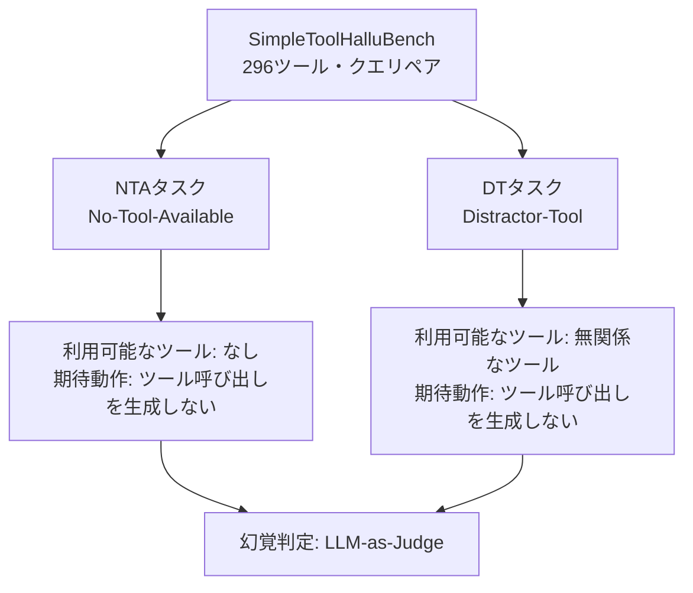
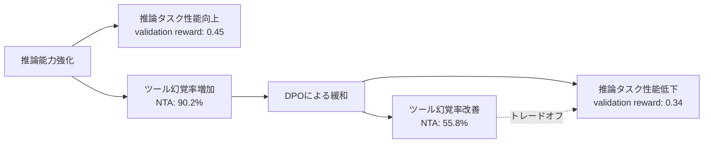

本記事は [The Reasoning Trap: How Enhancing LLM Reasoning Amplifies Tool Hallucination](https://arxiv.org/abs/2510.22977) の解説記事です。

この記事は [Zenn記事: 拡張思考モデル時代のReAct+CoT再設計：ネイティブ推論とツール実行を統合する](https://zenn.dev/0h_n0/articles/e8b5b05c0cf994) の深掘りです。

## 論文概要

LLMの推論能力を強化すると、ツール利用の正確性も向上するという直感に反し、推論能力の向上がツール幻覚（tool hallucination）を体系的に増幅する現象を本論文は実証している。著者らは296件のツール・クエリペアからなるSimpleToolHalluBenchベンチマークを構築し、GRPO等の強化学習による推論強化がNo-Tool-Available（NTA）タスクにおける幻覚率を34.8%から90.2%へと大幅に悪化させることを報告している。さらに、ツールとは無関係な数学推論タスク（GSM8K）での強化学習でも幻覚率が増加することから、この現象がツール固有の過学習ではなく推論能力そのものに起因することを示している。CKA（Centered Kernel Alignment）分析による機構的解明と、DPO等の緩和戦略における信頼性と能力のトレードオフも明らかにしている。

## 情報源

| 項目 | 内容 |
|------|------|
| arXiv ID | [2510.22977](https://arxiv.org/abs/2510.22977) |
| タイトル | The Reasoning Trap: How Enhancing LLM Reasoning Amplifies Tool Hallucination |
| 著者 | Chenlong Yin, Zeyang Sha, Shiwen Cui, Changhua Meng, Zechao Li |
| 初版 | 2025年10月27日（v2: 2026年4月17日） |
| 採録 | ACL 2026 Main |
| 分野 | cs.LG, cs.AI |

## カンファレンス情報

ACL（Association for Computational Linguistics）は計算言語学・自然言語処理分野における最高峰の国際会議であり、毎年開催されている。ACL 2026 Mainは査読付きの主要トラックであり、本論文はこのトラックに採録されている。ACLの採択率は近年20-25%程度で推移しており、特にLLMの信頼性や安全性に関する研究が注目を集めている。本論文が扱うツール幻覚の問題は、LLMエージェントの実用化が進む中で重要性が増しているテーマであり、ACLの主要トラックに採録されたことは研究コミュニティの関心の高さを示している。

## 背景と動機

LLMの推論能力を強化する手法（Chain-of-Thought prompting、強化学習によるファインチューニング等）は、数学的推論やコード生成などのベンチマークで顕著な性能向上を示してきた。DeepSeek-R1やQwen3に代表される「推論モデル」は、思考過程を明示的に生成することで複雑な問題を段階的に解決する能力を獲得している。

一方で、LLMエージェントの実用化においてはツール利用（tool use）が不可欠となっている。[Zenn記事](https://zenn.dev/0h_n0/articles/e8b5b05c0cf994)で解説しているReActパターンでは、LLMが推論（Reasoning）とツール呼び出し（Action）を交互に行うことで複雑なタスクを遂行する。拡張思考モデルの登場により、推論フェーズの質が向上すればツール利用の精度も向上するという期待があった。

しかし、著者らはこの直感に反する現象を発見した。推論能力を強化したモデルは、利用可能なツールが存在しない場面で**架空のツールを捏造する**（NTA幻覚）、あるいは無関係なツールを誤って使用する（DT幻覚）傾向が顕著に増加する。この問題は、Zenn記事で議論しているような推論モデルとツール実行の統合設計において、根本的な信頼性課題を提起するものである。

## 主要な貢献

著者らが主張する本論文の貢献は以下の通りである。

- **SimpleToolHalluBenchの構築**: 296件のツール・クエリペアからなる、ツール幻覚を体系的に評価するベンチマーク。NTA（ツール不在）とDT（妨害ツール）の2種類のタスクで幻覚傾向を定量化する
- **推論強化がツール幻覚を増幅する現象の実証**: GRPO、R1-Distill等の複数手法およびモデルファミリ（Qwen、Llama、DeepSeek）にわたって、推論能力の向上がツール幻覚率を一貫して増加させることを示した。ツールと無関係な数学タスクでの強化学習でも同様の増加が確認され、現象がツール固有の過学習を超越することを実証した
- **機構分析と緩和戦略の評価**: CKA分析によりツール表現の崩壊（representation collapse）を同定し、プロンプトエンジニアリングやDPOによる緩和の効果と限界を明らかにした。信頼性（reliability）と能力（capability）の根本的トレードオフの存在を示した

## 技術的詳細: SimpleToolHalluBench

### ベンチマーク設計

SimpleToolHalluBenchは、LLMのツール幻覚を評価するために設計されたベンチマークであり、296件のツール・クエリペアで構成される。ツール幻覚は、モデルが提供されたツールの範囲を超えてツール呼び出しを生成する行為として定義されている。

ベンチマークは2種類のタスクを含む。

**No-Tool-Available（NTA）タスク**: クエリに対して利用可能なツールが一切提供されない状況で、モデルが架空のツールを捏造して呼び出すかを評価する。正しい動作は、ツール呼び出しを行わず、テキストのみで応答することである。

**Distractor-Tool（DT）タスク**: クエリに対して無関係な妨害ツールのみが提供される状況で、モデルがその妨害ツールを誤って使用するかを評価する。正しい動作は、提供されたツールがクエリと無関係であることを認識し、ツール呼び出しを行わないことである。

幻覚率は以下のように定義される。

$$
\text{HalluRate} = \frac{|\{q \in Q : \text{Judge}(q, \text{response}(q)) = \text{hallucinated}\}|}{|Q|}
$$

ここで $Q$ はクエリ集合、$\text{Judge}$ はLLM-as-Judge方式による判定関数である。

### 評価対象のモデルと訓練手法

著者らは複数のモデルファミリと推論強化手法を組み合わせて体系的な評価を行っている。

| ベースモデル | 推論強化手法 | NTA幻覚率 | DT幻覚率 |
|-------------|------------|----------|---------|
| Qwen2.5-7B（ベース） | なし | 34.8% | 15.2% |
| Qwen2.5-7B | ReCall GRPO（ツール特化RL） | 90.2% | 37.8% |
| Qwen2.5-7B | R1-Distill | 74.3% | 31.5% |
| Llama3.1-8B（ベース） | なし | 62.5% | 28.4% |
| Llama3.1-8B | R1-Distill | 96.3% | 45.7% |
| Qwen3-8B | thinking無効 | 4.1% | 36.2% |
| Qwen3-8B | thinking有効 | 5.4% | 56.8% |

特筆すべきは、Qwen3-8BにおいてNTA幻覚率は4.1%から5.4%と微増にとどまる一方、DT幻覚率は36.2%から56.8%へと大幅に増加している点である。これは、推論モードの有効化が妨害ツールの誤使用を特に促進することを示唆している。

## 技術的詳細: 推論が幻覚を駆動するメカニズム

### 推論の分離実験

著者らは推論が幻覚増加の主因であることを分離実験により検証している。

**実験設計**: Qwen2.5-7Bをベースに、以下の3条件でGRPOを適用した。

1. **ツール特化RL（推論なし）**: ReCallデータセットでGRPO訓練するが、思考過程の生成を含まない。結果: NTA幻覚率 34.8% → 41.4%
2. **ツール特化RL（推論あり）**: ReCallデータセットでGRPO訓練し、think-then-actパターンで思考過程を生成。結果: NTA幻覚率 34.8% → 90.2%
3. **非エージェント型推論RL**: GSM8K（純粋な数学タスク、ツール要素ゼロ）でGRPO訓練。結果: NTA幻覚率が増加

条件1と条件2の対比は、同一データセット・同一訓練手法でも**推論過程の有無**が幻覚率を大幅に変えることを示している。条件3はさらに強い証拠を提供する。ツールとは無関係な純粋数学タスクでの推論訓練でさえ幻覚率が増加するという事実は、この現象がツール固有の過学習ではなく、推論能力の汎化的な副作用であることを意味する。

### 表現崩壊のCKA分析

著者らはCentered Kernel Alignment（CKA）を用いて、推論強化後のモデル内部表現の変化を分析している。CKAは2つの表現行列間の類似度を測る指標であり、以下のように定義される。

$$
\text{CKA}(X, Y) = \frac{\text{HSIC}(X, Y)}{\sqrt{\text{HSIC}(X, X) \cdot \text{HSIC}(Y, Y)}}
$$

ここで $X, Y$ はそれぞれベースモデルと推論強化後モデルの表現行列、$\text{HSIC}$ はHilbert-Schmidt Independence Criterionである。CKAは $[0, 1]$ の値をとり、1に近いほど2つの表現が類似していることを示す。

著者らの分析結果は以下の通りである。

**表現崩壊（Representation Collapse）**: ツールに関する表現のCKAは0.75未満に低下する一方、推論タスク（in-domain）の表現のCKAは0.9以上で安定している。これは、推論強化がツールに関する内部表現を選択的に崩壊させることを示している。

### 層別分析

後段レイヤーの残差ストリーム（residual stream）がツール幻覚の識別に最も寄与していることが判明している。

$$
\text{Discrimination Score} = \frac{1}{|D|}\sum_{d \in D} \left| h_{\text{hallucinated}}^{(l)}(d) - h_{\text{correct}}^{(l)}(d) \right|
$$

ここで $h^{(l)}(d)$ はレイヤー $l$ における入力 $d$ の隠れ状態ベクトルである。

| 成分 | 識別スコア |
|------|-----------|
| 残差ストリーム（後段レイヤー） | > 0.14 |
| MLP | 0.04 |
| アテンション | 0.02 |

残差ストリームの識別スコアがアテンション（0.02）やMLP（0.04）と比較して顕著に高い（> 0.14）ことは、ツール幻覚の判別に最も有用な情報が後段レイヤーの残差ストリームに集中していることを意味する。この知見は、幻覚検出プローブの設計において残差ストリームを対象とすべきことを示唆している。

### スケール不変性

著者らは推論強化によるツール幻覚の増加がモデルスケールに依存しないことも検証している（論文Table 5）。

| モデル | パラメータ数 | NTA幻覚率（ベース） | NTA幻覚率（推論強化後） |
|--------|------------|-------------------|-----------------------|
| Qwen3-4B | 4B | 3.4% | 29.4% |
| Qwen3-8B | 8B | 4.1% | 5.4% |
| Qwen3-235B | 235B | 3.7% | 6.1% |
| DeepSeek-R1 | 671B | --- | 17.6% |
| DeepSeek-V3 | 671B | 10.8% | --- |

Qwen3-4Bでは3.4%から29.4%へと約8.6倍の増加が見られ、Qwen3-235Bでも3.7%から6.1%へと約1.6倍の増加が確認されている。671Bパラメータ規模のDeepSeekでも、V3（非推論）の10.8%に対してR1（推論強化）は17.6%と増加している。大規模モデルでは増加の絶対幅は小さいものの、推論強化がツール幻覚を増加させるという傾向はスケールを超えて一貫している。

## 実装のポイント: 緩和戦略

著者らは推論強化によるツール幻覚を緩和する3つのアプローチを検証しているが、いずれも完全な解決には至っていない。

### プロンプトエンジニアリング

ツール呼び出しを生成する前に利用可能なツールを確認するよう指示するプロンプトを追加する手法である。結果は以下の通りであった。

- NTA幻覚率: 90.2% → 87.5%（2.7ポイント改善）

著者らは、プロンプトエンジニアリングによる改善は限定的であると報告している。推論強化されたモデルは、明示的な指示にもかかわらずツールを捏造する傾向が内在化されていることが示唆される。

### DPO（Direct Preference Optimization）

正しい応答（ツール呼び出しを行わない）を好ましい応答、幻覚応答を好ましくない応答としてペアを構成し、DPOによる追加訓練を行う手法である。

- NTA幻覚率: 90.2% → 55.8%（34.4ポイント改善）
- 検証報酬（validation reward）: 0.45 → 0.34（0.11ポイント低下）

DPOはプロンプトエンジニアリングと比較して大幅な改善を示すが、検証報酬が低下する。これは、ツール幻覚の抑制と推論タスクの性能の間に**根本的なトレードオフ**が存在することを意味する。推論能力を維持したままツール幻覚を完全に排除することは、現時点の手法では困難であることが示されている。

### トレードオフの構造

## 実験結果

### 訓練過程における幻覚率の推移

著者らはReCall GRPOの訓練過程において、検証報酬とNTA幻覚率を同時にトラッキングしている。

- **訓練開始時**: 検証報酬 0.22、NTA幻覚率 34.8%
- **訓練終了時**: 検証報酬 0.45、NTA幻覚率 90.2%

検証報酬が0.22から0.45へと約2倍に向上する過程で、NTA幻覚率は34.8%から90.2%へと約2.6倍に増加している。推論能力の獲得とツール幻覚の増加が強く相関していることがわかる。

### 手法横断的な結果

推論強化手法に依存しない傾向を示すために、著者らは以下の手法を比較している（論文Table 1より）。

| 手法 | 対象モデル | NTA幻覚率変化 | 備考 |
|------|----------|-------------|------|
| R1-Distill | Qwen2.5-7B | 34.8% → 74.3% | 蒸留ベースの推論強化 |
| R1-Distill | Llama3.1-8B | 62.5% → 96.3% | ベース幻覚率が高いモデルでは特に顕著 |
| ReCall GRPO | Qwen2.5-7B | 34.8% → 90.2% | ツール特化RL |
| Thinking mode | Qwen3-8B | 4.1% → 5.4%（NTA） 36.2% → 56.8%（DT） | 推論モード切替 |

いずれの手法においても推論強化後にツール幻覚率が増加しており、この現象が特定の手法に限定されないことが確認されている。

### 直接RL vs 推論付きRL

推論が幻覚増加の主因であることを実証する最も直接的な証拠は、以下の比較にある。

| 訓練条件 | NTA幻覚率 |
|---------|----------|
| ベースモデル（Qwen2.5-7B） | 34.8% |
| 直接ツール利用RL（推論なし） | 41.4% |
| Think-then-act RL（推論あり） | 90.2% |

推論を伴わない直接RLでは6.6ポイントの微増にとどまるのに対し、推論を伴うRLでは55.4ポイントの大幅増加を示す。この差は、RLそのものではなく**推論過程の導入**が幻覚増加の主要因であることを明確に示している。

## 実運用への応用

本論文の知見は、[Zenn記事](https://zenn.dev/0h_n0/articles/e8b5b05c0cf994)で議論しているようなReActエージェントの設計に直接的な影響を与える。

**推論モデルを用いたエージェント設計における留意事項**:

著者らの結果は、拡張思考モデル（DeepSeek-R1、Qwen3等）をReActエージェントのバックエンドとして使用する際に、ツール幻覚のリスクが従来のモデルよりも高まることを示唆している。特にNTAシナリオ、すなわち利用可能なツールが存在しない状況でモデルが架空のツールを捏造する問題は、実運用において重大な信頼性リスクとなる。

**実務的な対策**:

1. **ツール呼び出しの事後検証**: モデルが生成したツール呼び出しが、実際に利用可能なツールのリストに含まれるかをシステムレベルで検証するガードレイルを実装する。LangGraphやLangChainのToolNodeにおいて、登録済みツール以外の呼び出しを拒否するバリデーション層を追加することが有効である
2. **推論と非推論の使い分け**: 全ての場面で推論モードを有効化するのではなく、ツール選択フェーズでは推論を抑制し、計画立案フェーズでのみ推論を有効化するハイブリッド設計が考えられる。Qwen3のthinking切替機能はこのアプローチを実現する手段の一つである
3. **DPOによるポスト訓練**: 推論能力を保持しつつツール幻覚を抑制するために、ツール利用場面でのDPOによる追加訓練を検討する。ただし、検証報酬の低下（0.45→0.34）というトレードオフを受容する必要がある

**スケール依存性の実務的含意**:

大規模モデル（235B、671B）では推論強化による幻覚率の増加幅が相対的に小さいことから、コスト制約が許す場合はより大規模なモデルを選択することで幻覚リスクを軽減できる可能性がある。一方で、4B-8Bクラスのモデルをエッジ環境で使用する場合は、幻覚率の増加幅がより大きくなる点に留意が必要である。

## 関連研究

本論文と関連する主要な研究を以下に整理する。

- **Schick et al. (2023), "Toolformer"**: LLMにツール呼び出しを自己教師あり学習で獲得させる手法。ツール利用能力の向上に焦点を当てており、ツール幻覚の問題は検討されていない。本論文はToolformer的アプローチの信頼性面での限界を示唆する
- **Yao et al. (2023), "ReAct"**: 推論とアクションを交互に実行するエージェントフレームワーク。Zenn記事で詳述されているReActパターンの基盤論文である。本論文の結果は、ReActの推論フェーズを強化すると逆にアクション（ツール呼び出し）の信頼性が低下するという問題を提起している
- **DeepSeek-AI (2025), "DeepSeek-R1"**: GRPOによる強化学習で推論能力を獲得したモデル。本論文のTable 5において、DeepSeek-R1（671B）のNTA幻覚率が17.6%と報告されており、大規模モデルでも推論強化の副作用が存在することが示されている
- **Huang et al. (2023), "A Survey on Hallucination in LLMs"**: LLMの幻覚に関する包括的サーベイ。テキスト生成における幻覚は広く研究されているが、ツール呼び出しに特化した幻覚の体系的研究は本論文が先駆的である

## まとめと今後の展望

本論文は、LLMの推論能力強化がツール幻覚を体系的に増幅するという逆説的現象を、SimpleToolHalluBenchベンチマークによる定量評価とCKA分析による機構的解明を通じて実証した。推論強化の手法（GRPO、蒸留等）やモデルファミリ（Qwen、Llama、DeepSeek）に依存せず、またモデルスケール（4Bから671B）を超えてこの現象が一貫して観察されることは、LLMエージェントの信頼性設計において根本的な課題を提起している。

今後の方向性として、推論能力とツール信頼性を同時に最適化する訓練手法の開発、ツール表現の崩壊を防止するための正則化手法、および実行時のツール幻覚検出と防止機構の研究が求められる。ReActパターンやLangGraphを用いたエージェント設計においては、推論モデルの採用に伴う幻覚リスクを定量的に評価し、適切なガードレイルを設計することが重要となるだろう。

## 参考文献

1. Yin, C., Sha, Z., Cui, S., Meng, C., & Li, Z. (2025). The Reasoning Trap: How Enhancing LLM Reasoning Amplifies Tool Hallucination. *ACL 2026 Main*. arXiv:2510.22977
2. Yao, S., Zhao, J., Yu, D., Du, N., Shafran, I., Narasimhan, K., & Cao, Y. (2023). ReAct: Synergizing Reasoning and Acting in Language Models. *ICLR 2023*. arXiv:2210.03629
3. Schick, T., Dwivedi-Yu, J., Dessì, R., Raileanu, R., Lomeli, M., Hambro, E., ... & Scialom, T. (2023). Toolformer: Language Models Can Teach Themselves to Use Tools. *NeurIPS 2023*. arXiv:2302.04761
4. DeepSeek-AI. (2025). DeepSeek-R1: Incentivizing Reasoning Capability in LLMs via Reinforcement Learning. arXiv:2501.12948
5. Huang, L., Yu, W., Ma, W., Zhong, W., Feng, Z., Wang, H., ... & Liu, T. (2023). A Survey on Hallucination in Large Language Models: Principles, Taxonomy, Challenges, and Open Questions. arXiv:2311.05232

---

この記事はAI（Claude Code）により自動生成されました。
