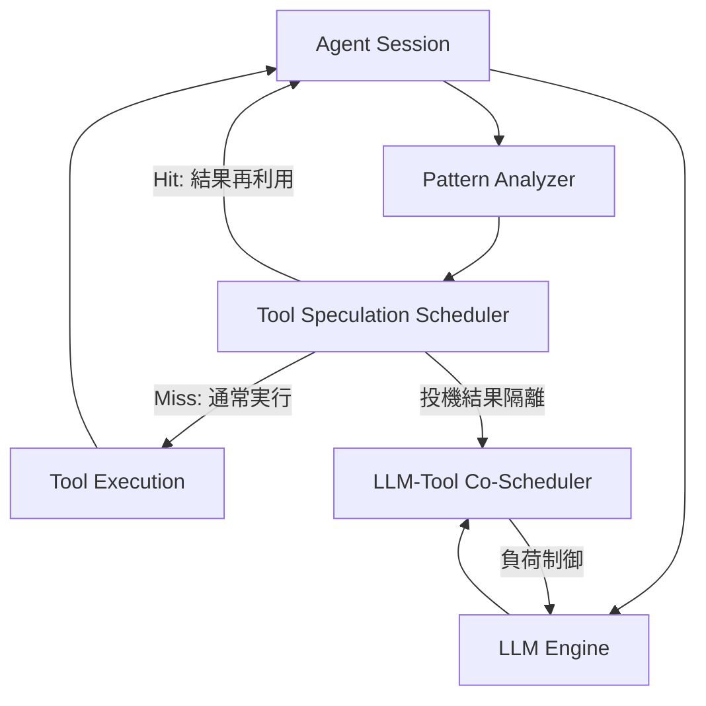

本記事は [https://arxiv.org/abs/2603.18897](https://arxiv.org/abs/2603.18897) の解説記事です。

## 論文概要（Abstract）

PASTEは、LLMエージェントのツール実行とモデル生成の逐次ボトルネックを解消するシステムである。エージェントの繰り返し行動パターンを認識して将来のツール呼び出しを予測し、LLM生成中にツールを投機的に実行する。Sui らによると、PASTEは平均タスク完了時間を43.5%削減し、ツールレイテンシを1.8倍高速化した。Deep Research、コーディング、科学エージェントで評価されている。

この記事は [Zenn記事: Bedrock AgentCore Managed HarnessとWeb Searchで社内ヘルプデスクの応答遅延を削減する](https://zenn.dev/0h_n0/articles/5d3fb5cf79f319) の深掘りです。

## 情報源

- **arXiv ID**: 2603.18897
- **URL**: [https://arxiv.org/abs/2603.18897](https://arxiv.org/abs/2603.18897)
- **著者**: Yifan Sui, Han Zhao, Rui Ma, et al.
- **初版投稿**: 2026年3月19日（v3: 2026年6月16日）
- **分野**: cs.DC（分散コンピューティング）, cs.AI（人工知能）

## 背景と動機（Background & Motivation）

現代のLLMエージェントは「LLM生成 → ツール呼び出し → 結果待機 → 再生成」の逐次ループで動作し、ツール実行のレイテンシがクリティカルパス上に直接載る。Sui らの計測によると、ツール実行時間はE2Eレイテンシの45-57%を占める（論文Section 2より）。

一方で、エージェントの行動パターンには再現性がある。成功した`file_editor`呼び出しの55%は後続の`terminal`実行を伴い、Web検索後のURL訪問の95%では検索結果のURLがそのまま引数に使われている（論文Section 2.2より）。この予測可能性を活用し、LLM生成中にツールを先行実行するのがPASTEの着想である。

ただし、単純な投機的実行には2つの課題がある。第一に、ツール名だけでなく具体的引数まで正確に予測する必要がある。第二に、大量のセッションが同時にLLMエンジンに戻る「バースト圧力」問題がある。同時セッション数が1→192に増加するとLLM生成時間は17倍以上に膨れ上がる（論文Section 2.3より）。

## 主要な貢献（Key Contributions）

- **Pattern Analyzer**: エージェントの繰り返し行動パターンを学習し、具体的な引数付きでツール呼び出しを予測する機構
- **Tool Speculation Scheduler**: 予測されたツールを安全に投機的実行し、副作用の隔離と正当性を保証するスケジューラ
- **LLM-Tool Co-Scheduler**: ツール完了セッションのLLMエンジン再投入を制御しGPU負荷集中を防ぐスケジューラ
- **Lossless Speculation**: 投機が外れてもフォールバック実行で正確性を保証する「損失なし投機」の設計原則
- **実証評価**: 3種類のワークロードと4つのベースラインに対し、平均43.5%のタスク完了時間削減を達成

## 技術的詳細（Technical Details）

### PASTEの全体アーキテクチャ

PASTEは3つの協調コンポーネントで構成される。以下にその全体像を示す。



### 1. Pattern Analyzer（パターン解析器）

Pattern Analyzerは、エージェントセッションのイベントストリームを記録し、2パスで予測候補を生成する。

**第1パス（シグネチャマイニング）** では、イベントを「シグネチャ」（安定した制御フロー構造）と「ペイロード」（引数の具体値）に分離する。たとえば「search → visit_url」がシグネチャ、検索クエリやURLがペイロードとなる。**第2パス（引数マッパー推論）** では、フィールドルックアップやインデックス選択等の引数導出ルールを過去の履歴から学習する。「直前のsearch結果の1番目のURLをvisit_urlの引数にする」といったマッピングが自動獲得される。

実行時には直近イベント列をパターンプールと照合し、パターン一致かつペイロードが揃えば実行可能な呼び出し候補を生成する。

### 2. Tool Speculation Scheduler（投機的ツールスケジューラ）

投機的ツールスケジューラは、Pattern Analyzerからの候補を受け取り、LLM生成と並行してツールを先行実行する。

**Admission Policy（受理判定）**: 候補は (1) 実行可能性（ツール名・引数が正規化可能）、(2) ポリシー安全性（副作用なし or dry-runバリアント存在）、(3) 信頼度・利得（閾値以上の予測確率）、(4) 予算（投機用リソースに余裕あり）の4条件をすべて満たす場合のみ実行される。

**Lossless Speculation（損失なし投機）**: LLMが実際にツール呼び出しを発行した時点で照合し、Hit（再利用/昇格）かMiss（通常実行にフォールバック）を判定する。投機結果はLLMが確認するまでセッション状態から隔離され、副作用のあるツールは安全投機ポリシーがない限り投機対象外となる。

### 3. LLM-Tool Co-Scheduler（LLM・ツール協調スケジューラ）

ツール投機でレイテンシを削減しても、完了セッションが一斉にLLMエンジンに戻るとGPU負荷が集中し、かえって全体性能が悪化する。Co-Schedulerはこの問題を解決する。

**優先度に基づくPre-Engine Admission Queue**

セッションのLLMエンジンへの再投入は以下の優先度関数で制御される。

$$
\mathrm{priority}(i) = \frac{\mathrm{ExposedToolGain}(i)}{\mathrm{LLMPressure}(i, \mathrm{load})} + \mathrm{Aging}(i)
$$

ここで、$\mathrm{ExposedToolGain}$はツール投機による待ち時間削減の期待値、$\mathrm{LLMPressure}$はLLMエンジンへの追加負荷（バッチ圧力、KVキャッシュ圧力等）、$\mathrm{Aging}$は公平性補正項である。「ツール利得が大きくLLM負荷増加が小さいセッション」が優先される。

**In-Engine Load Shaping**

エンジン圧力をワークロードに応じた帯域内に維持する制約を設ける。

$$
P_{\mathrm{low}} \leq \mathrm{EnginePressure}(B) \leq P_{\mathrm{high}}
$$

$$
\mathrm{EnginePressure}(B) = \mathrm{DecodeLoad}(B) + \gamma \cdot \mathrm{KVLoad}(B)
$$

ここで$B$は現在のバッチ、$\mathrm{DecodeLoad}$はデコード負荷、$\mathrm{KVLoad}$はKVキャッシュ圧力、$\gamma$は重み係数である。この制約によりエンジンの過負荷と低利用を避けつつ、ツール側の利得を保存する。

### 投機的実行の擬似コード

PASTEの投機的実行ループの概要を擬似コードで示す。

```python
def paste_agent_loop(session: AgentSession) -> None:
    """PASTEのエージェント実行ループ（簡略版）"""
    analyzer = PatternAnalyzer(pattern_pool)
    scheduler = ToolSpeculationScheduler()

    while not session.is_complete():
        llm_future = submit_llm_turn(session)          # LLM生成を非同期開始
        candidates = analyzer.predict(session.events()) # パターン照合
        spec_jobs = [scheduler.launch(c) for c in candidates if scheduler.admit(c)]

        llm_output = llm_future.result()
        if llm_output.has_tool_call():
            match = scheduler.match(llm_output.tool_call, spec_jobs)
            if match:                                   # Hit/Promoted: 再利用
                tool_result = match.result or match.await_completion()
            else:                                       # Miss: 通常実行
                tool_result = execute_tool(llm_output.tool_call)
            session.append_tool_result(tool_result)
        scheduler.discard_unmatched(spec_jobs)
```

## 実装のポイント（Implementation）

PASTEの実装は、エージェント側5,000行のTypeScriptとvLLM側2,000行のPythonで構成される（論文Section 5より）。

**非侵襲的な統合**: ツールAPIやvLLMのソースコードを変更せず、エージェント側はミドルウェア/プロキシとして、vLLM側はスタートアップフックとして組み込まれる。追加レイテンシは100ms未満である（論文Section 5より）。

**副作用の安全管理**: 20,000件以上の投機的アクションのうち602件の副作用候補が検出・遮断された（論文Section 6.5より）。副作用を伴うツールはdry-runバリアント利用時のみ投機対象となる。

**リソース効率**: オーバーヘッドはCPU 1-3コア、メモリ250MB追加。レイテンシ削減1秒あたりCPU 0.02コア秒、メモリ2.6MBと報告されている（論文Section 6.6より）。

## Production Deployment Guide

PASTEの投機的ツール実行アプローチは、AWSのBedrock AgentCoreと組み合わせることで実用的なエージェントシステムに適用できる。ここでは、Zenn記事で取り上げたAgentCore Managed Harnessに対し、PASTE的な並列実行パターンをAWS上で実装する構成を示す。

### AWS実装パターン（コスト最適化重視）

PASTE論文のアプローチをAWSで再現するには、ツール実行のパイプライン化とLLM呼び出しの負荷制御が鍵となる。以下にトラフィック量別の推奨構成を示す。

**注意**: 2026年9月時点のAWS東京リージョン料金に基づく概算値。実際のコストはトラフィックパターンやリージョンにより変動する。

| 構成 | トラフィック | アーキテクチャ | 月額概算 |
|------|-------------|---------------|---------|
| Small | ~100 req/日 | Lambda + Bedrock AgentCore + Step Functions | $50-150 |
| Medium | ~1,000 req/日 | ECS Fargate + Bedrock + ElastiCache | $300-800 |
| Large | 10,000+ req/日 | EKS + Karpenter + Spot + SQS | $2,000-5,000 |

**Small構成**: Lambda + Step Functions Parallel Stateで投機的ツール実行を実現し、DynamoDBにパターン履歴を保存する。月額$50-150程度。

**Medium構成**: ECS Fargate上にパターン解析ミドルウェアを常駐させ、ElastiCacheにパターンプールをキャッシュ。asyncioで並列化。月額$300-800程度。

**Large構成**: EKS上にCo-Scheduler相当のPodを配置し、Karpenter + Spotで自動スケーリング。SQSで投機ジョブキューを管理。月額$2,000-5,000程度。

**コスト削減テクニック**:
- Spot Instances活用でEKSワーカーノードを最大90%削減
- Bedrock Batch API使用でLLM推論コストを50%削減
- Prompt Caching有効化で繰り返しプロンプトのトークンコストを30-90%削減
- Reserved Instances（ElastiCache等の常時稼働リソース）で最大72%削減

### Terraformインフラコード

#### Small構成（Serverless: Lambda + Step Functions + Bedrock）

```hcl
# --- IAMロール（最小権限） ---
resource "aws_iam_role" "lambda_agent" {
  name = "paste-agent-lambda-role"
  assume_role_policy = jsonencode({
    Version = "2012-10-17"
    Statement = [{
      Action = "sts:AssumeRole", Effect = "Allow"
      Principal = { Service = "lambda.amazonaws.com" }
    }]
  })
}

resource "aws_iam_role_policy" "lambda_bedrock" {
  name = "bedrock-invoke"
  role = aws_iam_role.lambda_agent.id
  policy = jsonencode({
    Version = "2012-10-17"
    Statement = [
      {
        Effect = "Allow"
        Action = ["bedrock:InvokeModel", "bedrock:InvokeModelWithResponseStream"]
        Resource = "arn:aws:bedrock:ap-northeast-1::foundation-model/*"
      },
      {
        Effect = "Allow"
        Action = ["dynamodb:GetItem", "dynamodb:PutItem", "dynamodb:Query"]
        Resource = aws_dynamodb_table.pattern_store.arn
      }
    ]
  })
}

# --- DynamoDB: パターン履歴保存（On-Demand, KMS暗号化） ---
resource "aws_dynamodb_table" "pattern_store" {
  name         = "paste-pattern-store"
  billing_mode = "PAY_PER_REQUEST"
  hash_key     = "session_id"
  range_key    = "event_sequence"
  attribute { name = "session_id"     type = "S" }
  attribute { name = "event_sequence" type = "N" }
  server_side_encryption { enabled = true }
  tags = { Project = "paste-agent" }
}

# --- Lambda: エージェントループ（X-Ray有効） ---
resource "aws_lambda_function" "agent_loop" {
  function_name = "paste-agent-loop"
  runtime       = "python3.12"
  handler       = "handler.main"
  role          = aws_iam_role.lambda_agent.arn
  timeout       = 30
  memory_size   = 512
  environment {
    variables = {
      PATTERN_TABLE = aws_dynamodb_table.pattern_store.name
      BEDROCK_MODEL = "anthropic.claude-sonnet-4-20250514"
    }
  }
  tracing_config { mode = "Active" }
  tags = { Project = "paste-agent" }
}
```

#### Large構成（Container: EKS + Karpenter + Spot）

```hcl
module "eks" {
  source          = "terraform-aws-modules/eks/aws"
  version         = "~> 20.0"
  cluster_name    = "paste-agent-cluster"
  cluster_version = "1.31"
  vpc_id          = aws_vpc.agent.id
  subnet_ids      = aws_subnet.private[*].id
  cluster_endpoint_public_access = false
  tags = { Project = "paste-agent" }
}

# --- Karpenter: Spot優先の自動スケーリング ---
resource "kubectl_manifest" "karpenter_nodepool" {
  yaml_body = yamlencode({
    apiVersion = "karpenter.sh/v1"
    kind       = "NodePool"
    metadata   = { name = "paste-spot-pool" }
    spec = {
      template.spec.requirements = [
        { key = "karpenter.sh/capacity-type", operator = "In", values = ["spot", "on-demand"] },
        { key = "node.kubernetes.io/instance-type", operator = "In",
          values = ["m5.xlarge", "m5a.xlarge", "m6i.xlarge"] }
      ]
      limits     = { cpu = "32", memory = "128Gi" }
      disruption = { consolidationPolicy = "WhenEmptyOrUnderutilized" }
    }
  })
}

# --- AWS Budgets: 月額$5,000で80%到達時に通知 ---
resource "aws_budgets_budget" "monthly" {
  name = "paste-agent-monthly"
  budget_type  = "COST"
  limit_amount = "5000"
  limit_unit   = "USD"
  time_unit    = "MONTHLY"
  notification {
    comparison_operator        = "GREATER_THAN"
    threshold                  = 80
    threshold_type             = "PERCENTAGE"
    notification_type          = "ACTUAL"
    subscriber_email_addresses = ["alert@example.com"]
  }
}
```

### 運用・監視設定

**CloudWatch Logs Insights: 投機ヒット率・レイテンシ分析**

```
fields @timestamp, session_id, tool_name, duration_ms, speculation_hit
| filter event = "tool_execution"
| stats avg(duration_ms) as avg_latency,
        pct(duration_ms, 95) as p95,
        pct(duration_ms, 99) as p99,
        sum(case when speculation_hit then 1 else 0 end) / count(*) * 100 as hit_rate_pct
  by bin(1h)
| sort @timestamp desc
```

**CloudWatch アラーム + X-Ray トレーシング（Python）**

```python
import boto3
from aws_xray_sdk.core import xray_recorder, patch_all

patch_all()  # boto3, requests等を自動計装
cloudwatch = boto3.client("cloudwatch", region_name="ap-northeast-1")

def create_bedrock_token_alarm(sns_topic_arn: str) -> None:
    """Bedrockトークン使用量スパイク検知アラームを作成する"""
    cloudwatch.put_metric_alarm(
        AlarmName="paste-bedrock-token-spike",
        MetricName="InputTokenCount",
        Namespace="AWS/Bedrock",
        Statistic="Sum",
        Period=3600, EvaluationPeriods=2, Threshold=500000,
        ComparisonOperator="GreaterThanThreshold",
        AlarmActions=[sns_topic_arn],
    )

@xray_recorder.capture("speculative_tool_execution")
def execute_speculative_tool(tool_name: str, args: dict) -> dict:
    """投機的ツール実行をX-Rayでトレースする"""
    subsegment = xray_recorder.current_subsegment()
    subsegment.put_annotation("tool_name", tool_name)
    subsegment.put_annotation("speculation", True)
    result = dispatch_tool(tool_name, args)
    subsegment.put_annotation("hit", result.get("speculation_hit", False))
    return result
```

### コスト最適化チェックリスト

**アーキテクチャ選択**: トラフィック量で判断（~100 req/日: Serverless, ~1,000: Hybrid, 10,000+: Container）

**リソース最適化**
- [ ] EC2/EKS: Spot Instances優先（m5.xlarge Spotで最大90%削減）
- [ ] Reserved Instances: ElastiCache等の常時稼働リソースに1年コミット
- [ ] Savings Plans: Fargate/Lambda向けCompute Savings Plans検討
- [ ] Lambda: メモリサイズ最適化（512MB-1024MBで費用対効果を測定）
- [ ] ECS/EKS: Karpenterによるアイドル時自動スケールダウン

**LLMコスト削減**
- [ ] Bedrock Batch APIで非リアルタイム処理を50%削減
- [ ] Prompt Caching有効化で繰り返しトークンを30-90%削減
- [ ] モデル使い分け: 信頼度判定にHaiku、本体生成にSonnet
- [ ] トークン数制限: 投機結果のmax_tokensを本体より小さく設定
- [ ] 低ヒット率パターンを投機対象から自動除外

**監視・アラート**
- [ ] AWS Budgets: 月額予算80%到達で通知
- [ ] CloudWatch: Bedrockトークン使用量、Lambda Duration、EKS Pod CPU
- [ ] Cost Anomaly Detection: 日次異常コスト検知
- [ ] 日次コストレポート: サービス別内訳をSlack/メール通知

**リソース管理**
- [ ] タグ戦略: `Project=paste-agent`で全リソースにタグ付け
- [ ] DynamoDB TTLで古いパターン履歴を自動削除
- [ ] 開発環境: 夜間・週末のEKSノード停止
- [ ] 投機リソース予算: 全体コストの15%以内に制限

## 実験結果（Results）

著者らは4ノード構成（各8基のNVIDIA A100-80GB GPU、96 vCPU、512GB RAM）で評価を実施している（論文Section 6.1より）。モデルはQwen-DeepResearch-30B（Deep Research用）とQwen3-30B-A3B（コーディング・科学タスク用）を使用している。

### 主要結果

| 指標 | PASTE vs vLLM | PASTE vs Agentix | PASTE vs ORION | PASTE vs SpecFaaS |
|------|:---:|:---:|:---:|:---:|
| 平均E2Eレイテンシ削減 | 43.5% | - | - | - |
| P99テールレイテンシ改善 | 55.4% | - | - | - |
| マルチセッションSpeedup | 1.50x | 1.30x | - | - |
| 平均ツールレイテンシ削減 | - | - | 55.2% | 55.2% |
| P99ツールレイテンシ削減 | - | - | 60.6% | 60.6% |
| ツール側Speedup | - | - | 1.71x | 1.83x |

（論文Section 6.2, 6.3, Table 1-3より）

### 時間内訳・予測精度

論文Figure 7によると、Exposed Tool-Side Timeはベースライン84-89秒に対しPASTEでは34秒（約60%減）、LLM-Side Timeも226-249秒から186秒（18-25%減）に削減されている。Pattern AnalyzerのTop-1精度は27.8%、Top-3リコールは43.9%だが、複数候補の投機実行により全体ヒット率は93.8%に達している（論文Section 6.4より）。

### Ablation Study（論文Section 6.7より）

| 構成 | E2Eレイテンシ | LLMキューイング |
|------|:---:|:---:|
| vLLMベースライン | - | 226s |
| PASTE-Tool-Only | 419s | 65s |
| PASTE-LLM-Only | 342s | - |
| Full PASTE | 270s | 45s |

ツール投機のみではE2Eが419秒、LLM制御のみでは342秒。Full PASTEの270秒は両コンポーネントの協調が不可欠であることを示している。

## 実運用への応用（Practical Applications）

Zenn記事で扱った社内ヘルプデスクシナリオにPASTEの知見を適用すると、以下の改善が期待できる。

**ヘルプデスクでの投機的検索**: ユーザーの質問を受け取ったエージェントがLLMで回答を生成している間に、「このカテゴリではFAQ検索 + ナレッジベース検索が高確率で必要」と予測し先行実行できる。ツール実行が全体の45-57%を占めるため、この並列化で応答時間の短縮が期待できる。

**AgentCoreとの親和性**: Bedrock AgentCoreのManaged Harnessはツール管理を抽象化しており、PASTE的なミドルウェアを挿入しやすい。vLLMのソースを変更せずミドルウェア方式で統合した設計は、マネージドサービス上でも適用可能である。

**パターンの蓄積**: ヘルプデスクは問い合わせカテゴリが限定されるためパターンの収束が早い。ドメイン特化環境ではPASTE論文のTop-3リコール43.9%を上回るヒット率も期待できる。

## 関連研究（Related Work）

**LLM-Compiler**（Kim et al.）: ツール呼び出しを静的に解析し依存関係のないものを並列実行する。PASTEとの違いは、LLM-Compilerが事前プランニング型なのに対しPASTEはオンラインパターン学習型である点。

**Agentix**: LLMサービングにセッション認識を追加するがツール最適化はしない。PASTEは1.30倍のSpeedupを達成。

**SpecFaaS**: サーバーレスに投機的実行を適用するが、コンテキスト依存引数や副作用管理に未対応。PASTEはツール側1.83倍の高速化を達成。

**ORION**: コールドスタート最適化に焦点を当てるが、静的ワークフローを仮定しLLM動的制御フローには未対応。

## まとめと今後の展望

PASTEはツール実行とLLM生成の並列化によりE2Eタスク完了時間を最大43.5%削減する。パターン認識、損失なし投機実行、LLM-ツール協調スケジューリングの3要素の協調が設計上の要点である。

今後の方向として、マルチエージェント環境でのパターン共有、副作用を伴うツールへの安全な投機戦略の拡張、100B+パラメータモデルでの性能評価が考えられる。Bedrock AgentCore等のマネージドサービスにPASTE的な機能が統合されれば、エージェントのレイテンシ最適化が一層身近になると考えられる。

## 参考文献

- **arXiv**: [https://arxiv.org/abs/2603.18897](https://arxiv.org/abs/2603.18897)
- **Related Zenn article**: [https://zenn.dev/0h_n0/articles/5d3fb5cf79f319](https://zenn.dev/0h_n0/articles/5d3fb5cf79f319)
