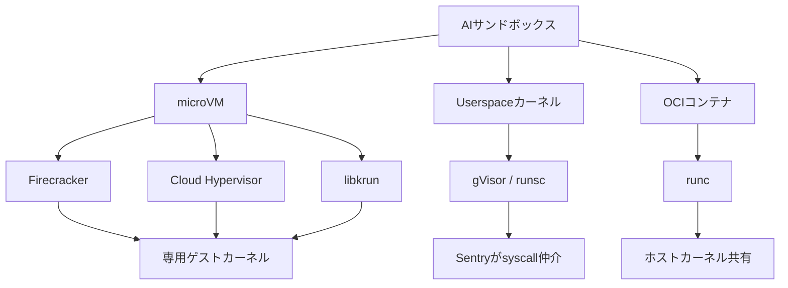
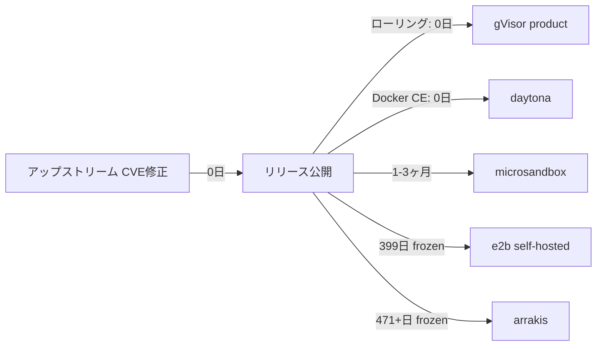

本記事は [https://arxiv.org/abs/2606.08433](https://arxiv.org/abs/2606.08433) の解説記事です。

## 論文概要

AIエージェントがユーザ提供のコードを安全に実行するには、ホストカーネルからの隔離が不可欠である。Andronchikらは、5つのAIサンドボックス製品を6つのエンジンレベルセキュリティ軸で体系的に評価した。評価対象は、microVM（Firecracker, Cloud Hypervisor, libkrun）、userspaceカーネル（gVisor）、OCIコンテナ（runc）の3クラスにまたがる。著者らは、エンジンクラスはアーキテクチャ軸上で明確に分離するが、同一クラス内の製品間では大きな乖離が生じることを報告している。

この記事は [Zenn記事: Bedrock AgentCore Managed HarnessとWeb Searchで社内ヘルプデスクの応答遅延を削減する](https://zenn.dev/0h_n0/articles/5d3fb5cf79f319) の深掘りです。AgentCoreがMicroVM（Firecracker）ベースのManaged Harnessを採用している背景には、本論文が明らかにするセキュリティ上の合理性がある。

## 情報源

- **arXiv ID**: 2606.08433
- **URL**: [https://arxiv.org/abs/2606.08433](https://arxiv.org/abs/2606.08433)
- **著者**: George Andronchik, Pavel Lokhmakov
- **投稿日**: 2026年6月7日
- **分野**: cs.CR（暗号とセキュリティ）
- **ライセンス**: CC BY 4.0
- **コンパニオンリポジトリ**: [orbitalab/RnD-ai-sandboxes-sec-study-part-1](https://github.com/orbitalab/RnD-ai-sandboxes-sec-study-part-1)（Apache-2.0）

## 背景と動機

AIエージェントの実用化に伴い、ユーザが提供する任意のコードをサーバサイドで実行するケースが急増している。LLMが生成したPythonスクリプトの検証、データ分析パイプラインの試行、ツール呼び出しの実行など、コード実行を伴うエージェント機能は多岐にわたる。

この文脈で、コード実行環境の隔離品質は、エージェントシステム全体のセキュリティを左右する。従来、コンテナ（Docker/runc）が広く使われてきたが、ホストカーネルを共有するアーキテクチャには本質的な限界がある。Andronchikらは、Wei et al.（arXiv:2505.18384v5）が示した「敵対者は8 H100 GPU時間、36ドル以下の計算コストで攻撃的サイバーセキュリティエージェントの性能を40%向上させた」という知見を引用し、エージェントを通じたサンドボックス脱出リスクが現実的な脅威であることを指摘している。

AWS Bedrock AgentCoreのManaged Harnessは、Firecrackerベースのmicro VM上でエージェントコードを実行する設計を採用している。本論文は、この設計選択の合理性を6つの定量的軸で検証する枠組みを提供する。

## 主要な貢献

Andronchikらの主要な貢献は以下の通りである。

- **6軸評価フレームワークの体系化**: Host Attack Surface、Information Leakage、Defense-in-Depth Stackability、CVE History、Patch Cadence、Fuzzing Postureの6軸でサンドボックスのエンジンレベルセキュリティを定量的に評価する手法を確立
- **5製品の横断比較**: arrakis（Cloud Hypervisor）、e2b（Firecracker）、microsandbox（libkrun）、gvisor（runsc）、daytona（runc）の5製品をデフォルト構成で同一条件下に比較
- **パッチレイテンシの構造的分析**: アップストリームの修正配信速度（P50で約0日）と、ダウンストリームの製品ピン固定による遅延（0日から471日以上）の桁違いの格差を定量化
- **ファジング投資の3層分類**: 継続的パブリックファジング、OSS-Fuzzのみ、ファジングなしの3層に分類し、最強の組合せ（microVM + 継続的ファザー）が未だ存在しないことを指摘
- **Firecrackerの「CVEゼロ」ベースラインの更新**: 2026年に初めてEscape級CVE（CVE-2026-5747, CVE-2026-1386）が公表され、従来の「Firecrackerにはハイパーバイザ脱出CVEなし」という前提が崩れたことを記録

## 技術的詳細

### 6軸評価フレームワーク

著者らが定義した6つの評価軸は、エンジンレベルのセキュリティ特性を網羅的に捉えるよう設計されている。

**軸1.1: ホスト攻撃表面（Host Attack Surface）**。VMM/ランタイムが発行するシステムコール数、seccompフィルタの許可数、ゲストから到達可能なカーネルプリミティブ数（14種のプリミティブカタログ）を計測する。プリミティブカタログには、bpf、io_uring_setup、userfaultfd、unprivileged_userns_clone、dev_kvmなどが含まれる。

**軸1.2: 情報漏洩（Information Leakage）**。28のサブプローブ（cpuinfo-model、meminfo-total、dmi-product-name、kernel-version等）で、ゲストからホスト情報がどの程度可視かを判定する。結果はleak / virtualized / inconclusive / unreadableの4段階で分類される。

**軸1.3: 多層防御の積層可能性（Defense-in-Depth Stackability）**。seccomp、AppArmor、SELinux、user namespace、capability drop、no-new-privileges、pids-maxの7レイヤについて、デフォルトで適用済みか（pass）、オペレータが追加可能か（stack-redeploy）、製品側で封鎖されているか（not-exposed）を評価する。

**軸1.4: 公開CVE履歴**。直近24ヶ月（2024年5月20日から2026年5月20日）のCVEをEscape、HostLeak、HostDoS、InternalEscの4カテゴリに分類し、エンジンごとに集計する。

**軸1.5: パッチケイデンス**。CVE公開から修正リリースまでのラグ（P50, P95, Max）を計測し、さらに製品レベルのダウンストリーム遅延を算出する。

**軸1.6: ファジング体制**。アップストリームのファジングインフラ（OSS-Fuzz、cargo-fuzz、内部ファザー）の有無と活動状況を3層（Tier 1/2/3）に分類する。

### エンジンクラスの違い



著者らによると、3つのエンジンクラスは隔離の原理が根本的に異なる。

**microVM**はハードウェア仮想化（KVM）を利用し、専用のゲストカーネルを起動する。ホストカーネルへの攻撃表面はVMMプロセスのシステムコールに限定される。Firecrackerのlightワークロードでは発行されるdistinctシステムコールはわずか13種にとどまる。

**userspaceカーネル**（gVisor）は、Go言語で実装されたSentryプロセスがゲストのシステムコールを仲介する。ゲストコードがホストカーネルに直接到達する経路は大幅に制限されるが、Sentry自身が発行するシステムコールはheavyワークロードで41 distinct、総数1,300,859に達する。

**OCIコンテナ**（runc）は、ホストカーネルをそのまま共有する。namespaceとcgroupによる論理的隔離のみであり、カーネル脆弱性がそのまま脱出経路となる。著者らは「コンテナ化されたワークロードは同じカーネルを共有しており、シスコール経由でトリガ可能な脆弱性はすべてホスト侵害につながりうる」と述べている。

## 実装のポイント

### セキュリティ選定基準

本論文の評価結果から導かれるセキュリティ選定の指針を以下にまとめる。

**到達可能プリミティブ数**は隔離の一次指標となる。gVisorが5/14で最小、e2b（Firecracker）が7/14、microsandbox（libkrun）とdaytona（runc）が11/14、arrakis（Cloud Hypervisor）が12/14と報告されている。ただし著者らは「小さな攻撃表面はEscape級CVEの減少に必要だが十分ではない」と指摘しており、Firecrackerは中程度の表面ながら2件のEscape級CVEを抱えている。

**seccompフィルタの粒度**も重要な要素である。e2b（Firecracker）の55 syscall許可は全製品中最も厳しく、gVisorの84 syscallが続く。一方、microsandbox、daytona、arrakisのリーダスレッドはseccomp mode 0（無効）であり、フィルタリングが機能していない。

**デフォルトで適用される防御レイヤ数**は運用上の安全マージンを示す。gVisorはデフォルトで4レイヤ（seccomp, cap-drop, no_new_privs, pids.max）を適用するのに対し、microsandboxはゼロである。デフォルト設定で運用するケースが多いことを考慮すると、この差は実運用に直結する。

## セキュリティ実装ガイド

### AgentCoreのmicroVM設計との関連

AWS Bedrock AgentCoreのManaged Harnessは、Firecrackerベースのmicro VMを採用している。本論文の結果は、この設計選択がセキュリティ面で合理的である根拠を定量的に示している。

Firecrackerエンジンを使用するe2bは、情報漏洩に関して28サブプローブ中ゼロリーク（全製品中最良タイ）を達成している。ホストのCPUモデル、RAM容量、ディスクシリアル番号といった情報がゲストから一切見えないことは、マルチテナント環境でのサイドチャネル攻撃リスクを低減する。

一方で、Firecrackerの2026年ベースラインシフトには注意が必要である。著者らは以下の2件を記録している。

- **CVE-2026-5747**: virtio-pci OOB（CVSS v4 8.7）、Escape（potential）
- **CVE-2026-1386**: jailer symlink host-write（CVSS v4 6.0）、Escape

これらは「Firecrackerにハイパーバイザ脱出CVEなし」という従来のベースラインを更新するものであり、AgentCoreの運用においてもパッチ適用の迅速性が重要であることを示している。

### AWS上でのセキュアなエージェント実行環境構築パターン

本論文の知見を踏まえ、AWS上でAIエージェントのコード実行環境を構築する際の設計パターンを以下に整理する。

**パターン1: Managed Harness（AgentCore推奨）**

AgentCoreのManaged Harnessを利用する場合、Firecrackerベースのmicro VMがAWS側で管理される。オペレータはパッチ適用やseccomp設定を自身で管理する必要がなく、AWSのパッチケイデンスに依存する形となる。本論文で指摘されたe2bの「399日ピン固定」問題は、AWSのマネージドサービスでは発生しにくい（AWSはFirecrackerのアップストリームメンテナでもある）が、ダウンストリームラグの監視は依然として重要である。

**パターン2: Self-managed Firecracker on EC2**

自前でFirecrackerを運用する場合、以下の設定が本論文の結果から推奨される。

```bash
# Firecrackerのseccompフィルタは55 syscallをデフォルトで許可
# jailer経由で起動し、追加の隔離レイヤを積層する
firecracker --seccomp-filter /path/to/custom-filter.json

# user namespaceの有効化（stack-redeploy対応）
# e2bではデフォルト無効だがオペレータ追加可能
sudo sysctl -w kernel.unprivileged_userns_clone=1

# AppArmorプロファイルの適用（stack-redeploy対応）
# Ficracker VMのホストプロセスに適用
aa-enforce /etc/apparmor.d/firecracker-vmm
```

著者らの軸1.3の結果によると、e2b（Firecracker）はデフォルトで2レイヤ（seccomp mode-2, no_new_privs）のみ適用されている。残り5レイヤ（AppArmor, user-ns, cap-drop, pids-max等）は「stack-redeploy」ステータスであり、オペレータが追加設定すれば利用可能である。セキュリティを最大化するには、これらのレイヤを明示的に積層すべきである。

**パターン3: gVisor on GKE/EKS**

gVisorはデフォルトで最も多くの防御レイヤ（4/7）を適用しており、到達可能プリミティブも5/14と最小である。AWS EKS上でgVisorを利用する場合のRuntimeClass設定の例を示す。

```yaml
apiVersion: node.k8s.io/v1
kind: RuntimeClass
metadata:
  name: gvisor
handler: runsc
---
apiVersion: v1
kind: Pod
metadata:
  name: agent-sandbox
spec:
  runtimeClassName: gvisor
  containers:
  - name: code-executor
    image: agent-sandbox:latest
    securityContext:
      runAsNonRoot: true
      readOnlyRootFilesystem: true
      allowPrivilegeEscalation: false
      capabilities:
        drop: ["ALL"]
```

### Firecracker vs gVisor vs OCIコンテナの選定指針

本論文の6軸評価結果を統合した選定指針を以下の表にまとめる。

| 評価軸 | Firecracker (e2b) | gVisor (runsc) | runc (daytona) |
|--------|-------------------|----------------|----------------|
| 到達可能プリミティブ | 7/14 | **5/14** | 11/14 |
| 情報漏洩 | **0件** | 2件 | 10件 |
| デフォルト防御レイヤ | 2/7 | **4/7** | 1/7 |
| 24ヶ月内CVE | 2件（2 Escape） | 3件（0 Escape） | 4件（4 Escape） |
| ダウンストリームラグ | 399日（e2b固定） | **0日**（ローリング） | **0日**（Docker CE） |
| ファジング層 | Tier 2 | **Tier 1** | **Tier 1** |

著者らは意図的に総合ランキングを提示していない。「異なるオペレータは異なる軸に重みづけを行う」ためである。代わりに、脅威モデルに基づく4つのオペレータプロファイルを定義している。

**リスク許容型（研究/ラボ環境）**: Firecracker/libkrunが許容可能。高いプリミティブ数やCVE数の少なさを重視しない代わりに、起動速度や軽量性を優先する。

**管理されたリスク型（商用SaaSバックエンド）**: 10未満のプリミティブ、ウィンドウ内3件未満のEscape CVE、30日未満のラグを要求。gVisor/Cloud Hypervisorが候補。AgentCoreのユースケースはこのプロファイルに該当する可能性が高い。

**コンプライアンス重視型（金融/医療）**: 多層防御の積層可能性、能動的ファジングのアトリビューション、7日未満のラグを要求。Docker CE経由のrunc（ただし`Privileged: true`を無効化すること）のみが条件を満たす。

**パフォーマンス重視型（組込みAIエージェント）**: ハイパーバイザオーバーヘッドのリスクを許容し、監査証跡の欠如も受け入れる。Firecracker/libkrunが選択肢となる。

### 運用上の重要な注意点

本論文が指摘するダウンストリームパッチラグは、セキュリティ運用上の最大の懸念事項である。



具体的に、arrakisはCloud Hypervisor v44.0に471日以上ピン固定されており、その間にアップストリームは12のタグ付きリリース（v45.0からv52.0）を出している。CVE-2026-45782（Escape potential, CVSS v4 8.9）は少なくとも7日間パッチ未適用、CVE-2026-27211（HostLeak, CVSS v4 9.1 critical）は少なくとも90日間パッチ未適用と報告されている。

e2bも同様に、Firecracker v1.14.1に399日間ピン固定されており、CVE-2026-5747（Escape potential, CVSS v4 8.7）が少なくとも44日間パッチ未適用である。

著者らは「アップストリームのパッチレイテンシが最大で約26日（runcのリグレッション）であるのに対し、ダウンストリームは0日からopaque（不透明）、471日以上にまで広がる。4桁の差がある」と述べている。この知見は、AgentCoreのようなマネージドサービスにおいても、利用するエンジンのバージョン管理ポリシーを確認することの重要性を示している。

## 実験結果（評価結果）

### 6軸スコア比較表

以下は著者らが報告した定量的評価結果の概要である。

| 軸 | メトリクス | 最良 | 中間 | 最悪 | 単位 |
|---|---|---|---|---|---|
| 1.1 | 到達可能プリミティブ | 5/14（gVisor） | 7-11 | 12/14（arrakis） | 件 |
| 1.1 | distinctシスコール（light） | 5（arrakis） | 13-33 | 57（daytona） | 件 |
| 1.1 | seccomp許可syscall | 55（e2b） | 84（gVisor） | mode-0 | 件 |
| 1.2 | 情報漏洩 | 0（e2b, microsandbox） | 1-2 | 10（daytona） | 件 |
| 1.3 | デフォルト適用レイヤ | 4（gVisor） | 0-2 | 0（microsandbox） | 件 |
| 1.4 | 24ヶ月内CVE | 2（FC, CH） | 3（gVisor） | 4（runc） | 件 |
| 1.4 | Escape級CVE | 0（gVisor） | 1-2 | 4（runc） | 件 |
| 1.5 | ダウンストリームラグ | 0日 | 399日 | 471+日 | 日 |
| 1.6 | ファジング層 | Tier 1 | Tier 2 | Tier 3 | 序数 |

特筆すべきは、runc（daytona）の情報漏洩である。28のサブプローブ中10件がリークしており、ホストのCPUモデル名、RAM総量、BIOSプロダクト名、カーネルバージョン、CPUマイクロコードリビジョン、IRQデバイス名、パーティション情報、ディスクモデル（SAMSUNG MZVL2512HCJQ-00B00がそのまま露出）、NVMeシリアル番号までもがゲストから可視であったと報告されている。

### クロス軸分析の主要な知見

著者らは軸間の交差分析から、以下の構造的パターンを報告している。

**小さな攻撃表面はEscape CVE減少に必要だが十分ではない**: gVisorは最小のプリミティブ到達性（5/14）とゼロのEscape CVEを示すが、Firecrackerは中程度の表面（7/14）で2件のEscape CVEを抱えている。virtioデバイス実装固有のUAF/OOB脆弱性がその原因である。

**ダウンストリームラグとスタッカビリティは独立したオペレータレバーである**: gVisorは4レイヤデフォルト適用+ローリング更新で強い初期状態を持つ。一方、daytonaはランナーが`Privileged: true`をハードコードしているため、runcエンジン自体のレイヤ合成能力を無効化してしまっている。

**libkrunの「CVEゼロ」は安全性の証明ではない**: CVE 0件とファザーなしとアカデミック研究なしの組合せは「構造的に未計測」であり、「証明済みの安全」ではないと著者らは明確に区別している。

## 実運用への応用

### AgentCoreのmicroVM採用根拠との接続

本論文の結果は、AgentCoreがFirecracker（microVM）を選択した背景を複数の軸から裏付けている。

**情報漏洩の最小化**: Firecrackerベースのe2bはゼロリークを達成しており、マルチテナントのエージェント実行環境として最適なプロファイルを示している。AgentCoreのManaged Harnessにおいても、ユーザのコード実行がホスト情報を一切漏洩しないことは、信頼性の基盤となる。

**カーネル共有リスクの回避**: runcベースのコンテナは直近24ヶ月で4件のEscape級CVE（うち3件は2025年11月5日に同時公開された同一パターンの変種）を抱えている。著者らは「procfs/mount-raceパターンは風土病的（endemic）であり、歴史的な16件のCVEのうち13件がEscapeに分類される」と述べている。microVMはこのリスクをアーキテクチャレベルで排除する。

**パッチ管理の優位性**: AWSがFirecrackerのアップストリームメンテナであることは、本論文が指摘するダウンストリームラグ問題を構造的に緩和する。e2bの399日ピン固定やarrakisの471日ピン固定と異なり、AWSマネージドサービスではパッチ適用がサービス提供者の責務として組み込まれている。

ただし、2026年にFirecrackerに初のEscape級CVEが公表された事実は、microVMであっても完全な隔離は保証されないことを意味する。多層防御の積層（seccomp + AppArmor + user namespace等）は、AgentCore上の自前コードにおいても検討すべきである。

## 関連研究

Andronchikらは、本研究を既存のサンドボックスセキュリティ研究の中に位置付けている。Chhabra et al.（2026, IEEE Access）はエージェントAIのセキュリティサーベイで、サンドボックスとCapability Confinementを4つの防御ファミリーの1つとして扱っている。Dehghantanha & Homayoun（arXiv:2603.22928）は7目標 x 10表面 x 5パスの分類法でサンドボックスを体系的に整理している。

エンジンレベルの分析としては、Zhan et al.（TSC 2023）が100のDocker Hubユーティリティに対するハイブリッド静的/動的シスコール制限を実施し、Weissman et al.（arXiv:2311.15999）がFirecracker v1.0.0/v1.4.0に対するSpectre/MDS PoCを実証している。本論文はこれらの個別エンジン分析を横断的フレームワークに統合した点で新規性がある。

## まとめと今後の展望

Andronchikらの研究は、AIコードサンドボックスのセキュリティを定量的に評価するための包括的なフレームワークを提示した。3つの核心的知見は以下の通りである。

1. エンジンクラスはアーキテクチャ軸で分離するが、クラス内の製品間格差は大きい
2. 製品のピン固定ポリシーがオペレータから見えるパッチレイテンシを支配し、0日から471日以上の幅がある
3. 最強の組合せ（microVM + 継続的パブリックファジング）は現時点で存在しない

本論文はPart 1（エンジンレベル特性）であり、Part 2ではランタイムレベル特性（ネットワーク隔離、ファイルシステム隔離、リソース制限等）の分析が予定されている。AgentCoreのようなマネージドサービスを利用する場合でも、本論文の評価軸を理解しておくことは、セキュリティアーキテクチャの設計判断に資するものである。

## 参考文献

- Andronchik, G., Lokhmakov, P. (2026). "AI Code Sandboxes: A Comparative Security Study. Part 1 of 2 -- Engine-Level Properties." arXiv:2606.08433 [cs.CR]
- Chhabra, A. et al. (2026). "Agentic AI Security Survey." IEEE Access. arXiv:2510.23883
- Dehghantanha, A., Homayoun, S. (2026). "SoK: Sandboxing in 7-goal x 10-surface x 5-path taxonomy." arXiv:2603.22928
- Weissman, A. et al. (2023). "Spectre/MDS PoCs against Firecracker." arXiv:2311.15999
- Zhan, L. et al. (2023). "Hybrid static-and-dynamic syscall limitation." TSC. arXiv:2510.03720
- Wei, B. et al. (2025). "Adversary improves offensive cybersecurity agent." arXiv:2505.18384v5
- Folkerts, H. et al. (2026). "Log-linear scaling of multi-step cyber-attack capability." UK AISI. arXiv:2603.11214
- コンパニオンリポジトリ: [orbitalab/RnD-ai-sandboxes-sec-study-part-1](https://github.com/orbitalab/RnD-ai-sandboxes-sec-study-part-1)
