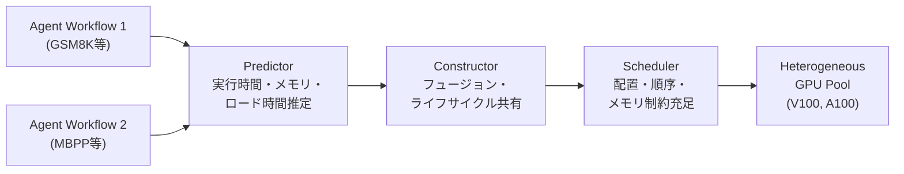

本記事は [https://arxiv.org/abs/2609.03335](https://arxiv.org/abs/2609.03335) の解説記事です。

## 論文概要（Abstract）

Wangらは、異種GPU環境上で複数のマルチエージェントLLMワークフローを同時実行する際のオーケストレーション問題に取り組んでいる。提案システムは**Predictor**（デバイス固有のコスト推定）、**Constructor**（物理グラフ構築）、**Scheduler**（オンライン統合最適化）の3コンポーネントから構成される予測誘導型ランタイムである。著者らによると、バースト到着シナリオにおいてエンドツーエンドのmakespanを最大36.8%、P95完了レイテンシを25.9%削減し、セッションあたり最大24.63 GPU-secondsの計算資源を節約できると報告している（arXiv:2609.03335v1, Section 5）。

この記事は [Zenn記事: Bedrock AgentCore Managed HarnessとWeb Searchで社内ヘルプデスクの応答遅延を削減する](https://zenn.dev/0h_n0/articles/5d3fb5cf79f319) の深掘りです。

## 情報源

- **arXiv ID**: 2609.03335
- **URL**: [arXiv:2609.03335](https://arxiv.org/abs/2609.03335)
- **著者**: Jinghao Wang, Yifeng Zhang, Xiao Zhou, Yao Lu他（10名）
- **所属**: 北京航空航天大学（Beihang University）、リーズ大学（University of Leeds）
- **発表年**: 2026年9月
- **分野**: Distributed, Parallel, and Cluster Computing (cs.DC)

## 背景と動機（Background & Motivation）

### マルチエージェントワークフローのスケジューリング課題

LLMを活用したエージェントワークフローは、単一のLLM呼び出しを超え、複数のモデルを連鎖的・並列的に組み合わせる構成が主流になりつつある。例えば、コード生成ワークフローでは「生成 -> テスト -> 診断 -> 修正 -> 再検証」という複数ステップを異なるモデルで実行する。

しかし、こうしたワークフローをプライベートな小規模GPUプール上で同時実行する際、以下の問題が深刻化すると著者らは指摘している。

1. **デバイス異種性**: 同じモデルの同じ処理でも、V100とA100では実行時間・メモリ消費・モデルロード時間が大きく異なる
2. **モデルライフサイクル管理**: モデルのロード・常駐・退避のタイミングが全体のレイテンシを支配する。著者らの予備実験では、モデル可用性の待機時間のうち77.3-85.5%がモデルロードと「ロード開始不能」に起因すると報告されている（Figure 1a）
3. **ノード境界での再アドミッション**: ワークフローの各ノードで独立にGPUリソースを確保し直す方式では、P95レイテンシの39-42%が再確保待ちに費やされる（Figure 2b）

従来のエージェントサービングシステム（Parrot、Kairos等）は、これらの課題を部分的にしか解決していない。Wangらによると、既存システムは「アドミッション境界の変換を、ライフサイクル管理・順序決定・配置・累積メモリ計画の統合的な最適化から除外している」という。

## 主要な貢献（Key Contributions）

著者らは以下の3つの貢献を主張している。

1. **物理グラフ構築（Constructor）**: 同一デプロイメントのチェインフュージョンと、ワークフロー間で互換性のあるモデルライフサイクルアクションの共有により、意味的に等価な物理的実行代替案を構築する手法
2. **デバイス横断予測（Predictor）**: モデル構造をオペレータデータフローグラフとして表現し、デバイス固有の実行時間・ピークメモリ・モデルロード時間を推定。ワークフロー依存関係を通じて予測値を伝播させる手法
3. **適応的スケジューリング（Scheduler）**: ライブプール状態と累積メモリ制約の下で、実行可能な物理グラフとスケジュールを構築し、ランタイムフィードバックに基づいて未コミットの決定を再ランク付けするオンライン最適化手法

## 技術的詳細（Technical Details）

### 全体アーキテクチャ

提案システムは3つのコンポーネントが連携して動作する。



### Predictor: デバイス考慮型コスト推定

Predictorはモデルをオペレータデータフローグラフ $\mathcal{G}_m$ として表現する。各ノードはオペレータの種類・演算量・パラメータサイズ・テンソル形状を持ち、エッジはテンソル依存関係を示す。グラフエンコーダがエッジに沿って情報を交換し、プーリングされた表現をリクエスト・デバイスのコンテキストと結合する。

予測関数は以下の3つの出力を生成する。

$$
(\hat{T}^{run}_{m,r,g},\ \hat{M}^{peak}_{m,r,g},\ \hat{T}^{load}_{d,g}) = \text{Predict}(\mathcal{G}_m, r, \mathbf{h}_m)
$$

- $\hat{T}^{run}_{m,r,g}$: モデル $m$ のリクエスト $r$ に対するデバイス $g$ 上での実行時間
- $\hat{M}^{peak}_{m,r,g}$: ピークメモリ使用量
- $\hat{T}^{load}_{d,g}$: モデルロード時間
- $r$: リクエスト設定（プロンプト長・出力長等）
- $\mathbf{h}_m$: デバイス属性ベクトル

実運用ではオフラインでプロファイルテーブル $\mathcal{C}_\kappa$ を事前計算する。ここで $\kappa = (d, g, b, \ell^{in}, \ell^{out})$（デプロイメント・デバイス・バッチサイズ・入出力長のバケット）をキーとする。ランタイムでは実際の入力長を包含する最小バケットを検索し、出力長には経験的な90パーセンタイル値を使用する。

メモリ予約量は安全マージンを含む。

$$
M^{adm}_\kappa(t) = \hat{M}^{peak}_\kappa + \varepsilon_M + \rho_\kappa(t)
$$

ここで $\varepsilon_M$ は固定バッファ、$\rho_\kappa(t)$ はOOM発生後に増加する適応的マージンである。

### Constructor: 物理グラフ構築

Constructorは2段階で物理グラフを構築する。

**第1段階: ワークフロー内フュージョン**

同一デプロイメント上で連続実行される単鎖ノードを融合する。融合可能な条件は以下の通りである。

$$
u, v \in V_a,\quad \text{succ}_{lt}(u) = \{v\},\quad \text{pred}_{lt}(v) = \{u\},\quad d(u) = d(v),\quad \theta(u) \sim_{cfg} \theta(v)
$$

- 2つのノードが同じアクティベーション集合 $V_a$ に属する
- $u$ の後続が $v$ のみ、$v$ の前任が $u$ のみ（一対一の関係）
- 同一デプロイメント $d(u) = d(v)$
- 設定が互換 $\theta(u) \sim_{cfg} \theta(v)$

融合チェイン $c = (v_1, \ldots, v_h)$ のアドミッションパラメータは以下で計算される。

$$
I^{adm}_c = \max_{1 \le i \le h} \bar{I}_i, \quad O^{adm}_c = \max_{1 \le i \le h} O_i, \quad \hat{T}^{run}_{c,g} = \sum_{i=1}^{h} \hat{T}^{run}_{m(c), r_i, g}
$$

ここで $\bar{I}_i = P_i + \sum_{j \in \mathcal{A}_i} O_j$（固定プロンプトと消費済み出力の包絡線）である。融合により、チェイン全体で1回のアドミッションとレプリカリースで済むため、再確保のオーバーヘッドを排除できる。

**第2段階: ワークフロー間ライフサイクル統合**

異なるワークフローが同じモデルを必要とする場合、ライフサイクルアクション（ロード・プリフェッチ・回収）を共有する。ライフサイクルの選択肢は以下のように定式化される。

$$
\mathcal{H}^X_t(u) = \{\langle \alpha_X(d(u)) \rangle, \langle \text{Reclaim}, \alpha_X(d(u)) \rangle\}
$$

ここで $X \in \{F, N\}$ はレディ（Ready）またはニアレディ（Near-ready）ユニットを示す。Readyワークにはロード、Near-readyワークにはプリフェッチが対応する。

### Scheduler: オンライン統合最適化

Schedulerは以下の制約を同時に満たすグラフとスケジュールを構築する。

**デバイスの実行可能ドメイン**:

$$
\mathcal{D}_t(u, \nu) = \{a \in \mathcal{D}\ |\ I_u + O_u \le L^{max}_{d(u)},\ M^{adm}_{\kappa(u, g(a), \nu)}(t) \le C^M_a\}
$$

コンテキスト長制限とアドミッションメモリ容量の両方を満たすデバイスのみが候補となる。

**累積メモリ実行可能性制約**:

$$
R^{G,\pi}_{a,t}(\tau) + \sum_s x_{s,a} \cdot M^{inc}_{s,a} \cdot \mathbb{1}[\hat{s}^{G,\pi}_s \le \tau < \hat{c}^{G,\pi}_s] \le C^M_a \quad \forall a, \tau
$$

任意の時刻 $\tau$ において、常駐モデルメモリと処理中リクエストメモリの合計がデバイス容量 $C^M_a$ を超えないことを保証する。

**辞書式ランキング関数**: スケジュールの候補は以下の辞書式順序で評価される。

$$
\Phi_t(G, \pi) = (-A_1, \ldots, -A_k,\ \hat{C}_F,\ -P_n,\ H_{life})
$$

1. $-A_1, \ldots, -A_k$: 優先度クラス別のレディワークカバレッジ（最大化）
2. $\hat{C}_F$: 完了時刻（最小化）
3. $-P_n$: 適時プリフェッチ数（最大化）
4. $H_{life}$: ライフサイクルオーバーヘッド（最小化）

### アルゴリズム: オンライン統合グラフ-スケジュール構築

アルゴリズムの全体フローは以下の通りである。

```
Algorithm 1: Online Joint Graph-Schedule Construction
---
入力: 計画ウィンドウ W_t、レディ集合 F_t、ニアレディ集合 N_t、
      スナップショット S_t、予測テーブル C
出力: 構築プラン (G_t, pi_t)、グラント Gamma_t、ライフサイクルアクション A_t

1.  R <- RankReady(F_t, S_t)           # 優先度とエイジングでランク付け
2.  Gamma_t, L, B <- 空集合
3.  for u in R do
4.    b_u <- BestFeasibleBinding(u, S_t, C)  # 最適な実行可能バインディング
5.    if b_u が受入可能な常駐レプリカを再利用 then
6.      Gamma_t <- Gamma_t + {(u, b_u)}      # 即座にグラント
7.    else if b_u != null then
8.      L <- L + {(u, b_u)}                  # ロード/スケールアウト必要
9.    else
10.     B <- B + {u}                          # 延期
11. A_t <- PlanReady(L, B, S_t, C)            # ロード・スケールアウト・回収を計画
12. if Gamma_t = 空 and A_t = 空 then
13.   A_t <- PlanPrefetch(N_t, S_t, C)        # ニアレディのプリフェッチ
14. (G_t, pi_t) <- Propagate(W_t, Gamma_t, A_t, S_t)  # 順序衝突を解決
15. (Gamma_t, A_t) <- Prefix_t(G_t, pi_t, S_t)        # 実行可能プレフィックスをコミット
16. return (G_t, pi_t, Gamma_t, A_t)
```

このアルゴリズムの重要なポイントは、ステップ12-13である。レディワークもライフサイクルアクションも実行できない場合にのみ、ニアレディワークのプリフェッチを行う。これにより、実行中のタスクを妨げることなく、将来のモデルロード時間を隠蔽できる。

## 実装のポイント（Implementation）

### テストベッド構成

著者らの実験環境は以下の構成である。

- **ノード構成**: 3台の異種ノード（V100-32GB x 2台、A100-40GB x 1台）
- **CPU**: Intel Xeon Gold/Silverプロセッサ
- **ソフトウェア**: CUDA 12、vLLM 0.10.2、PyTorch 2.8.0、Transformers 4.55.2

### 実装上の注意点

1. **プロファイルテーブルの事前計算**: オフラインでモデル x デバイス x バッチサイズ x 入出力長のバケットごとにプロファイルを計算し、ルックアップテーブルとして保持する
2. **適応的メモリマージン**: OOM発生時に $\rho_\kappa(t)$ を増加させることで、次回以降のメモリ予約量を自動調整する
3. **プレフィックスコミット**: 計画全体ではなく、確実に実行可能な先頭部分のみをコミットし、残りは次のスナップショットで再計画する。これにより予測誤差の影響を局所化できる
4. **フュージョンの境界条件**: 分岐・合流点ではフュージョンを適用しない。単純な直列チェインのみが融合対象となる

## Production Deployment Guide

本論文のPredictor-Constructor-Schedulerアーキテクチャは、マルチエージェントワークフローのGPUオーケストレーションに直接適用可能である。以下では、AWS環境でこの概念を実装するパターンを示す。

### AWS実装パターン（コスト最適化重視）

**トラフィック量別の推奨構成**:

| 規模 | 構成 | 月額概算 | ユースケース |
|------|------|---------|-------------|
| Small (~100 req/日) | Lambda + Bedrock | $50-150 | プロトタイプ・PoC |
| Medium (~1,000 req/日) | ECS Fargate + SageMaker Endpoint | $800-2,000 | 社内ヘルプデスク |
| Large (10,000+ req/日) | EKS + Spot + SageMaker Multi-Model | $3,000-8,000 | 本番サービス |

**コスト削減テクニック**:
- Spot Instances活用で最大90%削減（ただしプリエンプション対応が必要）
- SageMaker Multi-Model Endpointでモデル切り替えオーバーヘッドを削減
- Bedrock Batch APIで非同期処理を50%削減
- Prompt Caching有効化で30-90%削減

注意: 上記は記事執筆時点のAWS ap-northeast-1（東京）リージョン料金に基づく概算値である。実際のコストはトラフィックパターンにより変動するため、AWS料金計算ツールでの確認を推奨する。

### レイテンシ考慮型スケジューラの実装例

論文のSchedulerの中核概念であるデバイス選択とメモリ制約チェックを、Pythonで簡易実装する。

```python
"""
Latency-aware scheduler for multi-agent LLM workflows.
Simplified implementation of the core scheduling logic from arXiv:2609.03335.
"""
from __future__ import annotations

import heapq
from dataclasses import dataclass, field
from enum import Enum, auto
from typing import Optional


class DeviceType(Enum):
    """GPU device types with heterogeneous capabilities."""
    V100_32GB = auto()
    A100_40GB = auto()
    A100_80GB = auto()


@dataclass
class DeviceProfile:
    """Device-specific profile for cost estimation (Predictor output)."""
    device_type: DeviceType
    memory_capacity_gb: float
    estimated_load_time_s: float
    estimated_run_time_s: float
    estimated_peak_memory_gb: float


@dataclass
class WorkUnit:
    """A unit of work in the agent workflow DAG."""
    unit_id: str
    model_name: str
    input_tokens: int
    output_tokens: int
    priority_class: int = 0
    predecessors: list[str] = field(default_factory=list)
    estimated_completion: float = 0.0


@dataclass
class DeviceState:
    """Runtime state of a GPU device."""
    device_id: str
    device_type: DeviceType
    memory_capacity_gb: float
    memory_used_gb: float = 0.0
    resident_models: set[str] = field(default_factory=set)
    current_task: Optional[str] = None

    @property
    def memory_available_gb(self) -> float:
        """Available memory in GB."""
        return self.memory_capacity_gb - self.memory_used_gb


@dataclass
class ScheduleDecision:
    """A scheduling decision binding a work unit to a device."""
    unit_id: str
    device_id: str
    action: str  # "reuse", "load", "prefetch", "defer"
    estimated_start: float
    estimated_completion: float


class LatencyAwareScheduler:
    """
    Simplified implementation of the online joint graph-schedule
    construction algorithm (Algorithm 1 in the paper).

    Key insight: reuse resident replicas first, then load/scale-out,
    then prefetch near-ready work only when no ready work advances.
    """

    def __init__(
        self,
        devices: list[DeviceState],
        profiles: dict[tuple[str, DeviceType], DeviceProfile],
        memory_margin_gb: float = 1.0,
    ) -> None:
        """
        Args:
            devices: List of available GPU devices with current state.
            profiles: Prediction table C_kappa indexed by
                      (model_name, device_type).
            memory_margin_gb: Safety margin epsilon_M for memory
                              reservation (default 1.0 GB).
        """
        self.devices = {d.device_id: d for d in devices}
        self.profiles = profiles
        self.memory_margin = memory_margin_gb
        self._oom_penalty: dict[tuple[str, DeviceType], float] = {}

    def _admission_memory(
        self, model_name: str, device_type: DeviceType
    ) -> float:
        """
        Compute admission memory M^adm_kappa(t) per Equation in paper:
        M^adm = M^peak + epsilon_M + rho_kappa(t)
        """
        profile = self.profiles.get((model_name, device_type))
        if profile is None:
            return float("inf")
        rho = self._oom_penalty.get((model_name, device_type), 0.0)
        return profile.estimated_peak_memory_gb + self.memory_margin + rho

    def _feasible_devices(self, unit: WorkUnit) -> list[str]:
        """
        Compute feasible device domain D_t(u, nu) per Equation 8:
        devices satisfying context-length limit and memory capacity.
        """
        feasible = []
        for dev_id, dev in self.devices.items():
            adm_mem = self._admission_memory(
                unit.model_name, dev.device_type
            )
            if adm_mem <= dev.memory_available_gb:
                feasible.append(dev_id)
        return feasible

    def _best_feasible_binding(
        self, unit: WorkUnit, current_time: float
    ) -> Optional[ScheduleDecision]:
        """
        BestFeasibleBinding: prefer reuse > load, minimize latency.
        """
        feasible = self._feasible_devices(unit)
        if not feasible:
            return None

        # Priority 1: reuse resident replica (no load overhead)
        for dev_id in feasible:
            dev = self.devices[dev_id]
            if unit.model_name in dev.resident_models:
                profile = self.profiles.get(
                    (unit.model_name, dev.device_type)
                )
                if profile is None:
                    continue
                return ScheduleDecision(
                    unit_id=unit.unit_id,
                    device_id=dev_id,
                    action="reuse",
                    estimated_start=current_time,
                    estimated_completion=(
                        current_time + profile.estimated_run_time_s
                    ),
                )

        # Priority 2: load model (incurs loading overhead)
        best: Optional[ScheduleDecision] = None
        for dev_id in feasible:
            dev = self.devices[dev_id]
            profile = self.profiles.get(
                (unit.model_name, dev.device_type)
            )
            if profile is None:
                continue
            start = current_time + profile.estimated_load_time_s
            completion = start + profile.estimated_run_time_s
            if best is None or completion < best.estimated_completion:
                best = ScheduleDecision(
                    unit_id=unit.unit_id,
                    device_id=dev_id,
                    action="load",
                    estimated_start=start,
                    estimated_completion=completion,
                )
        return best

    def schedule(
        self,
        ready_units: list[WorkUnit],
        near_ready_units: list[WorkUnit],
        current_time: float = 0.0,
    ) -> list[ScheduleDecision]:
        """
        Online joint graph-schedule construction (Algorithm 1).

        Steps:
        1. Rank ready units by priority and aging
        2. Bind each to best feasible device (reuse > load)
        3. If no ready work advances, plan prefetch for near-ready
        4. Return executable prefix of decisions
        """
        # Step 1: RankReady - sort by priority class (lower = higher)
        ranked = sorted(ready_units, key=lambda u: u.priority_class)

        grants: list[ScheduleDecision] = []
        load_needed: list[ScheduleDecision] = []
        deferred: list[WorkUnit] = []

        # Steps 3-10: Iterate ranked ready units
        for unit in ranked:
            binding = self._best_feasible_binding(unit, current_time)
            if binding is None:
                deferred.append(unit)
            elif binding.action == "reuse":
                grants.append(binding)
                # Update device memory state
                dev = self.devices[binding.device_id]
                profile = self.profiles.get(
                    (unit.model_name, dev.device_type)
                )
                if profile:
                    dev.memory_used_gb += (
                        profile.estimated_peak_memory_gb
                    )
            else:
                load_needed.append(binding)

        # Step 11: PlanReady - commit load actions
        for decision in load_needed:
            dev = self.devices[decision.device_id]
            adm_mem = self._admission_memory(
                next(
                    u.model_name
                    for u in ranked
                    if u.unit_id == decision.unit_id
                ),
                dev.device_type,
            )
            if adm_mem <= dev.memory_available_gb:
                grants.append(decision)
                dev.memory_used_gb += adm_mem

        # Steps 12-13: PlanPrefetch if no ready work advanced
        if not grants:
            for unit in near_ready_units:
                binding = self._best_feasible_binding(
                    unit, current_time
                )
                if binding is not None:
                    binding.action = "prefetch"
                    grants.append(binding)
                    break  # One prefetch at a time

        return grants

    def report_oom(
        self, model_name: str, device_type: DeviceType,
        increment_gb: float = 0.5,
    ) -> None:
        """Adaptive margin: increase rho_kappa after OOM failure."""
        key = (model_name, device_type)
        self._oom_penalty[key] = (
            self._oom_penalty.get(key, 0.0) + increment_gb
        )
```

### Terraformインフラコード

**Medium構成（ECS Fargate + SageMaker）**:

マルチエージェントワークフローの実行基盤をTerraformで構築する。

```hcl
# --- VPC & Networking ---
module "vpc" {
  source  = "terraform-aws-modules/vpc/aws"
  version = "~> 5.0"

  name = "agent-orchestrator-vpc"
  cidr = "10.0.0.0/16"

  azs             = ["ap-northeast-1a", "ap-northeast-1c"]
  private_subnets = ["10.0.1.0/24", "10.0.2.0/24"]
  public_subnets  = ["10.0.101.0/24", "10.0.102.0/24"]

  enable_nat_gateway = true
  single_nat_gateway = true
}

# --- SageMaker Multi-Model Endpoint ---
resource "aws_sagemaker_model" "multi_model" {
  name               = "agent-multi-model"
  execution_role_arn = aws_iam_role.sagemaker_exec.arn

  primary_container {
    image          = "763104351884.dkr.ecr.ap-northeast-1.amazonaws.com/djl-inference:0.31.0-lmi14.0.0-cu124"
    model_data_url = "s3://${aws_s3_bucket.models.id}/models/"
    mode           = "MultiModel"

    environment = {
      OPTION_MODEL_ID       = "placeholder"
      OPTION_TENSOR_PARALLEL_DEGREE = "1"
      OPTION_MAX_ROLLING_BATCH_SIZE = "8"
    }
  }
}

resource "aws_sagemaker_endpoint_configuration" "multi_model" {
  name = "agent-multi-model-config"

  production_variants {
    variant_name           = "primary"
    model_name             = aws_sagemaker_model.multi_model.name
    initial_instance_count = 2
    instance_type          = "ml.g5.2xlarge"

    managed_instance_scaling {
      status                = "ENABLED"
      min_instance_count    = 1
      max_instance_count    = 4
    }
  }
}

# --- ECS Fargate (Scheduler Service) ---
resource "aws_ecs_cluster" "orchestrator" {
  name = "agent-orchestrator"

  setting {
    name  = "containerInsights"
    value = "enabled"
  }
}

resource "aws_ecs_task_definition" "scheduler" {
  family                   = "latency-aware-scheduler"
  requires_compatibilities = ["FARGATE"]
  network_mode             = "awsvpc"
  cpu                      = "1024"
  memory                   = "2048"
  execution_role_arn       = aws_iam_role.ecs_exec.arn
  task_role_arn            = aws_iam_role.ecs_task.arn

  container_definitions = jsonencode([
    {
      name  = "scheduler"
      image = "${aws_ecr_repository.scheduler.repository_url}:latest"
      portMappings = [{
        containerPort = 8080
        protocol      = "tcp"
      }]
      environment = [
        { name = "SAGEMAKER_ENDPOINT", value = aws_sagemaker_endpoint.multi_model.name },
        { name = "PROFILE_TABLE", value = aws_dynamodb_table.profiles.name },
        { name = "MEMORY_MARGIN_GB", value = "1.0" },
      ]
      logConfiguration = {
        logDriver = "awslogs"
        options = {
          awslogs-group         = aws_cloudwatch_log_group.scheduler.name
          awslogs-region        = "ap-northeast-1"
          awslogs-stream-prefix = "scheduler"
        }
      }
    }
  ])
}

# --- DynamoDB (Profile Table C_kappa) ---
resource "aws_dynamodb_table" "profiles" {
  name         = "model-device-profiles"
  billing_mode = "PAY_PER_REQUEST"
  hash_key     = "model_device_key"
  range_key    = "bucket_key"

  attribute {
    name = "model_device_key"
    type = "S"
  }

  attribute {
    name = "bucket_key"
    type = "S"
  }

  ttl {
    attribute_name = "expires_at"
    enabled        = true
  }
}

# --- CloudWatch Alarms ---
resource "aws_cloudwatch_metric_alarm" "scheduling_latency" {
  alarm_name          = "scheduler-p95-latency-high"
  comparison_operator = "GreaterThanThreshold"
  evaluation_periods  = 3
  metric_name         = "SchedulingLatencyP95"
  namespace           = "AgentOrchestrator"
  period              = 300
  statistic           = "p95"
  threshold           = 500
  alarm_description   = "Scheduling P95 latency exceeds 500ms"
  alarm_actions       = [aws_sns_topic.alerts.arn]
}

resource "aws_cloudwatch_metric_alarm" "gpu_memory_utilization" {
  alarm_name          = "sagemaker-gpu-memory-high"
  comparison_operator = "GreaterThanThreshold"
  evaluation_periods  = 2
  metric_name         = "GPUMemoryUtilization"
  namespace           = "aws/sagemaker/Endpoints"
  period              = 60
  statistic           = "Maximum"
  threshold           = 90
  alarm_description   = "GPU memory utilization exceeds 90%"
  alarm_actions       = [aws_sns_topic.alerts.arn]

  dimensions = {
    EndpointName = aws_sagemaker_endpoint.multi_model.name
    VariantName  = "primary"
  }
}
```

### 運用・監視設定

**CloudWatch Logs Insights クエリ**:

```
# スケジューリングレイテンシ分析
fields @timestamp, scheduling_latency_ms, action_type, device_id
| filter event = "schedule_decision"
| stats avg(scheduling_latency_ms) as avg_latency,
        pct(scheduling_latency_ms, 95) as p95_latency,
        count(*) as total_decisions
  by bin(5m)

# モデルロード vs レプリカ再利用の比率
fields @timestamp, action
| filter event = "schedule_decision"
| stats count(*) as cnt by action
| sort cnt desc
```

**X-Ray トレーシング**:

```python
"""X-Ray instrumentation for the scheduler service."""
from aws_xray_sdk.core import xray_recorder, patch_all

patch_all()  # boto3, requests等の自動計装


@xray_recorder.capture("schedule_workflow")
def schedule_workflow(
    workflow_id: str,
    ready_units: list,
    near_ready_units: list,
) -> list:
    """Trace the full scheduling pipeline."""
    subsegment = xray_recorder.current_subsegment()
    subsegment.put_annotation("workflow_id", workflow_id)
    subsegment.put_metadata(
        "ready_count", len(ready_units), "scheduling"
    )

    decisions = scheduler.schedule(
        ready_units, near_ready_units
    )

    subsegment.put_metadata(
        "decisions_count", len(decisions), "scheduling"
    )
    return decisions
```

### コスト最適化チェックリスト

| カテゴリ | チェック項目 | 推奨アクション |
|---------|------------|--------------|
| アーキテクチャ | トラフィック量に応じた構成選択 | Small: Serverless、Medium: Fargate、Large: EKS |
| リソース最適化 | SageMaker Managed Spot Training活用 | 学習ジョブはSpot Instanceで最大90%削減 |
| モデル管理 | Multi-Model Endpointの活用 | モデル切り替えオーバーヘッドをSageMakerに委譲 |
| LLMコスト | Bedrock Batch API + Prompt Caching | 非同期処理50%削減、キャッシュで30-90%削減 |
| 監視 | AWS Budgets + Cost Anomaly Detection | 日次レポートとSNS通知を設定 |
| リソース管理 | 未使用エンドポイントの自動停止 | 夜間・休日のスケールイン設定 |

## 実験結果（Results）

### エンドツーエンド性能

著者らは3つの到着パターン（バースト、Poisson 0.150 sess/s、Poisson 0.075 sess/s）で評価を実施している。各パターンで180セッション（GSM8K、MBPP、QMSumの各60セッション）を使用している。

**バースト到着（180セッション同時投入）**:

| メトリクス | 提案手法 | Parrot | Kairos | Oracle |
|-----------|---------|--------|--------|--------|
| Makespan (s) | **634.2** | 988.1 (+35.8%) | 1003.5 (+36.8%) | - |
| P95完了 (s) | **587.0** | 787.1 (+25.4%) | 792.3 (+25.9%) | - |

ベースライン値は論文Figure 5から読み取った値である。

**Poisson 0.150 sess/s**:

| メトリクス | 提案手法 | Parrot | Kairos |
|-----------|---------|--------|--------|
| Makespan (s) | **965.1** | 1102.5 (+12.4%) | 1110.9 (+13.1%) |

到着レートが緩やかになるにつれ改善幅は縮小するが、Poisson 0.075 sess/sでも1.6-6.6%の改善を維持していると著者らは報告している。

### GPU時間効率

セッションあたりのGPU使用時間（GPU-seconds）の比較である。

| ワークフロー | 提案手法 | Parrot | Kairos | 削減率 |
|-------------|---------|--------|--------|--------|
| GSM8K | **46.26** | 87.6 | 87.9 | 46.9-47.4% |
| MBPP | **15.33** | 32.97 | 35.41 | 53.8-56.7% |
| QMSum | **65.25** | 76.4 | 78.1 | 14.5-16.5% |

特にMBPPワークフローで53.8-56.7%という大幅な削減を達成している。著者らによると、これはツール呼び出しを含む分岐構造のワークフローでフュージョンとライフサイクル共有が効果的に機能するためである。

アイドル常駐時間（GPU上にモデルがロードされているが処理していない時間）も大幅に削減されている。GSM8Kでは18.27 GPU-sに対し、ベースラインは60.32-60.68 GPU-sであった。

### Predictor精度

| メトリクス | Predictor | Formula | GBDT |
|-----------|-----------|---------|------|
| Loading WAPE (%) | **8.05** | 27.21 | 24.35 |
| Runtime WAPE (%) | **7.25** | 15.29 | 11.05 |
| Peak VRAM WAPE (%) | 14.08 | **11.98** | 15.70 |
| 順序正確度 (%) | **97.94** | 96.37 | 96.53 |

WAPEはWeighted Absolute Percentage Errorである。Predictorはロード時間のWAPEを8.05%に抑え、Formula推定器の27.21%から70.4%改善している。ピークVRAM予測ではFormula推定器がわずかに上回るが、スケジューリングで最も重要な順序正確度（どちらのデバイスが速いかの判定）では97.94%と最高値を達成している。

### コンポーネントアブレーション

各コンポーネントの寄与を検証するアブレーション実験の結果は以下の通りである。

- **ワークフロー間ライフサイクル統合の除去**: makespanが7.1-16.4%増加
- **フュージョンの除去**: P95レイテンシが8.5-44.9%増加、makespanが3.0-8.1%増加
- **プリフェッチの除去**: 全到着パターンでmakespanが一貫して増加

フュージョンの影響が最も大きく、特にバースト到着時にP95レイテンシが最大44.9%悪化するとの結果は、ノード境界での再アドミッションオーバーヘッドの深刻さを裏付けている。

## 実運用への応用（Practical Applications）

### Bedrock AgentCoreとの関連

Zenn記事で取り上げたBedrock AgentCore Managed Harnessは、マルチエージェントワークフローの実行基盤を提供するAWSマネージドサービスである。本論文のアプローチは、AgentCoreの内部スケジューリングに以下の示唆を与える。

1. **モデルライフサイクルの事前計画**: AgentCoreがワークフローのDAG構造を認識し、次に必要なモデルをプリフェッチすることで、ステップ間のコールドスタート待ちを削減できる可能性がある
2. **フュージョンによる再アドミッション削減**: 同じモデルを連続呼び出しするステップを融合し、1回のセッションで処理することでオーバーヘッドを削減できる
3. **異種インスタンスの活用**: AgentCoreがGPUインスタンスの種類ごとの性能プロファイルを保持し、ワークロードに最適なインスタンスを選択する仕組みは、コスト効率の改善に寄与する

### 社内ヘルプデスクへの適用

Zenn記事のユースケースである社内ヘルプデスクでは、「質問分類 -> 検索 -> 回答生成 -> 品質チェック」のような多段パイプラインが一般的である。本論文の手法を適用する場合、質問分類と検索を小型モデル（Qwen3-4B相当）で、回答生成を大型モデル（Qwen3-8B相当）で実行し、小型モデルの処理中に大型モデルをプリフェッチする戦略が有効である。

## 関連研究（Related Work）

著者らは関連研究を以下の4領域に整理している。

1. **予測**: DNNPerf、PerfSeer、nn-Meter、Habitat、NeuSight等が訓練・推論時間を予測するが、モデルロード時間とGPU異種性を統合的に扱うものは少ない
2. **DAG実行・変換**: DryadLINQ、Tez、WiseFuse等がDAGを最適化するが、LLMのモデルライフサイクル（ロード・常駐・退避）は対象外である
3. **サービング状態管理**: vLLM（PagedAttention）、ServerlessLLM、KVFlow等がKVキャッシュやモデル重みを管理するが、ワークフロー全体の依存関係を考慮しない
4. **エージェントサービング**: Parrot（SemanticVariable）、Kairos（優先度スケジューラ + メモリディスパッチャ）が近い研究であるが、物理グラフ構築と将来のライフサイクル需要を統合計画に含めていない点が本研究との差異である

## まとめと今後の展望

Wangらの提案するPredictor-Constructor-Schedulerアーキテクチャは、マルチエージェントLLMワークフローの異種GPU環境でのオーケストレーションにおいて、makespan 36.8%削減、P95レイテンシ 25.9%削減という有意な改善を達成している。特に、ワークフローのDAG構造を活用したフュージョンとプリフェッチの統合が、ノード境界での再アドミッションオーバーヘッドの削減に大きく寄与している点が注目に値する。

今後の課題として、著者らは以下を示唆している。

- より大規模なGPUプール（数十-数百GPU）へのスケーラビリティ検証
- LoRA等のパラメータ効率的手法との統合
- KVキャッシュの移送・共有によるさらなるレイテンシ削減

## 参考文献

1. Wang, J., Zhang, Y., Zhou, X., Lu, Y., Zhang, Y., Sun, X., Wo, T., Wang, X., Hu, C., & Yang, R. (2026). Latency-Aware Orchestration for Multi-Agent LLM Workflows on Heterogeneous GPUs. arXiv:2609.03335.
2. Lin, Z., et al. (2024). Parrot: Efficient Serving of LLM-based Applications with Semantic Variable. OSDI 2024.
3. Chen, K., et al. (2025). Kairos: Workflow-aware Agent Scheduling on Heterogeneous Platforms. arXiv.
4. Kwon, W., et al. (2023). Efficient Memory Management for Large Language Model Serving with PagedAttention. SOSP 2023.
5. Cobbe, K., et al. (2021). Training Verifiers to Solve Math Word Problems. arXiv:2110.14168.
6. Austin, J., et al. (2021). Program Synthesis with Large Language Models. arXiv:2108.07732.
7. Zhong, M., et al. (2021). QMSum: A New Benchmark for Query-Based Multi-Domain Meeting Summarization. NAACL 2021.
