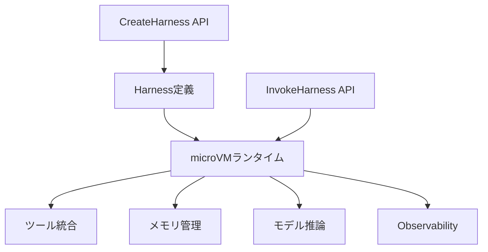

## ブログ概要（Summary）

本記事は [Amazon Bedrock AgentCore harness is now generally available](https://aws.amazon.com/blogs/machine-learning/amazon-bedrock-agentcore-harness-is-now-generally-available-go-from-idea-to-production-grade-agent-in-minutes/) の解説記事です。

Amazon Bedrock AgentCore Managed Harness（以下、Managed Harness）は、2026年6月に一般提供（GA）を開始したAWSのエージェント実行基盤である。公式ブログによると、`CreateHarness`と`InvokeHarness`の2つのAPIだけで、サンドボックス化されたmicroVM上にプロダクショングレードのAIエージェントを構築・実行できる。Runtime、Memory、Gateway、Browser、Code Interpreter、Identity、Observabilityの7つのプリミティブを宣言的に統合し、モデルプロバイダの切り替え、バージョン管理、export-to-codeによるコード化まで一貫して提供する点が特徴である。

この記事は [Zenn記事: Bedrock AgentCore Managed HarnessとWeb Searchで社内ヘルプデスクの応答遅延を削減する](https://zenn.dev/0h_n0/articles/5d3fb5cf79f319) の深掘りです。

## 情報源

- **種別**: 企業テックブログ（AWS Machine Learning Blog）
- **URL**: [https://aws.amazon.com/blogs/machine-learning/amazon-bedrock-agentcore-harness-is-now-generally-available-go-from-idea-to-production-grade-agent-in-minutes/](https://aws.amazon.com/blogs/machine-learning/amazon-bedrock-agentcore-harness-is-now-generally-available-go-from-idea-to-production-grade-agent-in-minutes/)
- **組織**: Amazon Web Services
- **発表日**: 2026年6月（GA）

## 技術的背景（Technical Background）

### AIエージェント基盤の課題

AIエージェントをプロダクション環境で運用するには、LLM呼び出しだけでなく、ツール統合、メモリ管理、セキュリティ、オブザーバビリティ、バージョン管理など多数のインフラコンポーネントを組み合わせる必要がある。従来は各コンポーネントを個別に構築・統合する必要があり、エージェントのロジック開発よりもインフラ構築に多くの工数がかかる状態であった。

公式ブログによると、Managed Harnessはこの課題に対し「AgentCoreプリミティブを2 APIの背後にラップする」アプローチを採用している。開発者はエージェントの振る舞い（使用モデル、ツール構成、メモリ設定）を宣言的に定義するだけで、サンドボックス化されたmicroVM上にエージェントが自動的にプロビジョニングされる。

### 学術的背景

LLMエージェントのツール利用に関しては、Toolformer（Schick et al., 2023）がLLMに対してツールの自律的呼び出しを学習させるアプローチを提案した。またReAct（Yao et al., 2023）は推論（Reasoning）と行動（Acting）を交互に実行するフレームワークとして広く採用されている。Managed Harnessはこれらの学術的フレームワークを、マネージドインフラとして抽象化し、運用負荷をゼロに近づける試みと位置づけられる。

## 実装アーキテクチャ（Architecture）

### 2 API設計

Managed Harnessの中核は、`CreateHarness`（定義）と`InvokeHarness`（実行）の2つのAPIで構成されている。



**CreateHarness**は以下のパラメータでエージェントの構成を定義する。

| パラメータ | 説明 |
|-----------|------|
| `harnessName` | エージェントの識別名 |
| `model` | 使用するモデルプロバイダとモデル名 |
| `executionRoleArn` | IAMロール（権限管理） |
| `tools` | ツール定義の配列 |
| `skills` | スキルバンドル |
| `memory` | メモリ構成 |
| `environmentArtifact` | カスタムコンテナイメージ |

**InvokeHarness**はセッションIDとメッセージを渡してエージェントを実行する。公式ブログによると、`runtimeSessionId`は最低33文字が必要で、セッション単位でコンテキストが維持される。

```python
response = client.invoke_harness(
    harnessArn=harness["harnessArn"],
    runtimeSessionId=session_id,  # 最低33文字
    messages=[{
        "role": "user",
        "content": [{"text": "社内VPN接続の手順を教えてください"}]
    }]
)
```

### microVMサンドボックス

公式ブログによると、各エージェントセッションは「ファイルシステムとシェルを備えたmicroVM」上で動作する。エージェントはmicroVM内でファイルの読み書きやコマンド実行を安全に行える。ファイルシステムのオプションは以下の3種類が用意されている。

| 種別 | マネージド | VPC必要 | 永続性 |
|------|-----------|---------|--------|
| マネージドセッションストレージ | はい | いいえ | 同一`runtimeSessionId`内で保持 |
| EFSアクセスポイント | BYO | はい | セッション跨ぎ、Harness間共有可能 |
| S3 Filesアクセスポイント | BYO | はい | 完全永続、S3耐久性 |

### ツール統合の5つの型

Managed Harnessは5種類のツール統合を宣言的に設定できる。

```json
{
  "tools": [
    { "type": "agentcore_browser" },
    { "type": "agentcore_code_interpreter" },
    {
      "type": "remote_mcp",
      "name": "helpdesk_tool",
      "config": {
        "remoteMcp": { "url": "https://mcp.helpdesk.example.com/mcp" }
      }
    },
    {
      "type": "agentcore_gateway",
      "name": "internal_api",
      "config": {
        "agentCoreGateway": {
          "arn": "arn:aws:bedrock-agentcore:ap-northeast-1:123456789012:gateway/gw-xxx"
        }
      }
    },
    {
      "type": "inline_function",
      "name": "approve_ticket",
      "config": {
        "inlineFunction": {
          "description": "チケット承認用のHuman-in-the-loop関数"
        }
      }
    }
  ]
}
```

各ツール型の役割は以下の通りである。

- **agentcore_gateway**: AgentCore GatewayのARNを参照し、OpenAPI/Smithy/Lambda/MCPターゲットをIAM/JWT認証付きで公開する
- **remote_mcp**: 外部MCPサーバーにURL指定で直接接続する
- **agentcore_browser**: フルブラウザサンドボックスでWeb操作を行う
- **agentcore_code_interpreter**: PythonとNode.jsのサンドボックス実行環境を提供する
- **inline_function**: カスタム関数をHuman-in-the-loop機能付きで定義する

`InvokeHarness`の`allowed_tools`パラメータにより、呼び出しごとに使用可能なツールを制限することも可能である。

### メモリ管理の3つのモード

公式ブログによると、メモリ管理は以下の3つのモードから選択できる。

**1. Managed Memory（デフォルト）**: Harness側が自動的にメモリをプロビジョニングする。`SEMANTIC`（意味的類似性による検索）と`SUMMARIZATION`（会話要約）の2つの戦略が利用可能で、イベントの有効期限を日数で指定する。

```json
{
  "memory": {
    "managedMemoryConfiguration": {
      "strategies": ["SEMANTIC", "SUMMARIZATION"],
      "eventExpiryDuration": 30
    }
  }
}
```

**2. Bring-Your-Own Memory**: 既存のAgentCore Memory ARNを指定して利用する。

```json
{
  "memory": {
    "agentCoreMemoryConfiguration": {
      "arn": "arn:aws:bedrock-agentcore:ap-northeast-1:123456789012:memory/mem-xxx"
    }
  }
}
```

**3. Stateless Agent**: メモリを無効化し、状態を持たないエージェントとして動作させる。

```json
{
  "memory": { "disabled": {} }
}
```

社内ヘルプデスクのユースケースでは、ユーザーごとの問い合わせ履歴を`SEMANTIC`戦略で保持し、繰り返しの質問に対して過去のコンテキストを活用することで応答品質を向上させる構成が有効である。

### モデルの柔軟性

公式ブログによると、Managed Harnessは以下のモデルプロバイダに対応している。

- **Bedrock**: Anthropic Claude、Amazon Nova、Meta Llama、DeepSeek、Qwen等
- **OpenAI**: GPTシリーズへの直接アクセス
- **Gemini**: Google Gemini
- **LiteLLM**: LiteLLM互換の全プロバイダ（Anthropic直接、Cohere、Mistral、Vertex AI、Azure OpenAI等）

注目すべき点として、公式ブログでは「セッション途中でもプロバイダを切り替え、コンテキストを維持できる」と説明されている。例えば、計画立案にClaude Opusを使い、コード生成にGPT-5.5を使い、要約にGeminiを使う、といった構成がセッション内で可能である。APIキーはAgentCore Identityのトークンボールトに安全に格納され、エージェント自体が生の認証情報に触れることはない。

## Production Deployment Guide

### AWS実装パターン（コスト最適化重視）

AgentCore Managed Harnessを社内ヘルプデスクに適用する場合のトラフィック量別推奨構成を示す。公式ブログによると、Harness自体に追加料金はなく、Runtimeコンピュートが$0.0895/vCPU-hour、$0.00945/GB-hourで課金される。以下のコスト試算は2026年9月時点のAWS ap-northeast-1（東京）リージョン料金に基づく概算値であり、実際のコストはトラフィックパターンやバースト使用量により変動する。

**Small構成（~100 req/日）: Lambda + AgentCore Harness + DynamoDB**

| サービス | 用途 | 月額概算 |
|---------|------|---------|
| Lambda | フロントエンド処理 | $5-10 |
| AgentCore Harness Runtime | エージェント実行（0.5 vCPU, 1GB） | $30-60 |
| DynamoDB On-Demand | チケット管理・FAQ格納 | $5-15 |
| Bedrock推論（Claude Haiku） | LLM推論 | $10-50 |
| CloudWatch | ログ・メトリクス | $5-15 |
| **合計** | | **$55-150** |

**Medium構成（~1,000 req/日）: ECS Fargate + AgentCore Harness + ElastiCache**

| サービス | 用途 | 月額概算 |
|---------|------|---------|
| ECS Fargate（2タスク） | APIゲートウェイ・ルーティング | $80-120 |
| AgentCore Harness Runtime | エージェント実行（2 vCPU, 4GB） | $150-300 |
| ElastiCache（t3.small） | セッションキャッシュ | $30-50 |
| DynamoDB On-Demand | チケット・履歴管理 | $20-50 |
| Bedrock推論（Claude Sonnet） | LLM推論 | $100-250 |
| CloudWatch + X-Ray | 監視・トレーシング | $10-30 |
| **合計** | | **$390-800** |

**Large構成（10,000+ req/日）: EKS + AgentCore Harness + Karpenter**

| サービス | 用途 | 月額概算 |
|---------|------|---------|
| EKS コントロールプレーン | Kubernetes管理 | $75 |
| EC2 Spot（Karpenter管理、4-8ノード） | ワーカーノード | $200-500 |
| AgentCore Harness Runtime | エージェント実行（8 vCPU, 16GB） | $500-1,200 |
| ElastiCache（r6g.large） | セッション・FAQキャッシュ | $150-200 |
| DynamoDB On-Demand | チケット・履歴・分析 | $100-300 |
| Bedrock推論（Claude Sonnet + Haiku） | LLM推論（ルーティング使用） | $800-2,500 |
| CloudWatch + X-Ray + Cost Explorer | 監視・コスト管理 | $30-80 |
| **合計** | | **$1,855-4,855** |

コスト削減テクニックとして、Spot Instancesの活用（最大90%削減）、Reserved Instancesの1年コミット（最大72%削減）、Bedrock Batch APIの利用（50%削減）、Prompt Caching有効化（30-90%削減）が有効である。

### Terraformインフラコード

#### Small構成（Lambda + AgentCore Harness）

```hcl
# === VPC基盤（NAT Gateway不使用でコスト削減） ===
resource "aws_vpc" "helpdesk" {
  cidr_block           = "10.0.0.0/16"
  enable_dns_hostnames = true
  enable_dns_support   = true

  tags = {
    Name        = "helpdesk-vpc"
    Environment = "production"
    CostCenter  = "helpdesk"
  }
}

resource "aws_subnet" "private" {
  count             = 2
  vpc_id            = aws_vpc.helpdesk.id
  cidr_block        = cidrsubnet(aws_vpc.helpdesk.cidr_block, 8, count.index)
  availability_zone = data.aws_availability_zones.available.names[count.index]

  tags = { Name = "helpdesk-private-${count.index}" }
}

# === IAMロール（最小権限原則） ===
resource "aws_iam_role" "lambda_helpdesk" {
  name = "helpdesk-lambda-role"
  assume_role_policy = jsonencode({
    Version = "2012-10-17"
    Statement = [{
      Action    = "sts:AssumeRole"
      Effect    = "Allow"
      Principal = { Service = "lambda.amazonaws.com" }
    }]
  })
}

resource "aws_iam_role_policy" "lambda_bedrock" {
  name = "bedrock-agentcore-access"
  role = aws_iam_role.lambda_helpdesk.id
  policy = jsonencode({
    Version = "2012-10-17"
    Statement = [
      {
        Effect   = "Allow"
        Action   = ["bedrock-agentcore:InvokeHarness"]
        Resource = "arn:aws:bedrock-agentcore:ap-northeast-1:*:harness/*"
      },
      {
        Effect   = "Allow"
        Action   = ["dynamodb:PutItem", "dynamodb:GetItem", "dynamodb:Query"]
        Resource = aws_dynamodb_table.tickets.arn
      },
      {
        Effect   = "Allow"
        Action   = ["logs:CreateLogGroup", "logs:CreateLogStream", "logs:PutLogEvents"]
        Resource = "arn:aws:logs:ap-northeast-1:*:*"
      }
    ]
  })
}

# === Lambda関数 ===
resource "aws_lambda_function" "helpdesk_api" {
  function_name = "helpdesk-agentcore-api"
  runtime       = "python3.12"
  handler       = "main.handler"
  role          = aws_iam_role.lambda_helpdesk.arn
  timeout       = 120  # AgentCore応答待ち
  memory_size   = 256

  environment {
    variables = {
      HARNESS_ARN    = var.harness_arn
      TICKETS_TABLE  = aws_dynamodb_table.tickets.name
    }
  }

  tags = { CostCenter = "helpdesk" }
}

# === DynamoDB（On-Demandでコスト最適化） ===
resource "aws_dynamodb_table" "tickets" {
  name         = "helpdesk-tickets"
  billing_mode = "PAY_PER_REQUEST"
  hash_key     = "ticket_id"
  range_key    = "created_at"

  attribute {
    name = "ticket_id"
    type = "S"
  }
  attribute {
    name = "created_at"
    type = "S"
  }

  server_side_encryption { enabled = true }
  point_in_time_recovery { enabled = true }

  tags = { CostCenter = "helpdesk" }
}

# === CloudWatchアラーム（コスト監視） ===
resource "aws_cloudwatch_metric_alarm" "lambda_duration" {
  alarm_name          = "helpdesk-lambda-duration-high"
  comparison_operator = "GreaterThanThreshold"
  evaluation_periods  = 3
  metric_name         = "Duration"
  namespace           = "AWS/Lambda"
  period              = 300
  statistic           = "p95"
  threshold           = 90000  # 90秒
  alarm_actions       = [var.sns_topic_arn]

  dimensions = {
    FunctionName = aws_lambda_function.helpdesk_api.function_name
  }
}
```

#### Large構成（EKS + Karpenter + Spot）

```hcl
# === EKSクラスタ ===
module "eks" {
  source  = "terraform-aws-modules/eks/aws"
  version = "~> 20.0"

  cluster_name    = "helpdesk-production"
  cluster_version = "1.31"
  vpc_id          = aws_vpc.helpdesk.id
  subnet_ids      = aws_subnet.private[*].id

  # コスト最適化: パブリックアクセス最小化
  cluster_endpoint_public_access  = true
  cluster_endpoint_private_access = true

  tags = { CostCenter = "helpdesk" }
}

# === Karpenter Provisioner（Spot優先） ===
resource "kubectl_manifest" "karpenter_nodepool" {
  yaml_body = yamlencode({
    apiVersion = "karpenter.sh/v1"
    kind       = "NodePool"
    metadata   = { name = "helpdesk-spot" }
    spec = {
      template = {
        spec = {
          requirements = [
            { key = "karpenter.sh/capacity-type", operator = "In", values = ["spot", "on-demand"] },
            { key = "node.kubernetes.io/instance-type", operator = "In",
              values = ["m6i.xlarge", "m6a.xlarge", "m5.xlarge", "c6i.xlarge"] },
          ]
          nodeClassRef = { group = "karpenter.k8s.aws", kind = "EC2NodeClass", name = "default" }
        }
      }
      limits   = { cpu = "64", memory = "128Gi" }
      disruption = {
        consolidationPolicy = "WhenEmptyOrUnderutilized"
        consolidateAfter    = "60s"
      }
    }
  })
}

# === Secrets Manager（AgentCore設定） ===
resource "aws_secretsmanager_secret" "agentcore_config" {
  name                    = "helpdesk/agentcore-config"
  recovery_window_in_days = 7

  tags = { CostCenter = "helpdesk" }
}

# === AWS Budgets（予算アラート） ===
resource "aws_budgets_budget" "helpdesk_monthly" {
  name         = "helpdesk-monthly-budget"
  budget_type  = "COST"
  limit_amount = "5000"
  limit_unit   = "USD"
  time_unit    = "MONTHLY"

  cost_filter {
    name   = "TagKeyValue"
    values = ["user:CostCenter$helpdesk"]
  }

  notification {
    comparison_operator       = "GREATER_THAN"
    threshold                 = 80
    threshold_type            = "PERCENTAGE"
    notification_type         = "ACTUAL"
    subscriber_email_addresses = [var.alert_email]
  }

  notification {
    comparison_operator       = "GREATER_THAN"
    threshold                 = 100
    threshold_type            = "PERCENTAGE"
    notification_type         = "ACTUAL"
    subscriber_email_addresses = [var.alert_email]
  }
}
```

### 運用・監視設定

#### CloudWatch Logs Insightsクエリ

AgentCore Harnessは自動的にCloudWatch GenAI Observabilityと統合される。以下のクエリでコスト異常とレイテンシを分析できる。

```
# AgentCoreセッション別のレイテンシ分析（P95/P99）
fields @timestamp, @message
| filter @message like /InvokeHarness/
| stats avg(duration_ms) as avg_latency,
        percentile(duration_ms, 95) as p95_latency,
        percentile(duration_ms, 99) as p99_latency,
        count() as request_count
  by bin(1h)
| sort @timestamp desc
```

```
# ツール呼び出し別のエラー率分析
fields @timestamp, tool_name, status
| filter status = "ERROR"
| stats count() as error_count by tool_name
| sort error_count desc
```

#### CloudWatchアラーム設定

```python
import boto3

cloudwatch = boto3.client("cloudwatch", region_name="ap-northeast-1")

# AgentCore Harness応答時間アラーム
cloudwatch.put_metric_alarm(
    AlarmName="helpdesk-agentcore-latency-high",
    MetricName="InvokeHarnessLatency",
    Namespace="AWS/BedrockAgentCore",
    Statistic="p95",
    Period=300,
    EvaluationPeriods=3,
    Threshold=30000,  # 30秒
    ComparisonOperator="GreaterThanThreshold",
    AlarmActions=["arn:aws:sns:ap-northeast-1:123456789012:helpdesk-alerts"],
    Dimensions=[{"Name": "HarnessName", "Value": "helpdesk-agent"}],
)
```

#### X-Rayトレーシング設定

```python
from aws_xray_sdk.core import xray_recorder, patch_all

# boto3自動計装
patch_all()

@xray_recorder.capture("invoke_helpdesk_agent")
def invoke_agent(session_id: str, query: str) -> dict:
    """AgentCore Harnessの呼び出しをX-Rayでトレース"""
    subsegment = xray_recorder.current_subsegment()
    subsegment.put_annotation("session_id", session_id)
    subsegment.put_metadata("query_length", len(query))

    response = agentcore_client.invoke_harness(
        harnessArn=HARNESS_ARN,
        runtimeSessionId=session_id,
        messages=[{"role": "user", "content": [{"text": query}]}],
    )

    subsegment.put_metadata("response_tokens", response.get("usage", {}).get("total_tokens", 0))
    return response
```

#### Cost Explorer自動レポート

```python
import boto3
from datetime import datetime, timedelta

ce = boto3.client("ce", region_name="us-east-1")
sns = boto3.client("sns", region_name="ap-northeast-1")

def daily_cost_report() -> None:
    """日次コストレポートを取得しSNS通知"""
    end = datetime.utcnow().strftime("%Y-%m-%d")
    start = (datetime.utcnow() - timedelta(days=1)).strftime("%Y-%m-%d")

    result = ce.get_cost_and_usage(
        TimePeriod={"Start": start, "End": end},
        Granularity="DAILY",
        Metrics=["UnblendedCost"],
        Filter={
            "Tags": {
                "Key": "CostCenter",
                "Values": ["helpdesk"],
            }
        },
        GroupBy=[{"Type": "DIMENSION", "Key": "SERVICE"}],
    )

    total = sum(
        float(g["Metrics"]["UnblendedCost"]["Amount"])
        for r in result["ResultsByTime"]
        for g in r["Groups"]
    )

    if total > 100:
        sns.publish(
            TopicArn="arn:aws:sns:ap-northeast-1:123456789012:helpdesk-cost-alert",
            Subject=f"[ALERT] Helpdesk daily cost: ${total:.2f}",
            Message=f"Daily cost exceeded $100 threshold: ${total:.2f}",
        )
```

### コスト最適化チェックリスト

#### アーキテクチャ選択

- [ ] トラフィック100 req/日以下 → Serverless（Lambda + AgentCore Harness）
- [ ] トラフィック100-5,000 req/日 → Hybrid（ECS Fargate + AgentCore Harness）
- [ ] トラフィック5,000 req/日超 → Container（EKS + Karpenter + AgentCore Harness）

#### リソース最適化

- [ ] EC2ワーカーノードはSpot Instances優先（最大90%削減）
- [ ] 安定ワークロード分はReserved Instances 1年コミット（最大72%削減）
- [ ] Savings Plans検討（EC2 + Fargate横断で最大72%削減）
- [ ] Lambda: Power Tuningでメモリサイズを最適化
- [ ] ECS/EKS: HPA設定でアイドル時スケールダウン
- [ ] Karpenter: `consolidationPolicy: WhenEmptyOrUnderutilized`で自動集約

#### LLMコスト削減

- [ ] Bedrock Batch API使用（非同期処理可能な問い合わせに対して50%削減）
- [ ] Prompt Caching有効化（共通システムプロンプトで30-90%削減）
- [ ] モデルルーティング: 簡単なFAQはHaiku、複雑な問い合わせはSonnetに振り分け
- [ ] `max_tokens`制限: ヘルプデスク応答は1,000トークン以内に設定
- [ ] AgentCore Managed Memoryの`eventExpiryDuration`を業務に合わせて最適化

#### 監視・アラート

- [ ] AWS Budgets: 月額上限の80%・100%で通知設定
- [ ] CloudWatch Alarms: AgentCore Harness応答時間P95を30秒以内に監視
- [ ] Cost Anomaly Detection: Bedrock + AgentCore Runtime費用の異常検知
- [ ] 日次コストレポート: Cost Explorer APIで$100/日超過をSNS通知

#### リソース管理

- [ ] 未使用のHarnessバージョンを定期的に棚卸し
- [ ] CostCenterタグをすべてのリソースに付与
- [ ] CloudWatch Logsにライフサイクルポリシー（30日保持）を設定
- [ ] 開発環境のAgentCore Harnessは夜間・休日にセッション停止
- [ ] DynamoDBのTTLでチケットデータを自動アーカイブ

## パフォーマンス最適化（Performance）

### セッション再利用

AgentCore Harnessでは`runtimeSessionId`を再利用することで、同一セッション内のmicroVMとメモリコンテキストを維持できる。公式ブログによると、マネージドセッションストレージはstop/resumeサイクル間でも保持されるため、ユーザーが翌日に同じ問い合わせを続ける場合でもコンテキストが失われない。

社内ヘルプデスクでは、ユーザーIDベースの`runtimeSessionId`（例: `helpdesk-user-{employee_id}-{yyyymmdd}`）を設計することで、同一ユーザーの1日の問い合わせをセッション内に集約し、メモリ再構築のオーバーヘッドを削減できる。

### allowed_toolsによる実行時間短縮

`InvokeHarness`の`allowed_tools`パラメータを活用し、リクエストの種類に応じてツールを制限することで、エージェントの判断空間を狭め、応答速度を向上させることが可能である。例えば、FAQ応答にはメモリ検索のみ、システム設定変更にはGatewayツールのみ、といった制限が有効である。

## 運用での学び（Production Lessons）

### バージョン管理とロールバック

公式ブログによると、`UpdateHarness`を呼び出すたびに「モデル、システムプロンプト、ツール、メモリ設定、スキル、環境、トランケーション、実行制限の完全な構成をキャプチャした不変バージョン」が作成される。

エンドポイント管理では、`DEFAULT`エンドポイントは自動的に最新バージョンに更新されるが、`PROD`や`STAGING`といった名前付きエンドポイントは明示的な昇格操作が必要である。

```bash
# PRODエンドポイントをバージョン2に固定
aws bedrock-agentcore-control create-harness-endpoint \
  --harness-id my-harness-xxx --endpoint-name PROD \
  --harness-version 2

# テスト後にバージョン5をPRODに昇格
aws bedrock-agentcore-control update-harness-endpoint \
  --harness-id my-harness-xxx --endpoint-name PROD \
  --harness-version 5
```

この仕組みにより、新しいシステムプロンプトやツール構成をSTAGINGで検証してからPRODに昇格させるBlue/Greenデプロイメントが実現できる。問題が発生した場合は、エンドポイントを前バージョンに戻すだけでロールバックが完了する。

### Export-to-Codeによるコード化

公式ブログによると、`agentcore export harness`コマンドにより、Managed Harnessの構成をStrands Agentsベースのコードとしてエクスポートできる。

```bash
agentcore export harness --name myHarness-6dk4df \
  --output ./my-agent
```

エクスポートされたコードには「モデル、プロンプト、ツール、メモリ配線、スキル、コンテナ環境」がすべて保持される。公式ブログでは、将来的にClaude Agent SDKへのエクスポートにも対応予定と説明されている。このexport-to-code機能は、Managed Harnessの宣言的構成では対応できないカスタムロジックが必要になった場合に、マネージドからセルフマネージドへスムーズに移行するための仕組みである。

### Skills Framework

Managed Harnessは4つのソースからスキルを取得できる。

```json
{
  "skills": [
    { "awsSkills": {} },
    { "git": { "uri": "https://github.com/org/skills", "path": "helpdesk/" } },
    { "s3": { "uri": "s3://company-skills/helpdesk-sops/" } }
  ]
}
```

**awsSkills**はGA時に追加されたAWSキュレーションのスキルバンドルで、公式ブログによると「SDK利用、IaC、IAM、CloudWatch、Bedrock」の各領域のベストプラクティスが含まれている。`paths`パラメータでスコープを絞ることもできる。GitHubやS3からカスタムスキルを取り込むことで、社内SOPやFAQテンプレートをエージェントに直接提供できる。

## 学術研究との関連（Academic Connection）

Managed Harnessのアーキテクチャは、エージェントシステムの学術的研究と密接に関連している。ReAct（Yao et al., 2023）の推論-行動ループはHarnessのツール呼び出しパターンに対応し、MemoryWeave（Modarressi et al., 2025）のような長期記憶メカニズムはManaged Memoryの`SEMANTIC`/`SUMMARIZATION`戦略と類似した設計思想を持つ。またStrands Agents（AWSが開発したOSSエージェントフレームワーク）をexport先としている点は、マネージドサービスとOSSの相互運用性を重視する近年のトレンドを反映している。

## まとめと実践への示唆

Amazon Bedrock AgentCore Managed Harnessは、`CreateHarness`と`InvokeHarness`の2 APIでAIエージェントのプロダクション運用を大幅に簡素化する。公式ブログによると、microVMによるサンドボックス実行、5種類のツール統合、3つのメモリモード、マルチプロバイダ対応、不変バージョン管理、export-to-codeのすべてが宣言的構成で利用できる。Harness自体に追加料金がなく、Runtimeコンピュートの従量課金のみで運用できる点も実用上の利点である。社内ヘルプデスクへの適用では、Managed Memoryによるユーザーコンテキストの自動保持とGateway/MCPによる社内システム連携が応答品質の向上に直結する。

## 参考文献

- **Blog URL**: [Amazon Bedrock AgentCore harness is now generally available](https://aws.amazon.com/blogs/machine-learning/amazon-bedrock-agentcore-harness-is-now-generally-available-go-from-idea-to-production-grade-agent-in-minutes/)
- **Related Papers**:
  - Yao, S. et al. (2023). "ReAct: Synergizing Reasoning and Acting in Language Models." ICLR 2023.
  - Schick, T. et al. (2023). "Toolformer: Language Models Can Teach Themselves to Use Tools." NeurIPS 2023.
- **Related Zenn article**: [Bedrock AgentCore Managed HarnessとWeb Searchで社内ヘルプデスクの応答遅延を削減する](https://zenn.dev/0h_n0/articles/5d3fb5cf79f319)
