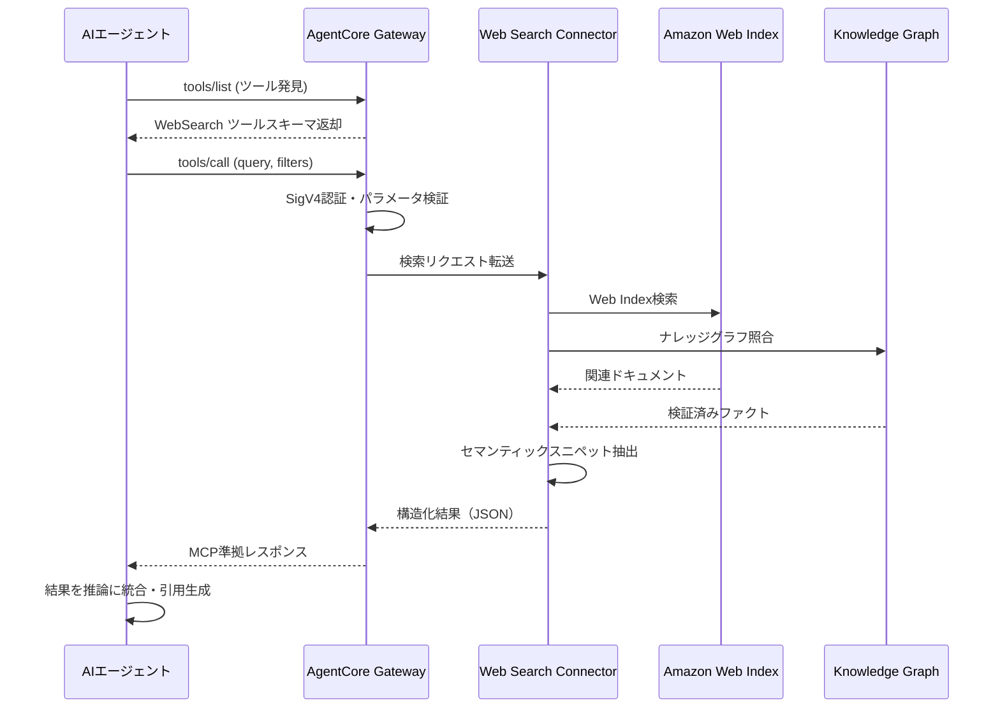

## ブログ概要（Summary）

本記事は [https://aws.amazon.com/blogs/aws/announcing-web-search-on-amazon-bedrock-agentcore-ground-your-ai-agents-in-current-accurate-web-knowledge/](https://aws.amazon.com/blogs/aws/announcing-web-search-on-amazon-bedrock-agentcore-ground-your-ai-agents-in-current-accurate-web-knowledge/) の解説記事です。

AWSは2026年にAmazon Bedrock AgentCoreの新機能として「Web Search Tool」をGA（一般提供）として発表した。Web Search Toolは、AIエージェントが最新のWeb情報をソース付きで取得できるフルマネージド検索ツールであり、クエリがAWSインフラ内に留まるデータセキュリティモデルを特徴とする。Alexa+、Amazon Quick、Kiroで培った検索基盤技術を活用し、数百億規模のドキュメントインデックスとナレッジグラフを組み合わせた独自の検索エンジンを提供している。

この記事は [Zenn記事: Bedrock AgentCore Managed HarnessとWeb Searchで社内ヘルプデスクの応答遅延を削減する](https://zenn.dev/0h_n0/articles/5d3fb5cf79f319) の深掘りです。

## 情報源

- **種別**: 企業テックブログ（AWS News Blog / AWS Machine Learning Blog）
- **URL**: [https://aws.amazon.com/blogs/aws/announcing-web-search-on-amazon-bedrock-agentcore-ground-your-ai-agents-in-current-accurate-web-knowledge/](https://aws.amazon.com/blogs/aws/announcing-web-search-on-amazon-bedrock-agentcore-ground-your-ai-agents-in-current-accurate-web-knowledge/)
- **補助ドキュメント**: [AWS公式ドキュメント - Web Search Tool](https://docs.aws.amazon.com/bedrock-agentcore/latest/devguide/gateway-target-connector-web-search-tool.html)
- **組織**: Amazon Web Services
- **提供リージョン**: US East (N. Virginia) `us-east-1`、Europe (Ireland) `eu-west-1`、Asia Pacific (Tokyo) `ap-northeast-1`

## 技術的背景（Technical Background）

### AIエージェントにWeb検索が必要な理由

LLMベースのAIエージェントは、トレーニングデータのカットオフ以降に発生した情報を持たないという根本的な制約がある。ユーザーが本日の株価、直近リリースされたソフトウェアのバージョン、あるいは1時間前に出荷された機能について質問した場合、訓練データのみに依存するエージェントは正確な回答を返せない。

AWS公式ドキュメントによると、この問題を解決するためにカスタムのWeb検索統合を構築するには、以下のような複合的なコストが発生する。

- サードパーティ検索APIの調達・キー管理・レート制限の運用
- プロバイダごとに異なるレスポンスフォーマットのパース処理
- 生HTMLからモデルに適した関連パッセージを抽出するスニペット抽出ロジックの実装
- ユーザークエリの送信先とデータ保持ポリシーに関するセキュリティ審査
- 鮮度とカバレッジの継続的なメンテナンス

### RAGとの比較

RAG（Retrieval-Augmented Generation）は社内ドキュメントや構造化データに対しては有効だが、パブリックWebの最新情報取得には向かない。公式ブログによると、Web Search Toolは既存のBedrock Knowledge Basesを補完する位置づけであり、社内データにはRAG、パブリックWebの最新情報にはWeb Searchという使い分けが想定されている。

## 実装アーキテクチャ（Architecture）

### 検索インフラの構成

AWSは公式ブログで、Web Search Toolがサードパーティ検索エンジンのラッパーではなく、Amazon独自の検索インデックスに基づくと説明している。AWS Machine Learningブログによると、この検索基盤には以下の特徴がある。

- **広範なカバレッジ**: 数百億（tens of billions）規模のドキュメントをインデックス化
- **継続的更新**: 新規・変更コンテンツを数分以内に反映
- **ナレッジグラフ**: エンティティとその関係性を検証済みの事実として格納し、高信頼度の回答を提供
- **セマンティックスニペット抽出**: 生HTMLではなく、クエリに関連するパッセージをモデルのコンテキストウィンドウに最適化された形式で返却

公式ブログによると、これらの技術はAlexa+、Amazon Quick、Kiroでのエージェント的検索体験を支えてきた「年単位の経験」から生まれたものである。

### MCP統合アーキテクチャ

Web Search ToolはModel Context Protocol（MCP）に準拠した組み込みコネクタとして提供される。公式ドキュメントによると、処理フローは以下の通りである。



Gateway側がスキーマ管理、パラメータガバナンス、エンドポイント解決、サービス認証をすべて処理するため、エージェント開発者はツール固有のコードを書く必要がない。公式ドキュメントによると、エージェントは標準的な `tools/list` 呼び出しでWeb Searchツールを自動的に発見し、他のMCPツールと同様に呼び出すことができる。

### データセキュリティモデル

公式ブログでは、Web Search Toolの重要な設計原則として「クエリがAWSインフラ内に留まる」点を強調している。GatewayがAWS所有のコネクタに認証し、リクエストを内部的にルーティングするため、データパスはエンドツーエンドでAWS内に収まる。AWSは「ユーザーのプロンプトや検索クエリをAWS外部の検索APIプロバイダに送信しない」と明言している。

## Production Deployment Guide

### AWS実装パターン

Web Search Toolを社内ヘルプデスクに統合する場合、規模に応じて以下の構成パターンが考えられる。公式ドキュメントの情報をもとに、各パターンの構成要素とコスト概算を整理する。

#### Small構成: Lambda + AgentCore + Web Search

月間クエリ数が数千件規模の小規模ヘルプデスク向け。

- **構成**: Lambda関数 → AgentCore Gateway → Web Search Connector
- **月額概算**: $50-150
  - Web Search: 5,000クエリ/月 x $0.007 = $35
  - Lambda: $10-30（実行時間・メモリ依存）
  - Bedrock LLM推論: 利用量に応じて別途
- **特徴**: サーバーレスで運用負荷が最小。コールドスタートに注意

#### Medium構成: ECS + AgentCore + Web Search + ElastiCache

月間クエリ数が数万件規模の中規模ヘルプデスク向け。

- **構成**: ECS Fargate → AgentCore Gateway → Web Search Connector + ElastiCache（クエリキャッシュ）
- **月額概算**: $300-800
  - Web Search: 30,000クエリ/月 x $0.007 = $210
  - ECS Fargate: $50-150
  - ElastiCache: $30-100
  - Bedrock LLM推論: 利用量に応じて別途
- **特徴**: キャッシュによる重複クエリ削減。安定したレイテンシ

#### Large構成: EKS + AgentCore + Web Search + Knowledge Bases

月間クエリ数が10万件以上の大規模ヘルプデスク向け。

- **構成**: EKS → AgentCore Gateway → Web Search + Bedrock Knowledge Bases（社内FAQ）
- **月額概算**: $2,000-5,000
  - Web Search: 150,000クエリ/月 x $0.007 = $1,050
  - EKS: $300-800
  - Knowledge Bases: $200-500
  - Bedrock LLM推論: 利用量に応じて別途
- **特徴**: 社内Knowledge BasesとWeb Searchの併用でハイブリッドRAGを実現

### Terraformインフラコード

以下のTerraformコードは、AgentCore GatewayとWeb Search Toolターゲットを構築する例である。公式ドキュメントのboto3 APIパラメータとCloudFormationテンプレート（aws-samples/sample-agentcore-websearch-agent-skill）を参考に構成している。

```hcl
# ==============================================================
# AgentCore Gateway + Web Search Tool - Terraform構成
# ==============================================================

terraform {
  required_version = ">= 1.5"
  required_providers {
    aws = {
      source  = "hashicorp/aws"
      version = ">= 5.60"
    }
  }
}

provider "aws" {
  region = "us-east-1"
}

# --- IAM: Gateway Service Role ---
resource "aws_iam_role" "agentcore_gateway_role" {
  name = "agentcore-gateway-web-search-role"

  assume_role_policy = jsonencode({
    Version = "2012-10-17"
    Statement = [
      {
        Sid    = "AllowAgentCoreToAssumeRole"
        Effect = "Allow"
        Principal = {
          Service = "bedrock-agentcore.amazonaws.com"
        }
        Action = "sts:AssumeRole"
        Condition = {
          StringEquals = {
            "aws:SourceAccount" = data.aws_caller_identity.current.account_id
          }
          ArnLike = {
            "aws:SourceArn" = "arn:aws:bedrock-agentcore:us-east-1:${data.aws_caller_identity.current.account_id}:gateway/*"
          }
        }
      }
    ]
  })
}

resource "aws_iam_role_policy" "agentcore_web_search_policy" {
  name = "agentcore-web-search-policy"
  role = aws_iam_role.agentcore_gateway_role.id

  policy = jsonencode({
    Version = "2012-10-17"
    Statement = [
      {
        Sid      = "InvokeGateway"
        Effect   = "Allow"
        Action   = "bedrock-agentcore:InvokeGateway"
        Resource = "arn:aws:bedrock-agentcore:us-east-1:${data.aws_caller_identity.current.account_id}:gateway/*"
      },
      {
        Sid      = "InvokeWebSearch"
        Effect   = "Allow"
        Action   = "bedrock-agentcore:InvokeWebSearch"
        Resource = "arn:aws:bedrock-agentcore:us-east-1:aws:tool/web-search.v1"
      }
    ]
  })
}

data "aws_caller_identity" "current" {}

# --- AgentCore Gateway（boto3/CLIでの作成を前提としたnull_resource） ---
# 注: 2026年9月時点でTerraform AWS Providerに
# bedrock-agentcore-controlリソースが未対応のため、
# AWS CLIまたはboto3で作成するラッパーを使用

resource "null_resource" "agentcore_gateway" {
  provisioner "local-exec" {
    command = <<-EOT
      python3 - <<'PYEOF'
import boto3, json, time

client = boto3.client("bedrock-agentcore-control", region_name="us-east-1")

# 1. Gateway作成
gw = client.create_gateway(
    name="helpdesk-gateway",
    protocolType="MCP",
    authorizationConfiguration={
        "authorizationType": "AWS_IAM"
    },
    roleArn="${aws_iam_role.agentcore_gateway_role.arn}"
)
gateway_id = gw["gatewayId"]

# Gateway がREADYになるまで待機
for _ in range(30):
    status = client.get_gateway(gatewayIdentifier=gateway_id)["status"]
    if status == "READY":
        break
    time.sleep(10)

# 2. Web Search ターゲット追加（connector version 1.2.0でフィルタリング対応）
client.create_gateway_target(
    gatewayIdentifier=gateway_id,
    name="web-search-tool",
    targetConfiguration={
        "mcp": {
            "connector": {
                "source": {
                    "connectorId": "web-search",
                    "version": "1.2.0"
                },
                "configurations": [{
                    "name": "WebSearch",
                    "parameterValues": {
                        "domainFilter": {
                            "exclude": ["example-blocked.com"]
                        }
                    }
                }]
            }
        }
    },
    credentialProviderConfigurations=[
        {"credentialProviderType": "GATEWAY_IAM_ROLE"}
    ]
)

print(json.dumps({"gateway_id": gateway_id}))
PYEOF
    EOT
  }
}
```

公式ドキュメントによると、Gatewayリソースの作成後はステータスが `READY` になるまで通常約30秒かかる。`FAILED` ステータスの場合は原因が返却される。

なお、CloudFormationを使用する場合は、aws-samplesリポジトリの `cfn/agentcore-websearch.yaml` テンプレートが利用可能であり、以下のコマンドでデプロイできる。

```bash
aws cloudformation deploy \
  --region us-east-1 \
  --stack-name agentcore-websearch \
  --template-file cfn/agentcore-websearch.yaml \
  --capabilities CAPABILITY_IAM
```

### Strands Agentによる統合コード

AWS Machine Learningブログに掲載されたStrands Agentフレームワークによる統合例を以下に示す。

```python
from datetime import date
from strands import Agent
from strands.models.bedrock import BedrockModel
from strands.tools.mcp import MCPClient
from mcp_proxy_for_aws.client import aws_iam_streamablehttp_client

# AgentCore Gateway URL
gateway_url = (
    "https://gateway-<id>.gateway."
    "bedrock-agentcore.us-east-1.amazonaws.com/mcp"
)

# MCP クライアント初期化（SigV4認証）
mcp_client = MCPClient(
    lambda: aws_iam_streamablehttp_client(
        endpoint=gateway_url,
        aws_region="us-east-1",
        aws_service="bedrock-agentcore",
    )
)

# Bedrock モデル設定
model = BedrockModel(model_id="us.anthropic.claude-sonnet-4-6")

system_prompt = (
    f"You are a helpful assistant. Today's date is "
    f"{date.today().isoformat()}. "
    "Use the available tools when you need current information."
)

# エージェント実行
with mcp_client:
    tools = mcp_client.list_tools_sync()
    agent = Agent(
        model=model, tools=tools, system_prompt=system_prompt
    )
    result = agent(
        "What are the latest AI breakthroughs announced this week?"
    )
    print(result)
```

公式ブログによると、Web Search Toolは MCP準拠のフレームワーク（Strands、LangChain、LangGraph、CrewAI等）で利用可能である。

### 入力スキーマとレスポンスフォーマット

公式ドキュメントに記載されたWeb Search Toolの入力スキーマを以下に示す。`filters` フィールドはコネクタバージョン `1.2.0` 以降で利用可能である。

```json
{
  "inputSchema": {
    "type": "object",
    "properties": {
      "query": {
        "description": "The search query string",
        "type": "string"
      },
      "maxResults": {
        "description": "Maximum number of results to return. Valid range: 1-25. Defaults to 10.",
        "type": "integer"
      },
      "filters": {
        "type": "object",
        "properties": {
          "domainFilter": {
            "type": "object",
            "properties": {
              "include": {
                "description": "Restrict results to these domains.",
                "type": "array",
                "items": {"type": "string"}
              },
              "exclude": {
                "description": "Drop results from these domains.",
                "type": "array",
                "items": {"type": "string"}
              }
            }
          },
          "publishedDateFilter": {
            "type": "object",
            "properties": {
              "from": {
                "description": "Earliest publication date (ISO-8601 UTC).",
                "type": "string"
              },
              "to": {
                "description": "Latest publication date (ISO-8601 UTC).",
                "type": "string"
              }
            }
          }
        }
      }
    },
    "required": ["query"]
  }
}
```

| フィールド | 型 | 必須 | 説明 |
|---|---|---|---|
| `query` | string | Yes | 検索クエリ文字列。200文字以内 |
| `maxResults` | integer | No | 返却する最大結果数。範囲: 1-25。デフォルト: 10 |
| `filters.domainFilter.include` | array | No | 結果を制限するドメインリスト。最大100件 |
| `filters.domainFilter.exclude` | array | No | 結果から除外するドメインリスト。最大100件 |
| `filters.publishedDateFilter.from` | string | No | 最も古い公開日（ISO-8601 UTC） |
| `filters.publishedDateFilter.to` | string | No | 最も新しい公開日（ISO-8601 UTC） |

レスポンスはMCP準拠フォーマットで返却される。公式ドキュメントによると、以下の構造となる。

```json
{
  "isError": false,
  "content": [
    {
      "type": "text",
      "text": "{\"id\":\"824f89d0\",\"results\":[{\"text\":\"Python 3.13 was released on October 7, 2024...\",\"publishedDate\":\"2024-10-07\",\"url\":\"https://example.com/python/releases/3.13\",\"title\":\"Python 3.13 Release Highlights\"}]}"
    }
  ]
}
```

`content[0].text` はシリアライズされたJSON文字列であり、`id` とresults配列（各要素に `text`、`url`、`title`、`publishedDate`）を含む。エージェントはこのレスポンスをパースして引用付き回答を生成する。

### 運用・監視設定

Web Search Toolを本番運用する際は、以下の監視項目をCloudWatchで構成することを推奨する。

```python
# CloudWatch メトリクス・アラーム設定例
import boto3

cw = boto3.client("cloudwatch", region_name="us-east-1")

# Web Search クエリ数の監視アラーム
cw.put_metric_alarm(
    AlarmName="WebSearch-HighQueryRate",
    Namespace="AWS/BedrockAgentCore",
    MetricName="WebSearchInvocations",
    Dimensions=[
        {"Name": "GatewayId", "Value": "<GATEWAY_ID>"}
    ],
    Statistic="Sum",
    Period=3600,           # 1時間
    EvaluationPeriods=1,
    Threshold=5000,        # 1時間あたり5000クエリで警告
    ComparisonOperator="GreaterThanThreshold",
    AlarmActions=["arn:aws:sns:us-east-1:<ACCOUNT_ID>:ops-alerts"],
)

# エラー率の監視
cw.put_metric_alarm(
    AlarmName="WebSearch-HighErrorRate",
    Namespace="AWS/BedrockAgentCore",
    MetricName="WebSearchErrors",
    Dimensions=[
        {"Name": "GatewayId", "Value": "<GATEWAY_ID>"}
    ],
    Statistic="Sum",
    Period=300,            # 5分
    EvaluationPeriods=2,
    Threshold=50,
    ComparisonOperator="GreaterThanThreshold",
    AlarmActions=["arn:aws:sns:us-east-1:<ACCOUNT_ID>:ops-alerts"],
)
```

公式ドキュメントによると、GatewayのステータスはGetGatewayTarget APIで確認できる。`READY` 以外のステータス（`FAILED` など）は原因が返却されるため、異常検知時の初動対応に活用できる。

ログについては、AWSのサービスログをCloudWatch Logsに出力し、以下の項目を追跡することが有効である。

- クエリあたりの結果数（`maxResults` と実際の返却数の差異）
- ドメインフィルタによる除外率
- レスポンスタイム分布

### コスト最適化チェックリスト

Web Search Toolの料金はAWS公式ブログによると **$7 / 1,000クエリ**（1クエリあたり$0.007）である。新規AWSアカウントには最大$200のFree Tierクレジットが付与される。以下のチェックリストでコスト最適化を図る。

**クエリ削減**

- [ ] 同一クエリのキャッシュ層を導入する（ElastiCache/DynamoDB TTL）
- [ ] LLMが不必要にWeb Searchを呼び出していないか、ツール呼び出しログを定期的に監査する
- [ ] システムプロンプトで「既知の情報にはWeb Searchを使わない」旨を明示する
- [ ] `maxResults` をユースケースに応じて最小限に設定する（デフォルト10 → 必要数に削減）

**フィルタリングによる精度向上**

- [ ] ターゲットレベルの `domainFilter.exclude` で不要ドメインを除外し、ノイズの多い結果を減らす
- [ ] ユースケースが限定的な場合は `domainFilter.include` で信頼ドメインのみに制限する
- [ ] `publishedDateFilter` で古い情報を除外し、最新情報のみを取得する

**コスト監視**

- [ ] CloudWatchアラームでクエリ数の急増を検知する
- [ ] 月次でクエリ数/コストのトレンドを確認し、予算を超過しないか監視する
- [ ] Cost Explorerで `bedrock-agentcore` サービスのコストを個別追跡する

## パフォーマンス最適化（Performance Optimization）

### ドメインフィルタリング

公式ドキュメントによると、Web Search Toolのドメインフィルタリングは2層構造で動作する。

**ターゲットレベルフィルタ**（管理者が設定、エージェントからは不可視）:

```python
# ターゲット作成時にドメインフィルタを設定
gateway_client.create_gateway_target(
    gatewayIdentifier=gateway_id,
    name="web-search-tool",
    targetConfiguration={
        "mcp": {
            "connector": {
                "source": {
                    "connectorId": "web-search",
                    "version": "1.2.0"
                },
                "configurations": [{
                    "name": "WebSearch",
                    "parameterValues": {
                        "domainFilter": {
                            "include": [
                                "docs.aws.amazon.com",
                                "aws.amazon.com"
                            ],
                            "exclude": [
                                "untrusted-site.com"
                            ]
                        }
                    }
                }]
            }
        }
    },
    credentialProviderConfigurations=[
        {"credentialProviderType": "GATEWAY_IAM_ROLE"}
    ]
)
```

**リクエストレベルフィルタ**（コネクタバージョン1.2.0以降、エージェントが動的に指定）:

公式ドキュメントによると、リクエストレベルフィルタはターゲットレベルのフィルタと合成（compose）される。ターゲットレベルの除外リストをリクエストレベルで緩和することはできない。includeリストが両方に設定されている場合、両方に含まれるドメインのみが返却される。

### 日付フィルタリング

`publishedDateFilter` を活用することで、古い情報を除外して最新の検索結果のみを取得できる。ヘルプデスク用途では、製品のリリースノートやドキュメントの更新を追跡する際に有効である。

### キャッシュ戦略

Web Search Toolは1クエリあたり$0.007のコストが発生するため、同一・類似クエリに対するキャッシュ層の導入が重要となる。ElastiCache（Redis）やDynamoDB（TTL付き）でクエリ文字列をキーとしたキャッシュを実装し、TTLを業務要件に応じて設定する（ニュース性の高い情報なら短め、製品ドキュメントなら長め）ことが推奨される。

## 運用での学び（Operational Insights）

### コスト管理の実践

公式ブログによると、Web Search Toolは使用量ベースの課金であり、前払いコミットメントは不要である。これは実験的な導入には好都合だが、本番運用ではクエリ数の管理が重要になる。特に、LLMエージェントが自律的にツール呼び出しを決定するアーキテクチャでは、意図しないクエリの増加に注意が必要である。

対策としては以下が考えられる。

1. **ツール呼び出しの制限**: エージェントのシステムプロンプトで、Web Searchの使用条件を明確に定義する
2. **レート制限の実装**: Gateway前段でAPI Gatewayのスロットリングを設定する
3. **キャッシュ層**: 前述の通り、同一クエリのキャッシュでクエリ数を削減する

### クエリ最適化

Web Search Toolのクエリは200文字以内という制約がある。公式ドキュメントによると、ツールはセマンティックスニペット抽出を行うため、自然言語のクエリが有効である。ヘルプデスク用途では、ユーザーの質問をそのまま検索クエリに使うよりも、LLMでキーワード抽出・クエリリライトを行ってから検索する方が、関連性の高い結果を得やすい。

### IAM権限の最小化

公式ドキュメントに記載されたIAMポリシーによると、Web Search Toolの利用には2つの権限が必要である。

```json
{
  "Version": "2012-10-17",
  "Statement": [
    {
      "Sid": "InvokeGateway",
      "Effect": "Allow",
      "Action": "bedrock-agentcore:InvokeGateway",
      "Resource": "arn:aws:bedrock-agentcore:us-east-1:<ACCOUNT_ID>:gateway/<GATEWAY_ID>"
    },
    {
      "Sid": "InvokeWebSearch",
      "Effect": "Allow",
      "Action": "bedrock-agentcore:InvokeWebSearch",
      "Resource": "arn:aws:bedrock-agentcore:us-east-1:aws:tool/web-search.v1"
    }
  ]
}
```

`InvokeGateway` はGateway呼び出し元（エージェント/アプリケーション）のIAMロールに付与し、`InvokeWebSearch` はGatewayのサービスロールに付与する。公式ドキュメントでは、これらを混同しないよう注意喚起している。

## 学術研究との関連（Academic Context）

### Agentic RAGとの関係

Web Search Toolは、学術的にはAgentic RAGの文脈で位置づけられる。従来のRAGパイプラインが静的なretriever-generator構成であるのに対し、Agentic RAGはエージェントが検索戦略を動的に決定する。Web Search Toolはこのエージェント的検索の外部ツールとして機能し、Knowledge Bases（社内データ）と組み合わせることでハイブリッドな情報検索を実現する。

### Web Search Grounding

LLMの出力を外部情報で根拠づける「グラウンディング」は、ハルシネーション抑制の主要な手法である。Web Search Toolが返却するソースURL、タイトル、公開日は、エージェントが引用付き回答を生成するための根拠データとなる。ナレッジグラフによるエンティティの高信頼度検証は、スニペットからの推論に頼るよりも事実の精度を高めるアプローチであり、検証可能性（verifiability）の観点から重要な設計判断である。

## まとめと実践への示唆

Amazon Bedrock AgentCoreのWeb Search Toolは、AIエージェントに最新Web情報へのアクセスを提供するフルマネージドツールである。MCP準拠のプロトコル、AWSインフラ内で完結するデータセキュリティ、2層のドメインフィルタリング、ナレッジグラフによる高信頼度ファクト検証といった機能が、エンタープライズ用途での導入障壁を下げている。$7/1,000クエリという料金体系は、キャッシュ層やクエリ最適化と組み合わせることで、社内ヘルプデスクのような実用的なユースケースにおいてコスト効率良く運用可能である。2026年9月時点で東京リージョン（ap-northeast-1）にも対応しており、日本のユーザーにとってもレイテンシ面での懸念が軽減されている。

## 参考文献

- [Announcing Web Search on Amazon Bedrock AgentCore (AWS News Blog)](https://aws.amazon.com/blogs/aws/announcing-web-search-on-amazon-bedrock-agentcore-ground-your-ai-agents-in-current-accurate-web-knowledge/)
- [Introducing Web Search on Amazon Bedrock AgentCore (AWS Machine Learning Blog)](https://aws.amazon.com/blogs/machine-learning/introducing-web-search-on-amazon-bedrock-agentcore/)
- [Web Search Tool - Amazon Bedrock AgentCore Documentation](https://docs.aws.amazon.com/bedrock-agentcore/latest/devguide/gateway-target-connector-web-search-tool.html)
- [Gateway Target Configuration - Amazon Bedrock AgentCore Documentation](https://docs.aws.amazon.com/bedrock-agentcore/latest/devguide/gateway-add-target-api-target-config.html)
- [aws-samples/sample-agentcore-websearch-agent-skill (GitHub)](https://github.com/aws-samples/sample-agentcore-websearch-agent-skill)
- [Amazon Bedrock AgentCore (AWS)](https://aws.amazon.com/bedrock/agentcore/)
- [MCP Deployment Patterns on AWS (AWS Prescriptive Guidance)](https://docs.aws.amazon.com/prescriptive-guidance/latest/mcp-deployment-patterns-on-aws/deployment-pattern-1-amazon-bedrock-agent-core.html)

---

*本記事はAWSの公式ブログおよび公式ドキュメントの情報に基づく解説記事です。記事中のコード例は公式ドキュメントの記載に基づいており、筆者が独自に実験・検証したものではありません。最新の仕様や料金については、必ず公式ドキュメントを確認してください。*
