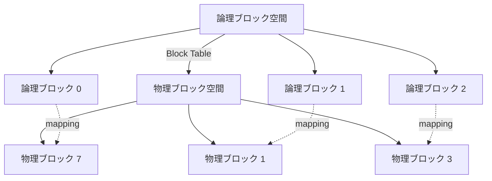
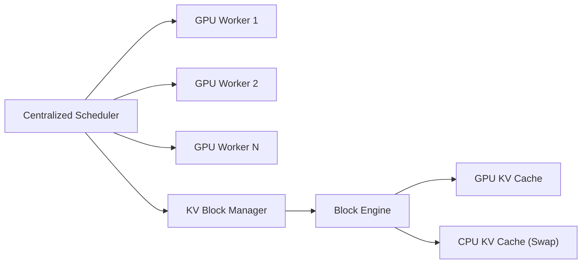
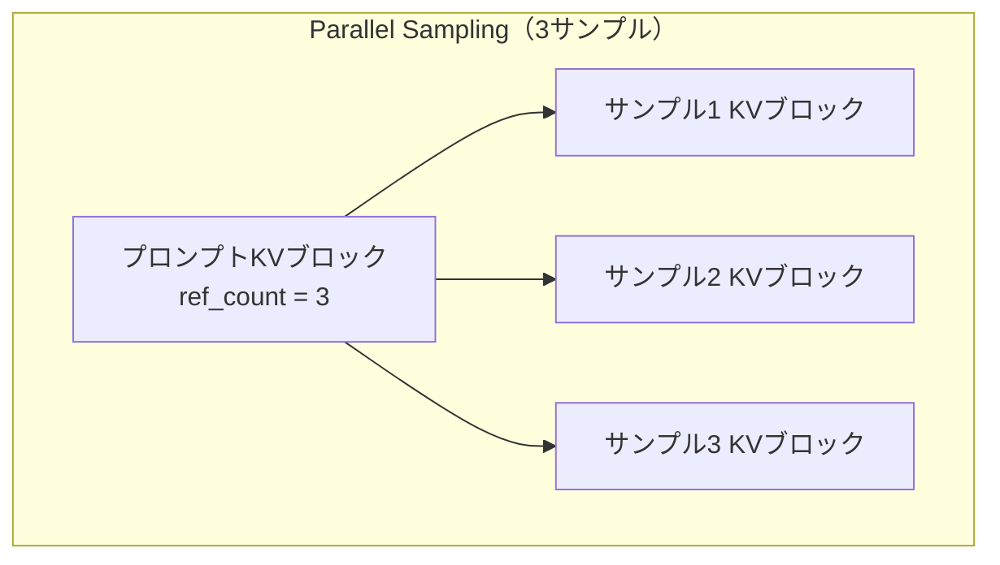

本記事は [Efficient Memory Management for Large Language Model Serving with PagedAttention](https://arxiv.org/abs/2309.06180) の解説記事です。

## 論文概要（Abstract）

LLM推論時のKVキャッシュ（Key-Valueキャッシュ）は、リクエストごとに巨大なメモリを消費し、動的に増減する。著者らは、既存システムではKVキャッシュメモリのわずか20.4%-38.2%しか実際のトークン状態保存に使用されていないと報告している。本論文では、OSの仮想メモリとページング技術に着想を得たPagedAttentionアルゴリズムを提案し、これを実装したvLLMサービングシステムにより、KVキャッシュの無駄をほぼゼロに削減し、FasterTransformerやOrca比で2-4倍のスループット向上を達成したと報告している。

この記事は [Zenn記事: vLLMのPrefix CachingとContinuous Batchingで文書要約APIのP95レイテンシを半減する](https://zenn.dev/0h_n0/articles/7e3c8355db3417) の深掘りです。

## 情報源

- **arXiv ID**: 2309.06180
- **URL**: [https://arxiv.org/abs/2309.06180](https://arxiv.org/abs/2309.06180)
- **著者**: Woosuk Kwon, Zhuohan Li, Siyuan Zhuang et al.
- **発表年**: 2023
- **会議**: SOSP 2023（ACM Symposium on Operating Systems Principles）
- **分野**: cs.LG, cs.DC

## 背景と動機（Background & Motivation）

LLMの推論では、各リクエストに対してTransformerの各層でKey-Value（KV）テンソルを生成・保持する必要がある。このKVキャッシュはAutoregressive decodingの各ステップで参照されるため、リクエストが完了するまでGPUメモリ上に保持しなければならない。

既存のサービングシステム（FasterTransformer、Orca等）では、KVキャッシュに対して連続したメモリ領域を事前に確保する方式をとっていた。この方式には3つの深刻な問題がある。

1. **内部断片化（Internal Fragmentation）**: 最大シーケンス長を想定してメモリを確保するため、実際の出力が短い場合に大量の無駄が生じる
2. **外部断片化（External Fragmentation）**: リクエストごとにサイズが異なるチャンクを割り当てるため、空きメモリが分断されて利用できなくなる
3. **予約メモリ（Reserved Memory）**: 将来の生成に備えて確保されたメモリが、他のリクエストに使用できない

著者らの分析によれば、OPT-13BをA100（40GB）で動作させた場合、メモリの65%がモデルパラメータに使われ、残り30%以上がKVキャッシュに割り当てられる。しかし、上記の非効率性により、実際にトークンの保存に使われるのはKVキャッシュメモリ全体の20.4%-38.2%に過ぎないと報告されている。

## 主要な貢献（Key Contributions）

- **PagedAttentionアルゴリズム**: KVキャッシュを固定サイズのブロックに分割し、非連続なメモリ領域に格納可能にするAttention計算手法。OSの仮想メモリにおけるページングの概念をLLM推論に適用した
- **vLLMサービングシステム**: PagedAttentionを実装した高スループットLLMサービングエンジン。8.5K行のPythonコードと2K行のC++/CUDAコードで構成される
- **柔軟なKVキャッシュ共有メカニズム**: Copy-on-Writeを活用し、Parallel Sampling・Beam Search・共有プレフィクスにおいてリクエスト内・リクエスト間でKVキャッシュを効率的に共有する仕組みを実現

## 技術的詳細（Technical Details）

### PagedAttentionアルゴリズム

標準的なSelf-Attentionでは、シーケンス全体のKey行列 $\mathbf{K}$ とValue行列 $\mathbf{V}$ が連続メモリ上に配置される前提で計算を行う。

$$
\text{Attention}(\mathbf{q}_t, \mathbf{K}, \mathbf{V}) = \text{softmax}\left(\frac{\mathbf{q}_t \mathbf{K}^T}{\sqrt{d_k}}\right) \mathbf{V}
$$

ここで、
- $\mathbf{q}_t$: 時刻 $t$ のQueryベクトル（形状: $(1, d_k)$）
- $\mathbf{K}$: 時刻 $1$ から $t$ までのKey行列（形状: $(t, d_k)$）
- $\mathbf{V}$: 時刻 $1$ から $t$ までのValue行列（形状: $(t, d_v)$）
- $d_k$: Keyの次元数

PagedAttentionでは、$\mathbf{K}$ と $\mathbf{V}$ をサイズ $B$ の固定ブロックに分割する。各ブロック $j$ は $B$ トークン分のKeyとValueを保持する。

$$
\mathbf{K}_j = [\mathbf{k}_{(j-1)B+1}, \ldots, \mathbf{k}_{jB}], \quad \mathbf{V}_j = [\mathbf{v}_{(j-1)B+1}, \ldots, \mathbf{v}_{jB}]
$$

Attention計算はブロック単位で行われる。

$$
\text{PagedAttention}(\mathbf{q}_t, \mathbf{K}, \mathbf{V}) = \frac{\sum_{j=1}^{\lceil t/B \rceil} \exp(\mathbf{q}_t \mathbf{K}_j^T / \sqrt{d_k}) \cdot \mathbf{V}_j}{\sum_{j=1}^{\lceil t/B \rceil} \sum_{i=1}^{B} \exp(\mathbf{q}_t \mathbf{k}_{(j-1)B+i}^T / \sqrt{d_k})}
$$

ここで、
- $B$: ブロックサイズ（論文では16が推奨値）
- $j$: ブロックインデックス
- $\lceil t/B \rceil$: 必要なブロック数

各ブロックは物理メモリ上で非連続に配置でき、ブロックテーブル（論理ブロック番号から物理ブロック番号への対応表）を通じてアクセスされる。この構造はOSのページテーブルと直接対応する。



### OSの仮想メモリとの対応関係

著者らは「tokens as bytes, requests as processes」という対応を示している。

| OSの概念 | PagedAttentionの対応 |
|---------|---------------------|
| プロセス | リクエスト |
| ページ | KVブロック |
| バイト | トークン |
| 仮想メモリ | 論理KVブロック空間 |
| 物理メモリ | GPU DRAM上の物理KVブロック |
| ページテーブル | ブロックテーブル |
| スワップ領域 | CPU RAM |

### vLLMシステムアーキテクチャ

vLLMは中央集権型スケジューラと分散GPUワーカーから構成される。



主要コンポーネントは以下の3つである。

**Block Engine**: GPU DRAM上に物理KVブロックプールを確保し、CPU RAM上にはスワップ用のKVブロックプールを維持する。ブロックの割り当て・解放を管理する。

**KV Block Manager**: 論理ブロックから物理ブロックへの対応関係をブロックテーブルで管理する。各ブロックの参照カウントと充填状況を追跡する。

**Centralized Scheduler**: First-Come-First-Serve方式でリクエストをスケジューリングし、各イテレーションでワーカーにトークンIDとブロックテーブルを送信する。

### メモリ割り当てと解放の流れ

```python
class KVBlockManager:
    """KVキャッシュのブロック管理を行うマネージャ

    論理ブロックから物理ブロックへのマッピングを管理し、
    参照カウントベースの共有とCopy-on-Writeを実装する。

    Args:
        block_size: 1ブロックあたりのトークン数
        num_gpu_blocks: GPU上の物理ブロック数
        num_cpu_blocks: CPU上の物理ブロック数（スワップ用）
    """

    def __init__(
        self,
        block_size: int,
        num_gpu_blocks: int,
        num_cpu_blocks: int,
    ) -> None:
        self.block_size = block_size
        self.gpu_free_blocks: list[int] = list(range(num_gpu_blocks))
        self.cpu_free_blocks: list[int] = list(range(num_cpu_blocks))
        # block_table: request_id -> list of physical block ids
        self.block_tables: dict[int, list[int]] = {}
        self.ref_counts: dict[int, int] = {}

    def allocate_block(self, device: str = "gpu") -> int:
        """新しい物理ブロックを割り当てる

        Args:
            device: 割り当て先デバイス ("gpu" or "cpu")

        Returns:
            割り当てられた物理ブロックID

        Raises:
            MemoryError: 空きブロックがない場合
        """
        free_blocks = (
            self.gpu_free_blocks if device == "gpu" else self.cpu_free_blocks
        )
        if not free_blocks:
            raise MemoryError(f"No free blocks on {device}")
        block_id = free_blocks.pop()
        self.ref_counts[block_id] = 1
        return block_id

    def copy_on_write(self, block_id: int) -> int:
        """Copy-on-Writeで新しい物理ブロックを作成する

        参照カウントが1より大きいブロックへの書き込み時に呼ばれる。

        Args:
            block_id: コピー元の物理ブロックID

        Returns:
            新しく割り当てられた物理ブロックID
        """
        new_block_id = self.allocate_block()
        # GPU上でブロックデータをコピー（CUDAカーネル）
        self._gpu_copy(src=block_id, dst=new_block_id)
        self.ref_counts[block_id] -= 1
        return new_block_id

    def _gpu_copy(self, src: int, dst: int) -> None:
        """GPU上でブロック間のデータコピーを実行する

        Args:
            src: コピー元物理ブロックID
            dst: コピー先物理ブロックID
        """
        # 実際にはCUDAカーネルによるメモリコピー
        pass
```

新しいトークンが生成されるたびに、現在の論理ブロックに空きがあればそこに書き込み、満杯であれば新しい物理ブロックを割り当てる。この「オンデマンド割り当て」により、未使用メモリの事前確保が不要になる。

### KVキャッシュ共有メカニズム

#### Parallel Sampling

同一プロンプトから複数の出力を生成する場合、プロンプト部分のKVキャッシュは全サンプル間で共有できる。vLLMでは参照カウント方式でこれを実現する。



各サンプルが独自のトークンを生成し始めた時点で、最後の共有ブロックに対してCopy-on-Writeが発動し、分岐した出力用の新しい物理ブロックが割り当てられる。著者らは、この方式によりParallel Samplingで6.1%-9.8%のメモリ削減を達成したと報告している。

#### Beam Search

Beam Searchでは、各ステップで上位 $k$ 個の候補を保持する。候補間で共通のプレフィクスが存在する場合、対応するKVブロックを共有できる。従来のシステムでは各候補に独立したKVキャッシュを確保していたが、vLLMでは共通パスのブロックを参照カウントで管理し、候補が分岐したブロックのみをコピーする。

著者らは、Beam Searchにおいてメモリ使用量を37.6%-55.2%削減し、ShareGPTデータセットの長いシーケンスでは44.3%-66.3%の削減を達成したと報告している。

#### Shared Prefix

システムプロンプトやFew-shot例のように、複数リクエスト間で共通のプレフィクスがある場合、そのKVキャッシュを事前計算してグローバルに共有できる。著者らは、LLaMA-13Bによる翻訳タスクで、1-shot例の共有で1.67倍、5-shot例の共有で3.58倍のスループット向上を達成したと報告している。

### スケジューリングとプリエンプション

GPUメモリが不足した場合、vLLMは「All-or-Nothing」方式でシーケンスのKVブロックを退避する。退避方式は2種類ある。

**Swapping**: KVブロックをPCIe経由でCPU RAMにコピーする。復帰時に再度GPUに転送する。

**Recomputation**: KVキャッシュを破棄し、復帰時にプロンプト+これまでの出力を入力として再計算する。LLMのKVキャッシュは入力から決定論的に再生成可能であるため、OS仮想メモリにはない独自の回復メカニズムである。

著者らの実験では、ブロックサイズが小さい場合はRecomputationが、大きい場合はSwappingが有利であり、ブロックサイズ16-64ではほぼ同等の性能であると報告されている。

## 実装のポイント（Implementation）

### GPUカーネル最適化

PagedAttentionのGPUカーネルには3つの最適化が施されている。

1. **Fused Reshape & Block Write**: 新しいKVペアを生成する際、reshape操作とブロックへの書き込みを融合し、メモリアクセスを削減
2. **Block Read + Attention融合**: Attention計算時にブロックテーブルの参照とKV読み出しとAttention計算を1つのカーネルに統合
3. **Batched Block Copy**: Copy-on-Write発動時に複数ブロックのコピーをバッチ化して実行

これらの最適化にもかかわらず、PagedAttentionカーネルはFasterTransformerの最適化されたAttentionカーネルと比較して20-26%のレイテンシ増加がある。しかし、メモリ効率の向上によるバッチサイズ拡大効果がこのオーバーヘッドを大幅に上回ると著者らは報告している。

### ブロックサイズの選択

ブロックサイズ $B$ の選択はトレードオフを伴う。

- **小さいブロックサイズ**: 内部断片化は減少するが、ブロックテーブルのエントリ数が増加し、カーネルの並列効率が低下する
- **大きいブロックサイズ**: GPUの並列処理効率は向上するが、最後のブロックでの内部断片化が増加する

著者らは $B = 16$ を推奨値としている。この場合、最後のブロックでの平均無駄は $B/2 = 8$ トークン分に抑えられ、全体のメモリ無駄は4%未満となる。

### 分散推論のサポート

vLLMはMegatron-LM方式のTensor Model Parallelismをサポートする。Attention Headを複数GPUに分割し、中央集権型のKVブロックマネージャが全ワーカー共通のブロックテーブルを管理する。ワーカー間でメモリ管理の同期は不要であり、各イテレーション開始時にスケジューラからトークンIDとブロックテーブルの制御メッセージを受信するのみである。

## Production Deployment Guide

### AWS実装パターン（コスト最適化重視）

vLLMベースのLLM推論サービスをAWSにデプロイする場合のトラフィック量別構成を示す。以下のコスト試算は2026年9月時点のAWS ap-northeast-1（東京）リージョン料金に基づく概算値であり、実際のコストはトラフィックパターン、リージョン、バースト使用量により変動する。最新料金はAWS料金計算ツールで確認を推奨する。

| 構成 | トラフィック | インフラ | 月額概算 |
|------|------------|---------|---------|
| Small | ~100 req/日 | SageMaker Serverless + S3 | $150-300 |
| Medium | ~1,000 req/日 | ECS Fargate + g5.xlarge | $800-1,500 |
| Large | 10,000+ req/日 | EKS + Karpenter + Spot g5 | $3,000-6,000 |

**Small構成**: SageMaker Serverless Inference Endpointで量子化モデル（AWQ/GPTQ）を稼働させる。リクエストがない時間帯はスケールゼロとなるためコストを抑制できる。

**Medium構成**: ECS Fargateで常時1台のg5.xlargeインスタンスを稼働し、vLLMをコンテナとして実行する。Continuous Batchingにより複数リクエストを効率的に処理する。

**Large構成**: EKS上でKarpenterによるSpot Instancesの自動スケーリングを行う。g5.2xlarge Spotインスタンスを優先し、フォールバックとしてg5.4xlargeを設定する。Spot Instancesの活用で最大70%のコスト削減が見込める。

**コスト削減テクニック**:
- Spot Instances活用: g5系インスタンスでオンデマンド比最大70%削減
- Reserved Instances（1年）: 安定ワークロードで最大40%削減
- Savings Plans（3年）: 最大60%削減
- PagedAttentionのPrefix Caching: 共通プレフィクスのKVキャッシュ再利用で推論コスト30-50%削減

### Terraformインフラコード

**Small構成（SageMaker Serverless）**:

```hcl
# vLLM SageMaker Serverless構成
# 低トラフィック向け: ~100 req/日

terraform {
  required_version = ">= 1.9"
  required_providers {
    aws = {
      source  = "hashicorp/aws"
      version = "~> 5.70"
    }
  }
}

provider "aws" {
  region = "ap-northeast-1"
}

# --- IAM ---
resource "aws_iam_role" "sagemaker_execution" {
  name = "vllm-sagemaker-execution-role"
  assume_role_policy = jsonencode({
    Version = "2012-10-17"
    Statement = [{
      Action    = "sts:AssumeRole"
      Effect    = "Allow"
      Principal = { Service = "sagemaker.amazonaws.com" }
    }]
  })
}

resource "aws_iam_role_policy_attachment" "sagemaker_full" {
  role       = aws_iam_role.sagemaker_execution.name
  policy_arn = "arn:aws:iam::aws:policy/AmazonSageMakerFullAccess"
}

# --- S3: モデルアーティファクト ---
resource "aws_s3_bucket" "model_artifacts" {
  bucket = "vllm-model-artifacts-${data.aws_caller_identity.current.account_id}"
}

resource "aws_s3_bucket_server_side_encryption_configuration" "model_enc" {
  bucket = aws_s3_bucket.model_artifacts.id
  rule {
    apply_server_side_encryption_by_default {
      sse_algorithm = "aws:kms"
    }
  }
}

# --- SageMaker Endpoint ---
resource "aws_sagemaker_model" "vllm" {
  name               = "vllm-inference-model"
  execution_role_arn = aws_iam_role.sagemaker_execution.arn
  primary_container {
    # vLLM公式コンテナイメージ
    image          = "763104351884.dkr.ecr.ap-northeast-1.amazonaws.com/djl-inference:0.30.0-lmi12.0.0-cu124"
    model_data_url = "s3://${aws_s3_bucket.model_artifacts.id}/model.tar.gz"
    environment = {
      OPTION_ENGINE          = "Python"
      OPTION_DTYPE           = "fp16"
      OPTION_MAX_MODEL_LEN   = "4096"
      OPTION_ENABLE_PREFIX_CACHING = "true"  # PagedAttention Prefix Caching有効化
    }
  }
}

resource "aws_sagemaker_endpoint_configuration" "vllm" {
  name = "vllm-endpoint-config"
  production_variants {
    variant_name = "primary"
    model_name   = aws_sagemaker_model.vllm.name
    serverless_config {
      max_concurrency    = 4
      memory_size_in_mb  = 6144  # 6GB
    }
  }
}

resource "aws_sagemaker_endpoint" "vllm" {
  name                 = "vllm-inference-endpoint"
  endpoint_config_name = aws_sagemaker_endpoint_configuration.vllm.name
}

# --- CloudWatch アラーム ---
resource "aws_cloudwatch_metric_alarm" "invocation_errors" {
  alarm_name          = "vllm-invocation-errors"
  comparison_operator = "GreaterThanThreshold"
  evaluation_periods  = 2
  metric_name         = "Invocation5XXErrors"
  namespace           = "AWS/SageMaker"
  period              = 300
  statistic           = "Sum"
  threshold           = 10
  alarm_description   = "vLLM推論エンドポイントの5XXエラー検知"
  dimensions = {
    EndpointName = aws_sagemaker_endpoint.vllm.name
  }
}

data "aws_caller_identity" "current" {}
```

**Large構成（EKS + Karpenter + Spot）**:

```hcl
# vLLM EKS + Karpenter構成
# 高トラフィック向け: 10,000+ req/日

module "eks" {
  source  = "terraform-aws-modules/eks/aws"
  version = "~> 20.24"

  cluster_name    = "vllm-inference-cluster"
  cluster_version = "1.31"
  subnet_ids      = module.vpc.private_subnets
  vpc_id          = module.vpc.vpc_id

  # Karpenter用IAM
  enable_irsa = true

  cluster_endpoint_public_access = false  # セキュリティ: パブリックアクセス無効

  eks_managed_node_groups = {
    system = {
      instance_types = ["m7i.large"]
      min_size       = 2
      max_size       = 3
      desired_size   = 2
    }
  }
}

# --- Karpenter Provisioner（Spot優先） ---
resource "kubectl_manifest" "karpenter_nodepool" {
  yaml_body = yamlencode({
    apiVersion = "karpenter.sh/v1"
    kind       = "NodePool"
    metadata   = { name = "gpu-inference" }
    spec = {
      template = {
        spec = {
          requirements = [
            { key = "karpenter.sh/capacity-type", operator = "In", values = ["spot", "on-demand"] },
            { key = "node.kubernetes.io/instance-type", operator = "In", values = ["g5.2xlarge", "g5.4xlarge", "g5.xlarge"] },
          ]
          nodeClassRef = { name = "gpu-nodes" }
        }
      }
      limits   = { cpu = "128", memory = "512Gi" }
      disruption = {
        consolidationPolicy = "WhenEmptyOrUnderutilized"
        consolidateAfter    = "60s"
      }
    }
  })
}

# --- AWS Budgets ---
resource "aws_budgets_budget" "vllm_monthly" {
  name         = "vllm-monthly-budget"
  budget_type  = "COST"
  limit_amount = "6000"
  limit_unit   = "USD"
  time_unit    = "MONTHLY"

  notification {
    comparison_operator       = "GREATER_THAN"
    threshold                 = 80
    threshold_type            = "PERCENTAGE"
    notification_type         = "ACTUAL"
    subscriber_email_addresses = ["ops-team@example.com"]
  }
}
```

### 運用・監視設定

**CloudWatch Logs Insights クエリ（レイテンシ分析）**:

```
# vLLM推論レイテンシP95/P99分析
fields @timestamp, @message
| filter @message like /latency/
| stats
    avg(latency_ms) as avg_latency,
    pct(latency_ms, 95) as p95_latency,
    pct(latency_ms, 99) as p99_latency,
    count(*) as request_count
  by bin(1h) as time_bucket
| sort time_bucket desc
```

**CloudWatch アラーム設定（Python）**:

```python
import boto3


def create_vllm_alarms(endpoint_name: str, sns_topic_arn: str) -> list[str]:
    """vLLM推論エンドポイントのCloudWatchアラームを作成する

    Args:
        endpoint_name: SageMakerエンドポイント名
        sns_topic_arn: 通知先SNSトピックARN

    Returns:
        作成されたアラームARNのリスト
    """
    cw = boto3.client("cloudwatch", region_name="ap-northeast-1")
    alarm_arns: list[str] = []

    # GPU使用率アラーム
    cw.put_metric_alarm(
        AlarmName=f"{endpoint_name}-gpu-utilization-high",
        MetricName="GPUUtilization",
        Namespace="AWS/SageMaker",
        Statistic="Average",
        Period=300,
        EvaluationPeriods=3,
        Threshold=90.0,
        ComparisonOperator="GreaterThanThreshold",
        Dimensions=[{"Name": "EndpointName", "Value": endpoint_name}],
        AlarmActions=[sns_topic_arn],
        AlarmDescription="GPU使用率90%超過: スケールアウト検討",
    )

    # KVキャッシュ使用率（カスタムメトリクス）
    cw.put_metric_alarm(
        AlarmName=f"{endpoint_name}-kv-cache-usage-high",
        MetricName="KVCacheUsagePercent",
        Namespace="vLLM/Inference",
        Statistic="Average",
        Period=60,
        EvaluationPeriods=5,
        Threshold=85.0,
        ComparisonOperator="GreaterThanThreshold",
        AlarmActions=[sns_topic_arn],
        AlarmDescription="KVキャッシュ使用率85%超過: プリエンプション頻発の兆候",
    )

    return alarm_arns
```

**X-Rayトレーシング設定（Python）**:

```python
from aws_xray_sdk.core import xray_recorder, patch_all


def configure_xray_tracing(service_name: str = "vllm-inference") -> None:
    """X-Rayトレーシングを設定する

    Args:
        service_name: X-Rayサービス名
    """
    xray_recorder.configure(service=service_name)
    patch_all()  # boto3等の自動計装


@xray_recorder.capture("vllm_inference")
def invoke_vllm_endpoint(
    prompt: str,
    max_tokens: int = 512,
) -> dict:
    """vLLMエンドポイントを呼び出す（X-Rayトレース付き）

    Args:
        prompt: 入力プロンプト
        max_tokens: 最大生成トークン数

    Returns:
        推論結果を含む辞書
    """
    subsegment = xray_recorder.current_subsegment()
    if subsegment:
        subsegment.put_annotation("prompt_length", len(prompt))
        subsegment.put_metadata("max_tokens", max_tokens)

    # SageMaker Runtime呼び出し（自動計装済み）
    client = boto3.client("sagemaker-runtime")
    response = client.invoke_endpoint(
        EndpointName="vllm-inference-endpoint",
        ContentType="application/json",
        Body=json.dumps({"prompt": prompt, "max_tokens": max_tokens}),
    )
    return json.loads(response["Body"].read())
```

**Cost Explorer日次レポート（Python）**:

```python
import datetime
import boto3


def get_daily_vllm_cost(
    days_back: int = 1,
    threshold_usd: float = 100.0,
    sns_topic_arn: str | None = None,
) -> dict[str, float]:
    """vLLM関連の日次コストを取得し、閾値超過時にSNS通知する

    Args:
        days_back: 何日前のコストを取得するか
        threshold_usd: アラート閾値（USD/日）
        sns_topic_arn: 通知先SNSトピックARN

    Returns:
        サービス別コスト辞書
    """
    ce = boto3.client("ce", region_name="us-east-1")
    end = datetime.date.today()
    start = end - datetime.timedelta(days=days_back)

    response = ce.get_cost_and_usage(
        TimePeriod={"Start": str(start), "End": str(end)},
        Granularity="DAILY",
        Metrics=["UnblendedCost"],
        Filter={
            "Tags": {
                "Key": "Project",
                "Values": ["vllm-inference"],
            }
        },
        GroupBy=[{"Type": "DIMENSION", "Key": "SERVICE"}],
    )

    costs: dict[str, float] = {}
    total = 0.0
    for group in response["ResultsByTime"][0]["Groups"]:
        service = group["Keys"][0]
        amount = float(group["Metrics"]["UnblendedCost"]["Amount"])
        costs[service] = amount
        total += amount

    if total > threshold_usd and sns_topic_arn:
        sns = boto3.client("sns")
        sns.publish(
            TopicArn=sns_topic_arn,
            Subject=f"vLLM Cost Alert: ${total:.2f}/day",
            Message=f"Daily cost ${total:.2f} exceeds ${threshold_usd}.",
        )

    return costs
```

### コスト最適化チェックリスト

**アーキテクチャ選択**:
- [ ] トラフィック量を測定し適切な構成を選択（~100 req/日: Serverless、~1,000: Fargate、10,000+: EKS）
- [ ] バーストパターンの分析（スパイクが多い場合はServerlessが有利）

**リソース最適化**:
- [ ] GPU: Spot Instances優先（g5系でオンデマンド比最大70%削減）
- [ ] Reserved Instances: 安定ワークロードに1年コミット（最大40%削減）
- [ ] Savings Plans: 3年コミットで最大60%削減
- [ ] Lambda/SageMaker Serverless: メモリサイズ最適化（Power Tuning実行）
- [ ] EKS: Karpenter consolidationPolicyで未使用ノード自動削除
- [ ] GPU共有: MIG（Multi-Instance GPU）でA100を分割し小モデルを同居

**LLM推論コスト削減**:
- [ ] PagedAttention Prefix Caching有効化（共通プレフィクスで30-50%削減）
- [ ] モデル量子化（AWQ/GPTQ）でGPUメモリ使用量を50%削減
- [ ] Continuous Batching有効化でスループット最大化
- [ ] max_tokens制限でKVキャッシュ使用量を制御
- [ ] Speculative Decodingで小モデルによるドラフト生成を活用

**監視・アラート**:
- [ ] AWS Budgets: 月次予算アラート設定（80%/100%閾値）
- [ ] CloudWatch: GPU使用率・KVキャッシュ使用率・レイテンシP95アラーム
- [ ] Cost Anomaly Detection有効化（機械学習ベースの異常検知）
- [ ] 日次コストレポート自動送信（SNS/Slack連携）
- [ ] X-Ray: 推論パイプラインのトレーシング有効化

**リソース管理**:
- [ ] 未使用SageMakerエンドポイント・EBSボリュームの定期削除
- [ ] タグ戦略統一（Project/Environment/Owner必須）
- [ ] S3ライフサイクルポリシー（古いモデルアーティファクトの自動削除）
- [ ] 開発環境の夜間・週末自動停止（EventBridge + Lambda）
- [ ] ECRイメージの世代管理（最新5世代のみ保持）

## 実験結果（Results）

### 基本サンプリング性能

著者らはShareGPTデータセット（実際のChatGPT対話履歴）とAlpacaデータセットを用いて評価を行っている。

| システム | 対象データセット | 正規化スループット |
|---------|----------------|------------------|
| FasterTransformer | ShareGPT | 1.0x（ベースライン） |
| Orca (Max) | ShareGPT | 1.0x-3.0x |
| Orca (Oracle) | ShareGPT | 2.2x-3.8x |
| **vLLM** | ShareGPT | **最大22x**（vs FasterTransformer） |

著者らは、vLLMがOrca (Oracle)比で1.7-2.7倍、Orca (Max)比で2.7-8倍、FasterTransformer比で最大22倍のリクエストレートを維持できると報告している。

### デコーディング方式別の改善

| デコーディング方式 | メモリ削減率 | スループット改善 |
|------------------|------------|----------------|
| Basic Sampling | -- | 1.3x |
| Parallel Sampling | 6.1%-9.8% | -- |
| Beam Search (width 6) | 37.6%-55.2% | 2.3x |
| Shared Prefix (5-shot) | -- | 3.58x |

Beam Searchで特に大きな改善が見られるのは、候補間で共通するKVブロックの共有率が高いためである。ShareGPTのような長いシーケンスでは44.3%-66.3%のメモリ削減が得られたと報告されている。

### カーネルオーバーヘッド

PagedAttentionカーネルはブロックテーブルの参照と可変長処理のため、FasterTransformerのAttentionカーネルと比較して20-26%のレイテンシ増加がある。しかし、Attention計算は全体の推論時間に占める割合が小さく（大部分はLinear層の行列乗算）、エンドツーエンド性能には限定的な影響しか与えないと著者らは報告している。

### ブロックサイズの影響

著者らのアブレーション実験では、ブロックサイズ16が最適なバランスを示している。ブロックサイズ1ではカーネル効率が著しく低下し、ブロックサイズ256ではメモリ断片化が増大する。

## 実運用への応用（Practical Applications）

PagedAttentionとvLLMは、LLM推論のメモリボトルネックを解消する実用的な手法として広く普及している。関連するZenn記事で取り上げているPrefix CachingやContinuous Batchingは、本論文のPagedAttentionの直接的な応用である。

**スケーリング戦略**: PagedAttentionはTensor Model Parallelismと組み合わせることで、OPT-175BのようなモデルをA100 8GPU構成でサービングできる。ブロックテーブルの管理は中央集権型のため、GPUの追加に伴うメモリ管理のオーバーヘッドは最小限に抑えられる。

**レイテンシとスループットのトレードオフ**: カーネルレベルでは20-26%のオーバーヘッドがあるが、バッチサイズの拡大効果が大きいため、同じレイテンシ制約下でスループットが2-4倍向上する。Continuous Batchingと組み合わせることで、個々のリクエストの完了を待たずに新しいリクエストを即座にバッチに追加できる。

**制約と限界**: ブロックテーブルの管理はCPU側のオーバーヘッドとなる。超長シーケンス（数万トークン以上）ではブロック数が膨大になり、テーブル管理のコストが無視できなくなる可能性がある。また、ブロックサイズの最適値はハードウェアやモデルサイズに依存するため、デプロイ環境ごとにチューニングが必要である。

## 関連研究（Related Work）

- **Orca (Yu et al., 2022)**: Iteration-level schedulingを導入し、リクエスト単位ではなくイテレーション単位でバッチを構成する手法。vLLMのメモリ管理と直交する技術であり、組み合わせることで相乗効果が得られる
- **FlashAttention (Dao et al., 2022)**: Attention計算をtiling技法でGPUのSRAM上に収め、HBMアクセスを削減する手法。PagedAttentionとは異なりメモリ配置ではなく計算効率の最適化に焦点を当てており、併用可能である
- **FlexGen (Sheng et al., 2023)**: オフロード（GPU-CPU-ディスク）によるLLM推論の手法。スループット最適化に特化しており、レイテンシ制約のあるオンライン推論では適用が困難である。vLLMはオンライン推論のメモリ効率を改善する点で補完的な位置づけにある

## まとめと今後の展望

本論文は、OSの仮想メモリ管理の原理をLLM推論のKVキャッシュ管理に適用するという着想により、既存システムの深刻なメモリ非効率性を解決した。PagedAttentionによる非連続KVキャッシュ格納、ブロック単位の参照カウントとCopy-on-Writeによるメモリ共有は、サービングシステムの設計パラダイムに大きな影響を与えている。

実務的には、vLLMはLLM推論の事実上の標準サービングエンジンの一つとなっており、Prefix CachingやContinuous Batchingといった後続機能の基盤となっている。GPUメモリ容量とモデルサイズの増大速度の乖離が続く限り、メモリ効率の向上は引き続き重要な研究課題である。今後はFlashAttentionとの統合最適化、Speculative Decodingとの併用、マルチモーダルモデルへの拡張などが期待される。

## 参考文献

- **arXiv**: [https://arxiv.org/abs/2309.06180](https://arxiv.org/abs/2309.06180)
- **Code**: [https://github.com/vllm-project/vllm](https://github.com/vllm-project/vllm)
- **SOSP 2023 Proceedings**: [https://dl.acm.org/doi/10.1145/3600006.3613165](https://dl.acm.org/doi/10.1145/3600006.3613165)
- **Related Zenn article**: [https://zenn.dev/0h_n0/articles/7e3c8355db3417](https://zenn.dev/0h_n0/articles/7e3c8355db3417)
