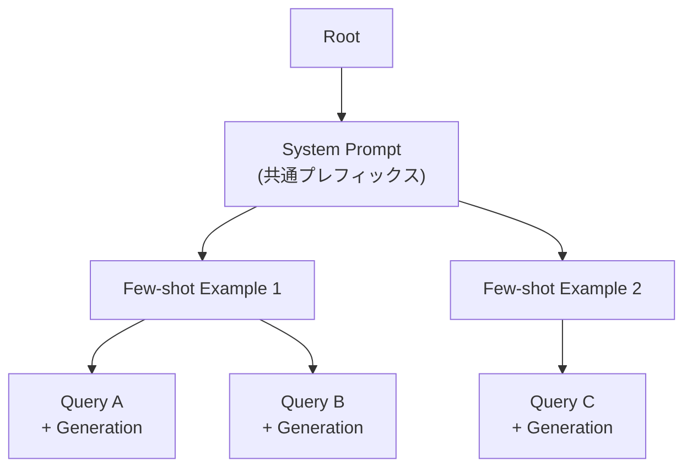

本記事は [SGLang: Efficient Execution of Structured Language Model Programs](https://arxiv.org/abs/2312.07104) の解説記事です。

## 論文概要（Abstract）

Zhengらは、大規模言語モデル（LLM）を用いた複雑なプログラム（エージェント制御、論理推論、few-shot学習、構造化出力生成など）を効率的に実行するためのシステム**SGLang**を提案している。SGLangはフロントエンドのドメイン固有言語（DSL）とバックエンドの最適化ランタイムを統合的に設計し、**RadixAttention**によるKVキャッシュの自動再利用、**圧縮有限状態マシン（Compressed FSM）**による構造化出力デコーディングの高速化を実現する。著者らによると、SOTA推論システムと比較して最大6.4倍のスループット向上を達成したと報告されている（arXiv:2312.07104, Table 1, Table 2）。

この記事は [Zenn記事: vLLMのPrefix CachingとContinuous Batchingで文書要約APIのP95レイテンシを半減する](https://zenn.dev/0h_n0/articles/7e3c8355db3417) の深掘りです。

## 情報源

- **arXiv ID**: 2312.07104
- **URL**: [arXiv:2312.07104](https://arxiv.org/abs/2312.07104)
- **著者**: Lianmin Zheng, Liangsheng Yin, Zhiqiang Xie et al.（12名）
- **所属**: UC Berkeley, Stanford University
- **発表年**: 2023年12月（初版）、以降更新あり
- **分野**: cs.AI, cs.PL

## 背景と動機（Background & Motivation）

### LLMプログラムの実行効率問題

LLMの利用パターンは単一のプロンプト・レスポンスから、複数のLLM呼び出しを組み合わせた複雑なプログラムへと進化している。例えば、エージェントが「検索→要約→判定→再検索」を繰り返すRAGパイプラインや、Tree-of-Thoughtによる論理推論では、1つのタスクに対して数十回のLLM呼び出しが発生する。

こうしたLLMプログラムには、呼び出し間で共通のプレフィックス（システムプロンプト、few-shotの例示、中間結果など）が大量に存在する。しかし、既存の推論システムは個々のリクエストを独立に処理しており、これらの共通プレフィックスに対応するKVキャッシュを再計算していた。著者らはこの冗長な計算が、複雑なLLMプログラムのスループットを大幅に低下させる主因であると指摘している。

さらに、JSONやSQL等の構造化出力を強制する制約付きデコーディングでは、1トークンごとにFSM遷移を評価するため、デコーディング速度がボトルネックとなる問題もあった。

## 主要な貢献（Key Contributions）

著者らは以下の3つの貢献を主張している。

1. **RadixAttention**: Radix Treeデータ構造を用いて、複数のLLM呼び出し間でKVキャッシュを自動的に再利用する手法。LRU退避ポリシーと参照カウントにより、動的なキャッシュ管理を実現する
2. **圧縮有限状態マシン（Compressed FSM）**: 構造化出力デコーディングにおいて、連続する単一遷移エッジを圧縮し、複数トークンを1回のforward passでデコードする高速化手法
3. **フロントエンドDSL**: `gen`、`select`、`fork`、`join`等のプリミティブを提供し、LLMプログラムの並列制御と最適化を言語レベルで記述可能にする

## 技術的詳細（Technical Details）

### RadixAttentionのアーキテクチャ

RadixAttentionの核心は、KVキャッシュの管理にRadix Tree（パトリシアトライの一種）を採用した点にある。



#### Radix Treeの構造

Radix Treeでは、各エッジがトークン列でラベル付けされ、各ノードが対応するKVキャッシュテンソルへの参照を保持する。通常のトライ木が1文字ずつエッジを持つのに対し、Radix Treeは共通プレフィックスを持つエッジを圧縮して1本のエッジにまとめる。これにより、木の深さが浅くなり、検索・挿入の効率が向上する。

KVキャッシュは非連続なページレイアウトで格納され、各ページのサイズは1トークン分に相当する。このページ単位の管理により、キャッシュの部分的な再利用と退避が柔軟に行える。

#### 参照カウントとLRU退避

各ノードは**参照カウンタ**を保持し、そのノードのKVキャッシュを使用中のリクエスト数を追跡する。退避の動作は以下のルールに従う。

1. 参照カウンタが0のノードのみが退避候補となる
2. 退避は**最も古く使用されたリーフノード**から優先的に実行される（LRU方式）
3. リーフが退避されると、その親ノードが新たなリーフとなり、次の退避候補になる
4. キャッシュ済みトークンと実行中リクエストは同一のメモリプールを共有する

この設計により、実行中のリクエストのKVキャッシュが誤って退避されることを防ぎつつ、メモリを効率的に活用できる。

#### キャッシュ考慮型スケジューリング

RadixAttentionはリクエストのスケジューリングにも最適化を導入している。待機キュー内のリクエストをRadix Treeに対してプレフィックスマッチングし、**マッチしたプレフィックス長が長い順にソート**して処理する。

著者らは、このlongest-shared-prefix-first順序がオフライン最適スケジューリングにおいて**深さ優先探索（DFS）順序と等価**であることを証明している。直観的には、DFS順序で処理すると、兄弟ノードに移る前に同一パスの子孫を処理し切るため、キャッシュのヒット率が最大化される。

#### 4つのキャッシュ共有パターン

RadixAttentionは以下の4パターンのKVキャッシュ共有を自動的に管理する。

| パターン | 説明 | 具体例 |
|---------|------|--------|
| 線形連鎖 | 前の出力が次の入力のプレフィックス | マルチターン会話 |
| ファンアウト | 1つのプレフィックスから複数出力 | Tree-of-Thought |
| ファンイン | 複数プレフィックスが1つに収束 | LLM-as-Judge |
| 不規則木 | 上記の混合 | 複合エージェント |

### vLLMのAutomatic Prefix Cachingとの比較

Zenn記事で解説したvLLMも Prefix Caching機能を備えている。ここでは両者の設計思想と実装の違いを整理する。

#### vLLMのブロックハッシュ方式

vLLMのAutomatic Prefix Cachingは、KVキャッシュを固定サイズのブロック（通常16トークン）に分割し、各ブロックの内容からハッシュ値を計算してキャッシュキーとする。新しいリクエストのプロンプトをブロック単位で区切り、ハッシュが一致するブロックがキャッシュに存在すればそのKVキャッシュを再利用する。

#### 設計の違い

| 項目 | SGLang (RadixAttention) | vLLM (Block Hash) |
|------|------------------------|--------------------|
| データ構造 | Radix Tree | ハッシュテーブル |
| マッチング粒度 | トークン単位（可変長エッジ） | 固定ブロック単位（16トークン） |
| 退避ポリシー | LRU（リーフ優先） | LRU（ブロック単位） |
| 多階層共有 | ツリー構造で自然に表現 | ブロック単位のため階層的関係が暗黙的 |
| スケジューリング連携 | キャッシュ考慮型スケジューリング統合 | スケジューリングとは独立 |
| フロントエンド連携 | DSLからのプレフィックスヒント | なし（純粋にバックエンド処理） |

#### トレードオフ

RadixAttentionの利点は、ツリー構造によりマルチレベルの共有関係を明示的に管理でき、スケジューリングと連携したキャッシュ最適化が可能な点にある。一方、vLLMのブロックハッシュ方式は実装がシンプルで、ハッシュ計算のオーバーヘッドが小さく、Radix Treeのメンテナンスコストが不要である。

著者らによると、RadixAttentionのオーバーヘッドはキャッシュヒットがない場合でも0.3%未満であり、ツリー操作の計算量は線形かつ小さいと報告されている。単純なシステムプロンプト共有のみのユースケースではvLLMのブロックハッシュ方式で十分だが、Tree-of-ThoughtやRAGパイプラインのような複数階層の共有が発生するLLMプログラムでは、RadixAttentionの優位性が顕著になる。

### 圧縮有限状態マシン（Compressed FSM）

構造化出力（JSON、SQL等）を強制するために、多くのシステムはFSMベースの制約付きデコーディングを採用している。標準的な手法では、各ステップで有効なトークン集合をマスクとして適用し、1トークンずつデコードする。

SGLangのCompressed FSMは、FSMの遷移グラフにおいて**連続する単一遷移エッジ**（source nodeの後続が1つだけで、かつその後続の有効文字が1つだけ）を検出し、それらを1本の圧縮エッジにまとめる。

例えば、JSONスキーマで `{"summary": "` という固定部分は、標準FSMでは各文字を個別トークンとしてデコードする必要がある。Compressed FSMではこの部分全体を1回のforward passで処理できる。

$$
\text{CompressedEdge}(e_1, e_2, \ldots, e_k) = \text{Concat}(\text{text}(e_1), \text{text}(e_2), \ldots, \text{text}(e_k))
$$

ここで、$e_i$ は連続する単一遷移エッジ、$\text{text}(e_i)$ は各エッジのラベル文字列である。

ただし、圧縮エッジのデコーディングには**再トークン化**が必要となる。圧縮エッジのテキストと先行テキストを結合して再トークン化することで、LLMのトークナイザとの整合性を保つ。著者らはこの再トークン化オーバーヘッドは軽微であると報告しているが、圧縮遷移に含まれるマルチトークン列では確率分布のずれ（distorted probability）が生じる可能性があることも認めている。

### フロントエンドDSL

SGLangのDSLは以下のプリミティブを提供する。

```python
from sglang import gen, select, fork, join

def tree_of_thought(s: "SglState", question: str) -> "SglState":
    """Tree-of-Thought推論をSGLangで記述する例

    Args:
        s: SGLangの状態オブジェクト
        question: 推論対象の質問

    Returns:
        最終的な回答を含む状態オブジェクト
    """
    s += "Question: " + question + "\n"

    # 並列に3つの思考パスを生成
    forks = s.fork(3)
    for i, f in enumerate(forks):
        f += f"Thought path {i+1}:\n"
        f += gen("thought", max_tokens=256)
        f += "\nConclusion:\n"
        f += gen("conclusion", max_tokens=64)

    # 各パスの結論を集約
    s += "All conclusions:\n"
    for i, f in enumerate(forks):
        s += f"Path {i+1}: " + f["conclusion"] + "\n"

    # 最良の結論を選択
    s += "Best answer:\n"
    s += gen("final_answer", max_tokens=128)
    return s
```

主要プリミティブの役割は以下の通りである。

- **`gen`**: LLMによるテキスト生成。`regex`パラメータで正規表現制約を指定可能
- **`select`**: 選択肢リストから最も確率の高いものを選択
- **`fork` / `join`**: プロンプト状態の並列分岐と合流。各分岐はバックグラウンドスレッドで非同期実行される
- **`extend` / `+=`**: プロンプトへの文字列追加

フロントエンドはプロンプト状態を非同期ストリームとして管理し、プリミティブ操作をバックエンドに非同期送信する。`fork`時にはバックエンドに**プレフィックスヒント**を送信し、Radix Treeへの適切なキャッシュ挿入を促進する。

### インタプリタモードとコンパイラモード

SGLangは2つの実行モードを提供する。

- **インタプリタモード**: プリミティブを逐次非同期実行。Python制御フローとの統合が容易
- **コンパイラモード**: プログラムを計算グラフにコンパイルし、グラフ書き換えによる最適化（コード移動によるプレフィックス共有の増大など）を適用。著者らによると、コード移動最適化により共有可能なプレフィックス長が平均60トークン増加したと報告されている

## 実装のポイント（Implementation）

### RadixAttentionの実装上の注意点

1. **メモリプールの共有設計**: キャッシュ済みトークンと実行中リクエストが同一メモリプールを共有するため、メモリ不足時にはキャッシュを全て退避してバッチサイズを確保する動的な切り替えが必要となる

2. **分散環境への対応**: テンソル並列では各GPUがシャードされたKVキャッシュを保持し、追加の同期は不要である。データ並列ではルーターがメタツリー（各ワーカーのサブツリーを追跡）を維持し、共有プレフィックス長に基づくアフィニティルーティングを行う

3. **Compressed FSMの前処理コスト**: FSMの前処理をリクエストごとに再実行するとスループットが2.4倍低下するため、バッチレベルでの前処理結果の再利用が必須である

4. **再トークン化のオーバーヘッド**: Compressed FSMでは圧縮エッジのデコード時に先行テキスト全体を含めた再トークン化が発生する。長いコンテキストでは再トークン化コストが無視できなくなる可能性がある

### 実装時のハイパーパラメータ

```python
from dataclasses import dataclass

@dataclass
class SGLangConfig:
    """SGLangランタイムの主要設定パラメータ

    Attributes:
        page_size: KVキャッシュのページサイズ（トークン数）
        max_cache_tokens: キャッシュに割り当てる最大トークン数
        schedule_policy: スケジューリングポリシー
        chunk_prefill_size: チャンクプリフィルのサイズ
    """
    page_size: int = 1          # 1トークン/ページ（論文の設定）
    max_cache_tokens: int = 0   # 0=GPU空きメモリの全てを使用
    schedule_policy: str = "lpm"  # longest-prefix-match優先
    chunk_prefill_size: int = 8192  # プリフィルのチャンクサイズ
```

## Production Deployment Guide

SGLangは推論サーバとして本番環境にデプロイ可能である。以下にAWS上での構成パターンを示す。

### AWS実装パターン（コスト最適化重視）

**トラフィック量別の推奨構成**:

| 規模 | 構成 | GPU | 月額概算 |
|------|------|-----|----------|
| Small (~100 req/日) | EC2 g5.xlarge + SGLang Server | A10G x1 | $800-1,200 |
| Medium (~1,000 req/日) | ECS on g5.2xlarge + ALB | A10G x1 | $1,500-2,500 |
| Large (10,000+ req/日) | EKS + Karpenter + g5.xlarge Spot | A10G x2-4 | $3,000-6,000 |

**注意**: 上記コストは2026年9月時点のAWS ap-northeast-1（東京）リージョンの概算値である。実際のコストはトラフィックパターン、モデルサイズ、バースト使用量により変動する。最新料金はAWS料金計算ツールで確認を推奨する。

**コスト削減テクニック**:
- **Spot Instances**: g5インスタンスのSpot価格はオンデマンドの60-70%程度で、最大70%削減（ただし中断リスクあり）
- **Reserved Instances**: 1年コミットで最大40%削減、3年コミットで最大60%削減
- **RadixAttentionのキャッシュ効果**: 共通プレフィックスの多いワークロードではGPU計算量を削減でき、同一GPUでより多くのリクエストを処理可能
- **Compressed FSM**: 構造化出力のデコーディング高速化により、GPU占有時間を短縮

### Terraformインフラコード

#### Small構成（EC2 + SGLang Server）

```hcl
# Small構成: EC2 g5.xlarge + SGLang Server
# 月額概算: $800-1,200（オンデマンド）

resource "aws_instance" "sglang_server" {
  ami           = data.aws_ami.deep_learning.id
  instance_type = "g5.xlarge"  # A10G x1, 4 vCPU, 16GB RAM

  root_block_device {
    volume_size = 200  # モデルウェイト格納用
    volume_type = "gp3"
    encrypted   = true
    kms_key_id  = aws_kms_key.sglang.arn
  }

  iam_instance_profile = aws_iam_instance_profile.sglang.name

  # プライベートサブネットに配置
  subnet_id              = aws_subnet.private[0].id
  vpc_security_group_ids = [aws_security_group.sglang.id]

  user_data = <<-EOF
    #!/bin/bash
    # SGLangサーバ起動スクリプト
    pip install sglang[all]
    python -m sglang.launch_server \
      --model-path meta-llama/Llama-3.1-8B-Instruct \
      --port 8000 \
      --schedule-policy lpm \
      --mem-fraction-static 0.85
  EOF

  tags = {
    Name        = "sglang-inference-server"
    Environment = "production"
    CostCenter  = "ml-inference"
  }
}

# セキュリティグループ（最小権限）
resource "aws_security_group" "sglang" {
  name_prefix = "sglang-"
  vpc_id      = aws_vpc.main.id

  ingress {
    from_port       = 8000
    to_port         = 8000
    protocol        = "tcp"
    security_groups = [aws_security_group.alb.id]
  }

  egress {
    from_port   = 443
    to_port     = 443
    protocol    = "tcp"
    cidr_blocks = ["0.0.0.0/0"]  # モデルダウンロード用
  }
}

# CloudWatchアラーム（GPU使用率監視）
resource "aws_cloudwatch_metric_alarm" "gpu_utilization" {
  alarm_name          = "sglang-gpu-high-utilization"
  comparison_operator = "GreaterThanThreshold"
  evaluation_periods  = 3
  metric_name         = "GPUUtilization"
  namespace           = "Custom/SGLang"
  period              = 300
  statistic           = "Average"
  threshold           = 90
  alarm_actions       = [aws_sns_topic.alerts.arn]
}
```

#### Large構成（EKS + Karpenter + Spot）

```hcl
# Large構成: EKS + Karpenter + Spot Instances
# 月額概算: $3,000-6,000（Spot活用時）

module "eks" {
  source  = "terraform-aws-modules/eks/aws"
  version = "~> 20.0"

  cluster_name    = "sglang-inference"
  cluster_version = "1.31"

  vpc_id     = aws_vpc.main.id
  subnet_ids = aws_subnet.private[*].id

  cluster_endpoint_public_access = false  # プライベートアクセスのみ

  # Karpenter用IAMロール
  enable_karpenter = true
}

# Karpenter NodePool（Spot優先）
resource "kubectl_manifest" "karpenter_nodepool" {
  yaml_body = <<-YAML
    apiVersion: karpenter.sh/v1
    kind: NodePool
    metadata:
      name: gpu-spot
    spec:
      template:
        spec:
          requirements:
            - key: node.kubernetes.io/instance-type
              operator: In
              values: ["g5.xlarge", "g5.2xlarge"]
            - key: karpenter.sh/capacity-type
              operator: In
              values: ["spot", "on-demand"]  # Spot優先
          nodeClassRef:
            group: karpenter.k8s.aws
            kind: EC2NodeClass
            name: gpu
      limits:
        gpu: 8  # 最大GPU数
      disruption:
        consolidationPolicy: WhenEmptyOrUnderutilized
        consolidateAfter: 60s
  YAML
}

# SGLang Deployment
resource "kubectl_manifest" "sglang_deployment" {
  yaml_body = <<-YAML
    apiVersion: apps/v1
    kind: Deployment
    metadata:
      name: sglang-server
    spec:
      replicas: 2
      selector:
        matchLabels:
          app: sglang
      template:
        spec:
          containers:
            - name: sglang
              image: lmsysorg/sglang:latest
              args:
                - "--model-path"
                - "meta-llama/Llama-3.1-8B-Instruct"
                - "--schedule-policy"
                - "lpm"
                - "--mem-fraction-static"
                - "0.85"
              resources:
                limits:
                  nvidia.com/gpu: 1
                requests:
                  cpu: "4"
                  memory: "16Gi"
              ports:
                - containerPort: 8000
              livenessProbe:
                httpGet:
                  path: /health
                  port: 8000
                initialDelaySeconds: 120
                periodSeconds: 30
          tolerations:
            - key: nvidia.com/gpu
              operator: Exists
              effect: NoSchedule
  YAML
}

# AWS Budgets（コストアラート）
resource "aws_budgets_budget" "sglang" {
  name         = "sglang-monthly-budget"
  budget_type  = "COST"
  limit_amount = "5000"
  limit_unit   = "USD"
  time_unit    = "MONTHLY"

  notification {
    comparison_operator       = "GREATER_THAN"
    threshold                 = 80
    threshold_type            = "PERCENTAGE"
    notification_type         = "ACTUAL"
    subscriber_sns_topic_arns = [aws_sns_topic.alerts.arn]
  }
}
```

### 運用・監視設定

#### CloudWatch Logs Insightsクエリ

```
# SGLangサーバのキャッシュヒット率分析
fields @timestamp, @message
| filter @message like /cache_hit/
| stats count(*) as total,
        sum(case when cache_hit = 1 then 1 else 0 end) as hits
        by bin(1h)
| sort @timestamp desc
```

```
# P95/P99レイテンシ分析
fields @timestamp, latency_ms
| filter @message like /request_complete/
| stats percentile(latency_ms, 95) as p95,
        percentile(latency_ms, 99) as p99,
        avg(latency_ms) as avg_latency
        by bin(5m)
```

#### CloudWatchアラーム設定

```python
import boto3

def create_sglang_alarms(instance_id: str, sns_topic_arn: str) -> list[str]:
    """SGLangサーバ用のCloudWatchアラームを作成する

    Args:
        instance_id: EC2インスタンスID
        sns_topic_arn: 通知先SNSトピックARN

    Returns:
        作成されたアラーム名のリスト
    """
    cw = boto3.client("cloudwatch", region_name="ap-northeast-1")
    alarm_names: list[str] = []

    # GPU使用率アラーム
    cw.put_metric_alarm(
        AlarmName=f"sglang-{instance_id}-gpu-high",
        MetricName="GPUUtilization",
        Namespace="Custom/SGLang",
        Statistic="Average",
        Period=300,
        EvaluationPeriods=3,
        Threshold=95.0,
        ComparisonOperator="GreaterThanThreshold",
        AlarmActions=[sns_topic_arn],
    )
    alarm_names.append(f"sglang-{instance_id}-gpu-high")

    # キャッシュヒット率低下アラーム
    cw.put_metric_alarm(
        AlarmName=f"sglang-{instance_id}-cache-low",
        MetricName="CacheHitRate",
        Namespace="Custom/SGLang",
        Statistic="Average",
        Period=600,
        EvaluationPeriods=2,
        Threshold=30.0,
        ComparisonOperator="LessThanThreshold",
        AlarmActions=[sns_topic_arn],
    )
    alarm_names.append(f"sglang-{instance_id}-cache-low")

    return alarm_names
```

#### X-Rayトレーシング設定

```python
from aws_xray_sdk.core import xray_recorder, patch_all
import requests

# boto3等の自動計装
patch_all()

def trace_sglang_request(
    endpoint: str,
    prompt: str,
    max_tokens: int = 256,
) -> dict:
    """SGLangリクエストをX-Rayでトレースする

    Args:
        endpoint: SGLangサーバのエンドポイントURL
        prompt: 入力プロンプト
        max_tokens: 最大生成トークン数

    Returns:
        SGLangサーバからのレスポンス
    """
    segment = xray_recorder.begin_segment("sglang-inference")
    segment.put_annotation("model", "llama-3.1-8b")
    segment.put_metadata("prompt_length", len(prompt))

    try:
        resp = requests.post(
            f"{endpoint}/generate",
            json={"text": prompt, "max_new_tokens": max_tokens},
            timeout=60,
        )
        resp.raise_for_status()
        result = resp.json()
        segment.put_metadata("output_tokens", result.get("token_count", 0))
        segment.put_metadata("cache_hit", result.get("cache_hit", False))
        return result
    except Exception as e:
        segment.add_exception(e)
        raise
    finally:
        xray_recorder.end_segment()
```

#### Cost Explorer自動レポート

```python
import boto3
from datetime import datetime, timedelta

def get_daily_sglang_cost(sns_topic_arn: str, threshold: float = 100.0) -> dict:
    """SGLang関連の日次コストを取得しアラートを送信する

    Args:
        sns_topic_arn: 通知先SNSトピックARN
        threshold: アラート閾値（USD/日）

    Returns:
        サービス別コスト内訳
    """
    ce = boto3.client("ce", region_name="us-east-1")
    sns = boto3.client("sns", region_name="ap-northeast-1")

    end = datetime.utcnow().strftime("%Y-%m-%d")
    start = (datetime.utcnow() - timedelta(days=1)).strftime("%Y-%m-%d")

    response = ce.get_cost_and_usage(
        TimePeriod={"Start": start, "End": end},
        Granularity="DAILY",
        Metrics=["UnblendedCost"],
        Filter={
            "Tags": {
                "Key": "CostCenter",
                "Values": ["ml-inference"],
            }
        },
        GroupBy=[{"Type": "DIMENSION", "Key": "SERVICE"}],
    )

    costs: dict[str, float] = {}
    total = 0.0
    for group in response["ResultsByTime"][0]["Groups"]:
        service = group["Keys"][0]
        amount = float(group["Metrics"]["UnblendedCost"]["Amount"])
        costs[service] = amount
        total += amount

    if total > threshold:
        sns.publish(
            TopicArn=sns_topic_arn,
            Subject=f"SGLang Cost Alert: ${total:.2f}/day",
            Message=f"Daily cost exceeded ${threshold}. Breakdown: {costs}",
        )

    return costs
```

### コスト最適化チェックリスト

**アーキテクチャ選択**:
- [ ] トラフィック量に応じた構成を選択（Small: EC2単体 / Medium: ECS / Large: EKS）
- [ ] GPU不要な前処理・後処理はCPUインスタンスに分離
- [ ] リージョン選択でGPUインスタンスの可用性とコストを比較

**リソース最適化**:
- [ ] Spot Instances優先（g5系は比較的中断率が低い）
- [ ] Reserved Instances: 安定ワークロードには1年コミットで40%削減
- [ ] Savings Plans: コンピューティング全体で柔軟な割引適用
- [ ] `--mem-fraction-static`の調整でGPUメモリを最適配分
- [ ] オフピーク時間帯のスケールダウン自動化

**LLM推論コスト削減**:
- [ ] RadixAttentionの`schedule-policy lpm`でキャッシュヒット率を最大化
- [ ] 共通システムプロンプト・few-shot例のプレフィックス共有を設計
- [ ] Compressed FSMで構造化出力のデコーディング時間を短縮
- [ ] モデルサイズの適切な選択（8B vs 70Bの精度/コストトレードオフ）
- [ ] バッチ処理可能なリクエストの集約

**監視・アラート**:
- [ ] AWS Budgets月額予算アラート設定
- [ ] CloudWatchカスタムメトリクス（キャッシュヒット率、GPU使用率）
- [ ] Cost Anomaly Detection有効化
- [ ] 日次コストレポートの自動送信
- [ ] P95/P99レイテンシ監視

**リソース管理**:
- [ ] 未使用EBSボリューム・スナップショットの定期削除
- [ ] コストセンタータグの統一（`CostCenter: ml-inference`）
- [ ] モデルウェイトのS3 Intelligent-Tieringでストレージコスト削減
- [ ] 開発環境の夜間・週末自動停止
- [ ] AMIのライフサイクルポリシー設定

## 実験結果（Results）

### スループット比較

著者らは、Llama-7Bおよびマルチモーダルモデル（LLaVA）を用いた多様なベンチマークでSGLangの性能を評価している。

**Llama-7Bでの結果（論文Table 1より）**:

| ベンチマーク | 対比較手法 | SGLangスループット向上 |
|-------------|-----------|----------------------|
| MMLU (5-shot) | vLLM + Guidance | 約4.2倍 |
| HellaSwag (20-shot) | vLLM + Guidance | 約6.2倍 |
| Tree-of-Thought | vLLM + Guidance | 約5.8倍 |
| JSONデコーディング | vLLM + Guidance | 約4.5倍 |
| マルチターン会話 | vLLM | 約3.5倍 |

**マルチモーダルモデルでの結果（論文Table 2より）**:

| モデル | SGLang | ベースライン | 向上倍率 |
|--------|--------|-------------|---------|
| LLaVA-v1.5-7B | 1.15 img/s | 0.18 img/s | 6.4倍 |
| LLaVA-NeXT-34B | 0.10 frame/s | 0.02 frame/s | 5.0倍 |

### キャッシュヒット率

著者らの報告によると、各ベンチマークでのキャッシュヒット率は50%から99%の範囲にあり、平均で最適ヒット率の96%を達成している。特にfew-shot学習タスク（同一の例示セットを共有）やTree-of-Thought（共通の推論パスを共有）では高いヒット率が観測されている。

### 本番環境での検証

Chatbot Arena（大規模なLLM評価プラットフォーム）へのデプロイでは、以下の結果が報告されている。

- LLaVA-Next-34B: 52.4%のキャッシュヒット率
- Vicuna-33B: 74.1%のキャッシュヒット率、first-tokenレイテンシ1.7倍改善

### Ablation Study

各コンポーネントの寄与を確認するため、著者らは以下の条件を無効化した比較実験を実施している。並列処理の無効化、プレフィックスヒントの無効化、ツリー構造の無効化、キャッシュ考慮型スケジューリングの無効化のいずれでも、性能が大幅に低下することが確認されている。これはフロントエンドとランタイムの統合的設計が不可欠であることを示している。

### 制約と限界

- **長い出力が支配的なタスク**: デコーディング時間が全体の大部分を占める場合、KVキャッシュ再利用による高速化効果は限定的
- **プレフィックス共有が少ないワークロード**: 各リクエストが独立したプロンプトを持つ場合、RadixAttentionの恩恵は小さい（ただしオーバーヘッドは0.3%未満）
- **Compressed FSMの確率歪み**: 圧縮遷移での確率分布ずれが生成品質に影響する可能性がある
- **メモリ制約**: 大規模モデルではKVキャッシュとモデルウェイトでGPUメモリが逼迫し、キャッシュ可能量が制限される

## 実運用への応用（Practical Applications）

### Zenn記事との関連

Zenn記事ではvLLMのPrefix CachingとContinuous Batchingを組み合わせた文書要約APIの高速化を解説した。SGLangのRadixAttentionは、vLLMのブロックハッシュ方式を発展させ、マルチレベルのプレフィックス共有を自動管理する。特に以下のユースケースでvLLMの方式を超える効果が期待できる。

1. **RAGパイプライン**: 検索結果の異なる組み合わせで同一のシステムプロンプトとfew-shot例を共有するケース。RadixAttentionのツリー構造が階層的な共有を効率的に管理する
2. **エージェントワークフロー**: 思考→行動→観察のループで、過去のコンテキスト全体がプレフィックスとなるケース。線形連鎖パターンでKVキャッシュを継続的に再利用できる
3. **バッチ構造化出力生成**: 大量のJSONレスポンスを生成するAPIで、Compressed FSMによるデコーディング高速化が直接的にスループット向上に寄与する

### スケーリング戦略

SGLangのデータ並列モードでは、ルーターがメタツリーを維持し、リクエストを適切なワーカーにルーティングする。同一プレフィックスのリクエストが同一ワーカーに集約されるため、スケールアウト時にもキャッシュ効率を維持できる。

## 関連研究（Related Work）

- **vLLM (Kwon et al., 2023)**: PagedAttentionによるKVキャッシュの効率的メモリ管理を提案。SGLangのRadixAttentionはこれを拡張し、マルチレベル共有とLRU退避を追加した位置づけ
- **LMQL (Beurer-Kellner et al., 2023)**: LLMプログラミング用の問い合わせ言語。SGLangとのDSLレベルでの類似性があるが、SGLangはランタイム最適化との統合設計が差別化点
- **Guidance (Microsoft)**: テンプレートベースの構造化出力制御。SGLangのCompressed FSMはGuidanceの制約付きデコーディングを高速化する改良と位置づけられる
- **FlashInfer / HydraGen**: CUDAカーネルレベルでの共有プレフィックスAttention計算の最適化。SGLangのシステムレベル最適化と相補的な関係にある

## まとめと今後の展望

SGLangは、RadixAttentionによるKVキャッシュの自動再利用とCompressed FSMによる構造化出力デコーディングの高速化を統合し、複雑なLLMプログラムの実行を最大6.4倍高速化するシステムである。フロントエンドDSLとバックエンドランタイムの統合設計により、プログラマがKVキャッシュの管理を意識せずに効率的なLLMプログラムを記述できる。

vLLMのブロックハッシュ方式と比較して、RadixAttentionはマルチレベルの共有関係を明示的に管理でき、キャッシュ考慮型スケジューリングとの連携が可能である点で優位性がある。一方、プレフィックス共有が少ないシンプルなワークロードではvLLMの方式で十分な場合もあり、ワークロード特性に応じた選択が重要である。

SGLangは現在も活発に開発が続けられており、FlashInferとの統合やマルチモーダルサポートの拡充など、継続的な改善が進んでいる。

## 参考文献

- **arXiv**: [https://arxiv.org/abs/2312.07104](https://arxiv.org/abs/2312.07104)
- **Code**: [https://github.com/sgl-project/sglang](https://github.com/sgl-project/sglang)
- **Related Zenn article**: [https://zenn.dev/0h_n0/articles/7e3c8355db3417](https://zenn.dev/0h_n0/articles/7e3c8355db3417)
