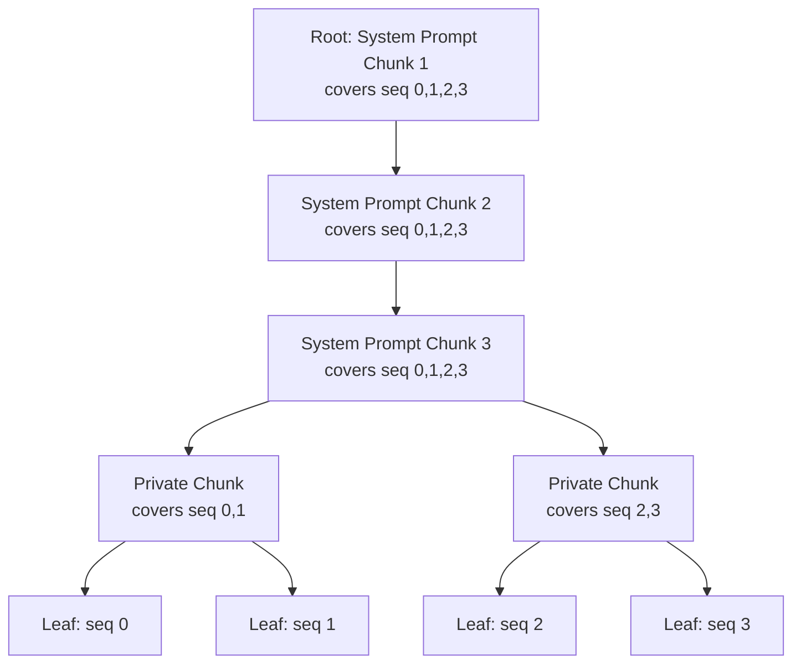

本記事は [ChunkAttention: Efficient Self-Attention with Prefix-Aware KV Cache and Two-Phase Partition](https://arxiv.org/abs/2402.15220) の解説記事です。

この記事は [Zenn記事: vLLMのPrefix CachingとContinuous Batchingで文書要約APIのP95レイテンシを半減する](https://zenn.dev/0h_n0/articles/7e3c8355db3417) の深掘りです。

## 論文概要（Abstract）

Self-Attentionは大規模言語モデル（LLM）の中核機構であるが、長系列の推論においてレイテンシの主要因となる。ChunkAttentionは、マルチテナントLLMサービングにおいて複数リクエストが共有するシステムプロンプトのプレフィックスを実行時に検出し、KVテンソルをメモリ上で共有するprefix-awareな自己注意モジュールである。KVテンソルを小さなチャンクに分割しプレフィックス木に構造化することで、メモリ効率を向上させる。著者らは、two-phase partitionアルゴリズムにより共有チャンクへのアクセスにおけるデータ局所性を改善し、システムプロンプト長1024-4096トークンの条件でSOTA実装比3.2-4.8倍の高速化を達成したと報告している。

## 情報源

- **会議名**: ACL 2024（Annual Meeting of the Association for Computational Linguistics）
- **年**: 2024
- **URL**: [https://arxiv.org/abs/2402.15220](https://arxiv.org/abs/2402.15220)
- **著者**: Lu Ye, Ze Tao, Yong Huang, Yang Li
- **分野**: cs.LG, cs.CL
- **コード**: [https://github.com/microsoft/chunk-attention](https://github.com/microsoft/chunk-attention)

## カンファレンス情報

ACL（Association for Computational Linguistics）は自然言語処理・計算言語学分野の最高峰会議の1つである。2024年のACLはタイ・バンコクで開催された。LLM推論最適化は近年のACLでも注目度が高く、本論文はシステム寄りのアプローチでありながらACLに採択されている点が特徴的である。

## 主要な貢献（Key Contributions）

1. **Prefix-Aware KV Cache**: プレフィックス木を用いてKVテンソルをチャンク単位で管理し、共有プレフィックスのKVキャッシュを実行時に自動検出・共有する機構
2. **Two-Phase Partition Algorithm**: 共有チャンクと非共有チャンクを分離して処理する2段階パーティションにより、データ局所性を改善しGPUの演算効率を向上
3. **Runtime Prefix Detection**: 事前定義なしに実行時にプレフィックス共有を検出するJIT方式。vLLMのPagedAttentionが事前設定（AoT方式）を必要とするのに対し、動的な検出を実現

## 背景と動機（Background & Motivation）

マルチテナントLLMサービングでは、多数のリクエストが同一のシステムプロンプト（タスク指示、Few-shotサンプル、外部知識等）を共有する。GPT-3（175Bパラメータ）のFP16推論では、1トークンあたり約4.5MBのKVキャッシュが必要であり（論文Section 3より）、1024-4096トークンのシステムプロンプトを各リクエストで重複保持するとメモリ消費が急激に増大する。

既存のvLLMのPagedAttentionはOSのページング機構を応用しKVキャッシュの断片化を解消したが、共有プレフィックスの検出にはサービスプロバイダによる事前設定が必要であり、実行時の動的検出は実装されていなかった。また、FlashAttentionは学習時の高速化に優れるがデコーディング時（クエリが1トークン）にはほとんど利得がなく、不連続メモリや可変長系列への対応が難しいという制約がある。

著者らはこの課題に対し、KVテンソルをチャンクに分割してプレフィックス木で管理し、共有部分を自動検出・一括処理する仕組みを提案した。

## 技術的詳細（Technical Details）

### プレフィックス木によるKVキャッシュ管理

ChunkAttentionのKVキャッシュは、プレフィックス木（prefix tree / trie）として構造化される。各ノードは固定長 $c$ トークン分のKVテンソルチャンクを保持する。



各ノードの構造は以下の通りである。

- **Key tensor slice**: $\mathbf{K}^{(C)} \in \mathbb{R}^{b \times h \times c \times d}$（$b$: バッチ内でこのチャンクがカバーする系列数、$h$: ヘッド数、$c$: チャンクサイズ、$d$: ヘッド次元）
- **Value tensor slice**: $\mathbf{V}^{(C)} \in \mathbb{R}^{b \times h \times c \times d}$
- **カバー範囲**: このチャンクを共有する系列のインデックス範囲 $[i, j)$

ルートノードは全アクティブ系列をカバーし、リーフノードは個別系列に対応する。プレフィックス木のメモリ管理にはプールベースのアロケータを用い、完了した系列のチャンクをフリーリストに返却する。メモリロスは $(c-1)/n$ で上界され（$n$: 系列長）、チャンクサイズ $c=64$ では一般的な系列長に対して無視できる水準である。

共有プレフィックスによるメモリ削減効果は、共有率 $r = n_s / (n_p + n_c)$ を用いて表される。ここで $n_s$ は共有プレフィックストークン数、$n_p$ はプロンプト長、$n_c$ は生成トークン数である。同時処理可能な系列数は約 $1/(1-r)$ 倍に増加する（論文Section 3.3より）。

### Two-Phase Partitionアルゴリズム

ChunkAttentionの中核となるTwo-Phase Partition（TPP）は、共有チャンクと非共有チャンクでAttention計算を分離する。

#### Phase 1: Chunk-First（共有チャンク処理）

プレフィックス木の内部ノード（複数系列が共有するチャンク）を処理する。共有チャンク $C$ に対し、カバー範囲 $[i, j)$ の全クエリをバッチ処理する。

$$
\mathbf{W}^{(C)} = \mathbf{Q}_{i:j,:} \cdot {\mathbf{K}^{(C)}}^T \in \mathbb{R}^{(j-i) \times c}
$$

ここで、
- $\mathbf{Q}_{i:j,:}$: 系列 $i$ から $j-1$ までのクエリベクトル（形状: $(j-i) \times d$）
- $\mathbf{K}^{(C)}$: チャンク $C$ のKeyテンソル（形状: $c \times d$）

オンラインSoftmaxにより部分的なAttention結果を計算する。

$$
m^{(C)} = \max(\mathbf{W}^{(C)}) \in \mathbb{R}^{j-i}
$$

$$
\mathbf{E}^{(C)} = \exp(\mathbf{W}^{(C)} - m^{(C)} \cdot \mathbf{1}^T) \in \mathbb{R}^{(j-i) \times c}
$$

$$
n^{(C)} = \sum \mathbf{E}^{(C)} \in \mathbb{R}^{j-i}
$$

$$
\mathbf{O}^{(C)} = \mathbf{E}^{(C)} \cdot \mathbf{V}^{(C)} \in \mathbb{R}^{(j-i) \times d}
$$

ここで $m^{(C)}$ は数値安定化のための行方向最大値、$n^{(C)}$ は正規化定数、$\mathbf{O}^{(C)}$ は部分的なAttention出力である。部分結果 $(\mathbf{O}^{(C)}, m^{(C)}, n^{(C)})$ はGPUメモリに保存され、Phase 2で統合される。

#### Phase 2: Sequence-First（非共有チャンク処理と統合）

各系列固有のチャンクを処理しつつ、Phase 1の部分結果を統合する。統合にはオンラインSoftmaxの加法的分解を利用する（論文Equation 2より）。

$$
x^{(C)} = \exp(m^{(C)} - \max(m^{(C)}, m_i))
$$

$$
y^{(C)} = \exp(m_i - \max(m^{(C)}, m_i))
$$

$$
\mathbf{O}_{i,:} = x^{(C)} \cdot \mathbf{o}^{(C)} + y^{(C)} \cdot \mathbf{O}_{i,:}
$$

$$
n_i = x^{(C)} \cdot n^{(C)} + y^{(C)} \cdot n_i
$$

$$
m_i = \max(m^{(C)}, m_i)
$$

最終出力は $\mathbf{O}/n$（要素ごとの除算）で得られる。この分解により、チャンク間で同期をとる必要なく部分結果を逐次的にマージできる。

### アルゴリズムの実装イメージ

```python
import torch
from dataclasses import dataclass


@dataclass
class KVChunk:
    """プレフィックス木の1ノードが保持するKVチャンク

    Attributes:
        key: Keyテンソル (chunk_size, head_dim)
        value: Valueテンソル (chunk_size, head_dim)
        seq_start: カバーする系列の開始インデックス
        seq_end: カバーする系列の終了インデックス（排他的）
        children: 子ノードのリスト
    """
    key: torch.Tensor
    value: torch.Tensor
    seq_start: int
    seq_end: int
    children: list["KVChunk"]


def partial_attention(
    query: torch.Tensor,
    chunk: KVChunk,
) -> tuple[torch.Tensor, torch.Tensor, torch.Tensor]:
    """共有チャンクに対する部分的なAttention計算

    Args:
        query: クエリベクトル (num_covered_seqs, head_dim)
        chunk: KVチャンクノード

    Returns:
        partial_output: 部分的なAttention出力 (num_covered_seqs, head_dim)
        row_max: 行方向最大値 (num_covered_seqs,)
        row_sum: 正規化定数 (num_covered_seqs,)
    """
    # Q @ K^T / sqrt(d_k)
    d_k = query.size(-1)
    scores = torch.matmul(query, chunk.key.T) / (d_k ** 0.5)

    # Online softmax: 数値安定化
    row_max = scores.max(dim=-1).values
    exp_scores = torch.exp(scores - row_max.unsqueeze(-1))
    row_sum = exp_scores.sum(dim=-1)

    # 部分出力
    partial_output = torch.matmul(exp_scores, chunk.value)

    return partial_output, row_max, row_sum


def attention_reduce(
    current_output: torch.Tensor,
    current_max: torch.Tensor,
    current_sum: torch.Tensor,
    new_output: torch.Tensor,
    new_max: torch.Tensor,
    new_sum: torch.Tensor,
) -> tuple[torch.Tensor, torch.Tensor, torch.Tensor]:
    """2つの部分Attention結果をオンラインSoftmaxで統合

    Args:
        current_output: 現在の累積出力
        current_max: 現在の行方向最大値
        current_sum: 現在の正規化定数
        new_output: 新しい部分出力
        new_max: 新しい行方向最大値
        new_sum: 新しい正規化定数

    Returns:
        merged_output: 統合後の出力
        merged_max: 統合後の行方向最大値
        merged_sum: 統合後の正規化定数
    """
    merged_max = torch.max(current_max, new_max)

    # スケーリング係数
    scale_current = torch.exp(current_max - merged_max)
    scale_new = torch.exp(new_max - merged_max)

    merged_output = (
        scale_current.unsqueeze(-1) * current_output
        + scale_new.unsqueeze(-1) * new_output
    )
    merged_sum = scale_current * current_sum + scale_new * new_sum
    return merged_output, merged_max, merged_sum
```

### Chunk-Firstが有効な理由

Chunk-Firstフェーズでは、共有チャンク1つに対して複数系列のクエリをまとめて行列積で処理する。デコーディング時のクエリは通常1トークン（ベクトル）であるため、単独ではGPUのTensor Coreを十分活用できない。しかし複数系列のクエリをバッチ化することでGEMM（行列-行列積）に変換でき、演算密度が向上する。A100のStreaming Multiprocessor（108基）に対しアテンションヘッド数（32）が少ないモデルでは、チャンク単位でパーティションすることでGPU利用率が向上する。

## 実装のポイント（Implementation）

### CUDAカーネル設計

著者らは2種類のCUDAカーネルを実装している。

- **Chunk-Firstカーネル**: アテンションヘッドではなくチャンク単位でパーティション。A100の108 SMに対しヘッド数32では並列度が不足するため、チャンク数でパーティションし並列度を確保する
- **Sequence-Firstカーネル**: 系列ごとに処理し、Phase 1の部分結果をローカルにリデュース。スレッドブロック間通信やアトミック操作は不要

### CPU-GPU連携の最適化

プレフィックス木はCPUメモリ上で管理され、チャンク情報（チャンクID、カバー範囲）がmemcpyでGPUに転送される。3つのレイテンシ隠蔽戦略が用いられる。

1. **レイテンシ隠蔽**: CPU上のコンテキスト生成を直前のGPUカーネル実行と重畳
2. **遅延コピー**: コンテキストをGPUメモリにキャッシュし、木構造が変化したとき（チャンクが満杯になる $c$ イテレーションごと、系列の追加・削除時）のみ転送
3. **オーバーヘッド償却**: 転送コストを複数デコーディングイテレーションで償却

### メモリ管理

プールベースアロケータを採用し、完了系列のチャンクをフリーリストに返却する。OS側へのメモリ解放は行わず再割り当てコストを回避する。チャンクサイズ $c=64$ での実装では、メモリロスは系列長に対して $63/n$ で上界される。

### 共有プレフィックスなし（$n_s=0$）の場合

著者らは、共有トークンが存在しない場合にTPPが性能低下を引き起こさないことを確認している（論文Section 5.2より）。プレフィックス木がフラットな構造になり、Sequence-Firstフェーズのみが実行される。

## Production Deployment Guide

ChunkAttentionはGitHubでコードが公開されており（[microsoft/chunk-attention](https://github.com/microsoft/chunk-attention)）、マルチテナントLLMサービングに直接適用可能である。以下ではAWS上でのプロダクション環境構築ガイドを示す。

### AWS実装パターン（コスト最適化重視）

ChunkAttentionの恩恵が最も大きいのは、共通システムプロンプトを持つマルチテナントAPI（チャットボット、文書要約、コード生成等）である。トラフィック量別の推奨構成を示す。

**注意**: 以下のコスト試算は2026年9月時点のAWS ap-northeast-1（東京）リージョンの概算料金に基づく。実際のコストはトラフィックパターン、リージョン、バースト使用量により変動する。最新料金はAWS料金計算ツールでの確認を推奨する。

| 構成 | トラフィック | 主要サービス | 月額概算 |
|------|------------|-------------|---------|
| Small | ~100 req/日 | Lambda + Bedrock | $50-150 |
| Medium | ~1,000 req/日 | ECS Fargate + 自前モデル | $300-800 |
| Large | 10,000+ req/日 | EKS + GPU Spot Instances | $2,000-5,000 |

**Small構成（~100 req/日）**: Lambda + Bedrock構成。Bedrock側にプロンプトキャッシュを委任しChunkAttentionの実装は不要。月額内訳: Lambda ($5) + Bedrock Prompt Caching ($30-100) + DynamoDB ($5) + CloudWatch ($10)。

**Medium構成（~1,000 req/日）**: ECS Fargate上でvLLM + ChunkAttentionカスタムカーネルを稼働。g5.xlarge (NVIDIA A10G) 1台で対応。月額内訳: ECS Fargate GPU ($200-400) + ALB ($20) + ECR ($5) + CloudWatch ($15)。

**Large構成（10,000+ req/日）**: EKS上でKarpenterによるGPU Spot Instances自動スケーリング。g5.2xlarge/p4d.24xlargeをSpot優先で確保。月額内訳: EKS Control Plane ($75) + GPU Spot Instances ($1,200-3,500) + ALB ($50) + Secrets Manager ($10) + CloudWatch ($50)。

**コスト削減テクニック**:
- Spot Instances活用でオンデマンド比最大90%削減（g5系は60-70%削減が安定的）
- Reserved Instances 1年コミットで最大72%削減
- Bedrock Prompt Caching有効化で入力トークンコスト最大90%削減
- ChunkAttention自体のKVキャッシュ共有で、同一GPU上の同時処理系列数が $1/(1-r)$ 倍に増加し、GPUあたりスループットが向上

### Terraformインフラコード

**Small構成（Serverless）**: Lambda + Bedrock + DynamoDB

```hcl
# ChunkAttention対応LLMサービング - Small構成
# Lambda + Bedrock (Prompt Caching) + DynamoDB

terraform {
  required_version = ">= 1.9"
  required_providers {
    aws = {
      source  = "hashicorp/aws"
      version = "~> 5.60"
    }
  }
}

provider "aws" {
  region = "ap-northeast-1"
}

# IAMロール（最小権限）
resource "aws_iam_role" "llm_lambda" {
  name = "chunk-attention-lambda-role"
  assume_role_policy = jsonencode({
    Version = "2012-10-17"
    Statement = [{
      Action = "sts:AssumeRole"
      Effect = "Allow"
      Principal = { Service = "lambda.amazonaws.com" }
    }]
  })
}

resource "aws_iam_role_policy" "bedrock_invoke" {
  name = "bedrock-invoke"
  role = aws_iam_role.llm_lambda.id
  policy = jsonencode({
    Version = "2012-10-17"
    Statement = [
      {
        Effect   = "Allow"
        Action   = ["bedrock:InvokeModel", "bedrock:InvokeModelWithResponseStream"]
        Resource = "arn:aws:bedrock:ap-northeast-1::foundation-model/*"
      },
      {
        Effect   = "Allow"
        Action   = ["dynamodb:GetItem", "dynamodb:PutItem", "dynamodb:Query"]
        Resource = aws_dynamodb_table.prompt_cache.arn
      },
      {
        Effect   = "Allow"
        Action   = ["logs:CreateLogGroup", "logs:CreateLogStream", "logs:PutLogEvents"]
        Resource = "arn:aws:logs:ap-northeast-1:*:*"
      }
    ]
  })
}

# DynamoDB: プロンプトキャッシュメタデータ管理
resource "aws_dynamodb_table" "prompt_cache" {
  name         = "chunk-attention-prompt-cache"
  billing_mode = "PAY_PER_REQUEST" # On-Demandでコスト最適化
  hash_key     = "tenant_id"
  range_key    = "prompt_hash"

  attribute {
    name = "tenant_id"
    type = "S"
  }
  attribute {
    name = "prompt_hash"
    type = "S"
  }

  ttl {
    attribute_name = "expires_at"
    enabled        = true
  }

  server_side_encryption {
    enabled = true # KMS暗号化
  }
}

# Lambda関数
resource "aws_lambda_function" "llm_inference" {
  function_name = "chunk-attention-inference"
  role          = aws_iam_role.llm_lambda.arn
  runtime       = "python3.12"
  handler       = "handler.lambda_handler"
  timeout       = 300
  memory_size   = 1024 # Bedrock呼び出しにはCPU/メモリ不要
  filename      = "lambda.zip"

  environment {
    variables = {
      DYNAMODB_TABLE    = aws_dynamodb_table.prompt_cache.name
      BEDROCK_MODEL_ID  = "anthropic.claude-sonnet-4-20250514"
      ENABLE_PROMPT_CACHE = "true"
    }
  }

  tracing_config {
    mode = "Active" # X-Ray有効化
  }
}

# CloudWatch アラーム: コスト監視
resource "aws_cloudwatch_metric_alarm" "lambda_duration" {
  alarm_name          = "chunk-attention-lambda-high-duration"
  comparison_operator = "GreaterThanThreshold"
  evaluation_periods  = 3
  metric_name         = "Duration"
  namespace           = "AWS/Lambda"
  period              = 300
  statistic           = "p95"
  threshold           = 30000 # 30秒
  alarm_actions       = [] # SNSトピックARNを指定
  dimensions = {
    FunctionName = aws_lambda_function.llm_inference.function_name
  }
}
```

**Large構成（Container）**: EKS + Karpenter + Spot Instances

```hcl
# ChunkAttention対応LLMサービング - Large構成
# EKS + Karpenter (GPU Spot優先) + Secrets Manager

module "eks" {
  source  = "terraform-aws-modules/eks/aws"
  version = "~> 20.24"

  cluster_name    = "chunk-attention-cluster"
  cluster_version = "1.31"

  vpc_id     = module.vpc.vpc_id
  subnet_ids = module.vpc.private_subnets

  # Karpenter用IRSA
  enable_irsa = true

  cluster_endpoint_public_access = false # プライベートアクセスのみ
}

# Karpenter Provisioner: GPU Spot優先
resource "kubectl_manifest" "karpenter_nodepool" {
  yaml_body = yamlencode({
    apiVersion = "karpenter.sh/v1"
    kind       = "NodePool"
    metadata   = { name = "gpu-spot" }
    spec = {
      template = {
        spec = {
          requirements = [
            { key = "karpenter.sh/capacity-type", operator = "In", values = ["spot", "on-demand"] },
            { key = "node.kubernetes.io/instance-type", operator = "In",
              values = ["g5.xlarge", "g5.2xlarge"] }, # NVIDIA A10G
            { key = "kubernetes.io/arch", operator = "In", values = ["amd64"] }
          ]
          nodeClassRef = { name = "default" }
        }
      }
      limits   = { cpu = "128", memory = "512Gi", "nvidia.com/gpu" = "8" }
      disruption = {
        consolidationPolicy = "WhenEmptyOrUnderutilized"
        consolidateAfter    = "30s"
      }
    }
  })
}

# Secrets Manager: モデル設定
resource "aws_secretsmanager_secret" "model_config" {
  name                    = "chunk-attention/model-config"
  recovery_window_in_days = 7
}

resource "aws_secretsmanager_secret_version" "model_config" {
  secret_id = aws_secretsmanager_secret.model_config.id
  secret_string = jsonencode({
    model_name     = "meta-llama/Llama-2-7b-hf"
    chunk_size     = 64
    max_batch_size = 96
    gpu_memory_utilization = 0.9
  })
}

# AWS Budgets: 月額予算アラート
resource "aws_budgets_budget" "monthly" {
  name         = "chunk-attention-monthly"
  budget_type  = "COST"
  limit_amount = "5000"
  limit_unit   = "USD"
  time_unit    = "MONTHLY"

  notification {
    comparison_operator       = "GREATER_THAN"
    threshold                 = 80
    threshold_type            = "PERCENTAGE"
    notification_type         = "ACTUAL"
    subscriber_email_addresses = ["ops@example.com"]
  }
}
```

### 運用・監視設定

**CloudWatch Logs Insights: KVキャッシュ共有率の監視**

```
fields @timestamp, @message
| filter @message like /kv_cache_sharing/
| stats avg(sharing_ratio) as avg_sharing,
        max(sharing_ratio) as max_sharing,
        count(*) as request_count
  by bin(1h)
| sort @timestamp desc
```

**CloudWatch Logs Insights: レイテンシ分析（P95/P99）**

```
fields @timestamp, latency_ms, batch_size, shared_prefix_tokens
| stats percentile(latency_ms, 95) as p95,
        percentile(latency_ms, 99) as p99,
        avg(latency_ms) as avg_latency,
        avg(batch_size) as avg_batch
  by bin(5m)
| sort @timestamp desc
```

**CloudWatch アラーム設定（Python）**:

```python
import boto3


def create_latency_alarm(
    function_name: str,
    threshold_ms: float = 30000.0,
    sns_topic_arn: str = "",
) -> dict:
    """Lambda実行時間の異常検知アラームを作成

    Args:
        function_name: Lambda関数名
        threshold_ms: アラーム閾値（ミリ秒）
        sns_topic_arn: 通知先SNSトピックARN

    Returns:
        CloudWatch APIレスポンス
    """
    client = boto3.client("cloudwatch", region_name="ap-northeast-1")
    return client.put_metric_alarm(
        AlarmName=f"{function_name}-high-latency",
        MetricName="Duration",
        Namespace="AWS/Lambda",
        Statistic="p95",
        Period=300,
        EvaluationPeriods=3,
        Threshold=threshold_ms,
        ComparisonOperator="GreaterThanThreshold",
        AlarmActions=[sns_topic_arn] if sns_topic_arn else [],
        Dimensions=[{"Name": "FunctionName", "Value": function_name}],
    )
```

**X-Ray トレーシング設定（Python）**:

```python
from aws_xray_sdk.core import xray_recorder, patch_all


def setup_xray_tracing(service_name: str = "chunk-attention") -> None:
    """X-Rayトレーシングの初期化

    Args:
        service_name: サービス名（X-Rayサービスマップ上の表示名）
    """
    xray_recorder.configure(service=service_name)
    patch_all()  # boto3, requests等を自動計装


@xray_recorder.capture("llm_inference")
def traced_inference(
    prompt: str,
    tenant_id: str,
    shared_prefix_len: int,
) -> dict:
    """X-Rayトレース付きLLM推論

    Args:
        prompt: 入力プロンプト
        tenant_id: テナント識別子
        shared_prefix_len: 共有プレフィックス長（トークン数）

    Returns:
        推論結果
    """
    subsegment = xray_recorder.current_subsegment()
    if subsegment:
        subsegment.put_annotation("tenant_id", tenant_id)
        subsegment.put_metadata("shared_prefix_len", shared_prefix_len)
        subsegment.put_metadata("prompt_length", len(prompt))
    # 推論処理...
    return {"status": "ok"}
```

**Cost Explorer日次レポート（Python）**:

```python
import boto3
from datetime import date, timedelta


def get_daily_cost_report(
    threshold_usd: float = 100.0,
    sns_topic_arn: str = "",
) -> dict:
    """日次コストレポートを取得し閾値超過時にSNS通知

    Args:
        threshold_usd: コスト閾値（USD/日）
        sns_topic_arn: 通知先SNSトピックARN

    Returns:
        サービス別コスト内訳
    """
    ce = boto3.client("ce", region_name="us-east-1")
    today = date.today()
    yesterday = today - timedelta(days=1)

    response = ce.get_cost_and_usage(
        TimePeriod={
            "Start": yesterday.isoformat(),
            "End": today.isoformat(),
        },
        Granularity="DAILY",
        Metrics=["UnblendedCost"],
        GroupBy=[{"Type": "DIMENSION", "Key": "SERVICE"}],
        Filter={
            "Tags": {"Key": "project", "Values": ["chunk-attention"]}
        },
    )

    total = sum(
        float(g["Metrics"]["UnblendedCost"]["Amount"])
        for r in response["ResultsByTime"]
        for g in r["Groups"]
    )

    if total > threshold_usd and sns_topic_arn:
        sns = boto3.client("sns", region_name="ap-northeast-1")
        sns.publish(
            TopicArn=sns_topic_arn,
            Subject=f"ChunkAttention daily cost alert: ${total:.2f}",
            Message=f"Daily cost ${total:.2f} exceeded threshold ${threshold_usd}",
        )

    return {"total_usd": total, "details": response["ResultsByTime"]}
```

### コスト最適化チェックリスト

**アーキテクチャ選択**:
- [ ] トラフィック~100 req/日 → Serverless（Lambda + Bedrock）
- [ ] トラフィック~1,000 req/日 → Hybrid（ECS Fargate + GPU）
- [ ] トラフィック10,000+ req/日 → Container（EKS + Karpenter）

**リソース最適化**:
- [ ] EC2/EKS: GPU Spot Instances優先（g5系で60-70%削減）
- [ ] Reserved Instances: 1年コミットで最大72%削減
- [ ] Savings Plans: Compute Savings Plans検討
- [ ] Lambda: メモリサイズを実測ベースで最適化（1024MB推奨）
- [ ] EKS: Karpenter consolidationPolicy で未使用ノード自動削除

**LLMコスト削減**:
- [ ] Bedrock Prompt Caching有効化（入力トークン最大90%削減）
- [ ] ChunkAttention KVキャッシュ共有でGPUあたりスループット向上
- [ ] モデル選択ロジック（簡易クエリにはHaikuクラス、複雑クエリにはSonnetクラス）
- [ ] max_tokens制限による出力トークン上限設定

**監視・アラート**:
- [ ] AWS Budgets: 月額予算の80%で通知
- [ ] CloudWatch: P95レイテンシ・エラー率アラーム
- [ ] Cost Anomaly Detection有効化
- [ ] 日次コストレポート（Cost Explorer API + SNS）

**リソース管理**:
- [ ] 未使用GPU Instancesの自動停止（Karpenter TTL）
- [ ] タグ戦略: project/environment/ownerタグ必須
- [ ] ECRイメージライフサイクルポリシー（古いイメージ自動削除）
- [ ] 開発環境の夜間・週末自動停止
- [ ] CloudTrail/AWS Config有効化（監査・コンプライアンス）

## 実験結果（Results）

### マイクロカーネルベンチマーク

著者らはLlama2 7B（FP16）、NVIDIA A100 80GB、CUDA 11.8で評価を実施している。チャンクサイズ $c=64$、ヘッド次元 $d=128$、ヘッド数 $h=32$ の設定である（論文Table 3、Section 5.1より）。

| ベースライン | 共有プレフィックス長 | ChunkAttention高速化率 |
|-------------|-------------------|----------------------|
| Naive (PyTorch) | 1024-4096 | 6.6倍 |
| PagedAttention (vLLM 0.2.7) | 1024-4096 | 3.2-4.8倍 |
| PagedAttention* (KV共有シミュレーション) | 1024-4096 | 2.8-3.2倍 |

PagedAttention*はvLLMにKVキャッシュ共有を手動で設定したシミュレーション版であり、PagedAttentionとPagedAttention*の差がメモリ共有の効果、PagedAttention*とChunkAttentionの差がTPPアルゴリズムの効果を示す。

### スループット評価

共有プレフィックス $n_s=4096$、生成トークン $n_c=512$ の条件で、著者らはChunkAttentionが101.69K toks/sに対しPagedAttentionが21.04K toks/sと報告しており、約4.8倍のスループット改善が確認されている（論文Figure 3より）。$n_c=2048$ ではこの差は2.4倍（37.05K vs 15.12K toks/s）に縮まる。生成トークン数が増えるにつれ非共有部分の計算比率が高まるためである。

### エンドツーエンド評価

| 設定 ($n_p$, $n_s$) | 正規化レイテンシ (ms/token) | KVキャッシュメモリ (GB) | メモリ削減率 |
|---------------------|---------------------------|----------------------|-----------|
| (1024, 1024) | 20.80 → 14.07 | 14.79 → 3.28 | 78% |
| (2048, 2048) | 21.61 → 15.20 | 21.09 → 3.40 | 84% |
| (4096, 4096) | 27.62 → 17.16 | 35.42 → 4.00 | 89% |

（論文Table 4より、左がvLLM、右がChunkAttention）

共有プレフィックスが長いほどメモリ削減効果が大きく、$n_s=4096$ では89%のKVキャッシュメモリ削減が達成されている。正規化レイテンシも32-38%の改善を示す。

### バッチサイズスケーリング

共有プレフィックス $n_s=2048$ の条件で、バッチサイズを16から96に増やすとスループットが155K toks/sから224K toks/sに向上する（論文Figure 4より）。標準実装ではバッチサイズ16で頭打ちになるのに対し、ChunkAttentionはKVキャッシュ共有によりGPUメモリを節約し、より大きなバッチサイズでの処理が可能となる。

## 実運用への応用（Practical Applications）

### Zenn記事との関連

Zenn記事「vLLMのPrefix CachingとContinuous Batchingで文書要約APIのP95レイテンシを半減する」で扱われているvLLMのPrefix Cachingは、ChunkAttentionが解決する課題と直接的に関連する。vLLMのPrefix Cachingはハッシュベースのブロック共有であるのに対し、ChunkAttentionはプレフィックス木による動的検出とTwo-Phase PartitionによるAttentionカーネルレベルの最適化を組み合わせている。Zenn記事で紹介されたPrefix Caching機能の内部メカニズムをより深く理解するための参考となる。

### 適用が有効なユースケース

- **マルチテナントチャットボット**: 共通のシステムプロンプト（1024-4096トークン）を持つ複数テナントのリクエストを同一GPUで処理する場合、3-5倍のスループット向上が見込める
- **RAGパイプライン**: 検索結果をプレフィックスとして共有するケースで、KVキャッシュメモリを78-89%削減可能
- **バッチ推論**: 同一プロンプトテンプレートを用いた大量文書処理で、GPUあたり同時処理数を $1/(1-r)$ 倍に増加

### 制約・限界

著者らは以下の制約を指摘している。

- **プレフィックス位置の制約**: 共有部分が系列の先頭にある場合のみ有効。プロンプトの中間に共有部分がある場合は性能が大幅に低下する
- **ファインチューニングとの両立**: モデルのファインチューニングは共有プレフィックスの有効性を低下させる可能性がある。著者らは費用対効果の高いファインチューニング・ホスティングソリューションはまだ見えていないと述べている
- **ハードウェア互換性**: 低レベルCUDA実装のため、A100、RTX 4090、Intel Xeon以外のハードウェアへの移植には追加の開発コストが必要

## 関連研究（Related Work）

- **PagedAttention / vLLM** (Kwon et al., 2023): OSのページング機構をKVキャッシュに適用し断片化を解消。ChunkAttentionはvLLMの「事前設定型（AoT）」に対し「実行時検出型（JIT）」アプローチであり、プレフィックス木による動的管理とAttentionカーネルの最適化を追加した点が差分である
- **FlashAttention** (Dao et al., 2022): タイリングによるHBMアクセス削減で学習時2-4倍の高速化を実現。ただし不連続メモリや可変長系列への対応が弱く、デコーディング時のクエリが1トークンの場合にはほとんど利得がない。ChunkAttentionはデコーディング専用の最適化として相補的な関係にある
- **RadixAttention / SGLang** (Zheng et al., 2023): LRUベースのRadix Treeでプレフィックスキャッシュを管理。ChunkAttentionと類似の方向性だが、Attentionカーネル自体の最適化（TPP）を含む点がChunkAttentionの特徴である

## まとめと今後の展望

ChunkAttentionは、マルチテナントLLMサービングにおけるKVキャッシュの冗長性を、プレフィックス木構造とTwo-Phase Partitionアルゴリズムにより解消する手法である。共有プレフィックス長1024-4096トークンの条件でSOTA比3.2-4.8倍の高速化と78-89%のKVキャッシュメモリ削減を達成している。

実務への示唆として、共通システムプロンプトを持つマルチテナントAPIではChunkAttentionのアプローチが直接的に有効である。vLLMやSGLangなどの推論フレームワークにもプレフィックスキャッシュの概念は取り込まれつつあり、ChunkAttentionの知見は今後の推論最適化の基盤となる。

今後の研究方向として、プレフィックス位置制約の緩和（系列中間の共有部分への対応）、多様なハードウェアプラットフォームへの展開、GQA（Grouped-Query Attention）やMQA（Multi-Query Attention）との組み合わせ最適化が考えられる。

## 参考文献

- **Conference URL**: [https://arxiv.org/abs/2402.15220](https://arxiv.org/abs/2402.15220)
- **Code**: [https://github.com/microsoft/chunk-attention](https://github.com/microsoft/chunk-attention)
- **Related Zenn article**: [https://zenn.dev/0h_n0/articles/7e3c8355db3417](https://zenn.dev/0h_n0/articles/7e3c8355db3417)
