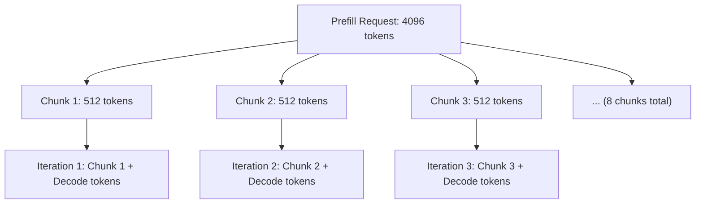

本記事は [Taming Throughput-Latency Tradeoff in LLM Inference with Sarathi-Serve](https://arxiv.org/abs/2403.02310) の解説記事です。

## 論文概要（Abstract）

LLM推論はprefillフェーズとdecodeフェーズで相反するリソース利用パターンを持ち、高スループットと低レイテンシの両立が困難である。著者らはSarathi-Serveを提案し、prefillリクエストを均等サイズのチャンクに分割する**Chunked Prefills**、デコード中リクエストを中断せずにバッチ拡張を行う**Stall-free Scheduling**、パイプライン並列時のバブルを削減する**Uniform Batching**の3手法により、vLLM比で最大5.6倍のサービング容量向上を達成したと報告している。

この記事は [Zenn記事: vLLMのPrefix CachingとContinuous Batchingで文書要約APIのP95レイテンシを半減する](https://zenn.dev/0h_n0/articles/7e3c8355db3417) の深掘りです。

## 情報源

- **arXiv ID**: 2403.02310
- **URL**: [https://arxiv.org/abs/2403.02310](https://arxiv.org/abs/2403.02310)
- **著者**: Amey Agrawal, Nitin Kedia, Ashish Panwar, Jayashree Mohan et al.（Microsoft Research）
- **発表年**: 2024（OSDI 2024採択）
- **分野**: cs.LG, cs.DC
- **コード**: [https://github.com/microsoft/sarathi-serve](https://github.com/microsoft/sarathi-serve)

## 背景と動機（Background & Motivation）

LLMの推論処理はprefillとdecodeの2フェーズに分かれる。prefillフェーズはユーザのプロンプト全体を一括処理し、KV-Cacheを生成する計算集約的な処理である。一方、decodeフェーズはトークンを1つずつ自己回帰的に生成するため、メモリ帯域幅がボトルネックとなりGPU演算器の利用率が低い。

従来のContinuous Batching（Orca方式）やvLLMのIteration-level Schedulingでは、prefillリクエストを優先的に処理する。この結果、長いプロンプトのprefill中にデコード中のリクエストが**数秒間にわたって生成を停止する「generation stall」**が発生する。著者らの実験では、Yi-34Bモデルで128リクエストを処理した際、vLLMにおいてTime Between Tokens（TBT）が数秒に達するスパイクが観測されたと報告されている（論文Figure 1a）。

この問題の根本原因は、prefillとdecodeのバッチを混合（Hybrid Batching）した際に、prefillの計算量がdecodeを圧倒し、デコード側のレイテンシが最大28.3倍に悪化することにある（論文Figure 9）。

## 主要な貢献（Key Contributions）

- **Chunked Prefills**: prefillリクエストを均等サイズのチャンクに分割し、複数イテレーションに分散処理することで、1イテレーションあたりの計算量を制御する
- **Stall-free Scheduling**: デコード中のリクエストを常に最優先でバッチに含め、残りのトークン予算でprefillチャンクを処理するスケジューリングアルゴリズム
- **Uniform Batching**: パイプライン並列時に各マイクロバッチの計算量を均一化し、パイプラインバブルを削減する手法

## 技術的詳細（Technical Details）

### Prefill-Decode干渉問題の定量分析

LLM推論における各イテレーションの実行時間は、演算時間とメモリアクセス時間の大きい方で決まる。

$$
T_{\text{iter}} = \max(T_{\text{compute}}, T_{\text{memory}})
$$

ここで、
- $T_{\text{compute}}$: 行列演算にかかる時間
- $T_{\text{memory}}$: 重みやKV-Cacheのメモリ読み出しにかかる時間

prefillバッチは多数のトークンを一括処理するため、重みの読み出しコストを多くのトークンで償却でき、高い**Arithmetic Intensity**（演算量/メモリアクセス量の比）を達成する。一方、decodeバッチは各リクエストにつき1トークンしか処理しないため、Arithmetic Intensityが低くGPU演算器が遊んでしまう。

A100 GPU上での実測では、decodeバッチがGPU演算器を飽和させるには約500-600トークン以上のバッチサイズが必要であると報告されている。

### Chunked Prefillsのアルゴリズム

Chunked Prefillsの核心は、長いprefillリクエストを固定サイズのチャンクに分割し、各イテレーションでデコードトークンと共に処理することである。



チャンクサイズの選択は以下の3要素のトレードオフで決定される。

1. **TBT SLO要件**: チャンクサイズが小さいほど1イテレーションのレイテンシが短くなり、厳しいSLOを満たしやすい
2. **チャンキングオーバーヘッド**: チャンクが小さすぎると分割回数が増え、各チャンクでKV-Cacheの再読み込みが発生する
3. **Tile-quantization効果**: GPUの行列演算はタイルサイズ（通常256の倍数）に最適化されており、257トークンのチャンクは256トークンに比べてprefill時間が32%増加する

論文では、厳しいSLOには512トークン、緩いSLOには2048トークンのチャンクサイズを使用している。Yi-34B（TP-2）での実測によると、チャンクサイズ512で約25%、1024で約12%、2048でほぼ無視できるオーバーヘッドであったと報告されている（論文Figure 14）。

KV-Cacheのアクセスパターンに関して、$k$番目のチャンクを処理する際、先行する$k-1$チャンク分のKV-Cacheにアクセスする必要がある。しかし著者らは、この追加メモリアクセスがあっても処理は計算律速のままであると分析している。

### Stall-free Schedulingアルゴリズム

Stall-free Schedulingの核心は、デコード中リクエストを常にバッチの先頭に配置し、残りのトークン予算でprefillチャンクを充填する点にある。

```python
def stall_free_schedule(
    running_requests: list["Request"],
    waiting_queue: list["Request"],
    token_budget: int,
) -> "Batch":
    """Stall-free schedulingの擬似実装

    Args:
        running_requests: デコード中のリクエスト一覧
        waiting_queue: 待機中の新規リクエスト
        token_budget: 1イテレーションで処理可能な最大トークン数

    Returns:
        次のイテレーションで処理するバッチ
    """
    batch_tokens: list[int] = []
    remaining_budget = token_budget

    # Step 1: デコード中リクエストを最優先でバッチに追加
    for req in running_requests:
        batch_tokens.append(req.next_decode_token)
        remaining_budget -= 1  # decodeは1トークン/リクエスト

    # Step 2: 処理途中のprefillチャンクがあれば継続
    for req in running_requests:
        if req.has_pending_prefill_chunks():
            chunk_size = min(req.remaining_prefill, remaining_budget)
            batch_tokens.extend(req.get_prefill_chunk(chunk_size))
            remaining_budget -= chunk_size

    # Step 3: 残り予算で新規リクエストのprefillチャンクを追加
    while remaining_budget > 0 and waiting_queue:
        new_req = waiting_queue[0]
        chunk_size = min(new_req.prompt_length, remaining_budget)
        batch_tokens.extend(new_req.get_prefill_chunk(chunk_size))
        remaining_budget -= chunk_size
        if new_req.prefill_complete():
            waiting_queue.pop(0)
            running_requests.append(new_req)

    return Batch(tokens=batch_tokens)
```

このアルゴリズムにより、デコード中のリクエストはprefill処理による中断（generation stall）を受けない。vLLMではprefillリクエストを貪欲に処理するため、長いプロンプトが到着するとデコード中のリクエストがイテレーション単位で待たされる。

### パイプラインバブルとUniform Batching

パイプライン並列（Pipeline Parallelism）環境では、マイクロバッチ間の計算時間の不均一性がパイプラインバブル（GPUアイドル時間）を生む。著者らは3種類のバブルを特定している。

- **PB1**: 連続するマイクロバッチ間でprefillトークン数が異なることによるバブル
- **PB2**: prefillバッチとdecodeバッチが交互に来ることで、計算時間が大きく変動するバブル
- **PB3**: 蓄積されたKV-Cacheサイズの差によるdecode計算時間のばらつき

Falcon-180Bの例では、4096トークンのprefillに約1150ms、バッチサイズ32のdecodeに約200msかかるため、最大約950msのバブルが発生し得る（論文Section 4.3）。

Uniform Batchingは、Chunked Prefillsと組み合わせることで全マイクロバッチの計算量を均一化し、これらのバブルを大幅に削減する。

## 実装のポイント（Implementation）

### チャンクサイズのプロファイリング

チャンクサイズは一度のプロファイリングで決定する。著者らはVidur（LLMプロファイラ）を用いて、モデル・ハードウェア・並列化戦略の組み合わせごとに最適なトークン予算を算出している。

実装上の注意点は以下の通りである。

- **Tile-quantization対応**: チャンクサイズはGPUのタイルサイズ（A100では256）の倍数に揃える。257トークンと256トークンで32%の性能差が生じる
- **KV-Cache管理**: chunked prefill中は部分的なKV-Cacheが生成されるため、PagedAttention等のKV-Cache管理機構と連携が必要
- **メモリ予約**: prefillチャンクの処理中に生成されるKV-Cacheの最大メモリ使用量を事前に計算し、OOMを防ぐ

### vLLMとの統合

Sarathi-Serveの手法はvLLM 0.4.0以降に`--enable-chunked-prefill`オプションとして統合されている。以下に設定例を示す。

```python
from vllm import LLM, SamplingParams

def create_chunked_prefill_engine(
    model_name: str,
    max_num_batched_tokens: int = 512,
    gpu_memory_utilization: float = 0.9,
) -> LLM:
    """Chunked Prefill有効化済みvLLMエンジンを生成する

    Args:
        model_name: HuggingFaceモデル名
        max_num_batched_tokens: 1イテレーションの最大トークン数（チャンクサイズ）
        gpu_memory_utilization: GPU VRAM使用率上限

    Returns:
        設定済みLLMエンジン
    """
    return LLM(
        model=model_name,
        enable_chunked_prefill=True,
        max_num_batched_tokens=max_num_batched_tokens,
        gpu_memory_utilization=gpu_memory_utilization,
    )

# 使用例: 厳しいSLO向け設定
engine = create_chunked_prefill_engine(
    model_name="mistralai/Mistral-7B-Instruct-v0.2",
    max_num_batched_tokens=512,  # 厳しいTBT SLO
)

params = SamplingParams(temperature=0.7, max_tokens=256)
outputs = engine.generate(["Your prompt here"], params)
```

## Production Deployment Guide

### AWS実装パターン（コスト最適化重視）

Sarathi-Serveのchunked prefill手法をAWS上で本番運用する場合、トラフィック量に応じた3段階の構成を示す。なお、以下のコスト試算は2026年9月時点のAWS ap-northeast-1（東京）リージョンの概算値であり、実際のコストはトラフィックパターン、リージョン、バースト使用量により変動する。最新料金はAWS料金計算ツールで確認を推奨する。

**Small構成（~100 req/日）**: Serverless + Amazon Bedrock

| サービス | 構成 | 月額概算 |
|---------|------|---------|
| Amazon Bedrock | Claude 3.5 Haiku（Prompt Caching有効） | $30-80 |
| Lambda | 256MB, 30秒タイムアウト | $5-10 |
| API Gateway | REST API | $5 |
| DynamoDB | On-Demand, 1GB | $5 |
| **合計** | | **$50-100** |

**Medium構成（~1,000 req/日）**: ECS Fargate + vLLM

| サービス | 構成 | 月額概算 |
|---------|------|---------|
| ECS Fargate | g5.xlarge相当（4 vCPU, 16GB RAM, A10G） | $300-500 |
| ALB | Application Load Balancer | $30 |
| ElastiCache | Redis t3.micro（KV-Cache共有） | $15 |
| CloudWatch | メトリクス・ログ | $20 |
| **合計** | | **$370-570** |

**Large構成（10,000+ req/日）**: EKS + GPU Spot Instances

| サービス | 構成 | 月額概算 |
|---------|------|---------|
| EKS | コントロールプレーン | $75 |
| EC2 Spot | g5.2xlarge x 4（Spot: 最大70%OFF） | $800-1,500 |
| EC2 On-Demand | g5.2xlarge x 1（ベースライン） | $500 |
| NLB | Network Load Balancer | $30 |
| S3 | モデルアーティファクト | $10 |
| **合計** | | **$1,400-2,100** |

**コスト削減テクニック**:
- Spot Instances活用でGPUインスタンスコストを最大70%削減
- Reserved Instances（1年コミット）で最大40%削減
- Prompt Caching有効化で入力トークンコストを30-90%削減
- chunked prefillのチャンクサイズチューニングで同一GPU数でスループット2-5倍向上

### Terraformインフラコード

**Small構成（Serverless）**:

```hcl
# small-serverless/main.tf
# Sarathi-Serve inspired LLM serving - Small構成

terraform {
  required_version = ">= 1.9"
  required_providers {
    aws = { source = "hashicorp/aws", version = "~> 5.60" }
  }
}

provider "aws" { region = "ap-northeast-1" }

# --- IAM（最小権限） ---
resource "aws_iam_role" "lambda_llm" {
  name = "sarathi-llm-lambda-role"
  assume_role_policy = jsonencode({
    Version = "2012-10-17"
    Statement = [{
      Action = "sts:AssumeRole"
      Effect = "Allow"
      Principal = { Service = "lambda.amazonaws.com" }
    }]
  })
}

resource "aws_iam_role_policy" "lambda_bedrock" {
  name = "bedrock-invoke"
  role = aws_iam_role.lambda_llm.id
  policy = jsonencode({
    Version = "2012-10-17"
    Statement = [
      {
        Effect   = "Allow"
        Action   = ["bedrock:InvokeModel", "bedrock:InvokeModelWithResponseStream"]
        Resource = "arn:aws:bedrock:ap-northeast-1::foundation-model/*"
      },
      {
        Effect   = "Allow"
        Action   = ["dynamodb:PutItem", "dynamodb:GetItem", "dynamodb:Query"]
        Resource = aws_dynamodb_table.cache.arn
      },
      {
        Effect   = "Allow"
        Action   = ["logs:CreateLogGroup", "logs:CreateLogStream", "logs:PutLogEvents"]
        Resource = "arn:aws:logs:*:*:*"
      }
    ]
  })
}

# --- DynamoDB（On-Demand、KMS暗号化） ---
resource "aws_dynamodb_table" "cache" {
  name         = "sarathi-llm-cache"
  billing_mode = "PAY_PER_REQUEST"
  hash_key     = "request_hash"

  attribute { name = "request_hash"; type = "S" }

  server_side_encryption { enabled = true }
  point_in_time_recovery { enabled = true }

  ttl { attribute_name = "ttl"; enabled = true }
}

# --- Lambda ---
resource "aws_lambda_function" "llm_handler" {
  function_name = "sarathi-llm-handler"
  runtime       = "python3.12"
  handler       = "handler.lambda_handler"
  role          = aws_iam_role.lambda_llm.arn
  timeout       = 30
  memory_size   = 256

  filename         = "lambda.zip"
  source_code_hash = filebase64sha256("lambda.zip")

  environment {
    variables = {
      DYNAMODB_TABLE = aws_dynamodb_table.cache.name
      MODEL_ID       = "anthropic.claude-3-5-haiku-20241022-v1:0"
    }
  }

  tracing_config { mode = "Active" }  # X-Ray有効化
}

# --- CloudWatch Alarm（コスト監視） ---
resource "aws_cloudwatch_metric_alarm" "lambda_duration" {
  alarm_name          = "sarathi-lambda-high-duration"
  comparison_operator = "GreaterThanThreshold"
  evaluation_periods  = 3
  metric_name         = "Duration"
  namespace           = "AWS/Lambda"
  period              = 300
  statistic           = "p99"
  threshold           = 25000  # 25秒（タイムアウト30秒の83%）
  alarm_actions       = []     # SNS ARNを設定

  dimensions = { FunctionName = aws_lambda_function.llm_handler.function_name }
}
```

**Large構成（EKS + Spot）**:

```hcl
# large-eks/main.tf
# Sarathi-Serve vLLM on EKS with Spot Instances

module "eks" {
  source          = "terraform-aws-modules/eks/aws"
  version         = "~> 20.24"
  cluster_name    = "sarathi-serve-cluster"
  cluster_version = "1.31"

  vpc_id     = module.vpc.vpc_id
  subnet_ids = module.vpc.private_subnets

  # Karpenter用IAM
  enable_cluster_creator_admin_permissions = true
}

# --- Karpenter Provisioner（Spot優先） ---
resource "kubectl_manifest" "karpenter_nodepool" {
  yaml_body = yamlencode({
    apiVersion = "karpenter.sh/v1"
    kind       = "NodePool"
    metadata   = { name = "gpu-spot" }
    spec = {
      template = {
        spec = {
          requirements = [
            { key = "karpenter.sh/capacity-type", operator = "In", values = ["spot", "on-demand"] },
            { key = "node.kubernetes.io/instance-type", operator = "In",
              values = ["g5.2xlarge", "g5.4xlarge", "g5.xlarge"] },
          ]
          nodeClassRef = { group = "karpenter.k8s.aws", kind = "EC2NodeClass", name = "gpu" }
        }
      }
      limits   = { "nvidia.com/gpu" = 8 }
      disruption = {
        consolidationPolicy = "WhenEmptyOrUnderutilized"
        consolidateAfter    = "60s"
      }
    }
  })
}

# --- Secrets Manager（モデル設定） ---
resource "aws_secretsmanager_secret" "vllm_config" {
  name = "sarathi-serve/vllm-config"
}

resource "aws_secretsmanager_secret_version" "vllm_config" {
  secret_id     = aws_secretsmanager_secret.vllm_config.id
  secret_string = jsonencode({
    model_name              = "mistralai/Mistral-7B-Instruct-v0.2"
    enable_chunked_prefill  = true
    max_num_batched_tokens  = 512
    gpu_memory_utilization  = 0.9
  })
}

# --- AWS Budgets（予算アラート） ---
resource "aws_budgets_budget" "monthly" {
  name         = "sarathi-serve-monthly"
  budget_type  = "COST"
  limit_amount = "3000"
  limit_unit   = "USD"
  time_unit    = "MONTHLY"

  notification {
    comparison_operator       = "GREATER_THAN"
    threshold                 = 80
    threshold_type            = "PERCENTAGE"
    notification_type         = "ACTUAL"
    subscriber_email_addresses = ["ops-team@example.com"]
  }
}
```

### 運用・監視設定

**CloudWatch Logs Insightsクエリ**（レイテンシ分析）:

```
# TBT P95/P99分析
fields @timestamp, @message
| filter @message like /tbt_ms/
| stats p50(tbt_ms) as p50, p95(tbt_ms) as p95, p99(tbt_ms) as p99,
        avg(tbt_ms) as mean by bin(1h) as hour
| sort hour desc

# Chunked Prefillオーバーヘッド監視
fields @timestamp, prefill_chunks, total_prefill_ms, tokens_per_chunk
| filter prefill_chunks > 1
| stats avg(total_prefill_ms / prefill_chunks) as avg_chunk_ms,
        max(prefill_chunks) as max_chunks by bin(1h)
```

**CloudWatchアラーム設定（Python）**:

```python
import boto3

def create_tbt_alarm(
    cloudwatch: boto3.client,
    namespace: str = "SarathiServe",
    threshold_ms: float = 200.0,
    sns_topic_arn: str = "",
) -> dict:
    """TBT SLO違反を検知するCloudWatchアラームを作成する

    Args:
        cloudwatch: CloudWatchクライアント
        namespace: カスタム名前空間
        threshold_ms: TBT閾値（ミリ秒）
        sns_topic_arn: 通知先SNSトピックARN

    Returns:
        アラーム作成レスポンス
    """
    return cloudwatch.put_metric_alarm(
        AlarmName="sarathi-tbt-p99-breach",
        Namespace=namespace,
        MetricName="TimeBetweenTokens",
        Statistic="p99",
        Period=300,
        EvaluationPeriods=2,
        Threshold=threshold_ms,
        ComparisonOperator="GreaterThanThreshold",
        AlarmActions=[sns_topic_arn] if sns_topic_arn else [],
        TreatMissingData="notBreaching",
    )
```

**X-Rayトレーシング設定（Python）**:

```python
from aws_xray_sdk.core import xray_recorder, patch_all
from aws_xray_sdk.core.models.subsegment import Subsegment

patch_all()  # boto3自動計装

def trace_inference_request(
    prompt: str,
    model_id: str,
    chunk_size: int,
) -> Subsegment:
    """推論リクエストにX-Rayトレーシングを付与する

    Args:
        prompt: 入力プロンプト
        model_id: モデル識別子
        chunk_size: chunked prefillのチャンクサイズ

    Returns:
        X-Rayサブセグメント
    """
    subsegment = xray_recorder.begin_subsegment("llm_inference")
    subsegment.put_annotation("model_id", model_id)
    subsegment.put_annotation("chunk_size", chunk_size)
    subsegment.put_metadata("prompt_length", len(prompt))
    subsegment.put_metadata("estimated_chunks", max(1, len(prompt.split()) // chunk_size))
    return subsegment
```

**Cost Explorer日次レポート（Python）**:

```python
import boto3
from datetime import datetime, timedelta

def get_daily_gpu_cost(
    ce_client: boto3.client,
    threshold_usd: float = 100.0,
) -> dict[str, float]:
    """直近24時間のGPU関連コストを取得し閾値超過を検知する

    Args:
        ce_client: Cost Explorerクライアント
        threshold_usd: アラート閾値（USD/日）

    Returns:
        サービス別コスト辞書
    """
    end = datetime.utcnow().strftime("%Y-%m-%d")
    start = (datetime.utcnow() - timedelta(days=1)).strftime("%Y-%m-%d")

    response = ce_client.get_cost_and_usage(
        TimePeriod={"Start": start, "End": end},
        Granularity="DAILY",
        Metrics=["UnblendedCost"],
        Filter={
            "Dimensions": {
                "Key": "SERVICE",
                "Values": [
                    "Amazon Elastic Compute Cloud - Compute",
                    "Amazon Elastic Kubernetes Service",
                ],
            }
        },
        GroupBy=[{"Type": "DIMENSION", "Key": "SERVICE"}],
    )

    costs: dict[str, float] = {}
    for group in response["ResultsByTime"][0]["Groups"]:
        service = group["Keys"][0]
        amount = float(group["Metrics"]["UnblendedCost"]["Amount"])
        costs[service] = amount

    total = sum(costs.values())
    if total > threshold_usd:
        # SNS通知やSlack通知をトリガー
        print(f"ALERT: Daily GPU cost ${total:.2f} exceeds ${threshold_usd}")

    return costs
```

### コスト最適化チェックリスト

**アーキテクチャ選択**:
- [ ] トラフィック量に基づく構成選択（~100 req/日: Serverless、~1,000: Hybrid、10,000+: Container）
- [ ] chunked prefillでスループットを最大化し、必要GPU数を最小化

**リソース最適化**:
- [ ] EC2: GPU Spot Instances優先（g5系で最大70%削減）
- [ ] Reserved Instances: 1年コミットで安定ワークロードを40%削減
- [ ] Savings Plans: Compute Savings Plansで柔軟に割引適用
- [ ] Lambda: メモリサイズ最適化（Power Tuningツール使用）
- [ ] EKS: Karpenterでアイドル時自動スケールダウン（consolidateAfter: 60s）

**LLM推論コスト削減**:
- [ ] chunked prefillのチャンクサイズ最適化でGPU利用効率を最大化
- [ ] Prompt Caching有効化で反復入力コストを削減
- [ ] バッチサイズ調整でスループットとレイテンシのSLOバランスを確保
- [ ] モデル選択ロジック（軽量タスクにはHaiku、重要タスクにはSonnet）

**監視・アラート**:
- [ ] AWS Budgets: 月次予算アラート（80%/100%閾値）
- [ ] CloudWatch: TBT P99・TTFT P95のSLOアラーム
- [ ] Cost Anomaly Detection: 自動異常検知有効化
- [ ] 日次コストレポート: GPU・EKSコストの自動集計

**リソース管理**:
- [ ] 未使用GPUインスタンスの自動削除（Karpenter TTL設定）
- [ ] タグ戦略: `env`, `service`, `cost-center`で全リソースにタグ付け
- [ ] EBSボリューム: 不要スナップショットのライフサイクルポリシー
- [ ] 開発環境: 夜間・週末の自動停止スケジュール
- [ ] ECR: イメージのライフサイクルポリシー（未使用イメージの自動削除）

## 実験結果（Results）

### サービング容量の比較

著者らは、SLO制約下でのサービング容量（queries per second）を主要評価指標としている。以下は論文Table 2およびFigure 11の結果である。

| モデル | ハードウェア | 並列化 | vLLM比容量向上 | SLO条件 |
|-------|------------|--------|---------------|---------|
| Mistral-7B | A100 x 1 | なし | 2.6倍 | 厳格SLO |
| Yi-34B | A100 x 2 | TP-2 | 3.7倍 | 厳格SLO |
| LLaMA2-70B | A40 x 8 | TP-4 + PP-2 | 6.3倍（vs Orca） | 厳格SLO |
| Falcon-180B | A100 x 8（2ノード） | TP-4 + PP-2 | 5.6倍 | 厳格SLO |

### 各コンポーネントのアブレーション

論文Table 4では、Yi-34Bモデルでの各手法の個別・組み合わせ効果が報告されている。

| 構成 | P50 TTFT (s) | P99 TBT (s) |
|------|-------------|-------------|
| Hybrid Batching のみ | 0.53 | 0.68 |
| Chunked Prefills のみ | 1.04 | 0.17 |
| Sarathi-Serve（統合） | 0.76 | 0.14 |

Hybrid Batchingのみでは、prefillの計算量が制御されないためTBTが0.68秒と大きい。Chunked Prefillsのみでは、新規リクエストを既存バッチに混合しないためTTFTが1.04秒に悪化する。両者を組み合わせたSarathi-Serveでは、TTFTを許容範囲に保ちつつTBTを0.14秒に抑えている。

### パイプライン並列 vs テンソル並列

Falcon-180Bを8GPU（2ノード）で実行した場合、TP-8（ノード間テンソル並列）はTP-4+PP-2（ノード内TP、ノード間PP）に対して中央値レイテンシが約2倍高いと報告されている（論文Figure 13）。これは、テンソル並列のAll-Reduce通信がノード間ネットワーク帯域に律速されるのに対し、パイプライン並列はポイント間通信のみで済むためである。

## 実運用への応用（Practical Applications）

### Zenn記事との関連

関連Zenn記事で扱われているvLLMのContinuous Batchingは、Sarathi-Serveが解決する課題そのものである。vLLMの`--enable-chunked-prefill`オプションはSarathi-Serveの研究成果を統合したものであり、Zenn記事で紹介されているPrefix Cachingと組み合わせることで、長いプロンプトの反復処理でさらなるレイテンシ削減が期待できる。

### プロダクション適用の指針

- **チャンクサイズの選択**: TBT SLOが100ms以下の厳しい要件では512トークン、500ms程度の緩い要件では2048トークンが目安となる（論文Figure 12より）
- **スケーリング戦略**: マルチノード構成ではテンソル並列をノード内に限定し、ノード間はパイプライン並列を使用する。Sarathi-ServeのUniform Batchingがパイプラインバブルを削減するため、この構成が実用的になる
- **コスト効率**: 同一ハードウェアで2.6-5.6倍のサービング容量向上は、GPU台数の削減に直結する。例えば、vLLMで8GPUが必要だったワークロードがSarathi-Serve手法により2-3GPUで処理可能になる場合、月額コストを60-75%削減できる

### 制約と限界

- chunked prefillはTTFTを若干増加させるトレードオフがある。prefillの完了に複数イテレーションを要するため、単一リクエストの初回トークン生成は遅くなる
- チャンクサイズの最適値はモデル・ハードウェア・ワークロードの組み合わせに依存し、事前プロファイリングが必要
- 極端に短いプロンプト（チャンクサイズ以下）が多いワークロードでは、chunked prefillのメリットが限定的
- 論文の実験はA100/A40 GPUで行われており、他のGPU（H100, L40等）での性能特性は別途検証が必要

## 関連研究（Related Work）

- **Orca** (Yu et al., OSDI 2022): Iteration-level Schedulingを導入し、Continuous Batchingの基盤を構築した。Sarathi-Serveはこの上にchunked prefillを追加し、prefill-decode干渉を解消する
- **DeepSpeed-FastGen** (Holmes et al., 2024): SplitFuseと呼ばれる手法でprefillを分割するが、動的な分割ポイントを使用するためGPU利用率にばらつきが出る。Sarathi-Serveの均等チャンク分割はこの問題を回避する
- **PagedAttention / vLLM** (Kwon et al., SOSP 2023): KV-Cacheのメモリ管理を仮想ページ方式で効率化した。Sarathi-Serveはこれと直交する最適化であり、vLLMに統合されている
- **Sarathi** (Agrawal et al., 2023): 同著者らの先行研究。prefillとdecodeのバッチを分離するpiggybacking手法を提案したが、Sarathi-Serveではchunked prefillsにより混合バッチを実現し、さらなるスループット向上を達成

## まとめと今後の展望

Sarathi-Serveは、LLM推論におけるprefillとdecodeの干渉問題に対して、Chunked Prefills・Stall-free Scheduling・Uniform Batchingの3手法で体系的に取り組んだ研究である。vLLM比で2.6-5.6倍のサービング容量向上は、同一ハードウェアでのコスト効率を大幅に改善する。

この手法はvLLMに統合済みであり、`--enable-chunked-prefill`オプションで即座に利用可能である。今後は、Speculative DecodingやPrefix Cachingとの組み合わせ最適化、H100/B200等の次世代GPUでのチャンクサイズ特性の解明、マルチテナント環境でのSLO differentiation（リクエスト優先度に応じたチャンクサイズ動的調整）が研究方向として考えられる。

## 参考文献

- **arXiv**: [https://arxiv.org/abs/2403.02310](https://arxiv.org/abs/2403.02310)
- **Code**: [https://github.com/microsoft/sarathi-serve](https://github.com/microsoft/sarathi-serve)
- **Orca**: Yu et al., "Orca: A Distributed Serving System for Transformer-Based Generative Models," OSDI 2022
- **vLLM**: Kwon et al., "Efficient Memory Management for Large Language Model Serving with PagedAttention," SOSP 2023
- **DeepSpeed-FastGen**: Holmes et al., "DeepSpeed-FastGen: High-throughput Text Generation for LLMs via MII and DeepSpeed-Inference," 2024
- **Related Zenn article**: [https://zenn.dev/0h_n0/articles/7e3c8355db3417](https://zenn.dev/0h_n0/articles/7e3c8355db3417)
