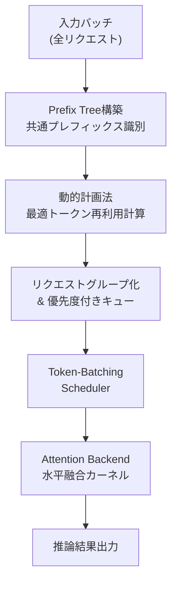

本記事は [BatchLLM: Optimizing Large Batched LLM Inference with Global Prefix Sharing and Throughput-oriented Token Batching](https://arxiv.org/abs/2412.03594) の解説記事です。

## 論文概要（Abstract）

Zhengらは、大規模バッチLLM推論においてプロンプト間で共有されるプレフィックスを明示的に識別し、スループットを最大化するシステム**BatchLLM**を提案している。既存のvLLMやSGLangはストリーミングリクエスト向けに最適化されており、LRUベースの暗黙的キャッシュ管理ではバッチ全体の情報を活用できず、再利用予定のKVコンテキストが早期に退避される問題がある。BatchLLMはグローバルなプレフィックス識別、デコーディング長比率に基づくリクエスト並び替え、メモリ中心のトークンバッチングを統合し、vLLMおよびSGLang比で1.3倍から10.8倍の高速化を達成したと報告している（arXiv:2412.03594v3, Section 5）。

この記事は [Zenn記事: vLLMのPrefix CachingとContinuous Batchingで文書要約APIのP95レイテンシを半減する](https://zenn.dev/0h_n0/articles/7e3c8355db3417) の深掘りです。

## 情報源

- **arXiv ID**: 2412.03594
- **URL**: [arXiv:2412.03594](https://arxiv.org/abs/2412.03594)
- **著者**: Zhen Zheng, Xin Ji, Taosong Fang, Fanghao Zhou, Chuanjie Liu, Gang Peng
- **所属**: Microsoft
- **発表**: MLSys 2026（採択済み）
- **分野**: cs.CL, cs.AI, cs.DC, cs.LG
- **コード**: [github.com/microsoft/MixLLM/tree/batchllm_vllm_064](https://github.com/microsoft/MixLLM/tree/batchllm_vllm_064)

## 背景と動機（Background & Motivation）

### バッチ推論とストリーミング推論の乖離

LLMの産業応用では、広告文生成や文書要約といった大規模バッチ処理タスクが増加している。これらのタスクでは全体のスループットが重要であり、同一のシステムプロンプトがリクエスト間で共有される特性を持つ。

しかし、vLLMやSGLangはオンラインサービング向けに設計されている。著者らは既存手法の問題を以下の3点に整理している。

1. **LRUキャッシュの限界**: 暗黙的なキャッシュ管理ではバッチ全体のプレフィックス構造を把握できず、再利用予定のKVコンテキストが早期に退避される。共有度16・プレフィックス長16,000トークンの設定でvLLMのKV再利用率は6.3%にとどまる（Figure 9）
2. **GPU使用率の谷間**: 固定リクエスト数上限（vLLMデフォルト256）によるトークンバッチ制御では、デコーディング主体のイテレーションでGPU使用率が低下する
3. **カーネルオーバーヘッド**: プレフィックスとディスティンクト部分のアテンション計算を別カーネルで実行するオーバーヘッドが無視できない

## 主要な貢献（Key Contributions）

著者らは以下の3つの貢献を主張している。

- **Global Prefix Sharing**: 動的計画法ベースのアルゴリズムで全リクエスト間の共通プレフィックスを明示的に識別し、同一プレフィックスを共有するリクエストをグループ化してスケジューリングする。計算量は$O(nc^2)$（$n$: ノード数、$c$: 平均子ノード数）で、実運用環境では全体の処理時間の0.01%未満と報告されている
- **Request Reordering**: デコード長/プレフィックス長の比率に基づいてリクエストの処理順序を最適化し、長いプロンプトを後から混合することでGPU利用率の谷間を削減する
- **Memory-Centric Token Batching**: 固定リクエスト数ではなくKVメモリ使用量を制約としてトークンバッチサイズを動的に決定し、OpenAI Tritonベースの水平融合カーネルでアテンション計算のオーバーヘッドを削減する

## 技術的詳細（Technical Details）

### 全体アーキテクチャ

BatchLLMはvLLM v0.6.4をベースに、Token-Batching SchedulerとAttention Backendの2つのモジュールを追加する構成である。



### Global Prefix Sharing: 動的計画法によるプレフィックス識別

BatchLLMは全リクエストのトークン列からTrie（プレフィックスツリー）を構築し、動的計画法でトークン再利用を最大化する最適なプレフィックス分割を求める。

核心は多段のプレフィックス階層を単一レベルに圧縮する判定条件にある。子ノード$c$と孫ノード$g$について以下の条件でマージを実行する。

$$
(\text{leaves}(g) - 1) \times \text{tokens}(g) > \text{tokens}(c)
$$

ここで、
- $\text{leaves}(g)$: 孫ノード$g$配下のリーフ（リクエスト）数
- $\text{tokens}(g)$: 孫ノード$g$のトークン数
- $\text{tokens}(c)$: 子ノード$c$のトークン数

この圧縮によりカーネル起動回数が削減される。著者らの実験では多段プレフィックスでのトークン削減率56%に対し、単一レベル圧縮後は55%と1%の損失でカーネルオーバーヘッドを大幅削減したと報告している。

トークン削減率は以下の式で定義される。

$$
R_{\text{saving}} = \left(1 - \frac{N_{\text{processed}}}{N_{\text{logical}}}\right) \times 100
$$

- $N_{\text{processed}}$: プレフィックス共有後の実際に処理されるプリフィルトークン数
- $N_{\text{logical}}$: 共有なしの場合の論理的なプリフィルトークン総数

### Request Reordering: デコード/プリフィル比率によるスケジューリング

リクエストの処理順序はスループットに大きく影響する。BatchLLMは以下の比率$R$で各リクエストの優先度を決定する。

$$
R = \frac{L_{\text{decode}}}{L_{\text{prefill}}}
$$

- $L_{\text{decode}}$: デコーディング長（出力トークン数）
- $L_{\text{prefill}}$: プリフィル長（入力トークン数）

出力長は事前に不明であるため$L_{\text{decode}} = 1$と正規化する。グループ優先度は以下の式で計算する。

$$
R_{\text{group}} = \frac{1}{L_{\text{prefix}} + \sum L_{\text{distinct}}}
$$

- $L_{\text{prefix}}$: グループ共通プレフィックスのトークン数
- $L_{\text{distinct}}$: 各リクエスト固有部分のトークン数の合計

$R_{\text{group}}$が大きいグループを先に処理し、デコーディング主体のイテレーションに長いプロンプトのプリフィルチャンクを混合してGPU使用率の谷間を埋める。

### Memory-Centric Token Batching

vLLMはリクエスト数256をデフォルト上限としてバッチサイズを制御する。BatchLLMはKVメモリ使用量を直接制約として用いる。

```python
def should_add_prefill_chunk(
    current_kv_memory: float,
    memory_threshold: float,
    chunk_size: int,
    kv_per_token: float,
) -> bool:
    """プリフィルチャンクを現在のバッチに追加可能か判定する.

    Args:
        current_kv_memory: 現在のKVキャッシュメモリ使用量（GB）
        memory_threshold: KVメモリ上限閾値（GB）
        chunk_size: プリフィルチャンクのトークン数
        kv_per_token: 1トークンあたりのKVキャッシュメモリ（GB）

    Returns:
        チャンク追加が可能であればTrue
    """
    required = chunk_size * kv_per_token
    return (current_kv_memory + required) <= memory_threshold
```

3つのトークンキューを優先度順に管理する。

1. **デコーディングキュー**（最高優先度）: アクティブなリクエストのデコーディングトークン
2. **ディスティンクトプロンプトキュー**: 各リクエスト固有のプロンプト部分
3. **共通プレフィックスキュー**（最低優先度）: グループ共通のプレフィックス部分

デコーディングトークンを最優先で処理することで、完了リクエストのKVキャッシュメモリが早期に解放され、新たなプリフィルチャンクの混合が可能になる。

### Attention Backend: 水平融合カーネル

プレフィックスとディスティンクト部分のアテンション計算を単一カーネルで実行する水平融合を実装している。OpenAI Tritonのオートチューニングを活用し、FlashAttention v2.6.1およびFlashInfer Cascade v0.1.4と同等以上の性能を達成したと報告されている（Figure 11）。

## 実装のポイント（Implementation）

BatchLLMの実装はvLLM v0.6.4をベースとしており、以下の点が実務上重要である。

- **プレフィックスツリーの構築コスト**: 全リクエストのトークン列からTrieを構築する前処理が必要だが、動的計画法を含めても全体処理時間の0.01%未満と報告されている。バッチサイズ数万レベルでも実用的なオーバーヘッドに収まる
- **量子化との併用**: 4-bit GPTQ量子化モデルでの動作が確認されている
- **ハードウェア対応**: NVIDIA A100（CUDA 12.1）とAMD MI200（ROCm 6.1）の両方をサポート。Tritonベースのカーネルによりベンダー非依存
- **既存システムとの統合**: vLLMのプラガブルなアーキテクチャを活用し、2モジュールのみの変更で実装。フォールバック互換性も維持
- **制約事項**: 個々のリクエストレイテンシの最適化は行っておらず、レイテンシクリティカルなオンラインサービングには不向き

## Production Deployment Guide

### AWS実装パターン（コスト最適化重視）

BatchLLMはバッチ推論特化のシステムであるため、オンデマンド処理ではなくバッチジョブとしてのデプロイが適している。以下、トラフィック量別の推奨構成を示す。なお、コスト試算は2026年9月時点のAWS ap-northeast-1（東京）リージョン料金に基づく概算値であり、実際のコストはトラフィックパターンやバースト使用量により変動する。最新料金はAWS料金計算ツールで確認を推奨する。

| 構成 | トラフィック | サービス構成 | 月額概算 |
|------|-------------|-------------|---------|
| Small | ~100 req/日 | Lambda + Bedrock Batch API | $50-150 |
| Medium | ~1,000 req/日 | ECS Fargate + S3 + SQS | $300-800 |
| Large | 10,000+ req/日 | EKS + Spot g5.xlarge + Karpenter | $2,000-5,000 |

**Small構成**: Bedrock Batch APIを活用し、Lambda関数でジョブ投入・結果取得を管理する。Batch APIはオンデマンド比50%削減、Prompt Cachingで30-90%削減が可能。

**Medium構成**: ECS Fargateタスクでvllm + BatchLLMコンテナを起動し、SQSキューからバッチジョブを取得する。Fargate Spotで最大70%削減。

**Large構成**: EKS上でKarpenterによるSpot Instances優先のオートスケーリングを構成する。g5.xlarge Spot価格は$0.35/h程度でオンデマンド比約70%削減。

### Terraformインフラコード

**Small構成（Serverless）**:

```hcl
# BatchLLM Small構成: Lambda + Bedrock Batch API
# 月額$50-150（~100 req/日想定）

resource "aws_iam_role" "batch_llm_lambda" {
  name = "batch-llm-lambda-role"
  assume_role_policy = jsonencode({
    Version = "2012-10-17"
    Statement = [{
      Action = "sts:AssumeRole"
      Effect = "Allow"
      Principal = { Service = "lambda.amazonaws.com" }
    }]
  })
}

resource "aws_iam_role_policy" "bedrock_access" {
  name = "bedrock-batch-access"
  role = aws_iam_role.batch_llm_lambda.id
  policy = jsonencode({
    Version = "2012-10-17"
    Statement = [{
      Effect   = "Allow"
      Action   = ["bedrock:CreateModelInvocationJob", "bedrock:GetModelInvocationJob"]
      Resource = "*"
    }, {
      Effect = "Allow"
      Action = ["s3:GetObject", "s3:PutObject"]
      Resource = "arn:aws:s3:::batch-llm-*/*"
    }]
  })
}

resource "aws_lambda_function" "batch_processor" {
  function_name = "batch-llm-processor"
  runtime       = "python3.12"
  handler       = "handler.main"
  role          = aws_iam_role.batch_llm_lambda.arn
  timeout       = 900  # Batch API呼び出し + ポーリング
  memory_size   = 256  # SDK操作のみのため最小限

  environment {
    variables = {
      BATCH_BUCKET = aws_s3_bucket.batch_io.id
      MODEL_ID     = "anthropic.claude-sonnet-4-20250514"
    }
  }
}

# コスト監視: 日次$10超過でアラート
resource "aws_budgets_budget" "batch_llm" {
  name         = "batch-llm-daily"
  budget_type  = "COST"
  limit_amount = "10"
  limit_unit   = "USD"
  time_unit    = "DAILY"
}
```

**Large構成（Container）**:

```hcl
# BatchLLM Large構成: EKS + Karpenter + Spot
# 月額$2,000-5,000（10,000+ req/日想定）

module "eks" {
  source          = "terraform-aws-modules/eks/aws"
  version         = "~> 20.0"
  cluster_name    = "batch-llm-cluster"
  cluster_version = "1.31"

  vpc_id     = module.vpc.vpc_id
  subnet_ids = module.vpc.private_subnets

  cluster_endpoint_public_access = false
}

# Karpenter: Spot優先でGPUノードを自動スケーリング
resource "kubectl_manifest" "karpenter_nodepool" {
  yaml_body = yamlencode({
    apiVersion = "karpenter.sh/v1"
    kind       = "NodePool"
    metadata   = { name = "batch-llm-gpu" }
    spec = {
      template.spec = {
        requirements = [
          { key = "karpenter.sh/capacity-type", operator = "In", values = ["spot", "on-demand"] },
          { key = "node.kubernetes.io/instance-type", operator = "In", values = ["g5.xlarge", "g5.2xlarge"] }
        ]
      }
      limits     = { "nvidia.com/gpu" = "8" }
      disruption = { consolidationPolicy = "WhenEmpty", consolidateAfter = "60s" }
    }
  })
}

# Cost Explorerアラート: 日次$200超過で通知
resource "aws_budgets_budget" "batch_llm_large" {
  name         = "batch-llm-large-daily"
  budget_type  = "COST"
  limit_amount = "200"
  limit_unit   = "USD"
  time_unit    = "DAILY"
  notification {
    comparison_operator       = "GREATER_THAN"
    threshold                 = 80
    threshold_type            = "PERCENTAGE"
    notification_type         = "ACTUAL"
    subscriber_sns_topic_arns = [aws_sns_topic.cost_alert.arn]
  }
}
```

### 運用・監視設定

**CloudWatch Logs Insights クエリ**（コスト異常検知）:

```
fields @timestamp, @message | filter @message like /token_count/
| stats sum(input_tokens) as total_input, sum(output_tokens) as total_output by bin(1h)
```

**CloudWatch アラーム設定**:

```python
import boto3

def create_batch_llm_alarms(cloudwatch: boto3.client) -> None:
    """BatchLLMバッチジョブの監視アラームを作成する.

    Args:
        cloudwatch: CloudWatch boto3クライアント
    """
    # GPUメモリ使用率90%超過アラーム
    cloudwatch.put_metric_alarm(
        AlarmName="batch-llm-gpu-memory-high",
        MetricName="gpu_memory_used_percent",
        Namespace="BatchLLM",
        Statistic="Maximum",
        Period=300,
        EvaluationPeriods=2,
        Threshold=90.0,
        ComparisonOperator="GreaterThanThreshold",
        AlarmActions=["arn:aws:sns:ap-northeast-1:ACCOUNT:batch-llm-alerts"],
    )
```

**X-Ray トレーシング設定**:

```python
from aws_xray_sdk.core import xray_recorder, patch_all

def setup_xray_tracing() -> None:
    """X-Rayトレーシングの初期化とboto3自動計装を行う."""
    xray_recorder.configure(service="batch-llm-inference")
    patch_all()  # boto3, requests等を自動計装
```

**Cost Explorer日次レポート**:

```python
import boto3
from datetime import date, timedelta

def get_daily_cost_report(ce: boto3.client) -> dict[str, float]:
    """前日のサービス別コストを取得する.

    Args:
        ce: Cost Explorer boto3クライアント

    Returns:
        サービス名をキー、USD金額を値とする辞書
    """
    yesterday = (date.today() - timedelta(days=1)).isoformat()
    response = ce.get_cost_and_usage(
        TimePeriod={"Start": yesterday, "End": date.today().isoformat()},
        Granularity="DAILY", Metrics=["UnblendedCost"],
        GroupBy=[{"Type": "DIMENSION", "Key": "SERVICE"}],
    )
    return {g["Keys"][0]: float(g["Metrics"]["UnblendedCost"]["Amount"])
            for r in response["ResultsByTime"] for g in r["Groups"]}
```

### コスト最適化チェックリスト

**アーキテクチャ選択**:
- [ ] トラフィック量に応じた構成を選定（~100 req/日: Serverless、~1,000: Hybrid、10,000+: Container）
- [ ] バッチ処理のため常時起動を避け、ジョブ完了後にリソースを解放する設計

**リソース最適化**:
- [ ] EC2/EKS: Spot Instances優先（g5.xlarge Spotで約70%削減）
- [ ] Reserved Instances: 1年コミットで最大40%削減
- [ ] Savings Plans: Compute Savings Plansの検討
- [ ] Lambda: メモリサイズ最適化（SDK操作のみなら256MB）
- [ ] ECS/EKS: Karpenter consolidationPolicy=WhenEmptyでアイドルノード即座に削除

**LLMコスト削減**:
- [ ] Bedrock Batch API使用で50%削減
- [ ] Prompt Caching有効化で30-90%削減（プレフィックス共有と相性良好）
- [ ] モデル選択ロジック（タスク複雑度に応じてHaiku/Sonnet/Opus切り替え）
- [ ] トークン数制限（max_tokensの適切な設定）
- [ ] BatchLLMのGlobal Prefix Sharingによる計算量削減

**監視・アラート**:
- [ ] AWS Budgets設定（日次・月次）
- [ ] CloudWatchアラーム（GPU使用率、ジョブ失敗率）
- [ ] Cost Anomaly Detection有効化
- [ ] 日次コストレポート自動送信（SNS経由）

**リソース管理**:
- [ ] 未使用EBSボリューム・スナップショット削除
- [ ] タグ戦略（Environment, Project, CostCenterタグ必須）
- [ ] S3ライフサイクルポリシー（中間結果は7日で削除）
- [ ] 開発環境の夜間・週末自動停止
- [ ] ECRイメージのライフサイクルポリシー（最新5世代のみ保持）

## 実験結果（Results）

### マイクロベンチマーク

著者らはNVIDIA A100（80GB）およびAMD MI200上で、Llama 3.1（8B, 70B）、Qwen 2.5（7B, 14B）の4モデルを評価している。

**共有度とプレフィックス長による性能変化**（Figure 7より）:

| 共有度 | プレフィックス長 | vLLM比高速化率 |
|--------|----------------|---------------|
| 2 | 2,000 | 1.7倍 |
| 8 | 8,000 | 4.1倍 |
| 16 | 16,000 | 10.8倍 |

プレフィックスの共有度と長さが増加するほど高速化率が向上する傾向が確認されている。

### 産業ワークロード評価

広告スニペット生成タスク（ドキュメント-クエリペア処理、平均共有度3、平均共通プレフィックス1,570トークン）での結果（Table 1より）:

| ハードウェア | BatchLLM | vLLM最良構成 | 高速化率 |
|-------------|----------|-------------|---------|
| A100 | 8.67 req/s | 6.71 req/s | 1.30倍 |
| MI200 | 4.24 req/s | 3.36 req/s | 1.26倍 |

### Heavy-Tailデコーディングワークロード

出力長がPareto分布（$\alpha = 1.5$、範囲10-512トークン）に従うワークロードでの評価（Table 2より）:

- 平均出力長: 51.2トークン、P50: 25トークン、P99: 509トークン
- BatchLLM: 17.02 req/s vs. vLLM: 5.26 req/s = **3.2倍の高速化**

P99/P50比が20.3倍と裾の重い分布において、Request Reorderingの効果が顕著に表れている。

### KV再利用率の比較

KV再利用率（Figure 9より）では、高共有度でBatchLLMが85.2%を達成する一方、vLLMは40.1%にとどまる。プレフィックス長16,000・共有度16ではBatchLLM 92.6%に対しvLLM 6.3%と15倍近い差が生じている。

## 実運用への応用（Practical Applications）

BatchLLMの手法はZenn記事で扱った文書要約APIのようなプレフィックス共有型バッチ処理と親和性が高い。

- **文書要約バッチ**: 同一のシステムプロンプトを共有する数千件の文書要約リクエストをバッチ処理する場合、Global Prefix Sharingにより計算量を大幅に削減できる
- **広告文生成**: 同一商品カテゴリのテンプレートをプレフィックスとして共有し、個別の商品情報のみをディスティンクト部分として処理するパターン
- **RAG前処理**: 同一ドキュメントコーパスに対する複数クエリのバッチ処理

**注意点**: BatchLLMはバッチ全体のスループットを最適化するシステムであり、リアルタイム応答が求められるチャットボット等には従来のストリーミングモードが適している。プレフィックス共有がないワークロードでは性能向上が限定的である。

## 関連研究（Related Work）

- **PagedAttention (vLLM, Kwon et al., 2023)**: KVキャッシュをページ単位で管理しメモリ断片化を解消した。BatchLLMはこのPagedAttentionをベースにバッチ全体でのプレフィックス最適化を追加している
- **RadixAttention (SGLang, Zheng et al., 2024)**: Radixツリーによるプレフィックスキャッシュ管理を提案。ランタイムでの暗黙的キャッシュである点がBatchLLMの明示的アプローチと異なる
- **Orca (Yu et al., 2022)**: Continuous Batchingを提案しLLM推論のスループットを改善した。BatchLLMのToken Batchingはこの概念の拡張である
- **Hydragen (Juravsky et al., 2024)**: プレフィックスとサフィックスのアテンション計算を分離するカーネルを提案。BatchLLMは分離ではなく統合によりオーバーヘッドを削減する

## まとめと今後の展望

BatchLLMは、大規模バッチLLM推論においてグローバルなプレフィックス共有、リクエスト並び替え、メモリ中心のトークンバッチングの3つの手法を統合し、vLLM比で最大10.8倍の高速化を達成したシステムである。特にプレフィックス共有度が高いワークロードでの効果が顕著であり、産業ワークロードでも1.3倍の安定した改善が確認されている。

著者らは今後の方向性として、ストリーミングモードとバッチモードをキュー深度やプレフィックス共有率に応じて動的に切り替えるハイブリッドアーキテクチャの構築を提案している。

## 参考文献

- **arXiv**: [https://arxiv.org/abs/2412.03594](https://arxiv.org/abs/2412.03594)
- **Code**: [github.com/microsoft/MixLLM/tree/batchllm_vllm_064](https://github.com/microsoft/MixLLM/tree/batchllm_vllm_064)
- **Related Zenn article**: [https://zenn.dev/0h_n0/articles/7e3c8355db3417](https://zenn.dev/0h_n0/articles/7e3c8355db3417)
