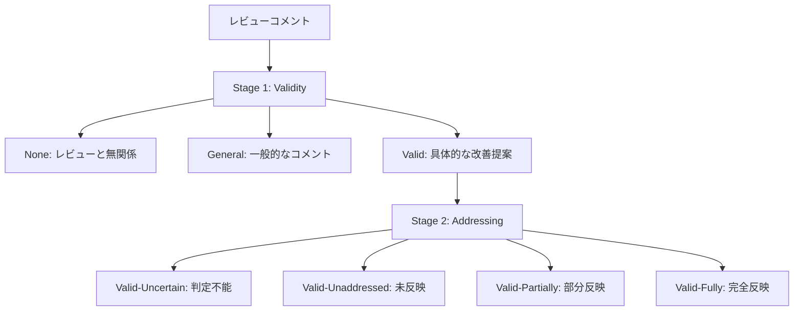
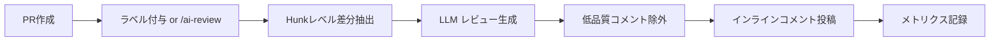

本記事は [Does AI Code Review Lead to Code Changes? A Case Study of GitHub Actions](https://arxiv.org/abs/2508.18771) の解説記事です。

## 論文概要

AIコードレビューツールはPull Requestに対して自動でレビューコメントを生成し、コード品質の向上を目指すものである。しかし、これらのコメントが実際にコード変更につながっているかどうかは十分に検証されていなかった。著者らは、GitHub Actions上の16種のAIコードレビューツールを対象に、178リポジトリ・22,326件のレビューコメントを分析し、ツールの採用状況・有効性・成功要因を体系的に調査したと報告している。

主な知見として、hunkレベルのレビューツール（6.5%--19.2%）がfileレベル（0.9%--4.2%）より高いaddressing rateを示すこと、手動トリガーが自動トリガーより有効であること、コードスニペットを含むコメントほど反映されやすいことが明らかになった。一方で、人間レビューのaddressing rate（60%）と比較すると依然として大きな差があることも示されている。

この記事は [Zenn記事: Fable 5.1×プロンプトキャッシュでモノレポPRレビューコスト75%削減](https://zenn.dev/0h_n0/articles/7bfc9a6bf7c6ae) の深掘りです。

## 情報源

- **arXiv ID**: 2508.18771
- **URL**: [https://arxiv.org/abs/2508.18771](https://arxiv.org/abs/2508.18771)
- **著者**: Kexin Sun, Hongyu Kuang, Sebastian Baltes, Xin Zhou, He Zhang, Xiaoxing Ma, Guoping Rong, Dong Shao, Christoph Treude
- **初版**: 2025年8月26日（v2: 2026年4月25日）
- **分野**: cs.SE（Software Engineering）

## 背景と動機

AIを活用したコードレビューツールの普及が進んでいる。GitHub Marketplaceには多数のAIコードレビューActionが公開されており、開発者はワークフロー定義ファイルに数行追加するだけでPRへの自動レビューを導入できる。しかし、こうしたツールが生成するコメントが実際にコード変更を促しているかどうかについて、大規模な実証研究は限られていた。

先行研究として、Li et al.（2024）はCodeRabbitやChatGPT-CodeReviewなどの個別ツールの精度評価を行っているが、ツール横断的な比較や、コメントが実際に反映されたかという「addressing」の観点での分析は行われていなかった。また、Tufano et al.（2024）はAIレビューコメントの有用性を調査しているものの、GitHub Actionsエコシステム全体を対象とした研究は存在しなかった。

著者らは以下の3つのリサーチクエスチョン（RQ）を設定している。

- **RQ1**: AIコードレビューアクションはどのように採用されているか？
- **RQ2**: AIコードレビューアクションはどの程度有効か？
- **RQ3**: AIコードレビューコメントの反映を左右する要因は何か？

## 主要な貢献

1. **大規模実証データセット**: 16種のGitHub Actionsベースレビューツールから178リポジトリ・22,326件のコメントを収集し、採用パターンと有効性を定量的に評価した
2. **2段階LLM支援フレームワーク**: コメントの妥当性判定（Stage 1）と反映判定（Stage 2）を分離した評価手法を構築し、人手アノテーションとのCohen's $\kappa$ = 0.674--0.764の一致度を達成した
3. **解釈可能な機械学習分析**: 36特徴量を用いたRandom Forestモデル（全体精度97%）とSHAP分析により、addressing rateに影響する要因を定量的に特定した
4. **実務への提言**: hunkレベルの粒度設計、手動トリガー、コードスニペット付きコメント、新規コントリビュータへのターゲティングなど、具体的な設計指針を提示した

## 技術的詳細

### 2段階LLM支援分類フレームワーク

著者らは、レビューコメントの有効性を評価するために2段階の分類フレームワークを設計している。



**Stage 1（Validity分類）**: コメントを3カテゴリに分類する。"None"はボット設定メッセージなどレビューと無関係なもの、"General"は一般的な称賛や要約、"Valid"は具体的なコード変更を示唆するものである。著者らは150件のサンプルで人手アノテーションを行い、Cohen's $\kappa$ = 0.674--0.764の評価者間一致度を得たと報告している。

**Stage 2（Addressing分類）**: "Valid"と判定されたコメントに対し、後続のコミット差分を参照して4段階で反映度を評価する。"Valid-Fully"は提案が完全に反映されたケース、"Valid-Partially"は部分的な反映、"Valid-Unaddressed"は未反映、"Valid-Uncertain"は判定困難なケースである。

最適なLLMの組み合わせとして、Stage 1にGPT-4.1（94.5%精度）、Stage 2にo3-mini（92.4%精度）を使用した場合に全体91.5%の精度を達成したと著者らは報告している。最終的に5,652件のコメントに対するフル分類では、97%の全体精度を確認している。

### 36特徴量による要因分析

著者らは、コメントの反映に影響する要因を4つのカテゴリ・36特徴量で分析している。

| カテゴリ | 特徴量数 | 主な特徴量 |
|---------|---------|-----------|
| Source（情報源） | 10 | Is_Human, Is_File_Level_Action, Trigger_auto/manual |
| Repository（リポジトリ） | 3 | Repo_File_Size, Repo_Issue_Count, Repo_Contributor_Count |
| Modification（変更） | 12 | Author_Prior_Commits, Commit_Del, File_Add/Del |
| Comment（コメント） | 11 | Code_Text_Ratio, Text_Length, LDA_Topic_0--5 |

### Random Forest + SHAP解析

5分割交差検証によるRandom Forestモデルは、全体精度88.6%（Macro-F1: 0.846）を達成した。AI固有モデルでは91.7%の精度を示している。SHAP（SHapley Additive exPlanations）分析により、各特徴量の寄与度と方向性が明らかになっている。

上位10特徴量（全体モデル）は以下の通りである（論文Table XI, Section V-A）。

| 順位 | 特徴量 | SHAP重要度 | 方向性 $\rho$ |
|------|-------|-----------|-------------|
| 1 | Is_Human | 0.0449 | +0.99 |
| 2 | Trigger_auto | 0.0410 | -0.96 |
| 3 | Is_File_Level_Action | 0.0346 | -0.95 |
| 4 | Author_Prior_Commits | 0.0235 | -0.69 |
| 5 | Repo_File_Size | 0.0184 | +0.70 |
| 6 | Code_Text_Ratio | 0.0155 | +0.89 |
| 7 | Text_Length | 0.0133 | -0.24 |
| 8 | LDA_Topic_2 | 0.0116 | +0.50 |
| 9 | Commit_Del | 0.0105 | -0.15 |
| 10 | LDA_Topic_1 | 0.0102 | +0.41 |

$\rho$ が正の値は「その特徴量が大きいほどaddressingされやすい」ことを意味する。Is_Human（$\rho$ = +0.99）が最も強い正の影響を持ち、Trigger_auto（$\rho$ = -0.96）とIs_File_Level_Action（$\rho$ = -0.95）は強い負の影響を持つ。Code_Text_Ratio（$\rho$ = +0.89）はコメント内のコードスニペット比率が高いほど反映されやすいことを示している。

### LDAトピックモデリング

著者らはレビューコメントのテキストに対してLDA（Latent Dirichlet Allocation）を適用し、6つのトピックを抽出している（論文Section V-A）。

- Topic 0: 依存関係バージョン更新と互換性
- Topic 1: UI/UXとアクセシビリティ改善（$\rho$ = +0.41）
- Topic 2: 並行制御とロック堅牢性（$\rho$ = +0.50）
- Topic 3: モジュールインポート最適化
- Topic 4: 変数命名とコード可読性
- Topic 5: エラーハンドリングとコードドキュメンテーション（AI固有モデルで$\rho$ = +0.58）

エラーハンドリングやドキュメンテーションに関するコメントが最もaddressingされやすいという結果は、AIレビューが「防御的プログラミング」の指摘に適していることを示唆している。

## 実装のポイント

### Hunkレベル設計の優位性

著者らの分析では、コメントの粒度がaddressing rateに決定的な影響を与えることが示されている。hunkレベル（差分の具体的な行範囲に紐づくインラインコメント）のツールは6.5%--19.2%のaddressing rateを達成したのに対し、fileレベル（ファイル全体に対するコメント）のツールは0.9%--4.2%に留まった（論文Table IX, Section IV-B）。

この差は、hunkレベルのコメントが具体的なコード行を指し示し、開発者が何を修正すべきか即座に理解できるためだと著者らは考察している。SHAP分析でもIs_File_Level_Actionの$\rho$ = -0.95は、fileレベルが強い負の影響を持つことを裏付けている。

### 手動トリガーの有効性

自動トリガー（PR作成時に毎回実行）と手動トリガー（開発者が明示的に起動）を比較した場合、手動トリガーの方がaddressing rateが高いことが示されている。anc95/ChatGPT-CodeReviewでは自動6.8%に対し手動12.8%（$p \leq 0.05$）、mattzcarey/code-review-gptでは自動0.5%に対し手動22.2%（$p \leq 0.05$）と報告されている（論文Table XIII, Section V-B）。

SHAP分析でもTrigger_autoの$\rho$ = -0.96であり、自動トリガーが反映率を下げる方向に強く作用している。著者らは、自動トリガーによる「通知疲れ」（notification fatigue）が原因の一つと考察している。

### LLMモデル選択の影響

13/16のツールがOpenAIモデルを使用しており、GPT-3.5系とGPT-4系でaddressing rateに有意差がある。GPT-3.5は5.4%、GPT-4は12.6%であり、統計的に有意（$p \leq 0.05$）である（論文Table XIV, Section V-B）。

## Production Deployment Guide

AIコードレビューツールの実運用パイプラインを構築する際の設計指針と実装パターンを示す。以下のコスト試算は2026年9月時点の料金に基づく概算値であり、実際のコストはリポジトリ規模やPR頻度により変動する。

### GitHub Actionsワークフロー設計

論文の知見に基づき、hunkレベル・手動トリガー・コードスニペット付きという3つの要件を満たすワークフローを設計する。

```yaml
# .github/workflows/ai-review.yml
# hunkレベルレビュー + 手動トリガー設計
name: AI Code Review

on:
  # 手動トリガー: 論文の知見に基づく（auto 6.8% vs manual 12.8%）
  pull_request_review:
    types: [submitted]
  # ラベルベーストリガー: 開発者の意図的なレビュー要求
  pull_request:
    types: [labeled]

permissions:
  contents: read
  pull-requests: write

jobs:
  ai-review:
    if: >
      (github.event_name == 'pull_request' &&
       contains(github.event.pull_request.labels.*.name, 'ai-review')) ||
      (github.event_name == 'pull_request_review' &&
       github.event.review.body == '/ai-review')
    runs-on: ubuntu-latest
    timeout-minutes: 15
    steps:
      - uses: actions/checkout@v4
        with:
          fetch-depth: 0
      - name: AI Hunk-Level Review
        uses: coderabbitai/ai-pr-reviewer@v1
        with:
          review_level: "hunk"  # fileレベルではなくhunkレベル
          include_code_suggestions: true  # code-to-text ratio向上
          max_comment_length: 300  # 簡潔なコメント
```

### レビューコメント品質評価パイプライン

論文の2段階フレームワークを参考に、レビューコメントの品質を自動評価するシステムを実装する。

```python
"""AIレビューコメントの品質評価パイプライン

論文の2段階LLMフレームワーク（Stage 1: Validity, Stage 2: Addressing）を
簡略化した品質メトリクス収集システム。
"""

from __future__ import annotations

import json
import re
from dataclasses import dataclass, field
from enum import Enum
from typing import Any


class CommentValidity(Enum):
    """Stage 1: コメントの妥当性分類（論文Section III-B）"""

    NONE = "none"  # レビューと無関係
    GENERAL = "general"  # 一般的なコメント
    VALID = "valid"  # 具体的な改善提案


class AddressingStatus(Enum):
    """Stage 2: コメント反映状況の分類（論文Section III-B）"""

    UNCERTAIN = "uncertain"
    UNADDRESSED = "unaddressed"
    PARTIALLY = "partially"
    FULLY = "fully"


@dataclass
class ReviewComment:
    """レビューコメントのデータモデル

    Attributes:
        body: コメント本文
        path: 対象ファイルパス
        line: 対象行番号（hunkレベルの場合）
        is_inline: インラインコメントか否か
    """

    body: str
    path: str | None = None
    line: int | None = None
    is_inline: bool = False

    @property
    def code_text_ratio(self) -> float:
        """コメント内のコード比率を計算する

        論文のCode_Text_Ratio特徴量に対応。
        比率>0.5で23.2%のaddressing rate（Table XV）。

        Returns:
            コード文字数 / 全文字数の比率
        """
        code_blocks = re.findall(
            r"```[\s\S]*?```|`[^`]+`", self.body
        )
        code_chars = sum(len(block) for block in code_blocks)
        total_chars = len(self.body)
        if total_chars == 0:
            return 0.0
        return code_chars / total_chars

    @property
    def text_length(self) -> int:
        """コメントのテキスト長を返す"""
        return len(self.body)


@dataclass
class ReviewMetrics:
    """レビューセッション全体のメトリクス

    Attributes:
        total_comments: 総コメント数
        valid_comments: Valid判定されたコメント数
        addressed_comments: 反映されたコメント数
        comment_details: 個別コメントの詳細
    """

    total_comments: int = 0
    valid_comments: int = 0
    addressed_comments: int = 0
    comment_details: list[dict[str, Any]] = field(
        default_factory=list
    )

    @property
    def validity_rate(self) -> float:
        """Valid率を返す"""
        if self.total_comments == 0:
            return 0.0
        return self.valid_comments / self.total_comments

    @property
    def addressing_rate(self) -> float:
        """Addressing rateを返す

        論文の定義: addressed / valid comments
        hunkレベルツールの目標: 19.2%（coderabbitai相当）
        """
        if self.valid_comments == 0:
            return 0.0
        return self.addressed_comments / self.valid_comments

    def to_json(self) -> str:
        """構造化JSONログとして出力する"""
        return json.dumps(
            {
                "event": "review_metrics",
                "total_comments": self.total_comments,
                "valid_comments": self.valid_comments,
                "addressed_comments": self.addressed_comments,
                "validity_rate": round(self.validity_rate, 4),
                "addressing_rate": round(self.addressing_rate, 4),
            },
            ensure_ascii=False,
        )


def classify_comment_validity(
    comment: ReviewComment,
) -> CommentValidity:
    """コメントの妥当性を簡易分類する

    論文のStage 1を簡略化したルールベース実装。
    本番環境ではLLM（GPT-4.1推奨、94.5%精度）を使用する。

    Args:
        comment: 評価対象のレビューコメント

    Returns:
        コメントの妥当性分類
    """
    body_lower = comment.body.lower()

    # None: ボット設定メッセージ等
    none_patterns = [
        "configuration",
        "setup complete",
        "bot activated",
    ]
    if any(p in body_lower for p in none_patterns):
        return CommentValidity.NONE

    # General: 称賛・要約
    general_patterns = [
        "looks good",
        "lgtm",
        "nice work",
        "summary",
    ]
    if any(p in body_lower for p in general_patterns):
        return CommentValidity.GENERAL

    # Valid: 具体的な改善提案（コードスニペットやsuggestionを含む）
    if comment.is_inline or "```" in comment.body:
        return CommentValidity.VALID

    return CommentValidity.GENERAL


def evaluate_code_text_ratio(
    comment: ReviewComment,
) -> str:
    """コード比率に基づく品質評価

    論文Table XV: ratio>0.5で addressing 23.2%、
    ratio=0で addressing 4.2%

    Args:
        comment: 評価対象のレビューコメント

    Returns:
        品質評価の文字列
    """
    ratio = comment.code_text_ratio
    if ratio > 0.5:
        return "high_quality: コードスニペット豊富（期待addressing ~23.2%）"
    elif ratio > 0.26:
        return "medium_quality: コード含有あり（期待addressing ~10.5%）"
    else:
        return "low_quality: テキスト中心（期待addressing ~4.2-7.2%）"
```

### コントリビュータ経験値によるレビュー調整

論文の知見（新規コントリビュータ16.1% vs 経験者3.3%）に基づき、コントリビュータの経験値に応じてレビュー詳細度を調整する実装例を示す。

```python
"""コントリビュータ経験値に基づくレビュー戦略の調整

論文Table XVI: 新規コントリビュータ（≤30コミット）は16.1%、
経験者（>1,013コミット）は3.3%のaddressing rate。
経験値に応じてレビューの詳細度を変える戦略。
"""

from __future__ import annotations

from dataclasses import dataclass
from enum import Enum


class ExperienceLevel(Enum):
    """コントリビュータの経験レベル（論文Table XVI準拠）"""

    NEWCOMER = "newcomer"  # ≤30 commits: 16.1% addressing
    INTERMEDIATE = "intermediate"  # 31-319 commits
    EXPERIENCED = "experienced"  # 320-1013 commits: 4.5%
    EXPERT = "expert"  # >1013 commits: 3.3%


@dataclass
class ReviewStrategy:
    """経験レベルに応じたレビュー戦略

    Attributes:
        detail_level: コメントの詳細度（high/medium/low）
        include_explanation: 修正理由の説明を含めるか
        include_code_suggestion: コードスニペットを含めるか
        max_comments_per_pr: PR当たりの最大コメント数
    """

    detail_level: str
    include_explanation: bool
    include_code_suggestion: bool
    max_comments_per_pr: int


def get_experience_level(prior_commits: int) -> ExperienceLevel:
    """コミット数から経験レベルを判定する

    Args:
        prior_commits: リポジトリへの過去のコミット数

    Returns:
        経験レベルの分類
    """
    if prior_commits <= 30:
        return ExperienceLevel.NEWCOMER
    elif prior_commits <= 319:
        return ExperienceLevel.INTERMEDIATE
    elif prior_commits <= 1013:
        return ExperienceLevel.EXPERIENCED
    else:
        return ExperienceLevel.EXPERT


def get_review_strategy(level: ExperienceLevel) -> ReviewStrategy:
    """経験レベルに応じたレビュー戦略を返す

    新規コントリビュータには詳細な説明とコードスニペットを、
    経験者にはポイントを絞った簡潔なコメントを提供する。

    Args:
        level: コントリビュータの経験レベル

    Returns:
        レビュー戦略
    """
    strategies: dict[ExperienceLevel, ReviewStrategy] = {
        ExperienceLevel.NEWCOMER: ReviewStrategy(
            detail_level="high",
            include_explanation=True,
            include_code_suggestion=True,
            max_comments_per_pr=10,
        ),
        ExperienceLevel.INTERMEDIATE: ReviewStrategy(
            detail_level="medium",
            include_explanation=True,
            include_code_suggestion=True,
            max_comments_per_pr=8,
        ),
        ExperienceLevel.EXPERIENCED: ReviewStrategy(
            detail_level="low",
            include_explanation=False,
            include_code_suggestion=True,
            max_comments_per_pr=5,
        ),
        ExperienceLevel.EXPERT: ReviewStrategy(
            detail_level="low",
            include_explanation=False,
            include_code_suggestion=False,
            max_comments_per_pr=3,
        ),
    }
    return strategies[level]
```

### コスト試算

GitHub Actions上でAIコードレビューを運用する場合のコスト構造を示す。以下は2026年9月時点の概算であり、実際の費用はPR頻度・差分サイズ・モデル選択により変動する。

| 規模 | PR数/月 | 平均diff行数 | LLMモデル | LLMコスト/月 | Actions分/月 |
|------|--------|-------------|----------|------------|-------------|
| Small | ~50 | ~200行 | GPT-4.1 | $15-30 | ~50分 |
| Medium | ~200 | ~500行 | GPT-4.1 | $80-150 | ~200分 |
| Large | ~1,000 | ~300行 | GPT-4.1 + キャッシュ | $200-400 | ~500分 |

論文の知見によれば、GPT-4系はGPT-3.5系と比較してaddressing rateが2倍以上（12.6% vs 5.4%）であるため、コスト効率の観点からもGPT-4系の使用が推奨される。プロンプトキャッシュの活用により、同一リポジトリ内の類似パターンに対するレビューコストを削減できる。関連するZenn記事で解説しているプロンプトキャッシュ技術を組み合わせることで、モノレポ環境でのコストを抑制可能である。

### 運用監視ダッシュボード

レビューコメントの品質をモニタリングするためのメトリクス収集を実装する。

```python
"""AIレビュー品質のモニタリングメトリクス収集

GitHub APIからレビューコメントを取得し、
addressing rateとcode-to-text ratioを集計する。
"""

from __future__ import annotations

import json
import logging
from dataclasses import dataclass
from datetime import datetime, timezone

logger = logging.getLogger(__name__)


@dataclass
class DailyMetrics:
    """日次メトリクスの集計結果

    Attributes:
        date: 集計日
        total_prs: 対象PR数
        total_comments: AIコメント総数
        valid_comments: Valid判定数
        addressed_comments: 反映されたコメント数
        avg_code_text_ratio: 平均コード比率
        newcomer_addressing_rate: 新規コントリビュータの反映率
        expert_addressing_rate: 経験者の反映率
    """

    date: str
    total_prs: int
    total_comments: int
    valid_comments: int
    addressed_comments: int
    avg_code_text_ratio: float
    newcomer_addressing_rate: float
    expert_addressing_rate: float

    def to_structured_log(self) -> str:
        """構造化ログとして出力する"""
        return json.dumps(
            {
                "event": "daily_review_metrics",
                "level": "info",
                "ts": datetime.now(tz=timezone.utc).isoformat(),
                "date": self.date,
                "total_prs": self.total_prs,
                "total_comments": self.total_comments,
                "valid_comments": self.valid_comments,
                "addressed_comments": self.addressed_comments,
                "addressing_rate": round(
                    self.addressed_comments / max(self.valid_comments, 1),
                    4,
                ),
                "avg_code_text_ratio": round(
                    self.avg_code_text_ratio, 4
                ),
                "newcomer_addressing_rate": round(
                    self.newcomer_addressing_rate, 4
                ),
                "expert_addressing_rate": round(
                    self.expert_addressing_rate, 4
                ),
            },
            ensure_ascii=False,
        )

    def check_thresholds(self) -> list[str]:
        """メトリクスの閾値チェック

        論文のベンチマーク値に基づくアラート判定。
        coderabbitai/ai-pr-reviewerの19.2%を目標値とする。

        Returns:
            アラートメッセージのリスト
        """
        alerts: list[str] = []
        addressing_rate = self.addressed_comments / max(
            self.valid_comments, 1
        )

        # addressing rateが論文のhunkレベル下限（6.5%）を下回る場合
        if addressing_rate < 0.065:
            alerts.append(
                f"addressing_rate={addressing_rate:.1%} "
                "< 6.5%（hunkレベル下限）"
            )

        # code-to-text ratioが低い場合（論文: >0.5で23.2%）
        if self.avg_code_text_ratio < 0.26:
            alerts.append(
                f"avg_code_text_ratio={self.avg_code_text_ratio:.2f} "
                "< 0.26（コードスニペット不足）"
            )

        return alerts
```

## 実験結果

### ツール採用状況（RQ1）

著者らは、GitHub Marketplaceから16種のAIコードレビューActionを特定し、718リポジトリでの使用を確認した。このうち成熟基準（50PR以上）を満たした178リポジトリを分析対象としている（論文Table IV, Section IV-A）。

注目すべき知見として、37.1%のリポジトリがアクションを宣言しているにもかかわらず、生成されたコメントが0件であったと報告されている。これは設定のみ行い実際には稼働していないケースが多いことを示唆する。

4つの主要ツール（anc95/ChatGPT-CodeReview、mattzcarey/code-review-gpt、coderabbitai/ai-pr-reviewer、aidar-freeed/ai-codereviewer）が全コメントの98.9%を生成しており、極めて高い集中度を示している。

カスタマイズに関しては、82.6%のリポジトリが少なくとも1つのオプションパラメータを変更しており、平均4つの設定変更が行われている。最も頻繁に変更されるパラメータは「プロンプトコンテキスト拡張」（70.1%）と「LLM選択」（64.6%）であった。

### Addressing Rateの比較（RQ2）

| ツール種別 | Addressing Rate | 代表ツール |
|-----------|----------------|-----------|
| Hunkレベル | 6.5%--19.2% | coderabbitai/ai-pr-reviewer（19.2%） |
| Fileレベル | 0.9%--4.2% | anc95/ChatGPT-CodeReview（4.2%） |
| 人間レビュー | 60% | -- |

coderabbitai/ai-pr-reviewerが19.2%と最も高いaddressing rateを示した。これはhunkレベルの粒度、コードスニペット付きの提案、カスタマイズ性の高さが要因であると著者らは分析している。

### コード比率と経験値の影響（RQ3）

**Code-to-Text Ratio**（論文Table XV, Section V-B）:

| 比率範囲 | AI Addressing Rate | 人間 Addressing Rate |
|---------|-------------------|---------------------|
| 0（コードなし） | 4.2% | 71.2% |
| 0.00--0.11 | 7.2% | 65.6% |
| 0.11--0.26 | 5.7% | 75.8% |
| 0.26--0.52 | 10.5% | 78.5% |
| 0.52--1.00 | 23.2% | 89.9% |

コードスニペットの比率が0.5を超えると、AIコメントのaddressing rateは23.2%に達し、コードなしの場合（4.2%）の約5.5倍になる。

**コントリビュータ経験値**（論文Table XVI, Section V-B）:

| コミット数 | AI Addressing Rate | 人間 Addressing Rate |
|-----------|-------------------|---------------------|
| 0--30（新規） | 16.1% | 80.1% |
| 31--124 | 16.1% | 82.1% |
| 125--319 | 12.1% | 71.8% |
| 320--1,013 | 4.5% | 81.2% |
| 1,014--4,316（経験者） | 3.3% | 60.7% |

新規コントリビュータ（30コミット以下）は16.1%のaddressing rateを示すのに対し、経験者（1,013コミット超）は3.3%にとどまる。約5倍の差があり、AIレビューは特にプロジェクトに不慣れな開発者に対して有効であることが示唆される。人間レビューでは経験値による差が比較的小さいのとは対照的である。

### クローズされたPRにおける分析

マージされずクローズされたPRでは、AIコメントのaddressing rateはわずか3.0%であった。これは、開発者がPRを放棄した場合にはAIの提案も無視される傾向を示している。

## 実運用への応用

### AIコードレビューパイプラインの設計原則

本論文の知見を実運用に適用する際の設計原則を整理する。



**粒度設計**: fileレベルではなくhunkレベル（差分の具体的な行範囲）でレビューを行う。SHAP分析のIs_File_Level_Actionの$\rho$ = -0.95が示す通り、fileレベルはaddressingに強い負の影響を持つ。

**トリガー方式**: 自動トリガーではなく手動トリガー（ラベル付与やコマンド入力）を採用する。Trigger_autoの$\rho$ = -0.96が示す通り、自動実行は通知疲れを引き起こしaddressing rateを低下させる。

**コメント品質**: Code_Text_Ratioの$\rho$ = +0.89が示す通り、コードスニペットを含むコメントほど反映されやすい。マルチラインのコード提案をコピー&ペースト可能な形式で提示することが推奨される。

**ターゲティング**: 新規コントリビュータ（16.1%）は経験者（3.3%）の約5倍のaddressing rateを示す。新規メンバーへのオンボーディング支援としてAIレビューを位置づけることで、投資対効果を最大化できる。

**レビュー対象の選定**: LDAトピック分析の結果、エラーハンドリングとコードドキュメンテーション（Topic 5）に関するコメントが最も反映されやすい。防御的プログラミングの観点に焦点を当てたレビュープロンプトの設計が有効である。

### 人間レビューとの併用

本論文の最も重要な知見の一つは、AIレビューのaddressing rate（最大19.2%）と人間レビュー（60%）の間に依然として大きな差があることである。著者らは、AIレビューを人間レビューの「補完」として位置づけることを推奨しており、「代替」ではないことを強調している。

実務的には、AIレビューで機械的に検出できるパターン（未処理例外、型不整合、命名規約違反など）をカバーし、アーキテクチャ判断やビジネスロジックの妥当性は人間レビューに委ねるという役割分担が有効である。

## 関連研究

- **Li et al. (2024)**: CodeRabbitやChatGPT-CodeReviewなどの個別ツールの精度を評価した研究。本論文はこれを拡張し、ツール横断的な比較とaddressingの観点での分析を追加している
- **Tufano et al. (2024)**: AIレビューコメントの有用性を調査した研究。開発者の主観的評価に基づくのに対し、本論文は実際のコード変更という客観的指標で有効性を測定している
- **Hong et al. (2024)**: AIコードレビューの限界を分析した研究。LLMの幻覚（hallucination）によるfalse positiveの問題を指摘しており、本論文のStage 1分類（None/General/Valid）と相補的な視点を提供している

## まとめと今後の展望

本論文は、GitHub Actions上のAIコードレビューツール16種を対象に、22,326件のコメントの有効性を大規模に実証分析した研究である。hunkレベルの粒度設計、手動トリガー、コードスニペット付きコメント、新規コントリビュータへのターゲティングが、addressing rateを向上させる要因として特定された。

一方で、最も優れたツール（coderabbitai/ai-pr-reviewer）でも19.2%のaddressing rateに留まり、人間レビューの60%とは大きな差がある。この差を埋めるためには、レビューコンテキストの充実（PR説明文・関連Issue・リポジトリ固有の規約の活用）や、コントリビュータの経験値に応じた適応的レビューの実装が必要であると著者らは提言している。

今後の研究課題として、addressing rateと実際のコード品質向上の因果関係の検証、プロンプトキャッシュやRAGを活用したリポジトリ固有知識の注入、マルチエージェントによる多角的レビューなどが挙げられる。本論文のフレームワークは、これらの改善の効果を定量的に評価するベースラインとして活用できる。

## 参考文献

- **arXiv**: [https://arxiv.org/abs/2508.18771](https://arxiv.org/abs/2508.18771)
- **Related Zenn article**: [https://zenn.dev/0h_n0/articles/7bfc9a6bf7c6ae](https://zenn.dev/0h_n0/articles/7bfc9a6bf7c6ae)
