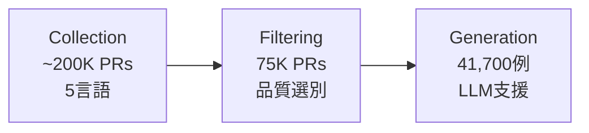

本記事は [Sphinx: Benchmarking and Modeling for LLM-Driven Pull Request Review](https://arxiv.org/abs/2601.04252) の解説記事です。

## 論文概要（Abstract）

LLMを活用したPull Request（PR）レビューの自動化は、ソフトウェア開発の生産性向上に寄与する技術として注目されている。しかし、既存のアプローチには（1）ノイズの多い教師データ、（2）コンテキスト理解の不足、（3）評価指標の不適切さ、という3つの課題がある。著者らは、これらを統一的に解決するフレームワークSphinxを提案している。Sphinxは、GitHubから収集した約20万件のPRから3段階のデータパイプラインで41,700件の訓練データを生成し、チェックリスト報酬最適化（CRPO: Checklist Reward Policy Optimization）により、PRレビューモデルのチェックリストカバレッジを最大40%向上させたと報告している。

この記事は [Zenn記事: Fable 5.1×プロンプトキャッシュでモノレポPRレビューコスト75%削減](https://zenn.dev/0h_n0/articles/7bfc9a6bf7c6ae) の深掘りです。

## 情報源

- **arXiv ID**: 2601.04252
- **URL**: [https://arxiv.org/abs/2601.04252](https://arxiv.org/abs/2601.04252)
- **著者**: Daoan Zhang, Shuo Zhang, Zijian Jin, Jiebo Luo, Shengyu Fu, Elsie Nallipogu
- **発表年**: 2026
- **分野**: cs.SE, cs.CL

## 背景と動機（Background & Motivation）

PRレビューはソフトウェア品質保証の中核プロセスだが、レビュワーにとって認知負荷が高く、大規模プロジェクトではボトルネックとなりやすい。LLMを用いたPRレビュー自動化の研究は進展しているが、著者らは既存手法に3つの構造的課題を指摘している。

**第1の課題: ノイズの多い教師データ**。GitHubのPRコメントには、バグの指摘、コードスタイルの改善提案、設計方針の議論、単なる質問、感謝のメッセージなど、極めて多様な内容が混在する。人間のレビューコメントをそのまま教師データとして用いると、コードの品質改善に直接寄与しないコメントがノイズとなり、モデルの学習を阻害する。また、レビュワーの経験や専門性によってコメントの品質が大きくばらつくことも問題である。

**第2の課題: コンテキスト理解の不足**。PRのdiff情報のみでは、変更の意図やプロジェクト全体の文脈を把握できない。既存手法の多くはdiffテキストのみを入力とするため、PRのタイトル・説明文・関連Issue等のメタデータを活用できていない。実際のレビューでは、レビュワーはPRの説明文を読み、関連するIssueを確認し、変更が何を解決しようとしているかを理解したうえでコードを読む。この文脈情報の欠如は、的外れなレビューコメントの生成につながる。

**第3の課題: 評価指標の不適切さ**。BLEUやROUGEなどのテキスト類似度指標は、レビューの品質（バグ検出能力、指摘の網羅性、提案の実用性）を適切に反映しない。同じバグを異なる表現で指摘しても、参照テキストとのn-gram一致が低ければスコアが低くなる。著者らの実験でも、BLEU/ROUGEとレビュー品質の間には低い相関しか確認されなかったと報告されている。この問題は、レビューの自動評価と改善の両方を阻害している。

これらの3つの課題は相互に関連している。ノイズの多いデータで学習すれば当然コンテキスト理解が不足し、不適切な評価指標ではモデルの改善方向を正しく導けない。Sphinxは（1）LLMを活用した3段階データ生成パイプライン、（2）チェックリストベースの評価ベンチマーク、（3）CRPOによる方策最適化、の3つの貢献でこれら課題に統一的に対処する。

## 主要な貢献（Key Contributions）

- **3段階データパイプライン**: 約20万件のPRから、フィルタリングとLLM支援生成を経て、41,700件の高品質訓練データを構築。疑似修正コードとマージ済みコードの比較に基づくレビュー生成により、コンテキストに根ざした教師データを作成する
- **チェックリストベース評価ベンチマーク**: 5言語×500件の計2,500件のテストケースから成り、各ケースにバグ検出チェックリストを付与。従来のBLEU/ROUGEに代わる、レビュー品質の構造的評価を実現する
- **CRPO（Checklist Reward Policy Optimization）**: GRPOを基にしたルールベース・解釈可能な報酬関数で方策最適化を行う訓練パラダイム。チェックリストカバレッジと長さペナルティに基づく報酬設計により、冗長な出力を抑制しつつバグ検出能力を向上させる

## 技術的詳細（Technical Details）

### 3段階データパイプライン

Sphinxのデータ構築は、Collection（収集）・Filtering（フィルタリング）・Generation（生成）の3段階で構成される。



**Stage 1: Collection（収集）**。GitHubから5言語（Java、JavaScript、C++、C#、Python）のPRを約20万件収集する。対象はマージ済みのPRに限定し、PRメタデータ（タイトル、説明文、ラベル）とコード差分を取得する。著者らがこの5言語を選択した理由は、GitHubにおけるPR数とオープンソースプロジェクトの活発さに基づいている。各言語のPRは異なるコーディングパターンやエラーの傾向を持つため、言語横断的な汎化性を確保するうえで重要である。

**Stage 2: Filtering（フィルタリング）**。以下の基準で厳格なフィルタリングを行い、約20万件から75,000件に絞り込む。削減率は約62.5%であり、大半のPRが品質基準を満たさないことを示している。
- 完全性チェック: PR構成要素（タイトル・説明・diff・レビューコメント）がすべて揃っていること。部分的な情報しかないPRでは、レビューの文脈を正確に再構成できない
- マージ済みステータス: クローズドまたはドラフトPRを除外。マージされたPRのみを対象とすることで、実際にコードベースに取り込まれた変更に対するレビューを教師データとする
- トークン制約: PRメタデータとコードの合計が32Kトークン以内であること。単一ファイル修正に限定することで、変更の範囲を明確にし、レビューとコード変更の対応関係を追跡しやすくする
- 安全性スクリーニング: GPT-4oによる有害コンテンツの検出と除外。悪意のあるコードや不適切な内容を含むPRを訓練データから排除する

**Stage 3: Generation（生成）**。LLMを活用した3ステップのレビュー生成により、フィルタリング後の75,000件からさらに品質の高い45,000件を選出し、最終的に41,700件の訓練データを生成する。従来の手法では人間のレビューコメントをそのまま教師データとして用いていたが、これにはノイズが多い。Sphinxでは、LLMを介した構造的な生成プロセスにより、一貫性のある高品質なレビューデータを作成する。

1. **PRレビュー指示生成**: PRメタデータ（タイトル、説明文、ラベル）とdiffからレビューの意図・焦点を記述した指示文をLLMが合成する。この指示文は、レビュワーが何に注目すべきかを明示的に定義する役割を果たす
2. **疑似修正コード生成**: LLMがPRの意図に基づいてコード修正を試み、「疑似修正コード」を生成する。この疑似修正は必ずしも完全ではなく、実際のマージ済みコードとの差異が生じることが期待される
3. **比較レビュー生成**: 疑似修正コードと実際のマージ済みコードを比較し、両者の差異に基づいたレビューコメントをLLMが生成する。疑似修正が不完全であった箇所が、まさにレビューで指摘すべきポイントとなる

この3ステップの設計により、表層的なテキスト差分ではなく、コードの意味的変更に根ざしたレビューコメントが生成される。著者らは、この手法を「context-rich, semantically grounded review comments」と表現している（Section 3.1）。特に、疑似修正コードとマージ済みコードの比較というアプローチは、単なるdiffの読解ではなく「このコードは何を達成しようとしているか」「どこが不十分か」という高次の理解に基づくレビューを可能にする点で独創的である。

### チェックリストベース評価

従来のBLEU/ROUGEなどのn-gram一致指標は、レビュー品質の弁別力が低いことが知られている。Sphinxでは、各テストケースに対してチェックリスト（検証すべきポイントのリスト）を付与し、モデルの出力がどれだけのチェック項目をカバーしているかで評価する。

ベンチマークの構成は以下のとおりである。

| 言語 | Bug Fix | Feature/Improvement | Refactor | Other | 合計 |
|------|---------|---------------------|----------|-------|------|
| Java | 394 | 25 | 21 | 10 | 450 |
| C++ | 427 | 13 | 0 | 10 | 450 |
| C# | 402 | 24 | 10 | 14 | 450 |
| Python | 370 | 25 | 39 | 16 | 450 |
| JavaScript | 388 | 28 | 22 | 12 | 450 |

各言語500件のうち450件がバグを含むケース、50件がバグフリーのケースである。バグフリーケースは、モデルが誤ってバグを報告する偽陽性の検出に用いられる。

### チェックリストカバレッジスコア

チェックリストカバレッジスコアは、バグ検出の網羅性と偽陽性の抑制を統合した評価指標である。

$$
\text{Score} = \lambda \cdot \frac{1}{n} \sum_{i=1}^{n} \frac{S_{\text{buggy}}(i)}{N_{\text{buggy}}(i)} + (1 - \lambda) \cdot \frac{1}{m} \sum_{j=1}^{m} \frac{S_{\text{bug-free}}(j)}{N_{\text{bug-free}}(j)}
$$

ここで、
- $\lambda = 0.9$: バグ検出の重要度を反映する重み
- $n = 450$: バグを含むケースの数（各言語）
- $m = 50$: バグフリーケースの数（各言語）
- $S_{\text{buggy}}(i)$: ケース $i$ で検出されたチェックリスト項目数
- $N_{\text{buggy}}(i)$: ケース $i$ の全チェックリスト項目数
- $S_{\text{bug-free}}(j)$: バグフリーケース $j$ で正しく「問題なし」と判定された項目数
- $N_{\text{bug-free}}(j)$: バグフリーケース $j$ の全チェック項目数

$\lambda = 0.9$ の設定は、PRレビューにおいてバグの見逃し（偽陰性）が偽陽性よりも深刻であるという実務的知見に基づく。バグフリーケースに対する重みを $1 - \lambda = 0.1$ としつつも評価に含めることで、過剰な指摘を行うモデルにペナルティを与える設計となっている。

### CRPO（Checklist Reward Policy Optimization）

CRPOは、GRPO（Group Relative Policy Optimization）を基盤とし、PRレビュータスクに特化した報酬関数を導入したものである。

#### 報酬関数の設計

報酬関数は、チェックリストカバレッジと長さペナルティの2要素で構成される。

$$
R = \gamma(|\{y_i\}|, |\{CL_i\}|) \cdot r_\theta(x, \{y_i\}, \{CL_i\})
$$

ここで、
- $x$: 入力（PRメタデータ + diff）
- $\{y_i\}$: モデルの生成したレビューコメント
- $\{CL_i\}$: 正解チェックリスト項目集合（Ground Truthから生成）
- $r_\theta$: チェックリストカバレッジに基づくスカラー報酬
- $\gamma$: 長さペナルティ関数

#### 長さペナルティ $\gamma$

長さペナルティは、冗長な出力を抑制するための滑らかな減衰関数である。

$$
\gamma(l_{\text{pred}}, l_{\text{ref}}) =
\begin{cases}
1 & \text{if } l_{\text{pred}} \leq M \cdot l_{\text{ref}} \\
\left(\frac{N \cdot l_{\text{ref}} - l_{\text{pred}}}{(N - M) \cdot l_{\text{ref}}}\right)^2 & \text{if } M \cdot l_{\text{ref}} < l_{\text{pred}} \leq N \cdot l_{\text{ref}} \\
0 & \text{if } l_{\text{pred}} > N \cdot l_{\text{ref}}
\end{cases}
$$

ここで、
- $l_{\text{pred}}$: 予測されたレビューの長さ
- $l_{\text{ref}}$: 参照レビュー（Ground Truth）の長さ
- $M$: ペナルティ開始倍率（論文中の設定値は明示されていないが、参照長の一定倍率）
- $N$: ペナルティが最大（報酬ゼロ）となる倍率

参照長以下の出力にはペナルティなし（$\gamma = 1$）、$M$ 倍を超えると二次関数的に減衰し、$N$ 倍を超えると報酬がゼロになる。この設計により、チェックリスト項目を網羅しつつ簡潔なレビューを生成するようモデルが誘導される。

#### GRPOからの変更点

CRPOはGRPOをベースとしつつ、以下の変更を加えている。

1. **KL損失の除去**: 著者らの実験では、KL損失を含めると性能が22.86に低下した（KL損失なしでは25.73）と報告されている（Table 3）。PRレビューのようなタスクでは、参照方策からの逸脱を許容する方が有効であることを示唆している
2. **ルールベース報酬**: LLM-as-judgeのような学習された報酬モデルではなく、チェックリストカバレッジと長さペナルティというルールベースの報酬を使用する。これにより報酬ハッキングのリスクを低減し、解釈可能性を確保している
3. **o3miniによるチェックリスト照合**: 生成されたレビューが各チェックリスト項目をカバーしているかの判定にo3miniを使用する

## 実装のポイント（Implementation）

### 訓練構成

著者らは4つのベースモデルでSphinxの訓練を行っている。

**SFT（Supervised Fine-tuning）**:

| パラメータ | 設定値 |
|-----------|--------|
| ベースモデル | Qwen2.5-Coder-7B, Qwen2.5-Coder-14B, GPT-4o, GPT-4o-mini |
| 訓練データ | 41,700例 |
| LoRAランク | 8 |
| 学習率 | 5e-5（cosineスケジュール） |
| ウォームアップ | 50ステップ |
| バッチサイズ | 1,024 |
| 訓練ステップ | 165 |

**CRPO**:

| パラメータ | 設定値 |
|-----------|--------|
| 学習率 | 1e-6 |
| ロールアウト数 | 16 |
| 勾配累積 | 4 |
| 報酬モデル | o3mini（チェックリスト照合用） |
| KL損失 | 除去 |

### CRPOの実装例

以下は、CRPOの報酬計算ロジックの概念的な実装である。

```python
from dataclasses import dataclass


@dataclass(frozen=True)
class ChecklistItem:
    """チェックリストの個別項目

    Attributes:
        description: チェック項目の説明
        category: バグカテゴリ (bug_fix, feature, refactor, other)
        severity: 重要度 (critical, major, minor)
    """
    description: str
    category: str
    severity: str


@dataclass(frozen=True)
class ReviewOutput:
    """モデルが生成したレビュー出力

    Attributes:
        text: レビューコメント本文
        token_count: トークン数
    """
    text: str
    token_count: int


def compute_checklist_coverage(
    review: ReviewOutput,
    checklist: list[ChecklistItem],
    matched_items: list[bool],
) -> float:
    """チェックリストカバレッジスコアを計算する

    Args:
        review: モデルの生成したレビュー出力
        checklist: 正解チェックリスト項目のリスト
        matched_items: 各チェックリスト項目がレビューでカバーされているかのフラグ

    Returns:
        0.0-1.0のカバレッジスコア

    Raises:
        ValueError: チェックリストが空の場合
    """
    if not checklist:
        raise ValueError("Checklist must not be empty")
    covered = sum(1 for m in matched_items if m)
    return covered / len(checklist)


def compute_length_penalty(
    pred_length: int,
    ref_length: int,
    m_factor: float = 1.5,
    n_factor: float = 3.0,
) -> float:
    """長さペナルティを計算する

    参照長のm_factor倍まではペナルティなし、
    n_factor倍を超えると報酬ゼロとなる二次減衰関数。

    Args:
        pred_length: 予測レビューの長さ（トークン数）
        ref_length: 参照レビューの長さ（トークン数）
        m_factor: ペナルティ開始倍率
        n_factor: 報酬ゼロとなる倍率

    Returns:
        0.0-1.0のペナルティ係数
    """
    m_threshold = m_factor * ref_length
    n_threshold = n_factor * ref_length

    if pred_length <= m_threshold:
        return 1.0
    if pred_length > n_threshold:
        return 0.0

    # 二次関数的減衰
    ratio = (n_threshold - pred_length) / (n_threshold - m_threshold)
    return ratio ** 2


def compute_crpo_reward(
    review: ReviewOutput,
    checklist: list[ChecklistItem],
    matched_items: list[bool],
    ref_length: int,
    m_factor: float = 1.5,
    n_factor: float = 3.0,
) -> float:
    """CRPO報酬を計算する

    チェックリストカバレッジと長さペナルティの積。

    Args:
        review: モデルの生成したレビュー出力
        checklist: 正解チェックリスト項目のリスト
        matched_items: 各項目のカバレッジフラグ
        ref_length: 参照レビューのトークン数
        m_factor: 長さペナルティ開始倍率
        n_factor: 長さペナルティ最大倍率

    Returns:
        CRPO報酬値（0.0-1.0）
    """
    coverage = compute_checklist_coverage(review, checklist, matched_items)
    penalty = compute_length_penalty(
        review.token_count, ref_length, m_factor, n_factor
    )
    return penalty * coverage
```

### チェックリストカバレッジスコアの集計

```python
def compute_benchmark_score(
    buggy_scores: list[float],
    bugfree_scores: list[float],
    lambda_weight: float = 0.9,
) -> float:
    """ベンチマーク全体のチェックリストカバレッジスコアを計算する

    Args:
        buggy_scores: バグケースごとのカバレッジスコア (各0.0-1.0)
        bugfree_scores: バグフリーケースごとのカバレッジスコア (各0.0-1.0)
        lambda_weight: バグケースの重み (デフォルト0.9)

    Returns:
        加重平均スコア

    Raises:
        ValueError: スコアリストが空の場合
    """
    if not buggy_scores or not bugfree_scores:
        raise ValueError("Score lists must not be empty")

    avg_buggy = sum(buggy_scores) / len(buggy_scores)
    avg_bugfree = sum(bugfree_scores) / len(bugfree_scores)

    return lambda_weight * avg_buggy + (1 - lambda_weight) * avg_bugfree
```

## Production Deployment Guide

### GitHub Actions統合パターン（コスト最適化重視）

SphinxのPRレビューモデルをCI/CDパイプラインに組み込む場合のトラフィック量別構成を示す。以下のコスト試算は2026年9月時点の各サービス料金に基づく概算値であり、実際のコストはPRの規模・頻度・モデル選択により変動する。最新料金は各プロバイダの料金ページで確認を推奨する。

| 構成 | PRレビュー規模 | インフラ | 月額概算 |
|------|-------------|---------|---------|
| Small | ~50 PR/月 | GitHub Actions + API呼び出し（GPT-4o-mini） | $30-80 |
| Medium | ~300 PR/月 | GitHub Actions + セルフホストモデル（Qwen2.5-14B） | $400-900 |
| Large | 1,000+ PR/月 | EKS + Sphinx-14B-CRPO + プロンプトキャッシュ | $1,500-3,500 |

**Small構成**: GitHub Actionsのワークフローで、PRオープン時にGPT-4o-mini APIを呼び出してレビューコメントを生成する。PRあたりの平均入力トークンを8,000、出力トークンを2,000と仮定すると、50 PR/月で入力400Kトークン（$0.06）+出力100Kトークン（$0.04）程度となり、API料金は月額$10以下に収まる。GitHub Actions自体の実行時間コスト（Publicリポジトリは無料、Privateは2,000分/月まで無料）が主なコスト要因となる。

**Medium構成**: セルフホストランナー上でQwen2.5-Coder-14BをvLLMで稼働させ、GitHub Actionsから呼び出す構成。g5.xlarge（A10G 24GB）で量子化モデル（AWQ 4bit）を動作させる場合、オンデマンドで$1.006/h、Spot Instancesで$0.30-0.40/h程度となる。常時稼働の場合は月額$220-730、営業時間帯のみ稼働（12h/日×22日）の場合は$80-265程度に抑制できる。

**Large構成**: EKS上でSphinx-14B-CRPOをデプロイし、プロンプトキャッシュを活用してコスト効率を最大化する構成。モノレポ環境では、共通のシステムプロンプトやリポジトリコンテキストをプレフィクスキャッシュとして保持することで、PR間で重複するコンテキストの再計算を回避できる。関連するZenn記事で解説しているプロンプトキャッシュ戦略との組み合わせにより、入力トークンコストを50-75%削減できる可能性がある。

### GitHub Actions ワークフロー例

```yaml
# .github/workflows/sphinx-review.yml
name: Sphinx PR Review
on:
  pull_request:
    types: [opened, synchronize]

permissions:
  pull-requests: write
  contents: read

jobs:
  review:
    runs-on: ubuntu-latest
    timeout-minutes: 10
    steps:
      - uses: actions/checkout@v4
        with:
          fetch-depth: 0

      - name: Get PR diff
        id: diff
        run: |
          git diff origin/${{ github.base_ref }}...HEAD > /tmp/pr_diff.txt
          echo "diff_size=$(wc -c < /tmp/pr_diff.txt)" >> "$GITHUB_OUTPUT"

      - name: Generate review with Sphinx
        if: steps.diff.outputs.diff_size != '0'
        env:
          OPENAI_API_KEY: ${{ secrets.OPENAI_API_KEY }}
        run: |
          python scripts/sphinx_review.py \
            --diff /tmp/pr_diff.txt \
            --pr-title "${{ github.event.pull_request.title }}" \
            --pr-body "${{ github.event.pull_request.body }}" \
            --output /tmp/review_comment.md

      - name: Post review comment
        if: steps.diff.outputs.diff_size != '0'
        uses: actions/github-script@v7
        with:
          script: |
            const fs = require('fs');
            const comment = fs.readFileSync('/tmp/review_comment.md', 'utf8');
            await github.rest.pulls.createReview({
              owner: context.repo.owner,
              repo: context.repo.repo,
              pull_number: context.issue.number,
              body: comment,
              event: 'COMMENT'
            });
```

### レビュースクリプトの実装例

```python
"""Sphinx PRレビュースクリプト

PRのdiffとメタデータからチェックリストベースのレビューコメントを生成する。
"""

import argparse
import json
import sys
from pathlib import Path

from openai import OpenAI


SYSTEM_PROMPT = """\
You are a code reviewer. Given a PR diff, title, and description,
generate a structured review covering:
1. Bug detection with severity levels
2. Code quality issues
3. Security concerns
4. Performance implications

Format each finding as a checklist item with location and severity.
"""


def build_review_prompt(
    diff: str,
    pr_title: str,
    pr_body: str,
    max_diff_tokens: int = 24_000,
) -> str:
    """レビュー用プロンプトを構築する

    Args:
        diff: PRのdiffテキスト
        pr_title: PRタイトル
        pr_body: PR説明文
        max_diff_tokens: diffの最大トークン数（概算）

    Returns:
        構築されたプロンプト文字列
    """
    # 簡易トークン推定（4文字≒1トークン）
    estimated_tokens = len(diff) // 4
    if estimated_tokens > max_diff_tokens:
        # 超過分を末尾から切り詰め
        max_chars = max_diff_tokens * 4
        diff = diff[:max_chars] + "\n... (truncated)"

    return f"""## PR Title
{pr_title}

## PR Description
{pr_body or "(no description)"}

## Diff
```diff
{diff}
```

Review this PR and provide structured findings."""


def generate_review(
    diff_path: Path,
    pr_title: str,
    pr_body: str,
    model: str = "gpt-4o-mini",
) -> str:
    """Sphinx方式のPRレビューを生成する

    Args:
        diff_path: diffファイルのパス
        pr_title: PRタイトル
        pr_body: PR説明文
        model: 使用するモデル名

    Returns:
        レビューコメントのMarkdown文字列

    Raises:
        FileNotFoundError: diffファイルが存在しない場合
    """
    diff_text = diff_path.read_text(encoding="utf-8")
    prompt = build_review_prompt(diff_text, pr_title, pr_body)

    client = OpenAI()
    response = client.chat.completions.create(
        model=model,
        messages=[
            {"role": "system", "content": SYSTEM_PROMPT},
            {"role": "user", "content": prompt},
        ],
        temperature=0.1,
        max_tokens=4_096,
    )

    return response.choices[0].message.content or ""


def main() -> None:
    """メインエントリポイント"""
    parser = argparse.ArgumentParser(description="Sphinx PR Review")
    parser.add_argument("--diff", type=Path, required=True)
    parser.add_argument("--pr-title", type=str, required=True)
    parser.add_argument("--pr-body", type=str, default="")
    parser.add_argument("--output", type=Path, required=True)
    parser.add_argument("--model", type=str, default="gpt-4o-mini")
    args = parser.parse_args()

    review = generate_review(args.diff, args.pr_title, args.pr_body, args.model)
    args.output.write_text(review, encoding="utf-8")


if __name__ == "__main__":
    main()
```

### コスト最適化チェックリスト

**アーキテクチャ選択**:
- [ ] PR頻度を測定し適切な構成を選択（~50 PR/月: API、~300: セルフホスト、1,000+: EKS）
- [ ] PRサイズ分布を分析（大きなPRはdiff分割で入力トークンを削減）

**API呼び出し最適化**:
- [ ] プロンプトキャッシュ: 共通システムプロンプト・リポジトリコンテキストのキャッシュで入力コスト50-75%削減
- [ ] バッチAPI: 非同期バッチ処理で50%のコスト削減（レイテンシ許容時）
- [ ] モデル選定: 小規模PRにはGPT-4o-mini、重要PRにはSphinx-4o-SFTを使い分け
- [ ] diff前処理: 空行・コメント変更のみの差分を除外して入力トークンを削減

**セルフホスト最適化**:
- [ ] 量子化モデル（AWQ/GPTQ 4bit）でGPUメモリ使用量を50%削減
- [ ] Spot Instances活用でオンデマンド比最大70%削減
- [ ] 営業時間帯のみ稼働でコスト60%削減（EventBridge + Lambda）
- [ ] vLLM Prefix Caching有効化でリポジトリコンテキストの再計算を回避

**監視・品質管理**:
- [ ] レビュー品質のサンプリング監査（週次で10件抽出、人間レビュワーと比較）
- [ ] 偽陽性率の監視（開発者がdismissしたレビューコメントの割合を追跡）
- [ ] API使用量のダッシュボード設定（トークン消費量、レスポンス時間、エラー率）
- [ ] コストアラート設定（月次予算の80%/100%閾値でSlack通知）

## 実験結果（Results）

### モデル比較

著者らは、プロプライエタリモデル・オープンソースモデル・Sphinxファインチューニングモデルを対象に、チェックリストカバレッジスコアで比較評価を行っている。

| モデル | チェックリストスコア | ベースラインからの改善率 |
|--------|---------------------|----------------------|
| GPT-4.1 | 34.23 | -- |
| Claude 3.7-Sonnet | 31.39 | -- |
| Gemini 2.5-Pro | 32.75 | -- |
| Qwen2.5-Coder-7B | 22.50 | ベースライン |
| Qwen2.5-72B | 30.53 | -- |
| Sphinx-7B-SFT-CRPO | 25.73 | +14.36% |
| Sphinx-14B-SFT-CRPO | 30.21 | +19.92% |
| Sphinx-4omini-SFT | 37.99 | +31.72% |
| **Sphinx-4o-SFT** | **41.12** | **+39.86%** |

Sphinx-4o-SFTはGPT-4.1を6.89ポイント上回り、チェックリストカバレッジで最高スコアを記録している。オープンソースモデルの中ではSphinx-14B-SFT-CRPO（30.21）がQwen2.5-72B（30.53）に近い性能を示しており、72Bモデルに匹敵する性能を14Bモデルで達成していることは注目に値する。

### SFTとCRPOの効果分析

著者らは、SFTのみの場合とSFT+CRPOの場合の性能差も報告している。

| モデル | ベースライン | SFT | SFT+CRPO |
|--------|------------|-----|----------|
| Qwen2.5-Coder-7B | 22.50 | -- | 25.73 |
| Qwen2.5-Coder-14B | 25.19 | -- | 30.21 |

### アブレーション実験（7Bモデル）

CRPOの各コンポーネントの寄与を分析するアブレーション実験の結果が報告されている。

| 構成 | チェックリストスコア | BLEU-1 | ROUGE-L |
|------|---------------------|--------|---------|
| LLM-as-judge | 25.12 | -- | -- |
| 長さペナルティなし | 25.35 | 3.25 | 4.86 |
| KL損失あり | 22.86 | -- | -- |
| **Full Sphinx-7B** | **25.73** | -- | -- |

この結果から、以下の知見が得られる。

1. **KL損失の除去が有効**: KL損失を含めると22.86まで低下する。PRレビューのような創造的タスクでは、参照方策への過度な制約が性能を阻害する
2. **長さペナルティの効果**: 長さペナルティなしでは25.35と、フルモデル（25.73）に近いチェックリストスコアが得られるが、BLEU-1が3.25、ROUGE-Lが4.86と低い値を示す。長さペナルティは出力の簡潔性を改善する
3. **ルールベース報酬 > LLM-as-judge**: LLM-as-judge（25.12）よりフルSphinx（25.73）が高いスコアを示しており、ルールベースの報酬設計が有効である

### BLEU/ROUGEの限界

著者らは、BLEUやROUGEがPRレビュー品質の弁別に適さないことを実験的に示している。チェックリストスコアの高いモデルが必ずしもBLEU/ROUGEで高いスコアを示すわけではなく、両指標間の相関は低い。これは、レビューコメントの表現方法は多様であり、参照テキストとのn-gram一致が品質を反映しないためである。

### 人間評価

20名のソフトウェアエンジニアリング分野の評価者が30ケースを評価した結果、以下の指標が報告されている。

| 評価指標 | 値 |
|---------|-----|
| Mean Opinion Score (MOS) | 4.13 |
| ICC(2,k) | 0.87 |
| 評価者数 | 20 |
| 評価ケース数 | 30 |

ICC(2,k) = 0.87は「excellent」レベルの評価者間一致を示しており、チェックリストベースの評価が人間の判断と高い一致性を持つことを裏付けている。評価カテゴリには、レビューとコード変更の整合性、チェックリストの網羅性・正確性、実務的な有用性が含まれる。

## 実運用への応用（Practical Applications）

### PRレビュー自動化への示唆

Sphinxの成果は、PRレビュー自動化の設計に対していくつかの実務的示唆を与える。

**チェックリスト駆動のレビュー設計**: フリーフォームのレビューコメントではなく、構造化されたチェックリストに基づくレビューが品質管理に有効であることが示された。実務では、プロジェクト固有のレビュー観点（セキュリティ脆弱性、パフォーマンス劣化、コーディング規約違反、テスト不足等）をチェックリストとして定義し、モデルの出力を構造化することが推奨される。チェックリストを明示的に定義することで、レビューの網羅性を担保しつつ、新人レビュワーの教育ツールとしても活用できる。

**段階的導入戦略**: Sphinx-4o-SFTが最高性能を示すが、コスト面ではSphinx-14B-CRPOも72Bモデルに匹敵する性能を14Bで達成している。小規模チームではAPI経由のGPT-4o-mini、中規模チームではセルフホストの14Bモデル、大規模チームではSphinx-4o-SFTのような段階的な導入が現実的である。導入初期は人間のレビュワーとの並行運用で偽陽性率を監視し、信頼性が確認された段階でレビュープロセスの一部を自動化するアプローチが望ましい。

**プロンプトキャッシュとの組み合わせ**: 関連Zenn記事で解説しているプロンプトキャッシュ戦略は、Sphinxモデルの運用コスト削減に直接適用できる。モノレポ環境では、リポジトリ構造やコーディング規約などのコンテキストをプレフィクスキャッシュとして保持することで、PR間で共通のコンテキスト処理コストを削減できる。特に、同一リポジトリ内で多数のPRが同時に生成される開発フェーズでは、キャッシュヒット率が高くなり、コスト削減効果が顕著になる。

### 制約と限界

**言語カバレッジ**: 現在のベンチマークは5言語（Java、JavaScript、C++、C#、Python）のみを対象としている。Go、Rust、TypeScript、Kotlinなどの近年利用が拡大している言語への拡張が今後の課題である。特にTypeScriptはWebアプリケーション開発で広く使われており、型システムに起因する独自のバグパターンがあるため、対応の優先度は高い。

**単一ファイル制約**: データパイプラインは単一ファイル修正のPRに限定しており、複数ファイルにまたがる変更のレビューは未対応である。実務上のPRの多くは複数ファイル修正を含み、ファイル間の整合性（インターフェース変更の伝播、依存関係の更新等）の検証が求められる。この制約は現時点でのSphinxの適用範囲を大きく限定する要因である。

**カテゴリ偏り**: ベンチマークの88%以上がBug Fixカテゴリであり、Feature/Improvement（4.6%）やRefactor（3.7%）のカバレッジが限定的である。リファクタリングのレビューではコードの可読性や保守性の評価が求められ、新機能追加のレビューではアーキテクチャ設計の妥当性の判断が必要となる。これらはバグ検出とは異なるスキルセットであり、追加的なデータ収集と評価基準の設計が必要である。

## 関連研究（Related Work）

- **CodeReviewer (Li et al., 2022)**: 事前学習済みモデルをコードレビュータスクにファインチューニングした研究。コードの差分とレビューコメントのペアで学習するが、Sphinxのようなチェックリストベースの構造的評価は行っていない
- **GRPO (Shao et al., 2024)**: グループ相対方策最適化。CRPOの基盤となった手法で、複数の生成結果をグループとして相対評価することで方策勾配の分散を低減する。Sphinxはこれにチェックリスト報酬と長さペナルティを追加し、PRレビュー特化の改良を加えている
- **LLM-as-Judge (Zheng et al., 2024)**: LLMを報酬モデルとして使用するアプローチ。Sphinxのアブレーション実験では、ルールベースのCRPO報酬がLLM-as-judgeを上回る結果が示されており、タスク特化型のルールベース報酬の有効性が確認されている
- **RLHF (Ouyang et al., 2022)**: 人間のフィードバックによる強化学習。人間のアノテーションを必要とするRLHFに対し、CRPOはルールベースの報酬で人間のラベリングコストを回避しつつ、高い性能を達成している

## まとめと今後の展望

本論文は、LLM駆動PRレビューにおける3つの構造的課題（ノイズの多い教師データ、コンテキスト不足、不適切な評価指標）に対し、データパイプライン・チェックリストベース評価・CRPOという統一的なフレームワークで対処した。Sphinx-4o-SFTはGPT-4.1比で39.86%のチェックリストカバレッジ向上を達成し、14Bモデルでも72Bモデルに匹敵する性能を示した。

実務的には、チェックリスト駆動のレビュー設計、ルールベース報酬による訓練、プロンプトキャッシュとの組み合わせが、PRレビュー自動化の品質とコスト効率の両立に貢献する。今後は、複数ファイル修正への拡張、言語カバレッジの拡大、リポジトリ固有のコンテキスト活用（ファイル構造、依存関係グラフ、過去のレビュー履歴）などの方向性が期待される。

## 参考文献

- **arXiv**: [https://arxiv.org/abs/2601.04252](https://arxiv.org/abs/2601.04252)
- **Related Zenn article**: [https://zenn.dev/0h_n0/articles/7bfc9a6bf7c6ae](https://zenn.dev/0h_n0/articles/7bfc9a6bf7c6ae)
