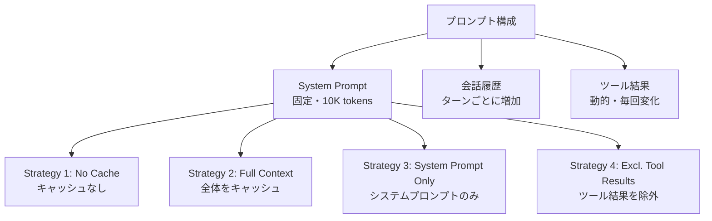

## 論文概要（Abstract）

本記事は [https://arxiv.org/abs/2601.06007](https://arxiv.org/abs/2601.06007) の解説記事です。

LLMエージェントが自律的にWeb検索やツール呼び出しを繰り返す長期的（long-horizon）タスクにおいて、プロンプトキャッシュがAPIコストとレイテンシに与える影響を、OpenAI・Anthropic・Googleの3プロバイダ横断で初めて体系的に評価した研究である。著者らは「DeepResearch Bench」と呼ぶ独自ベンチマークを構築し、500以上のエージェントセッション・10,000トークン規模のシステムプロンプトを用いて4つのキャッシュ戦略を比較した。その結果、戦略的なキャッシュ境界制御により最大79.6%のコスト削減と30.9%のTTFT改善が得られる一方、ナイーブなフルコンテキストキャッシュはGPT-4oで8.8%のTTFT悪化（regression）を引き起こすことが報告されている。

この記事は [Zenn記事: Fable 5.1×プロンプトキャッシュでモノレポPRレビューコスト75%削減](https://zenn.dev/0h_n0/articles/7bfc9a6bf7c6ae) の深掘りです。

## 情報源

- **arXiv ID**: 2601.06007
- **URL**: [https://arxiv.org/abs/2601.06007](https://arxiv.org/abs/2601.06007)
- **著者**: Elias Lumer, Faheem Nizar, Akshaya Jangiti et al.
- **発表年**: 2026年1月（v2: 2026年1月31日改訂）
- **分野**: Artificial Intelligence (cs.AI)

## 背景と動機（Background & Motivation）

### エージェント型タスクのコスト問題

LLMを活用したエージェントシステムは、ツール呼び出し・Web検索・ファイル操作などを自律的に繰り返す。このマルチターン実行では、各ターンでシステムプロンプト・会話履歴・ツール結果を含むプロンプト全体がAPIに送信される。ターンが重なるにつれ入力トークン数は線形に増大し、コストとレイテンシの両面で深刻なボトルネックとなる。

### プロンプトキャッシュの登場

2024年以降、OpenAI・Anthropic・Googleの各プロバイダがプロンプトキャッシュ機能を提供し始めた。プロンプトの先頭から一致する部分を再利用することで、キャッシュヒットしたトークンの料金を50-90%割引し、推論前処理（prefill）時間も短縮する。しかし著者らは、エージェント型タスクにおけるキャッシュ効果の体系的評価が存在しないことを指摘している。

### 従来手法の限界

著者らは論文中で「To our knowledge, no prior work quantifies these cost savings or compares caching strategies for multi-turn agentic tasks」と述べており、以下の課題が未解決であった：

1. **プロバイダ間比較の不在**: 各プロバイダの課金体系・最小トークン閾値・TTL（キャッシュ有効期間）が異なるが、統一条件での比較がない
2. **キャッシュ戦略の未整理**: 何をキャッシュし何を除外すべきかの設計指針が欠如
3. **動的コンテンツの影響**: ツール結果など毎ターン変化するコンテンツがキャッシュ効率に与える影響が不明

## 主要な貢献（Key Contributions）

1. **初のマルチプロバイダ横断評価**: OpenAI（GPT-5.2, GPT-4o）、Anthropic（Claude Sonnet 4.5）、Google（Gemini 2.5 Pro）の4モデルで統一条件下のキャッシュ評価を実施
2. **DeepResearch Bench**: 500以上のセッション・10,000トークンシステムプロンプト・自律Web検索を含むエージェント型ベンチマークの構築
3. **4つのキャッシュ戦略の体系化と比較**: No Cache / Full Context / System Prompt Only / Exclude Tool Resultsの4戦略を定式化し、モデル別の最適戦略を同定
4. **キャッシュ境界制御の重要性の実証**: ナイーブなフルコンテキストキャッシュが逆効果となるケースを定量的に示した

## 技術的詳細（Technical Details）

### プロンプトキャッシュの仕組み

プロンプトキャッシュは、APIリクエストのプロンプト先頭部分がキャッシュ済みプロンプトと一致する場合、その部分のprefill計算をスキップする仕組みである。キーとなる制約は「プレフィックス一致」であり、先頭から連続して一致する部分のみがキャッシュヒットの対象となる。

キャッシュヒット時のコスト削減率は以下の式で表される：

$$
S = 1 - \frac{C_{\text{hit}} \cdot T_{\text{cached}} + C_{\text{miss}} \cdot T_{\text{uncached}}}{C_{\text{miss}} \cdot (T_{\text{cached}} + T_{\text{uncached}})}
$$

ここで、
- $S$: コスト削減率
- $C_{\text{hit}}$: キャッシュヒット時のトークン単価
- $C_{\text{miss}}$: キャッシュミス時（通常入力）のトークン単価
- $T_{\text{cached}}$: キャッシュヒットしたトークン数
- $T_{\text{uncached}}$: キャッシュミスしたトークン数

この式から、削減率は $T_{\text{cached}} / (T_{\text{cached}} + T_{\text{uncached}})$（キャッシュヒット率）と $C_{\text{hit}} / C_{\text{miss}}$（割引率）の2要素で決まることがわかる。

### プロバイダ別のキャッシュ仕様

各プロバイダのキャッシュ実装は以下のように異なる（2026年9月時点）：

| プロバイダ | 最小トークン閾値 | TTL（有効期間） | 制御方式 | キャッシュヒット割引 |
|-----------|----------------|-----------------|---------|-------------------|
| OpenAI | 1,024トークン | 自動管理 | 自動（opt-in不要） | 入力トークン50%割引 |
| Anthropic | 1,024トークン | 5分-24時間 | 開発者が明示的に制御 | 入力トークン90%割引 |
| Google | 4,096トークン | 開発者設定 | 開発者が明示的に制御 | 入力トークン割引 |

Anthropicの割引率が90%と最も大きく、OpenAIの50%と比較して単位トークンあたりの削減効果が高い。一方、Googleは最小閾値が4,096トークンと他の4倍であり、短いプロンプトではキャッシュが有効にならない。

### 4つのキャッシュ戦略

著者らは以下の4戦略を定義し比較している：



**Strategy 1: No Cache（ベースライン）**

キャッシュを使用しない。すべてのトークンが通常料金で課金される。

**Strategy 2: Full Context**

プロンプト全体（システムプロンプト＋会話履歴＋ツール結果）をキャッシュ対象とする。一見最適に見えるが、ツール結果が毎ターン変化するため、変化した位置以降のキャッシュが無効化される。

**Strategy 3: System Prompt Only**

システムプロンプト部分のみをキャッシュ対象とする。システムプロンプトはセッション中不変であるため、安定したキャッシュヒットが見込める。

**Strategy 4: Exclude Tool Results（ツール結果除外）**

システムプロンプト＋会話履歴をキャッシュし、動的に変化するツール結果をキャッシュ境界の外に配置する。プロンプト構造を工夫し、ツール結果をプロンプト末尾に移動させることで実現する。

### キャッシュ境界制御の数学的理解

エージェントの$t$ターン目のプロンプトを次のように分解する：

$$
P_t = \underbrace{S}_{\text{system prompt}} \oplus \underbrace{H_t}_{\text{会話履歴}} \oplus \underbrace{R_t}_{\text{ツール結果}}
$$

ここで $\oplus$ はトークン列の連結を表す。各戦略のキャッシュ可能プレフィックス長 $L_{\text{cache}}$ は：

- **No Cache**: $L_{\text{cache}} = 0$
- **Full Context**: $L_{\text{cache}} = |S| + |H_t| + |R_t|$ （ただし $R_t$ が変化すると $|S| + |H_{t-1}|$ まで無効化）
- **System Prompt Only**: $L_{\text{cache}} = |S|$ （常に安定）
- **Excl. Tool Results**: $L_{\text{cache}} = |S| + |H_t|$ （$R_t$ をプロンプト末尾に配置）

著者らは、キャッシュ効果を決定する主要因は「キャッシュ可能プレフィックス長」であり、ツール呼び出しの回数ではないと結論づけている。

## 実装のポイント（Implementation）

### キャッシュヒットを最大化するプロンプト設計

実装上の最重要ポイントは、プロンプト内のコンテンツ配置順序である。キャッシュはプレフィックス一致で動作するため、**固定コンテンツを先頭に、動的コンテンツを末尾に**配置する必要がある。

```python
from dataclasses import dataclass
from typing import Any


@dataclass(frozen=True)
class CacheAwarePrompt:
    """キャッシュ効率を最大化するプロンプト構築クラス

    プロンプト要素を安定性の降順に配置し、
    キャッシュ可能プレフィックス長を最大化する。
    """

    system_prompt: str
    conversation_history: list[dict[str, str]]
    tool_results: list[dict[str, Any]]

    def build_messages(self) -> list[dict[str, Any]]:
        """キャッシュ最適化されたメッセージ列を構築する

        Returns:
            OpenAI/Anthropic API形式のメッセージリスト。
            固定部分（system prompt）→ 会話履歴 → 動的部分（tool results）
            の順に配置される。
        """
        messages: list[dict[str, Any]] = []

        # 1. システムプロンプト（完全に固定、常にキャッシュヒット）
        messages.append({
            "role": "system",
            "content": self.system_prompt,
        })

        # 2. 会話履歴（ターンごとに蓄積、前ターンまではキャッシュ可能）
        for turn in self.conversation_history:
            messages.append(turn)

        # 3. ツール結果（毎回変化、キャッシュ境界の外に配置）
        for result in self.tool_results:
            messages.append({
                "role": "tool",
                "content": str(result["output"]),
                "tool_call_id": result["call_id"],
            })

        return messages
```

### Anthropic APIでのキャッシュ制御

Anthropicでは `cache_control` パラメータで明示的にキャッシュ境界を指定できる。これにより、どこまでをキャッシュ対象とするかを開発者が精密に制御可能である。

```python
import anthropic
from typing import Any


def build_anthropic_cached_request(
    system_prompt: str,
    messages: list[dict[str, Any]],
    model: str = "claude-sonnet-4-5-20250514",
) -> dict[str, Any]:
    """Anthropic APIのキャッシュ制御付きリクエストを構築する

    Args:
        system_prompt: キャッシュ対象のシステムプロンプト
        messages: 会話メッセージ履歴
        model: 使用するモデルID

    Returns:
        Anthropic API呼び出し用のパラメータ辞書
    """
    return {
        "model": model,
        "max_tokens": 4096,
        "system": [
            {
                "type": "text",
                "text": system_prompt,
                "cache_control": {"type": "ephemeral"},  # ここでキャッシュ境界を明示
            }
        ],
        "messages": messages,
    }


def call_with_cache_monitoring(
    client: anthropic.Anthropic,
    request_params: dict[str, Any],
) -> tuple[str, dict[str, int]]:
    """キャッシュ統計を取得しながらAPIを呼び出す

    Returns:
        (応答テキスト, キャッシュ統計辞書) のタプル
    """
    response = client.messages.create(**request_params)

    cache_stats = {
        "input_tokens": response.usage.input_tokens,
        "cache_creation_input_tokens": getattr(
            response.usage, "cache_creation_input_tokens", 0
        ),
        "cache_read_input_tokens": getattr(
            response.usage, "cache_read_input_tokens", 0
        ),
    }

    cache_hit_rate = (
        cache_stats["cache_read_input_tokens"]
        / max(cache_stats["input_tokens"], 1)
        * 100
    )
    print(f"Cache hit rate: {cache_hit_rate:.1f}%")

    return response.content[0].text, cache_stats
```

### OpenAI APIでの自動キャッシュ

OpenAIではキャッシュは自動的に有効化され、開発者側の明示的な制御は不要である。ただし、プロンプト先頭部分が1,024トークン以上一致する必要がある。

```python
from openai import OpenAI
from typing import Any


def analyze_openai_cache_usage(
    client: OpenAI,
    model: str,
    messages: list[dict[str, Any]],
) -> dict[str, Any]:
    """OpenAI APIのキャッシュ利用状況を分析する

    Args:
        client: OpenAIクライアント
        model: モデルID（例: "gpt-5.2"）
        messages: メッセージリスト

    Returns:
        キャッシュ統計を含む辞書
    """
    response = client.chat.completions.create(
        model=model,
        messages=messages,
    )

    usage = response.usage
    cached_tokens = getattr(usage, "prompt_tokens_details", {})
    cached_count = getattr(cached_tokens, "cached_tokens", 0)

    return {
        "total_prompt_tokens": usage.prompt_tokens,
        "cached_tokens": cached_count,
        "uncached_tokens": usage.prompt_tokens - cached_count,
        "cache_hit_rate": cached_count / max(usage.prompt_tokens, 1) * 100,
        "completion_tokens": usage.completion_tokens,
    }
```

## Production Deployment Guide

本論文の知見をプロダクション環境に適用するためのガイドを示す。プロンプトキャッシュは設定変更のみで大幅なコスト削減を実現できるため、LLMエージェントを運用するすべての環境で導入を検討すべきである。以下のコスト試算は2026年9月時点のAWS ap-northeast-1（東京）リージョン料金に基づく概算値であり、実際のコストはトラフィックパターンやバースト使用量により変動する。

### AWS実装パターン（コスト最適化重視）

**トラフィック量別の推奨構成**:

| 規模 | 構成 | 月額概算 | 主要サービス |
|------|------|---------|-------------|
| Small (~100 req/日) | Serverless | $50-150 | Lambda + Bedrock + DynamoDB |
| Medium (~1,000 req/日) | Hybrid | $300-800 | ECS Fargate + Bedrock + ElastiCache |
| Large (10,000+ req/日) | Container | $2,000-5,000 | EKS + Karpenter + Spot Instances |

**Small構成の内訳**:
- Lambda: 月100回×平均30秒実行 = ~$0.5
- Bedrock (Claude Sonnet 4.5): 入力10Kトークン×100回、キャッシュヒット90% = ~$30-80
- DynamoDB (On-Demand): セッション状態保存 = ~$1-5
- CloudWatch Logs: ~$5

**コスト削減テクニック**:
- **Prompt Caching有効化**: 本論文の知見を適用し30-80%削減
- **Bedrock Batch API**: 非同期処理可能なタスクで50%削減
- **Spot Instances活用（Large構成）**: EKSワーカーノードで最大90%削減
- **Reserved Instances**: Fargate/ECSで1年コミットにより最大72%削減

### Terraformインフラコード

**Small構成（Serverless）**:

```hcl
# プロンプトキャッシュ最適化エージェント基盤 - Serverless構成
# 2026年9月時点のAWS ap-northeast-1料金に基づく

resource "aws_iam_role" "agent_lambda" {
  name = "prompt-cache-agent-lambda"
  assume_role_policy = jsonencode({
    Version = "2012-10-17"
    Statement = [{
      Action = "sts:AssumeRole"
      Effect = "Allow"
      Principal = { Service = "lambda.amazonaws.com" }
    }]
  })
}

resource "aws_iam_role_policy" "bedrock_invoke" {
  name = "bedrock-invoke"
  role = aws_iam_role.agent_lambda.id
  policy = jsonencode({
    Version = "2012-10-17"
    Statement = [{
      Effect   = "Allow"
      Action   = ["bedrock:InvokeModel", "bedrock:InvokeModelWithResponseStream"]
      Resource = "arn:aws:bedrock:ap-northeast-1::foundation-model/anthropic.claude-sonnet-4-5*"
    }]
  })
}

resource "aws_lambda_function" "agent" {
  function_name = "prompt-cache-agent"
  runtime       = "python3.12"
  handler       = "handler.lambda_handler"
  role          = aws_iam_role.agent_lambda.arn
  timeout       = 120  # エージェントの長時間実行に対応
  memory_size   = 512  # プロンプト構築に十分なメモリ

  environment {
    variables = {
      CACHE_STRATEGY    = "system_prompt_only"  # 論文推奨戦略
      MODEL_ID          = "anthropic.claude-sonnet-4-5-20250514-v1:0"
      SESSION_TABLE     = aws_dynamodb_table.sessions.name
    }
  }
}

resource "aws_dynamodb_table" "sessions" {
  name         = "agent-sessions"
  billing_mode = "PAY_PER_REQUEST"  # On-Demandでコスト最適化
  hash_key     = "session_id"

  attribute {
    name = "session_id"
    type = "S"
  }

  ttl {
    attribute_name = "expires_at"
    enabled        = true  # 5分TTLに合わせてセッション自動削除
  }

  server_side_encryption {
    enabled = true  # KMS暗号化
  }
}

resource "aws_cloudwatch_metric_alarm" "bedrock_cost" {
  alarm_name          = "bedrock-token-usage-spike"
  comparison_operator = "GreaterThanThreshold"
  evaluation_periods  = 1
  metric_name         = "InputTokenCount"
  namespace           = "AWS/Bedrock"
  period              = 3600
  statistic           = "Sum"
  threshold           = 1000000  # 1時間に100万トークン超で警告
  alarm_actions       = [aws_sns_topic.alerts.arn]
}

resource "aws_sns_topic" "alerts" {
  name = "agent-cost-alerts"
}
```

**Large構成（Container）**:

```hcl
# EKS + Karpenter + Spot Instances構成
module "eks" {
  source          = "terraform-aws-modules/eks/aws"
  version         = "~> 20.0"
  cluster_name    = "prompt-cache-agent"
  cluster_version = "1.31"

  vpc_id     = module.vpc.vpc_id
  subnet_ids = module.vpc.private_subnets

  cluster_endpoint_public_access = false  # プライベートアクセスのみ
}

# Karpenter: Spot優先の自動スケーリング
resource "kubectl_manifest" "karpenter_nodepool" {
  yaml_body = yamlencode({
    apiVersion = "karpenter.sh/v1"
    kind       = "NodePool"
    metadata   = { name = "agent-workers" }
    spec = {
      template = {
        spec = {
          requirements = [
            { key = "karpenter.sh/capacity-type", operator = "In", values = ["spot", "on-demand"] },
            { key = "node.kubernetes.io/instance-type", operator = "In",
              values = ["m6i.xlarge", "m6a.xlarge", "m7i.xlarge"] },
          ]
        }
      }
      limits   = { cpu = "100", memory = "400Gi" }
      disruption = { consolidationPolicy = "WhenEmptyOrUnderutilized" }
    }
  })
}

resource "aws_budgets_budget" "monthly" {
  name         = "agent-monthly-budget"
  budget_type  = "COST"
  limit_amount = "5000"
  limit_unit   = "USD"
  time_unit    = "MONTHLY"

  notification {
    comparison_operator       = "GREATER_THAN"
    threshold                 = 80
    threshold_type            = "PERCENTAGE"
    notification_type         = "ACTUAL"
    subscriber_email_addresses = ["team@example.com"]
  }
}
```

### 運用・監視設定

**CloudWatch Logs Insights クエリ**（キャッシュ効率監視）:

```
fields @timestamp, @message
| filter @message like /cache/
| stats
    sum(cache_read_tokens) as total_cached,
    sum(input_tokens) as total_input,
    sum(cache_read_tokens) / sum(input_tokens) * 100 as cache_hit_pct
  by bin(1h)
| sort @timestamp desc
```

**キャッシュ監視アラーム設定（Python）**:

```python
import boto3
import json
from datetime import datetime, timedelta
from typing import Any


def setup_cache_monitoring(
    cloudwatch: boto3.client,
    sns_topic_arn: str,
) -> None:
    """キャッシュヒット率低下を検知するアラームを設定する

    Args:
        cloudwatch: CloudWatchクライアント
        sns_topic_arn: 通知先SNSトピックARN
    """
    cloudwatch.put_metric_alarm(
        AlarmName="low-cache-hit-rate",
        MetricName="CacheHitRate",
        Namespace="Custom/PromptCache",
        Statistic="Average",
        Period=3600,
        EvaluationPeriods=2,
        Threshold=50.0,  # ヒット率50%未満で警告
        ComparisonOperator="LessThanThreshold",
        AlarmActions=[sns_topic_arn],
    )


def publish_cache_metrics(
    cloudwatch: boto3.client,
    cache_stats: dict[str, int],
) -> None:
    """キャッシュ統計をカスタムメトリクスとして送信する

    Args:
        cloudwatch: CloudWatchクライアント
        cache_stats: API応答から取得したキャッシュ統計
    """
    hit_rate = (
        cache_stats["cache_read_input_tokens"]
        / max(cache_stats["input_tokens"], 1)
        * 100
    )

    cloudwatch.put_metric_data(
        Namespace="Custom/PromptCache",
        MetricData=[
            {
                "MetricName": "CacheHitRate",
                "Value": hit_rate,
                "Unit": "Percent",
                "Timestamp": datetime.utcnow(),
            },
            {
                "MetricName": "CachedTokens",
                "Value": cache_stats["cache_read_input_tokens"],
                "Unit": "Count",
                "Timestamp": datetime.utcnow(),
            },
        ],
    )
```

**X-Ray トレーシング設定**:

```python
from aws_xray_sdk.core import xray_recorder, patch_all
from typing import Any

# boto3自動計装
patch_all()


@xray_recorder.capture("bedrock_invoke")
def invoke_with_tracing(
    client: Any,
    model_id: str,
    messages: list[dict[str, Any]],
    cache_strategy: str,
) -> dict[str, Any]:
    """X-Rayトレーシング付きBedrock呼び出し

    Args:
        client: Bedrock Runtimeクライアント
        model_id: モデルID
        messages: メッセージリスト
        cache_strategy: 適用中のキャッシュ戦略名

    Returns:
        Bedrock応答辞書
    """
    subsegment = xray_recorder.current_subsegment()
    if subsegment:
        subsegment.put_annotation("cache_strategy", cache_strategy)
        subsegment.put_metadata("prompt_token_count", sum(
            len(m.get("content", "")) for m in messages
        ))

    response = client.invoke_model(
        modelId=model_id,
        body=json.dumps({"messages": messages}),
    )
    return json.loads(response["body"].read())
```

**Cost Explorer日次レポート**:

```python
import boto3
from datetime import date, timedelta


def get_daily_bedrock_cost(
    ce_client: boto3.client,
) -> dict[str, float]:
    """直近1日のBedrock利用コストを取得する

    Returns:
        サービス別コスト辞書
    """
    today = date.today()
    yesterday = today - timedelta(days=1)

    response = ce_client.get_cost_and_usage(
        TimePeriod={
            "Start": yesterday.isoformat(),
            "End": today.isoformat(),
        },
        Granularity="DAILY",
        Metrics=["BlendedCost"],
        Filter={
            "Dimensions": {
                "Key": "SERVICE",
                "Values": ["Amazon Bedrock", "AWS Lambda", "Amazon EKS"],
            }
        },
        GroupBy=[{"Type": "DIMENSION", "Key": "SERVICE"}],
    )

    costs: dict[str, float] = {}
    for group in response["ResultsByTime"][0]["Groups"]:
        service = group["Keys"][0]
        amount = float(group["Metrics"]["BlendedCost"]["Amount"])
        costs[service] = amount

    total = sum(costs.values())
    if total > 100.0:  # $100/日超過でSNS通知
        sns = boto3.client("sns")
        sns.publish(
            TopicArn="arn:aws:sns:ap-northeast-1:ACCOUNT:agent-cost-alerts",
            Subject="Bedrock日次コスト超過",
            Message=f"直近24時間のコスト: ${total:.2f}",
        )

    return costs
```

### コスト最適化チェックリスト

**アーキテクチャ選択**:
- [ ] トラフィック量に応じた構成を選択（Serverless / Hybrid / Container）
- [ ] マルチリージョン要件の確認

**リソース最適化**:
- [ ] EC2/EKS: Spot Instances優先（最大90%削減）
- [ ] Reserved Instances: 1年コミットで最大72%削減
- [ ] Savings Plans: Compute Savings Plans検討
- [ ] Lambda: メモリサイズをPower Tuningで最適化
- [ ] ECS/EKS: アイドル時のスケールダウン設定
- [ ] NAT Gateway: VPCエンドポイントで代替（Bedrock, DynamoDB）

**LLMコスト削減**:
- [ ] **Prompt Caching有効化**（本論文の主題、30-80%削減）
- [ ] キャッシュ戦略を選択（System Prompt Only推奨）
- [ ] プロンプト構造の最適化（固定→動的の順序）
- [ ] Bedrock Batch API使用（非同期タスクで50%削減）
- [ ] モデル選択ロジック（タスク難度に応じたモデル切替）
- [ ] 出力トークン数制限（max_tokens設定）

**監視・アラート**:
- [ ] AWS Budgets設定（月次予算アラート）
- [ ] CloudWatchカスタムメトリクス（キャッシュヒット率）
- [ ] Cost Anomaly Detection有効化
- [ ] 日次コストレポート（$100/日超過で通知）
- [ ] キャッシュヒット率低下アラーム（50%未満で警告）

**リソース管理**:
- [ ] 未使用リソース削除（定期監査）
- [ ] タグ戦略（Environment, CostCenter, Project）
- [ ] DynamoDB TTLによるセッション自動削除
- [ ] CloudWatch Logsライフサイクルポリシー（30日保持）
- [ ] 開発環境の夜間・休日停止

## 実験結果（Results）

### モデル別最適キャッシュ戦略

著者らが報告した主要結果を以下にまとめる（論文Table 1相当）：

| モデル | 最適戦略 | コスト削減率 | TTFT改善率 |
|--------|---------|-------------|-----------|
| GPT-5.2 | Excl. Tool Results | 79.6% | -13.0% |
| Claude Sonnet 4.5 | System Prompt Only | 78.5% | -22.9% |
| Gemini 2.5 Pro | System Prompt Only | 41.4% | -6.1% |
| GPT-4o | System Prompt Only | 45.9% | -30.9% |

ここで注目すべきは、GPT-5.2ではExclude Tool Results戦略が最適であるのに対し、他の3モデルではSystem Prompt Only戦略が最適である点である。著者らは、GPT-5.2の大きな内部キャッシュ容量がより長いプレフィックスのキャッシュを可能にしていると分析している。

### Full Contextキャッシュの逆効果

論文の重要な発見の一つは、ナイーブなFull Contextキャッシュが逆効果を示すケースである。著者らはGPT-4oにおいて、Full Contextキャッシュが**8.8%のTTFT悪化（regression）**を引き起こしたと報告している。これはSystem Prompt Onlyの30.9%改善と対照的である。

この現象の原因として、著者らはツール結果の動的変化によるキャッシュ無効化のオーバーヘッドを挙げている。毎ターンのキャッシュ書き込みと無効化が、キャッシュヒットによる節約を上回るケースが存在するのである。

### プロンプトサイズとコスト削減の関係

著者らは、コスト削減率がプロンプトサイズに対して線形にスケールすることを報告している。50,000トークンのプロンプトにおける削減率は：

- **GPT-5.2**: 89%
- **Claude Sonnet 4.5**: 88%
- **GPT-4o**: 54%

この結果は、大規模なシステムプロンプトを使用するエージェント（例: コードレビュー、ドキュメント分析）ほどキャッシュの恩恵が大きいことを意味する。

### キャッシュ効果の主要因

著者らは、キャッシュ効果を決定する主要因は「キャッシュ可能プレフィックス長（cacheable prefix length）」であり、「ツール呼び出し回数（tool volume）」ではないと結論づけている。つまり、ツール呼び出しが多いセッションでも、プロンプト構造が適切であれば高いキャッシュヒット率を維持できる。

## 実運用への応用（Practical Applications）

### モノレポPRレビューへの適用

Zenn記事「Fable 5.1×プロンプトキャッシュでモノレポPRレビューコスト75%削減」で紹介されているPRレビューワークフローは、本論文の知見と直接関連する。PRレビューエージェントでは以下の構成が典型的である：

- **システムプロンプト**: レビューガイドライン・コーディング規約（5,000-15,000トークン、固定）
- **会話履歴**: 過去のレビューコメントとやり取り（ターンごとに蓄積）
- **ツール結果**: `git diff`出力・ファイル内容・CI結果（PR固有、動的）

本論文のSystem Prompt Only戦略を適用すれば、レビューガイドラインのキャッシュにより各PRレビューで安定したコスト削減が見込める。さらに大規模なシステムプロンプトを使う場合は、50Kトークン規模で88%（Claude）の削減が可能であると論文は示唆している。

### マルチプロバイダ戦略

本論文の結果は、プロバイダ選定にも重要な示唆を与える。Anthropicの90%トークン割引は、キャッシュヒット時の費用対効果が最も高い。一方、OpenAIは自動キャッシュにより設定の手間が少ない。プロダクション環境では、タスク特性に応じたプロバイダの使い分けが有効である：

- **長いシステムプロンプト + 繰り返し実行**: Anthropic（90%割引の恩恵が最大）
- **多様なタスク + 低い設定コスト**: OpenAI（自動キャッシュで即効性あり）
- **バッチ処理 + 非同期タスク**: Google（4,096トークン閾値を超える大規模プロンプト向き）

### キャッシュ戦略の実装チェック

エージェントシステムにキャッシュを導入する際、以下の手順で本論文の知見を適用できる：

1. **プロンプト構造の分析**: 固定部分と動的部分のトークン比率を計測
2. **戦略選択**: 固定部分が1,024トークン以上ならSystem Prompt Onlyを基本に、会話履歴も安定しているならExcl. Tool Resultsを検討
3. **キャッシュヒット率の監視**: 前述のCloudWatchカスタムメトリクスで継続的に測定
4. **A/Bテスト**: No Cache vs 選択した戦略でコストとレイテンシを実測比較

## 関連研究（Related Work）

- **KV Cache最適化（vLLM, PagedAttention）**: 推論エンジン内部のKey-Valueキャッシュを最適化する研究群。本論文はAPI層のプロンプトキャッシュを対象としており、内部KVキャッシュとは相補的な関係にある
- **Prompt Compression**: LLMLingua等のプロンプト圧縮技術。キャッシュとは異なりプロンプト自体を短縮するアプローチであり、情報損失のリスクがある
- **Context Window Management**: Long-context LLMにおけるコンテキスト管理研究。RAGによる関連情報の選択的注入など、キャッシュ以外のコスト削減手法を扱う
- **Agent Cost Optimization**: エージェントのAPI呼び出し回数削減やモデル切替による最適化。本論文はこれらと直交する「同じ呼び出しをより安くする」アプローチである

## まとめと今後の展望

本論文は、エージェント型タスクにおけるプロンプトキャッシュの効果を3プロバイダ・4モデルで初めて体系的に評価した。主要な知見は以下の3点である：

1. **戦略的キャッシュ境界制御が不可欠**: ナイーブなFull Contextキャッシュは逆効果になりうる。System Prompt OnlyまたはExclude Tool Results戦略が推奨される
2. **コスト削減は41-80%、TTFTは6-31%改善**: ただしプロバイダ・モデルによって最適戦略は異なる
3. **キャッシュ可能プレフィックス長が主要因**: ツール呼び出し回数ではなく、プロンプト構造の設計が効果を左右する

今後の研究方向として、著者らはキャッシュ戦略の動的切替（セッション中にプロンプト構成比率の変化に応じて戦略を変える手法）や、マルチエージェント環境でのキャッシュ共有などを挙げている。LLMエージェントのコスト効率化は実用上の最重要課題であり、本論文の知見はプロダクション環境への即座の適用が可能である。

## 参考文献

- **arXiv**: [https://arxiv.org/abs/2601.06007](https://arxiv.org/abs/2601.06007)
- **Related Zenn article**: [https://zenn.dev/0h_n0/articles/7bfc9a6bf7c6ae](https://zenn.dev/0h_n0/articles/7bfc9a6bf7c6ae)
- **Anthropic Prompt Caching Docs**: [https://docs.anthropic.com/en/docs/build-with-claude/prompt-caching](https://docs.anthropic.com/en/docs/build-with-claude/prompt-caching)
- **OpenAI Prompt Caching Guide**: [https://platform.openai.com/docs/guides/prompt-caching](https://platform.openai.com/docs/guides/prompt-caching)
