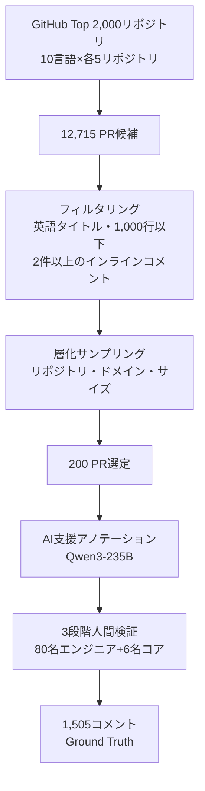
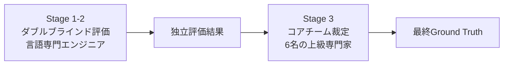
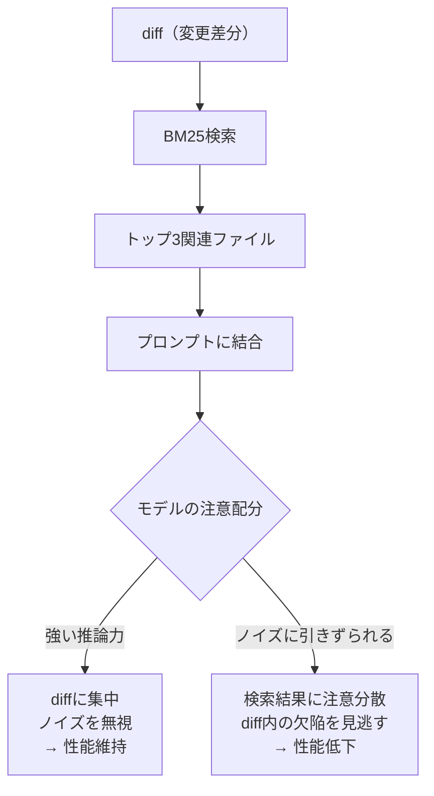
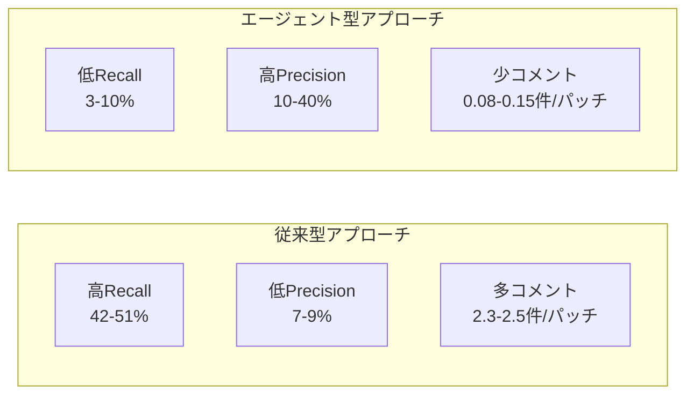

本記事は [AACR-Bench: Evaluating Automatic Code Review with Holistic Repository-Level Context](https://arxiv.org/abs/2601.19494) の解説記事です。

## 論文概要（Abstract）

自動コードレビュー（Automatic Code Review, ACR）の評価において、既存ベンチマークはdiff単位の狭いコンテキストに限定されており、リポジトリ全体の構造を考慮した評価ができていなかった。著者らは、10言語・200件のPR・1,505件の細粒度レビューコメントからなるベンチマーク「AACR-Bench」を構築し、コンテキスト粒度（diff/file/repo）と検索手法の選択がACR性能に与える影響をモデル・言語・パラダイム（従来型/エージェント型）ごとに実証分析したと報告している。AI支援＋専門家検証のアノテーション手法により、生のGitHubデータ比で欠陥カバレッジが285%向上した。

この記事は [Zenn記事: Fable 5.1×プロンプトキャッシュでモノレポPRレビューコスト75%削減](https://zenn.dev/0h_n0/articles/7bfc9a6bf7c6ae) の深掘りです。

## 情報源

- **arXiv ID**: 2601.19494
- **URL**: [https://arxiv.org/abs/2601.19494](https://arxiv.org/abs/2601.19494)
- **著者**: Lei Zhang, Yongda Yu, Minghui Yu, Xinxin Guo, Zhengfeng Zhuang, Guoping Rong, Dong Shao, Haifeng Shen, Hongyu Kuang, Zhengfeng Li, Boge Wang, Guoan Zhang, Bangyu Xiang, Xiaobin Xu
- **発表年**: 2026年1月（v3: 2026年1月30日）
- **分野**: cs.SE, cs.AI
- **コード**: [https://github.com/alibaba/aacr-bench](https://github.com/alibaba/aacr-bench)

## 背景と動機（Background & Motivation）

LLMを活用した自動コードレビューは急速に普及しているが、その評価手法には根本的な問題がある。既存のベンチマーク（CodeReviewer、CommentFinder等）はdiff単位のコンテキストのみを提供しており、実際の開発者が行うレビューとは大きく乖離している。実際のコードレビューでは、変更差分だけでなく、関連するファイルの構造、プロジェクト全体のアーキテクチャ、コーディング規約などリポジトリ全体のコンテキストを参照して判断を下す。

この問題は3つの側面に分解できる。

1. **コンテキスト粒度の制約**: diff単位ではセキュリティ脆弱性やクロスファイルの整合性問題を検出できない。著者らの分析では、Ground Truthの1,505コメントのうち、diff単位で検出可能なのは754件（50.1%）、ファイル単位が518件（34.4%）、リポジトリ単位でなければ検出できないものが233件（15.5%）であると報告されている
2. **アノテーション品質の問題**: 生のGitHub PRコメントには、承認のみのコメント、スタイルの好み、未解決の議論が混在している。レビュー品質の評価に使うには精製が必要である
3. **多言語・多パラダイムの欠如**: 既存ベンチマークの多くはJavaやPythonに偏っており、TypeScript、Rust、Go等の言語や、エージェント型アーキテクチャの評価に対応していない

著者らは、これらの課題をすべて解決するベンチマークとしてAACR-Benchを提案している。

## 主要な貢献（Key Contributions）

- **多言語・多粒度ベンチマーク**: JavaScript、Python、TypeScript、Java、C#、C++、C、PHP、Go、Rustの10言語にわたる200件のPRと1,505件の細粒度レビューコメントを収録。各コメントにはコンテキスト粒度ラベル（diff/file/repo）と欠陥カテゴリが付与されている
- **AI支援＋専門家検証アノテーション**: Qwen3-235B-A22B-Thinking-2507による候補生成と、80名以上のシニアエンジニア＋6名のコアチームによる3段階検証を組み合わせ、生データ比285%の欠陥カバレッジ向上を達成
- **コンテキスト粒度と検索手法の体系的分析**: 従来型（直接プロンプト）とエージェント型の両パラダイムにおいて、コンテキストの広さとACR性能の関係が正反対であるという知見を実証

## 技術的詳細（Technical Details）

### ベンチマーク設計

AACR-Benchのデータ収集は、以下の層化サンプリングプロセスで行われている。



**PR選定基準**は以下の5条件である。

1. 英語のタイトルと説明文を持つこと
2. 変更行数が1,000行以下であること
3. 主要言語がリポジトリの主言語と一致すること
4. 2件以上のインラインコメントがあり、1件以上が採用されていること
5. コメントが意味的に有意であること

各言語につき、GitHubのスター数とクローズ済みPR数の上位2,000リポジトリから5リポジトリを選定し、2024年12月から2025年12月のPRを対象としている。

### 欠陥カテゴリ分類

Ground Truthの1,505件のコメントは4カテゴリに分類されている。

| カテゴリ | 件数 | 割合 | 例 |
|---------|------|------|---|
| Code Defect（コード欠陥） | 709 | 47.1% | null参照、境界条件エラー、型不整合 |
| Maintainability & Readability（保守性・可読性） | 626 | 41.6% | 命名規則違反、重複コード、不十分なドキュメント |
| Performance Issue（性能問題） | 117 | 7.8% | 不要なループ、N+1クエリ、メモリリーク |
| Security Vulnerability（セキュリティ脆弱性） | 53 | 3.5% | SQLインジェクション、XSS、認証バイパス |

セキュリティ脆弱性の検出が全体の3.5%と少ないのは、セキュリティ問題がPRレビューの段階で明示的にコメントされることが相対的に少ないためであり、検出難度が高いカテゴリであると著者らは指摘している。

### アノテーション手法（AI-Assisted Expert-Verified）

アノテーションパイプラインは2つのフェーズで構成される。

**フェーズ1: AI支援候補生成**

生のGitHub PRコメントから欠陥指摘を抽出する処理に加え、LLM（Qwen3-235B-A22B-Thinking-2507）による追加欠陥の検出を行う。具体的には以下の手順で進む。

1. PRのレビュースレッドからマルチターンのやり取りを解析し、確認済みの欠陥を抽出
2. LLMがdiff・ファイル・リポジトリの各コンテキストレベルで追加の欠陥候補を生成
3. 既存コメントとLLM生成コメントのペアワイズ意味比較により重複を排除（5回投票制）

この手法により、元のPRコメントの391件に対し、LLM生成＋専門家検証で1,114件が追加され、合計1,505件のGround Truthが構築された。

**フェーズ2: 3段階人間検証**



80名以上のシニアソフトウェアエンジニア（2年以上の実務経験）が、各コメントの正確性、欠陥カテゴリ分類、コンテキスト粒度ラベルを評価する。Stage 1-2はダブルブラインドで行われ、プログラミング言語の専門性に基づいてアノテータが割り当てられる。結果が不一致の場合、Stage 3で6名のコアチームが最終判定を下す。

**精度検証**: ランダムサンプリングした300件のLLM生成コメントに対する検証では、95%の精度（信頼区間95%、誤差率4.74%）が確認されたと報告されている。

### 評価指標

生成されたレビューコメントとGround Truthの照合は、2段階のマッチング基準で行われる。

**Line Correct（行一致）**: 生成コメントの行範囲がGround Truthコメントの行範囲と重複していること。

$$
\text{LineMatch}(c_{\text{gen}}, c_{\text{gt}}) = \begin{cases} 1 & \text{if } [l_{\text{gen}}^{\text{start}}, l_{\text{gen}}^{\text{end}}] \cap [l_{\text{gt}}^{\text{start}}, l_{\text{gt}}^{\text{end}}] \neq \emptyset \\ 0 & \text{otherwise} \end{cases}
$$

**Semantically Correct（意味一致）**: 行一致に加え、コメント内容が意味的に同一であること。意味的一致の判定にはQwen3-235B-A22B-Instruct-2507を使用している。

$$
\text{SemanticMatch}(c_{\text{gen}}, c_{\text{gt}}) = \text{LineMatch}(c_{\text{gen}}, c_{\text{gt}}) \times \text{LLMJudge}(c_{\text{gen}}, c_{\text{gt}})
$$

これらの指標に基づき、Precision、Recall、F1が計算される。

$$
\text{Precision} = \frac{|\{c_{\text{gen}} : \exists c_{\text{gt}}, \text{Match}(c_{\text{gen}}, c_{\text{gt}}) = 1\}|}{|C_{\text{gen}}|}
$$

$$
\text{Recall} = \frac{|\{c_{\text{gt}} : \exists c_{\text{gen}}, \text{Match}(c_{\text{gen}}, c_{\text{gt}}) = 1\}|}{|C_{\text{gt}}|}
$$

$$
F_1 = \frac{2 \times \text{Precision} \times \text{Recall}}{\text{Precision} + \text{Recall}}
$$

モデルの推論パラメータはTemperature=0.7、Top_p=0.95、Top_k=20で統一されている。

## 実装のポイント — コンテキスト粒度の影響

### 従来型アプローチとエージェント型の正反対の振る舞い

本論文の最も重要な発見は、コンテキスト粒度の拡大が従来型とエージェント型で正反対の影響を与えることである。

**従来型（直接プロンプト）**: コンテキストが広がるほど性能が低下する。

| モデル | Diff Recall | File Recall | Repo Recall | 変化率 |
|--------|------------|-------------|-------------|--------|
| Claude-4.5-Sonnet | 45.76% | 40.54% | 38.63% | -15.6% |
| GPT-5.2 | 50.66% | 43.82% | 42.92% | -15.3% |
| Qwen-480B-Coder | 33.82% | 22.59% | 17.60% | -48.0% |

著者らは、コンテキストウィンドウに大量のリポジトリ情報を投入すると、モデルが関連部分に注意を集中できず、diff内の欠陥検出能力が低下すると分析している。Qwen-480B-Coderでは48%もの性能低下が観測されており、コンテキスト長に対するロバスト性がモデルによって大きく異なることが示されている。

**エージェント型（自律的コンテキスト検索）**: コンテキストが広がるほど性能が向上する。

| モデル | Diff Recall | Repo Recall | 変化率 |
|--------|------------|-------------|--------|
| Deepseek-V3.2 | 4.28% | 8.00% | +86.9% |
| Qwen-480B-Coder | 4.49% | 5.94% | +32.3% |

エージェント型では、モデルが必要なコンテキストを自律的に選択して取得するため、リポジトリレベルの情報が利用可能になるほど有益なコンテキストを参照できる。ただし、絶対的な検出率（Recall）は従来型と比較して著しく低いことに注意が必要である。

### コンテキスト検索手法の比較

著者らは3種類の検索手法を比較している。

```python
from dataclasses import dataclass
from enum import Enum


class RetrievalStrategy(Enum):
    """コンテキスト検索戦略の定義

    AACR-Benchで評価された3つの検索手法を表現する。
    """

    NO_CONTEXT = "no_context"  # diffのみ
    BM25 = "bm25"  # スパース検索（トップ3）
    EMBEDDING = "embedding"  # 密ベクトル検索（トップ3）
    AGENT = "agent"  # エージェント自律検索


@dataclass(frozen=True)
class RetrievalResult:
    """検索結果とACR性能の組み合わせ

    Attributes:
        strategy: 使用した検索戦略
        model: 評価対象モデル
        f1_score: F1スコア（%）
        avg_comments: パッチあたり平均コメント数
        precision: Precision（%）
        recall: Recall（%）
    """

    strategy: RetrievalStrategy
    model: str
    f1_score: float
    avg_comments: float
    precision: float
    recall: float


# 論文Table 3から抽出した代表的な結果
BENCHMARK_RESULTS: list[RetrievalResult] = [
    # Claude-4.5-Sonnet: No Context
    RetrievalResult(
        strategy=RetrievalStrategy.NO_CONTEXT,
        model="Claude-4.5-Sonnet",
        f1_score=14.46,
        avg_comments=1.89,
        precision=8.70,
        recall=45.76,
    ),
    # Claude-4.5-Sonnet: BM25 → 31%性能低下
    RetrievalResult(
        strategy=RetrievalStrategy.BM25,
        model="Claude-4.5-Sonnet",
        f1_score=9.98,
        avg_comments=1.72,
        precision=6.20,
        recall=40.54,
    ),
    # Deepseek-V3.2: BM25 → 性能向上
    RetrievalResult(
        strategy=RetrievalStrategy.BM25,
        model="Deepseek-V3.2",
        f1_score=15.59,
        avg_comments=2.52,
        precision=9.71,
        recall=42.09,
    ),
    # Claude-4.5-Sonnet: Agent
    RetrievalResult(
        strategy=RetrievalStrategy.AGENT,
        model="Claude-4.5-Sonnet",
        f1_score=16.12,
        avg_comments=0.089,
        precision=39.90,
        recall=10.10,
    ),
]
```

**BM25（スパース検索）**: diffに含まれるトークンをクエリとし、リポジトリ内の関連ファイルをBM25でランキングしてトップ3を取得する。Deepseek-V3.2ではF1が9.71%から15.59%に向上した一方、Claude-4.5-SonnetではF1が14.46%から9.98%へ31%低下した。

**Embedding（密ベクトル検索）**: Qwen3-Embedding-8Bでdiffをエンコードし、ベクトル類似度でトップ3のコンテキストを検索する。Qwen-480B-Coderで最良のF1=14.36%を記録したが、他モデルでは改善が限定的であった。

**Agent（自律検索）**: Claude Codeフレームワークを用い、モデルが自律的にコンテキストの量と種類を決定する。コメント生成数は0.08-0.15件/パッチと少数精鋭だが、Precisionは39.90%に達する。

著者らは「単一の検索手法がすべてのモデルで最適となることはない。性能はモデルと検索手法の特定の組み合わせに強く依存する」と結論している（Section 5.2）。

### コンテキスト検索がノイズとなるメカニズム

従来型アプローチでBM25検索が31%の性能低下を引き起こすメカニズムについて、著者らは「Naive RAGは有害なノイズを導入しうる」と指摘している。この現象は以下のように説明できる。



Claude-4.5-Sonnetのような強い推論能力を持つモデルでは、diff単独で十分な推論が可能であり、追加コンテキストがむしろ注意の分散を招く。一方、Deepseek-V3.2のような長コンテキスト処理に最適化されたモデルでは、追加コンテキストが有益に機能する場合がある。

## Production Deployment Guide

AACR-Benchの知見を実運用のコードレビュー自動化に適用する場合のガイドラインを示す。以下のコスト試算は2026年9月時点のAPI料金に基づく概算値であり、実際のコストはリクエスト量やキャッシュヒット率により変動する。最新料金は各プロバイダーの公式ページで確認を推奨する。

### アーキテクチャ選択: 従来型 vs エージェント型

AACR-Benchの結果から、従来型とエージェント型は補完的な特性を持つことがわかる。

| 特性 | 従来型（直接プロンプト） | エージェント型 |
|------|----------------------|--------------|
| コメント数/パッチ | 2.35-2.47件 | 0.08-0.15件 |
| Precision | 7.00-8.70% | 9.90-39.90% |
| Recall | 42.09-50.66% | 2.99-10.10% |
| 適用場面 | 広範囲スキャン | 高精度指摘 |
| コスト | 低（1回のAPI呼び出し） | 高（複数回の検索+推論） |

実運用では両者を組み合わせたハイブリッドアーキテクチャが有効である。

```python
from dataclasses import dataclass
from enum import Enum


class ReviewTier(Enum):
    """レビューの段階を定義する

    コスト効率を最大化するために、2段階のレビューを実施する。
    """

    FAST_SCAN = "fast_scan"  # 従来型: 全PRを高速スキャン
    DEEP_REVIEW = "deep_review"  # エージェント型: 重要PRを精査


@dataclass(frozen=True)
class ReviewConfig:
    """レビュー設定

    Attributes:
        tier: レビュー段階
        model: 使用モデル
        context_strategy: コンテキスト取得戦略
        max_context_files: 追加コンテキストファイル数上限
        temperature: 生成温度
    """

    tier: ReviewTier
    model: str
    context_strategy: str
    max_context_files: int
    temperature: float


# AACR-Benchの知見に基づく推奨設定
FAST_SCAN_CONFIG = ReviewConfig(
    tier=ReviewTier.FAST_SCAN,
    model="claude-4.5-sonnet",
    context_strategy="diff_only",  # コンテキスト追加はノイズリスク
    max_context_files=0,
    temperature=0.7,
)

DEEP_REVIEW_CONFIG = ReviewConfig(
    tier=ReviewTier.DEEP_REVIEW,
    model="claude-4.5-sonnet",
    context_strategy="agent",  # エージェントによる自律検索
    max_context_files=10,
    temperature=0.7,
)
```

### GitHub Actionsによるハイブリッドレビューパイプライン

```yaml
# .github/workflows/code-review.yml
name: Hybrid Code Review
on:
  pull_request:
    types: [opened, synchronize]

jobs:
  fast-scan:
    runs-on: ubuntu-latest
    outputs:
      risk_level: ${{ steps.scan.outputs.risk_level }}
    steps:
      - uses: actions/checkout@v4
        with:
          fetch-depth: 0
      - name: Fast Scan Review
        id: scan
        env:
          ANTHROPIC_API_KEY: ${{ secrets.ANTHROPIC_API_KEY }}
        run: |
          # diff-onlyコンテキストで高速スキャン
          # AACR-Bench: diff-onlyがClaude-4.5-Sonnetで最良F1
          DIFF=$(git diff origin/main...HEAD)
          RISK=$(echo "$DIFF" | python scripts/risk_classifier.py)
          echo "risk_level=$RISK" >> "$GITHUB_OUTPUT"

  deep-review:
    needs: fast-scan
    if: needs.fast-scan.outputs.risk_level == 'high'
    runs-on: ubuntu-latest
    steps:
      - uses: actions/checkout@v4
        with:
          fetch-depth: 0
      - name: Agent-Based Deep Review
        env:
          ANTHROPIC_API_KEY: ${{ secrets.ANTHROPIC_API_KEY }}
        run: |
          # エージェント型: リポジトリコンテキストを自律検索
          # AACR-Bench: Agent型はPrecision 39.90%で高精度
          python scripts/agent_review.py \
            --context-strategy agent \
            --max-files 10
```

### コスト試算（2026年9月時点）

モノレポで1日50件のPRを処理する場合の概算を示す。

| 項目 | 従来型のみ | ハイブリッド（推奨） |
|------|----------|-------------------|
| Fast Scan（50 PR/日） | $15-25/日 | $15-25/日 |
| Deep Review（高リスク10 PR/日） | -- | $8-15/日 |
| プロンプトキャッシュ適用後 | -- | -50-75% |
| **月額概算** | $450-750 | $200-400 |

プロンプトキャッシュの効果はレビュープロンプトの共通部分（システムプロンプト、レビュー基準、プロジェクト固有ルール）がキャッシュされるため、モノレポで特に有効である。AACR-Benchが示すように、diff-onlyコンテキストが多くの場面で十分な検出力を持つため、不要なコンテキスト検索を省略することもコスト削減に直結する。

### 言語別の検出精度バイアスへの対策

AACR-Benchで明らかになった言語間のF1格差（Python: 0.247 vs TypeScript: 0.081、約3倍）は、モノレポで複数言語を扱う場合に深刻な問題となる。

```python
# 言語別のレビュー信頼度閾値設定
# AACR-BenchのClaude-4.5-Sonnet結果に基づく
LANGUAGE_CONFIDENCE: dict[str, float] = {
    "csharp": 0.309,      # F1最高: 高い信頼度で自動処理可
    "python": 0.247,      # 良好: 自動処理推奨
    "java": 0.241,        # 良好: 自動処理推奨
    "rust": 0.091,        # 低精度: 人間レビュー併用必須
    "c": 0.085,           # 低精度: 人間レビュー併用必須
    "php": 0.082,         # 低精度: 人間レビュー併用必須
    "typescript": 0.081,  # 低精度: 人間レビュー併用必須
}


def should_require_human_review(language: str, threshold: float = 0.15) -> bool:
    """言語のF1スコアに基づき人間レビューの必要性を判定する

    AACR-BenchのClaude-4.5-Sonnet結果を基準とする。
    F1がthreshold未満の言語では自動レビューの信頼度が低いため、
    人間レビューを必須とする。

    Args:
        language: プログラミング言語名（小文字）
        threshold: 人間レビュー必須とするF1閾値

    Returns:
        True if human review is required
    """
    f1 = LANGUAGE_CONFIDENCE.get(language, 0.0)
    return f1 < threshold
```

### 運用監視チェックリスト

**コンテキスト戦略の選択**:
- [ ] モデルごとに最適なコンテキスト戦略をAACR-Benchの結果に基づいて設定
- [ ] Claude系モデルではdiff-onlyを基本とし、不要なコンテキスト検索を避ける
- [ ] Deepseek系モデルではBM25検索（トップ3）を追加することで改善が期待できる

**言語バイアス対策**:
- [ ] TypeScript/Rust/C/PHPのPRには人間レビューをフォールバックとして設定
- [ ] Python/Java/C#のPRでは自動レビューの信頼度が相対的に高い

**品質モニタリング**:
- [ ] 自動レビューコメントの採用率をトラッキング（目標: Precision 30%以上）
- [ ] False Positive率の週次レポート（開発者の信頼を維持するため）
- [ ] 言語別・カテゴリ別の検出率を定期計測

## 実験結果（Results）

### モデル間比較

著者らは5つの主要モデルを4つの手法（No Context、BM25、Embedding、Agent）で評価している。

| モデル | 手法 | Avg Comments | Precision | Recall | F1 |
|--------|------|-------------|-----------|--------|------|
| GPT-5.2 | No Context | 2.37 | 7.00% | 47.11% | -- |
| GPT-5.2 | Embedding | 2.47 | -- | -- | -- |
| Claude-4.5-Sonnet | No Context | 1.89 | 8.70% | 45.76% | 14.46% |
| Claude-4.5-Sonnet | BM25 | 1.72 | 6.20% | 40.54% | 9.98% |
| Claude-4.5-Sonnet | Agent | 0.089 | 39.90% | 10.10% | 16.12% |
| Deepseek-V3.2 | No Context | 2.23 | -- | -- | -- |
| Deepseek-V3.2 | BM25 | 2.52 | 9.71% | 42.09% | 15.59% |
| Qwen-480B-Coder | Embedding | -- | -- | -- | 14.36% |
| Qwen-480B-Coder | BM25 | -- | -- | -- | 11.69% |

GPT-5.2のAgent結果はPrecision 9.90%、Recall 2.99%と、Claude-4.5-Sonnetと比較して大幅に低い性能を示した。著者らは、エージェントフレームワークとの親和性がモデルごとに大きく異なることを指摘している。

### 言語別性能バイアス

Claude-4.5-Sonnet（No Context）における言語別F1スコアは以下の通りである。

| 言語 | F1スコア | 相対性能（C#基準） |
|------|---------|------------------|
| C# | 0.309 | 1.00x |
| Python | 0.247 | 0.80x |
| Java | 0.241 | 0.78x |
| Rust | 0.091 | 0.29x |
| C | 0.085 | 0.28x |
| PHP | 0.082 | 0.27x |
| TypeScript | 0.081 | 0.26x |

C#のF1が全モデル・全言語で最高値（0.309）を記録した一方、TypeScriptは0.081にとどまり、約3.8倍の格差がある。著者らはこの原因として、トレーニングデータにおける言語分布の偏り、言語固有の型システムやコーディングパターンの差異を挙げている。TypeScriptはJavaScriptとの互換性やdynamic typingの側面を持つため、静的解析的なレビューが困難であると考えられる。

### コメント検出の重複分析

著者らは複数モデル間でのコメント検出の重複を分析している（Table 8）。

| 検出パターン | 件数 |
|------------|------|
| LLM生成のみ（オリジナルPRで未検出） | 360 |
| 1モデルのみが検出 | 1,027 |
| 2モデルが検出 | 107 |
| 3モデルが検出 | 11 |

1,505件のGround Truthのうち、1,027件（68.2%）は単一モデルでしか検出されていない。この結果は、複数モデルのアンサンブルがカバレッジ向上に有効であることを示唆している。

### 従来型 vs エージェント型の特性まとめ



従来型は「広く浅く」多数のコメントを生成し、エージェント型は「狭く深く」少数の高精度コメントを生成する。実運用では、この特性の違いを活かしたパイプライン設計が重要である。

## 実運用への応用 — モノレポコードレビューとの関連

AACR-Benchの知見は、関連Zenn記事で扱うモノレポPRレビューのコスト削減と直接的に関連する。

**コンテキスト戦略の最適化**: AACR-Benchが示した「Claude-4.5-Sonnetではdiff-onlyが最良」という知見は、プロンプトキャッシュ戦略と相性が良い。レビュープロンプトからリポジトリコンテキストの検索・付加を省略することで、プロンプトサイズを小さく保ち、キャッシュヒット率を最大化できる。

**言語別の戦略分岐**: モノレポで複数言語を扱う場合、AACR-Benchの言語別F1データに基づいてレビュー戦略を分岐させることが有効である。Python/Java/C#のPRでは自動レビューの信頼度が高いため、完全自動化が現実的である。一方、TypeScript/Rust/PHPのPRでは自動レビューをサポートツールとして位置づけ、人間レビューを併用すべきである。

**エージェント型の適用範囲**: エージェント型のPrecision 39.90%は従来型の4.6倍であり、セキュリティ脆弱性や重大なコード欠陥の検出に特化した利用が考えられる。ただし、AACR-Benchで示された通り、エージェント型はコスト（複数のAPI呼び出し）とRecallの低さというトレードオフがあるため、全PRへの適用は現実的ではない。

**マルチモデルアンサンブル**: 68.2%のコメントが単一モデルでしか検出されない事実は、複数モデルの併用によるカバレッジ向上の余地を示している。コスト制約が許す範囲で、異なるモデルを並列実行することで、単一モデルでは見逃す欠陥を捕捉できる可能性がある。

**制約と限界**: AACR-Benchの結果は200件のPRに基づいており、プロジェクト固有のコーディング規約やドメイン知識への適応は評価されていない。実運用では、自社プロジェクトのPRデータで追加評価を行い、ベンチマーク結果が自社の状況に適用可能かを検証する必要がある。

## 関連研究（Related Work）

- **CodeReviewer (Li et al., 2022)**: diff-to-commentのエンドツーエンド学習を行ったCodeT5ベースのモデル。AACR-Benchとの主な差異は、コンテキストがdiff単位に限定されている点と、アノテーションが生のGitHubコメントをそのまま使用している点である
- **CommentFinder (Hong et al., 2024)**: コードレビューコメントの検索と生成を行う手法。AACR-Benchが指摘するように、既存ベンチマークではLLMの能力を部分的にしか評価できておらず、リポジトリレベルのコンテキストが欠如している
- **AutoCodeRover (Zhang et al., 2024)**: ソフトウェアエンジニアリングタスクにおけるエージェント型アプローチ。AACR-Benchのエージェント実験でClaude Codeフレームワークが使用されており、自律的なコンテキスト検索が従来型と異なる性能特性を示すことが確認されている
- **Agentless (Xia et al., 2024)**: エージェントを使わずにLLMでソフトウェアエンジニアリングタスクを解く手法。AACR-Benchの従来型アプローチに相当し、適切なコンテキスト設計が重要であることと整合する

## まとめと今後の展望

AACR-Benchは、自動コードレビューの評価において3つの重要な知見を提供している。第一に、コンテキスト粒度の影響は一様ではなく、従来型では拡大が性能低下を招き、エージェント型では逆に性能向上に寄与する。第二に、検索手法の選択はモデル依存であり、「万能な検索戦略」は存在しない（Claude-4.5-SonnetではBM25が31%の性能低下を招く一方、Deepseek-V3.2では改善する）。第三に、言語間のF1格差（C#: 0.309 vs TypeScript: 0.081）は、多言語プロジェクトでの自動レビュー適用に際して言語別の戦略設計が不可欠であることを示している。

今後の研究課題として、著者らはマルチモデルアンサンブルによるカバレッジ向上、プロジェクト固有のコーディング規約への適応、さらに大規模なベンチマーク（1,000+ PR）の構築を挙げている。実務的には、AACR-Benchの知見を活用したコスト効率の高いレビューパイプラインの設計（従来型の高Recall + エージェント型の高Precisionのハイブリッド）が、モノレポ環境での自動コードレビュー実用化の鍵となる。

## 参考文献

- **arXiv**: [https://arxiv.org/abs/2601.19494](https://arxiv.org/abs/2601.19494)
- **Code**: [https://github.com/alibaba/aacr-bench](https://github.com/alibaba/aacr-bench)
- **関連Zenn記事**: [Fable 5.1×プロンプトキャッシュでモノレポPRレビューコスト75%削減](https://zenn.dev/0h_n0/articles/7bfc9a6bf7c6ae)
