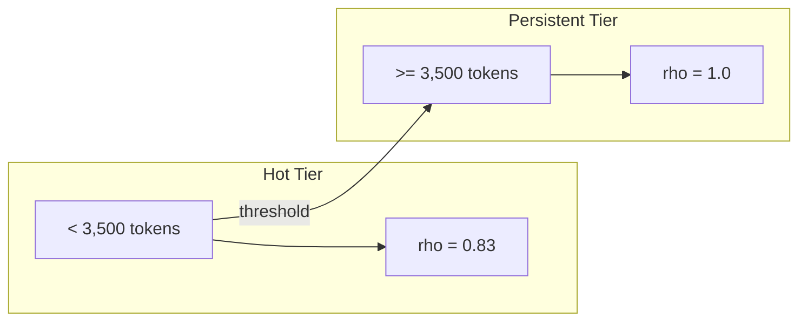
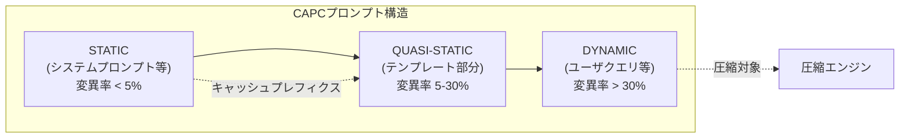

本記事は [Cache-Aware Prompt Compression: A Two-Tier Cost Model for LLM API Caching](https://arxiv.org/abs/2607.15516) の解説記事です。

## 論文概要（Abstract）

LLMの本番デプロイにおいて、プロンプトキャッシュとプロンプト圧縮を組み合わせたコスト削減戦略を体系的に分析した論文である。著者は、AnthropicのSonnetモデルが約3,500トークンを境界とする2層キャッシュアーキテクチャを採用していることを実証的に明らかにし、この特性を考慮したCAPCアルゴリズム（Cache-Aware Prompt Compression）を提案している。CAPCはキャッシュのみの手法に対して平均49%、クエリ対応圧縮に対して64%のコスト削減を達成したと報告されている。

この記事は [Zenn記事: Fable 5.1×プロンプトキャッシュでモノレポPRレビューコスト75%削減](https://zenn.dev/0h_n0/articles/7bfc9a6bf7c6ae) の深掘りです。

## 情報源

- **arXiv ID**: 2607.15516
- **URL**: [https://arxiv.org/abs/2607.15516](https://arxiv.org/abs/2607.15516)
- **著者**: Yan Song
- **発表年**: 2026
- **分野**: cs.LG, cs.AI

## 背景と動機（Background & Motivation）

LLM APIの料金体系では、入力トークン数に比例した課金が行われる。大規模なシステムプロンプトやRAG（Retrieval-Augmented Generation）のコンテキストを含むプロンプトでは、入力トークン数が数万〜数十万に達し、コストが急速に増大する。例えば、94,000トークンのシステムプロンプトを持つエンタープライズツールアシスタントでは、1日1,000回の呼び出しだけで入力トークンコストが数百ドルに達する計算になる。

この問題に対して、主に2つのアプローチが提案されてきた。

1. **プロンプトキャッシュ**: プロバイダ側のキャッシュ機構を利用し、繰り返し送信されるプロンプトプレフィクスの読み込みコストを削減する。Anthropicのプロンプトキャッシュでは、キャッシュヒット時の読み込み単価がベース入力単価の10分の1まで下がる。2026年9月時点のSonnet 4.6では、入力$3/MTok、キャッシュ書き込み$3.75/MTok、キャッシュ読み込み$0.30/MTokという料金体系である
2. **プロンプト圧縮**: LLMLingua等のツールを用いて冗長なトークンを削除し、入力トークン数自体を削減する。圧縮比は手法やドメインにより異なるが、一般的に2倍〜10倍程度の圧縮が可能とされている

しかし、著者はこの2つのアプローチが単純に組み合わせられるものではないと指摘している。プロンプト圧縮によりトークン数を削減すると、プロバイダ側のキャッシュ閾値（本論文で発見された3,500トークン境界）を下回ってしまい、高いキャッシュヒット率を実現するPersistent tierからHot tierに降格してしまう場合がある。Hot tierではキャッシュヒット率が$\rho \approx 0.83$にとどまるため、キャッシュの恩恵が大幅に減少する。この相互作用を定量的にモデル化し、圧縮とキャッシュの最適な組み合わせ戦略を導出することが本論文の動機である。

著者は、この問題を「圧縮すればトークンコストは下がるが、キャッシュ効率が低下する可能性がある」という二律背反として捉え、両者を同一のコストモデルで統一的に評価する枠組みの必要性を主張している。

## 主要な貢献（Key Contributions）

- **2層キャッシュアーキテクチャの実証的発見**: AnthropicのSonnetモデルにおいて、約3,500トークンを境界としたHot tier（短期キャッシュ、$\rho \approx 0.83$）とPersistent tier（長期キャッシュ、$\rho \approx 1.0$）の2層構造を実験的に明らかにした
- **統一コストモデルの定式化**: Vanilla（キャッシュなし）、Cache-only、Query-aware圧縮、CAPCの4戦略を同一の数学的フレームワークで比較可能なコストモデルを構築した
- **CAPCアルゴリズムの提案**: キャッシュ境界を考慮した適応的プロンプト圧縮により、キャッシュヒット率を維持しつつトークン数を削減する手法を提案した
- **AdaptiveCacheBoundary**: プロンプト中の各文を変異率に基づきSTATIC/QUASI/DYNAMICに分類し、キャッシュ効率を最大化する動的境界決定アルゴリズムを導入した

## 技術的詳細（Technical Details）

### 2層キャッシュアーキテクチャ

著者は、AnthropicのSonnetモデルに対して異なるプロンプト長で繰り返しリクエストを送り、キャッシュヒット率 $\rho$ を計測する実験を行っている。その結果、キャッシュヒット率に明確な2段階の遷移が観測された。



- **Hot tier**: プロンプト長が3,500トークン未満の場合。キャッシュヒット率は $\rho \approx 0.83$ と不安定で、TTL（Time-to-Live）が短い短期キャッシュに相当する。連続リクエスト間でもキャッシュミスが発生し得るため、コスト削減効果が限定的となる
- **Persistent tier**: プロンプト長が3,500トークン以上の場合。キャッシュヒット率は $\rho \approx 1.0$ に達し、安定した長期キャッシュに相当する。一度キャッシュに書き込まれたプレフィクスは高い確率で再利用され、以降のリクエストでは読み込み単価（$0.30/MTok）のみが課金される

この閾値の存在は、プロバイダ側のキャッシュ設計がプロンプト長に応じて異なるストレージ層（おそらくインメモリキャッシュとディスクベースキャッシュ等）を使い分けていることを示唆している。著者は、この2層構造がAnthropicの内部実装の詳細ではなく、外部からのAPIコスト観測のみによって実証的に発見されたものであることを強調している。これはブラックボックスなAPI越しでもキャッシュ特性をリバースエンジニアリングできることを意味し、他のプロバイダのAPIに対しても同様の分析手法が適用可能である。

### コストモデルの定式化

著者は、$N$ 回のAPIコールに対する4つの戦略のコストを以下のように定式化している。

**変数定義**:
- $N$: APIコール回数
- $|D|$: ドキュメント（プロンプトプレフィクス）のトークン数
- $D_q$: クエリ（可変部分）のトークン数
- $O$: 出力トークン数
- $p_{\text{in}}$: 入力トークン単価
- $p_{\text{out}}$: 出力トークン単価
- $c_w$: キャッシュ書き込み単価
- $c_r$: キャッシュ読み込み単価
- $\rho$: キャッシュヒット率
- $r$: 圧縮比（$r > 1$ で圧縮されたことを意味する）

**Vanilla（キャッシュなし・圧縮なし）**:

$$
\text{cost}_A = N \left[ (|D| + D_q) \cdot p_{\text{in}} + O \cdot p_{\text{out}} \right]
$$

全てのトークンが毎回入力単価で課金される。キャッシュも圧縮も使用しないため、最もコストが高い戦略である。ベースラインとして他の戦略との比較に用いる。

**Cache-only（キャッシュのみ）**:

$$
\text{cost}_B = N \left[ (1 - \rho) \cdot |D| \cdot c_w + \rho \cdot |D| \cdot c_r + D_q \cdot p_{\text{in}} + O \cdot p_{\text{out}} \right]
$$

初回リクエスト（キャッシュミス時）ではキャッシュ書き込み単価 $c_w$ が課金され、2回目以降のリクエスト（キャッシュヒット時）では読み込み単価 $c_r$（書き込みの約12.5分の1）が適用される。ドキュメント部分のトークン数は圧縮されないため $|D|$ のままである。

**CAPC（キャッシュ対応圧縮）**:

$$
\text{cost}_D = N \left[ (1 - \rho) \cdot \frac{|D|}{r} \cdot c_w + \rho \cdot \frac{|D|}{r} \cdot c_r + D_q \cdot p_{\text{in}} + O \cdot p_{\text{out}} \right]
$$

CAPCでは圧縮比 $r$ によりドキュメント部分のトークン数が $|D|/r$ に削減され、その圧縮後のプロンプトに対してキャッシュが適用される。圧縮によるトークン数削減とキャッシュによる単価削減の両方の恩恵を同時に受けるため、最もコスト効率の高い戦略となる。ただし、圧縮後のトークン数がPersistent tierの閾値を下回らないよう制約を設ける必要がある。

### 交差点分析（Crossover Analysis）

Cache-onlyとQuery-aware圧縮（キャッシュなし）のコストが等しくなるキャッシュヒット率 $\rho_{\text{cross}}$ は以下で与えられる。

$$
\rho_{\text{cross}}(r) = \frac{c_w - p_{\text{in}} / r}{c_w - c_r}
$$

ここで、
- $c_w$: キャッシュ書き込み単価
- $c_r$: キャッシュ読み込み単価
- $p_{\text{in}}$: 入力トークン単価
- $r$: 圧縮比

著者は、Sonnet 4.6の料金体系（2026年9月時点）で $r \geq 6$ の場合、$\rho_{\text{cross}} = 0.942$ となり、これはPersistent tierで達成可能なキャッシュヒット率の上限（約0.89、実測プラトー値）を超えると報告している。この結果は実務的に重要な意味を持つ。すなわち、6倍以上の圧縮比が達成可能な場合、Query-aware圧縮単体でもCache-only戦略を上回るコスト効率を実現でき、キャッシュとの組み合わせは不要であることを意味する。逆に、圧縮比が低い場合（$r < 6$）はキャッシュとの組み合わせ（CAPC）が必要になる。この交差点分析により、プロンプトの特性（圧縮可能性）に応じた最適戦略の選択が数式的に導出可能となる。

### Tier-Preserving制約

CAPCの重要な設計原理として、圧縮後のプロンプト長がPersistent tierの閾値（3,500トークン）を下回らないようにする制約がある。

$$
r_{\text{max\_safe}}(|D|) = \left\lfloor \frac{|D|}{3500} \right\rfloor
$$

例えば、$|D| = 10{,}000$ トークンのプロンプトの場合、$r_{\text{max\_safe}} = \lfloor 10000 / 3500 \rfloor = 2$ となり、最大でも半分までしか圧縮できない。一方、$|D| = 94{,}000$ トークンの場合は $r_{\text{max\_safe}} = 26$ となり、大幅な圧縮が可能である。この制約により、圧縮によってキャッシュ層がPersistent tierからHot tierに降格することを確実に防ぐ。プロンプトが長いほど圧縮の自由度が高くなるという直感的にも自然な特性を、数式として明確に表現している。

### AdaptiveCacheBoundary

CAPCでは、プロンプト中の各文を変異率に基づいて3つのカテゴリに分類する。

| カテゴリ | 変異率 | 処理 |
|---------|-------|------|
| STATIC | < 5% | キャッシュプレフィクスに配置。圧縮は最小限 |
| QUASI-STATIC | 5% - 30% | テンプレート化してキャッシュ効率を向上 |
| DYNAMIC | > 30% | 積極的に圧縮。キャッシュプレフィクスの外に配置 |

変異率は、同一タスクの過去リクエストにおける各文の変化頻度から算出される。具体的には、過去 $k$ 回のリクエストで同一位置の文がどの程度変化したかを計測し、変化したリクエスト数を $k$ で割った値を変異率とする。

CAPCのプロンプト再構成では、STATIC部分をプロンプトの先頭に集約し、QUASI-STATIC部分を中間に、DYNAMIC部分を末尾に配置する。これにより、キャッシュプレフィクス（先頭からの連続した不変部分）の長さを最大化しつつ、DYNAMIC部分の圧縮により全体のトークン数を削減する。キャッシュはプレフィクス一致で動作するため、不変部分を先頭に集めることがキャッシュ効率の向上に直結する。



## 実装のポイント（Implementation）

### CAPCコストモデルの実装

以下に、論文で定式化されたコストモデルを計算するPython実装を示す。

```python
from dataclasses import dataclass
from enum import Enum


class CacheTier(Enum):
    """キャッシュ層の種別"""
    HOT = "hot"           # < 3,500 tokens, rho ~ 0.83
    PERSISTENT = "persistent"  # >= 3,500 tokens, rho ~ 1.0


@dataclass(frozen=True)
class PricingConfig:
    """LLM API料金設定（2026年9月時点のSonnet 4.6想定）

    Attributes:
        p_in: 入力トークン単価（$/token）
        p_out: 出力トークン単価（$/token）
        c_w: キャッシュ書き込み単価（$/token）
        c_r: キャッシュ読み込み単価（$/token）
        hot_threshold: Hot/Persistent tier境界トークン数
        rho_hot: Hot tierのキャッシュヒット率
        rho_persistent: Persistent tierのキャッシュヒット率
    """
    p_in: float = 3.0e-6      # $3/MTok
    p_out: float = 15.0e-6    # $15/MTok
    c_w: float = 3.75e-6      # $3.75/MTok (書き込み: 1.25x入力)
    c_r: float = 0.30e-6      # $0.30/MTok (読み込み: 0.1x入力)
    hot_threshold: int = 3500
    rho_hot: float = 0.83
    rho_persistent: float = 1.0


def get_cache_tier(token_count: int, config: PricingConfig) -> CacheTier:
    """トークン数に基づきキャッシュ層を判定する

    Args:
        token_count: プロンプトプレフィクスのトークン数
        config: 料金設定

    Returns:
        対応するキャッシュ層
    """
    if token_count >= config.hot_threshold:
        return CacheTier.PERSISTENT
    return CacheTier.HOT


def get_hit_rate(token_count: int, config: PricingConfig) -> float:
    """トークン数に基づきキャッシュヒット率を返す

    Args:
        token_count: プロンプトプレフィクスのトークン数
        config: 料金設定

    Returns:
        キャッシュヒット率 rho
    """
    tier = get_cache_tier(token_count, config)
    if tier == CacheTier.PERSISTENT:
        return config.rho_persistent
    return config.rho_hot


def cost_vanilla(
    n_calls: int,
    doc_tokens: int,
    query_tokens: int,
    output_tokens: int,
    config: PricingConfig,
) -> float:
    """Vanilla戦略（キャッシュなし・圧縮なし）のコストを計算する

    Args:
        n_calls: APIコール回数
        doc_tokens: ドキュメント部分のトークン数 |D|
        query_tokens: クエリ部分のトークン数 D_q
        output_tokens: 出力トークン数 O
        config: 料金設定

    Returns:
        総コスト（USD）
    """
    return n_calls * (
        (doc_tokens + query_tokens) * config.p_in
        + output_tokens * config.p_out
    )


def cost_cache_only(
    n_calls: int,
    doc_tokens: int,
    query_tokens: int,
    output_tokens: int,
    config: PricingConfig,
) -> float:
    """Cache-only戦略のコストを計算する

    Args:
        n_calls: APIコール回数
        doc_tokens: ドキュメント部分のトークン数 |D|
        query_tokens: クエリ部分のトークン数 D_q
        output_tokens: 出力トークン数 O
        config: 料金設定

    Returns:
        総コスト（USD）
    """
    rho = get_hit_rate(doc_tokens, config)
    return n_calls * (
        (1 - rho) * doc_tokens * config.c_w
        + rho * doc_tokens * config.c_r
        + query_tokens * config.p_in
        + output_tokens * config.p_out
    )


def cost_capc(
    n_calls: int,
    doc_tokens: int,
    query_tokens: int,
    output_tokens: int,
    compression_ratio: float,
    config: PricingConfig,
) -> float:
    """CAPC戦略のコストを計算する

    圧縮後もPersistent tierを維持できるか検証し、
    tier降格が発生する場合はHot tierのヒット率を適用する。

    Args:
        n_calls: APIコール回数
        doc_tokens: ドキュメント部分のトークン数 |D|
        query_tokens: クエリ部分のトークン数 D_q
        output_tokens: 出力トークン数 O
        compression_ratio: 圧縮比 r (r > 1で圧縮)
        config: 料金設定

    Returns:
        総コスト（USD）
    """
    compressed_tokens = int(doc_tokens / compression_ratio)
    rho = get_hit_rate(compressed_tokens, config)
    return n_calls * (
        (1 - rho) * compressed_tokens * config.c_w
        + rho * compressed_tokens * config.c_r
        + query_tokens * config.p_in
        + output_tokens * config.p_out
    )


def max_safe_ratio(doc_tokens: int, threshold: int = 3500) -> int:
    """Persistent tierを維持する最大圧縮比を計算する

    Args:
        doc_tokens: 元のドキュメントトークン数
        threshold: Persistent tier閾値（デフォルト3,500）

    Returns:
        安全な最大圧縮比 r_max_safe
    """
    return doc_tokens // threshold


def crossover_hit_rate(
    compression_ratio: float,
    config: PricingConfig,
) -> float:
    """Cache-onlyとQuery-aware圧縮が等コストとなるキャッシュヒット率を計算する

    Args:
        compression_ratio: 圧縮比 r
        config: 料金設定

    Returns:
        交差キャッシュヒット率 rho_cross
    """
    numerator = config.c_w - config.p_in / compression_ratio
    denominator = config.c_w - config.c_r
    return numerator / denominator
```

### 使用例

```python
def main() -> None:
    """コストモデル比較のデモンストレーション"""
    config = PricingConfig()

    # Enterprise tool-using assistant: 94kトークンプレフィクス
    doc_tokens = 94_000
    query_tokens = 500
    output_tokens = 2_000
    n_calls = 1_000

    vanilla = cost_vanilla(n_calls, doc_tokens, query_tokens, output_tokens, config)
    cache = cost_cache_only(n_calls, doc_tokens, query_tokens, output_tokens, config)

    # CAPC: 圧縮比2.0（tier-preserving制約内）
    r_safe = max_safe_ratio(doc_tokens)  # 94000 // 3500 = 26
    capc = cost_capc(n_calls, doc_tokens, query_tokens, output_tokens, 2.0, config)

    print(f"Vanilla:    ${vanilla:.2f}")
    print(f"Cache-only: ${cache:.2f}")
    print(f"CAPC (r=2): ${capc:.2f}")
    print(f"Max safe r: {r_safe}")
    print(f"CAPC savings vs cache-only: {(1 - capc / cache) * 100:.1f}%")


if __name__ == "__main__":
    main()
```

### AdaptiveCacheBoundary分類器の実装

```python
from dataclasses import dataclass


class MutationCategory(Enum):
    """文の変異カテゴリ"""
    STATIC = "static"        # 変異率 < 5%
    QUASI = "quasi_static"   # 変異率 5-30%
    DYNAMIC = "dynamic"      # 変異率 > 30%


@dataclass
class SentenceClassification:
    """文の分類結果

    Attributes:
        text: 文のテキスト
        mutation_rate: 変異率（0.0 - 1.0）
        category: 変異カテゴリ
    """
    text: str
    mutation_rate: float
    category: MutationCategory


def classify_sentence(mutation_rate: float) -> MutationCategory:
    """変異率に基づき文をカテゴリに分類する

    Args:
        mutation_rate: 過去リクエストにおける文の変異率（0.0-1.0）

    Returns:
        対応する変異カテゴリ
    """
    if mutation_rate < 0.05:
        return MutationCategory.STATIC
    elif mutation_rate <= 0.30:
        return MutationCategory.QUASI
    return MutationCategory.DYNAMIC


def reorder_prompt_sections(
    classifications: list[SentenceClassification],
) -> list[SentenceClassification]:
    """CAPCのプロンプト再構成: STATIC -> QUASI -> DYNAMIC順に並べ替える

    キャッシュプレフィクスの長さを最大化するため、
    変異率の低い文を先頭に配置する。

    Args:
        classifications: 文の分類結果リスト

    Returns:
        再構成された分類結果リスト
    """
    category_order = {
        MutationCategory.STATIC: 0,
        MutationCategory.QUASI: 1,
        MutationCategory.DYNAMIC: 2,
    }
    return sorted(
        classifications,
        key=lambda c: (category_order[c.category], c.mutation_rate),
    )
```

## Production Deployment Guide

### AWS実装パターン（コスト最適化重視）

CAPCを活用したLLM APIコスト最適化をAWSにデプロイする場合の構成を示す。以下のコスト試算は2026年9月時点のAWS ap-northeast-1（東京）リージョン料金に基づく概算値であり、実際のコストはトラフィックパターン、リージョン、バースト使用量により変動する。最新料金はAWS料金計算ツールで確認を推奨する。

| 構成 | トラフィック | インフラ | 月額概算 |
|------|------------|---------|---------|
| Small | ~500 req/日 | Lambda + API Gateway + DynamoDB | $50-150 |
| Medium | ~5,000 req/日 | ECS Fargate + ElastiCache Redis | $300-800 |
| Large | 50,000+ req/日 | EKS + ElastiCache + Step Functions | $1,500-4,000 |

**Small構成**: Lambda関数でCAPCのプロンプト分類・圧縮・キャッシュ管理を実行する。DynamoDBに過去リクエストの変異率データを保持し、AdaptiveCacheBoundaryの分類に利用する。LLM API呼び出しはAnthropicのAPIを直接利用し、プロンプトキャッシュのプレフィクス設計をCAPCに基づき最適化する。

**Medium構成**: ECS Fargateでプロンプト前処理サービスを常時稼働する。ElastiCache Redisで変異率データとプロンプトテンプレートをキャッシュし、リクエストごとの分類レイテンシを最小化する。バッチ処理にはStep Functionsを利用する。

**Large構成**: EKS上でマイクロサービスアーキテクチャを構築する。プロンプト分類、圧縮、キャッシュ管理を独立サービスとしてデプロイし、Karpenterで自動スケーリングする。

### Terraformインフラコード

**Small構成（Lambda + DynamoDB）**:

```hcl
# CAPC プロンプト最適化 Lambda構成
# 低〜中トラフィック向け: ~500 req/日

terraform {
  required_version = ">= 1.9"
  required_providers {
    aws = {
      source  = "hashicorp/aws"
      version = "~> 5.70"
    }
  }
}

provider "aws" {
  region = "ap-northeast-1"
}

# --- DynamoDB: 変異率データ ---
resource "aws_dynamodb_table" "mutation_rates" {
  name         = "capc-mutation-rates"
  billing_mode = "PAY_PER_REQUEST"
  hash_key     = "prompt_template_id"
  range_key    = "sentence_hash"

  attribute {
    name = "prompt_template_id"
    type = "S"
  }
  attribute {
    name = "sentence_hash"
    type = "S"
  }

  ttl {
    attribute_name = "expires_at"
    enabled        = true
  }

  tags = {
    Project     = "capc-optimizer"
    Environment = "production"
  }
}

# --- IAM ---
resource "aws_iam_role" "capc_lambda" {
  name = "capc-lambda-execution-role"
  assume_role_policy = jsonencode({
    Version = "2012-10-17"
    Statement = [{
      Action    = "sts:AssumeRole"
      Effect    = "Allow"
      Principal = { Service = "lambda.amazonaws.com" }
    }]
  })
}

resource "aws_iam_role_policy" "capc_lambda_policy" {
  name = "capc-lambda-policy"
  role = aws_iam_role.capc_lambda.id
  policy = jsonencode({
    Version = "2012-10-17"
    Statement = [
      {
        Effect   = "Allow"
        Action   = ["dynamodb:GetItem", "dynamodb:PutItem", "dynamodb:UpdateItem", "dynamodb:Query"]
        Resource = aws_dynamodb_table.mutation_rates.arn
      },
      {
        Effect   = "Allow"
        Action   = ["logs:CreateLogGroup", "logs:CreateLogStream", "logs:PutLogEvents"]
        Resource = "arn:aws:logs:*:*:*"
      },
      {
        Effect   = "Allow"
        Action   = ["secretsmanager:GetSecretValue"]
        Resource = aws_secretsmanager_secret.anthropic_api_key.arn
      }
    ]
  })
}

# --- Secrets Manager: API Key ---
resource "aws_secretsmanager_secret" "anthropic_api_key" {
  name = "capc/anthropic-api-key"
}

# --- Lambda Function ---
resource "aws_lambda_function" "capc_optimizer" {
  function_name = "capc-prompt-optimizer"
  runtime       = "python3.12"
  handler       = "handler.lambda_handler"
  role          = aws_iam_role.capc_lambda.arn
  timeout       = 120
  memory_size   = 512

  filename         = "lambda_package.zip"
  source_code_hash = filebase64sha256("lambda_package.zip")

  environment {
    variables = {
      MUTATION_TABLE     = aws_dynamodb_table.mutation_rates.name
      API_KEY_SECRET_ARN = aws_secretsmanager_secret.anthropic_api_key.arn
      CACHE_THRESHOLD    = "3500"   # Persistent tier閾値
      STATIC_THRESHOLD   = "0.05"   # STATIC判定閾値
      DYNAMIC_THRESHOLD  = "0.30"   # DYNAMIC判定閾値
    }
  }
}

# --- API Gateway ---
resource "aws_apigatewayv2_api" "capc" {
  name          = "capc-api"
  protocol_type = "HTTP"
}

resource "aws_apigatewayv2_integration" "capc_lambda" {
  api_id             = aws_apigatewayv2_api.capc.id
  integration_type   = "AWS_PROXY"
  integration_uri    = aws_lambda_function.capc_optimizer.invoke_arn
  payload_format_version = "2.0"
}

resource "aws_apigatewayv2_route" "capc_post" {
  api_id    = aws_apigatewayv2_api.capc.id
  route_key = "POST /optimize"
  target    = "integrations/${aws_apigatewayv2_integration.capc_lambda.id}"
}

resource "aws_apigatewayv2_stage" "default" {
  api_id      = aws_apigatewayv2_api.capc.id
  name        = "$default"
  auto_deploy = true
}

# --- CloudWatch アラーム ---
resource "aws_cloudwatch_metric_alarm" "lambda_errors" {
  alarm_name          = "capc-lambda-errors"
  comparison_operator = "GreaterThanThreshold"
  evaluation_periods  = 2
  metric_name         = "Errors"
  namespace           = "AWS/Lambda"
  period              = 300
  statistic           = "Sum"
  threshold           = 5
  alarm_description   = "CAPC Lambda関数のエラー検知"
  dimensions = {
    FunctionName = aws_lambda_function.capc_optimizer.function_name
  }
}
```

**Large構成（EKS + ElastiCache）**:

```hcl
# CAPC プロンプト最適化 EKS構成
# 高トラフィック向け: 50,000+ req/日

module "eks" {
  source  = "terraform-aws-modules/eks/aws"
  version = "~> 20.24"

  cluster_name    = "capc-optimizer-cluster"
  cluster_version = "1.31"
  subnet_ids      = module.vpc.private_subnets
  vpc_id          = module.vpc.vpc_id

  enable_irsa                    = true
  cluster_endpoint_public_access = false

  eks_managed_node_groups = {
    capc_workers = {
      instance_types = ["c7i.xlarge"]
      min_size       = 2
      max_size       = 8
      desired_size   = 3
    }
  }
}

# --- ElastiCache Redis: 変異率キャッシュ ---
resource "aws_elasticache_replication_group" "mutation_cache" {
  replication_group_id = "capc-mutation-cache"
  description          = "CAPC mutation rate and template cache"
  node_type            = "cache.r7g.large"
  num_cache_clusters   = 2  # Multi-AZ
  engine               = "redis"
  engine_version       = "7.1"
  port                 = 6379
  subnet_group_name    = aws_elasticache_subnet_group.private.name
  security_group_ids   = [aws_security_group.redis.id]

  at_rest_encryption_enabled = true
  transit_encryption_enabled = true
}

# --- AWS Budgets ---
resource "aws_budgets_budget" "capc_monthly" {
  name         = "capc-monthly-budget"
  budget_type  = "COST"
  limit_amount = "4000"
  limit_unit   = "USD"
  time_unit    = "MONTHLY"

  notification {
    comparison_operator       = "GREATER_THAN"
    threshold                 = 80
    threshold_type            = "PERCENTAGE"
    notification_type         = "ACTUAL"
    subscriber_email_addresses = ["ops-team@example.com"]
  }
}
```

### 運用・監視設定

**CloudWatch カスタムメトリクス（Python）**:

```python
import boto3
from datetime import datetime, timezone


def publish_capc_metrics(
    cache_hit_rate: float,
    compression_ratio: float,
    cost_savings_pct: float,
    tier: str,
) -> None:
    """CAPCの運用メトリクスをCloudWatchに送信する

    Args:
        cache_hit_rate: キャッシュヒット率（0.0-1.0）
        compression_ratio: 実効圧縮比
        cost_savings_pct: コスト削減率（%）
        tier: 適用されたキャッシュ層（"hot" or "persistent"）
    """
    cw = boto3.client("cloudwatch", region_name="ap-northeast-1")
    timestamp = datetime.now(timezone.utc)

    cw.put_metric_data(
        Namespace="CAPC/Optimizer",
        MetricData=[
            {
                "MetricName": "CacheHitRate",
                "Value": cache_hit_rate,
                "Timestamp": timestamp,
                "Unit": "None",
                "Dimensions": [{"Name": "CacheTier", "Value": tier}],
            },
            {
                "MetricName": "CompressionRatio",
                "Value": compression_ratio,
                "Timestamp": timestamp,
                "Unit": "None",
            },
            {
                "MetricName": "CostSavingsPercent",
                "Value": cost_savings_pct,
                "Timestamp": timestamp,
                "Unit": "Percent",
            },
        ],
    )
```

### コスト最適化チェックリスト

**プロンプト設計**:
- [ ] プロンプトプレフィクスを3,500トークン以上に維持し、Persistent tierを確保
- [ ] STATIC/QUASI/DYNAMICの境界を分析し、STATICセクションを先頭に配置
- [ ] `r_max_safe`を計算し、tier降格が発生しない圧縮比を設定
- [ ] AdaptiveCacheBoundaryの変異率閾値を運用データに基づきチューニング

**API呼び出し最適化**:
- [ ] バッチリクエストの並列度を調整し、キャッシュTTL内に後続リクエストが到達するよう設計
- [ ] キャッシュミス率をモニタリングし、Hot tier落ちの早期検知を設定
- [ ] 圧縮対象（DYNAMICセクション）の圧縮品質を定期的に検証

**インフラコスト**:
- [ ] Lambda: メモリサイズ最適化（Power Tuning実行）
- [ ] DynamoDB: PAY_PER_REQUESTからProvisionedへの移行検討（安定ワークロード時）
- [ ] ElastiCache: Reserved Nodes（1年）で最大40%削減
- [ ] EKS: Savings Plans（3年）で最大60%削減
- [ ] Spot Instances: ステートレスなプロンプト前処理ワーカーに適用

**監視・アラート**:
- [ ] CloudWatch: キャッシュヒット率・圧縮比・コスト削減率のカスタムメトリクス
- [ ] AWS Budgets: 月次予算アラート設定（80%/100%閾値）
- [ ] Cost Anomaly Detection有効化
- [ ] 日次コストレポート自動送信（SNS/Slack連携）
- [ ] API呼び出しエラー率・レイテンシP95アラーム

**リソース管理**:
- [ ] 不要なDynamoDBテーブル・Lambda関数の定期削除
- [ ] タグ戦略統一（Project/Environment/Owner必須）
- [ ] S3ライフサイクルポリシー（古いログ・変異率データの自動削除）
- [ ] 開発環境の夜間・週末自動停止

## 実験結果（Results）

### LongBench-v2での評価

著者はLongBench-v2ベンチマークでCAPCを評価し、各戦略のコスト削減率を比較している。

| 戦略 | Vanilla比削減率 | Cache-only比削減率 | Query-aware比削減率 |
|------|----------------|-------------------|-------------------|
| Cache-only | 79.9% | -- | -- |
| Query-aware圧縮 | 71.7% | -40.1% | -- |
| **CAPC** | **89.6%** | **48.5%** | **64.4%** |

論文Table 2より引用。CAPCはVanilla比で89.6%、Cache-only比で48.5%、Query-aware圧縮比で64.4%のコスト削減を達成している。

注目すべきは、Query-aware圧縮がCache-onlyに対してかえってコストが増加している点（-40.1%）である。これは、プロンプト圧縮によりトークン数がPersistent tierの3,500トークン閾値を下回り、キャッシュの恩恵を全く受けられなくなるケースが頻発するためである。このような逆転現象は、キャッシュと圧縮を独立に適用した場合の典型的な落とし穴であり、CAPCのTier-Preserving制約がこの問題を解決している。

### Enterprise Tool-Using Assistantでの検証

94,000トークンのシステムプロンプトを持つEnterprise tool-using assistantでの検証では、以下の結果が得られている。

| メトリクス | 値 |
|-----------|-----|
| プロンプトプレフィクス | 94,000 tokens |
| コスト削減率（vs Vanilla） | 51.7% |
| タスク性能の低下 | なし |

### Knowledge-Graph RAGでの検証

RAG（Retrieval-Augmented Generation）シナリオでは、検索結果のコンテキストがクエリごとに動的に変化するため、プロンプト全体をキャッシュすることが困難であり、キャッシュ効率が低下しやすい。従来のアプローチでは、検索結果を含むプロンプト全体をキャッシュ対象とするか、キャッシュを諦めて圧縮のみを行うかの二択であった。

著者は、CAPCのAdaptiveCacheBoundaryをRAGパイプラインに適用することで、この問題を解決している。具体的には、知識グラフのスキーマ定義やシステムプロンプト（変異率が極めて低い）をSTATICとして分類してキャッシュプレフィクスに固定し、検索結果のコンテキスト（クエリごとに変化する）をDYNAMICとして圧縮対象にする。この戦略により、cache-all（全体をキャッシュ対象にする）比で9.3倍のコスト削減を達成したと報告されている。RAGにおけるこの大幅な削減は、検索結果部分が通常プロンプトの大部分を占めるため、DYNAMIC領域の圧縮効果が顕著に現れることに起因する。

### tau-bench Retailでの品質検証

コスト削減がタスク品質を犠牲にしていないかを検証するため、tau-bench Retailベンチマーク（小売業務の対話エージェント評価）での実験が行われている。このベンチマークでは、商品検索、注文処理、返品対応等の実際の小売業務シナリオにおいてエージェントの正確性を評価する。

| 戦略 | Reward (/ 50) | コスト削減率 |
|------|--------------|-------------|
| Vanilla | 36 | -- |
| CAPC | 36 | 7.9% |

CAPCはVanillaと同一のReward（36/50）を維持しつつ、7.9%のコスト削減を達成している。このベンチマークはプロンプト長が比較的短いため、LongBench-v2ほどの大幅な削減は得られないが、品質を損なわないことが確認されている。

### 実験コスト

著者は論文中の全実験にかかった総コストが$98.96であったと明示しており、研究の再現可能性と透明性に配慮している。この金額はLLM API研究として比較的低コストであり、個人研究者や小規模チームでも追試が可能な範囲である。コスト透明性の明示は、LLM関連研究における良い慣行として評価できる。

## 実運用への応用（Practical Applications）

本論文のCAPCアルゴリズムは、関連するZenn記事で取り上げているモノレポPRレビューのコスト削減と直接的な関連がある。

**モノレポPRレビューへの適用**: CI/CDパイプラインでのPRレビューでは、レビュー指針（STATIC）、リポジトリ構造の説明（QUASI-STATIC）、差分コード（DYNAMIC）という典型的な3層構造が存在する。CAPCのAdaptiveCacheBoundaryを適用し、レビュー指針とリポジトリ構造をキャッシュプレフィクスに固定し、差分コードのみを圧縮対象とすることで、Zenn記事で報告されている75%のコスト削減をさらに改善できる可能性がある。特にモノレポでは複数のPRが同一のレビュー指針を共有するため、STATIC部分の再利用率が高く、CAPCの効果が顕著に現れると考えられる。

**Tier-Preserving制約の実務的意味**: PRレビュープロンプトのシステムプロンプト部分が3,500トークン未満の場合、Hot tierに留まりキャッシュヒット率が$\rho \approx 0.83$に低下する。レビューガイドラインを意図的に3,500トークン以上に設計する（例: 詳細なコーディング規約、アーキテクチャガイド、セキュリティチェックリスト等を含める）ことで、Persistent tierの安定したキャッシュヒット率（$\rho \approx 1.0$）を確保できる。この設計指針は、「プロンプトを短くすることが常に最適ではない」という直感に反する知見を提供している。

**GitHub Actionsとの統合パターン**: Zenn記事で紹介されているGitHub ActionsベースのPRレビューワークフローにCAPCを組み込む場合、ワークフロー起動時にDynamoDB（またはRedis）から過去のPRレビューログを取得し、プロンプト各部の変異率を計算してSTATIC/QUASI/DYNAMICの分類を行い、最適な圧縮比 $r$ を $r_{\text{max\_safe}}$ 以下に設定するという手順が考えられる。この前処理はLambda関数として実装でき、API呼び出し前に数十ミリ秒で完了する。

**制約と限界**: CAPCはプロンプトの構造が安定しており、繰り返し同様のパターンでAPIが呼び出される場合に効果的である。毎回大幅に異なるプロンプト構造を持つタスク（例: 一回限りのアドホックな質問応答）では、過去の変異率データが蓄積されていないため、AdaptiveCacheBoundaryの分類精度が低下する。また、3,500トークンという閾値はAnthropicのSonnetモデルで実験的に観測された値であり、他のモデル（Claude Opusやhaiku等）やOpenAI等の他プロバイダでは異なる閾値を持つ可能性がある。著者自身もこの点を論文中で制約として明記している。

## 関連研究（Related Work）

- **LLMLingua (Jiang et al., 2023)**: プロンプト圧縮の代表的手法。小規模言語モデルを用いてトークンの情報量（パープレキシティ）を推定し、冗長なトークンを除去することでプロンプトを圧縮する。CAPCはLLMLinguaをベースの圧縮エンジンとして利用しつつ、キャッシュ層の境界を考慮した適応的な圧縮制御を追加している。LLMLingua単体ではキャッシュとの相互作用を考慮しないため、圧縮によりキャッシュ効率が低下するケースが発生する
- **Selective Context (Li et al., 2023)**: 自己情報量（self-information）に基づく文脈選択手法。プロンプト全体を一律に圧縮するのではなく、情報量の低い文脈を選択的に除去する。CAPCのDYNAMIC領域の圧縮戦略と類似のアプローチであるが、キャッシュ境界を意識した圧縮制約は持たない
- **Prompt Caching (Anthropic, 2024)**: AnthropicのAPI機能として提供されるプロンプトキャッシュ機構。プロンプトの先頭部分（プレフィクス）をキャッシュに保存し、後続のリクエストで再利用することで入力コストを削減する。本論文はこのキャッシュ機構の内部構造（2層アーキテクチャとその閾値）を外部からの観測により実験的に明らかにし、その特性を活用した戦略的コスト最適化手法を提案している

## まとめと今後の展望

本論文は、LLM APIのプロンプトキャッシュとプロンプト圧縮を統合的に最適化するCAPCアルゴリズムを提案し、2層キャッシュアーキテクチャの実証的発見に基づく理論的コストモデルを構築した。Persistent tierの3,500トークン閾値という実証的発見と、$r_{\text{max\_safe}}$ によるTier-Preserving制約の導出は、プロンプト設計の実務指針として直接活用できる。LongBench-v2でVanilla比89.6%、Cache-only比48.5%のコスト削減を達成し、tau-bench Retailではタスク品質を維持しつつ7.9%の削減を実現したことは、実用性の高さを裏付けている。

今後の課題として、著者はモデルプロバイダのキャッシュアーキテクチャがアップデートされた場合の適応的閾値検出、圧縮による品質劣化の体系的な定量評価フレームワーク、マルチターン対話におけるCAPCの最適化などを挙げている。プロンプトキャッシュの料金体系と内部アーキテクチャがプロバイダ間で標準化されていない現状では、プロバイダ固有のキャッシュ特性を動的に検出し、それに応じて圧縮戦略を自動調整する仕組みが実用上重要になると考えられる。また、マルチモーダルモデルにおけるキャッシュ挙動（画像トークンを含むプロンプトでの閾値変化等）の解明も今後の興味深い研究方向である。

## 参考文献

- **arXiv**: [https://arxiv.org/abs/2607.15516](https://arxiv.org/abs/2607.15516)
- **LLMLingua**: [https://arxiv.org/abs/2310.05736](https://arxiv.org/abs/2310.05736)
- **Anthropic Prompt Caching**: [https://docs.anthropic.com/en/docs/build-with-claude/prompt-caching](https://docs.anthropic.com/en/docs/build-with-claude/prompt-caching)
- **Related Zenn article**: [https://zenn.dev/0h_n0/articles/7bfc9a6bf7c6ae](https://zenn.dev/0h_n0/articles/7bfc9a6bf7c6ae)
