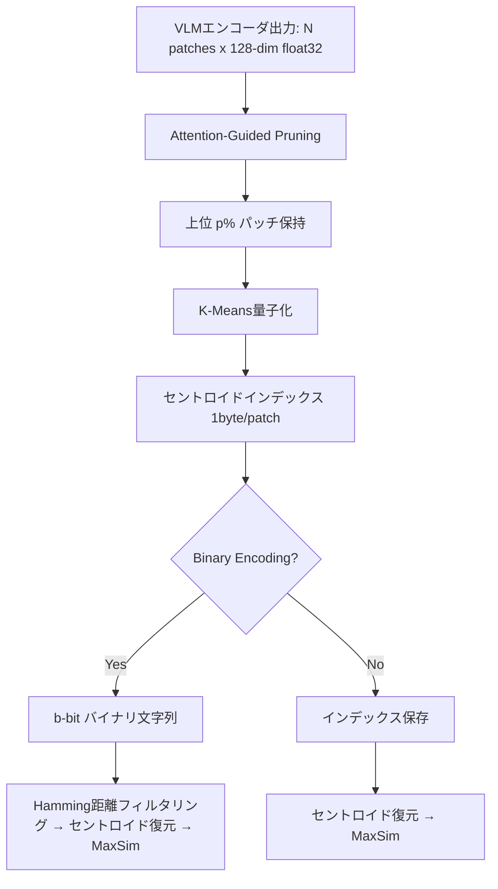

本記事は [Hierarchical Patch Compression for ColPali: Efficient Multi-Vector Document Retrieval with Dynamic Pruning and Quantization](https://arxiv.org/abs/2506.21601) の解説記事です。

## 論文概要

ColPaliはVision-Language Model（VLM）を用いてページ画像をパッチ単位のマルチベクトル表現に変換し、late-interactionスコアリングで文書検索を行う手法である。高い検索精度を実現する一方、パッチ数に比例したストレージコストと二次的な計算量がスケーリングの障壁となっていた。著者であるBachは、K-Means量子化・attention誘導動的プルーニング・オプショナルバイナリエンコーディングの3技法を階層的に統合したHPC-ColPali（Hierarchical Patch Compression for ColPali）フレームワークを提案している。ViDoReベンチマークにおいて、nDCG@10の低下を2%未満に抑えつつ、ストレージ32--57倍圧縮、クエリレイテンシ50%削減を達成したと報告されている（論文Table I, III, IV）。

この記事は [Zenn記事: ColPali×VLMリランカーで設計図面PDFの検索基盤を構築しページ単位再現率を改善する](https://zenn.dev/0h_n0/articles/e2d064c1432593) の深掘りです。

## 情報源

- **arXiv ID**: 2506.21601
- **URL**: [https://arxiv.org/abs/2506.21601](https://arxiv.org/abs/2506.21601)
- **著者**: Duong Bach
- **初版**: 2025年6月19日（v2: 2025年7月2日）
- **分野**: cs.IR（Information Retrieval）, cs.CV（Computer Vision）

## 背景と動機

ColPaliは、文書ページの画像をVLMエンコーダに入力し、パッチごとの埋め込みベクトル群を生成する。検索時にはクエリトークンベクトルと全パッチベクトルのMaxSim（最大内積）を計算するlate-interaction方式を採用しており、テキスト抽出やOCRを介さず視覚的レイアウト情報を直接活用できる点が強みである。

しかし、1ページあたり1,024パッチ × 128次元（float32）= 512KBの埋め込みが生成されるため、100,000ページ規模のコレクションで2.56GBのストレージを消費する（論文Table III）。さらにlate-interactionのスコアリングはクエリトークン数 $M_q$ とパッチ数 $M_d$ の積 $O(M_q \cdot M_d)$ に比例し、大規模コレクションではクエリレイテンシが実用要件を超過する。

既存の圧縮手法としてDistilColが報告されているが、単一ベクトルへの蒸留によりnDCG@10が0.85から0.70へ大幅に低下する問題がある（論文Table I）。著者は、マルチベクトルの検索精度を維持しつつストレージと計算量を大幅に削減する階層的圧縮フレームワークが必要であると主張している。

## 主要な貢献

- **K-Means量子化によるストレージ圧縮**: 128次元float32ベクトル（512バイト）を $K$ 個のセントロイドへのインデックス（1バイト）に変換し、32倍のストレージ削減を達成（$K \in \{128, 256, 512\}$）
- **Attention-Guided Dynamic Pruning**: VLMエンコーダのattention重みを活用し、情報量の低いパッチを動的に除去することで、late-interaction計算量を最大60%削減（保持率 $p \in \{40\%, 60\%, 80\%\}$）
- **Optional Binary Encoding**: セントロイドインデックスをビット文字列に変換し、Hamming距離によるサブリニア検索を実現（$K=512$ で9bit、57倍圧縮）
- **RAG統合での品質向上**: 圧縮ベクトル検索とVLMリランカーを組み合わせたRAGパイプラインにおいて、幻覚率を15%から10%へ削減（33%改善）

## 技術的詳細

### K-Means量子化

各文書ページのパッチ埋め込み集合 $\mathcal{E}_d = \{\mathbf{e}_1, \mathbf{e}_2, \ldots, \mathbf{e}_N\}$（$\mathbf{e}_i \in \mathbb{R}^{128}$）に対し、$K$ 個のセントロイド $\{\mathbf{c}_1, \ldots, \mathbf{c}_K\}$ をK-Meansクラスタリングで学習する。各パッチベクトルは最近傍セントロイドのインデックスに置換される：

$$
q(\mathbf{e}_i) = \arg\min_{k \in \{1,\ldots,K\}} \|\mathbf{e}_i - \mathbf{c}_k\|_2
$$

ここで、
- $\mathbf{e}_i$: $i$ 番目のパッチ埋め込み（128次元float32、512バイト）
- $\mathbf{c}_k$: $k$ 番目のセントロイドベクトル
- $q(\mathbf{e}_i)$: 量子化後のインデックス（1バイト、$K \leq 256$ の場合）

検索時には、インデックスからセントロイドベクトルを復元してlate-interactionスコアを計算する。コードブックサイズ $K$ はストレージ効率と近似精度のトレードオフを制御するハイパーパラメータであり、著者は $K=256$ を推奨構成としている。

### Attention-Guided Dynamic Pruning

VLMエンコーダの最終層attention重みを利用して、各パッチの情報量を推定する。パッチ $i$ の重要度スコア $\alpha_i$ は以下で定義される：

$$
\alpha_i = \frac{1}{H} \sum_{h=1}^{H} \text{Attn}^{(h)}_{[\text{CLS}], i}
$$

ここで、
- $H$: attention headの数
- $\text{Attn}^{(h)}_{[\text{CLS}], i}$: head $h$ における[CLS]トークンからパッチ $i$ へのattention重み

全パッチを $\alpha_i$ の降順にソートし、上位 $p\%$ のみを保持する：

$$
\mathcal{E}_d^{\text{pruned}} = \text{TopK}(\mathcal{E}_d, \lceil N \cdot p / 100 \rceil, \text{key}=\alpha)
$$

この手法は、背景領域やパディング部分など情報量の低いパッチを優先的に除去する。$p=60\%$ の設定で40%のパッチを削減しつつ、nDCG@10の低下を1ポイント未満に抑えている（論文Table I）。late-interaction計算量は $O(M_q \cdot N)$ から $O(M_q \cdot \lceil N \cdot p/100 \rceil)$ に削減される。

### Optional Binary Encoding

量子化インデックスを固定長ビット列に変換する追加オプションである。$K$ 個のセントロイドに対し、各インデックスを $b = \lceil \log_2 K \rceil$ ビットのバイナリ文字列にエンコードする（$K=512$ なら $b=9$）。検索時にはHamming距離を用いた高速なフィルタリングが可能になる：

$$
d_H(\mathbf{b}_i, \mathbf{b}_j) = \sum_{l=1}^{b} \mathbf{b}_i^{(l)} \oplus \mathbf{b}_j^{(l)}
$$

ここで $\oplus$ はXOR演算である。Hamming距離はCPUのPOPCNT命令で高速に計算でき、候補絞り込み（pre-filtering）に適している。ただし、最終スコアリングではセントロイドベクトルを復元する必要があるため、精度面ではK-Means量子化単体と同等になる。

### 3技法の階層的統合



まずpruningでパッチ数を削減し、残存パッチに対してK-Means量子化を適用する。さらにオプションでバイナリエンコーディングを重ねることで、圧縮率を段階的に高められる設計となっている。

## 実装のポイント

### コードブック学習の戦略

K-Meansのセントロイドはコレクション全体のパッチ埋め込みから学習する。著者は以下の点に注意が必要だと指摘している：

- **コードブックサイズの選択**: $K=256$ が精度・ストレージのバランスにおいて推奨される。$K=128$ では近似誤差が増加し、$K=512$ ではバイナリエンコーディング時のビット数が増える
- **コードブック陳腐化**: 文書コレクションの分布が変化した場合、セントロイドの再学習が必要になる。インクリメンタルな更新手法は論文では扱われていない
- **学習コスト**: 大規模コレクションでのK-Means学習はメモリと計算量を消費する。Mini-Batch K-Meansやサブサンプリングによるスケーリングが実務上必要になる

### Attention重み抽出

pruningに用いるattention重みはVLMエンコーダの推論時に追加コストなく取得できる。ただし、モデルアーキテクチャによってattention重みの出力形式が異なるため、エンコーダ実装に合わせたアダプタが必要である。

```python
import torch
import numpy as np
from sklearn.cluster import MiniBatchKMeans
from typing import Protocol


class VLMEncoder(Protocol):
    """VLMエンコーダのインターフェース"""

    def encode_page(
        self, image: torch.Tensor
    ) -> tuple[torch.Tensor, torch.Tensor]:
        """ページ画像からパッチ埋め込みとattention重みを返す

        Args:
            image: 入力画像テンソル (C, H, W)

        Returns:
            embeddings: パッチ埋め込み (N, D)
            attention_weights: CLS-to-patch attention (N,)
        """
        ...


def prune_and_quantize(
    embeddings: torch.Tensor,
    attention_weights: torch.Tensor,
    codebook: MiniBatchKMeans,
    keep_ratio: float = 0.6,
) -> np.ndarray:
    """Attention-guided pruning + K-Means量子化

    Args:
        embeddings: パッチ埋め込み (N, D)
        attention_weights: CLS-to-patch attention (N,)
        codebook: 学習済みK-Meansコードブック
        keep_ratio: 保持するパッチの割合 (0.0-1.0)

    Returns:
        quantized_indices: 量子化インデックス (N_pruned,)
    """
    n_patches = embeddings.shape[0]
    n_keep = int(n_patches * keep_ratio)

    # Attention重みで上位パッチを選択
    top_indices = torch.argsort(
        attention_weights, descending=True
    )[:n_keep]
    pruned = embeddings[top_indices].cpu().numpy()

    # K-Meansセントロイドへの割当
    quantized_indices = codebook.predict(pruned)
    return quantized_indices
```

### ハードウェア依存性

著者はバイナリエンコーディングによるHamming距離計算の高速化がCPUのPOPCNT命令に依存することを制限事項として挙げている。GPUベースの検索パイプラインではビット演算の恩恵が限定的であり、CUDA環境では量子化インデックスからセントロイドを復元する方式が現実的である。

## Production Deployment Guide

HPC-ColPaliの3技法（K-Means量子化・attention pruning・バイナリエンコーディング）を本番環境に組み込む圧縮ベクトル検索システムの構築ガイドを示す。

### AWS実装パターン（コスト最適化重視）

**トラフィック量別の推奨構成**:

| 規模 | 構成 | 月額概算 | 主要サービス |
|------|------|---------|-------------|
| Small (~100 req/日) | Serverless | $80--200 | Lambda + S3 + DynamoDB |
| Medium (~1,000 req/日) | Hybrid | $400--900 | ECS Fargate + ElastiCache + S3 |
| Large (10,000+ req/日) | Container | $2,500--5,500 | EKS + Spot + ElastiCache Cluster |

**Small構成（~100 req/日）**: Lambda関数でクエリを受け付け、S3に格納した量子化インデックスとコードブックをロードしてMaxSimスコアリングを実行する。DynamoDBにメタデータを格納し、コードブック（$K=256$ で128次元 × 256セントロイド = 128KB）はLambdaのメモリに常駐可能である。100,000ページの量子化インデックスは約80MBであり、S3からの読み込みも現実的なサイズに収まる。Lambda 512MB、タイムアウト30秒で月額$50--80、S3 + DynamoDB で$30--120程度を見込む。

**Medium構成（~1,000 req/日）**: ECS Fargateでエンコーダとスコアリングサービスを分離し、ElastiCache（Redis）にコードブックと頻出クエリの結果をキャッシュする。Fargateタスク（2vCPU, 4GB RAM）× 2台で月額$200--400、ElastiCache cache.t3.small で$50--100、S3 + CloudWatch等で$150--400。VLMエンコーダの推論にはGPUインスタンスが必要な場合、SageMaker Serverless Inferenceの利用も選択肢となる。

**Large構成（10,000+ req/日）**: EKSクラスタでスコアリングサービスをスケールアウトし、Karpenterによる自動スケーリングでSpot Instancesを優先配置する。量子化インデックスをElastiCache Cluster Mode（3シャード）に全量ロードし、レイテンシを最小化する。EKS + Spot（m6i.xlarge）で$1,000--2,500、ElastiCache Cluster で$500--1,200、VLMエンコーダ用GPU（g5.xlarge Spot）で$500--1,000、その他$500--800。

**コスト削減テクニック**:
- Spot Instancesをスコアリングノードに適用し最大90%削減（検索のステートレス性を活用）
- Reserved InstancesをElastiCacheに適用し最大72%削減
- HPC-ColPaliの32倍ストレージ圧縮によりS3/ElastiCacheコストを大幅に削減（フル精度2.56GB → 量子化0.08GBで100,000ページ）
- バイナリエンコーディング（57倍圧縮）でElastiCacheインスタンスサイズを1段階縮小可能

**コスト試算の注意事項**: 上記は2026年9月時点のAWS ap-northeast-1（東京）リージョン料金に基づく概算値である。実際のコストはトラフィックパターン、リージョン、バースト使用量により変動する。最新料金はAWS料金計算ツールで確認を推奨する。

### Terraformインフラコード

**Small構成（Serverless）**:

```hcl
# HPC-ColPali 圧縮ベクトル検索 - Small構成
# Lambda + S3 + DynamoDB

terraform {
  required_version = ">= 1.9"
  required_providers {
    aws = {
      source  = "hashicorp/aws"
      version = "~> 5.70"
    }
  }
}

provider "aws" {
  region = "ap-northeast-1"
}

# S3: 量子化インデックス + コードブック格納
resource "aws_s3_bucket" "vector_store" {
  bucket = "hpc-colpali-vectors-${data.aws_caller_identity.current.account_id}"
}

resource "aws_s3_bucket_server_side_encryption_configuration" "vector_store" {
  bucket = aws_s3_bucket.vector_store.id
  rule {
    apply_server_side_encryption_by_default {
      sse_algorithm = "aws:kms"
    }
  }
}

resource "aws_s3_bucket_public_access_block" "vector_store" {
  bucket                  = aws_s3_bucket.vector_store.id
  block_public_acls       = true
  block_public_policy     = true
  ignore_public_acls      = true
  restrict_public_buckets = true
}

# DynamoDB: 文書メタデータ (On-Demand)
resource "aws_dynamodb_table" "doc_metadata" {
  name         = "hpc-colpali-metadata"
  billing_mode = "PAY_PER_REQUEST"  # コスト最適化: On-Demand
  hash_key     = "doc_id"

  attribute {
    name = "doc_id"
    type = "S"
  }

  server_side_encryption {
    enabled = true
  }

  point_in_time_recovery {
    enabled = true
  }
}

# IAM: Lambda実行ロール (最小権限)
resource "aws_iam_role" "search_lambda" {
  name = "hpc-colpali-search-lambda"
  assume_role_policy = jsonencode({
    Version = "2012-10-17"
    Statement = [{
      Action = "sts:AssumeRole"
      Effect = "Allow"
      Principal = { Service = "lambda.amazonaws.com" }
    }]
  })
}

resource "aws_iam_role_policy" "search_lambda" {
  name = "hpc-colpali-search"
  role = aws_iam_role.search_lambda.id
  policy = jsonencode({
    Version = "2012-10-17"
    Statement = [
      {
        Effect   = "Allow"
        Action   = ["s3:GetObject"]
        Resource = "${aws_s3_bucket.vector_store.arn}/*"
      },
      {
        Effect   = "Allow"
        Action   = ["dynamodb:GetItem", "dynamodb:Query"]
        Resource = aws_dynamodb_table.doc_metadata.arn
      },
      {
        Effect   = "Allow"
        Action   = ["logs:CreateLogGroup", "logs:CreateLogStream", "logs:PutLogEvents"]
        Resource = "arn:aws:logs:*:*:*"
      },
      {
        Effect   = "Allow"
        Action   = ["xray:PutTraceSegments", "xray:PutTelemetryRecords"]
        Resource = "*"
      }
    ]
  })
}

# Lambda: 検索関数
resource "aws_lambda_function" "search" {
  function_name = "hpc-colpali-search"
  role          = aws_iam_role.search_lambda.arn
  handler       = "handler.search"
  runtime       = "python3.12"
  memory_size   = 512   # コードブック(128KB) + インデックスロードに十分
  timeout       = 30
  filename      = "lambda.zip"

  environment {
    variables = {
      VECTOR_BUCKET = aws_s3_bucket.vector_store.id
      METADATA_TABLE = aws_dynamodb_table.doc_metadata.name
      CODEBOOK_K     = "256"
      PRUNE_RATIO    = "0.6"
    }
  }

  tracing_config {
    mode = "Active"  # X-Ray有効化
  }
}

# CloudWatch: コスト監視アラーム
resource "aws_cloudwatch_metric_alarm" "lambda_duration" {
  alarm_name          = "hpc-colpali-lambda-duration-high"
  comparison_operator = "GreaterThanThreshold"
  evaluation_periods  = 3
  metric_name         = "Duration"
  namespace           = "AWS/Lambda"
  period              = 300
  statistic           = "p95"
  threshold           = 10000  # 10秒超過で警告
  alarm_description   = "Lambda P95 latency exceeds 10s"

  dimensions = {
    FunctionName = aws_lambda_function.search.function_name
  }
}

data "aws_caller_identity" "current" {}
```

**Large構成（Container）**:

```hcl
# HPC-ColPali 圧縮ベクトル検索 - Large構成
# EKS + Karpenter + Spot Instances

module "eks" {
  source  = "terraform-aws-modules/eks/aws"
  version = "~> 20.24"

  cluster_name    = "hpc-colpali-search"
  cluster_version = "1.31"

  vpc_id     = module.vpc.vpc_id
  subnet_ids = module.vpc.private_subnets

  cluster_endpoint_public_access = false  # セキュリティ: プライベートのみ

  eks_managed_node_groups = {
    system = {
      instance_types = ["m6i.large"]
      min_size       = 2
      max_size       = 3
      desired_size   = 2
    }
  }
}

# Karpenter: Spot優先の自動スケーリング
resource "kubectl_manifest" "karpenter_nodepool" {
  yaml_body = yamlencode({
    apiVersion = "karpenter.sh/v1"
    kind       = "NodePool"
    metadata   = { name = "search-workers" }
    spec = {
      template = {
        spec = {
          requirements = [
            { key = "karpenter.sh/capacity-type", operator = "In", values = ["spot", "on-demand"] },
            { key = "node.kubernetes.io/instance-type", operator = "In",
              values = ["m6i.xlarge", "m6i.2xlarge", "m5.xlarge", "m5.2xlarge"] },
          ]
          nodeClassRef = { group = "karpenter.k8s.aws", kind = "EC2NodeClass", name = "default" }
        }
      }
      limits   = { cpu = "64", memory = "256Gi" }
      disruption = {
        consolidationPolicy = "WhenEmptyOrUnderutilized"
        consolidateAfter    = "30s"
      }
    }
  })
}

# Secrets Manager: コードブック設定
resource "aws_secretsmanager_secret" "codebook_config" {
  name = "hpc-colpali/codebook-config"
}

resource "aws_secretsmanager_secret_version" "codebook_config" {
  secret_id = aws_secretsmanager_secret.codebook_config.id
  secret_string = jsonencode({
    k              = 256
    prune_ratio    = 0.6
    binary_enabled = false
    s3_bucket      = "hpc-colpali-vectors"
  })
}

# AWS Budgets: 月額予算アラート
resource "aws_budgets_budget" "monthly" {
  name         = "hpc-colpali-monthly"
  budget_type  = "COST"
  limit_amount = "5000"
  limit_unit   = "USD"
  time_unit    = "MONTHLY"

  notification {
    comparison_operator       = "GREATER_THAN"
    threshold                 = 80
    threshold_type            = "PERCENTAGE"
    notification_type         = "ACTUAL"
    subscriber_email_addresses = ["ops-team@example.com"]
  }

  notification {
    comparison_operator       = "GREATER_THAN"
    threshold                 = 100
    threshold_type            = "PERCENTAGE"
    notification_type         = "FORECASTED"
    subscriber_email_addresses = ["ops-team@example.com"]
  }
}
```

### 運用・監視設定

**CloudWatch Logs Insights クエリ**（検索レイテンシ分析）:

```
fields @timestamp, @duration, quantization_k, prune_ratio
| filter function_name = "hpc-colpali-search"
| stats avg(@duration) as avg_ms,
        pct(@duration, 95) as p95_ms,
        pct(@duration, 99) as p99_ms,
        count(*) as req_count
  by bin(1h) as hour
| sort hour desc
```

**CloudWatch アラーム設定（Python）**:

```python
import boto3


def create_search_latency_alarm(function_name: str, sns_topic_arn: str) -> None:
    """検索レイテンシのP95アラームを設定

    Args:
        function_name: Lambda関数名
        sns_topic_arn: 通知先SNSトピックARN
    """
    cw = boto3.client("cloudwatch", region_name="ap-northeast-1")
    cw.put_metric_alarm(
        AlarmName=f"{function_name}-p95-latency",
        MetricName="Duration",
        Namespace="AWS/Lambda",
        Statistic="p95",
        Period=300,
        EvaluationPeriods=3,
        Threshold=5000,  # 5秒超過
        ComparisonOperator="GreaterThanThreshold",
        AlarmActions=[sns_topic_arn],
        Dimensions=[{"Name": "FunctionName", "Value": function_name}],
    )
```

**X-Ray トレーシング設定（Python）**:

```python
from aws_xray_sdk.core import xray_recorder, patch_all

# boto3, requests等の自動計装
patch_all()


@xray_recorder.capture("search_handler")
def search(query_vectors: list[list[float]], top_k: int = 10) -> list[dict]:
    """圧縮ベクトル検索のメインハンドラ

    Args:
        query_vectors: クエリトークンベクトル群
        top_k: 返却件数

    Returns:
        検索結果リスト
    """
    subsegment = xray_recorder.current_subsegment()
    subsegment.put_annotation("codebook_k", 256)
    subsegment.put_annotation("prune_ratio", 0.6)

    # コードブックロード → セントロイド復元 → MaxSim計算
    results = _execute_maxsim(query_vectors, top_k)

    subsegment.put_metadata("result_count", len(results))
    return results
```

**Cost Explorer自動レポート（Python）**:

```python
import boto3
from datetime import datetime, timedelta


def daily_cost_report(sns_topic_arn: str, threshold_usd: float = 100.0) -> None:
    """日次コストレポートを取得し閾値超過時にSNS通知

    Args:
        sns_topic_arn: 通知先SNSトピックARN
        threshold_usd: 日次コスト閾値（USD）
    """
    ce = boto3.client("ce", region_name="us-east-1")
    today = datetime.utcnow().strftime("%Y-%m-%d")
    yesterday = (datetime.utcnow() - timedelta(days=1)).strftime("%Y-%m-%d")

    resp = ce.get_cost_and_usage(
        TimePeriod={"Start": yesterday, "End": today},
        Granularity="DAILY",
        Metrics=["UnblendedCost"],
        Filter={
            "Tags": {
                "Key": "Project",
                "Values": ["hpc-colpali"],
            }
        },
        GroupBy=[{"Type": "DIMENSION", "Key": "SERVICE"}],
    )

    total = sum(
        float(g["Metrics"]["UnblendedCost"]["Amount"])
        for r in resp["ResultsByTime"]
        for g in r["Groups"]
    )
    if total > threshold_usd:
        sns = boto3.client("sns", region_name="ap-northeast-1")
        sns.publish(
            TopicArn=sns_topic_arn,
            Subject=f"HPC-ColPali daily cost alert: ${total:.2f}",
            Message=f"Daily cost ${total:.2f} exceeds threshold ${threshold_usd}",
        )
```

### コスト最適化チェックリスト

**アーキテクチャ選択**:
- [ ] トラフィック量に基づいてServerless/Hybrid/Containerを選択した
- [ ] HPC-ColPaliの圧縮率（32x/57x）をストレージ設計に反映した
- [ ] コードブックサイズ $K$ をレイテンシ要件に合わせて選定した

**リソース最適化**:
- [ ] スコアリングノードにSpot Instancesを優先適用（最大90%削減）
- [ ] ElastiCacheにReserved Instances（1年コミット、最大72%削減）
- [ ] Savings Plansの適用を検討した
- [ ] Lambda メモリサイズをコードブック + インデックスサイズに最適化
- [ ] ECS/EKSのアイドル時スケールダウンを設定（Karpenter consolidation）

**ベクトル検索固有の最適化**:
- [ ] K-Means量子化でストレージを32倍削減（float32 → 1byte index）
- [ ] Attention pruning（$p=60\%$）でMaxSim計算量を40%削減
- [ ] バイナリエンコーディングの適用要否をレイテンシ要件で判断
- [ ] コードブックをElastiCache/Lambdaメモリにキャッシュ

**監視・アラート**:
- [ ] AWS Budgets で月額予算アラートを設定
- [ ] CloudWatch で検索レイテンシP95/P99をモニタリング
- [ ] Cost Anomaly Detection を有効化
- [ ] 日次コストレポートをSNS/Slack通知

**リソース管理**:
- [ ] 未使用のコードブックバージョンをS3ライフサイクルで削除
- [ ] Project/Environmentタグを全リソースに付与
- [ ] S3 Intelligent-Tieringで古いインデックスを自動階層化
- [ ] 開発環境のEKSノードを夜間停止（Karpenter TTL）
- [ ] CloudTrail/AWS Config を有効化し監査証跡を確保

## 実験結果

### 検索品質（ViDoReベンチマーク）

論文Table Iより、ViDoReベンチマークにおける検索品質を以下に示す。

| モデル | nDCG@10 | Recall@10 | MAP |
|--------|---------|-----------|-----|
| ColPali Full | 0.85 | 0.92 | 0.78 |
| HPC-ColPali (K=256, p=60%) | 0.84 | 0.91 | 0.77 |
| DistilCol | 0.70 | 0.75 | 0.60 |

HPC-ColPali（$K=256$, $p=60\%$）はnDCG@10で0.01ポイント（約1.2%）の低下に留まり、DistilColの0.15ポイント低下（17.6%）と比較して大幅に精度を維持している。Recall@10とMAPについても同様の傾向が報告されている。

### ストレージ効率

論文Table IIIより、100,000文書規模のストレージ使用量を以下に示す。

| モデル | ストレージ (GB) | 圧縮率 |
|--------|---------------|--------|
| ColPali Full | 2.56 | 1× |
| HPC-ColPali (K=256) | 0.08 | 32× |
| HPC-ColPali (Binary, K=512) | 0.045 | 57× |

K-Means量子化により128次元float32（512バイト）を1バイトインデックスに変換し、32倍の圧縮を達成している。バイナリエンコーディングを追加した場合、57倍の圧縮率に達する。

### クエリレイテンシ

論文Table IVより、クエリレイテンシの比較を以下に示す。

| モデル | ViDoRe | SEC-Filings |
|--------|--------|-------------|
| ColPali Full | 120ms | 150ms |
| HPC-ColPali (K=256, p=60%) | 60ms | 75ms |

attention pruningにより40%のパッチを除去した結果、MaxSim計算量の削減がレイテンシの50%短縮として反映されている。SEC-Filingsデータセット（長文書中心）でも同等の削減率が確認されている。

### RAG統合

著者はHPC-ColPaliをRAGパイプラインのリトリーバとして統合した評価も報告している。VLMリランカーと組み合わせた場合、幻覚率が15%から10%へ削減（33%改善）されたとしている。圧縮によるリトリーバ精度のわずかな低下がリランカーで補償される構造であり、2段階パイプラインとの親和性の高さを示唆している。

## 実運用への応用

関連Zenn記事では、ColPaliとQdrantを組み合わせた設計図面PDF検索基盤において、mean poolingによるベクトル圧縮とVLMリランカーによる2段階パイプラインを構築している。HPC-ColPaliの3技法は、このアーキテクチャと以下の点で補完関係にある。

**mean pooling vs K-Means量子化**: Zenn記事のmean poolingは全パッチを単一ベクトルに集約するため、マルチベクトルのlate-interaction精度を犠牲にしている。HPC-ColPaliのK-Means量子化はマルチベクトル構造を維持したまま32倍の圧縮を達成しており、nDCG@10の低下は1.2%に留まる。Qdrantのmulti-vectorインデックスとの組み合わせにより、Zenn記事の検索基盤のストレージ効率を大幅に改善できる可能性がある。

**attention pruningの追加効果**: 設計図面PDFでは、余白や罫線などの非情報的パッチが多い。attention pruningによりこれらを動的に除去することで、mean poolingでは区別できなかった情報密度の差をリトリーバ段階で活用できる。

**スケーリング**: 100,000ページ規模では0.08GB（K-Means量子化後）となり、ElastiCacheの単一ノードに収まるサイズである。Zenn記事で課題として挙げられていた「ページ数増加に伴うストレージコスト」を直接解決する手法として位置づけられる。

## 関連研究

- **ColPali** (Faysse et al., 2024): PaliGemmaベースのVLMエンコーダで文書ページをマルチベクトル化し、late-interactionで検索する基礎手法。HPC-ColPaliはこのColPaliの出力を後段で圧縮するフレームワークとして位置づけられる
- **DistilCol**: ColPaliのマルチベクトルを単一ベクトルに蒸留する手法。ストレージ効率は高いがnDCG@10が0.70に低下し、検索品質の劣化が大きい。HPC-ColPaliはマルチベクトル構造を維持する点で異なるアプローチを採る
- **Product Quantization (PQ)** (Jegou et al., 2011): ベクトルをサブベクトルに分割し各サブ空間で量子化する手法。FAISS等の近似最近傍探索ライブラリで広く使われる。HPC-ColPaliのK-Means量子化はPQよりシンプルだが、attention pruningとの組み合わせにより同等以上の圧縮効率を実現している
- **ColBERT v2** (Santhanam et al., 2022): テキスト検索のマルチベクトル表現にresidual compressionを適用した手法。HPC-ColPaliのK-Means量子化はColBERT v2の圧縮戦略と類似するが、視覚パッチ特有のattention pruningを追加している点が差別化要素である

## まとめと今後の展望

HPC-ColPaliは、K-Means量子化・attention誘導プルーニング・バイナリエンコーディングの3技法を階層的に統合し、ColPaliのマルチベクトル文書検索の効率を大幅に改善するフレームワークである。nDCG@10の低下を2%未満に抑えつつ、ストレージ32--57倍圧縮、クエリレイテンシ50%削減を達成した点は、大規模文書検索の実用化において意義がある。

著者は制限事項として、コードブック陳腐化への対応（動的更新）、ハードウェア依存性（POPCNT命令）、精度-効率トレードオフの自動チューニングを今後の課題として挙げている。ColPaliの後続手法であるColQwen2やColSmolVLMへの適用可能性の検証も、今後の重要な研究方向である。

## 参考文献

- **arXiv**: [https://arxiv.org/abs/2506.21601](https://arxiv.org/abs/2506.21601)
- **ColPali**: Faysse et al., "ColPali: Efficient Document Retrieval with Vision Language Models", 2024
- **ColBERT v2**: Santhanam et al., "ColBERTv2: Effective and Efficient Retrieval via Lightweight Late Interaction", NAACL 2022
- **Product Quantization**: Jegou et al., "Product Quantization for Nearest Neighbor Search", IEEE TPAMI 2011
- **Related Zenn article**: [https://zenn.dev/0h_n0/articles/e2d064c1432593](https://zenn.dev/0h_n0/articles/e2d064c1432593)

:::message
この記事はAI（Claude Code）により自動生成されました。内容の正確性については複数の情報源で検証していますが、実際の利用時は公式ドキュメントもご確認ください。
:::
