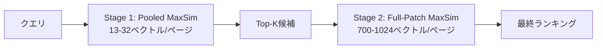

## 論文概要（Abstract）

本記事は [Visual RAG Toolkit: Scaling Multi-Vector Visual Retrieval with Training-Free Pooling and Multi-Stage Search](https://arxiv.org/abs/2602.12510) の解説記事です。

ColPaliやColQwenなどのマルチベクトル視覚検索モデルは、文書ページ1枚あたり約1024本のパッチ埋め込みを生成する。コーパス規模が1万ページに達すると、1クエリあたり約$1.31 \times 10^{10}$回の乗加算が必要となり、スループットが深刻なボトルネックとなる。本論文では、追加学習を一切行わずにToken Hygiene・空白領域クロッピング・モデル固有の空間プーリングの3手法でベクトル数を最大64倍に圧縮し、2段階検索パイプラインと組み合わせることで検索品質をほぼ維持したままスループットを最大4.5倍に改善する実用的ツールキット「Visual RAG Toolkit」を提案している。

この記事は [Zenn記事: ColPali×VLMリランカーで設計図面PDFの検索基盤を構築しページ単位再現率を改善する](https://zenn.dev/0h_n0/articles/e2d064c1432593) の深掘りです。

## 情報源

- **arXiv ID**: 2602.12510
- **URL**: [https://arxiv.org/abs/2602.12510](https://arxiv.org/abs/2602.12510)
- **著者**: Ara Yeroyan
- **発表年**: 2026年2月
- **分野**: Information Retrieval (cs.IR), Computer Vision (cs.CV), Machine Learning (cs.LG)

## 背景と動機（Background & Motivation）

### マルチベクトル視覚検索のスケーリング問題

ColPaliに代表されるマルチベクトル視覚検索モデルは、Vision-Language Model（VLM）のパッチ埋め込みをそのまま文書表現として利用する。テキスト抽出やOCR前処理が不要で、図表・レイアウト情報をそのまま検索に活用できる点が強みである。しかし、モデルが1ページあたり約1024本の128次元ベクトルを出力するため、MaxSim演算の計算コストがコーパス規模に対して線形に増大する。

### 計算コストの具体的見積もり

著者は、10トークンのクエリで1万ページのコーパスを検索する場合のMaxSim演算コストを以下のように見積もっている：

$$
\text{Cost} = Q \times D \times N \times d = 10 \times 1024 \times 10{,}000 \times 128 = 1.31 \times 10^{10} \text{ multiply-adds/query}
$$

ここで、$Q$はクエリトークン数、$D$はページあたりのパッチベクトル数、$N$はコーパスのページ数、$d$は埋め込み次元数である。この計算量はコーパスサイズに比例して増大し、10万ページ規模では実用的なレイテンシを維持することが困難となる。

### 既存アプローチの限界

従来のベクトル圧縮手法としてはPQ（Product Quantization）やバイナリ量子化が知られるが、これらはMaxSimの内積演算に対して直接適用しにくい。また、ColBERT向けのクラスタリングベースプーリング（ColBERTv2のCentroid Tokenなど）はテキスト埋め込み向けに設計されており、視覚パッチ埋め込みの空間構造を考慮していない。著者は、視覚モデル固有の空間的冗長性を活用した学習不要の圧縮手法が求められていると主張している。

## 主要な貢献（Key Contributions）

- **Token Hygiene**: CLS・padding・instructionなどの非視覚トークンをフィルタリングし、検索に無関係なベクトルを除去する前処理手法の提案
- **Empty-Region Cropping**: 標準偏差閾値に基づく低分散ボーダー領域の自動除去
- **モデル固有の空間プーリング**: ColSmol-500M（タイルレベルmean pooling、64倍圧縮）、ColPali v1.3（行方向mean pooling、32倍圧縮）、ColQwen2.5 v0.2（ガウシアン重みスムージング）の3モデルに特化したプーリング戦略
- **2段階検索パイプライン**: pooledベクトルによる粗い検索とフルパッチによるリランキングを組み合わせ、Qdrant prefetch+query APIでサーバーサイド実行可能な検索アーキテクチャの設計

## 技術的詳細（Technical Details）

### Token Hygiene

VLMベースのマルチベクトルモデルは、視覚パッチ以外にもCLSトークン・paddingトークン・instructionトークンを出力に含む。これらは文書の視覚的内容を表現しておらず、MaxSim演算においてノイズとなる。

著者はモデルごとにこれらの非視覚トークンの位置を特定し、フィルタリングするToken Hygiene手法を提案している。具体的には、ColPaliでは1030トークンの出力から6トークンを除去して1024トークンに、ColQwen2.5では約1050トークンから280-330トークンを除去して720-768トークンに削減する。この処理はモデルのトークナイザ構造に基づく静的なインデックスマッピングであり、実行時のオーバーヘッドは無視できる。

### 空間プーリング手法

#### Mean Pooling（ColSmol-500M、ColPali v1.3）

ColSmol-500Mはタイルベースのビジョンエンコーダを持ち、入力画像を複数のサブタイルに分割して処理する。著者はこのタイル構造を利用し、各タイルに属するパッチベクトルの平均をとるタイルレベルmean poolingを提案している。832本のパッチベクトルが13本に圧縮され、約64倍の圧縮率となる。

ColPali v1.3に対しては、パッチグリッドの行方向にmean poolingを適用する。1024本のパッチベクトルが32本に圧縮され、32倍の圧縮率である。行方向のプーリングが選択された理由は、文書ページでは行（テキスト行やテーブル行）が意味的にまとまった単位を構成する傾向があるためと著者は説明している。

$$
\mathbf{v}_{\text{pooled}}^{(r)} = \frac{1}{W} \sum_{c=1}^{W} \mathbf{v}_{r,c}
$$

ここで、$\mathbf{v}_{r,c}$は$r$行$c$列のパッチ埋め込みベクトル、$W$は1行あたりのパッチ数（グリッド幅）である。

#### ガウシアン重みスムージング（ColQwen2.5 v0.2）

ColQwen2.5はPatchMergerモジュールを内蔵しており、出力段階で既に隣接パッチの情報が部分的に統合されている。この上にさらに単純なmean poolingを適用すると「二重平滑化」（double smoothing）が発生し、局所的な情報が過度に平均化されて検索品質が低下する。

著者はこの問題を回避するため、ガウシアンカーネルによる重み付き平均を提案している：

$$
w_i = \exp\left(-\frac{(i - \mu)^2}{2\sigma^2}\right)
$$

$$
\mathbf{v}_{\text{pooled}} = \frac{\sum_{i} w_i \cdot \mathbf{v}_i}{\sum_{i} w_i}
$$

ここで、$\mu$はウィンドウの中心位置、$\sigma$はガウシアンカーネルの標準偏差（スムージング幅を制御）、$w_i$は$i$番目のパッチに対する重みである。ガウシアンカーネルは中心のパッチに高い重みを与え、周辺のパッチの影響を漸減させるため、PatchMergerとの二重平滑化効果を軽減する。

著者はカーネルの比較も行っており、ColQwen2.5ではガウシアン重みが三角重みを上回る一方、ColPaliではConv1dとタイルベースが同等であったと報告している。ColQwen2.5にConv1dを適用すると品質が低下しており、PatchMerger由来の事前平滑化との相互作用が原因と考えられる。

#### Conv1d実験的プーリング（ColPali v1.3）

ColPali v1.3に対しては、行方向mean poolingに加えてConv1d（1次元畳み込み）ベースのプーリングも実験的に検討されている。Conv1dカーネルはパッチ列に沿って局所的な特徴を集約するが、mean poolingと比較して大きな品質差は見られなかったと報告されている。

### 2段階検索パイプライン



プーリングによるベクトル圧縮は検索速度を向上させるが、情報損失が避けられない。著者はこの問題に対し、2段階検索パイプラインを提案している：

- **Stage 1（粗い検索）**: pooledベクトル（モデルにより13-32本/ページ）でMaxSim演算を行い、Top-K候補を取得する
- **Stage 2（精密リランキング）**: Stage 1で絞り込まれた候補に対してのみ、フルパッチベクトル（700-1024本/ページ）でMaxSimを再計算し、最終ランキングを決定する

この2段階構成により、Stage 1では圧縮ベクトルによる高速なスキャンでコーパス全体をふるいにかけ、Stage 2では元の精度を持つフルベクトルで少数の候補のみを精査する。Qdrantのprefetch + query APIを利用することで、この2段階処理をサーバーサイドで1回のAPIリクエストとして実行できる点が実装上の大きな利点である。

## 実装のポイント（Implementation）

### ストレージの二重保持

2段階検索を実現するには、pooledベクトルとフルパッチベクトルの両方をストレージに保持する必要がある。著者は、Qdrantのnamed vectorsを使用し、1つのコレクション内に`pooled`と`full`の2つのベクトルフィールドを定義する方法を採用している。ストレージ容量はフルベクトルのみの場合と比較して約3-5%増加するに留まる（pooledベクトルはフルベクトルの1/32-1/64のサイズであるため）。

### モデル固有のプーリング選択

プーリング戦略はモデルアーキテクチャに強く依存するため、新しいモデルへの適用にはモデル構造の分析が必要となる。著者は以下の選択指針を示している：

- PatchMergerなどの事前平滑化モジュールを持つモデル → ガウシアン重みプーリング（二重平滑化を回避）
- タイル構造を持つモデル → タイルレベルmean pooling
- 上記に該当しないモデル → 行方向mean poolingまたはConv1d

### sub-1Bモデルの注意点

著者は、パラメータ数が10億未満の小型モデル（ColSmol-500Mなど）ではプーリングによる品質ギャップが拡大する傾向があると報告している。小型モデルでは各パッチベクトルが保持する情報量が限られており、圧縮による情報損失の影響が相対的に大きくなるためと考えられる。

## Production Deployment Guide

本論文はQdrant上でのマルチベクトル検索パイプラインの実装を具体的に示しており、プロダクション環境への適用手順を以下にまとめる。

### AWS実装パターン（コスト最適化重視）

Visual RAG Toolkitの2段階検索パイプラインは、Qdrantベクトルデータベースを中核に構成する。トラフィック量別の推奨構成を以下に示す。

**Small (~100 req/日): Serverless構成 — 月額$80-200**

| サービス | 用途 | 月額概算 |
|---------|------|---------|
| Qdrant Cloud Free Tier | ベクトルDB（1GBまで） | $0 |
| Lambda (256MB, ARM) | クエリ前処理・後処理 | $5-10 |
| S3 | 元PDF保存 | $5-15 |
| SageMaker Serverless | ColPali推論（起動時のみ） | $50-150 |
| CloudWatch | ログ・メトリクス | $5-10 |

SageMaker Serverless Inferenceを利用し、コールドスタート（30-60秒）を許容することで待機コストを削減する。

**Medium (~1000 req/日): Hybrid構成 — 月額$400-900**

| サービス | 用途 | 月額概算 |
|---------|------|---------|
| Qdrant Cloud Starter | ベクトルDB（50GBまで） | $100-200 |
| ECS Fargate (1vCPU/4GB) | クエリ処理API | $50-80 |
| SageMaker Real-time (ml.g5.xlarge) | ColPali推論 | $200-500 |
| S3 + CloudFront | PDF配信 | $30-50 |
| CloudWatch + X-Ray | 監視・トレーシング | $20-40 |

推論エンドポイントを常時起動し、レイテンシを安定させる構成。

**Large (10000+ req/日): Container構成 — 月額$2,500-6,000**

| サービス | 用途 | 月額概算 |
|---------|------|---------|
| Qdrant self-hosted (EKS) | ベクトルDB（スケーラブル） | $300-600 |
| EKS + Karpenter | APIサーバー + オートスケール | $500-1,000 |
| GPU Spot (g5.xlarge) | ColPali推論 | $800-2,000 |
| ElastiCache (Redis) | Stage 1結果キャッシュ | $100-200 |
| S3 + CloudFront | PDF配信 | $100-200 |
| CloudWatch + X-Ray + Budgets | 監視・コスト管理 | $50-100 |

Qdrantをself-hostedで運用し、シャーディングとレプリケーションによる水平スケーリングを行う。GPU推論にSpot Instancesを利用し最大90%のコスト削減を図る。

**コスト削減テクニック**:
- GPU Spot Instances活用で推論コスト最大90%削減
- Reserved Instances（1年コミット）でQdrantノード最大72%削減
- Qdrant quantization（Scalar/Binary）でメモリ使用量を4-8倍圧縮
- Stage 1結果のRedisキャッシュで繰り返しクエリの演算を回避

**コスト試算の注意事項**: 上記は2026年9月時点のAWS ap-northeast-1（東京）リージョン料金に基づく概算値である。実際のコストはトラフィックパターン、リージョン、バースト使用量により変動する。最新料金はAWS料金計算ツールで確認を推奨する。

### Terraformインフラコード

#### Small構成（Serverless + Qdrant Cloud）

```hcl
# VPC基盤（NAT Gateway不使用でコスト削減）
resource "aws_vpc" "visual_rag" {
  cidr_block           = "10.0.0.0/16"
  enable_dns_hostnames = true
  tags = { Name = "visual-rag-vpc" }
}

resource "aws_subnet" "private" {
  count             = 2
  vpc_id            = aws_vpc.visual_rag.id
  cidr_block        = "10.0.${count.index + 1}.0/24"
  availability_zone = data.aws_availability_zones.available.names[count.index]
  tags = { Name = "visual-rag-private-${count.index}" }
}

# IAMロール（最小権限）
resource "aws_iam_role" "lambda_visual_rag" {
  name = "visual-rag-query-lambda"
  assume_role_policy = jsonencode({
    Version = "2012-10-17"
    Statement = [{
      Action    = "sts:AssumeRole"
      Effect    = "Allow"
      Principal = { Service = "lambda.amazonaws.com" }
    }]
  })
}

resource "aws_iam_role_policy" "lambda_policy" {
  name = "visual-rag-lambda-policy"
  role = aws_iam_role.lambda_visual_rag.id
  policy = jsonencode({
    Version = "2012-10-17"
    Statement = [
      {
        Effect   = "Allow"
        Action   = ["logs:CreateLogGroup", "logs:CreateLogStream", "logs:PutLogEvents"]
        Resource = "arn:aws:logs:*:*:*"
      },
      {
        Effect   = "Allow"
        Action   = ["s3:GetObject"]
        Resource = "${aws_s3_bucket.pdf_store.arn}/*"
      },
      {
        # Secrets Managerからのみ Qdrant API Key を取得
        Effect   = "Allow"
        Action   = ["secretsmanager:GetSecretValue"]
        Resource = aws_secretsmanager_secret.qdrant_api_key.arn
      }
    ]
  })
}

# Lambda関数（クエリ処理）
resource "aws_lambda_function" "query_handler" {
  function_name = "visual-rag-query"
  runtime       = "python3.12"
  handler       = "handler.lambda_handler"
  role          = aws_iam_role.lambda_visual_rag.arn
  memory_size   = 256  # MaxSim演算は軽量
  timeout       = 30
  architectures = ["arm64"]  # Graviton: 20%低コスト

  environment {
    variables = {
      QDRANT_URL          = var.qdrant_cloud_url
      QDRANT_SECRET_ARN   = aws_secretsmanager_secret.qdrant_api_key.arn
      COLLECTION_NAME     = "visual_documents"
      STAGE1_LIMIT        = "100"  # prefetch候補数
      STAGE2_LIMIT        = "10"   # 最終結果数
    }
  }
}

# S3（PDF保存、KMS暗号化）
resource "aws_s3_bucket" "pdf_store" {
  bucket = "visual-rag-pdf-store-${data.aws_caller_identity.current.account_id}"
}

resource "aws_s3_bucket_server_side_encryption_configuration" "pdf_encryption" {
  bucket = aws_s3_bucket.pdf_store.id
  rule {
    apply_server_side_encryption_by_default {
      sse_algorithm = "aws:kms"
    }
  }
}

# Secrets Manager（Qdrant API Key）
resource "aws_secretsmanager_secret" "qdrant_api_key" {
  name                    = "visual-rag/qdrant-api-key"
  recovery_window_in_days = 7
}

# CloudWatchアラーム（コスト監視）
resource "aws_cloudwatch_metric_alarm" "lambda_duration" {
  alarm_name          = "visual-rag-query-duration-high"
  comparison_operator = "GreaterThanThreshold"
  evaluation_periods  = 3
  metric_name         = "Duration"
  namespace           = "AWS/Lambda"
  period              = 300
  statistic           = "p95"
  threshold           = 10000  # 10秒
  alarm_description   = "Query latency P95 exceeds 10s"
  dimensions = {
    FunctionName = aws_lambda_function.query_handler.function_name
  }
}
```

#### Large構成（EKS + Qdrant self-hosted）

```hcl
# EKSクラスタ
module "eks" {
  source          = "terraform-aws-modules/eks/aws"
  version         = "~> 20.0"
  cluster_name    = "visual-rag-cluster"
  cluster_version = "1.31"
  vpc_id          = aws_vpc.visual_rag.id
  subnet_ids      = aws_subnet.private[*].id

  cluster_endpoint_public_access = false  # プライベートエンドポイントのみ
}

# Karpenter Provisioner（Spot優先、GPU対応）
resource "kubectl_manifest" "karpenter_nodepool_gpu" {
  yaml_body = yamlencode({
    apiVersion = "karpenter.sh/v1"
    kind       = "NodePool"
    metadata   = { name = "gpu-spot" }
    spec = {
      template = {
        spec = {
          requirements = [
            { key = "karpenter.sh/capacity-type", operator = "In", values = ["spot"] },
            { key = "node.kubernetes.io/instance-type", operator = "In",
              values = ["g5.xlarge", "g5.2xlarge"] },
          ]
          nodeClassRef = { name = "default" }
        }
      }
      limits   = { cpu = "64", "nvidia.com/gpu" = "8" }
      disruption = {
        consolidationPolicy = "WhenEmptyOrUnderutilized"
        consolidateAfter    = "30s"
      }
    }
  })
}

# Qdrant StatefulSet用NodePool（On-Demand、データ永続性優先）
resource "kubectl_manifest" "karpenter_nodepool_qdrant" {
  yaml_body = yamlencode({
    apiVersion = "karpenter.sh/v1"
    kind       = "NodePool"
    metadata   = { name = "qdrant-ondemand" }
    spec = {
      template = {
        spec = {
          requirements = [
            { key = "karpenter.sh/capacity-type", operator = "In", values = ["on-demand"] },
            { key = "node.kubernetes.io/instance-type", operator = "In",
              values = ["r6i.xlarge", "r6i.2xlarge"] },  # メモリ最適化
          ]
          nodeClassRef = { name = "default" }
        }
      }
      limits = { cpu = "32" }
    }
  })
}

# AWS Budgets（予算アラート）
resource "aws_budgets_budget" "visual_rag" {
  name         = "visual-rag-monthly"
  budget_type  = "COST"
  limit_amount = "5000"
  limit_unit   = "USD"
  time_unit    = "MONTHLY"

  notification {
    comparison_operator       = "GREATER_THAN"
    threshold                 = 80
    threshold_type            = "PERCENTAGE"
    notification_type         = "ACTUAL"
    subscriber_email_addresses = [var.alert_email]
  }
}
```

### 運用・監視設定

**CloudWatch Logs Insightsクエリ（検索レイテンシ分析）**:

```
fields @timestamp, @message
| filter @message like /query_latency/
| stats avg(stage1_ms) as avg_stage1,
        avg(stage2_ms) as avg_stage2,
        pct(stage1_ms + stage2_ms, 95) as p95_total,
        pct(stage1_ms + stage2_ms, 99) as p99_total
  by bin(1h)
```

**CloudWatchアラーム設定（Python）**:

```python
import boto3

cloudwatch = boto3.client("cloudwatch")

def create_query_latency_alarm(function_name: str, threshold_ms: int = 5000) -> None:
    """検索レイテンシのP95アラームを作成する"""
    cloudwatch.put_metric_alarm(
        AlarmName=f"visual-rag-{function_name}-p95-latency",
        MetricName="Duration",
        Namespace="AWS/Lambda",
        Statistic="p95",
        Period=300,
        EvaluationPeriods=3,
        Threshold=threshold_ms,
        ComparisonOperator="GreaterThanThreshold",
        Dimensions=[{"Name": "FunctionName", "Value": function_name}],
        AlarmActions=[sns_topic_arn],
    )
```

**X-Rayトレーシング設定（Python）**:

```python
from aws_xray_sdk.core import xray_recorder, patch_all

patch_all()  # boto3, requests等を自動計装

@xray_recorder.capture("two_stage_search")
def two_stage_search(query_vectors: list[list[float]], collection: str) -> list[dict]:
    """2段階検索を実行し、各ステージのレイテンシをX-Rayに記録する"""
    subsegment = xray_recorder.current_subsegment()
    subsegment.put_annotation("collection", collection)
    subsegment.put_metadata("query_vector_count", len(query_vectors))

    # Stage 1: pooledベクトルで粗い検索
    with xray_recorder.in_subsegment("stage1_pooled_search"):
        candidates = qdrant_client.query_points(
            collection_name=collection,
            prefetch=[Prefetch(query=query_vectors, using="pooled", limit=100)],
            query=query_vectors,
            using="full",
            limit=10,
        )

    subsegment.put_metadata("result_count", len(candidates))
    return candidates
```

**Cost Explorer日次レポート（Python）**:

```python
import boto3
from datetime import datetime, timedelta

ce = boto3.client("ce")

def get_daily_visual_rag_cost() -> dict:
    """Visual RAG関連の日次コストを取得する"""
    today = datetime.utcnow().strftime("%Y-%m-%d")
    yesterday = (datetime.utcnow() - timedelta(days=1)).strftime("%Y-%m-%d")

    response = ce.get_cost_and_usage(
        TimePeriod={"Start": yesterday, "End": today},
        Granularity="DAILY",
        Metrics=["UnblendedCost"],
        Filter={
            "Tags": {
                "Key": "Project",
                "Values": ["visual-rag"],
            }
        },
        GroupBy=[{"Type": "DIMENSION", "Key": "SERVICE"}],
    )
    total = sum(
        float(g["Metrics"]["UnblendedCost"]["Amount"])
        for r in response["ResultsByTime"]
        for g in r["Groups"]
    )
    if total > 100:
        sns = boto3.client("sns")
        sns.publish(
            TopicArn=sns_topic_arn,
            Subject="Visual RAG daily cost alert",
            Message=f"Daily cost: ${total:.2f} exceeds $100 threshold",
        )
    return response
```

### コスト最適化チェックリスト

**アーキテクチャ選択**:
- [ ] トラフィック量に応じた構成選択（~100 req/日→Serverless、~1000→Hybrid、10000+→Container）
- [ ] Qdrant Cloud vs self-hosted の判断（10GB以下はCloud推奨）

**リソース最適化**:
- [ ] GPU推論にSpot Instances優先（最大90%削減）
- [ ] QdrantノードにReserved Instances（1年コミットで最大72%削減）
- [ ] Savings Plans検討（コンピューティング全般）
- [ ] Lambda: ARM (Graviton) + メモリサイズ最適化（256MB推奨）
- [ ] ECS/EKS: Karpenterによるアイドル時スケールダウン

**ベクトル検索コスト削減**:
- [ ] pooledベクトルによるStage 1で演算量を32-64倍削減
- [ ] Qdrant Scalar Quantization有効化（メモリ4倍圧縮、品質損失軽微）
- [ ] 頻出クエリのStage 1結果をRedisキャッシュ
- [ ] HNSW indexing_threshold調整（小規模コレクションはbrute-force）

**監視・アラート**:
- [ ] AWS Budgets設定（月額上限アラート）
- [ ] CloudWatchアラーム（Lambda Duration P95、エラー率）
- [ ] Cost Anomaly Detection有効化
- [ ] 日次コストレポート（SNS通知）

**リソース管理**:
- [ ] 未使用Qdrantコレクション削除
- [ ] タグ戦略（Project, Environment, Owner）
- [ ] S3ライフサイクルポリシー（古いPDFのGlacier移行）
- [ ] 開発環境の夜間・休日停止（SageMakerエンドポイント）
- [ ] ECRイメージライフサイクルポリシー

## 実験結果（Results）

著者はViDoc（Visual Document Retrieval）ベンチマーク上で、3つのモデルについてプーリング＋2段階検索の効果を評価している。以下は論文Table 2（Union Scope）からの主要結果である。

| モデル | 構成 | QPS | NDCG@5 |
|-------|------|-----|--------|
| ColPali v1.3 | Full (ベースライン) | 0.28 | ベースライン |
| ColPali v1.3 | 2-Stage Row Mean | 0.95 | ほぼ維持 |
| ColPali v1.3 | 2-Stage Conv1d | 1.27 | ほぼ維持 |
| ColQwen2.5 v0.2 | Full (ベースライン) | 0.31 | ベースライン |
| ColQwen2.5 v0.2 | 2-Stage Gaussian | 1.15 | ほぼ維持 |
| ColSmol-500M | Full (ベースライン) | — | ベースライン |
| ColSmol-500M | Tile Mean (64x圧縮) | — | 品質ギャップ拡大 |

ColPali v1.3の2-Stage Conv1d構成では、QPSが0.28から1.27へ約4.5倍に改善されており、NDCG@5はほぼ維持されている（論文Table 2より）。ColQwen2.5 v0.2の2-Stage Gaussian構成では、QPSが0.31から1.15へ約3.7倍に改善されている。

著者は、スループット向上がコーパスサイズに対して二次的にスケールすると報告している。これは、Stage 1でのMaxSim演算量がpooledベクトル数に比例して減少する一方、Stage 2はTop-K候補のみを対象とするため、コーパスが大きくなるほどStage 2の寄与が相対的に小さくなるためである。

一方、ColSmol-500Mでは64倍圧縮による品質ギャップがColPali・ColQwenと比較して大きく、sub-1Bモデルではプーリング戦略の慎重な検討が必要であることが示されている。

## 実運用への応用（Practical Applications）

### Zenn記事のQdrant最適化との関連

関連Zenn記事「ColPali×VLMリランカーで設計図面PDFの検索基盤を構築しページ単位再現率を改善する」では、ColPaliの埋め込みをQdrantに格納し、VLMリランカーで精度を補完するアーキテクチャが紹介されている。本論文のVisual RAG Toolkitは、このアーキテクチャにおける以下の課題を直接的に解決する：

1. **ストレージ効率**: 1ページ1024ベクトルの格納コストをpooledベクトルの導入で実質的に削減（Stage 1用のpooledベクトルのみでの運用も可能）
2. **検索スループット**: Qdrantのprefetch APIを活用した2段階検索により、コーパス全体のフルスキャンを回避
3. **Qdrant named vectors**: `pooled`と`full`の2つのベクトルフィールドを1コレクションで管理することで、Zenn記事のアーキテクチャをそのまま拡張可能

設計図面PDFのように1ページあたりの情報密度が高い文書では、行方向mean poolingによる情報損失が通常のテキスト文書より大きくなる可能性がある。この場合、Conv1dプーリングやガウシアンプーリングを適用し、2段階パイプラインのStage 2で品質を補完する戦略が有効と考えられる。

## 関連研究（Related Work）

- **ColBERT (Khattab & Zaharia, 2020)**: テキスト検索におけるマルチベクトル表現とMaxSim演算を導入した先駆的研究。Visual RAG ToolkitのMaxSim 2段階パイプラインは、ColBERTのlate interaction機構を視覚領域に拡張したものと位置づけられる
- **ColPali (Faysse et al., 2024)**: PaliGemmaベースのVLMから文書ページの視覚パッチ埋め込みを直接取得し、OCR不要のマルチベクトル文書検索を実現した研究。本論文のベースモデルの一つ
- **ColQwen2.5 (Team & Contributors, 2025)**: Qwen2.5-VLベースのマルチベクトル文書検索モデル。PatchMergerモジュールによる内部的なパッチ統合が特徴であり、本論文のガウシアンプーリング設計の動機となった
- **MatryoshkaRepresentation Learning (Kusupati et al., 2022)**: 埋め込み次元の柔軟な圧縮を学習する手法。Visual RAG Toolkitの空間プーリングは、次元方向ではなくトークン数方向の圧縮という点で相補的なアプローチである

## まとめと今後の展望

Visual RAG Toolkitは、ColPali・ColQwen2.5・ColSmol-500Mの3モデルに対し、追加学習なしの空間プーリングと2段階検索パイプラインにより、検索品質を維持しながらスループットを3.7-4.5倍に改善することを示した。ガウシアン重みプーリングやToken Hygieneなどのモデル固有の最適化が重要であり、汎用的な圧縮手法では不十分であるという知見は、今後のマルチベクトル検索システムの設計に示唆を与える。

著者は制限事項として、プーリング戦略のモデル固有性と小型モデルでの品質ギャップを挙げている。今後はモデル非依存のプーリング手法の開発や、学習ベースの適応的プーリング（パッチの重要度に応じた動的圧縮）が研究方向として考えられる。

## 参考文献

- **arXiv**: [https://arxiv.org/abs/2602.12510](https://arxiv.org/abs/2602.12510)
- **ColPali**: [https://arxiv.org/abs/2407.01449](https://arxiv.org/abs/2407.01449)
- **ColQwen2.5**: [https://huggingface.co/vidore/colqwen2.5-v0.2](https://huggingface.co/vidore/colqwen2.5-v0.2)
- **Qdrant Documentation**: [https://qdrant.tech/documentation/](https://qdrant.tech/documentation/)
- **Related Zenn article**: [https://zenn.dev/0h_n0/articles/e2d064c1432593](https://zenn.dev/0h_n0/articles/e2d064c1432593)

:::message
この記事はAI（Claude Code）により自動生成されました。内容の正確性については複数の情報源で検証していますが、実際の利用時は公式ドキュメントもご確認ください。
:::
