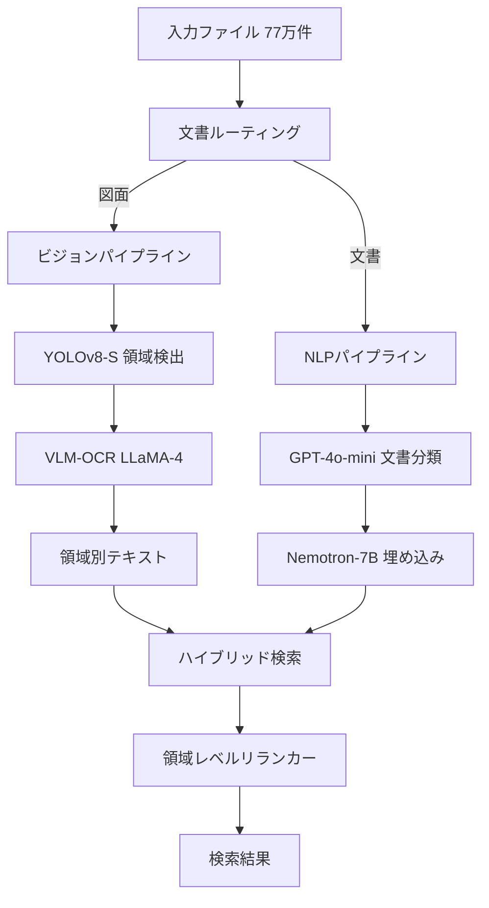

本記事は [BLUEPRINT: Rebuilding a Legacy](https://arxiv.org/abs/2602.13345) の解説記事です。

## 論文概要（Abstract）

BLUEPRINTは、約77万ファイルに及ぶレガシーエンジニアリングアーカイブに対して、レイアウト認識型のマルチモーダル検索を実現するシステムである。著者らは、エンジニアリング図面と技術文書を別々のパイプラインで処理する文書ルーティング戦略を採用し、YOLOv8-Sによる図面領域検出とVLMベースOCRを組み合わせた検索アーキテクチャを提案している。ベースラインとなるLlama-4-Scoutに対してSuccess@3で+10.1%の絶対改善を達成し、処理速度も約7倍高速であると報告されている。

この記事は [Zenn記事: ColPali×VLMリランカーで設計図面PDFの検索基盤を構築しページ単位再現率を改善する](https://zenn.dev/0h_n0/articles/e2d064c1432593) の深掘りです。

## 情報源

- **arXiv ID**: 2602.13345
- **URL**: [https://arxiv.org/abs/2602.13345](https://arxiv.org/abs/2602.13345)
- **著者**: Ethan Seefried, Ran Eldegaway, Sanjay Das, et al.
- **発表年**: 2026
- **分野**: cs.LG, cs.IR, cs.MA

## 背景と動機（Background & Motivation）

大規模な製造業・インフラ企業では、数十年にわたって蓄積されたエンジニアリング図面や技術文書が紙ベースまたは初期デジタル形式のまま保管されている。これらのレガシーアーカイブは、設備保守・改修計画・安全基準適合の確認などで頻繁に参照される必要があるが、全文検索が困難な構造を持つ。

従来のアプローチには大きく2つの問題がある。第一に、エンジニアリング図面は通常の文書とは根本的に異なるレイアウトを持つ。タイトルブロック、部品表（BOM）、注記、寸法線といった領域ごとに異なる情報が配置されており、フルページOCRではこれらの空間的構造を無視してテキストを結合してしまう。著者らはTable 6において、フルページTesseract OCRのnDCG@3が0.208にとどまるのに対し、領域限定VLM-OCRでは0.699に達することを示しており、レイアウト認識の重要性を定量的に裏付けている。

第二に、77万ファイル規模のアーカイブに対してVLM（Vision-Language Model）を直接適用する場合、処理コストが膨大になる。Llama-4-Scoutでは1ファイルあたり64.36秒を要するのに対し、BLUEPRINTは9.46秒で処理できると報告されており、大規模アーカイブに対するスケーラビリティの点で大きな差がある。

これらの課題に対して、文書タイプに応じたルーティングと領域検出を組み合わせることで、検索精度と処理効率の両立を図ることがBLUEPRINTの動機である。

## 主要な貢献（Key Contributions）

- **文書ルーティング機構**: CLIPとヒューリスティクスを組み合わせた分類器により、図面と文書を94.5%の精度で自動分類し、タイプ別に最適化されたパイプラインに振り分ける仕組みを導入した
- **レイアウト認識型OCRパイプライン**: YOLOv8-Sで図面内の意味的領域（タイトルブロック、BOM、注記等）を検出し、各領域に対してVLMベースOCRを適用することで、空間的コンテキストを保持したテキスト抽出を実現した
- **ハイブリッド検索と領域レベルリランキング**: スパース検索（BM25）とデンス検索（埋め込みベース）をz-score正規化で統合し、領域レベルのリランカーで最終順位を決定するアーキテクチャを提案した
- **大規模ベンチマーク**: 約77万ファイルのレガシーエンジニアリングアーカイブに対する実証的評価を行い、Success@3でLlama-4-Scoutを+10.1%上回る結果を報告した

## 技術的詳細（Technical Details）

### システムアーキテクチャ

BLUEPRINTのアーキテクチャは、文書ルーティング、ビジョンパイプライン、NLPパイプライン、統合検索の4つのコンポーネントで構成される。



### 文書ルーティング

文書ルーティングは、入力ファイルを図面（drawings）と文書（documents）に分類する最初のステップである。著者らはCLIPモデルのzero-shot分類能力とルールベースのヒューリスティクスを組み合わせたアプローチを採用している。

CLIPによる分類スコアを $s_{\text{clip}}$、ヒューリスティクスによるスコアを $s_{\text{heur}}$ とすると、最終的な分類判定は以下の式で行われる。

$$
\text{type}(d) = \begin{cases}
\text{drawing} & \text{if } \alpha \cdot s_{\text{clip}}(d) + (1 - \alpha) \cdot s_{\text{heur}}(d) > \tau \\
\text{document} & \text{otherwise}
\end{cases}
$$

ここで、
- $d$: 入力ファイル
- $\alpha$: CLIPスコアとヒューリスティクスの重み付け係数
- $\tau$: 分類閾値

著者らは、この方式で94.5%の分類精度を達成したと報告している。ヒューリスティクスにはアスペクト比、テキスト密度、線分検出結果などの特徴量が含まれると考えられる。

### ビジョンパイプライン：YOLOv8-Sによる領域検出

図面と分類されたファイルに対して、YOLOv8-S（Small variant）で意味的領域を検出する。検出対象の領域クラスには、タイトルブロック（title block）、部品表（BOM: Bill of Materials）、注記（notes）、改訂履歴（revision block）などが含まれる。

著者らは、YOLOv8-SがmAP@0.5:0.95で89.5%、推論レイテンシ5.2msを達成したと報告しており、大規模アーカイブの処理において精度と速度のバランスが取れていることを示している。

検出された各領域 $r_i$ に対して、VLMベースのOCR（LLaMA-4を使用）でテキストを抽出する。このとき、領域のバウンディングボックス座標 $(x_1, y_1, x_2, y_2)$ をクロップしてVLMに入力することで、フルページ処理と比較してOCRの精度を大幅に向上させている。

```python
from dataclasses import dataclass
from ultralytics import YOLO

@dataclass
class DetectedRegion:
    """図面内の検出領域を表すデータクラス

    Attributes:
        class_name: 領域クラス名（title_block, bom, notes等）
        bbox: バウンディングボックス座標 (x1, y1, x2, y2)
        confidence: 検出信頼度
        text: VLM-OCRで抽出されたテキスト
    """
    class_name: str
    bbox: tuple[float, float, float, float]
    confidence: float
    text: str = ""


def detect_regions(
    image_path: str,
    model: YOLO,
    confidence_threshold: float = 0.25,
) -> list[DetectedRegion]:
    """YOLOv8-Sで図面内の意味的領域を検出する

    Args:
        image_path: 入力画像のパス
        model: YOLOv8-Sモデル
        confidence_threshold: 検出信頼度の閾値

    Returns:
        検出された領域のリスト
    """
    results = model(image_path, conf=confidence_threshold)
    regions: list[DetectedRegion] = []

    for result in results:
        for box in result.boxes:
            regions.append(
                DetectedRegion(
                    class_name=model.names[int(box.cls)],
                    bbox=tuple(box.xyxy[0].tolist()),
                    confidence=float(box.conf),
                )
            )

    # 信頼度降順でソート
    regions.sort(key=lambda r: r.confidence, reverse=True)
    return regions
```

### ハイブリッド検索とスコア統合

BLUEPRINTの検索エンジンは、スパース検索（BM25）とデンス検索（Nemotron-7B埋め込み）を組み合わせたハイブリッド方式を採用している。異なるスコア分布を持つ2つの検索結果を統合するために、z-score正規化が使用される。

各検索方式のスコア $s_i$ に対して、正規化スコア $\hat{s}_i$ は以下で計算される。

$$
\hat{s}_i = \frac{s_i - \mu}{\sigma}
$$

ここで、
- $s_i$: 元のスコア（BM25スコアまたはコサイン類似度）
- $\mu$: スコアの平均値
- $\sigma$: スコアの標準偏差

統合スコアは、正規化されたスパーススコア $\hat{s}_{\text{sparse}}$ とデンススコア $\hat{s}_{\text{dense}}$ の加重和として計算される。

$$
s_{\text{hybrid}}(q, d) = \beta \cdot \hat{s}_{\text{sparse}}(q, d) + (1 - \beta) \cdot \hat{s}_{\text{dense}}(q, d)
$$

ここで、
- $q$: クエリ
- $d$: 文書
- $\beta$: スパース検索とデンス検索の重み係数

この統合スコアに基づいて候補を取得した後、領域レベルのリランカーが各候補の最終順位を決定する。リランカーは、クエリと各領域テキストの関連度を評価し、文書全体のスコアを再計算する。

## 実装のポイント（Implementation）

BLUEPRINTを実装する際の技術的な注意点を整理する。

**YOLOv8-Sのファインチューニング**: 著者らはエンジニアリング図面専用のアノテーションデータでYOLOv8-Sをファインチューニングしている。一般的な物体検出データセットとは異なり、図面の領域検出ではクラス数が少なく（タイトルブロック、BOM、注記等の5-10クラス程度）、各クラスのアスペクト比が大きく異なる点に注意が必要である。

**VLM-OCRの領域クロッピング戦略**: 検出された領域をそのまま切り出すのではなく、若干のパディング（著者らの設定では周囲10%程度と推定される）を追加してコンテキストを保持することが精度向上に寄与する。また、VLMへの入力時にプロンプトで領域タイプ（例: "This is a title block region"）を指示することで、OCR精度が改善される。

**z-score正規化の実装上の注意**: クエリごとにスコア分布が変わるため、正規化の $\mu$ と $\sigma$ はクエリ単位で計算する必要がある。候補数が極端に少ない場合は $\sigma \to 0$ となり数値不安定性が生じるため、$\sigma$ に最小値（例: $10^{-6}$）を設定するフォールバックが必要である。

**スケーラビリティ**: 77万ファイルのインデキシングは、YOLOv8-Sの推論が5.2ms/ファイルであることから、領域検出だけであれば約1.1時間で完了する計算となる。ただしVLM-OCRのボトルネックを考慮すると、バッチ処理やGPU並列化の設計が重要になる。

## Production Deployment Guide

BLUEPRINTは実装アーキテクチャが明確に記述されている論文であり、エンジニアリング図面検索システムとしてAWS上に構築する場合の設計パターンを以下に示す。

### AWS実装パターン（コスト最適化重視）

**コスト試算の注意事項**: 以下は2026年9月時点のAWS ap-northeast-1（東京）リージョン料金に基づく概算値である。実際のコストはトラフィックパターン、リージョン、バースト使用量により変動する。最新料金はAWS料金計算ツールで確認を推奨する。

| 構成 | トラフィック | 主要サービス | 月額概算 |
|------|-------------|-------------|---------|
| Small | ~100 req/日 | Lambda + S3 + OpenSearch Serverless | $80-180 |
| Medium | ~1,000 req/日 | ECS Fargate + OpenSearch + SageMaker Endpoint | $400-900 |
| Large | 10,000+ req/日 | EKS + Spot + OpenSearch + SageMaker Multi-Model | $2,500-5,500 |

**Small構成（~100 req/日）**:
- Lambda（推論）: 128MB-1GB、タイムアウト60s、月額~$5
- S3: 図面画像ストレージ（77万ファイル、平均2MB）、月額~$35
- OpenSearch Serverless: ハイブリッド検索インデックス、月額~$25-50
- SageMaker Serverless Inference: YOLOv8-S + Nemotron-7B、月額~$15-90
- 合計: $80-180/月

**Medium構成（~1,000 req/日）**:
- ECS Fargate: YOLOv8-S推論コンテナ（2vCPU/4GB）x2タスク、月額~$120
- OpenSearch: r6g.large x2ノード、月額~$200
- SageMaker Endpoint: Nemotron-7B（ml.g5.xlarge）、月額~$200
- ElastiCache Redis: BM25スコアキャッシュ、月額~$50
- 合計: $400-900/月

**Large構成（10,000+ req/日）**:
- EKS: コントロールプレーン、月額~$73
- Spot Instances: g5.xlarge（YOLOv8-S推論）x4-8台、月額~$400-800（Spot割引適用）
- OpenSearch: r6g.xlarge x3ノード + UltraWarmストレージ、月額~$600
- SageMaker Multi-Model Endpoint: Nemotron-7B + VLM-OCR、月額~$800
- 合計: $2,500-5,500/月

**コスト削減テクニック**:
- Spot Instancesで推論ワーカーのコストを最大90%削減（g5.xlargeのSpot価格は約$0.38/h vs On-Demand $1.006/h）
- Reserved Instancesで常時稼働ノード（OpenSearch等）のコストを最大72%削減（1年All Upfront）
- SageMaker Serverless InferenceでSmall構成のアイドルコストを排除
- OpenSearch UltraWarmで低頻度アクセスインデックスのストレージコストを約80%削減

### Terraformインフラコード

**Small構成（Serverless）**:

```hcl
# --- Small構成: Lambda + S3 + OpenSearch Serverless ---
# エンジニアリング図面検索システム（~100 req/日）

terraform {
  required_version = ">= 1.9"
  required_providers {
    aws = {
      source  = "hashicorp/aws"
      version = "~> 5.70"
    }
  }
}

provider "aws" {
  region = "ap-northeast-1"
}

# --- S3: 図面画像ストレージ ---
resource "aws_s3_bucket" "drawings" {
  bucket = "blueprint-drawings-${var.environment}"
}

resource "aws_s3_bucket_server_side_encryption_configuration" "drawings" {
  bucket = aws_s3_bucket.drawings.id
  rule {
    apply_server_side_encryption_by_default {
      sse_algorithm     = "aws:kms"
      kms_master_key_id = aws_kms_key.blueprint.arn
    }
  }
}

resource "aws_s3_bucket_public_access_block" "drawings" {
  bucket                  = aws_s3_bucket.drawings.id
  block_public_acls       = true
  block_public_policy     = true
  ignore_public_acls      = true
  restrict_public_buckets = true
}

# --- KMS: 暗号化キー ---
resource "aws_kms_key" "blueprint" {
  description             = "Blueprint search system encryption key"
  deletion_window_in_days = 7
  enable_key_rotation     = true
}

# --- IAMロール: Lambda実行（最小権限） ---
resource "aws_iam_role" "lambda_exec" {
  name = "blueprint-lambda-exec-${var.environment}"
  assume_role_policy = jsonencode({
    Version = "2012-10-17"
    Statement = [{
      Action = "sts:AssumeRole"
      Effect = "Allow"
      Principal = { Service = "lambda.amazonaws.com" }
    }]
  })
}

resource "aws_iam_role_policy" "lambda_s3_read" {
  name = "s3-read-drawings"
  role = aws_iam_role.lambda_exec.id
  policy = jsonencode({
    Version = "2012-10-17"
    Statement = [{
      Effect   = "Allow"
      Action   = ["s3:GetObject", "s3:ListBucket"]
      Resource = [
        aws_s3_bucket.drawings.arn,
        "${aws_s3_bucket.drawings.arn}/*"
      ]
    }]
  })
}

# --- Lambda: 検索API ---
resource "aws_lambda_function" "search_api" {
  function_name = "blueprint-search-${var.environment}"
  role          = aws_iam_role.lambda_exec.arn
  handler       = "handler.search"
  runtime       = "python3.12"
  memory_size   = 1024  # YOLOv8-S推論に必要
  timeout       = 60
  filename      = "lambda_package.zip"

  environment {
    variables = {
      OPENSEARCH_ENDPOINT = aws_opensearchserverless_collection.search.collection_endpoint
      S3_BUCKET          = aws_s3_bucket.drawings.id
      HYBRID_WEIGHT_BETA = "0.6"  # スパース/デンス重み係数
    }
  }

  tracing_config {
    mode = "Active"  # X-Ray有効化
  }
}

# --- CloudWatchアラーム: コスト監視 ---
resource "aws_cloudwatch_metric_alarm" "lambda_duration" {
  alarm_name          = "blueprint-lambda-high-duration"
  comparison_operator = "GreaterThanThreshold"
  evaluation_periods  = 3
  metric_name         = "Duration"
  namespace           = "AWS/Lambda"
  period              = 300
  statistic           = "p95"
  threshold           = 30000  # 30秒
  alarm_actions       = [var.sns_topic_arn]

  dimensions = {
    FunctionName = aws_lambda_function.search_api.function_name
  }
}

variable "environment" {
  type    = string
  default = "dev"
}

variable "sns_topic_arn" {
  type        = string
  description = "SNS topic ARN for alarm notifications"
}
```

**Large構成（Container）**:

```hcl
# --- Large構成: EKS + Karpenter + Spot Instances ---
# エンジニアリング図面検索システム（10,000+ req/日）

module "eks" {
  source  = "terraform-aws-modules/eks/aws"
  version = "~> 20.24"

  cluster_name    = "blueprint-search-${var.environment}"
  cluster_version = "1.31"

  vpc_id     = var.vpc_id
  subnet_ids = var.private_subnet_ids

  # コントロールプレーンのみ（ノードはKarpenterで管理）
  cluster_endpoint_public_access = false

  # Secrets暗号化
  cluster_encryption_config = {
    provider_key_arn = aws_kms_key.blueprint.arn
    resources        = ["secrets"]
  }
}

# --- Karpenter: Spot優先の自動スケーリング ---
resource "kubectl_manifest" "karpenter_nodepool" {
  yaml_body = yamlencode({
    apiVersion = "karpenter.sh/v1"
    kind       = "NodePool"
    metadata   = { name = "blueprint-gpu-inference" }
    spec = {
      template = {
        spec = {
          requirements = [
            { key = "karpenter.sh/capacity-type", operator = "In", values = ["spot", "on-demand"] },
            { key = "node.kubernetes.io/instance-type", operator = "In", values = [
              "g5.xlarge", "g5.2xlarge", "g6.xlarge"  # GPU推論用
            ]},
          ]
          nodeClassRef = { name = "default" }
        }
      }
      limits   = { cpu = "64", memory = "256Gi" }
      disruption = {
        consolidationPolicy = "WhenEmptyOrUnderutilized"
        consolidateAfter    = "60s"  # アイドル時の迅速なスケールダウン
      }
    }
  })
}

# --- Secrets Manager: モデル設定 ---
resource "aws_secretsmanager_secret" "model_config" {
  name       = "blueprint/model-config-${var.environment}"
  kms_key_id = aws_kms_key.blueprint.arn
}

resource "aws_secretsmanager_secret_version" "model_config" {
  secret_id = aws_secretsmanager_secret.model_config.id
  secret_string = jsonencode({
    yolo_model_path     = "s3://blueprint-models/yolov8s-drawings.pt"
    nemotron_model_id   = "nvidia/nemotron-7b"
    vlm_model_id        = "meta-llama/llama-4"
    hybrid_weight_beta  = 0.6
  })
}

# --- AWS Budgets: 予算アラート ---
resource "aws_budgets_budget" "monthly" {
  name         = "blueprint-monthly-${var.environment}"
  budget_type  = "COST"
  limit_amount = "6000"
  limit_unit   = "USD"
  time_unit    = "MONTHLY"

  notification {
    comparison_operator       = "GREATER_THAN"
    threshold                 = 80
    threshold_type            = "PERCENTAGE"
    notification_type         = "ACTUAL"
    subscriber_email_addresses = [var.alert_email]
  }

  notification {
    comparison_operator       = "GREATER_THAN"
    threshold                 = 100
    threshold_type            = "PERCENTAGE"
    notification_type         = "FORECASTED"
    subscriber_email_addresses = [var.alert_email]
  }
}

variable "environment" {
  type    = string
  default = "prod"
}

variable "vpc_id" { type = string }
variable "private_subnet_ids" { type = list(string) }
variable "alert_email" { type = string }
```

### 運用・監視設定

**CloudWatch Logs Insights クエリ**:

```
# コスト異常検知: 1時間あたりのYOLO推論回数とOCR呼び出し回数
fields @timestamp, @message
| filter @message like /inference_complete/
| stats count(*) as inference_count,
        sum(ocr_tokens) as total_ocr_tokens,
        avg(latency_ms) as avg_latency
  by bin(1h)
| filter inference_count > 500
| sort @timestamp desc

# レイテンシ分析（P95, P99）
fields @timestamp, latency_ms, pipeline_type
| filter @message like /search_request/
| stats percentile(latency_ms, 95) as p95,
        percentile(latency_ms, 99) as p99,
        avg(latency_ms) as avg_latency
  by pipeline_type, bin(5m)
| sort p95 desc
```

**CloudWatchアラーム設定（Python）**:

```python
import boto3

cloudwatch = boto3.client("cloudwatch", region_name="ap-northeast-1")

def create_search_latency_alarm(function_name: str, sns_topic_arn: str) -> None:
    """検索APIのレイテンシ異常を検知するアラームを作成する

    Args:
        function_name: Lambda関数名
        sns_topic_arn: 通知先SNSトピックARN
    """
    cloudwatch.put_metric_alarm(
        AlarmName=f"blueprint-{function_name}-high-latency",
        MetricName="Duration",
        Namespace="AWS/Lambda",
        Statistic="p95",
        Period=300,
        EvaluationPeriods=3,
        Threshold=30000,  # 30秒（9.46秒/ファイルの約3倍をアラーム閾値に設定）
        ComparisonOperator="GreaterThanThreshold",
        AlarmActions=[sns_topic_arn],
        Dimensions=[{"Name": "FunctionName", "Value": function_name}],
    )
```

**X-Rayトレーシング設定（Python）**:

```python
from aws_xray_sdk.core import xray_recorder, patch_all

# boto3, requests等の自動計装
patch_all()

@xray_recorder.capture("blueprint_search")
def search_drawings(query: str, top_k: int = 10) -> list[dict]:
    """図面検索を実行し、X-Rayトレースを記録する

    Args:
        query: 検索クエリ
        top_k: 返却する上位件数

    Returns:
        検索結果のリスト
    """
    subsegment = xray_recorder.current_subsegment()
    subsegment.put_annotation("query_length", len(query))
    subsegment.put_metadata("query", query, "search")

    # YOLO推論サブセグメント
    with xray_recorder.in_subsegment("yolo_inference") as seg:
        regions = detect_regions(query_image)
        seg.put_annotation("regions_detected", len(regions))

    # ハイブリッド検索サブセグメント
    with xray_recorder.in_subsegment("hybrid_search") as seg:
        results = hybrid_search(query, top_k=top_k)
        seg.put_annotation("results_count", len(results))

    return results
```

**Cost Explorer自動レポート（Python）**:

```python
import boto3
from datetime import datetime, timedelta

ce = boto3.client("ce", region_name="ap-northeast-1")
sns = boto3.client("sns", region_name="ap-northeast-1")

def daily_cost_report(sns_topic_arn: str, threshold_usd: float = 100.0) -> dict:
    """日次コストレポートを取得し、閾値超過時にSNS通知する

    Args:
        sns_topic_arn: 通知先SNSトピックARN
        threshold_usd: アラート閾値（USD/日）

    Returns:
        サービス別コストの辞書
    """
    today = datetime.utcnow().strftime("%Y-%m-%d")
    yesterday = (datetime.utcnow() - timedelta(days=1)).strftime("%Y-%m-%d")

    response = ce.get_cost_and_usage(
        TimePeriod={"Start": yesterday, "End": today},
        Granularity="DAILY",
        Metrics=["UnblendedCost"],
        GroupBy=[{"Type": "DIMENSION", "Key": "SERVICE"}],
        Filter={
            "Tags": {"Key": "Project", "Values": ["blueprint-search"]},
        },
    )

    costs = {}
    total = 0.0
    for group in response["ResultsByTime"][0]["Groups"]:
        service = group["Keys"][0]
        amount = float(group["Metrics"]["UnblendedCost"]["Amount"])
        costs[service] = amount
        total += amount

    if total > threshold_usd:
        sns.publish(
            TopicArn=sns_topic_arn,
            Subject=f"[ALERT] Blueprint daily cost: ${total:.2f}",
            Message=f"日次コスト${total:.2f}が閾値${threshold_usd}を超過\n\n"
                    + "\n".join(f"  {k}: ${v:.2f}" for k, v in sorted(costs.items(), key=lambda x: -x[1])),
        )

    return costs
```

### コスト最適化チェックリスト

**アーキテクチャ選択**:
- [ ] トラフィック量に応じた構成を選択（~100 req/日: Serverless、~1,000 req/日: Hybrid、10,000+ req/日: Container）
- [ ] GPU推論が必要なコンポーネント（YOLOv8-S、VLM-OCR）とCPUで処理可能なコンポーネント（BM25検索、リランキング）を分離

**リソース最適化**:
- [ ] GPU推論ワーカーにSpot Instances優先（g5.xlargeで最大62%削減）
- [ ] OpenSearchノードにReserved Instances適用（1年All Upfrontで最大38%削減）
- [ ] Savings Plansで全体的なコンピューティングコスト削減を検討
- [ ] Lambda関数のメモリサイズを最適化（Power Tuningツール活用）
- [ ] ECS/EKSのアイドル時スケールダウン（Karpenter consolidateAfter: 60s）
- [ ] OpenSearch UltraWarmで低頻度アクセスインデックスを移行

**推論コスト削減**:
- [ ] YOLOv8-Sモデルの量子化（INT8/FP16）でGPUメモリ削減・スループット向上
- [ ] VLM-OCRのバッチ推論で効率化（領域単位ではなくページ単位でバッチ化）
- [ ] SageMaker Multi-Model EndpointでYOLOv8-SとNemotron-7Bを同一エンドポイントに集約
- [ ] 検索結果のキャッシュ（ElastiCache Redis）で重複クエリのコスト排除

**監視・アラート**:
- [ ] AWS Budgets設定（月額予算の80%/100%でアラート）
- [ ] CloudWatchアラーム（Lambda Duration P95、OpenSearchクエリレイテンシ）
- [ ] Cost Anomaly Detection有効化（ML検知で異常支出を早期発見）
- [ ] 日次コストレポート自動送信（Cost Explorer API + SNS）
- [ ] SageMaker Endpoint InvocationsPerInstanceメトリクス監視

**リソース管理**:
- [ ] 未使用のSageMaker Endpointを削除（開発環境の消し忘れ防止）
- [ ] タグ戦略の徹底（Project=blueprint-search、Environment=dev/prod）
- [ ] S3ライフサイクルポリシー（処理済み中間ファイルを30日後にGlacierへ移行）
- [ ] 開発環境の夜間・週末停止（EventBridge Schedulerで自動化）
- [ ] CloudTrail/Config有効化（セキュリティ監査・コンプライアンス）

## 実験結果（Results）

### メイン結果

著者らは、BLUEPRINTと複数のベースラインを比較した結果を報告している（論文Table 3より）。

| System | nDCG@3 | MAP@3 | P@3 | Success@3 |
|--------|--------|-------|-----|-----------|
| BLUEPRINT | 0.626 | 0.608 | 0.435 | 0.715 |
| Llama-4-Scout | 0.519 | 0.503 | 0.364 | 0.607 |
| LLaMA-3.2-Vision | 0.521 | 0.497 | 0.342 | 0.623 |

BLUEPRINTはSuccess@3で0.715を達成し、Llama-4-Scoutの0.607に対して+10.1%の絶対改善、nDCG@3ではLlama-4-Scoutの0.519に対して+18.9%の相対改善を記録している。この結果は、エンドツーエンドのVLM処理よりも、文書タイプに応じたルーティングと領域検出の組み合わせが有効であることを示唆している。

### OCRアブレーション

OCR手法の影響を分析したアブレーション結果が特に注目に値する（論文Table 6より）。

| 構成 | nDCG@3 | Success@3 |
|------|--------|-----------|
| Blueprint (Oracle boxes + VLM-OCR) | 0.699 | 0.780 |
| Blueprint (YOLO boxes + VLM-OCR) | 0.626 | 0.715 |
| Tesseract (Full-page) | 0.208 | 0.240 |

Oracle boxes（正解領域）とVLM-OCRの組み合わせではnDCG@3が0.699に達するのに対し、フルページTesseract OCRでは0.208にとどまっている。この約3.4倍の差は、レイアウト認識がエンジニアリング図面検索において決定的な要素であることを定量的に裏付けている。また、YOLOv8-Sの検出領域を使用した場合（0.626）とOracle boxes（0.699）の差は0.073であり、領域検出精度のさらなる改善余地があることを示唆している。

### 処理効率

著者らは、BLUEPRINTの処理速度が約9.46秒/ファイルであるのに対し、Llama-4-Scoutは64.36秒/ファイルを要すると報告している。約6.8倍の速度差は、77万ファイル規模のアーカイブでは処理時間にして約84日（Blueprint）対約571日（Llama-4-Scout）の差に相当し、実運用上のスケーラビリティに大きな影響を与える。

### 制限事項

著者らは以下の制限事項を認識していると報告している。
- **スキーマ不完全性**: 図面メタデータの構造化が不完全なケースがある
- **劣化スキャンへの耐性**: 古いスキャン画像のノイズや歪みに対するロバスト性が十分でない
- **リランカーの単純さ**: 領域レベルリランカーの設計がシンプルであり、より洗練されたクロスアテンションベースのリランカーで改善の余地がある

## 実運用への応用（Practical Applications）

BLUEPRINTのアーキテクチャは、関連Zenn記事で取り上げたColPali×VLMリランカーによる設計図面PDF検索基盤と密接に関連している。Zenn記事ではColPaliのマルチベクトル表現を用いたページ単位の検索を解説しているが、BLUEPRINTはページ内の領域レベルまで検索粒度を細分化するアプローチを採用している。

**プロダクション視点での示唆**:
- **スケーリング戦略**: 77万ファイル規模の実証は、YOLOv8-Sの5.2msという推論レイテンシが大規模アーカイブのインデキシングに十分実用的であることを示している。ColPaliのようなVLMベース検索とBLUEPRINTの領域検出を組み合わせることで、粗い候補取得（ColPali）と精密な領域レベルリランキング（BLUEPRINT）の2段階検索アーキテクチャが構築可能である
- **レイテンシとスループット**: 9.46秒/ファイルの処理速度はインデキシング時のスループットであり、検索時のクエリレイテンシはハイブリッド検索のインデックスルックアップに依存するため、msオーダーでの応答が期待される
- **コスト効率**: VLMを全ファイルに適用するのではなく、文書ルーティングで処理を分岐させることで、GPU推論コストを図面ファイルのみに限定できる。アーカイブの文書/図面比率によっては、コストを50-70%削減できる可能性がある

## 関連研究（Related Work）

- **ColPali** (Faysse et al., 2024): ViTベースのマルチベクトル表現を用いた視覚的文書検索手法。BLUEPRINTが領域レベルの詳細な検索を行うのに対し、ColPaliはページ全体の視覚的特徴をlate interaction方式で比較する点で補完的な関係にある
- **LayoutLMv3** (Huang et al., 2022): テキスト・レイアウト・画像のマルチモーダル事前学習モデル。文書理解タスクで広く使用されているが、エンジニアリング図面のような非定型レイアウトへの適用には追加のファインチューニングが必要とされる
- **DocTR** (Mindee, 2021): エンドツーエンドのOCRフレームワーク。テキスト検出と認識を統合しているが、BLUEPRINTのようなドメイン固有の領域分類（タイトルブロック、BOM等）は行わないため、検索用のメタデータ抽出には追加の後処理が必要となる

## まとめと今後の展望

BLUEPRINTは、レガシーエンジニアリングアーカイブに対するマルチモーダル検索において、文書ルーティングとレイアウト認識型OCRの組み合わせが有効であることを実証した。Success@3で+10.1%の改善を達成しつつ、処理速度でも約7倍の効率化を実現しており、大規模アーカイブへのスケーラビリティを備えている。

今後の研究方向としては、Oracle boxesとの性能差（nDCG@3で0.073）を埋めるための領域検出モデルの改善、劣化スキャン画像に対する前処理パイプラインの強化、そしてクロスアテンションベースのリランカーによる検索精度の向上が考えられる。実務的には、ColPaliとの2段階検索アーキテクチャの統合や、Nemotron-7Bに代わるドメイン特化型の埋め込みモデルの検討が有望である。

## 参考文献

- **arXiv**: [https://arxiv.org/abs/2602.13345](https://arxiv.org/abs/2602.13345)
- **Related Zenn article**: [https://zenn.dev/0h_n0/articles/e2d064c1432593](https://zenn.dev/0h_n0/articles/e2d064c1432593)

:::message
この記事はAI（Claude Code）により自動生成されました。内容の正確性については複数の情報源で検証していますが、実際の利用時は公式ドキュメントもご確認ください。
:::
