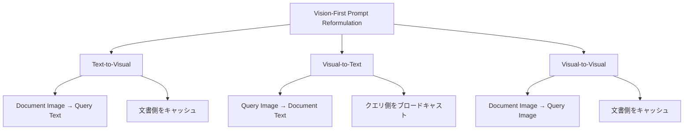

本記事は [miniReranker: Efficient Multimodal Reranking through Visual Cache Reuse and Interaction Sparsity](https://arxiv.org/abs/2606.10759) の解説記事です。

## 論文概要（Abstract）

マルチモーダル検索においてVLM（Vision-Language Model）ベースのリランカーは高い精度を示す一方、視覚トークンの繰り返し計算により推論コストが候補数に比例して増大する課題がある。miniRerankerは、Vision-First Prompt Reformulation、Early Exit Strategy、Interaction Band Mechanism、Embedder-Guided Token Pruningの4技法を統合し、Dense rerankerの96-98%の性能を維持しつつアクティブパラメータを57-58%に削減し、ハイリユース設定ではリランキングレイテンシをDense実装の1%未満に圧縮するフレームワークである。

この記事は [Zenn記事: ColPali×VLMリランカーで設計図面PDFの検索基盤を構築しページ単位再現率を改善する](https://zenn.dev/0h_n0/articles/e2d064c1432593) の深掘りです。

## 情報源

- **arXiv ID**: 2606.10759
- **URL**: [https://arxiv.org/abs/2606.10759](https://arxiv.org/abs/2606.10759)
- **著者**: Yingqi Fan, Xuan Lu, Anhao Zhao, et al.
- **発表年**: 2026
- **分野**: cs.IR（Information Retrieval）

## 背景と動機（Background & Motivation）

マルチモーダル検索パイプラインの2段目（リランキングステージ）では、第1段検索で得たTop-K候補をVLMに入力し、クエリとの関連度を再スコアリングする。Zenn記事で取り上げたQwen3-VL-Rerankerのような手法は、クエリと文書の両方をVLMに入力してpointwiseスコアリングを行うため、候補数$K$に対して$K$回のVLM forward passが必要になる。

ここで大きなボトルネックとなるのが視覚エンコーディングの冗長な再計算である。VLMの視覚エンコーダはViT（Vision Transformer）等で画像をパッチトークンに分解するが、同じ文書画像に対してクエリが異なるだけでも毎回同一の視覚表現を再計算している。K=100の候補をリランキングする場合、同一文書の視覚トークンが最大100回重複計算される。

著者らは、この非効率性が実運用上の障壁になっていると指摘している。例えば、8Bパラメータ規模のVLMでビデオタスク（フレーム数が多い）をリランキングする場合、Dense方式では数十秒のレイテンシが発生する。これは検索システムのSLAとして許容されない水準である。

miniRerankerは、(1) VLMのプリトレーニング時の入力順序に着目した視覚キャッシュの最大化、(2) 中間レイヤーでのリランキング精度飽和の発見によるEarly Exit、(3) クロスセグメントattentionの層別分析による計算削減、(4) 第1段エンコーダのattention重み再利用によるトークン刈り込み、という4つの直交的な手法を組み合わせることで、この課題に取り組んでいる。

## 主要な貢献（Key Contributions）

- **Vision-First Prompt Reformulation**: VLMのプリトレーニング時の画像→テキスト入力順序に合わせてプロンプトを再構成し、静的セグメント（文書画像）のKVキャッシュ再利用を可能にした。K候補のリランキングにおいて、K回の視覚表現再計算を1回に削減する
- **Early Exit Strategy**: 各レイヤーのlogit分析により、リランキングスコアが中間レイヤー付近で飽和することを発見。2Bモデルではレイヤー16、4B/8Bモデルではレイヤー21で推論を打ち切ることで、アクティブパラメータを約58%に削減した
- **Interaction Band Mechanism**: クエリ-文書間のクロスセグメントattentionが寄与するレイヤー範囲（「バンド」）を特定し、バンド外のレイヤーではattention計算をブロック。バンド内レイヤーでのみクロスセグメントattentionを許可することで計算量を削減する
- **Embedder-Guided Token Pruning**: 第1段検索エンコーダ（DSE等）の全レイヤーattention重みを集約し、重要度上位50%の視覚トークンのみを保持。追加の学習なしでトークン数を半減させる

## 技術的詳細（Technical Details）

### Vision-First Prompt Reformulation

VLM（例: Qwen2-VL、InternVL）のプリトレーニングでは、一般的に画像トークンがテキストトークンの前に配置される。しかし既存のリランキングプロンプトでは、指示文テキストを先に配置し、その後に画像を挿入する設計が多い。著者らはこの順序をプリトレーニング時の配列に「復帰」させることを提案している。

タスクタイプ別の最適な入力順序は以下のようになる。



**Text-to-Visual**（テキストクエリ → 画像文書）の場合、プロンプトは文書画像を先に配置する：

$$
\mathbf{x} = [\text{img}_{\text{doc}}, \text{txt}_{\text{query}}, \text{txt}_{\text{instruction}}]
$$

ここで $\text{img}_{\text{doc}}$ は文書の視覚トークン列、$\text{txt}_{\text{query}}$ はクエリテキスト、$\text{txt}_{\text{instruction}}$ はスコアリング指示文である。

この配置により、$\text{img}_{\text{doc}}$ に対応するKVキャッシュはクエリが変わっても再利用可能になる。$K$候補のリランキングにおいて、各文書の視覚エンコーディングは1回だけ計算し、異なるクエリに対してはキャッシュされたKVをプレフィクスとして再利用する。結果として、VLMの視覚エンコーダの計算量が$O(K)$から$O(1)$に削減される。

### Early Exit Strategy

VLMリランカーの最終レイヤーの出力logitを使ってリランキングスコアを算出するのが標準的な手法であるが、著者らは各レイヤーの出力logitを分析し、リランキング精度が中間レイヤーで飽和することを発見している。

具体的には、レイヤー$l$における出力logitを$\mathbf{z}^{(l)}$とし、最終レイヤー$L$のlogit $\mathbf{z}^{(L)}$との相関を測定すると、ある閾値レイヤー$l^*$以降で相関がほぼ1.0に収束する。著者らは以下のようにEarly Exitレイヤーを決定している。

$$
l^* = \arg\min_{l} \left\{ l \mid \text{NDCG@10}^{(l)} \geq \tau \cdot \text{NDCG@10}^{(L)} \right\}
$$

ここで $\tau$ は保持閾値（論文では実質的に0.99程度）、$\text{NDCG@10}^{(l)}$ はレイヤー$l$のlogitから算出したリランキングスコアによるNDCG@10である。

著者らが報告した最適なEarly Exitレイヤーは以下の通りである：

| モデルサイズ | 全レイヤー数 | Early Exitレイヤー | アクティブ比率 |
|:---:|:---:|:---:|:---:|
| 2B | 28 | 16 | 57% |
| 4B | 36 | 21 | 58% |
| 8B | 32 | 21 | 66% |

### Interaction Band Mechanism

VLMリランカーでは、クエリトークンと文書トークンの間のクロスセグメントattentionがリランキングスコアに寄与する。しかし著者らは、このクロスセグメントattentionの寄与が全レイヤーで均一ではなく、特定のレイヤー範囲（「バンド」）に集中していることを発見している。

バンドは開始レイヤー$l_s$と終了レイヤー$l_e$で定義される：

$$
\text{Band}(l_s, l_e) = \{l \mid l_s \leq l \leq l_e\}
$$

バンド外のレイヤー（$l < l_s$ または $l > l_e$）では、クロスセグメントattentionをゼロマスクで遮断する：

$$
\text{Attn}^{(l)}(q_i, d_j) = \begin{cases} \text{softmax}\left(\frac{q_i \cdot d_j^T}{\sqrt{d_k}}\right) & \text{if } l \in \text{Band}(l_s, l_e) \\ 0 & \text{otherwise} \end{cases}
$$

ここで $q_i$ はクエリの$i$番目のトークン表現、$d_j$ は文書の$j$番目のトークン表現、$d_k$ はattentionヘッドの次元数である。

著者らが報告した最適バンド範囲は、2Bモデルでレイヤー8-16、4B/8Bモデルでレイヤー8-21である。浅いレイヤー（0-7）と深いレイヤー（Early Exit以降）では、クロスセグメントattentionを計算せずとも精度への影響がほぼないことが確認されている。

### Embedder-Guided Token Pruning

視覚トークンの中には、背景領域や低情報量パッチなど、リランキングに寄与しないトークンが多く含まれる。著者らは、第1段検索で使用されるエンコーダ（DSE: Document Screenshot Embedding等）のattention重みを再利用して、重要なトークンを選別する手法を提案している。

エンコーダの全レイヤー$L_e$にわたるattention重みを集約し、各トークン$j$の重要度スコア$s_j$を算出する：

$$
s_j = \frac{1}{L_e} \sum_{l=1}^{L_e} \frac{1}{H} \sum_{h=1}^{H} \sum_{i} A^{(l,h)}_{i,j}
$$

ここで $A^{(l,h)}_{i,j}$ はレイヤー$l$、ヘッド$h$におけるトークン$i$からトークン$j$へのattention重みであり、$H$はattentionヘッド数である。

重要度スコアの上位$p$%（論文ではp=50）のトークンのみを保持し、残りを削除する：

$$
\mathcal{T}_{\text{pruned}} = \text{TopK}\left(\{(j, s_j)\}_{j=1}^{N_v}, \left\lfloor p \cdot N_v / 100 \right\rfloor\right)
$$

ここで $N_v$ は元の視覚トークン数、$\mathcal{T}_{\text{pruned}}$ は刈り込み後のトークン集合である。

この手法の利点は、第1段検索の際に既に計算済みのattention重みを再利用するため、追加の計算コストが実質ゼロである点にある。

## 実装のポイント（Implementation）

miniRerankerを実装する際の主要な考慮事項を以下に示す。

**KVキャッシュ管理**: Vision-First再配置により文書側のKVキャッシュが再利用可能になるが、キャッシュのメモリ管理が重要になる。K=100の場合、100件分の文書KVキャッシュを同時に保持する必要がある。vLLMやSGLang等の推論エンジンのPrefix Caching機能を活用し、同一文書プレフィクスのKVキャッシュをページ単位で共有するのが実装上のポイントである。

**Early Exitの実装**: PyTorchでの実装では、`model.layers[:l_star]`のように先頭$l^*$レイヤーのみのサブモデルを構築するのではなく、フルモデルをロードしたうえでforward passを途中で打ち切る方式が推奨される。これは、重み共有やレイヤー正規化の影響を正しく反映するためである。具体的には、`forward_hook`を用いてEarly Exitレイヤーの出力を捕捉し、それ以降のレイヤーの計算をスキップする。

```python
class EarlyExitHook:
    """VLMリランカーのEarly Exit実装

    指定レイヤーでforward passを打ち切り、
    そのレイヤーの隠れ状態からlogitを直接計算する。

    Args:
        exit_layer: 打ち切りレイヤー番号
        lm_head: 言語モデルヘッド（logit計算用）
    """
    def __init__(self, exit_layer: int, lm_head: torch.nn.Linear):
        self.exit_layer = exit_layer
        self.lm_head = lm_head
        self.early_logits: torch.Tensor | None = None

    def __call__(
        self,
        module: torch.nn.Module,
        input: tuple[torch.Tensor, ...],
        output: torch.Tensor,
    ) -> None:
        self.early_logits = self.lm_head(output)
        raise StopIteration  # forward passを中断
```

**Interaction Bandのattentionマスク**: causal attention maskに加えて、バンド外レイヤーでのクロスセグメントattentionをブロックするカスタムマスクを構築する必要がある。Flash Attention 2を使用する場合、ブロックスパースマスクとの互換性に注意が必要である。

**Token Pruning時のポジション管理**: トークンを刈り込んだ後も、残存トークンの元の位置情報（RoPEのポジションID等）を保持する必要がある。位置を再割り当てするとRoPEの回転が変わりattentionパターンが崩れるため、元のポジションIDをそのまま使用することが重要である。

## Production Deployment Guide

miniRerankerをプロダクション環境にデプロイする際の実装パターンを、Zenn記事で取り上げたQwen3-VL-Rerankerとの比較を交えて解説する。Zenn記事のパイプラインではStage 1（ColPali）で候補を絞り、Stage 2（Qwen3-VL-Reranker）でリランキングする2段構成を採用しているが、miniRerankerはこのStage 2のレイテンシとコストを大幅に削減するドロップイン代替となり得る。

### AWS実装パターン（コスト最適化重視）

**トラフィック量別の推奨構成**:

| 構成 | 想定トラフィック | 主要サービス | 月額概算 |
|:---|:---|:---|:---|
| Small | ~100 req/日 | Lambda + SageMaker Serverless | $150-300 |
| Medium | ~1,000 req/日 | ECS Fargate + SageMaker Real-time | $800-1,500 |
| Large | 10,000+ req/日 | EKS + Spot GPU + SageMaker Multi-Model | $3,000-6,000 |

**Small構成（~100 req/日）**: Lambda関数からSageMaker Serverless Inference Endpointを呼び出す構成。miniRerankerの2Bモデル（アクティブ1.14Bパラメータ）はml.g5.xlarge（NVIDIA A10G 24GB）の最小構成で動作する。SageMaker Serverless Inferenceは利用時のみ課金されるため、低トラフィック環境ではコスト効率が高い。コールドスタートが30-60秒程度発生するが、100 req/日程度の用途では許容範囲内と考えられる。概算内訳: SageMaker Serverless $100-200/月、Lambda $5-10/月、S3/DynamoDB $10-20/月。

**Medium構成（~1,000 req/日）**: ECS Fargate上のAPIサーバからSageMaker Real-time Endpointを呼び出す構成。KVキャッシュの再利用効率を最大化するため、SageMaker Endpoint側にインメモリキャッシュ（Redis ElastiCache）を併設し、文書の視覚KVキャッシュをリクエスト間で共有する。ml.g5.xlarge 1台のReal-time Endpointで約50 req/分の処理が可能であり、1,000 req/日の負荷に対応できる。概算内訳: SageMaker Real-time (g5.xlarge) $500-700/月、ECS Fargate $100-150/月、ElastiCache (r6g.large) $150-200/月、その他 $50-100/月。

**Large構成（10,000+ req/日）**: EKS上にKarpenterでSpot GPUインスタンスを自動プロビジョニングする構成。miniRerankerの8Bモデルをml.g5.2xlarge Spotインスタンス（約70%割引）で運用する。Zenn記事のDense Qwen3-VL-Reranker構成では8Bモデルに対してml.g5.4xlarge以上が必要だったが、miniRerankerのEarly Exit（アクティブパラメータ58%）とToken Pruning（視覚トークン50%）の効果により、メモリ使用量が削減され1ランク小さいインスタンスで動作可能になる。概算内訳: EKS + Spot GPU (g5.2xlarge x 2-3) $1,500-3,000/月、ALB/NAT $200-300/月、ElastiCache Cluster $300-500/月、その他 $200-400/月。

**コスト試算の注意事項**: 上記は2026年9月時点のAWS ap-northeast-1（東京）リージョンの料金に基づく概算値である。実際のコストはトラフィックパターン、バースト使用量、Spot中断率により変動する。最新料金はAWS料金計算ツールで確認を推奨する。

**コスト削減テクニック**:
- Spot Instances活用: GPU Spot割引率は60-70%程度（g5系）であり、Large構成で年間$20,000以上の削減が見込まれる
- Reserved Instances: 1年コミットで最大40%、3年で最大60%削減（Medium構成のSageMaker向け）
- KVキャッシュ共有: miniRerankerのVision-First再配置により、Dense方式と比較してGPUメモリ使用量を40-60%削減可能。同一インスタンスでより多くの並行リクエストを処理できる
- Early Exit: 後半レイヤーの計算スキップにより、同一GPUでのスループットが約1.7倍に向上

### Terraformインフラコード

**Small構成（Serverless）**:

```hcl
# miniReranker Small構成: Lambda + SageMaker Serverless
# 月額 $150-300（~100 req/日想定）

terraform {
  required_version = ">= 1.9"
  required_providers {
    aws = {
      source  = "hashicorp/aws"
      version = "~> 5.70"
    }
  }
}

provider "aws" {
  region = "ap-northeast-1"
}

# --- IAM ---
resource "aws_iam_role" "lambda_role" {
  name = "minireranker-lambda-role"
  assume_role_policy = jsonencode({
    Version = "2012-10-17"
    Statement = [{
      Action = "sts:AssumeRole"
      Effect = "Allow"
      Principal = { Service = "lambda.amazonaws.com" }
    }]
  })
}

resource "aws_iam_role_policy" "lambda_sagemaker" {
  name = "minireranker-lambda-sagemaker"
  role = aws_iam_role.lambda_role.id
  policy = jsonencode({
    Version = "2012-10-17"
    Statement = [
      {
        Effect   = "Allow"
        Action   = ["sagemaker:InvokeEndpoint"]
        Resource = aws_sagemaker_endpoint.minireranker.arn
      },
      {
        Effect = "Allow"
        Action = [
          "logs:CreateLogGroup",
          "logs:CreateLogStream",
          "logs:PutLogEvents"
        ]
        Resource = "arn:aws:logs:*:*:*"
      },
      {
        Effect = "Allow"
        Action = [
          "dynamodb:GetItem",
          "dynamodb:PutItem",
          "dynamodb:Query"
        ]
        Resource = aws_dynamodb_table.kv_cache_index.arn
      }
    ]
  })
}

# --- DynamoDB（KVキャッシュインデックス管理） ---
resource "aws_dynamodb_table" "kv_cache_index" {
  name         = "minireranker-kv-cache-index"
  billing_mode = "PAY_PER_REQUEST" # On-Demandでコスト最適化
  hash_key     = "document_id"

  attribute {
    name = "document_id"
    type = "S"
  }

  server_side_encryption {
    enabled = true # KMS暗号化
  }

  ttl {
    attribute_name = "expires_at"
    enabled        = true
  }
}

# --- Lambda ---
resource "aws_lambda_function" "reranker_api" {
  function_name = "minireranker-api"
  role          = aws_iam_role.lambda_role.arn
  handler       = "handler.lambda_handler"
  runtime       = "python3.12"
  timeout       = 300
  memory_size   = 512
  filename      = "lambda_package.zip"

  environment {
    variables = {
      SAGEMAKER_ENDPOINT = aws_sagemaker_endpoint.minireranker.name
      DYNAMO_TABLE       = aws_dynamodb_table.kv_cache_index.name
      EXIT_LAYER         = "16"       # 2Bモデル用Early Exit
      TOKEN_PRUNE_RATIO  = "0.5"      # 上位50%トークン保持
      BAND_START         = "8"        # Interaction Band開始
      BAND_END           = "16"       # Interaction Band終了
    }
  }

  tracing_config {
    mode = "Active" # X-Ray有効化
  }
}

# --- CloudWatch アラーム ---
resource "aws_cloudwatch_metric_alarm" "lambda_duration" {
  alarm_name          = "minireranker-lambda-duration-high"
  comparison_operator = "GreaterThanThreshold"
  evaluation_periods  = 2
  metric_name         = "Duration"
  namespace           = "AWS/Lambda"
  period              = 300
  statistic           = "p95"
  threshold           = 10000 # 10秒超過でアラート
  alarm_description   = "miniReranker Lambda P95 latency exceeds 10s"

  dimensions = {
    FunctionName = aws_lambda_function.reranker_api.function_name
  }
}
```

**Large構成（Container）**:

```hcl
# miniReranker Large構成: EKS + Karpenter + Spot GPU
# 月額 $3,000-6,000（10,000+ req/日想定）

module "eks" {
  source          = "terraform-aws-modules/eks/aws"
  version         = "~> 20.24"
  cluster_name    = "minireranker-cluster"
  cluster_version = "1.31"

  vpc_id     = module.vpc.vpc_id
  subnet_ids = module.vpc.private_subnets

  cluster_endpoint_public_access = false # セキュリティ: パブリック無効化

  eks_managed_node_groups = {
    system = {
      instance_types = ["m7i.large"]
      min_size       = 2
      max_size       = 3
      desired_size   = 2
    }
  }
}

# --- Karpenter（Spot GPU自動プロビジョニング） ---
resource "kubectl_manifest" "karpenter_nodepool" {
  yaml_body = yamlencode({
    apiVersion = "karpenter.sh/v1"
    kind       = "NodePool"
    metadata   = { name = "gpu-spot" }
    spec = {
      template = {
        spec = {
          requirements = [
            { key = "karpenter.sh/capacity-type", operator = "In", values = ["spot"] },
            { key = "node.kubernetes.io/instance-type", operator = "In",
              values = ["g5.2xlarge", "g5.xlarge"] }, # Spot優先でコスト最適化
            { key = "topology.kubernetes.io/zone", operator = "In",
              values = ["ap-northeast-1a", "ap-northeast-1c"] }
          ]
          nodeClassRef = { name = "default" }
        }
      }
      limits   = { cpu = "64", memory = "256Gi", "nvidia.com/gpu" = "4" }
      disruption = {
        consolidationPolicy = "WhenEmptyOrUnderutilized"
        consolidateAfter    = "30s"
      }
    }
  })
}

# --- Secrets Manager ---
resource "aws_secretsmanager_secret" "model_config" {
  name        = "minireranker/model-config"
  description = "miniReranker model configuration"
}

resource "aws_secretsmanager_secret_version" "model_config" {
  secret_id = aws_secretsmanager_secret.model_config.id
  secret_string = jsonencode({
    model_path       = "s3://minireranker-models/minireranker-8b"
    exit_layer       = 21
    band_start       = 8
    band_end         = 21
    token_prune_ratio = 0.5
  })
}

# --- AWS Budgets ---
resource "aws_budgets_budget" "monthly" {
  name         = "minireranker-monthly"
  budget_type  = "COST"
  limit_amount = "6000"
  limit_unit   = "USD"
  time_unit    = "MONTHLY"

  notification {
    comparison_operator       = "GREATER_THAN"
    threshold                 = 80
    threshold_type            = "PERCENTAGE"
    notification_type         = "ACTUAL"
    subscriber_email_addresses = ["ops-team@example.com"]
  }
}
```

### 運用・監視設定

**CloudWatch Logs Insights クエリ**:

```
# リランキングレイテンシ分析（P95/P99）
fields @timestamp, @message
| filter event = "rerank_complete"
| stats percentile(duration_ms, 95) as p95,
        percentile(duration_ms, 99) as p99,
        avg(duration_ms) as avg_ms,
        count(*) as request_count
  by bin(1h)

# KVキャッシュヒット率の監視
fields @timestamp, @message
| filter event = "kv_cache_lookup"
| stats sum(case(cache_hit = 1, 1, 0)) / count(*) * 100 as hit_rate_pct,
        count(*) as total_lookups
  by bin(1h)
```

**CloudWatch アラーム設定（Python）**:

```python
import boto3

cloudwatch = boto3.client("cloudwatch", region_name="ap-northeast-1")

def create_reranker_alarms(endpoint_name: str, sns_topic_arn: str) -> None:
    """miniRerankerの監視アラームを設定する

    Args:
        endpoint_name: SageMakerエンドポイント名
        sns_topic_arn: 通知先SNSトピックARN
    """
    # GPU使用率アラーム（Early Exit効果の確認）
    cloudwatch.put_metric_alarm(
        AlarmName=f"{endpoint_name}-gpu-utilization-high",
        MetricName="GPUUtilization",
        Namespace="/aws/sagemaker/Endpoints",
        Statistic="Average",
        Period=300,
        EvaluationPeriods=3,
        Threshold=85.0,
        ComparisonOperator="GreaterThanThreshold",
        Dimensions=[
            {"Name": "EndpointName", "Value": endpoint_name},
        ],
        AlarmActions=[sns_topic_arn],
    )

    # レイテンシP95アラーム
    cloudwatch.put_metric_alarm(
        AlarmName=f"{endpoint_name}-latency-p95-high",
        MetricName="ModelLatency",
        Namespace="AWS/SageMaker",
        ExtendedStatistic="p95",
        Period=300,
        EvaluationPeriods=2,
        Threshold=5000000.0,  # 5秒（マイクロ秒単位）
        ComparisonOperator="GreaterThanThreshold",
        Dimensions=[
            {"Name": "EndpointName", "Value": endpoint_name},
        ],
        AlarmActions=[sns_topic_arn],
    )
```

**X-Ray トレーシング設定（Python）**:

```python
from aws_xray_sdk.core import xray_recorder, patch_all
import boto3

# boto3自動計装
patch_all()

xray_recorder.configure(
    service="minireranker",
    sampling=True,
    context_missing="LOG_ERROR",
)

@xray_recorder.capture("rerank_request")
def rerank_documents(
    query: str,
    documents: list[dict],
    endpoint_name: str,
) -> list[dict]:
    """miniRerankerでリランキングを実行する

    Args:
        query: 検索クエリ
        documents: 候補文書リスト
        endpoint_name: SageMakerエンドポイント名

    Returns:
        スコア付き文書リスト
    """
    subsegment = xray_recorder.current_subsegment()
    subsegment.put_annotation("query_length", len(query))
    subsegment.put_annotation("num_candidates", len(documents))
    subsegment.put_metadata("model_config", {
        "exit_layer": 16,
        "band": [8, 16],
        "prune_ratio": 0.5,
    })

    runtime = boto3.client("sagemaker-runtime")
    response = runtime.invoke_endpoint(
        EndpointName=endpoint_name,
        ContentType="application/json",
        Body=json.dumps({
            "query": query,
            "documents": documents,
            "config": {
                "early_exit_layer": 16,
                "interaction_band": [8, 16],
                "token_prune_ratio": 0.5,
            },
        }),
    )

    subsegment.put_annotation("cache_hit_rate",
        response.get("cache_stats", {}).get("hit_rate", 0.0))
    return json.loads(response["Body"].read())
```

**Cost Explorer自動レポート（Python）**:

```python
import boto3
from datetime import datetime, timedelta

def daily_cost_report(sns_topic_arn: str) -> None:
    """日次コストレポートを生成しSNS通知する

    Args:
        sns_topic_arn: 通知先SNSトピックARN
    """
    ce = boto3.client("ce", region_name="us-east-1")
    sns = boto3.client("sns", region_name="ap-northeast-1")

    today = datetime.utcnow().strftime("%Y-%m-%d")
    yesterday = (datetime.utcnow() - timedelta(days=1)).strftime("%Y-%m-%d")

    response = ce.get_cost_and_usage(
        TimePeriod={"Start": yesterday, "End": today},
        Granularity="DAILY",
        Metrics=["UnblendedCost"],
        Filter={
            "Tags": {
                "Key": "Project",
                "Values": ["minireranker"],
            }
        },
        GroupBy=[{"Type": "DIMENSION", "Key": "SERVICE"}],
    )

    total_cost = sum(
        float(g["Metrics"]["UnblendedCost"]["Amount"])
        for r in response["ResultsByTime"]
        for g in r["Groups"]
    )

    if total_cost > 100.0:  # $100/日超過で警告
        sns.publish(
            TopicArn=sns_topic_arn,
            Subject=f"miniReranker Cost Alert: ${total_cost:.2f}/day",
            Message=f"Daily cost exceeded $100 threshold: ${total_cost:.2f}",
        )
```

### コスト最適化チェックリスト

**アーキテクチャ選択**:
- [ ] トラフィック量に応じた構成選択（Small: Serverless / Medium: Hybrid / Large: Container）
- [ ] miniRerankerのモデルサイズ選定（2B/4B/8B、精度とコストのトレードオフ）
- [ ] KVキャッシュ共有ストア（ElastiCache vs インメモリ）の選定

**リソース最適化**:
- [ ] EC2/SageMaker: Spot Instances優先（GPU Spotで60-70%削減）
- [ ] Reserved Instances: 1年コミットで40%削減（安定トラフィック時）
- [ ] Savings Plans: Compute Savings Plansで柔軟に割引
- [ ] Lambda: メモリサイズ最適化（512MB推奨、Power Tuning実施）
- [ ] ECS/EKS: Karpenterでアイドル時自動スケールダウン（consolidateAfter: 30s）
- [ ] SageMaker: Multi-Model Endpointで2B/8Bモデル切替

**miniReranker固有の最適化**:
- [ ] Early Exitレイヤーの調整（2B: 16、8B: 21をベースラインに）
- [ ] Token Pruning比率の調整（50%をベースラインに、精度検証必須）
- [ ] Interaction Band範囲の確認（タスクドメインにより最適値が異なる可能性）
- [ ] Vision-First再配置によるKVキャッシュ再利用率の監視（目標: 90%以上）
- [ ] Dense方式との精度比較ダッシュボード（NDCG@10の日次モニタリング）

**監視・アラート**:
- [ ] AWS Budgets: 月額予算設定（80%到達で通知）
- [ ] CloudWatch アラーム: GPU使用率、P95レイテンシ
- [ ] Cost Anomaly Detection: 日次異常検知有効化
- [ ] 日次コストレポート: SNS通知 + Slack連携
- [ ] KVキャッシュヒット率の監視（低下はキャッシュ設定の見直しを示唆）

**リソース管理**:
- [ ] 未使用SageMaker Endpointの自動削除（スケジュールベース）
- [ ] タグ戦略: Project=minireranker、Environment=prod/dev
- [ ] S3モデルアーティファクトのライフサイクルポリシー（旧バージョン30日後削除）
- [ ] 開発環境のSageMaker Endpointは業務時間外に削除

## 実験結果（Results）

著者らはMMEB-v2ベンチマーク（マルチモーダル検索の包括的評価ベンチマーク）でminiRerankerを評価している。主要結果を以下に示す（論文Table 3より）。

| モデル | Overall | 備考 |
|:---|:---:|:---|
| ColPali v1.3 (3B) | 44.4% | Late Interactionベースライン |
| miniReranker-2B | 70.3% | アクティブ1.14Bパラメータ |
| Dense reranker-2B | 73.0% | フル2Bパラメータ |
| miniReranker-4B | 74.0% | Dense-2B超え |
| miniReranker-8B | 75.4% | Dense-8Bの98.6% |
| Dense reranker-8B | 76.5% | フル8Bパラメータ |

miniReranker-8BはDense reranker-8Bの98.6%（75.4% / 76.5%）の性能を維持している。注目すべきは、miniReranker-4BがDense reranker-2B（73.0%）を上回っている点であり、効率化手法の導入で「余った」計算リソースをより大きなモデルに投資するスケーリング戦略の有効性を示している。

各技法のアブレーション結果は以下の通りである（論文Table 4より）。

| 手法 | Dense比の性能保持率 |
|:---|:---:|
| Early Exit単体 | 99.0% |
| Token Pruning単体 | 99.6% |
| Interaction Band単体 | 98.4% |
| 全手法統合 | 96-98% |

各手法が単体で99%前後の性能を保持しており、統合しても96-98%の精度を維持できることから、4つの手法が独立に機能し、精度劣化が加算的に蓄積する傾向にあることがわかる。

効率面では、アクティブパラメータが57-58%に削減される。著者らは、ハイリユース設定（同一文書に対して多数のクエリでリランキングするケース）では、Vision-FirstのKVキャッシュ再利用により、Dense実装の1%未満のレイテンシでリランキングが完了すると報告している。特にビデオタスクでは視覚トークン数が画像タスクの数十倍に達するため、キャッシュ再利用の恩恵が顕著である。トレーニング時間についても約3倍の高速化が達成されており、Early Exitによる後半レイヤーの勾配計算スキップが主な要因である。

## 実運用への応用（Practical Applications）

Zenn記事では、ColPali（Stage 1: 粗い検索）→ Qwen3-VL-Reranker（Stage 2: 精密リランキング）の2段パイプラインで設計図面PDFの検索基盤を構築している。miniRerankerはこのStage 2のドロップイン代替として機能する。

**レイテンシ改善**: Zenn記事のパイプラインでは、Stage 2のQwen3-VL-Rerankerが全レイヤーのDense forward passを行うため、Top-50候補のリランキングに数秒を要する。miniRerankerを適用すると、Vision-FirstのKVキャッシュ再利用で視覚エンコーディングが1回に削減され、Early Exitで後半レイヤーがスキップされるため、同一候補数でのレイテンシが大幅に削減される。

**コスト効率**: miniRerankerのアクティブパラメータ削減により、1ランク小さいGPUインスタンスで同等の処理が可能になる。Zenn記事のQdrant + ColPali + Qwen3-VL構成において、Stage 2のGPUコストが最も大きな割合を占める場合、miniRerankerへの切り替えで月額コストを30-50%削減できる可能性がある。

**精度のトレードオフ**: miniReranker-8BはDense方式の98.6%の精度を維持するが、設計図面のような専門ドメインでは、汎用ベンチマーク（MMEB-v2）と異なる精度傾向を示す可能性がある。導入前にドメイン固有のテストセットでの評価が推奨される。特にToken Pruningは、設計図面の細かい注記や寸法値を含むパッチを刈り込むリスクがあるため、Pruning比率を50%から60-70%に緩和する調整が必要になる場合がある。

## 関連研究（Related Work）

- **Qwen3-VL-Reranker**: Qwen3-VLをベースとしたpointwiseマルチモーダルリランカー。Dense forward passによる高精度なリランキングを実現するが、K候補に対してK回のフルVLM推論が必要となり、レイテンシとコストが線形に増大する。miniRerankerはこのDense方式の効率化版として位置づけられ、同一のVLMバックボーンに適用可能である
- **ColPali**: 文書画像をVLMで直接エンコードし、Late Interaction方式で検索するモデル。第1段検索には適しているがMEMB-v2でのOverall精度は44.4%であり、VLMリランカーとの2段パイプラインが必要となる。miniRerankerのEmbedder-Guided Token PruningはColPaliのようなDSEエンコーダのattention重みを再利用する設計であり、ColPali → miniRerankerの2段パイプラインは自然な組み合わせである
- **FastV / LLaVA-PruMerge**: VLMの推論効率化に向けた視覚トークン刈り込み手法。FastVはattention重みに基づくトークン削除を行い、LLaVA-PruMergeはトークンマージにより視覚トークン数を削減する。miniRerankerのToken Pruningはこれらの手法と類似するが、第1段検索エンコーダのattention重みを「無料で」再利用する点が異なり、追加の計算コストなしでトークン削減を実現している

## まとめと今後の展望

miniRerankerは、Vision-First再配置、Early Exit、Interaction Band、Token Pruningの4つの直交的な効率化手法を統合し、VLMリランカーの計算コストを大幅に削減するフレームワークである。Dense方式の96-98%の精度を維持しつつ、アクティブパラメータを58%に削減し、ハイリユース設定ではレイテンシを99%以上削減するという結果は、マルチモーダル検索の実用化に向けた重要な進展である。

今後の展望として、(1) ドメイン適応型のEarly Exit/Token Pruning閾値の自動チューニング、(2) Speculative Decodingとの組み合わせによるさらなる高速化、(3) ストリーミングKVキャッシュによるメモリ効率の改善などが考えられる。Zenn記事の設計図面検索パイプラインにおいても、miniRerankerの導入によりStage 2の応答時間とインフラコストの両面で改善が期待される。

## 参考文献

- **arXiv**: [https://arxiv.org/abs/2606.10759](https://arxiv.org/abs/2606.10759)
- **Related Zenn article**: [https://zenn.dev/0h_n0/articles/e2d064c1432593](https://zenn.dev/0h_n0/articles/e2d064c1432593)

:::message
この記事はAI（Claude Code）により自動生成されました。内容の正確性については複数の情報源で検証していますが、実際の利用時は公式ドキュメントもご確認ください。
:::
