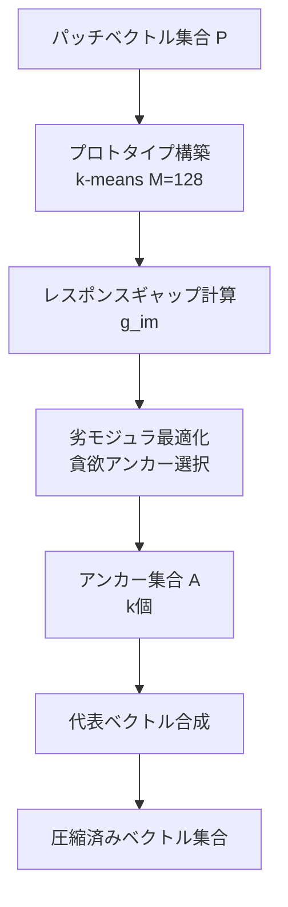

本記事は [Coverage Matters: MarginMerge for Compressing Multi-Vector Visual Document Retrievers](https://arxiv.org/abs/2608.02969) の解説記事です。

この記事は [Zenn記事: ColPali×VLMリランカーで設計図面PDFの検索基盤を構築しページ単位再現率を改善する](https://zenn.dev/0h_n0/articles/e2d064c1432593) の深掘りです。

## 論文概要（Abstract）

ColPaliやColQwenのようなマルチベクトル視覚文書検索モデルは、文書ページの各パッチに対して独立した埋め込みベクトルを生成する。この方式はMaxSim演算によって精度の高い検索を実現するが、1文書あたり数百から数千のベクトルを保持する必要があり、ストレージとクエリ時の計算コストが大きな課題となる。本論文では、ベクトル圧縮を従来の独立したパッチランキング問題ではなく**集合被覆問題**として定式化するMarginMergeを提案している。著者らは、5%のベクトル保持でnDCG@5の97-99%を維持できると報告している。

## 情報源

- **arXiv ID**: 2608.02969
- **URL**: [https://arxiv.org/abs/2608.02969](https://arxiv.org/abs/2608.02969)
- **著者**: Ailar Mahdizadeh, Aria Salari, Sohail Rajabi et al.
- **発表年**: 2026
- **分野**: cs.IR（情報検索）

## 背景と動機（Background & Motivation）

ColPaliに代表されるマルチベクトル視覚文書検索モデルは、Vision-Language Model（VLM）を用いて文書ページの画像パッチごとに埋め込みベクトルを生成し、MaxSim演算でクエリとの類似度を計算する。この方式は、OCRパイプラインを介さずに視覚的レイアウト情報を活用できるため、図表や設計図面を含む文書検索で高い精度を示す。

しかし、1ページあたり1024個以上のパッチベクトル（各128次元）が生成されるため、100万ページ規模のコーパスでは数十億のベクトルを保持・検索する必要が生じる。既存の圧縮手法は各パッチの重要度スコアに基づいてトップkを選択するアプローチが主流だが、著者らはこのアプローチに根本的な問題があると指摘している。重要度ベースの手法では、高スコアのパッチが文書の同一領域に集中しやすく、クエリトークンが参照する文書領域の多様性（被覆性）が失われる。実際に、ランダム選択がサリエンスベース手法を上回るという観察結果（論文Table 2より）が、カバレッジの多様性が重要度集中より重要であることを示唆している。

## 主要な貢献（Key Contributions）

- **Coverage-Aware Anchors**: パッチベクトルの選択を劣モジュラ最適化による集合被覆問題として定式化し、$(1 - 1/e)$近似保証付きの貪欲アルゴリズムでアンカーを選択する手法を提案
- **Learned Representative Synthesis**: 元のパッチベクトルを直接選択するのではなく、クラスタごとに凸結合と学習済み残差を用いて新たな代表ベクトルを合成する手法を導入（わずか1,057パラメータ）
- **Ranking-Margin Distillation**: 絶対スコアの再構成ではなく、正例-負例間のスコアマージンを保存する蒸留損失を設計し、ランキング順序の保存に特化
- **圧縮可能性分析**: 文書タイプごとの冗長性多重度（パッチあたりの有効埋め込み方向数）を定量化し、自然画像（4.8）と密な文書（46-64）の差異を明示

## 技術的詳細（Technical Details）

### Coverage-Aware Anchor Selection

MarginMergeの第1段階では、文書のパッチベクトル集合$\mathcal{P} = \{\mathbf{p}_1, \ldots, \mathbf{p}_N\}$から、クエリトークン空間全体を被覆するアンカー集合$\mathcal{A} \subseteq \mathcal{P}$（$|\mathcal{A}| = k$）を選択する。

まず、$M = 128$個のプロトタイプベクトル$\{\mathbf{q}_1, \ldots, \mathbf{q}_M\}$をトレーニングクエリからk-meansクラスタリングで構築する。これらはクエリ空間の代表的な方向を表現する。

各パッチ$\mathbf{p}_i$のプロトタイプ$\mathbf{q}_m$に対するレスポンスギャップ$g_{i,m}$を定義する:

$$
g_{i,m} = \langle \mathbf{p}_i, \mathbf{q}_m \rangle - \max_{j \neq i} \langle \mathbf{p}_j, \mathbf{q}_m \rangle
$$

ここで$\langle \cdot, \cdot \rangle$は内積を表す。$g_{i,m} > 0$の場合、パッチ$\mathbf{p}_i$がプロトタイプ$\mathbf{q}_m$に対して最も強く応答していることを意味する。

このレスポンスギャップに基づく指数的カバレッジ関数$f$を定義する:

$$
f(\mathcal{A}) = \sum_{m=1}^{M} \left(1 - \exp\left(-\lambda \max_{\mathbf{p}_i \in \mathcal{A}} \max(0, g_{i,m})\right)\right)
$$

ここで、
- $\mathcal{A}$: 選択されたアンカー集合
- $\lambda$: 温度パラメータ（飽和の速さを制御）
- $M$: プロトタイプ数（128）

この関数$f$は**劣モジュラ**（diminishing returns性質を持つ）であるため、貪欲アルゴリズムで$(1 - 1/e) \approx 0.632$の近似保証が得られる。



### Learned Representative Synthesis

第2段階では、選択したアンカーを中心にクラスタリングし、各クラスタから1つの代表ベクトルを合成する。元のパッチを直接選択する手法（selection）と異なり、合成（synthesis）により情報損失を軽減する。

クラスタ$c$の代表ベクトル$\mathbf{r}_c$は以下の凸結合で生成される:

$$
\mathbf{r}_c = \sum_{\mathbf{p}_i \in \mathcal{C}_c} w_i \cdot \mathbf{p}_i + \boldsymbol{\delta}_c
$$

ここで、
- $\mathcal{C}_c$: クラスタ$c$に属するパッチ集合
- $w_i$: パッチ$\mathbf{p}_i$の重み（アンカー類似度 + プロトタイプ関連度から算出、$\sum_i w_i = 1$）
- $\boldsymbol{\delta}_c$: 学習済み残差ベクトル

モデル全体のパラメータ数はわずか1,057であり、重みの算出に使う小規模MLPと残差パラメータで構成される。

### Ranking-Margin Distillation

圧縮の目的は絶対スコアの再構成ではなく、検索ランキングの保存である。著者らは、正例文書$d^+$と負例文書$d^-$のスコアマージンを保存するRanking-Margin Distillation損失を設計している:

$$
\mathcal{L}_{\text{margin}} = \text{Huber}\left(\Delta_{\text{orig}} - \Delta_{\text{comp}}, \tau\right)
$$

ここで、
- $\Delta_{\text{orig}} = s(q, d^+) - s(q, d^-)$: 元のベクトルでのスコアマージン
- $\Delta_{\text{comp}} = s'(q, d^+) - s'(q, d^-)$: 圧縮後のベクトルでのスコアマージン
- $s(q, d) = \sum_{t \in q} \max_{p \in d} \langle \mathbf{q}_t, \mathbf{p} \rangle$: MaxSimスコア
- $\tau$: Huber損失の閾値パラメータ

Huber損失を採用することで、外れ値（極端に大きなマージン差）の影響を制限しつつ、小さなマージン差に対しては二乗損失として高感度に学習する。

```python
import torch
import torch.nn.functional as F


def ranking_margin_loss(
    q_embs: torch.Tensor,
    pos_orig: torch.Tensor,
    neg_orig: torch.Tensor,
    pos_comp: torch.Tensor,
    neg_comp: torch.Tensor,
    tau: float = 1.0,
) -> torch.Tensor:
    """Ranking-Margin Distillation損失の計算

    Args:
        q_embs: クエリ埋め込み (batch, n_tokens, dim)
        pos_orig: 正例の元パッチベクトル (batch, n_patches, dim)
        neg_orig: 負例の元パッチベクトル (batch, n_patches, dim)
        pos_comp: 正例の圧縮ベクトル (batch, k, dim)
        neg_comp: 負例の圧縮ベクトル (batch, k, dim)
        tau: Huber損失の閾値

    Returns:
        スカラー損失値
    """
    # MaxSim: 各クエリトークンの最大類似度を合計
    def maxsim(q: torch.Tensor, d: torch.Tensor) -> torch.Tensor:
        sim = torch.einsum("btd,bpd->btp", q, d)  # (batch, tokens, patches)
        return sim.max(dim=-1).values.sum(dim=-1)   # (batch,)

    delta_orig = maxsim(q_embs, pos_orig) - maxsim(q_embs, neg_orig)
    delta_comp = maxsim(q_embs, pos_comp) - maxsim(q_embs, neg_comp)

    loss = F.huber_loss(delta_comp, delta_orig, delta=tau, reduction="mean")
    return loss
```

## 実装のポイント（Implementation）

MarginMergeの実装においていくつかの重要な設計判断がある。

**プロトタイプ数$M$の選択**: 著者らは$M = 128$を採用している。プロトタイプ数が小さすぎるとクエリ空間の表現が粗くなり、大きすぎると計算コストが増加する。トレーニングクエリセットが十分にある場合（数千クエリ以上）、k-meansの収束は安定する。

**貪欲アルゴリズムの計算量**: アンカー選択の計算量は$O(k \cdot N \cdot M)$（$k$: アンカー数、$N$: パッチ数、$M$: プロトタイプ数）である。1文書あたり$N \approx 1024$, $M = 128$, $k \approx 50$（5%保持）の場合、約650万回の内積計算となる。この計算はオフラインで文書インデックス構築時に実行されるため、クエリ時のレイテンシには影響しない。

**残差パラメータの学習**: 1,057パラメータと極めて軽量であるため、数時間のトレーニングで収束する。過学習のリスクは低いが、トレーニングクエリとテストクエリの分布が大きく異なる場合は注意が必要である。

**文書タイプごとの圧縮率調整**: 冗長性多重度の分析（自然画像: 4.8、密な文書: 46-64）から、文書タイプに応じて圧縮率を動的に調整することが推奨される。図表が少ないテキスト主体の文書はより積極的な圧縮が可能である。

## Production Deployment Guide

MarginMergeによるベクトル圧縮を本番環境に導入する際のAWS構成パターンを示す。ColPali/ColQwenの推論、MarginMerge圧縮、ベクトルDBへのインデックス構築、検索APIの4コンポーネントから構成される。

### AWS実装パターン（コスト最適化重視）

**コスト試算の注意事項**: 以下は2026年9月時点のAWS ap-northeast-1（東京）リージョン料金に基づく概算値である。実際のコストはトラフィックパターン、バースト使用量、リージョンにより変動するため、最新料金はAWS料金計算ツールで確認を推奨する。

| 構成 | トラフィック | 主要サービス | 月額概算 |
|------|------------|-------------|---------|
| Small | ~100 req/日 | Lambda + Qdrant(単体) + S3 | $80-150 |
| Medium | ~1,000 req/日 | ECS Fargate + Qdrant(クラスタ) + ElastiCache | $400-800 |
| Large | 10,000+ req/日 | EKS + Karpenter + Qdrant(分散) + OpenSearch | $2,500-5,000 |

**Small構成（~100 req/日）**:
- Lambda（検索API）: 128MB, 10秒タイムアウト, ~$5/月
- EC2 t3.medium（Qdrant単体）: ~$35/月
- S3（圧縮済みベクトル保存）: ~$5/月
- CloudWatch（監視）: ~$10/月
- バッチ処理（圧縮パイプライン）: Lambda + Step Functions, ~$25/月

**Medium構成（~1,000 req/日）**:
- ECS Fargate（検索API, 2タスク）: 1vCPU/2GB RAM, ~$120/月
- EC2 r6g.xlarge（Qdrant 3ノードクラスタ）: Spot利用で~$180/月
- ElastiCache（クエリキャッシュ）: cache.t3.small, ~$30/月
- ALB + WAF: ~$50/月
- バッチ処理: AWS Batch + Spot Instances, ~$60/月

**Large構成（10,000+ req/日）**:
- EKS（検索API + 圧縮ワーカー）: ~$75/月（コントロールプレーン）
- Karpenter管理ノード: r6g.2xlarge Spot, ~$800/月
- Qdrant分散クラスタ（6ノード）: r6g.xlarge On-Demand, ~$900/月
- OpenSearch（ハイブリッド検索）: ~$400/月
- CloudFront + ALB: ~$100/月

**コスト削減テクニック**:
- Spot Instances活用（バッチ圧縮ワーカー）で最大90%削減
- Reserved Instances（Qdrantノード）1年コミットで最大42%削減
- 圧縮済みベクトルのS3 Intelligent-Tiering保存で30%削減
- MarginMerge圧縮自体がQdrantメモリ使用量を90-95%削減

### Terraformインフラコード

**Small構成（Serverless）**:

```hcl
# MarginMerge検索API - Small構成
# Lambda + Qdrant(EC2) + S3

terraform {
  required_version = ">= 1.9"
  required_providers {
    aws = { source = "hashicorp/aws", version = "~> 5.60" }
  }
}

provider "aws" {
  region = "ap-northeast-1"
}

# --- VPC基盤（NAT Gateway不使用でコスト削減） ---
resource "aws_vpc" "main" {
  cidr_block           = "10.0.0.0/16"
  enable_dns_hostnames = true
  tags = { Name = "marginmerge-vpc", Project = "marginmerge" }
}

resource "aws_subnet" "public" {
  vpc_id                  = aws_vpc.main.id
  cidr_block              = "10.0.1.0/24"
  availability_zone       = "ap-northeast-1a"
  map_public_ip_on_launch = true
  tags = { Name = "marginmerge-public" }
}

resource "aws_internet_gateway" "main" {
  vpc_id = aws_vpc.main.id
}

resource "aws_route_table" "public" {
  vpc_id = aws_vpc.main.id
  route {
    cidr_block = "0.0.0.0/0"
    gateway_id = aws_internet_gateway.main.id
  }
}

resource "aws_route_table_association" "public" {
  subnet_id      = aws_subnet.public.id
  route_table_id = aws_route_table.public.id
}

# --- IAMロール（最小権限） ---
resource "aws_iam_role" "lambda_search" {
  name = "marginmerge-search-lambda"
  assume_role_policy = jsonencode({
    Version = "2012-10-17"
    Statement = [{
      Action = "sts:AssumeRole"
      Effect = "Allow"
      Principal = { Service = "lambda.amazonaws.com" }
    }]
  })
}

resource "aws_iam_role_policy" "lambda_search" {
  name = "marginmerge-search-policy"
  role = aws_iam_role.lambda_search.id
  policy = jsonencode({
    Version = "2012-10-17"
    Statement = [
      {
        Effect   = "Allow"
        Action   = ["logs:CreateLogGroup", "logs:CreateLogStream", "logs:PutLogEvents"]
        Resource = "arn:aws:logs:ap-northeast-1:*:*"
      },
      {
        Effect   = "Allow"
        Action   = ["s3:GetObject"]
        Resource = "${aws_s3_bucket.vectors.arn}/*"
      },
      {
        Effect   = "Allow"
        Action   = ["ec2:CreateNetworkInterface", "ec2:DescribeNetworkInterfaces", "ec2:DeleteNetworkInterface"]
        Resource = "*"
      }
    ]
  })
}

# --- S3（圧縮済みベクトル保存） ---
resource "aws_s3_bucket" "vectors" {
  bucket = "marginmerge-compressed-vectors"
  tags   = { Project = "marginmerge" }
}

resource "aws_s3_bucket_server_side_encryption_configuration" "vectors" {
  bucket = aws_s3_bucket.vectors.id
  rule {
    apply_server_side_encryption_by_default {
      sse_algorithm = "aws:kms"
    }
  }
}

resource "aws_s3_bucket_intelligent_tiering_configuration" "vectors" {
  bucket = aws_s3_bucket.vectors.id
  name   = "compressed-vectors-tiering"
  tiering {
    access_tier = "ARCHIVE_ACCESS"
    days        = 90
  }
}

# --- Lambda関数（検索API） ---
resource "aws_lambda_function" "search_api" {
  function_name = "marginmerge-search"
  role          = aws_iam_role.lambda_search.arn
  handler       = "handler.search"
  runtime       = "python3.12"
  timeout       = 10
  memory_size   = 256
  filename      = "lambda.zip"

  environment {
    variables = {
      QDRANT_HOST    = aws_instance.qdrant.private_ip
      QDRANT_PORT    = "6333"
      S3_BUCKET      = aws_s3_bucket.vectors.id
      COMPRESS_RATIO = "0.05"  # 5%保持
    }
  }

  vpc_config {
    subnet_ids         = [aws_subnet.public.id]
    security_group_ids = [aws_security_group.lambda.id]
  }

  tags = { Project = "marginmerge" }
}

# --- CloudWatchアラーム（コスト監視） ---
resource "aws_cloudwatch_metric_alarm" "lambda_duration" {
  alarm_name          = "marginmerge-lambda-duration"
  comparison_operator = "GreaterThanThreshold"
  evaluation_periods  = 3
  metric_name         = "Duration"
  namespace           = "AWS/Lambda"
  period              = 300
  statistic           = "p95"
  threshold           = 8000  # 8秒
  alarm_description   = "Lambda P95 latency exceeds 8s"
  dimensions = {
    FunctionName = aws_lambda_function.search_api.function_name
  }
}
```

**Large構成（Container）**:

```hcl
# MarginMerge検索API - Large構成
# EKS + Karpenter + Qdrant分散クラスタ

module "eks" {
  source  = "terraform-aws-modules/eks/aws"
  version = "~> 20.24"

  cluster_name    = "marginmerge-prod"
  cluster_version = "1.31"

  vpc_id     = aws_vpc.main.id
  subnet_ids = aws_subnet.private[*].id

  cluster_endpoint_public_access = false  # プライベートアクセスのみ

  eks_managed_node_groups = {
    system = {
      instance_types = ["m7g.medium"]
      min_size       = 2
      max_size       = 3
      desired_size   = 2
      labels         = { role = "system" }
    }
  }

  tags = { Project = "marginmerge", Environment = "prod" }
}

# --- Karpenter Provisioner（Spot優先） ---
resource "kubectl_manifest" "karpenter_provisioner" {
  yaml_body = yamlencode({
    apiVersion = "karpenter.sh/v1"
    kind       = "NodePool"
    metadata   = { name = "marginmerge-search" }
    spec = {
      template = {
        spec = {
          requirements = [
            { key = "karpenter.sh/capacity-type", operator = "In", values = ["spot", "on-demand"] },
            { key = "node.kubernetes.io/instance-type", operator = "In", values = ["r6g.xlarge", "r6g.2xlarge", "r7g.xlarge"] },
          ]
          nodeClassRef = { name = "default" }
        }
      }
      limits   = { cpu = "64", memory = "256Gi" }
      disruption = {
        consolidationPolicy = "WhenEmptyOrUnderutilized"
        consolidateAfter    = "30s"
      }
    }
  })
}

# --- Secrets Manager（Qdrant設定） ---
resource "aws_secretsmanager_secret" "qdrant_config" {
  name                    = "marginmerge/qdrant-config"
  kms_key_id              = aws_kms_key.main.arn
  recovery_window_in_days = 7
}

# --- AWS Budgets（予算アラート） ---
resource "aws_budgets_budget" "monthly" {
  name         = "marginmerge-monthly"
  budget_type  = "COST"
  limit_amount = "5000"
  limit_unit   = "USD"
  time_unit    = "MONTHLY"

  notification {
    comparison_operator       = "GREATER_THAN"
    threshold                 = 80
    threshold_type            = "PERCENTAGE"
    notification_type         = "ACTUAL"
    subscriber_email_addresses = ["ops-team@example.com"]
  }

  notification {
    comparison_operator       = "GREATER_THAN"
    threshold                 = 100
    threshold_type            = "PERCENTAGE"
    notification_type         = "FORECASTED"
    subscriber_email_addresses = ["ops-team@example.com"]
  }
}
```

### 運用・監視設定

**CloudWatch Logs Insightsクエリ**（コスト異常検知・レイテンシ分析）:

```
# 1時間あたりの検索リクエスト数とP95レイテンシ
fields @timestamp, @message
| filter @message like /search_request/
| stats count() as request_count,
        pct(@duration, 95) as p95_ms,
        pct(@duration, 99) as p99_ms,
        avg(@duration) as avg_ms
  by bin(1h) as hour
| sort hour desc

# 圧縮率別のMaxSimスコア分布
fields @timestamp, compress_ratio, maxsim_score
| filter event = "maxsim_computed"
| stats avg(maxsim_score) as avg_score,
        min(maxsim_score) as min_score
  by compress_ratio
```

**CloudWatchアラーム設定**:

```python
import boto3

cloudwatch = boto3.client("cloudwatch", region_name="ap-northeast-1")


def create_search_latency_alarm(function_name: str, threshold_ms: float = 5000) -> None:
    """検索APIレイテンシのアラーム作成

    Args:
        function_name: Lambda関数名
        threshold_ms: P95レイテンシ閾値（ミリ秒）
    """
    cloudwatch.put_metric_alarm(
        AlarmName=f"{function_name}-p95-latency",
        MetricName="Duration",
        Namespace="AWS/Lambda",
        Statistic="p95",
        Period=300,
        EvaluationPeriods=3,
        Threshold=threshold_ms,
        ComparisonOperator="GreaterThanThreshold",
        Dimensions=[{"Name": "FunctionName", "Value": function_name}],
        AlarmActions=["arn:aws:sns:ap-northeast-1:ACCOUNT:ops-alerts"],
    )
```

**X-Rayトレーシング設定**:

```python
from aws_xray_sdk.core import xray_recorder, patch_all

patch_all()  # boto3, requests等を自動計装


@xray_recorder.capture("marginmerge_search")
def search_documents(query: str, top_k: int = 10) -> list[dict]:
    """MarginMerge圧縮ベクトルを用いた検索

    Args:
        query: 検索クエリ文字列
        top_k: 返却件数

    Returns:
        検索結果のリスト
    """
    subsegment = xray_recorder.current_subsegment()
    subsegment.put_annotation("compress_ratio", 0.05)
    subsegment.put_metadata("query_length", len(query))
    # ... 検索処理 ...
```

**Cost Explorer自動レポート**:

```python
import boto3
from datetime import datetime, timedelta


def get_daily_cost_report() -> dict:
    """日次コストレポート取得（Qdrant+Lambda+EKS）"""
    ce = boto3.client("ce", region_name="us-east-1")
    today = datetime.utcnow().date()
    yesterday = today - timedelta(days=1)

    response = ce.get_cost_and_usage(
        TimePeriod={"Start": str(yesterday), "End": str(today)},
        Granularity="DAILY",
        Metrics=["UnblendedCost"],
        Filter={
            "Tags": {
                "Key": "Project",
                "Values": ["marginmerge"],
            }
        },
        GroupBy=[{"Type": "DIMENSION", "Key": "SERVICE"}],
    )

    costs = {}
    for group in response["ResultsByTime"][0]["Groups"]:
        service = group["Keys"][0]
        amount = float(group["Metrics"]["UnblendedCost"]["Amount"])
        costs[service] = amount

    total = sum(costs.values())
    if total > 100:  # $100/日超過でSNS通知
        sns = boto3.client("sns", region_name="ap-northeast-1")
        sns.publish(
            TopicArn="arn:aws:sns:ap-northeast-1:ACCOUNT:cost-alerts",
            Subject="MarginMerge Daily Cost Alert",
            Message=f"Daily cost: ${total:.2f}\n{costs}",
        )
    return costs
```

### コスト最適化チェックリスト

**アーキテクチャ選択**:
- [ ] トラフィック量に基づき構成選択（~100 req/日: Serverless, ~1000: Hybrid, 10000+: Container）
- [ ] MarginMerge圧縮率をワークロードに応じて設定（5-10%保持）
- [ ] ベクトルDB選定（Qdrant/Milvus/Weaviate）のベンチマーク実施

**リソース最適化**:
- [ ] EC2: 圧縮バッチワーカーにSpot Instances使用（最大90%削減）
- [ ] Reserved Instances: Qdrantノードに1年コミット（最大42%削減）
- [ ] Savings Plans: EKSコンピューティングに適用検討
- [ ] Lambda: メモリサイズをPower Tuningで最適化（128-512MBの範囲）
- [ ] ECS/EKS: 夜間・週末のスケールダウン設定
- [ ] Graviton（ARM）インスタンスの採用でx86比20%コスト削減

**ベクトル圧縮コスト削減**:
- [ ] MarginMerge 5%保持で90-95%のストレージ削減
- [ ] S3 Intelligent-Tieringでアクセス頻度に応じた自動階層化
- [ ] 圧縮済みベクトルのバイナリ量子化併用でさらに4-8x削減
- [ ] インデックス構築バッチをSpot + Step Functionsで実行

**監視・アラート**:
- [ ] AWS Budgets: 月次予算アラート（80%/100%閾値）
- [ ] CloudWatch: Lambda P95レイテンシアラーム
- [ ] Cost Anomaly Detection: 自動異常検知有効化
- [ ] 日次コストレポート: SNS通知設定
- [ ] X-Ray: 検索レイテンシの分散トレーシング

**リソース管理**:
- [ ] 未使用EBSボリュームの定期削除
- [ ] タグ戦略: Project/Environment/Owner/CostCenterタグ必須
- [ ] S3ライフサイクルポリシー: 古いベクトルバックアップのGlacier移行
- [ ] 開発環境: 夜間・週末の自動停止スケジュール
- [ ] ECRイメージ: ライフサイクルポリシーで古いイメージ自動削除

## 実験結果（Results）

### Selection vs. Synthesis（論文Table 2より）

著者らは、5%および10%のベクトル保持率における各手法のnDCG@5を比較している:

| 手法 | 5%保持 | 10%保持 |
|------|--------|---------|
| Top-likelihood（サリエンスベース） | .532 | .724 |
| Random selection | .762 | .816 |
| k-center（多様性ベース） | .765 | .842 |
| **MarginMerge** | **.865** | **.883** |

この結果から以下の知見が得られる:

1. **ランダム選択がサリエンスベース手法を上回る**: Top-likelihood（.532）に対してRandom selection（.762）が大幅に優位である。これは、重要度の高いパッチに集中するよりも、文書全体をカバーする多様性の方がMaxSim演算において重要であることを示唆している。

2. **合成が選択を上回る**: MarginMerge（.865）はk-center selection（.765）を13ポイント上回っており、代表ベクトルの合成（synthesis）による情報集約が有効であると報告されている。

3. **ランキングフリップの削減**: 著者らは、MarginMergeが幾何的マージング手法と比較してランキングフリップ（正例と負例の順序逆転）を41%削減すると報告している。

### 圧縮可能性分析

著者らは文書タイプごとの冗長性多重度（パッチあたりの有効埋め込み方向数）を測定している:

| 文書タイプ | 冗長性多重度 | 圧縮難易度 |
|-----------|-------------|-----------|
| 自然画像（Flickr） | 4.8 | 容易（高冗長） |
| シーンテキスト | 15.5 | 中程度 |
| 密な文書（ArxivQA） | 46 | 困難（低冗長） |
| 密な文書（TAT-DQA） | 64 | 困難（低冗長） |

冗長性多重度が低い（有効方向数が少ない）ほど圧縮しやすく、高いほど各パッチが固有の情報を持つため圧縮が困難となる。設計図面PDFのような密な技術文書はArxivQA/TAT-DQAに近い特性を持つと考えられ、圧縮率の設定に注意が必要である。

## 実運用への応用（Practical Applications）

Zenn記事で構築したColPali×VLMリランカーの設計図面PDF検索基盤において、MarginMergeは以下の点で直接的な効果が見込まれる。

**ストレージコストの削減**: 1ページあたり1024パッチ×128次元のベクトルが、5%保持で約50パッチに削減される。100万ページ規模のコーパスでは、Qdrantのメモリ使用量が数百GBから数十GBに縮小し、インスタンスコストの大幅な削減につながる。

**クエリレイテンシの改善**: MaxSim演算のコストはパッチ数に線形比例するため、95%のベクトル削減はクエリ時の計算量を約20分の1に低減する。ただし、Qdrantのインデックス構造（HNSW等）との相互作用は実測が必要である。

**段階的な導入**: MarginMerge圧縮はオフラインのインデックス構築時に実行されるため、既存の検索パイプラインに追加的に導入できる。圧縮率を文書タイプに応じて動的に調整する戦略（自然画像は2%保持、密な技術文書は10%保持）が実用的である。

**VLMリランカーとの組み合わせ**: 第1段階の検索（MarginMerge圧縮ベクトルでのMaxSim）で高い再現率を維持しつつ、第2段階のVLMリランカーで精度を補完するカスケード構成が有効と考えられる。

## 関連研究（Related Work）

- **ColPali (Faysse et al., 2024)**: PaliGemmaをベースにした視覚文書検索モデル。文書ページの画像パッチからマルチベクトル表現を生成し、MaxSim演算で検索を行う。MarginMergeはColPaliが生成するパッチベクトルの圧縮手法として位置づけられる
- **ColBERT (Khattab & Zaharia, 2020)**: テキスト検索におけるマルチベクトル表現の先駆的研究。トークンレベルの埋め込みとMaxSim演算による後期相互作用（late interaction）を提案した。ColPaliはこのアーキテクチャを視覚文書に拡張したものである
- **PLAID (Santhanam et al., 2022)**: ColBERTのベクトル圧縮手法。セントロイドベースの残差圧縮を用いてストレージを削減する。MarginMergeは、PLAIDのセントロイド選択が被覆性を考慮していない点を改良している
- **ColQwen (Jin et al., 2025)**: Qwen2-VLをベースにしたColPaliの後継モデル。より高解像度の入力に対応し、パッチ数が増加するため、MarginMergeのような圧縮手法の必要性がさらに高まっている

## まとめと今後の展望

MarginMergeは、マルチベクトル視覚文書検索モデルのパッチベクトル圧縮を集合被覆問題として定式化した手法である。劣モジュラ最適化によるアンカー選択、凸結合による代表ベクトル合成、ランキングマージン蒸留の3つのコンポーネントにより、5%のベクトル保持でnDCG@5の97-99%を維持することが報告されている。

今後の研究方向としては、文書タイプに応じた適応的圧縮率の自動決定、クエリ依存のオンライン圧縮、およびバイナリ量子化との併用によるさらなるストレージ削減が考えられる。ColQwenのような高解像度VLMの普及に伴い、圧縮技術の重要性は一層増すと考えられる。

## 参考文献

- **arXiv**: [https://arxiv.org/abs/2608.02969](https://arxiv.org/abs/2608.02969)
- **ColPali**: Faysse et al., "ColPali: Efficient Document Retrieval with Vision Language Models", 2024
- **ColBERT**: Khattab & Zaharia, "ColBERT: Efficient and Effective Passage Search via Contextualized Late Interaction over BERT", SIGIR 2020
- **PLAID**: Santhanam et al., "PLAID: An Efficient Engine for Late Interaction Retrieval", CIKM 2022
- **Related Zenn article**: [https://zenn.dev/0h_n0/articles/e2d064c1432593](https://zenn.dev/0h_n0/articles/e2d064c1432593)

:::message
この記事はAI（Claude Code）により自動生成されました。内容の正確性については複数の情報源で検証していますが、実際の利用時は公式ドキュメントもご確認ください。
:::
