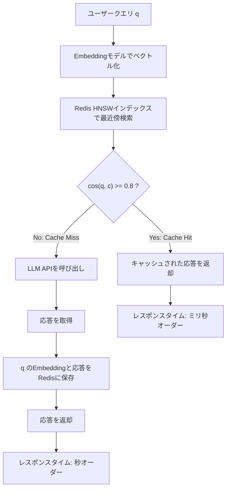

本記事は [GPT Semantic Cache: Reducing LLM Costs and Latency via Semantic Embedding Caching](https://arxiv.org/abs/2411.05276) の解説記事です。

## 論文概要

LLM APIの頻繁な呼び出しに伴う計算コスト・金銭コスト・レイテンシの問題に対し、著者らはクエリのEmbeddingをRedisのin-memoryストレージに保存し、セマンティック類似度に基づいてキャッシュヒットを判定するGPT Semantic Cacheを提案している。4カテゴリの質問応答データセット（8,000ペア）を用いた評価実験において、API呼び出しを最大68.8%削減し、キャッシュヒット時のPositive Hit率（正しい応答が返される率）が97%を超えたと報告されている。セマンティックキャッシュの基盤手法として、後続のTemporal Semantic CacheやContextCache等の発展的研究に影響を与えた位置づけの論文である。

この記事は [Zenn記事: MCP×セマンティックキャッシュでエージェントのレイテンシを40%削減する](https://zenn.dev/0h_n0/articles/15a8b787c36706) の深掘りです。

## 情報源

- **arXiv ID**: 2411.05276
- **URL**: [https://arxiv.org/abs/2411.05276](https://arxiv.org/abs/2411.05276)
- **著者**: Sajal Regmi, Chetan Phakami Pun
- **初版**: 2024年11月8日（v3: 2024年12月9日）
- **分野**: cs.LG（Machine Learning）

## 背景と動機

LLMの実運用ではAPI呼び出しごとにトークン単位の課金が発生し、高頻度アクセスのアプリケーションでは月額コストが数千ドルに達する。加えて、LLM推論にはGPU計算が必要なため、1リクエストあたり数百ミリ秒から数秒のレイテンシが生じる。

カスタマーサポートチャットボットやFAQシステムのように、類似の質問が繰り返されるワークロードでは、同一または意味的に等価なクエリに対して毎回LLMを呼び出すのは非効率である。従来のキャッシュ手法（完全一致キャッシュ）では、表現が異なるが意味的に同じクエリ（例: 「返品方法を教えてください」と「返品の手順は？」）を同一とみなせないため、キャッシュヒット率が低く実用的ではなかった。

著者らは、クエリをEmbeddingに変換し、ベクトル空間上のコサイン類似度で「意味的に同じ質問かどうか」を判定するセマンティックキャッシュを提案した。Redis in-memoryストレージとHNSWインデックスを組み合わせることで、高速な類似度検索とスケーラブルなキャッシュ管理を実現している。

## 主要な貢献

- **GPT Semantic Cacheの導入**: クエリEmbeddingをRedisのin-memoryストレージに保存し、HNSW（Hierarchical Navigable Small World）インデックスによる近似最近傍探索でキャッシュルックアップを実行する仕組みを提案
- **セマンティック類似度マッチングによるコスト削減**: コサイン類似度閾値0.8でキャッシュヒットを判定し、API呼び出しを最大68.8%削減
- **高い信頼性の実証**: Positive Hit率（キャッシュヒットのうち正しい応答が返される割合）が97%を超え、誤応答リスクが低いことを実験的に確認
- **デュアルEmbeddingモデル対応**: OpenAI text-embedding-ada-002（1536次元）とローカルONNXモデル all-MiniLM-L6-v2（384次元）の両方で評価し、ローカル推論によるコスト削減の可能性を提示

## 技術的詳細

### Embeddingモデルの選択

本手法ではクエリをベクトル表現に変換するEmbeddingモデルが中核となる。著者らは2種のモデルを評価している：

- **text-embedding-ada-002**（OpenAI）: 1536次元のEmbeddingを生成する。API経由で利用し、高い汎化性能を持つ一方、Embedding生成自体にもAPI呼び出しコストが発生する
- **all-MiniLM-L6-v2**（Hugging Face / ONNX）: 384次元のEmbeddingを生成するオープンソースモデル。ローカル推論が可能でEmbedding生成のAPI費用がゼロになるが、ドメイン固有の表現への対応力はada-002に劣る場合がある

Embeddingモデルの選択は、キャッシュヒットの品質（意味的に同じクエリを正しくマッチングできるか）に直結するため、対象ドメインのクエリ分布に応じた選定が必要である。

### コサイン類似度の計算

2つのベクトル間のセマンティック類似度は、コサイン類似度で定量化する：

$$
\cos(\mathbf{q}, \mathbf{c}) = \frac{\mathbf{q} \cdot \mathbf{c}}{\|\mathbf{q}\| \cdot \|\mathbf{c}\|}
= \frac{\sum_{i=1}^{d} q_i \cdot c_i}{\sqrt{\sum_{i=1}^{d} q_i^2} \cdot \sqrt{\sum_{i=1}^{d} c_i^2}}
$$

ここで、
- $\mathbf{q} \in \mathbb{R}^d$: 新規クエリのEmbeddingベクトル
- $\mathbf{c} \in \mathbb{R}^d$: キャッシュ済みクエリのEmbeddingベクトル
- $d$: Embeddingの次元数（ada-002では1536、MiniLMでは384）

コサイン類似度は $[-1, 1]$ の範囲を取り、1に近いほど意味的に類似していることを示す。事前に正規化（$\|\mathbf{q}\| = 1$）しておけば、内積計算のみで類似度を算出できるため、大規模キャッシュでも効率的な検索が可能になる。

### 閾値判定とキャッシュルックアップフロー

キャッシュヒットの判定は、コサイン類似度が閾値 $\tau$ を超えるかどうかで行う：

$$
\text{decision}(\mathbf{q}) =
\begin{cases}
\text{cache\_hit} & \text{if } \max_{\mathbf{c} \in \mathcal{C}} \cos(\mathbf{q}, \mathbf{c}) \geq \tau \\
\text{cache\_miss} & \text{otherwise}
\end{cases}
$$

ここで $\mathcal{C}$ はキャッシュ済みEmbeddingの集合、$\tau$ は類似度閾値である。著者らは $\tau = 0.6$ から $\tau = 0.9$ まで0.05刻みで探索し、$\tau = 0.8$ が最適であったと報告している。

$\tau$ の設定にはトレードオフが存在する：
- **$\tau$ を低くする**（例: 0.6）: ヒット率が上がるが、意味的に異なるクエリを誤ってマッチさせる偽陽性が増加
- **$\tau$ を高くする**（例: 0.9）: 偽陽性は減るが、意味的に同じクエリでもミスが増え、API削減効果が低下



### Redis HNSWインデックス

キャッシュ済みEmbeddingの検索には、HNSW（Hierarchical Navigable Small World）グラフを利用する。HNSWは近似最近傍探索（ANN: Approximate Nearest Neighbor）アルゴリズムの一つで、多層のスキップリスト構造により、$O(N)$ の全探索を $O(\log N)$ に削減する。

HNSWの主要パラメータは以下の2つである：
- **M**（最大エッジ数）: 各ノードが保持する最大接続数。大きいほど探索精度が上がるが、メモリ消費が増える
- **efConstruction**（構築時の探索幅）: インデックス構築時に探索する候補数。大きいほど精度が上がるが構築が遅くなる

著者らはHNSWインデックスをhnswlib-nodeで構築し、Redis上でEmbeddingとメタデータ（元のクエリ文、LLM応答、カテゴリ）を統合管理している。この設計により、キャッシュヒット時にはRedisから直接応答を取得でき、LLM APIを経由する必要がない。

### 閾値設定のトレードオフ

閾値 $\tau$ の選択は、キャッシュシステムの品質と効率のバランスを決定する最も重要なハイパーパラメータである。著者らの実験結果（後述）から、閾値の違いによる影響を整理する：

| 閾値 $\tau$ | キャッシュヒット率 | Positive Hit率 | API削減効果 | リスク |
|-------------|-----------------|---------------|-----------|--------|
| 0.6 | 高い | 低い（偽陽性多い） | 大きい | 誤応答が多発 |
| 0.8（推奨） | 61.6--68.8% | 97%超 | 最大68.8% | バランスが良い |
| 0.9 | 低い | 非常に高い | 小さい | ヒットが少なすぎる |

$\tau = 0.8$ が最適となった理由は、この閾値で「言語構造が十分に類似し、かつ意図が同じ」クエリペアを高精度に捕捉できるためである。ただし、この閾値は汎用的なQAデータセットに対する最適値であり、ドメイン固有のデータでは再チューニングが必要である点に注意が必要である。

## 実装のポイント

### Redis Vectorインデックスの設計

Redisをセマンティックキャッシュのバックエンドとして利用する際の設計上の要点は以下の通りである。

**インデックス構成**: Redis Stack（旧RediSearch）のVECTOR型フィールドを活用し、HNSWアルゴリズムによるベクトルインデックスを構築する。Embeddingとメタデータ（クエリ文、LLM応答、タイムスタンプ）を同一Hashに格納することで、キャッシュヒット時に1回のコマンドで応答を返却できる。

**TTL管理**: Redisの`EXPIRE`コマンドでキャッシュエントリにTTL（Time-To-Live）を設定し、古いエントリを自動的に失効させる。FAQのように長期間有効な応答にはTTLを長く、時事的なクエリには短いTTLを設定する。ただし、著者らは時間依存クエリへの体系的な対応は今後の課題としている。

**Embeddingパイプライン**: クエリ受信からキャッシュ判定までのパイプラインは、(1) クエリのEmbedding生成、(2) HNSWインデックスでのKNN検索、(3) 類似度閾値判定、(4) ヒット時は応答返却 / ミス時はLLM呼び出し+キャッシュ登録、の4ステップで構成される。

```python
import hashlib
import json
import time
from typing import Optional

import numpy as np
import redis
from openai import OpenAI


class SemanticCache:
    """Redis + Embeddingベースのセマンティックキャッシュ

    クエリのEmbeddingをRedisに保存し、コサイン類似度で
    キャッシュヒットを判定する。

    Args:
        redis_url: Redis接続URL
        similarity_threshold: コサイン類似度閾値（デフォルト0.8）
        embedding_dim: Embeddingの次元数
        ttl_seconds: キャッシュエントリのTTL（秒）
        index_name: Redisベクトルインデックス名
    """

    def __init__(
        self,
        redis_url: str = "redis://localhost:6379",
        similarity_threshold: float = 0.8,
        embedding_dim: int = 1536,
        ttl_seconds: int = 86400,
        index_name: str = "semantic_cache_idx",
    ) -> None:
        self.client = redis.Redis.from_url(redis_url, decode_responses=False)
        self.threshold = similarity_threshold
        self.dim = embedding_dim
        self.ttl = ttl_seconds
        self.index_name = index_name
        self.openai = OpenAI()
        self._ensure_index()

    def _ensure_index(self) -> None:
        """HNSWベクトルインデックスを作成（存在しない場合）"""
        try:
            self.client.execute_command("FT.INFO", self.index_name)
        except redis.ResponseError:
            # FT.CREATE でHNSWインデックスを構築
            self.client.execute_command(
                "FT.CREATE",
                self.index_name,
                "ON",
                "HASH",
                "PREFIX",
                "1",
                "cache:",
                "SCHEMA",
                "embedding",
                "VECTOR",
                "HNSW",
                "6",
                "TYPE",
                "FLOAT32",
                "DIM",
                str(self.dim),
                "DISTANCE_METRIC",
                "COSINE",
                "query_text",
                "TEXT",
                "response",
                "TEXT",
                "created_at",
                "NUMERIC",
            )

    def _get_embedding(self, text: str) -> np.ndarray:
        """OpenAI APIでテキストのEmbeddingを取得

        Args:
            text: 入力テキスト

        Returns:
            Embeddingベクトル (dim,)
        """
        resp = self.openai.embeddings.create(
            model="text-embedding-ada-002",
            input=text,
        )
        return np.array(resp.data[0].embedding, dtype=np.float32)

    def lookup(self, query: str) -> Optional[str]:
        """セマンティックキャッシュを検索

        Args:
            query: ユーザークエリ

        Returns:
            キャッシュヒット時はLLM応答文字列、ミス時はNone
        """
        query_embedding = self._get_embedding(query)
        query_blob = query_embedding.tobytes()

        # KNN=1 で最近傍を検索
        results = self.client.execute_command(
            "FT.SEARCH",
            self.index_name,
            f"*=>[KNN 1 @embedding $vec AS score]",
            "PARAMS",
            "2",
            "vec",
            query_blob,
            "SORTBY",
            "score",
            "DIALECT",
            "2",
        )

        if results[0] == 0:
            return None

        # COSINE距離: 0が完全一致、2が正反対
        # 類似度 = 1 - distance
        score = float(results[2][results[2].index(b"score") + 1])
        similarity = 1.0 - score

        if similarity >= self.threshold:
            response_idx = results[2].index(b"response") + 1
            return results[2][response_idx].decode("utf-8")
        return None

    def store(self, query: str, response: str) -> None:
        """クエリと応答をキャッシュに保存

        Args:
            query: ユーザークエリ
            response: LLMの応答
        """
        embedding = self._get_embedding(query)
        key = f"cache:{hashlib.sha256(query.encode()).hexdigest()[:16]}"

        self.client.hset(
            key,
            mapping={
                "embedding": embedding.tobytes(),
                "query_text": query,
                "response": response,
                "created_at": str(int(time.time())),
            },
        )
        self.client.expire(key, self.ttl)

    def query_or_call(self, query: str, llm_model: str = "gpt-4") -> str:
        """キャッシュ検索し、ミス時にLLMを呼び出す統合メソッド

        Args:
            query: ユーザークエリ
            llm_model: LLMモデル名

        Returns:
            応答文字列
        """
        cached = self.lookup(query)
        if cached is not None:
            return cached

        # キャッシュミス: LLM API呼び出し
        completion = self.openai.chat.completions.create(
            model=llm_model,
            messages=[{"role": "user", "content": query}],
        )
        response = completion.choices[0].message.content or ""

        self.store(query, response)
        return response
```

このコードは論文の手法をRedis Stack（FT.CREATE / FT.SEARCH）で実装した例である。`_ensure_index`でHNSWインデックスを構築し、`lookup`でKNN=1の最近傍検索を実行している。COSINE距離（0が完全一致）から類似度（$1 - \text{distance}$）に変換し、閾値0.8で判定する。

## Production Deployment Guide

GPT Semantic Cacheをプロダクション環境に展開するためのAWS構成ガイドを示す。セマンティックキャッシュサービスは、Embeddingの生成・保存・検索・LLMフォールバックの4機能を統合するため、ElastiCache（Redis）を中心としたアーキテクチャが自然な選択となる。

### AWS実装パターン（コスト最適化重視）

**トラフィック量別の推奨構成**:

| 規模 | 構成 | 月額概算 | 主要サービス |
|------|------|---------|-------------|
| Small (~100 req/日) | Serverless | $60--180 | Lambda + ElastiCache Serverless + Bedrock |
| Medium (~1,000 req/日) | Hybrid | $350--900 | ECS Fargate + ElastiCache + Bedrock |
| Large (10,000+ req/日) | Container | $2,200--5,000 | EKS + Spot + ElastiCache Cluster + Bedrock |

**Small構成（~100 req/日）**: Lambda関数でクエリを受け付け、ElastiCache Serverless（Redis OSS互換）にEmbeddingキャッシュを保持する。Embedding生成はBedrock（Titan Embeddings v2、1536次元）を利用し、キャッシュミス時のLLM呼び出しもBedrock（Claude Sonnet）で統一する。Lambda 256MB、タイムアウト30秒で月額$20--40、ElastiCache Serverlessで$30--80（ECPU課金）、Bedrock Embedding + LLMで$10--60。合計$60--180程度を見込む。

**Medium構成（~1,000 req/日）**: ECS Fargateでキャッシュサービスを常駐させ、ElastiCache（cache.r7g.large、ベクトル検索対応）にHNSWインデックスを保持する。Fargate（1vCPU, 2GB RAM）× 2タスクで月額$120--240、ElastiCache cache.r7g.large で$150--300、Bedrock APIで$80--360。キャッシュヒット率60%以上でBedrock APIコストが40%削減される。

**Large構成（10,000+ req/日）**: EKSクラスタでキャッシュサービスをスケールアウトし、KarpenterでSpot Instancesを優先配置する。ElastiCache Cluster Mode（3シャード）でインデックスを分散し、レイテンシを最小化する。EKS + Spot（m6i.xlarge）で$800--1,800、ElastiCache Clusterで$600--1,200、Bedrock APIで$400--1,200（キャッシュ効果で削減後）、その他$400--800。

**コスト削減テクニック**:
- Spot Instancesをキャッシュサービスノードに適用し最大90%削減（ステートレス設計：状態はElastiCacheに集約）
- Reserved InstancesをElastiCacheに適用し最大72%削減（キャッシュは常時稼働のため効果大）
- セマンティックキャッシュ自体がBedrock/OpenAI APIコストを60--70%削減する構造のため、ROIが高い
- ローカルEmbeddingモデル（all-MiniLM-L6-v2）をSageMaker Serverless Inferenceで運用し、Embedding APIコストをゼロに

**コスト試算の注意事項**: 上記は2026年9月時点のAWS ap-northeast-1（東京）リージョン料金に基づく概算値である。実際のコストはトラフィックパターン、リージョン、バースト使用量により変動する。最新料金はAWS料金計算ツールで確認を推奨する。

### Terraformインフラコード

**Small構成（Serverless）**:

```hcl
# GPT Semantic Cache - Small構成
# Lambda + ElastiCache Serverless + Bedrock

terraform {
  required_version = ">= 1.9"
  required_providers {
    aws = {
      source  = "hashicorp/aws"
      version = "~> 5.70"
    }
  }
}

provider "aws" {
  region = "ap-northeast-1"
}

# VPC（ElastiCache用、NAT Gateway不使用でコスト削減）
module "vpc" {
  source  = "terraform-aws-modules/vpc/aws"
  version = "~> 5.13"

  name = "semantic-cache-vpc"
  cidr = "10.0.0.0/16"

  azs             = ["ap-northeast-1a", "ap-northeast-1c"]
  private_subnets = ["10.0.1.0/24", "10.0.2.0/24"]

  enable_nat_gateway = false
}

# ElastiCache Serverless（Redis OSS互換）
resource "aws_elasticache_serverless_cache" "semantic_cache" {
  engine = "redis"
  name   = "semantic-cache"

  cache_usage_limits {
    data_storage {
      maximum = 1  # 1GB（~65万エントリ、1536次元）
      unit    = "GB"
    }
    ecpu_per_second {
      maximum = 1000
    }
  }

  security_group_ids = [aws_security_group.cache.id]
  subnet_ids         = module.vpc.private_subnets
}

resource "aws_security_group" "cache" {
  name_prefix = "semantic-cache-"
  vpc_id      = module.vpc.vpc_id

  ingress {
    from_port       = 6379
    to_port         = 6379
    protocol        = "tcp"
    security_groups = [aws_security_group.lambda.id]
  }
}

resource "aws_security_group" "lambda" {
  name_prefix = "semantic-cache-lambda-"
  vpc_id      = module.vpc.vpc_id

  egress {
    from_port   = 0
    to_port     = 0
    protocol    = "-1"
    cidr_blocks = ["0.0.0.0/0"]
  }
}

# IAM: Lambda実行ロール（最小権限）
resource "aws_iam_role" "cache_lambda" {
  name = "semantic-cache-lambda"
  assume_role_policy = jsonencode({
    Version = "2012-10-17"
    Statement = [{
      Action    = "sts:AssumeRole"
      Effect    = "Allow"
      Principal = { Service = "lambda.amazonaws.com" }
    }]
  })
}

resource "aws_iam_role_policy" "cache_lambda" {
  name = "semantic-cache-policy"
  role = aws_iam_role.cache_lambda.id
  policy = jsonencode({
    Version = "2012-10-17"
    Statement = [
      {
        Effect   = "Allow"
        Action   = ["bedrock:InvokeModel"]
        Resource = [
          "arn:aws:bedrock:ap-northeast-1::foundation-model/amazon.titan-embed-text-v2*",
          "arn:aws:bedrock:ap-northeast-1::foundation-model/anthropic.claude-*"
        ]
      },
      {
        Effect = "Allow"
        Action = [
          "elasticache:Connect"
        ]
        Resource = aws_elasticache_serverless_cache.semantic_cache.arn
      },
      {
        Effect   = "Allow"
        Action   = ["logs:CreateLogGroup", "logs:CreateLogStream", "logs:PutLogEvents"]
        Resource = "arn:aws:logs:*:*:*"
      },
      {
        Effect = "Allow"
        Action = [
          "ec2:CreateNetworkInterface",
          "ec2:DescribeNetworkInterfaces",
          "ec2:DeleteNetworkInterface"
        ]
        Resource = "*"
      },
      {
        Effect   = "Allow"
        Action   = ["xray:PutTraceSegments", "xray:PutTelemetryRecords"]
        Resource = "*"
      }
    ]
  })
}

# Lambda: セマンティックキャッシュ関数
resource "aws_lambda_function" "semantic_cache" {
  function_name = "semantic-cache-query"
  role          = aws_iam_role.cache_lambda.arn
  handler       = "handler.query"
  runtime       = "python3.12"
  memory_size   = 256
  timeout       = 30
  filename      = "lambda.zip"

  vpc_config {
    subnet_ids         = module.vpc.private_subnets
    security_group_ids = [aws_security_group.lambda.id]
  }

  environment {
    variables = {
      REDIS_ENDPOINT       = aws_elasticache_serverless_cache.semantic_cache.endpoint[0].address
      SIMILARITY_THRESHOLD = "0.8"
      EMBEDDING_DIM        = "1536"
      CACHE_TTL_SECONDS    = "86400"
    }
  }

  tracing_config {
    mode = "Active"
  }
}

# CloudWatch: コスト監視アラーム
resource "aws_cloudwatch_metric_alarm" "lambda_duration" {
  alarm_name          = "semantic-cache-lambda-duration-high"
  comparison_operator = "GreaterThanThreshold"
  evaluation_periods  = 3
  metric_name         = "Duration"
  namespace           = "AWS/Lambda"
  period              = 300
  statistic           = "p95"
  threshold           = 10000
  alarm_description   = "Lambda P95 latency exceeds 10s"

  dimensions = {
    FunctionName = aws_lambda_function.semantic_cache.function_name
  }
}
```

**Large構成（Container）**:

```hcl
# GPT Semantic Cache - Large構成
# EKS + Karpenter + ElastiCache Cluster

module "eks" {
  source  = "terraform-aws-modules/eks/aws"
  version = "~> 20.24"

  cluster_name    = "semantic-cache-cluster"
  cluster_version = "1.31"

  vpc_id     = module.vpc.vpc_id
  subnet_ids = module.vpc.private_subnets

  cluster_endpoint_public_access = false

  eks_managed_node_groups = {
    system = {
      instance_types = ["m6i.large"]
      min_size       = 2
      max_size       = 3
      desired_size   = 2
    }
  }
}

# Karpenter: Spot優先の自動スケーリング
resource "kubectl_manifest" "karpenter_nodepool" {
  yaml_body = yamlencode({
    apiVersion = "karpenter.sh/v1"
    kind       = "NodePool"
    metadata   = { name = "cache-workers" }
    spec = {
      template = {
        spec = {
          requirements = [
            { key = "karpenter.sh/capacity-type", operator = "In", values = ["spot", "on-demand"] },
            { key = "node.kubernetes.io/instance-type", operator = "In",
              values = ["m6i.xlarge", "m6i.2xlarge", "m5.xlarge", "m5.2xlarge"] },
          ]
          nodeClassRef = { group = "karpenter.k8s.aws", kind = "EC2NodeClass", name = "default" }
        }
      }
      limits = { cpu = "64", memory = "256Gi" }
      disruption = {
        consolidationPolicy = "WhenEmptyOrUnderutilized"
        consolidateAfter    = "30s"
      }
    }
  })
}

# ElastiCache Cluster Mode（3シャード）
resource "aws_elasticache_replication_group" "semantic_cache" {
  replication_group_id = "semantic-cache"
  description          = "Semantic cache vector store"
  engine               = "redis"
  engine_version       = "7.1"
  node_type            = "cache.r7g.xlarge"
  num_node_groups      = 3
  replicas_per_node_group = 1

  at_rest_encryption_enabled = true
  transit_encryption_enabled = true

  automatic_failover_enabled = true
}

# Secrets Manager: キャッシュ設定
resource "aws_secretsmanager_secret" "cache_config" {
  name = "semantic-cache/config"
}

resource "aws_secretsmanager_secret_version" "cache_config" {
  secret_id = aws_secretsmanager_secret.cache_config.id
  secret_string = jsonencode({
    similarity_threshold = 0.8
    embedding_dim        = 1536
    ttl_seconds          = 86400
    embedding_model      = "amazon.titan-embed-text-v2:0"
  })
}

# AWS Budgets: 月額予算アラート
resource "aws_budgets_budget" "monthly" {
  name         = "semantic-cache-monthly"
  budget_type  = "COST"
  limit_amount = "5000"
  limit_unit   = "USD"
  time_unit    = "MONTHLY"

  notification {
    comparison_operator        = "GREATER_THAN"
    threshold                  = 80
    threshold_type             = "PERCENTAGE"
    notification_type          = "ACTUAL"
    subscriber_email_addresses = ["ops-team@example.com"]
  }

  notification {
    comparison_operator        = "GREATER_THAN"
    threshold                  = 100
    threshold_type             = "PERCENTAGE"
    notification_type          = "FORECASTED"
    subscriber_email_addresses = ["ops-team@example.com"]
  }
}
```

### 運用・監視設定

**CloudWatch Logs Insights クエリ**（キャッシュヒット率分析）:

```
fields @timestamp, cache_hit, similarity_score, response_time_ms
| filter function_name = "semantic-cache-query"
| stats count(*) as total,
        sum(cache_hit) as hits,
        avg(response_time_ms) as avg_ms,
        pct(response_time_ms, 95) as p95_ms
  by bin(1h) as hour
| sort hour desc
```

**CloudWatch アラーム設定（Python）**:

```python
import boto3


def create_cache_hit_alarm(function_name: str, sns_topic_arn: str) -> None:
    """キャッシュヒット率低下アラームを設定

    Args:
        function_name: Lambda関数名
        sns_topic_arn: 通知先SNSトピックARN
    """
    cw = boto3.client("cloudwatch", region_name="ap-northeast-1")

    # Lambda実行時間の異常検知
    cw.put_metric_alarm(
        AlarmName=f"{function_name}-p95-latency",
        MetricName="Duration",
        Namespace="AWS/Lambda",
        Statistic="p95",
        Period=300,
        EvaluationPeriods=3,
        Threshold=5000,
        ComparisonOperator="GreaterThanThreshold",
        AlarmActions=[sns_topic_arn],
        Dimensions=[{"Name": "FunctionName", "Value": function_name}],
    )

    # Bedrock トークン使用量スパイク検知
    cw.put_metric_alarm(
        AlarmName="semantic-cache-bedrock-token-spike",
        MetricName="InputTokenCount",
        Namespace="AWS/Bedrock",
        Statistic="Sum",
        Period=3600,
        EvaluationPeriods=1,
        Threshold=100000,
        ComparisonOperator="GreaterThanThreshold",
        AlarmActions=[sns_topic_arn],
    )
```

**X-Ray トレーシング設定（Python）**:

```python
from aws_xray_sdk.core import xray_recorder, patch_all

# boto3, redis等の自動計装
patch_all()


@xray_recorder.capture("semantic_cache_handler")
def handle_query(query: str, threshold: float = 0.8) -> dict:
    """セマンティックキャッシュのメインハンドラ

    Args:
        query: ユーザークエリ
        threshold: コサイン類似度閾値

    Returns:
        応答とメタデータ
    """
    subsegment = xray_recorder.current_subsegment()
    subsegment.put_annotation("threshold", threshold)

    # Embedding生成 → Redis検索 → 判定
    cached = lookup_cache(query, threshold)

    subsegment.put_annotation("cache_hit", cached is not None)
    if cached:
        subsegment.put_metadata("similarity_score", cached["score"])

    return cached or call_llm(query)
```

**Cost Explorer自動レポート（Python）**:

```python
import boto3
from datetime import datetime, timedelta


def daily_cost_report(sns_topic_arn: str, threshold_usd: float = 100.0) -> None:
    """日次コストレポートを取得し閾値超過時にSNS通知

    Args:
        sns_topic_arn: 通知先SNSトピックARN
        threshold_usd: 日次コスト閾値（USD）
    """
    ce = boto3.client("ce", region_name="us-east-1")
    today = datetime.utcnow().strftime("%Y-%m-%d")
    yesterday = (datetime.utcnow() - timedelta(days=1)).strftime("%Y-%m-%d")

    resp = ce.get_cost_and_usage(
        TimePeriod={"Start": yesterday, "End": today},
        Granularity="DAILY",
        Metrics=["UnblendedCost"],
        Filter={
            "Tags": {
                "Key": "Project",
                "Values": ["semantic-cache"],
            }
        },
        GroupBy=[{"Type": "DIMENSION", "Key": "SERVICE"}],
    )

    total = sum(
        float(g["Metrics"]["UnblendedCost"]["Amount"])
        for r in resp["ResultsByTime"]
        for g in r["Groups"]
    )
    if total > threshold_usd:
        sns = boto3.client("sns", region_name="ap-northeast-1")
        sns.publish(
            TopicArn=sns_topic_arn,
            Subject=f"Semantic Cache daily cost alert: ${total:.2f}",
            Message=f"Daily cost ${total:.2f} exceeds threshold ${threshold_usd}",
        )
```

### コスト最適化チェックリスト

**アーキテクチャ選択**:
- [ ] トラフィック量に基づいてServerless/Hybrid/Containerを選択した
- [ ] キャッシュヒット率の想定値からBedrock APIコスト削減効果を試算した
- [ ] Embedding次元数（1536 vs 384）をレイテンシ・精度要件で選定した

**リソース最適化**:
- [ ] キャッシュサービスノードにSpot Instancesを優先適用（最大90%削減）
- [ ] ElastiCacheにReserved Instances（1年コミット、最大72%削減）
- [ ] Savings Plansの適用を検討した
- [ ] Lambda メモリサイズをRedis接続+Embedding処理に最適化
- [ ] ECS/EKSのアイドル時スケールダウンを設定（Karpenter consolidation）

**LLMコスト削減**:
- [ ] セマンティックキャッシュで重複API呼び出しを60--70%削減
- [ ] Bedrock Batch APIを非リアルタイム処理に活用
- [ ] Prompt Cachingを長文システムプロンプトに適用
- [ ] モデル選択ロジック（軽量モデルでの事前フィルタリング）を検討
- [ ] トークン数制限（max_tokensパラメータ）を適切に設定

**監視・アラート**:
- [ ] AWS Budgets で月額予算アラートを設定
- [ ] CloudWatch でキャッシュヒット率・レイテンシP95/P99をモニタリング
- [ ] Cost Anomaly Detection を有効化
- [ ] 日次コストレポートをSNS/Slack通知
- [ ] Bedrockトークン使用量のスパイク検知アラームを設定

**リソース管理**:
- [ ] 期限切れキャッシュエントリのTTL管理を設定
- [ ] Project/Environmentタグを全リソースに付与
- [ ] ElastiCacheのメモリ使用量モニタリング（eviction対策）
- [ ] 開発環境のEKSノードを夜間停止（Karpenter TTL）
- [ ] CloudTrail/AWS Config を有効化し監査証跡を確保

## 実験結果

### データセット構成

著者らは4カテゴリの質問応答データセット（合計8,000ペア）を構築し、各カテゴリから500クエリのテストセット（合計2,000クエリ）で評価を行っている。

### カテゴリ別キャッシュヒット率

論文の実験結果を以下に示す。

| カテゴリ | テストクエリ数 | キャッシュヒット数 | Positive Hit数 | ヒット率 | Positive Hit率 |
|---------|-------------|-----------------|---------------|---------|---------------|
| Python Basics | 500 | 335 | 310 | 67.0% | 92.5% |
| Network Support | 500 | 335 | 326 | 67.0% | 97.3% |
| Order/Shipping | 500 | 344 | 331 | 68.8% | 96.2% |
| Shopping QA | 500 | 308 | 298 | 61.6% | 96.8% |

全カテゴリを通じてキャッシュヒット率は61.6--68.8%であり、API呼び出しを最大68.8%削減できることを示している。Positive Hit率（キャッシュヒットのうち実際に正しい応答が返された割合）はNetwork Supportで97.3%と最も高く、Python Basicsで92.5%と最も低い。Python Basicsでの低下は、プログラミングクエリの細かな差異（バージョン指定、ライブラリ名等）がEmbeddingで十分に区別されなかったためと考えられる。

### レスポンスタイム

キャッシュヒット時のレスポンスタイムはRedisからの直接取得のためミリ秒オーダーであり、キャッシュミス時（LLM API呼び出し）と比較して大幅に短縮されると報告されている。著者らは具体的なレイテンシ数値については論文中で言及しているが、キャッシュヒット時のRedis検索が数ミリ秒で完了する点がin-memoryストレージの利点であると述べている。

## 実運用への応用

### 適用が有効なユースケース

GPT Semantic Cacheは反復的なクエリパターンを持つワークロードで効果を発揮する。具体的には以下のユースケースが挙げられる：

- **FAQチャットボット**: 同じ質問が繰り返されるカスタマーサポートでは、キャッシュヒット率が高くなりやすい。著者らの実験でもOrder/Shippingカテゴリで68.8%のヒット率を達成している
- **ヘルプデスク・ナレッジベース検索**: 社内ヘルプデスクでは質問のバリエーションが限定的であり、セマンティックキャッシュの恩恵が大きい
- **教育プラットフォーム**: プログラミング学習サービスでは類似の質問が多数発生するため、キャッシュによるコスト削減効果が高い

### Zenn記事との関連

関連Zenn記事ではMCP対応エージェントにおけるセマンティックキャッシュの適用を扱っているが、GPT Semantic Cacheの手法はその基盤となる技術である。Zenn記事で議論されているROIベースのShip/Skip判断（セマンティックキャッシュの導入コストと削減効果の見積もり）は、本論文の68.8%というAPI削減率が現実的な根拠として機能する。

一方、Zenn記事で指摘されている「パラメータ衝突問題」（言語構造は同一だがパラメータが異なるクエリの誤マッチ）や「時間表現の曖昧性」は、本論文では未対応の課題として残されており、後続研究で取り組まれている。

## 関連研究

- **GPTCache** (Bang, 2023): LLM応答のキャッシュフレームワークとして、Embeddingベースの類似度検索を実装したオープンソースプロジェクト。GPT Semantic Cacheと同時期に類似のアプローチを提案しており、Redis以外のバックエンド（FAISS、Milvus等）もサポートしている点が異なる
- **Temporal Semantic Cache** (Merchant et al., 2026): GPT Semantic Cacheの時間依存性に関する制約を克服した手法。クエリを4段階（Volatile / Static / Relative / Anchored）に分類し、時間パラメータに応じたTTL管理を導入している。Zenn記事で詳しく取り上げられている
- **ContextCache**: マルチターン会話におけるコンテキスト依存性を考慮したキャッシュ手法。GPT Semantic Cacheが単一クエリの類似度のみで判定するのに対し、会話履歴を含めたコンテキストベクトルで類似度を計算する
- **TVCache** (Temporal-Volumetric Cache): キャッシュエントリの時間的鮮度とアクセス頻度を組み合わせたEvictionポリシーを提案。GPT Semantic CacheのTTLベース失効を、LRU/LFUのハイブリッド戦略に拡張している

これらの後続研究は、GPT Semantic Cacheが示した「Embeddingベースのセマンティック類似度でキャッシュ判定を行う」という基本アーキテクチャの上に、時間依存性・コンテキスト依存性・Eviction戦略の改善を積み重ねた発展系として位置づけられる。

## まとめと今後の展望

GPT Semantic Cacheは、クエリEmbeddingのコサイン類似度によるキャッシュ判定という基盤的なアーキテクチャを提案し、API呼び出しの最大68.8%削減と97%超のPositive Hit率を実験的に示した。Redis in-memoryストレージとHNSWインデックスの組み合わせにより、ミリ秒オーダーのキャッシュルックアップを実現している点は、実運用における応答性改善に直結する。

一方、固定閾値の汎用性、時間依存クエリへの未対応、パラメータの微小な違いに対する感受性の限界といった課題は、後続のTemporal Semantic Cache（時間分類による動的TTL）、ContextCache（会話コンテキストの組み込み）等の研究で段階的に克服されている。セマンティックキャッシュの設計・導入を検討する際は、本論文の基盤手法を理解した上で、対象ワークロードの特性に応じた拡張手法を選択することが推奨される。

## 参考文献

- **arXiv**: [https://arxiv.org/abs/2411.05276](https://arxiv.org/abs/2411.05276)
- **GPTCache**: Bang, "GPTCache: An Open-Source Semantic Cache for LLM Applications with TTFT (Time to First Token) Optimization", 2023
- **Temporal Semantic Cache**: Merchant et al., 2026
- **Related Zenn article**: [https://zenn.dev/0h_n0/articles/15a8b787c36706](https://zenn.dev/0h_n0/articles/15a8b787c36706)

:::message
この記事はAI（Claude Code）により自動生成されました。内容の正確性については複数の情報源で検証していますが、実際の利用時は公式ドキュメントもご確認ください。
:::
