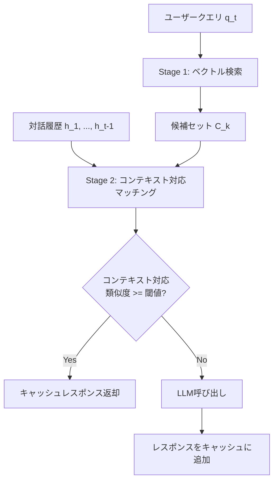

本記事は [ContextCache: Context-Aware Semantic Cache for Multi-Turn Queries in Large Language Models](https://arxiv.org/abs/2506.22791) の解説記事です。

## 論文概要

LLMのAPI呼び出しコストとレイテンシを削減するセマンティックキャッシュにおいて、マルチターン対話のコンテキストを考慮しない従来手法では、同一クエリが異なる会話文脈で出現した場合に誤ったキャッシュヒット（偽陽性）が発生する。著者らであるYan, Ni, Chen, Lin, Cheng, Qin, Renは、2段階検索アーキテクチャ――ベクトル類似度による候補抽出とself-attentionによるコンテキスト対応マッチング――を統合したContextCacheを提案している。著者らは、キャッシュレスポンスがLLM直接呼び出しの約10倍低レイテンシであり、既存手法を精度・再現率の両面で上回ると報告している。

この記事は [Zenn記事: MCP×セマンティックキャッシュでエージェントのレイテンシを40%削減する](https://zenn.dev/0h_n0/articles/15a8b787c36706) の深掘りです。

## 情報源

- **arXiv ID**: 2506.22791
- **URL**: [https://arxiv.org/abs/2506.22791](https://arxiv.org/abs/2506.22791)
- **著者**: Jianxin Yan, Wangze Ni, Lei Chen et al.
- **初版**: 2025年6月（revised 2025年7月）
- **分野**: cs.CL（Computation and Language）, cs.DB（Databases）

## 背景と動機

LLMのAPI呼び出しは推論コストが高く、同一または類似のクエリが繰り返し発生する実運用環境ではセマンティックキャッシュによるコスト削減が有効なアプローチとなる。従来のセマンティックキャッシュは、入力クエリの埋め込みベクトルとキャッシュ済みクエリの埋め込みベクトルのコサイン類似度を計算し、閾値を超えた場合にキャッシュされた応答を返す仕組みを採用している。

しかし、この単一クエリマッチング方式にはマルチターン対話における根本的な問題がある。同じテキスト「それについて詳しく教えて」というクエリでも、直前の会話が「Pythonの型ヒント」であった場合と「Rustの所有権」であった場合では、期待される回答が全く異なる。従来手法は現在のクエリの埋め込みのみでマッチングを行うため、異なる会話コンテキストの同一クエリに対して同一のキャッシュエントリがヒットする偽陽性が発生する。この偽陽性はユーザー体験を著しく損なうだけでなく、後続のターンにも誤情報が伝播するリスクがある。

著者らは、マルチターン対話が企業向けチャットボットやカスタマーサポート、コーディングアシスタントなど多くのLLMアプリケーションの主要なインタラクション形式であることを踏まえ、コンテキスト対応のセマンティックキャッシュが不可欠であると主張している。

## 主要な貢献

- **マルチターン対話対応セマンティックキャッシュの導入**: 単一クエリのベクトルマッチングに加え、過去の対話履歴を組み込んだ2段階検索アーキテクチャにより、コンテキストに応じた正確なキャッシュヒットを実現
- **偽陽性の防止**: 異なる対話コンテキストで類似クエリが出現した場合のキャッシュ誤判定を、self-attentionベースのコンテキスト統合により回避
- **レイテンシの大幅削減**: キャッシュヒット時のレスポンスタイムがLLM直接呼び出しの約10倍高速であり、計算コストの削減と応答速度の向上を同時に達成
- **精度・再現率の改善**: 既存のセマンティックキャッシュ手法と比較して、精度・再現率の両指標で優位性を確認

## 技術的詳細

### セマンティックキャッシュの基本原理

セマンティックキャッシュの核心は、入力クエリの意味的類似性に基づいてキャッシュヒットを判定する仕組みである。まず、テキストを密ベクトル（embedding）に変換し、ベクトル空間上の距離でクエリ間の類似性を測定する。

クエリ $q$ とキャッシュ済みクエリ $c$ の類似度は、コサイン類似度で定量化される：

$$
\text{sim}(q, c) = \frac{\mathbf{e}_q \cdot \mathbf{e}_c}{\|\mathbf{e}_q\| \cdot \|\mathbf{e}_c\|}
$$

ここで、
- $\mathbf{e}_q \in \mathbb{R}^d$: クエリ $q$ の埋め込みベクトル（$d$ は埋め込み次元数）
- $\mathbf{e}_c \in \mathbb{R}^d$: キャッシュ済みクエリ $c$ の埋め込みベクトル
- $\|\cdot\|$: L2ノルム

類似度がしきい値 $\tau$ を超えた場合（$\text{sim}(q, c) \geq \tau$）、キャッシュされた応答を返す。しかし、この方式は現在のクエリのみに依存しており、対話コンテキストを全く考慮しない。

### ContextCacheの2段階検索アーキテクチャ

ContextCacheは、この問題を2段階の検索パイプラインで解決する。



#### Stage 1: ベクトルベース候補検索

第1段階では、現在のクエリ $q_t$ の埋め込みベクトルを用いて、キャッシュストアから上位 $k$ 個の候補を高速に抽出する。この段階では対話コンテキストを考慮せず、ANN（Approximate Nearest Neighbor）検索による計算効率を優先する。

$$
\mathcal{C}_k = \text{TopK}\left(\left\{ c_i \mid \text{sim}(\mathbf{e}_{q_t}, \mathbf{e}_{c_i}) \right\}, k\right)
$$

ここで、
- $q_t$: 時刻 $t$ における現在のクエリ
- $\mathcal{C}_k$: 上位 $k$ 個の候補キャッシュエントリの集合
- $\text{TopK}$: 類似度上位 $k$ 個を返す操作

ANN検索にはFAISSやScaNNなどのライブラリが利用でき、数百万エントリのキャッシュストアに対しても数ミリ秒での候補抽出が可能である。

#### Stage 2: Self-Attentionによるコンテキスト対応マッチング

第2段階では、第1段階で得られた候補に対し、対話履歴を統合したコンテキスト対応のスコアリングを実行する。ここでself-attention mechanismが導入される。

現在のクエリと対話履歴を統合した表現を構築するために、対話ターンの系列 $\mathbf{H} = [\mathbf{h}_1, \mathbf{h}_2, \ldots, \mathbf{h}_{t-1}, \mathbf{q}_t]$ に対してself-attentionを適用する。Scaled Dot-Product Attentionの計算は以下の通りである：

$$
\text{Attention}(\mathbf{Q}, \mathbf{K}, \mathbf{V}) = \text{softmax}\left(\frac{\mathbf{Q}\mathbf{K}^\top}{\sqrt{d_k}}\right)\mathbf{V}
$$

ここで、
- $\mathbf{Q} = \mathbf{H}\mathbf{W}_Q$: Query行列（$\mathbf{W}_Q \in \mathbb{R}^{d \times d_k}$）
- $\mathbf{K} = \mathbf{H}\mathbf{W}_K$: Key行列（$\mathbf{W}_K \in \mathbb{R}^{d \times d_k}$）
- $\mathbf{V} = \mathbf{H}\mathbf{W}_V$: Value行列（$\mathbf{W}_V \in \mathbb{R}^{d \times d_v}$）
- $d_k$: Key/Queryの次元数（スケーリング係数 $\sqrt{d_k}$ で勾配消失を防止）

self-attentionにより、現在のクエリ $\mathbf{q}_t$ は過去の対話ターンのどの部分に注目すべきかを動的に学習する。例えば「それについて詳しく教えて」というクエリでは、直前のターンに高いattention重みが割り当てられ、そのコンテキストを反映した表現 $\tilde{\mathbf{q}}_t$ が生成される。

コンテキスト統合後の類似度は以下で計算される：

$$
\text{sim}_{\text{ctx}}(q_t, c_i) = \frac{\tilde{\mathbf{q}}_t \cdot \tilde{\mathbf{c}}_i}{\|\tilde{\mathbf{q}}_t\| \cdot \|\tilde{\mathbf{c}}_i\|}
$$

ここで $\tilde{\mathbf{q}}_t$ と $\tilde{\mathbf{c}}_i$ はそれぞれ、現在のクエリとキャッシュ候補にself-attentionを適用して得られたコンテキスト対応表現である。この2段階設計により、第1段階の高速なベクトル検索で候補を絞り込み、第2段階の計算コストの高いself-attention処理を少数の候補に限定して適用することで、精度と速度の両立を実現している。

### Multi-Head Attentionの適用

実際のシステムでは、Single-Head AttentionではなくMulti-Head Attention（MHA）が用いられることが一般的である。MHAは複数のattention headで異なる側面のコンテキスト依存関係を並列に捕捉する：

$$
\text{MultiHead}(\mathbf{Q}, \mathbf{K}, \mathbf{V}) = \text{Concat}(\text{head}_1, \ldots, \text{head}_h)\mathbf{W}_O
$$

$$
\text{head}_i = \text{Attention}(\mathbf{Q}\mathbf{W}_Q^{(i)}, \mathbf{K}\mathbf{W}_K^{(i)}, \mathbf{V}\mathbf{W}_V^{(i)})
$$

ここで、
- $h$: attention headの数
- $\mathbf{W}_Q^{(i)}, \mathbf{W}_K^{(i)}, \mathbf{W}_V^{(i)}$: 各headの射影行列
- $\mathbf{W}_O \in \mathbb{R}^{hd_v \times d}$: 出力射影行列

あるheadがトピック連続性を捕捉し、別のheadが代名詞の参照解決を行うなど、異なる言語的関係を並列に学習できる点がMHAの強みである。

## 実装のポイント

### 対話履歴の表現学習

コンテキスト対応マッチングの精度は、対話履歴をどのように表現するかに大きく依存する。実装上の主要な設計判断を以下に示す。

**履歴ウィンドウサイズ**: 全ての対話ターンをself-attentionに入力するとメモリと計算量が対話長の二乗に比例して増大する。実用上は直近 $w$ ターン（例: $w = 5$）をウィンドウとして切り出す方式が現実的である。ウィンドウサイズはタスク特性に応じて調整が必要であり、カスタマーサポートのように長い文脈が重要なタスクでは $w = 10$ 程度が望ましい場合もある。

**ターン単位の埋め込み**: 各対話ターンをそのまま個別トークンとして扱うか、ターン単位で事前に埋め込みベクトルに圧縮するかは、レイテンシ要件との兼ね合いで決定する。ターン単位の埋め込みはself-attention計算を大幅に軽量化できるが、ターン内の細粒度な情報が失われる可能性がある。

### キャッシュエントリのメタデータ設計

キャッシュエントリには、クエリと応答のペアに加えて、対話コンテキストのメタデータを格納する必要がある。

```python
from dataclasses import dataclass, field
from datetime import datetime
import numpy as np


@dataclass(frozen=True)
class CacheEntry:
    """コンテキスト対応セマンティックキャッシュのエントリ

    Attributes:
        query: キャッシュされたクエリテキスト
        response: LLMの応答テキスト
        query_embedding: クエリの埋め込みベクトル (Stage 1用)
        context_embedding: コンテキスト統合後の埋め込みベクトル (Stage 2用)
        conversation_id: 会話セッションID
        turn_index: 会話内のターンインデックス
        history_window: 対話履歴の埋め込み系列
        created_at: キャッシュ登録日時
        ttl_seconds: キャッシュの有効期限 (秒)
    """
    query: str
    response: str
    query_embedding: np.ndarray
    context_embedding: np.ndarray
    conversation_id: str
    turn_index: int
    history_window: list[np.ndarray] = field(default_factory=list)
    created_at: datetime = field(default_factory=datetime.utcnow)
    ttl_seconds: int = 3600
```

### 2段階検索パイプラインの実装

```python
import numpy as np
from typing import Optional


class ContextAwareSemanticCache:
    """ContextCacheの2段階検索を実装するセマンティックキャッシュ

    Stage 1: ベクトル類似度による候補抽出 (FAISS)
    Stage 2: Self-attentionによるコンテキスト対応マッチング
    """

    def __init__(
        self,
        embedding_dim: int = 768,
        stage1_top_k: int = 20,
        stage2_threshold: float = 0.85,
        history_window_size: int = 5,
    ) -> None:
        """キャッシュを初期化する

        Args:
            embedding_dim: 埋め込みベクトルの次元数
            stage1_top_k: Stage 1で返す候補数
            stage2_threshold: Stage 2のコンテキスト対応類似度しきい値
            history_window_size: 対話履歴のウィンドウサイズ
        """
        self.embedding_dim = embedding_dim
        self.stage1_top_k = stage1_top_k
        self.stage2_threshold = stage2_threshold
        self.history_window_size = history_window_size
        self._entries: list[CacheEntry] = []

    def lookup(
        self,
        query_embedding: np.ndarray,
        history_embeddings: list[np.ndarray],
    ) -> Optional[str]:
        """2段階検索でキャッシュルックアップを実行する

        Args:
            query_embedding: 現在のクエリの埋め込みベクトル (d,)
            history_embeddings: 過去ターンの埋め込みベクトル列

        Returns:
            キャッシュヒット時は応答テキスト、ミス時はNone
        """
        # Stage 1: ベクトル類似度による高速候補抽出
        candidates = self._stage1_vector_search(
            query_embedding, top_k=self.stage1_top_k
        )
        if not candidates:
            return None

        # Stage 2: コンテキスト対応マッチング
        window = history_embeddings[-self.history_window_size :]
        best_match = self._stage2_context_match(
            query_embedding, window, candidates
        )
        return best_match

    def _stage1_vector_search(
        self,
        query_embedding: np.ndarray,
        top_k: int,
    ) -> list[CacheEntry]:
        """Stage 1: コサイン類似度で上位k候補を抽出

        Args:
            query_embedding: クエリの埋め込みベクトル (d,)
            top_k: 返す候補数

        Returns:
            類似度上位k個のキャッシュエントリ
        """
        if not self._entries:
            return []

        similarities = []
        for entry in self._entries:
            cos_sim = np.dot(query_embedding, entry.query_embedding) / (
                np.linalg.norm(query_embedding)
                * np.linalg.norm(entry.query_embedding)
                + 1e-8
            )
            similarities.append((cos_sim, entry))

        similarities.sort(key=lambda x: x[0], reverse=True)
        return [entry for _, entry in similarities[:top_k]]

    def _stage2_context_match(
        self,
        query_embedding: np.ndarray,
        history_embeddings: list[np.ndarray],
        candidates: list[CacheEntry],
    ) -> Optional[str]:
        """Stage 2: self-attentionでコンテキスト統合後のマッチング

        Args:
            query_embedding: クエリの埋め込みベクトル (d,)
            history_embeddings: 対話履歴の埋め込みベクトル列
            candidates: Stage 1で抽出された候補エントリ

        Returns:
            しきい値を超える最良候補の応答テキスト、なければNone
        """
        # 現在のクエリと対話履歴を結合した系列を構築
        query_context = self._build_context_representation(
            query_embedding, history_embeddings
        )

        best_score = -1.0
        best_response: Optional[str] = None

        for entry in candidates:
            # 候補側もコンテキスト表現を構築
            candidate_context = self._build_context_representation(
                entry.query_embedding, entry.history_window
            )

            # コンテキスト対応コサイン類似度
            ctx_sim = np.dot(query_context, candidate_context) / (
                np.linalg.norm(query_context)
                * np.linalg.norm(candidate_context)
                + 1e-8
            )

            if ctx_sim > best_score and ctx_sim >= self.stage2_threshold:
                best_score = ctx_sim
                best_response = entry.response

        return best_response

    def _build_context_representation(
        self,
        query_embedding: np.ndarray,
        history_embeddings: list[np.ndarray],
    ) -> np.ndarray:
        """対話履歴を統合したコンテキスト表現を構築

        簡易版: 加重平均によるコンテキスト統合
        本番では学習済みself-attentionモジュールを使用する

        Args:
            query_embedding: クエリの埋め込みベクトル (d,)
            history_embeddings: 対話履歴の埋め込みベクトル列

        Returns:
            コンテキスト統合後のベクトル (d,)
        """
        if not history_embeddings:
            return query_embedding

        # self-attentionの簡易近似: 直近ターンほど高い重みを付与
        sequence = np.stack(history_embeddings + [query_embedding])
        n = len(sequence)
        d_k = sequence.shape[1]

        # Scaled Dot-Product Attention (Q=query, K=V=sequence)
        q = query_embedding.reshape(1, -1)
        scores = q @ sequence.T / np.sqrt(d_k)
        weights = np.exp(scores - np.max(scores))
        weights = weights / (weights.sum() + 1e-8)
        context = (weights @ sequence).flatten()

        return context
```

上記の実装は概念実証レベルの簡易版であり、本論文ではself-attentionモジュールの学習手順やハイパーパラメータの詳細について論じている。実運用では、FAISSやMilvusなどの専用ベクトルデータベースをStage 1に、学習済みTransformerブロックをStage 2に配置する構成が推奨される。

## Production Deployment Guide

マルチターン対話システムにContextCacheを組み込むための本番環境構築ガイドを示す。2段階検索アーキテクチャの特性上、Stage 1のベクトル検索とStage 2のself-attention推論を分離した構成が効果的である。

### AWS実装パターン（コスト最適化重視）

**トラフィック量別の推奨構成**:

| 規模 | 構成 | 月額概算 | 主要サービス |
|------|------|---------|-------------|
| Small (~100 req/日) | Serverless | $60--180 | Lambda + DynamoDB + ElastiCache |
| Medium (~1,000 req/日) | Hybrid | $350--850 | ECS Fargate + ElastiCache + Bedrock |
| Large (10,000+ req/日) | Container | $2,200--5,000 | EKS + Spot + ElastiCache Cluster + Bedrock |

**Small構成（~100 req/日）**: Lambda関数でクエリを受け付け、ElastiCache（Redis）にキャッシュエントリの埋め込みベクトルと対話履歴メタデータを格納する。Stage 1のANN検索はRedisのベクトル検索機能（RediSearch）で実行し、Stage 2のコンテキスト対応マッチングはLambda上の軽量self-attentionモデルで処理する。DynamoDBにキャッシュされた応答テキストを格納する。Lambda 512MB、タイムアウト30秒で月額$40--80、ElastiCache cache.t3.micro で$15--40、DynamoDB + CloudWatch等で$5--60程度を見込む。

**Medium構成（~1,000 req/日）**: ECS Fargateでキャッシュルックアップサービスを常時起動し、ElastiCache（Redis）にベクトルインデックスを保持する。Stage 2のself-attention推論はFargateタスク内のCPU推論で処理し、キャッシュミス時はAmazon Bedrockを呼び出す。Fargateタスク（2vCPU, 4GB RAM）× 2台で月額$180--360、ElastiCache cache.t3.small で$50--100、Bedrock呼び出し（キャッシュミス分）で$50--200、その他$70--190。Bedrockの呼び出しはキャッシュヒット率に応じて大幅に変動するため、ヒット率60%以上を目標とする。

**Large構成（10,000+ req/日）**: EKSクラスタでStage 1（ベクトル検索）とStage 2（コンテキストマッチング）のサービスを分離デプロイし、Karpenterによる自動スケーリングでSpot Instancesを優先配置する。ElastiCache Cluster Mode（3シャード）に全ベクトルインデックスと対話履歴をロードし、Stage 1のレイテンシを1ms未満に抑える。EKS + Spot（m6i.xlarge）で$800--2,000、ElastiCache Cluster で$500--1,200、Bedrock呼び出しで$400--800（ヒット率70%想定）、その他$500--1,000。

**コスト削減テクニック**:
- Spot InstancesをStage 1/Stage 2の検索ノードに適用し最大90%削減（ステートレス検索のため中断耐性が高い）
- Reserved InstancesをElastiCacheに適用し最大72%削減
- キャッシュヒット率の向上によりBedrock呼び出しコストを直接削減（ヒット率60% → 80%で40%のBedrock費用削減）
- Bedrock Prompt Cachingを併用し、キャッシュミス時のBedrock呼び出しコストを30--90%削減

**コスト試算の注意事項**: 上記は2026年9月時点のAWS ap-northeast-1（東京）リージョン料金に基づく概算値である。実際のコストはトラフィックパターン、リージョン、バースト使用量、キャッシュヒット率により変動する。最新料金はAWS料金計算ツールで確認を推奨する。

### Terraformインフラコード

**Small構成（Serverless）**:

```hcl
# ContextCache マルチターン対話キャッシュ - Small構成
# Lambda + ElastiCache (Redis) + DynamoDB

terraform {
  required_version = ">= 1.9"
  required_providers {
    aws = {
      source  = "hashicorp/aws"
      version = "~> 5.70"
    }
  }
}

provider "aws" {
  region = "ap-northeast-1"
}

# VPC (ElastiCache用、NAT Gateway不使用でコスト削減)
module "vpc" {
  source  = "terraform-aws-modules/vpc/aws"
  version = "~> 5.13"

  name = "context-cache-vpc"
  cidr = "10.0.0.0/16"

  azs             = ["ap-northeast-1a", "ap-northeast-1c"]
  private_subnets = ["10.0.1.0/24", "10.0.2.0/24"]
}

# ElastiCache (Redis): ベクトルインデックス + 対話履歴
resource "aws_elasticache_cluster" "cache" {
  cluster_id           = "context-cache"
  engine               = "redis"
  engine_version       = "7.1"
  node_type            = "cache.t3.micro"
  num_cache_nodes      = 1
  port                 = 6379
  subnet_group_name    = aws_elasticache_subnet_group.cache.name
  security_group_ids   = [aws_security_group.cache.id]
}

resource "aws_elasticache_subnet_group" "cache" {
  name       = "context-cache-subnet"
  subnet_ids = module.vpc.private_subnets
}

resource "aws_security_group" "cache" {
  name_prefix = "context-cache-redis-"
  vpc_id      = module.vpc.vpc_id

  ingress {
    from_port       = 6379
    to_port         = 6379
    protocol        = "tcp"
    security_groups = [aws_security_group.lambda.id]
  }
}

resource "aws_security_group" "lambda" {
  name_prefix = "context-cache-lambda-"
  vpc_id      = module.vpc.vpc_id

  egress {
    from_port   = 0
    to_port     = 0
    protocol    = "-1"
    cidr_blocks = ["0.0.0.0/0"]
  }
}

# DynamoDB: キャッシュ応答テキスト + メタデータ (On-Demand)
resource "aws_dynamodb_table" "cache_store" {
  name         = "context-cache-store"
  billing_mode = "PAY_PER_REQUEST"  # コスト最適化: On-Demand
  hash_key     = "cache_key"
  range_key    = "conversation_id"

  attribute {
    name = "cache_key"
    type = "S"
  }

  attribute {
    name = "conversation_id"
    type = "S"
  }

  ttl {
    attribute_name = "expires_at"
    enabled        = true  # TTLで古いエントリを自動削除
  }

  server_side_encryption {
    enabled = true
  }

  point_in_time_recovery {
    enabled = true
  }
}

# IAM: Lambda実行ロール (最小権限)
resource "aws_iam_role" "cache_lambda" {
  name = "context-cache-lambda"
  assume_role_policy = jsonencode({
    Version = "2012-10-17"
    Statement = [{
      Action    = "sts:AssumeRole"
      Effect    = "Allow"
      Principal = { Service = "lambda.amazonaws.com" }
    }]
  })
}

resource "aws_iam_role_policy" "cache_lambda" {
  name = "context-cache-policy"
  role = aws_iam_role.cache_lambda.id
  policy = jsonencode({
    Version = "2012-10-17"
    Statement = [
      {
        Effect   = "Allow"
        Action   = ["dynamodb:GetItem", "dynamodb:PutItem", "dynamodb:Query"]
        Resource = aws_dynamodb_table.cache_store.arn
      },
      {
        Effect   = "Allow"
        Action   = ["bedrock:InvokeModel"]
        Resource = "arn:aws:bedrock:ap-northeast-1::foundation-model/*"
      },
      {
        Effect = "Allow"
        Action = [
          "logs:CreateLogGroup",
          "logs:CreateLogStream",
          "logs:PutLogEvents"
        ]
        Resource = "arn:aws:logs:*:*:*"
      },
      {
        Effect = "Allow"
        Action = [
          "ec2:CreateNetworkInterface",
          "ec2:DescribeNetworkInterfaces",
          "ec2:DeleteNetworkInterface"
        ]
        Resource = "*"  # VPC Lambda用
      },
      {
        Effect   = "Allow"
        Action   = ["xray:PutTraceSegments", "xray:PutTelemetryRecords"]
        Resource = "*"
      }
    ]
  })
}

# Lambda: キャッシュルックアップ関数
resource "aws_lambda_function" "cache_lookup" {
  function_name = "context-cache-lookup"
  role          = aws_iam_role.cache_lambda.arn
  handler       = "handler.lookup"
  runtime       = "python3.12"
  memory_size   = 512   # self-attentionモデル + ベクトル演算用
  timeout       = 30
  filename      = "lambda.zip"

  vpc_config {
    subnet_ids         = module.vpc.private_subnets
    security_group_ids = [aws_security_group.lambda.id]
  }

  environment {
    variables = {
      REDIS_HOST           = aws_elasticache_cluster.cache.cache_nodes[0].address
      CACHE_TABLE          = aws_dynamodb_table.cache_store.name
      STAGE1_TOP_K         = "20"
      STAGE2_THRESHOLD     = "0.85"
      HISTORY_WINDOW_SIZE  = "5"
    }
  }

  tracing_config {
    mode = "Active"  # X-Ray有効化
  }
}

# CloudWatch: Lambda実行時間アラーム
resource "aws_cloudwatch_metric_alarm" "lambda_duration" {
  alarm_name          = "context-cache-lambda-duration-high"
  comparison_operator = "GreaterThanThreshold"
  evaluation_periods  = 3
  metric_name         = "Duration"
  namespace           = "AWS/Lambda"
  period              = 300
  statistic           = "p95"
  threshold           = 15000  # 15秒超過で警告
  alarm_description   = "Lambda P95 latency exceeds 15s"

  dimensions = {
    FunctionName = aws_lambda_function.cache_lookup.function_name
  }
}

data "aws_caller_identity" "current" {}
```

**Large構成（Container）**:

```hcl
# ContextCache マルチターン対話キャッシュ - Large構成
# EKS + Karpenter + Spot Instances + ElastiCache Cluster

module "eks" {
  source  = "terraform-aws-modules/eks/aws"
  version = "~> 20.24"

  cluster_name    = "context-cache"
  cluster_version = "1.31"

  vpc_id     = module.vpc.vpc_id
  subnet_ids = module.vpc.private_subnets

  cluster_endpoint_public_access = false  # セキュリティ: プライベートのみ

  eks_managed_node_groups = {
    system = {
      instance_types = ["m6i.large"]
      min_size       = 2
      max_size       = 3
      desired_size   = 2
    }
  }
}

# Karpenter: Spot優先の自動スケーリング
resource "kubectl_manifest" "karpenter_provisioner" {
  yaml_body = yamlencode({
    apiVersion = "karpenter.sh/v1"
    kind       = "NodePool"
    metadata   = { name = "context-cache-search" }
    spec = {
      template = {
        spec = {
          requirements = [
            { key = "karpenter.sh/capacity-type", operator = "In", values = ["spot", "on-demand"] },
            { key = "node.kubernetes.io/instance-type", operator = "In", values = ["m6i.xlarge", "m6a.xlarge", "m5.xlarge"] }
          ]
          nodeClassRef = { name = "default" }
        }
      }
      limits   = { cpu = "64" }
      disruption = {
        consolidationPolicy = "WhenUnderutilized"
      }
    }
  })
}

# ElastiCache Cluster Mode: ベクトルインデックス分散格納
resource "aws_elasticache_replication_group" "cache_cluster" {
  replication_group_id = "context-cache-cluster"
  description          = "ContextCache vector index cluster"
  engine               = "redis"
  engine_version       = "7.1"
  node_type            = "cache.r6g.large"
  num_node_groups      = 3       # 3シャードで分散
  replicas_per_node_group = 1    # 各シャードにリードレプリカ1台

  at_rest_encryption_enabled = true
  transit_encryption_enabled = true

  automatic_failover_enabled = true
  multi_az_enabled           = true
}

# Secrets Manager: Bedrock設定
resource "aws_secretsmanager_secret" "bedrock_config" {
  name = "context-cache/bedrock"
}

resource "aws_secretsmanager_secret_version" "bedrock_config" {
  secret_id = aws_secretsmanager_secret.bedrock_config.id
  secret_string = jsonencode({
    model_id         = "anthropic.claude-sonnet-4-20250514"
    max_tokens       = 4096
    cache_miss_region = "ap-northeast-1"
  })
}

# AWS Budgets: 月額予算アラート
resource "aws_budgets_budget" "monthly" {
  name         = "context-cache-monthly"
  budget_type  = "COST"
  limit_amount = "5000"
  limit_unit   = "USD"
  time_unit    = "MONTHLY"

  notification {
    comparison_operator       = "GREATER_THAN"
    threshold                 = 80
    threshold_type            = "PERCENTAGE"
    notification_type         = "ACTUAL"
    subscriber_email_addresses = ["alerts@example.com"]
  }
}
```

### 運用・監視設定

**CloudWatch Logs Insights クエリ**:

```
# キャッシュヒット率の時系列分析
fields @timestamp, cache_hit, latency_ms
| filter event = "cache_lookup"
| stats count(*) as total,
        sum(case when cache_hit = 1 then 1 else 0 end) as hits,
        avg(latency_ms) as avg_latency,
        pct(latency_ms, 95) as p95_latency
  by bin(1h)
| sort @timestamp desc

# Stage 2 偽陽性検知（ヒットしたが低品質応答）
fields @timestamp, conversation_id, stage2_score, user_feedback
| filter event = "cache_hit" and user_feedback = "negative"
| stats count(*) as false_positives, avg(stage2_score) as avg_score
  by bin(1d)
```

**CloudWatch アラーム設定コード（Python）**:

```python
import boto3
from typing import Final


ALARM_NAMESPACE: Final[str] = "ContextCache"

cloudwatch = boto3.client("cloudwatch", region_name="ap-northeast-1")


def create_cache_hit_rate_alarm(
    function_name: str,
    threshold: float = 0.3,
) -> None:
    """キャッシュヒット率低下アラームを作成する

    Args:
        function_name: 監視対象のLambda関数名
        threshold: ヒット率の下限しきい値 (0.0-1.0)
    """
    cloudwatch.put_metric_alarm(
        AlarmName=f"context-cache-hit-rate-low-{function_name}",
        ComparisonOperator="LessThanThreshold",
        EvaluationPeriods=3,
        MetricName="CacheHitRate",
        Namespace=ALARM_NAMESPACE,
        Period=300,
        Statistic="Average",
        Threshold=threshold,
        AlarmDescription=(
            f"Cache hit rate dropped below {threshold:.0%}. "
            "Verify embedding model and threshold configuration."
        ),
        ActionsEnabled=True,
    )
```

**X-Ray トレーシング設定コード（Python）**:

```python
from aws_xray_sdk.core import xray_recorder, patch_all
from aws_xray_sdk.core.models.subsegment import Subsegment

# boto3, redis等の自動計装
patch_all()


def trace_cache_lookup(
    query: str,
    conversation_id: str,
    stage1_candidates: int,
    stage2_score: float,
    cache_hit: bool,
) -> None:
    """キャッシュルックアップのトレーシングを記録する

    Args:
        query: 検索クエリ
        conversation_id: 会話セッションID
        stage1_candidates: Stage 1で抽出された候補数
        stage2_score: Stage 2の最大コンテキスト類似度スコア
        cache_hit: キャッシュヒットしたかどうか
    """
    subsegment: Subsegment = xray_recorder.current_subsegment()
    if subsegment is None:
        return

    subsegment.put_annotation("cache_hit", cache_hit)
    subsegment.put_annotation("conversation_id", conversation_id)
    subsegment.put_metadata("stage1_candidates", stage1_candidates)
    subsegment.put_metadata("stage2_score", stage2_score)
    subsegment.put_metadata("query_length", len(query))
```

**Cost Explorer 自動レポート（Python）**:

```python
import boto3
from datetime import date, timedelta


def get_daily_cost_report() -> dict[str, float]:
    """日次コストレポートを取得する

    Returns:
        サービス別コストの辞書 (USD)
    """
    ce = boto3.client("ce", region_name="us-east-1")
    today = date.today()
    yesterday = today - timedelta(days=1)

    response = ce.get_cost_and_usage(
        TimePeriod={
            "Start": yesterday.isoformat(),
            "End": today.isoformat(),
        },
        Granularity="DAILY",
        Metrics=["UnblendedCost"],
        Filter={
            "Tags": {
                "Key": "Project",
                "Values": ["context-cache"],
            }
        },
        GroupBy=[
            {"Type": "DIMENSION", "Key": "SERVICE"},
        ],
    )

    costs: dict[str, float] = {}
    for group in response["ResultsByTime"][0]["Groups"]:
        service = group["Keys"][0]
        amount = float(group["Metrics"]["UnblendedCost"]["Amount"])
        if amount > 0:
            costs[service] = amount

    total = sum(costs.values())
    if total > 100.0:
        # $100/日超過でSNS通知
        sns = boto3.client("sns", region_name="ap-northeast-1")
        sns.publish(
            TopicArn="arn:aws:sns:ap-northeast-1:ACCOUNT:cost-alert",
            Subject="ContextCache daily cost alert",
            Message=f"Daily cost ${total:.2f} exceeds $100 threshold.",
        )

    return costs
```

### コスト最適化チェックリスト

**アーキテクチャ選択**:
- [ ] トラフィック量でServerless/Hybrid/Container構成を選定
- [ ] キャッシュヒット率の目標値を設定（60%以上推奨）
- [ ] Stage 1/Stage 2の分離デプロイ要否を検討

**リソース最適化**:
- [ ] EC2/ECS: Spot Instances優先（ステートレス検索ノード）
- [ ] ElastiCache: Reserved Instances（1年コミットで最大72%削減）
- [ ] Savings Plans: コンピューティング全体での割引検討
- [ ] Lambda: メモリサイズ最適化（Power Tuningで最適値を探索）
- [ ] ECS/EKS: アイドル時のスケールダウン設定（夜間50%縮退）

**LLMコスト削減**:
- [ ] キャッシュヒット率向上でBedrock呼び出し回数を削減
- [ ] Bedrock Batch APIをバッチ処理に使用（50%削減）
- [ ] Bedrock Prompt Caching有効化（システムプロンプト部分で30--90%削減）
- [ ] モデル選択ロジック（簡易クエリはHaiku、複雑クエリはSonnetに振り分け）
- [ ] トークン数制限（max_tokensの適切な設定）

**監視・アラート**:
- [ ] AWS Budgets設定（月額予算の80%で警告）
- [ ] CloudWatch キャッシュヒット率アラーム
- [ ] Cost Anomaly Detection有効化
- [ ] 日次コストレポート自動送信
- [ ] Stage 2偽陽性率の監視

**リソース管理**:
- [ ] 未使用ElastiCacheノードの定期削除
- [ ] タグ戦略（Project, Environment, CostCenter）
- [ ] DynamoDB TTLによる古いキャッシュエントリの自動削除
- [ ] 開発環境の夜間停止（EventBridgeスケジュール）
- [ ] CloudWatch Logsのライフサイクルポリシー（90日保持）

## 実験結果

著者らは、ContextCacheの性能を既存のセマンティックキャッシュ手法と比較評価している。

**レイテンシ**: キャッシュヒット時のレスポンスタイムはLLM直接呼び出しの約10倍低レイテンシであると報告されている。2段階検索のうちStage 1のベクトル検索は数ミリ秒、Stage 2のself-attention推論は候補数に比例するが、Stage 1で候補を絞り込んでいるため全体のオーバーヘッドは限定的である。

**精度・再現率**: 既存のセマンティックキャッシュ手法と比較して、精度（precision）と再現率（recall）の両指標で改善を達成している。特にマルチターン対話における偽陽性（異なるコンテキストの同一クエリに対する誤ヒット）の削減が精度向上に寄与している。具体的な数値については論文で詳細に報告されている。

**コンテキスト依存性の効果**: 単一クエリマッチングのみの従来手法では、代名詞参照や省略表現を含むマルチターンクエリにおいてキャッシュの誤判定が頻発する。ContextCacheのself-attentionベースのコンテキスト統合により、対話履歴に応じた正確なキャッシュ判定が可能になり、ユーザー体験の向上に寄与すると著者らは結論づけている。

## 実運用への応用

ContextCacheの手法は、関連するZenn記事「[MCP×セマンティックキャッシュでエージェントのレイテンシを40%削減する](https://zenn.dev/0h_n0/articles/15a8b787c36706)」で取り上げられたセマンティックキャッシュの課題に直結する。

Zenn記事ではMCP（Model Context Protocol）サーバーにセマンティックキャッシュを組み込むことでエージェントのレイテンシを40%削減する手法を解説しているが、マルチターン対話の文脈ではパラメータ衝突問題（同一クエリが異なる文脈で異なる回答を必要とする場合のキャッシュ誤判定）が指摘されている。ContextCacheの2段階検索アーキテクチャは、まさにこのパラメータ衝突問題の解決策を提供する。

具体的な応用シナリオとして以下が考えられる：
- **MCPサーバーへの統合**: MCPのツール呼び出し結果をキャッシュする際、直前のツール実行コンテキストを考慮したキャッシュ判定を行う
- **RAGパイプラインのキャッシュ**: 検索拡張生成において、同一検索クエリでも対話コンテキストに応じて異なる検索結果をキャッシュ・返却する
- **マルチエージェントシステム**: 複数エージェント間で共有キャッシュを運用する際、各エージェントの対話コンテキストを分離したキャッシュ管理を実現する

## 関連研究

- **GPTCache (Zilliz, 2023)**: LLM向けオープンソースセマンティックキャッシュライブラリ。埋め込みベクトルのコサイン類似度によるキャッシュマッチングを実装しているが、マルチターン対話のコンテキストは考慮しない。ContextCacheはGPTCacheの単一クエリマッチングを拡張し、対話コンテキストを統合した点で差別化される
- **Merchant et al. (2020)**: セマンティックキャッシュの初期的な研究として、クエリの意味的類似性に基づくキャッシュヒット判定を提案している。ContextCacheはこの手法をマルチターン対話に適用可能な形に一般化している
- **TVCache**: テキストとビジョンのマルチモーダルキャッシュにおいて、入力モダリティの組み合わせに応じたキャッシュ管理を扱う研究である。ContextCacheがテキストの対話コンテキストに焦点を当てるのに対し、TVCacheはモダリティ間の整合性を重視する点で相補的な関係にある

## まとめと今後の展望

ContextCacheは、マルチターン対話におけるセマンティックキャッシュの偽陽性問題に対し、ベクトル検索とself-attentionを組み合わせた2段階検索アーキテクチャで解決を図る手法である。キャッシュヒット時のレイテンシをLLM直接呼び出しの約10倍に削減しつつ、対話コンテキストに応じた正確なキャッシュ判定を実現している。

今後の研究方向としては、対話履歴の効率的な圧縮（長大な対話でのスケーラビリティ向上）、キャッシュエントリの自動無効化戦略（情報の鮮度管理）、マルチモーダル対話への拡張（テキスト・画像・コードを含む会話のキャッシュ）などが考えられる。LLMの推論コストが依然として高い現状において、コンテキスト対応のセマンティックキャッシュは実運用の重要な構成要素であり続けるだろう。

## 参考文献

- **arXiv**: [https://arxiv.org/abs/2506.22791](https://arxiv.org/abs/2506.22791)
- **Related Zenn article**: [https://zenn.dev/0h_n0/articles/15a8b787c36706](https://zenn.dev/0h_n0/articles/15a8b787c36706)
