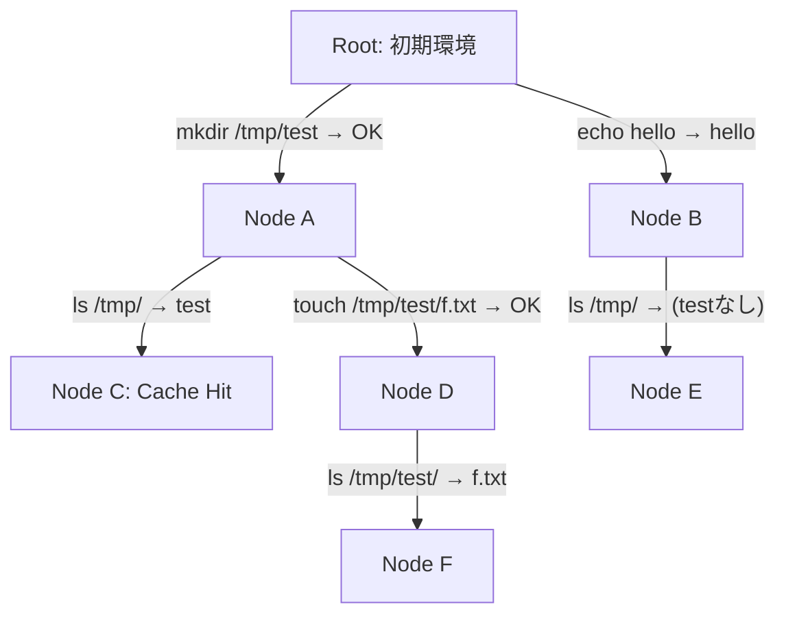

本記事は [TVCache: A Stateful Tool-Value Cache for Post-Training LLM Agents](https://arxiv.org/abs/2602.10986) の解説記事です。

## 論文概要（Abstract）

TVCacheは、LLMエージェントの強化学習（RL）ベースのポストトレーニングにおいて、外部ツール呼び出しの結果を状態安全にキャッシュする仕組みである。著者らは、ツール呼び出しの履歴をツリー構造（Tool Call Graph: TCG）で管理し、Longest-Prefix Matching（LPM）によりO(log N)でキャッシュ検索を行う手法を提案している。Terminal-bench、SkyRL-SQL、EgoSchemaの3つのベンチマークにおいて、最大6.9倍の訓練高速化と、P95キャッシュ検索レイテンシ3.3msを達成したと報告されている。

この記事は [Zenn記事: MCP×セマンティックキャッシュでエージェントのレイテンシを40%削減する](https://zenn.dev/0h_n0/articles/15a8b787c36706) の深掘りです。Zenn記事が推論時のセマンティックキャッシュに焦点を当てているのに対し、本記事では訓練時のツール呼び出しキャッシュという異なる局面を扱う。

## 情報源

- **arXiv ID**: 2602.10986
- **URL**: [https://arxiv.org/abs/2602.10986](https://arxiv.org/abs/2602.10986)
- **著者**: Abhishek Vijaya Kumar, Bhaskar Kataria (equal contributors), Byungsoo Oh, et al.
- **発表年**: 2026
- **分野**: cs.LG

## 背景と動機（Background & Motivation）

LLMエージェントのポストトレーニングでは、GRPO（Group Relative Policy Optimization）やReinforce++といったRL手法を用いて、ツール使用能力を向上させる。この訓練プロセスでは、各ロールアウト（エージェントの行動シーケンス）で外部ツール（シェルコマンド実行、SQL問い合わせ、API呼び出し等）が呼び出されるが、これらのツール実行には数秒から数分を要する。その間GPUはアイドル状態となり、訓練全体のスループットが低下する。

従来のキャッシュは「同じ入力には同じ出力を返す」というステートレスな前提に基づいている。しかし、エージェントのツール呼び出しは本質的にステートフルである。例えば、`mkdir /tmp/test` の後に `ls /tmp/` を実行した場合と、`mkdir` なしに `ls /tmp/` を実行した場合では結果が異なる。つまり、ツール呼び出しの結果は、それ以前のツール実行によって変更された環境状態に依存する。ステートレスキャッシュでは、この状態依存性を捉えられず、誤ったキャッシュヒットが訓練データの品質を劣化させるリスクがある。

著者らは、この問題をツール呼び出しの「状態安全性」として定式化し、過去のツール実行シーケンス全体が一致する場合のみキャッシュヒットを許可するTool Call Graph（TCG）を提案している。

## 主要な貢献（Key Contributions）

- **Tool Call Graph（TCG）**: ツール呼び出し履歴をツリー構造で管理し、Longest-Prefix Matchingにより状態安全なキャッシュ検索をO(log N)で実現するデータ構造を提案した
- **最適化手法群**: Stateless tool annotation、Selective snapshotting、Proactive forking、参照カウントベースのConcurrency controlの4つの最適化により、実用的なヒット率と並列実行性能を達成した
- **3ベンチマークでの実証評価**: Terminal-bench（シェル操作）、SkyRL-SQL（SQL問い合わせ）、EgoSchema（ビデオ理解）の3つの異なるワークロードで、最大6.9倍の高速化と14%-73%のキャッシュヒット率を報告した
- **システム実装**: P95キャッシュ検索レイテンシ3.3ms（256 RPS）、16シャードで4096 RPSに対応するスケーラブルなシステムを実装した

## 技術的詳細（Technical Details）

### Tool Call Graphの構造

TCGは、エージェントのツール呼び出し履歴をツリー（木構造）として管理するデータ構造である。ルートノードは初期環境状態を表し、各エッジはツール呼び出し（入力と出力のペア）に対応する。あるノードに到達するまでのルートからのパスが、そのノードにおける環境の状態履歴を表す。



上図において、Node Cの `ls /tmp/` の結果は `test` が存在する状態だが、Node Eの `ls /tmp/` の結果には `test` が存在しない。同じツール呼び出し `ls /tmp/` であっても、そこに至る履歴（パス）が異なれば結果も異なることが、ツリー構造により表現されている。

### Longest-Prefix Matching（LPM）

新しいロールアウトでツール呼び出しシーケンス $\mathbf{t} = (t_1, t_2, \ldots, t_n)$ が生成されたとき、TCGに対してLPMを実行する。LPMは、ルートから開始してシーケンスの各要素と一致するエッジを辿り、一致しなくなった地点（最長プレフィックス）を返す。

形式的には、TCGのノード集合を $V$、エッジ集合を $E$ とし、各エッジ $e \in E$ にはツール呼び出し $(input_e, output_e)$ のペアがラベルとして付与されている。LPMは以下のように定義される。

$$
\text{LPM}(\mathbf{t}, \text{TCG}) = \arg\max_{k} \left\{ k \mid \exists \text{path } (v_0, v_1, \ldots, v_k) \text{ s.t. } \forall i \leq k: \text{label}(v_{i-1}, v_i) = t_i \right\}
$$

ここで、
- $\mathbf{t} = (t_1, t_2, \ldots, t_n)$: 新しいロールアウトのツール呼び出しシーケンス
- $v_0$: ルートノード
- $\text{label}(v_{i-1}, v_i)$: エッジ $(v_{i-1}, v_i)$ に付与されたツール呼び出しラベル
- $k$: 一致するプレフィックスの長さ

LPMの結果、$k$ 個のツール呼び出しがキャッシュヒットし、$t_{k+1}$ 以降のみが実際にツール実行される。TCGはツリー構造であるため、各ノードの子は入力値でソートされたマップとして実装でき、検索は $O(\log N)$ で完了する（$N$ はノードの子数）。

### 状態安全性の保証

LPMによるキャッシュヒットが状態安全である根拠は、次の不変条件による。エージェントのツール呼び出しシーケンスのプレフィックス $(t_1, \ldots, t_k)$ がTCG上のパスと完全に一致する場合、ノード $v_k$ における環境状態は過去のロールアウトで $v_k$ に到達した際の環境状態と同一である。これは、ツール呼び出しが決定論的であるという仮定に基づく。

非決定論的なツール（例: 現在時刻を返すAPI）については、キャッシュ対象から除外するか、ツール固有のequivalence関数を定義して対処する設計となっている。

### Pythonによるデータ構造の実装例

```python
from __future__ import annotations

from dataclasses import dataclass, field
from typing import Optional


@dataclass
class ToolCall:
    """ツール呼び出しを表すデータクラス

    Attributes:
        tool_name: ツール名（例: "bash", "sql_query"）
        input_args: ツールへの入力引数
        output: ツールの実行結果
        is_stateless: 状態を変更しないツールかどうか
    """
    tool_name: str
    input_args: str
    output: str
    is_stateless: bool = False


@dataclass
class TCGNode:
    """Tool Call Graphのノード

    Attributes:
        children: 子ノードへのマッピング（入力引数 -> (ToolCall, 子ノード)）
        sandbox_snapshot: このノードの環境スナップショット（任意）
        ref_count: 参照カウント（並列ロールアウト用）
    """
    children: dict[str, tuple[ToolCall, TCGNode]] = field(default_factory=dict)
    sandbox_snapshot: Optional[str] = None
    ref_count: int = 0


class ToolCallGraph:
    """Tool Call Graph: 状態安全なツール呼び出しキャッシュ

    ツール呼び出し履歴をツリー構造で管理し、
    Longest-Prefix Matchingによりキャッシュ検索を行う。
    """

    def __init__(self) -> None:
        self.root = TCGNode()

    def longest_prefix_match(
        self, sequence: list[ToolCall]
    ) -> tuple[int, TCGNode]:
        """ツール呼び出しシーケンスの最長プレフィックスマッチを実行

        Args:
            sequence: 新しいロールアウトのツール呼び出しシーケンス

        Returns:
            (一致した長さ, 最後に一致したノード)のタプル
        """
        current = self.root
        matched = 0

        for call in sequence:
            # Stateless toolはLPM時にスキップ
            if call.is_stateless:
                matched += 1
                continue

            key = f"{call.tool_name}:{call.input_args}"
            if key in current.children:
                stored_call, child = current.children[key]
                current = child
                matched += 1
            else:
                break

        return matched, current

    def insert(self, sequence: list[ToolCall]) -> None:
        """ツール呼び出しシーケンスをTCGに挿入

        Args:
            sequence: 完了したロールアウトのツール呼び出しシーケンス
        """
        current = self.root

        for call in sequence:
            key = f"{call.tool_name}:{call.input_args}"
            if key not in current.children:
                new_node = TCGNode()
                current.children[key] = (call, new_node)
            _, current = current.children[key]
```

## 実装のポイント（Implementation）

### Stateless Tool Annotation

ファイル読み取りや環境変数参照など、環境状態を変更しないツール呼び出しを開発者が明示的にアノテーションする仕組みである。LPM時にstatelessと注釈されたツール呼び出しはスキップされるため、プレフィックスの一致判定がより寛容になり、ヒット率が向上する。著者らは、EgoSchemaベンチマークにおいて8つのツールのうち読み取り専用ツールをstatelessとアノテーションすることで、ヒット率が向上したと報告している。

### Selective Snapshotting

すべてのTCGノードに環境スナップショット（Dockerコンテナのチェックポイント等）を保存するのではなく、ツール実行コストがスナップショット保存・復元コストを上回る場合のみスナップショットを保存する戦略である。コスト関数を $C_{\text{exec}}(t)$（ツール $t$ の実行コスト）、$C_{\text{snap}}$（スナップショットコスト）とすると、以下の条件を満たすノードにのみスナップショットを保存する。

$$
C_{\text{exec}}(t) > C_{\text{snap}} + C_{\text{restore}}
$$

これにより、メモリ使用量を1-2GB程度に抑えつつ、高コストなツール呼び出しの再実行を回避できる。

### Proactive Forking

RLの各トレーニングステップが開始される前に、ルートサンドボックスのフォークと内部ノードのコピーを事前に作成しておく手法である。ロールアウト開始時にサンドボックスの準備が完了しているため、フォーク待ちによるレイテンシが削減される。Dockerコンテナベースの実装では、OverlayFSのCopy-on-Write機構を利用して効率的なフォークを実現していると考えられる。

### Concurrency Control

複数のロールアウトが並列に実行される場合、あるロールアウトが参照中のTCGノードが別のロールアウトによってevictされることを防ぐ必要がある。著者らは参照カウント方式を採用し、各ノードのref_countが0より大きい間はeviction対象から除外する設計としている。

## Production Deployment Guide

TVCacheはRLポストトレーニングのインフラであるため、ここではAWS上でのRL訓練環境を想定した構成を示す。コスト試算は2026年9月時点のAWS東京リージョン（ap-northeast-1）の概算値であり、実際のコストはワークロードや利用パターンにより変動する。

### AWS実装パターン（コスト最適化重視）

| 構成 | 想定規模 | 主要サービス | 月額概算 |
|------|---------|-------------|---------|
| Small | 単一GPU実験 | g5.xlarge + Docker + Redis | $800-1,200 |
| Medium | マルチGPU訓練 | p4d.24xlarge + ECS + Redis Cluster | $15,000-25,000 |
| Large | 分散訓練 | EKS + Karpenter + ElastiCache | $50,000-100,000 |

**Small構成（単一GPU実験）**:
- g5.xlarge（1× A10G GPU、16GB VRAM）でQwen3-4Bクラスのモデルを訓練
- TVCacheサーバをDocker Composeで同一インスタンス上に配置
- Redis（t3.medium）をTCGのバックエンドストアとして使用
- EBSボリューム（gp3, 500GB）にDockerスナップショットを保存

**Medium構成（マルチGPU訓練）**:
- p4d.24xlarge（8× A100 GPU）でQwen3-14B/30Bクラスのモデルを訓練
- TVCacheサーバをECS Fargateで独立運用（4 vCPU, 16GB RAM）
- Redis Cluster（r6g.xlarge × 3ノード）でTCGシャーディング
- FSx for Lustreで高速スナップショットI/O

**Large構成（分散訓練）**:
- EKS上でマルチノード分散訓練（p4d.24xlarge × 4-8ノード）
- Karpenterによる自動スケーリング（Spot Instances優先で最大90%コスト削減）
- ElastiCache for Redis（r6g.2xlarge × 6ノード、16シャード構成）
- 論文のベンチマークでは16シャードで4096 RPSに対応

**コスト削減テクニック**:
- Spot Instances: 訓練ワーカーにp4dスポットを使用し最大60-70%削減（中断時はチェックポイントから再開）
- Reserved Instances: Redis/管理ノードの常時稼働分は1年RIで最大40%削減
- スケジュール停止: 実験しない夜間・週末はAutoScaling Groupのmin/desiredを0に設定
- S3 Intelligent-Tiering: スナップショットの長期保存コストを自動最適化

### Terraformインフラコード

**Small構成（単一GPU + Redis）**:

```hcl
# TVCache RL Training - Small構成
# g5.xlarge + Docker + Redis

terraform {
  required_version = ">= 1.9"
  required_providers {
    aws = {
      source  = "hashicorp/aws"
      version = "~> 5.70"
    }
  }
}

provider "aws" {
  region = "ap-northeast-1"
}

# VPC基盤（NAT Gateway不使用でコスト削減）
module "vpc" {
  source  = "terraform-aws-modules/vpc/aws"
  version = "~> 5.13"

  name = "tvcache-training-vpc"
  cidr = "10.0.0.0/16"

  azs            = ["ap-northeast-1a"]
  public_subnets = ["10.0.1.0/24"]

  enable_nat_gateway = false
  enable_dns_support = true
}

# Redis（TCGバックエンドストア）
resource "aws_elasticache_cluster" "tvcache_redis" {
  cluster_id           = "tvcache-tcg-store"
  engine               = "redis"
  node_type            = "cache.t3.medium"
  num_cache_nodes      = 1
  port                 = 6379
  parameter_group_name = "default.redis7"
  subnet_group_name    = aws_elasticache_subnet_group.main.name
  security_group_ids   = [aws_security_group.redis.id]
}

resource "aws_elasticache_subnet_group" "main" {
  name       = "tvcache-redis-subnet"
  subnet_ids = module.vpc.public_subnets
}

# GPU訓練インスタンス
resource "aws_instance" "training" {
  ami           = "ami-0abcdef1234567890" # Deep Learning AMI (Ubuntu)
  instance_type = "g5.xlarge"
  subnet_id     = module.vpc.public_subnets[0]

  root_block_device {
    volume_size = 500        # Dockerスナップショット用
    volume_type = "gp3"
    throughput  = 250
    iops        = 3000
    encrypted   = true       # KMS暗号化
  }

  iam_instance_profile = aws_iam_instance_profile.training.name

  tags = {
    Name    = "tvcache-training"
    Project = "tvcache-rl"
  }
}

# IAMロール（最小権限）
resource "aws_iam_role" "training" {
  name = "tvcache-training-role"
  assume_role_policy = jsonencode({
    Version = "2012-10-17"
    Statement = [{
      Action = "sts:AssumeRole"
      Effect = "Allow"
      Principal = { Service = "ec2.amazonaws.com" }
    }]
  })
}

resource "aws_iam_instance_profile" "training" {
  name = "tvcache-training-profile"
  role = aws_iam_role.training.name
}

# CloudWatchアラーム（GPU使用率監視）
resource "aws_cloudwatch_metric_alarm" "gpu_idle" {
  alarm_name          = "tvcache-gpu-idle"
  comparison_operator = "LessThanThreshold"
  evaluation_periods  = 3
  metric_name         = "GPUUtilization"
  namespace           = "AWS/EC2"
  period              = 300
  statistic           = "Average"
  threshold           = 10
  alarm_description   = "GPU utilization below 10% - check TVCache hit rate"
  dimensions = {
    InstanceId = aws_instance.training.id
  }
}

# セキュリティグループ
resource "aws_security_group" "redis" {
  name_prefix = "tvcache-redis-"
  vpc_id      = module.vpc.vpc_id

  ingress {
    from_port       = 6379
    to_port         = 6379
    protocol        = "tcp"
    security_groups = [aws_security_group.training.id]
  }
}

resource "aws_security_group" "training" {
  name_prefix = "tvcache-training-"
  vpc_id      = module.vpc.vpc_id

  egress {
    from_port   = 0
    to_port     = 0
    protocol    = "-1"
    cidr_blocks = ["0.0.0.0/0"]
  }
}
```

**Large構成（EKS + Karpenter + 分散キャッシュ）**:

```hcl
# TVCache RL Training - Large構成
# EKS + Karpenter (Spot優先) + ElastiCache Cluster

module "eks" {
  source  = "terraform-aws-modules/eks/aws"
  version = "~> 20.24"

  cluster_name    = "tvcache-training-cluster"
  cluster_version = "1.31"

  vpc_id     = module.vpc.vpc_id
  subnet_ids = module.vpc.private_subnets

  # パブリックアクセス最小化
  cluster_endpoint_public_access  = true
  cluster_endpoint_private_access = true

  eks_managed_node_groups = {
    # 管理ノード（常時稼働）
    system = {
      instance_types = ["m6i.xlarge"]
      min_size       = 1
      max_size       = 3
      desired_size   = 2
    }
  }
}

# Karpenter（GPU Spotノード自動スケーリング）
resource "kubectl_manifest" "karpenter_nodepool" {
  yaml_body = yamlencode({
    apiVersion = "karpenter.sh/v1"
    kind       = "NodePool"
    metadata   = { name = "gpu-training" }
    spec = {
      template = {
        spec = {
          requirements = [
            { key = "node.kubernetes.io/instance-type", operator = "In",
              values = ["p4d.24xlarge", "p4de.24xlarge"] },
            { key = "karpenter.sh/capacity-type", operator = "In",
              values = ["spot", "on-demand"] },  # Spot優先
          ]
          nodeClassRef = { name = "gpu-nodes" }
        }
      }
      limits   = { cpu = "384", "nvidia.com/gpu" = "64" }
      disruption = {
        consolidationPolicy = "WhenEmpty"
        consolidateAfter    = "30s"
      }
    }
  })
}

# ElastiCache Redis Cluster（TCG 16シャード構成）
resource "aws_elasticache_replication_group" "tvcache" {
  replication_group_id = "tvcache-tcg-cluster"
  description          = "TVCache TCG distributed store"

  node_type            = "cache.r6g.2xlarge"
  num_node_groups      = 16  # 16シャード
  replicas_per_node_group = 1

  automatic_failover_enabled = true
  multi_az_enabled           = true
  at_rest_encryption_enabled = true
  transit_encryption_enabled = true

  parameter_group_name = "default.redis7.cluster.on"
}

# AWS Budgets（予算アラート）
resource "aws_budgets_budget" "training" {
  name         = "tvcache-monthly-budget"
  budget_type  = "COST"
  limit_amount = "80000"
  limit_unit   = "USD"
  time_unit    = "MONTHLY"

  notification {
    comparison_operator       = "GREATER_THAN"
    threshold                 = 80
    threshold_type            = "PERCENTAGE"
    notification_type         = "ACTUAL"
    subscriber_email_addresses = ["alerts@example.com"]
  }
}
```

### 運用・監視設定

**CloudWatch Logs Insights クエリ（キャッシュヒット率監視）**:

```
fields @timestamp, @message
| filter @message like /cache_hit/
| stats count(*) as total,
        sum(case when hit = 1 then 1 else 0 end) as hits,
        sum(case when hit = 1 then 1 else 0 end) * 100.0 / count(*) as hit_rate
| by bin(1h)
```

**CloudWatch アラーム設定（Python）**:

```python
import boto3


def setup_tvcache_alarms(instance_id: str, sns_topic_arn: str) -> None:
    """TVCache訓練環境のCloudWatchアラームを設定

    Args:
        instance_id: 訓練インスタンスID
        sns_topic_arn: 通知先SNSトピックARN
    """
    cw = boto3.client("cloudwatch", region_name="ap-northeast-1")

    # GPU使用率低下アラーム（キャッシュ未活用の可能性）
    cw.put_metric_alarm(
        AlarmName="tvcache-gpu-underutilized",
        MetricName="GPUUtilization",
        Namespace="Custom/TVCache",
        Statistic="Average",
        Period=300,
        EvaluationPeriods=3,
        Threshold=20.0,
        ComparisonOperator="LessThanThreshold",
        AlarmActions=[sns_topic_arn],
        Dimensions=[{"Name": "InstanceId", "Value": instance_id}],
    )

    # キャッシュメモリ使用量アラーム
    cw.put_metric_alarm(
        AlarmName="tvcache-memory-high",
        MetricName="CacheMemoryUsageBytes",
        Namespace="Custom/TVCache",
        Statistic="Maximum",
        Period=60,
        EvaluationPeriods=2,
        Threshold=2 * 1024 ** 3,  # 2GB（論文のピーク値）
        ComparisonOperator="GreaterThanThreshold",
        AlarmActions=[sns_topic_arn],
    )
```

**X-Ray トレーシング設定（Python）**:

```python
from aws_xray_sdk.core import xray_recorder, patch_all


def configure_tracing() -> None:
    """TVCacheのX-Rayトレーシングを設定"""
    xray_recorder.configure(
        service="tvcache-training",
        sampling=True,
        context_missing="LOG_ERROR",
    )
    patch_all()  # boto3自動計装


def trace_cache_lookup(sequence_length: int, hit_length: int) -> None:
    """キャッシュ検索をトレースに記録

    Args:
        sequence_length: ツール呼び出しシーケンスの長さ
        hit_length: キャッシュヒットしたプレフィックスの長さ
    """
    segment = xray_recorder.current_segment()
    segment.put_annotation("cache_hit_ratio", hit_length / max(sequence_length, 1))
    segment.put_metadata("sequence_length", sequence_length)
    segment.put_metadata("hit_length", hit_length)
```

**Cost Explorer自動レポート（Python）**:

```python
import datetime

import boto3


def daily_training_cost_report(sns_topic_arn: str) -> dict:
    """日次の訓練コストレポートを生成・通知

    Args:
        sns_topic_arn: 通知先SNSトピックARN

    Returns:
        コスト内訳の辞書
    """
    ce = boto3.client("ce", region_name="us-east-1")
    sns = boto3.client("sns", region_name="ap-northeast-1")

    today = datetime.date.today()
    yesterday = today - datetime.timedelta(days=1)

    response = ce.get_cost_and_usage(
        TimePeriod={
            "Start": yesterday.isoformat(),
            "End": today.isoformat(),
        },
        Granularity="DAILY",
        Metrics=["BlendedCost"],
        Filter={
            "Tags": {
                "Key": "Project",
                "Values": ["tvcache-rl"],
            }
        },
        GroupBy=[{"Type": "DIMENSION", "Key": "SERVICE"}],
    )

    costs: dict[str, float] = {}
    total = 0.0
    for group in response["ResultsByTime"][0]["Groups"]:
        service = group["Keys"][0]
        amount = float(group["Metrics"]["BlendedCost"]["Amount"])
        costs[service] = amount
        total += amount

    # $500/日超過で通知（Large構成の日割り警告閾値）
    if total > 500:
        sns.publish(
            TopicArn=sns_topic_arn,
            Subject="TVCache Training Cost Alert",
            Message=f"Daily cost: ${total:.2f}\n{costs}",
        )

    return costs
```

### コスト最適化チェックリスト

**アーキテクチャ選択**:
- [ ] 訓練規模に応じた構成選択（Small: 単一GPU / Medium: マルチGPU / Large: 分散訓練）
- [ ] キャッシュヒット率に基づくRedisノードサイズの適正化

**リソース最適化**:
- [ ] GPU訓練ノード: Spot Instances優先（p4d spotで最大60-70%削減）
- [ ] 管理ノード: Reserved Instances 1年コミット（最大40%削減）
- [ ] Savings Plans: EC2/Fargate Savings Plansの検討
- [ ] EBS: gp3ボリューム（gp2比で最大20%コスト削減）
- [ ] 非訓練時間帯のAutoScaling min=0設定

**キャッシュコスト削減**:
- [ ] Selective Snapshotting有効化（不要なスナップショットの削減）
- [ ] TCGのTTL設定（訓練完了後の古いエントリ自動削除）
- [ ] Redis Data Tiering（ElastiCache r6gd）で低頻度データをSSDへ
- [ ] Stateless Tool Annotationでヒット率向上 → GPU待機時間削減

**監視・アラート**:
- [ ] AWS Budgets: 月次予算アラート設定
- [ ] CloudWatch: GPU使用率、キャッシュヒット率、メモリ使用量
- [ ] Cost Anomaly Detection: 異常コスト自動検知
- [ ] 日次コストレポート: SNS通知

**リソース管理**:
- [ ] 未使用Dockerスナップショットの定期削除
- [ ] タグ戦略: Project/Environment/Owner タグ必須
- [ ] EBSスナップショットのライフサイクルポリシー（7日保持）
- [ ] 開発環境: 夜間・週末の自動停止スケジュール
- [ ] S3 Intelligent-Tiering: スナップショットアーカイブの自動階層化

## 実験結果（Results）

著者らは3つのベンチマークでTVCacheの有効性を評価している。

| ベンチマーク | タスク数 | モデル | キャッシュヒット率 | 高速化倍率 |
|-------------|---------|--------|------------------|-----------|
| Terminal-bench (easy) | 51 | Qwen3-4B | 20.2%-25.3% | - |
| Terminal-bench (medium) | 95 | Qwen3-4B | 14.2%-16.7% | 6.92× (中央値) |
| SkyRL-SQL | 653 | Qwen2.5-Coder-7B | 33.11% (平均) | 8.7× (per-hit) |
| EgoSchema | 100 | Qwen3-30B | 64.3% (平均) | 3× トークン削減 |

Terminal-benchではLinux shellコマンドをDockerコンテナ内で実行するタスクを扱い、mediumタスクで6.92倍の中央値高速化を達成したと報告されている。SkyRL-SQLではクラウドDB上のSQL問い合わせを対象とし、各キャッシュヒットで実行時間を56.6msから6.5msに短縮（8.7倍）している。EgoSchemaではビデオ理解タスクを8つの外部ツールで処理するワークロードを扱い、64.3%のヒット率とAPIトークン使用量の3倍削減を達成している。

システム性能については、P95キャッシュ検索レイテンシが256 RPSで3.3ms、16シャード構成で4096 RPSにおいて6.1msであると報告されている。メモリ使用量は通常1-2GB、ピーク時2GB程度である。

ヒット率がワークロードにより14%から73%まで大きく変動する点は注目に値する。著者らは、文字列引数を持つツール呼び出し（自然言語テキストの微小な変異でプレフィックスが不一致になる）でヒット率が低下する傾向を報告しており、ファジーマッチングの導入が今後の課題として挙げられている。

## 実運用への応用（Practical Applications）

Zenn記事で扱われているセマンティックキャッシュは、推論時（ユーザリクエストへの応答時）にLLMの出力をキャッシュする仕組みであり、入力の意味的類似性に基づくファジーマッチングを特徴とする。一方、TVCacheは訓練時（RLポストトレーニング中）のツール呼び出し結果をキャッシュする仕組みであり、状態安全性を保証するための厳密なプレフィックスマッチングを特徴とする。

この2つのアプローチは対象フェーズは異なるが、共通の設計課題を持つ。第一に、キャッシュの無効化戦略である。セマンティックキャッシュではTTLベースの無効化が一般的だが、TVCacheではTCGのツリー構造自体が状態の変化を追跡するため、明示的な無効化が不要である。第二に、並列アクセス制御であり、両者とも高スループット環境での整合性確保が求められる。

実務的には、MCPサーバ経由のツール呼び出しに対してTVCache的なプレフィックスマッチングを適用することで、エージェントの繰り返し実行パターン（同じ調査手順を複数回実行するケース等）を効率化できる可能性がある。ただし、推論時はユーザ入力の多様性が高いため、訓練時ほどのヒット率は期待しにくい。

## 関連研究（Related Work）

- **Merchant et al., Temporal Cache（2024）**: LLMの推論時KVキャッシュを時系列で管理する手法。TVCacheがツール呼び出しの状態依存性に着目しているのに対し、Temporal Cacheはアテンション計算のキャッシュに焦点を当てている。レイヤーが異なるが、キャッシュの「状態」を意識する設計思想は共通する
- **GPTCache / ContextCache**: セマンティック類似性に基づくLLM出力のキャッシュ。入力の埋め込みベクトルの類似度でヒット判定を行う。TVCacheの厳密マッチングとは対照的に、ファジーマッチングを採用しており、推論時のレイテンシ削減に適している
- **vLLM Prefix Caching**: 推論エンジンレベルでのKVキャッシュ共有。同一プレフィックスを持つリクエスト間でKVキャッシュを再利用する。TVCacheのLPMとはレイヤーが異なる（モデル内部 vs. ツール実行結果）が、プレフィックスマッチングという手法は共通している

## まとめと今後の展望

TVCacheは、LLMエージェントのRLポストトレーニングにおけるツール呼び出しのボトルネックに対して、Tool Call Graphによる状態安全なキャッシュ機構を提案した。最大6.9倍の高速化という結果は、エージェント訓練のコスト効率を改善する実用的な手法であることを示している。

今後の研究方向としては、著者らが指摘している文字列引数のファジーマッチング対応、数百並列コンテナへのスケーリング、非決定論的ツールへの対応が挙げられる。また、訓練時のキャッシュ手法を推論時に応用する方向性（MCPサーバのツール呼び出しキャッシュ等）も、実務的に有望な展開である。

## 参考文献

- **arXiv**: [https://arxiv.org/abs/2602.10986](https://arxiv.org/abs/2602.10986)
- **Related Zenn article**: [https://zenn.dev/0h_n0/articles/15a8b787c36706](https://zenn.dev/0h_n0/articles/15a8b787c36706)
