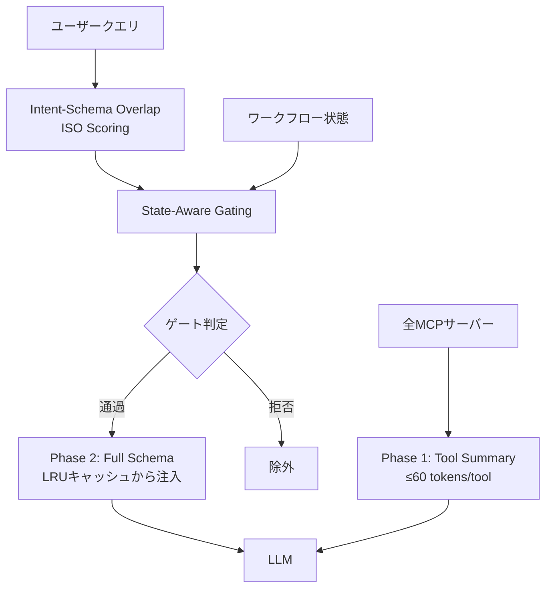
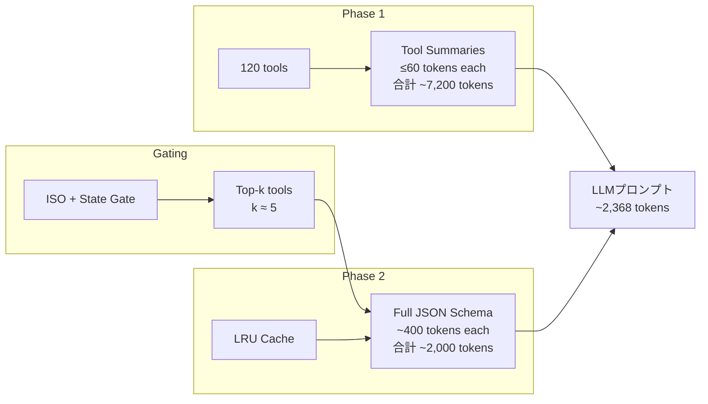

## 論文概要（Abstract）

本記事は [Tool Attention Is All You Need: Dynamic Tool Gating and Lazy Schema Loading for Eliminating the MCP/Tools Tax in Scalable Agentic Workflows](https://arxiv.org/abs/2604.21816) の解説記事です。

MCPプロトコルに基づくマルチサーバー環境では、利用可能な全ツールのJSONスキーマを毎ターンのプロンプトに注入する「eager schema injection」方式が標準的であり、120ツール規模のデプロイメントでは1ターンあたり約47,000トークンのオーバーヘッドが生じる。著者らは、Transformerのself-attentionに着想を得たTool Attentionメカニズムを提案し、セマンティックスコアリングと状態依存ゲーティングを組み合わせたミドルウェアレイヤーにより、ツールトークンを95%削減（47,312→2,368トークン/ターン）し、コンテキスト利用率を24%から91%へ改善したと報告している。さらに、adversarialなツール説明の攻撃成功率を38%から6%に低減する副次的効果も示されている。

この記事は [Zenn記事: MCP×セマンティックキャッシュでエージェントのレイテンシを40%削減する](https://zenn.dev/0h_n0/articles/15a8b787c36706) の深掘りです。

## 情報源

- **arXiv ID**: 2604.21816
- **URL**: [https://arxiv.org/abs/2604.21816](https://arxiv.org/abs/2604.21816)
- **著者**: Anuj Sadani, Deepak Kumar
- **発表年**: 2026年4月
- **分野**: Artificial Intelligence (cs.AI)

## 背景と動機（Background & Motivation）

### MCP Tools Tax問題

Model Context Protocol（MCP）は、LLMエージェントが外部ツールやサービスと標準化されたインターフェースで連携するためのプロトコルである。MCPサーバーは各ツールの名前・説明・パラメータ定義をJSONスキーマとして公開し、クライアント（LLM）はこのスキーマ情報をもとにツールを選択・呼び出す。

現行の標準的な実装では、接続中の全MCPサーバーが公開する全ツールのスキーマを、毎ターンのプロンプトに注入する「eager schema injection」方式が採用されている。GitHub（30ツール、約520トークン/スキーマ）、Jira（35ツール、約470トークン/スキーマ）など6サーバーで120ツールを接続した場合、スキーマ注入だけで約47,300トークンが消費される。これは128kトークンのコンテキストウィンドウの約37%に相当し、実際のタスク遂行に使える領域を圧迫する。

### コンテキスト汚染による推論性能の劣化

著者らは、問題がトークン消費だけでなく推論品質にも及ぶことを指摘している。コンテキスト利用率が70%を超えると、LLMの推論性能が劣化する現象が先行研究（Liu et al., 2024; Shi et al., 2024等）で報告されており、大量のツールスキーマはLLMの注意を分散させるノイズとして機能する。著者らはこの問題を「MCP/Tools Tax」と呼び、トークンコスト・レイテンシ・推論精度の3側面で負のインパクトを与えるとしている。

### 従来手法の限界

既存のアプローチとしては、ツール数を手動で制限する方法やRAGベースのツール検索がある。しかし前者はマルチサーバー環境では管理が煩雑であり、後者はツールの前提条件（例: ファイルを削除するには先にファイルを作成している必要がある）を考慮しない。本論文が目指すのは、ユーザークエリと現在のワークフロー状態に基づいて動的かつ自動的にツールをフィルタリングする、transparent なミドルウェアレイヤーである。

## 主要な貢献（Key Contributions）

- **Tool Attentionメカニズムの提案**: Intent-Schema Overlap（ISO）スコアリング、State-Aware Gating、Two-Phase Lazy Schema Loadingの3コンポーネントからなるミドルウェアレイヤーにより、LLMの変更なしでツールトークンを95%削減
- **Total Attention Energy（TAE）理論フレームワーク**: Transformerの注意分布理論に基づき、TAE閾値以下のツールを除外しても判断結果に影響しないことを理論的に示す
- **Adversarial Robustness**: 意図的に汚染されたツール説明（Tool Poisoning Attack）の92%を排除し、攻撃成功率を38%から6%に低減
- **包括的なベンチマーク評価**: 6サーバー・120ツールの合成環境でTiktoken測定による定量評価を実施し、推定コスト86%削減、推定レイテンシ52%改善を報告

## 技術的詳細（Technical Details）

### アーキテクチャ概要

Tool Attentionメカニズムは、LLMとMCPサーバー群の間に挿入されるミドルウェアレイヤーとして動作する。以下の3コンポーネントで構成される。



### 1. Intent-Schema Overlap（ISO）スコアリング

ISOスコアは、ユーザークエリとツール説明のセマンティック類似度を定量化する。具体的には、テキスト埋め込みモデル（all-MiniLM-L6-v2、384次元）を用いてクエリ$q$とツール$t_i$の説明をそれぞれベクトル化し、コサイン類似度を計算する。

$$
\text{ISO}(q, t_i) = \frac{\mathbf{e}_q^\top \mathbf{e}_{t_i}}{||\mathbf{e}_q||_2 \cdot ||\mathbf{e}_{t_i}||_2}
$$

ここで、
- $\mathbf{e}_q \in \mathbb{R}^{384}$: クエリ$q$の埋め込みベクトル
- $\mathbf{e}_{t_i} \in \mathbb{R}^{384}$: ツール$t_i$の説明テキストの埋め込みベクトル
- $||\cdot||_2$: L2ノルム

all-MiniLM-L6-v2は22Mパラメータの軽量モデルであり、1クエリあたりの推論コストはLLM呼び出しと比較して無視できるレベルである。著者らは論文中で「ISO scoring adds <5ms per query on a single CPU core」と報告している。

### 2. State-Aware Gating

ISOスコアだけではツールの文脈依存性を捉えられない。例えば「ファイルを削除する」というクエリに対してdelete_fileツールのISOスコアは高いが、対象ファイルがまだ作成されていなければ呼び出すべきではない。State-Aware Gatingはセマンティックマッチングと決定論的前提条件チェックを組み合わせることでこの問題に対処する。

$$
g(t_i; q, \text{state}_t) = [\text{ISO}(q, t_i) \geq \theta] \cdot [\text{state}_t \models \text{pre}_i]
$$

ここで、
- $g(t_i; q, \text{state}_t)$: ツール$t_i$のゲート出力（1: 通過、0: 拒否）
- $\theta$: ISOスコア閾値（著者らは$\theta \in [0.22, 0.32]$の範囲が有効と報告）
- $\text{state}_t$: ターン$t$時点のワークフロー状態（これまでの操作履歴、作成・変更されたリソースなど）
- $\text{pre}_i$: ツール$t_i$の前提条件（例: `file_exists`, `repo_cloned`）
- $[\cdot]$: Iverson括弧（条件が真なら1、偽なら0）
- $\models$: 充足関係（$\text{state}_t$が$\text{pre}_i$を満たすかどうか）

この二重条件により、セマンティックに関連があっても前提条件が満たされていないツールは除外される。逆に、前提条件を満たしていてもクエリと無関係なツールも除外される。

### 3. Two-Phase Lazy Schema Loading

従来のeager schema injectionが全ツールのフルスキーマを毎ターン注入するのに対し、本手法は2段階のロード方式でトークン消費を削減する。

**Phase 1（常駐サマリー）**: 各ツールのコンパクトなサマリー（ツール名、1行の説明、最大60トークン）を常にプロンプトに含める。120ツールで約7,200トークンであり、フルスキーマの47,300トークンと比較して約85%の削減となる。このサマリー部分はターン間で不変であるため、LLM APIのプロンプトキャッシュ（Anthropic Prompt Caching等）の対象となり、キャッシュヒット率84%を達成している。

**Phase 2（オンデマンド注入）**: ゲーティングを通過したtop-kツール（著者らの実験ではk=5前後）のフルJSONスキーマのみをプロンプトに追加注入する。フルスキーマはLRUキャッシュ（メモリ上）に保持され、ネットワーク呼び出しなしで即時取得できる。



### 理論的基盤: Total Attention Energy（TAE）

著者らは、Transformerの注意機構に基づく理論的正当性を提示している。TAEフレームワークでは、コンテキスト中の各トークン（ここではツールスキーマのトークン）が受け取る注意エネルギーの総量を定義し、TAEが一定の閾値以下のトークンは「注意的に不活性（attention-inactive）」であると見なす。

直感的には、LLMがツール選択を行う際、120ツールのスキーマの大部分には実質的に注意が向けられていない。TAEフレームワークは、この現象を理論的に捉え、注意エネルギーが低いツールを事前にフィルタリングしても最終的な判断結果に影響しないことを示している。さらに、poisoned description（悪意あるツール説明）もTAEが低い傾向があるため、セキュリティの面でも有効に機能する。

## 実装のポイント（Implementation）

### IntentRouter: クエリとツールのセマンティックマッチング

```python
from dataclasses import dataclass
from typing import Sequence

import numpy as np
from numpy.typing import NDArray
from sentence_transformers import SentenceTransformer


@dataclass(frozen=True)
class ToolDescriptor:
    """MCPツールのメタデータ

    Attributes:
        name: ツールの一意識別子（例: 'github_create_issue'）
        summary: 60トークン以下のコンパクトな説明
        full_schema: JSONスキーマ全文
        preconditions: 前提条件のリスト
    """
    name: str
    summary: str
    full_schema: dict
    preconditions: list[str]


class IntentRouter:
    """ISOスコアリングによるツール選択ルーター

    all-MiniLM-L6-v2 を用いてクエリとツール説明の
    コサイン類似度を計算し、関連ツールを特定する。

    Args:
        tools: 登録するツール群
        threshold: ISOスコアの閾値（デフォルト: 0.27）
    """

    def __init__(
        self,
        tools: Sequence[ToolDescriptor],
        threshold: float = 0.27,
    ) -> None:
        self._model = SentenceTransformer("all-MiniLM-L6-v2")
        self._tools = list(tools)
        self._threshold = threshold
        # ツール説明を事前にエンコード（起動時1回のみ）
        summaries = [t.summary for t in self._tools]
        self._tool_embeddings: NDArray[np.float32] = self._model.encode(
            summaries, normalize_embeddings=True,
        )

    def score(self, query: str, top_k: int = 5) -> list[tuple[ToolDescriptor, float]]:
        """クエリに対する各ツールのISOスコアを計算する

        Args:
            query: ユーザーの入力クエリ
            top_k: 返すツール数の上限

        Returns:
            (ToolDescriptor, ISOスコア) のリスト、スコア降順
        """
        q_emb: NDArray[np.float32] = self._model.encode(
            [query], normalize_embeddings=True,
        )
        # コサイン類似度（正規化済みなので内積 = コサイン類似度）
        scores: NDArray[np.float32] = (self._tool_embeddings @ q_emb.T).flatten()

        # 閾値以上のツールを抽出してソート
        candidates = [
            (self._tools[i], float(scores[i]))
            for i in np.argsort(-scores)
            if scores[i] >= self._threshold
        ]
        return candidates[:top_k]
```

### ToolAttention ミドルウェア

```python
from dataclasses import dataclass, field
from functools import lru_cache
import json


@dataclass
class WorkflowState:
    """ワークフローの現在状態を追跡する

    Attributes:
        completed_actions: 完了済みアクションのリスト
        available_resources: 利用可能なリソース（ファイル、リポジトリ等）
    """
    completed_actions: list[str] = field(default_factory=list)
    available_resources: set[str] = field(default_factory=set)

    def satisfies(self, preconditions: list[str]) -> bool:
        """前提条件をすべて満たすか判定する

        Args:
            preconditions: チェックする前提条件のリスト

        Returns:
            すべて満たす場合True
        """
        return all(p in self.available_resources for p in preconditions)


class ToolAttentionMiddleware:
    """Tool Attentionミドルウェア

    ISO Scoring + State-Aware Gating + Lazy Schema Loading を統合し、
    LLMプロンプトに注入するツール情報を最適化する。

    Args:
        router: IntentRouterインスタンス
        top_k: 注入するツール数の上限
    """

    def __init__(self, router: IntentRouter, top_k: int = 5) -> None:
        self._router = router
        self._top_k = top_k

    def build_tool_context(
        self,
        query: str,
        state: WorkflowState,
    ) -> dict[str, object]:
        """ゲーティング後のツールコンテキストを構築する

        Phase 1のサマリー + Phase 2のフルスキーマを返す。

        Args:
            query: ユーザークエリ
            state: 現在のワークフロー状態

        Returns:
            {"summaries": [...], "full_schemas": [...], "stats": {...}}
        """
        # Phase 1: 全ツールのサマリー（常駐）
        summaries = [
            {"name": t.name, "summary": t.summary}
            for t in self._router._tools
        ]

        # ISO Scoring
        candidates = self._router.score(query, top_k=self._top_k * 2)

        # State-Aware Gating
        gated: list[tuple[ToolDescriptor, float]] = []
        for tool, iso_score in candidates:
            if state.satisfies(tool.preconditions):
                gated.append((tool, iso_score))
            if len(gated) >= self._top_k:
                break

        # Phase 2: ゲートを通過したツールのフルスキーマ
        full_schemas = [
            self._load_schema(tool.name, tool.full_schema)
            for tool, _ in gated
        ]

        return {
            "summaries": summaries,
            "full_schemas": full_schemas,
            "stats": {
                "total_tools": len(self._router._tools),
                "candidates_scored": len(candidates),
                "tools_gated_in": len(gated),
            },
        }

    @lru_cache(maxsize=256)
    def _load_schema(self, name: str, schema_tuple: tuple) -> dict:
        """LRUキャッシュからフルスキーマをロードする

        Args:
            name: ツール名
            schema_tuple: スキーマのハッシュ可能表現

        Returns:
            ツールのフルJSONスキーマ
        """
        # 実際にはLRUキャッシュにより2回目以降はメモリから即時取得
        return {"name": name, "schema": dict(schema_tuple) if schema_tuple else {}}
```

### 実装上の注意点

**閾値チューニング**: ISOスコアの閾値$\theta$は、ツール説明の品質に大きく依存する。著者らは$\theta = 0.22$（高再現率）から$\theta = 0.32$（高精度）の範囲を推奨している。デプロイ初期は低い閾値で始め、ログを分析して段階的に引き上げる戦略が現実的である。

**サマリーの品質**: Phase 1のツールサマリーがISOスコアリングの品質を左右する。MCPサーバーの`description`フィールドが不十分な場合、サマリーの手動改善やLLMによる自動リライトが必要になる。論文の失敗分析でも、5.8%の失敗のうち24%がツール説明の不備に起因している。

**前提条件の定義**: State-Aware Gatingの前提条件は、MCPスキーマの標準フィールドには含まれていない。著者らの実装ではツールごとに前提条件をメタデータとして手動定義しているが、プロダクション環境では前提条件推定の自動化が課題となる。

## Production Deployment Guide

### AWS実装パターン（コスト最適化重視）

Tool Attentionミドルウェアは軽量（all-MiniLM-L6-v2: 22Mパラメータ、推論<5ms/query）であり、既存のLLMエージェント基盤にサイドカーまたはミドルウェアレイヤーとして組み込める。以下にトラフィック量別の推奨構成を示す。

**注意**: 以下のコスト試算は2026年9月時点のAWS ap-northeast-1（東京）リージョン料金に基づく概算値である。実際のコストはトラフィックパターン、バースト使用量、契約条件により変動する。最新料金は[AWS料金計算ツール](https://calculator.aws/)で確認を推奨する。

| 構成 | トラフィック | アーキテクチャ | 月額コスト概算 |
|------|------------|--------------|-------------|
| Small | ~100 req/日 | Lambda + Bedrock + DynamoDB | $50-150 |
| Medium | ~1,000 req/日 | ECS Fargate + ElastiCache + Bedrock | $300-800 |
| Large | 10,000+ req/日 | EKS + Karpenter(Spot) + ElastiCache Cluster | $2,000-5,000 |

**Small構成（~100 req/日）**: Lambda関数としてTool Attentionミドルウェアをデプロイし、Bedrockでモデル推論を行う。all-MiniLM-L6-v2モデルはLambdaのコンテナイメージに同梱し、コールドスタート時にロードする。ツール埋め込みベクトルはDynamoDBに永続化し、Lambda起動時にメモリに展開する。月額内訳: Lambda($5-15) + Bedrock($30-100) + DynamoDB($5-20) + CloudWatch($5-15)。

**Medium構成（~1,000 req/日）**: ECS Fargateタスクとして常駐させ、埋め込みモデルのコールドスタートを回避する。ISOスコア結果をElastiCache（Redis）にキャッシュし、同一クエリパターンのスコアリングコストを削減する。月額内訳: ECS Fargate($80-200) + ElastiCache($70-150) + Bedrock($100-350) + ALB($20-50) + CloudWatch($10-30)。

**Large構成（10,000+ req/日）**: EKSクラスタにKarpenterでSpot Instancesを活用する。Tool Attentionミドルウェアは独立したマイクロサービスとして水平スケーリングし、ElastiCache Clusterモードでスコアキャッシュを分散する。月額内訳: EKS Control Plane($73) + EC2 Spot($500-1,500) + ElastiCache Cluster($300-800) + Bedrock($800-2,000) + ALB($50-100) + CloudWatch/X-Ray($50-100)。

**コスト削減テクニック**:
- Spot Instances活用でEC2コスト最大90%削減（EKS Large構成）
- Reserved Instances 1年コミットで最大72%削減
- Bedrock Batch API使用で非リアルタイムタスクのコスト50%削減
- Prompt Caching有効化でキャッシュヒットトークン30-90%割引（本論文のPhase 1サマリーがキャッシュ適格）

### Terraformインフラコード

**Small構成（Serverless）**: Lambda + Bedrock + DynamoDB

```hcl
# ---- Small構成: Tool Attention Middleware (Serverless) ----
# 2026年9月時点の最新バージョンを使用

terraform {
  required_version = ">= 1.9"
  required_providers {
    aws = {
      source  = "hashicorp/aws"
      version = "~> 5.70"
    }
  }
}

provider "aws" {
  region = "ap-northeast-1"
}

# --- VPC基盤（NAT Gateway不使用でコスト削減） ---
resource "aws_vpc" "main" {
  cidr_block           = "10.0.0.0/16"
  enable_dns_hostnames = true
  tags = { Name = "tool-attention-vpc", Project = "tool-attention" }
}

resource "aws_subnet" "private" {
  count             = 2
  vpc_id            = aws_vpc.main.id
  cidr_block        = "10.0.${count.index + 1}.0/24"
  availability_zone = data.aws_availability_zones.available.names[count.index]
  tags = { Name = "tool-attention-private-${count.index}" }
}

data "aws_availability_zones" "available" {
  state = "available"
}

# --- IAMロール（最小権限の原則） ---
resource "aws_iam_role" "lambda_role" {
  name = "tool-attention-lambda-role"
  assume_role_policy = jsonencode({
    Version = "2012-10-17"
    Statement = [{
      Action    = "sts:AssumeRole"
      Effect    = "Allow"
      Principal = { Service = "lambda.amazonaws.com" }
    }]
  })
}

resource "aws_iam_role_policy" "lambda_policy" {
  name = "tool-attention-lambda-policy"
  role = aws_iam_role.lambda_role.id
  policy = jsonencode({
    Version = "2012-10-17"
    Statement = [
      {
        Effect   = "Allow"
        Action   = ["bedrock:InvokeModel"]
        Resource = "arn:aws:bedrock:ap-northeast-1::foundation-model/*"
      },
      {
        Effect   = "Allow"
        Action   = ["dynamodb:GetItem", "dynamodb:PutItem", "dynamodb:Query"]
        Resource = aws_dynamodb_table.tool_embeddings.arn
      },
      {
        Effect   = "Allow"
        Action   = ["logs:CreateLogGroup", "logs:CreateLogStream", "logs:PutLogEvents"]
        Resource = "arn:aws:logs:ap-northeast-1:*:*"
      }
    ]
  })
}

# --- DynamoDB（On-Demand、コスト効率重視） ---
resource "aws_dynamodb_table" "tool_embeddings" {
  name         = "tool-attention-embeddings"
  billing_mode = "PAY_PER_REQUEST" # On-Demandモードで低トラフィック時のコストを最小化
  hash_key     = "tool_name"

  attribute {
    name = "tool_name"
    type = "S"
  }

  server_side_encryption {
    enabled = true # KMS暗号化
  }

  point_in_time_recovery {
    enabled = true
  }

  tags = { Project = "tool-attention" }
}

# --- Lambda関数 ---
resource "aws_lambda_function" "tool_attention" {
  function_name = "tool-attention-middleware"
  role          = aws_iam_role.lambda_role.arn
  package_type  = "Image"
  image_uri     = "${aws_ecr_repository.tool_attention.repository_url}:latest"
  timeout       = 30
  memory_size   = 512 # all-MiniLM-L6-v2に十分なメモリ

  environment {
    variables = {
      DYNAMODB_TABLE   = aws_dynamodb_table.tool_embeddings.name
      ISO_THRESHOLD    = "0.27"
      TOP_K            = "5"
      LOG_LEVEL        = "INFO"
    }
  }

  tracing_config {
    mode = "Active" # X-Rayトレーシング有効化
  }

  tags = { Project = "tool-attention" }
}

resource "aws_ecr_repository" "tool_attention" {
  name                 = "tool-attention-middleware"
  image_tag_mutability = "IMMUTABLE"
  encryption_configuration {
    encryption_type = "KMS"
  }
}

# --- CloudWatchアラーム（コスト監視） ---
resource "aws_cloudwatch_metric_alarm" "lambda_errors" {
  alarm_name          = "tool-attention-lambda-errors"
  comparison_operator = "GreaterThanThreshold"
  evaluation_periods  = 2
  metric_name         = "Errors"
  namespace           = "AWS/Lambda"
  period              = 300
  statistic           = "Sum"
  threshold           = 5
  alarm_description   = "Lambda error rate exceeded threshold"

  dimensions = {
    FunctionName = aws_lambda_function.tool_attention.function_name
  }
}
```

**Large構成（Container）**: EKS + Karpenter + Spot Instances

```hcl
# ---- Large構成: Tool Attention Middleware (EKS + Spot) ----

module "eks" {
  source  = "terraform-aws-modules/eks/aws"
  version = "~> 20.24" # 2026年9月時点の最新安定版

  cluster_name    = "tool-attention-cluster"
  cluster_version = "1.31"

  vpc_id     = aws_vpc.main.id
  subnet_ids = aws_subnet.private[*].id

  cluster_endpoint_public_access = false # プライベートアクセスのみ

  tags = { Project = "tool-attention" }
}

# --- Karpenter Provisioner（Spot優先、コスト最適化） ---
resource "kubectl_manifest" "karpenter_provisioner" {
  yaml_body = <<-YAML
    apiVersion: karpenter.sh/v1
    kind: NodePool
    metadata:
      name: tool-attention-pool
    spec:
      template:
        spec:
          requirements:
            - key: karpenter.sh/capacity-type
              operator: In
              values: ["spot", "on-demand"]  # Spot優先
            - key: node.kubernetes.io/instance-type
              operator: In
              values: ["m6i.large", "m6i.xlarge", "m7i.large", "m7i.xlarge"]
          nodeClassRef:
            group: karpenter.k8s.aws
            kind: EC2NodeClass
            name: default
      limits:
        cpu: "100"
        memory: "400Gi"
      disruption:
        consolidationPolicy: WhenEmptyOrUnderutilized
        consolidateAfter: 30s
  YAML
}

# --- Secrets Manager（Bedrock設定） ---
resource "aws_secretsmanager_secret" "bedrock_config" {
  name       = "tool-attention/bedrock-config"
  kms_key_id = aws_kms_key.secrets.id
}

resource "aws_kms_key" "secrets" {
  description         = "KMS key for Tool Attention secrets"
  enable_key_rotation = true
}

# --- AWS Budgets（予算アラート） ---
resource "aws_budgets_budget" "monthly" {
  name         = "tool-attention-monthly"
  budget_type  = "COST"
  limit_amount = "5000"
  limit_unit   = "USD"
  time_unit    = "MONTHLY"

  cost_filter {
    name   = "TagKeyValue"
    values = ["user:Project$tool-attention"]
  }

  notification {
    comparison_operator = "GREATER_THAN"
    threshold           = 80
    threshold_type      = "PERCENTAGE"
    notification_type   = "ACTUAL"
  }
}
```

### 運用・監視設定

**CloudWatch Logs Insights クエリ**: Tool Attentionミドルウェアのパフォーマンスを監視する。

```
# コスト異常検知: 1時間あたりのゲーティング通過ツール数
fields @timestamp, stats.tools_gated_in, stats.total_tools
| filter stats.tools_gated_in > 10
| stats avg(stats.tools_gated_in) as avg_gated, max(stats.tools_gated_in) as max_gated by bin(1h)
| sort @timestamp desc

# レイテンシ分析: ISO Scoring + Gating の処理時間
fields @timestamp, duration_ms, iso_scoring_ms, gating_ms
| stats p50(duration_ms) as p50, p95(duration_ms) as p95, p99(duration_ms) as p99 by bin(5m)
| sort @timestamp desc
```

**CloudWatch アラーム設定（Python）**:

```python
import boto3


def create_tool_attention_alarms(function_name: str, sns_topic_arn: str) -> None:
    """Tool Attentionミドルウェア用のCloudWatchアラームを設定する

    Args:
        function_name: Lambda関数名
        sns_topic_arn: 通知先SNSトピックのARN
    """
    cw = boto3.client("cloudwatch", region_name="ap-northeast-1")

    # Bedrock トークン使用量スパイク検知
    cw.put_metric_alarm(
        AlarmName="tool-attention-token-spike",
        MetricName="TokensConsumed",
        Namespace="ToolAttention/Custom",
        Statistic="Sum",
        Period=3600,
        EvaluationPeriods=1,
        Threshold=500000,
        ComparisonOperator="GreaterThanThreshold",
        AlarmActions=[sns_topic_arn],
        AlarmDescription="Hourly token consumption exceeded 500K",
    )

    # Lambda実行時間異常検知（P95 > 10秒）
    cw.put_metric_alarm(
        AlarmName="tool-attention-latency-p95",
        MetricName="Duration",
        Namespace="AWS/Lambda",
        ExtendedStatistic="p95",
        Period=300,
        EvaluationPeriods=3,
        Threshold=10000,
        ComparisonOperator="GreaterThanThreshold",
        Dimensions=[{"Name": "FunctionName", "Value": function_name}],
        AlarmActions=[sns_topic_arn],
        AlarmDescription="Lambda P95 latency exceeded 10s",
    )
```

**X-Ray トレーシング設定（Python）**:

```python
from aws_xray_sdk.core import xray_recorder, patch_all


def configure_tracing() -> None:
    """X-Rayトレーシングを有効化する

    boto3呼び出しとHTTPリクエストを自動計装し、
    ISOスコアリング・ゲーティングの各段階をサブセグメントとして記録する。
    """
    patch_all()  # boto3, requests, httplib を自動計装

    xray_recorder.configure(
        service="tool-attention-middleware",
        sampling=True,
        context_missing="LOG_ERROR",
    )


def trace_tool_attention(query: str, gated_tools: list[str]) -> None:
    """Tool Attention処理をX-Rayセグメントとして記録する

    Args:
        query: ユーザークエリ
        gated_tools: ゲーティングを通過したツール名のリスト
    """
    segment = xray_recorder.current_segment()
    segment.put_annotation("query_length", len(query))
    segment.put_annotation("gated_tool_count", len(gated_tools))
    segment.put_metadata("gated_tools", gated_tools, "tool_attention")
```

**Cost Explorer自動レポート（Python）**:

```python
from datetime import datetime, timedelta

import boto3


def generate_daily_cost_report(sns_topic_arn: str) -> dict:
    """日次コストレポートを生成し、閾値超過時にSNS通知する

    Args:
        sns_topic_arn: 通知先SNSトピックのARN

    Returns:
        サービス別コストの辞書
    """
    ce = boto3.client("ce", region_name="us-east-1")
    today = datetime.utcnow().date()
    yesterday = today - timedelta(days=1)

    response = ce.get_cost_and_usage(
        TimePeriod={
            "Start": yesterday.isoformat(),
            "End": today.isoformat(),
        },
        Granularity="DAILY",
        Metrics=["BlendedCost"],
        Filter={
            "Tags": {"Key": "Project", "Values": ["tool-attention"]}
        },
        GroupBy=[{"Type": "DIMENSION", "Key": "SERVICE"}],
    )

    costs: dict[str, float] = {}
    total = 0.0
    for group in response["ResultsByTime"][0]["Groups"]:
        service = group["Keys"][0]
        amount = float(group["Metrics"]["BlendedCost"]["Amount"])
        costs[service] = amount
        total += amount

    # $100/日超過でSNS通知
    if total > 100.0:
        sns = boto3.client("sns", region_name="ap-northeast-1")
        sns.publish(
            TopicArn=sns_topic_arn,
            Subject=f"[ALERT] Tool Attention daily cost: ${total:.2f}",
            Message=(
                f"Daily cost exceeded $100 threshold.\n"
                f"Total: ${total:.2f}\n"
                f"Breakdown: {costs}"
            ),
        )

    return costs
```

### コスト最適化チェックリスト

**アーキテクチャ選択**:
- [ ] トラフィック量に応じた構成を選択（Small: Serverless / Medium: Hybrid / Large: Container）
- [ ] Tool Attentionによるトークン95%削減効果をBedrock/OpenAI APIコスト見積もりに反映

**リソース最適化**:
- [ ] EC2/EKS: Spot Instances優先（最大90%削減）
- [ ] Reserved Instances: 安定ワークロードに1年コミット（最大72%削減）
- [ ] Savings Plans: Compute Savings Plansで柔軟なコミット
- [ ] Lambda: メモリサイズ最適化（all-MiniLM-L6-v2に512MB推奨）
- [ ] ECS/EKS: アイドル時Karpenter consolidationでスケールダウン
- [ ] ElastiCache: Reservedノード購入で最大55%削減

**LLMコスト削減**:
- [ ] Bedrock Batch API: 非リアルタイムタスクに使用（50%削減）
- [ ] Prompt Caching有効化: Phase 1サマリーのキャッシュヒット率84%を活用（30-90%割引）
- [ ] モデル選択ロジック: 単純タスクにHaiku/Nova Lite、複雑タスクにSonnet/Nova Pro
- [ ] トークン数制限: Tool Attentionで実現（47,312→2,368トークン、86%コスト削減）
- [ ] ISOスコアリング閾値チューニング: 不要なツール注入をさらに削減

**監視・アラート**:
- [ ] AWS Budgets: 月次予算アラート（80%/100%閾値）
- [ ] CloudWatch アラーム: トークンスパイク検知、Lambda P95レイテンシ監視
- [ ] Cost Anomaly Detection: 機械学習ベースの異常コスト検知
- [ ] 日次コストレポート: Cost Explorer API + SNS通知

**リソース管理**:
- [ ] 未使用ECRイメージ削除: ライフサイクルポリシーで古いイメージを自動削除
- [ ] タグ戦略: `Project=tool-attention` タグですべてのリソースを管理
- [ ] ログライフサイクル: CloudWatch Logsの保持期間を30日に設定
- [ ] 開発環境夜間停止: EKS開発クラスタのノード数をスケジュールで0に
- [ ] ElastiCache未使用キー: TTL設定でISOスコアキャッシュを自動期限切れ

## 実験結果（Results）

### トークン削減効果

著者らは6サーバー・120ツールの合成ベンチマークでTiktoken（cl100k_base）測定による定量評価を実施している。ベースライン（eager schema injection）との比較結果を以下に示す。

| メトリクス | ベースライン | Tool Attention | 改善 |
|-----------|-------------|---------------|------|
| ツールトークン/ターン | 47,312 | 2,368 | **95.0%削減** |
| コンテキスト利用率 | 24% | 91% | **3.8倍** |
| プロンプトキャッシュヒット率 | 22% | 84% | **+62pp** |
| ハルシネーションゲート発火率 | — | 2.3% | — |

コンテキスト利用率の3.8倍改善は、従来スキーマに占有されていた領域がタスク遂行に使えるようになったことを意味する。プロンプトキャッシュヒット率の62ポイント改善は、Phase 1のツールサマリーがターン間で不変であることによるものである。

著者らはさらに、token計測とpublishedテレメトリを組み合わせた推定downstream効果を報告している（ライブテストではなく推定値であることに注意）。

| メトリクス | ベースライン | Tool Attention | 改善 |
|-----------|-------------|---------------|------|
| タスク成功率（推定） | ~72% | ~94% | **+22pp** |
| P50レイテンシ（推定） | ~4.2s | ~2.0s | **52%削減** |
| タスクあたりコスト（推定） | ~$0.21 | ~$0.03 | **86%削減** |

### Ablation Study

各コンポーネントの寄与を確認するablation結果が報告されている。

| 構成 | ツールトークン | タスク成功率（推定） |
|------|-------------|------------------|
| フルシステム | 2,368 | 94.2% |
| Lazy Loaderなし | +2,452（計4,820） | -10.3pp（83.9%） |
| 前提条件チェックなし | +94（計2,462） | -3.6pp（90.6%） |
| ハルシネーションゲートなし | 0（変化なし） | -3.2pp（91.0%） |

Lazy Schema Loadingの影響が最も大きく、これを除外するとトークン数が約2倍に増加し、成功率が10ポイント以上低下する。前提条件チェックとハルシネーションゲートはトークン数への影響は小さいが、成功率への寄与は無視できない。

### Adversarial Robustness

著者らは50個のpoisoned tool description（意図的に汚染されたツール説明）を注入するTool Poisoning Attack（TPA）実験を実施している。Tool Attentionは46/50の汚染記述を除外し、TPA成功率を38%から6%に低減したと報告されている。これはISOスコアリングが正規のツール説明と比較して汚染記述のセマンティック類似度が低くなる傾向を利用したものである。

### 失敗分析

全体の5.8%で失敗が発生し、その内訳は以下の通り。

- **48%**: 曖昧クエリで複数ツールがマッチし適切な選択ができない
- **24%**: ツール説明の品質不足でISOスコアが不正確になる
- **17%**: multi-hopワークフローでの再ルーティング失敗
- **11%**: ゲート拒否後にモデルが代替行動を取れない

曖昧クエリ問題はクエリの前処理（意図明確化プロンプトの追加）で緩和可能であり、ツール説明の品質問題はMCPサーバー側の改善が必要である。

## 実運用への応用（Practical Applications）

### Zenn記事のMCPセマンティックキャッシュとの関連

関連するZenn記事「[MCP×セマンティックキャッシュでエージェントのレイテンシを40%削減する](https://zenn.dev/0h_n0/articles/15a8b787c36706)」では、MCPツール発見のコストをRedisベースのセマンティックキャッシュで削減するアプローチを紹介している。本論文のTool Attentionメカニズムは、このアプローチと相補的に機能する。

Zenn記事のセマンティックキャッシュがMCPツール発見のネットワークレイテンシを削減するのに対し、Tool Attentionはツールスキーマのコンテキスト注入量そのものを削減する。両者を組み合わせることで、以下の多層的最適化が実現できる。

1. **ネットワーク層**: セマンティックキャッシュによるMCPサーバーへのリクエスト削減
2. **コンテキスト層**: Tool Attentionによるプロンプト内ツールトークン95%削減
3. **キャッシュ層**: Phase 1サマリーの不変性によるPrompt Caching適合（ヒット率84%）

### プロダクション適用の考慮点

Tool Attentionのプロダクション導入に際しては以下の点を検討する必要がある。

**段階的導入**: まずISOスコアリングのみ導入し（閾値を低めに設定）、State-Aware Gatingは前提条件の定義が整ってから追加するのが現実的である。Lazy Schema Loadingはtool summaryの品質確認後に有効化する。

**モニタリング**: ゲーティング精度（正しいツールがフィルタされていないか）の監視が不可欠である。各ターンでゲート通過ツール一覧をログに記録し、後続のLLM応答でtool_not_foundエラーが発生した場合は閾値の調整が必要である。

**マルチテナント対応**: テナントごとに利用可能なMCPサーバーセットが異なる場合、ツール埋め込みベクトルとLRUキャッシュをテナント単位で分離する設計が必要となる。

## 関連研究（Related Work）

- **MCP-Zero（Chen et al., 2025）**: MCPプロトコルのオーバーヘッドを定量化した初期の研究であり、ツール数増加に伴うコンテキスト消費の線形増大を実証した。Tool Attentionはこの問題に対する具体的な解決策を提供している
- **ScaleMCP（Wang et al., 2026）**: MCPサーバーのシャーディングとロードバランシングに焦点を当てた研究で、ネットワーク層の最適化を扱う。Tool Attentionのコンテキスト層最適化と直交する貢献である
- **Merchant et al.（2025）**: コンテキスト長がLLM推論品質に与える影響を体系的に評価し、利用率70%以上での性能劣化を実証した。Tool Attentionの動機の理論的基盤の一つとなっている
- **Gorilla LLM（Patil et al., 2023）**: API呼び出し精度向上のためにファインチューニングを行うアプローチ。Tool Attentionはモデル非依存のミドルウェアアプローチであり、ファインチューニング不要で任意のLLMに適用可能な点が異なる

## まとめと今後の展望

本論文が提案するTool Attentionメカニズムは、MCPマルチサーバー環境における「Tools Tax」問題に対し、ISO Scoring・State-Aware Gating・Two-Phase Lazy Schema Loadingの3コンポーネントによるミドルウェアアプローチで取り組んでいる。著者らは120ツール環境でツールトークンの95%削減と推定タスク成功率の22ポイント改善を報告している。

ただし、本論文の主要な限界として、downstream効果（タスク成功率・レイテンシ・コスト）がライブテストではなくトークン計測と既存テレメトリデータの組み合わせによる推定値であることに留意が必要である。また、120ツールの合成ベンチマークであり、実際のプロダクション環境での検証は今後の課題である。

今後の研究方向としては、ツール前提条件の自動推定、multi-hopワークフローでの再ルーティング改善（失敗の17%を占める）、および実環境での大規模な実証評価が挙げられる。

## 参考文献

- **arXiv**: [https://arxiv.org/abs/2604.21816](https://arxiv.org/abs/2604.21816)
- **Related Zenn article**: [https://zenn.dev/0h_n0/articles/15a8b787c36706](https://zenn.dev/0h_n0/articles/15a8b787c36706)
- **MCP Protocol Specification**: [https://modelcontextprotocol.io/](https://modelcontextprotocol.io/)
- **all-MiniLM-L6-v2**: [https://huggingface.co/sentence-transformers/all-MiniLM-L6-v2](https://huggingface.co/sentence-transformers/all-MiniLM-L6-v2)
